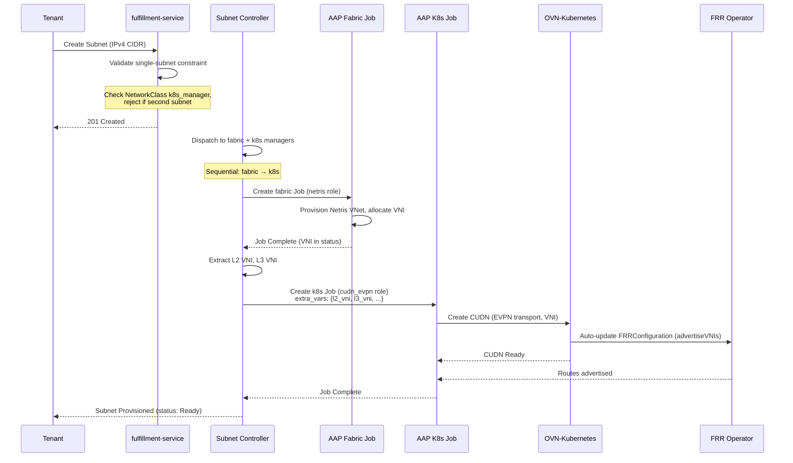

# K8s Manager — OVN EVPN Phase 1: Single-Cluster VM-to-Fabric Bridging

## Summary

This design extends OSAC-1433's NetworkClass two-manager architecture with a new k8s manager (`cudn_evpn`) that provisions OVN-Kubernetes ClusterUserDefinedNetwork (CUDN) with EVPN transport, enabling KubeVirt VMs to join the physical fabric via BGP EVPN route advertisement. The design covers sequential provisioning (fabric → k8s manager data flow), CUDN lifecycle, single-subnet validation, and integration test patterns. FRRConfiguration for BGP underlay peering is an installation prerequisite (not created by k8s manager); OVN-Kubernetes auto-updates it when CUDN appears. See [PRD](prd.md) for detailed requirements.

## Related Designs

This design builds on and interacts with several networking designs:

- **OSAC-1435 VMaaS Networking** — VMs provisioned via `ComputeNetworkAttachment` consume the cudn_evpn namespaces created by this design. VMaaS placement logic must resolve the manager-prefixed namespace name (`cudn-evpn-{subnet_name}`) when placing VMs in EVPN-bridged Subnets.
- **OSAC-1436 CaaS Networking** — CaaS clusters may run on EVPN-bridged subnets. Port-move primitive compatibility with EVPN transport (VXLAN encap vs VLAN trunking) is TBD (out of scope for Phase 1).
- **OSAC-1437 BMaaS Networking** — Bare-metal servers provisioned via `BareMetalNetworkAttachment` are L2/L3 peers of EVPN-bridged VMs. This design validates same-subnet (L2) and cross-subnet (L3 via fabric ipVRF) connectivity in test cases.
- **OSAC-1433 Default Networking** — Auto-provisioning of VN/Subnet/SG/NAT at tenant onboarding uses a default NetworkClass. `cudn_evpn` is **not suitable** as the default NetworkClass due to manual prerequisites (VTEP, FRR, BGP underlay). Default networking should use a simpler k8s manager (e.g., cudn_localnet or none).
- **OSAC-2135 CaaS BM Worker Provisioning** — System-tenant bare-metal instances reference tenant Subnets. If those Subnets use `cudn_evpn`, the BMI provisioning flow interacts with the EVPN namespace/CUDN. Interaction is TBD (out of scope for Phase 1).
- **OSAC-1382 Multi-Fabric East-West** — Phase 1 east-west isolation domains will need to work across EVPN-bridged and non-EVPN subnets. Inter-domain routing with EVPN transport is TBD (out of scope for Phase 1).

## Motivation

OSAC runs VMs on OpenShift using KubeVirt. VM IP addresses exist only within the OVN overlay network and are not visible on the physical fabric. This prevents VMs from sharing L2 subnets with bare-metal servers or being directly reachable from the fabric, blocking workloads that span VMs and bare-metal infrastructure.

The CUDN LocalNet approach (OSAC-1511) was frozen in favor of OVN EVPN, which provides better scalability and multi-cluster support (validated by OSAC-1717 spike). This design delivers single-cluster EVPN bridging as Phase 1, with a constraint that OVN-Kubernetes cannot currently route between separate CUDNs on the same cluster (Connectors feature pending).

**Implementation Context:**  
OSAC's NetworkClass dispatcher already supports dual-manager provisioning (fabric + k8s). This design adds the second k8s manager type (`cudn_evpn` alongside existing `cudn_localnet`) and solves the fabric-to-k8s data dependency: fabric manager allocates VNI, k8s manager consumes it to configure CUDN. The current multi-target provisioning evaluates targets sequentially within each reconcile cycle (both can be in-flight simultaneously on AAP); this design adds a gate to ensure the fabric target completes and produces output before the k8s target is evaluated.

### Goals

- Reuse NetworkClass dispatcher pattern and two-manager architecture from OSAC-1433
- Sequential provisioning pattern reusable for future fabric-to-k8s dependencies
- Single-subnet constraint enforced at fulfillment-service API layer (fails fast)
- K8s manager playbook creates CUDN as Kubernetes-native resource (no external API calls)
- FRRConfiguration for BGP underlay peering is installation prerequisite (auto-updated by OVN-Kubernetes, not by k8s manager)
- Installation prerequisites documented for Cloud Infrastructure Admin

### Non-Goals

- Multi-cluster VM placement (deferred to OSAC-3667 Phase 2)
- Inter-subnet L3 routing between VMs on same cluster (requires OVN Connectors)
- IPv6 or dual-stack support (Phase 1 is IPv4-only)
- Automatic gateway MAC coordination (manual prerequisite)
- Automatic VTEP provisioning (manual prerequisite)

## Proposal

This design introduces a new k8s manager (`cudn_evpn`) registered via osac-installer ConfigMap, used when a NetworkClass declares `k8s_manager: "cudn_evpn"`. Subnet provisioning sequence:

1. **Fabric manager** (Netris) provisions VNet, allocates L2 VNI (macVRF) and L3 VNI (ipVRF)
2. **Subnet controller** extracts VNI from fabric job status via AAP Job CR
3. **K8s manager** (cudn_evpn) provisions CUDN with EVPN transport; OVN-Kubernetes auto-updates FRRConfiguration when CUDN appears

Key resources:
- **NetworkClass** (fulfillment-service): extended with `k8s_manager` field (already exists)
- **Subnet** (fulfillment-service + osac-operator CRD): validation blocks second subnet per VirtualNetwork when k8s manager requires it
- **ClusterUserDefinedNetwork** (OVN-Kubernetes CRD): k8s manager creates with EVPN transport, macVRF/ipVRF VNI (route targets auto-generated in Phase 1, may be explicit in Phase 2)
- **FRRConfiguration** (FRR operator CRD): installation prerequisite (not created by k8s manager), auto-updated by OVN-Kubernetes when CUDN appears

### Workflow Description

**Actor:** Cloud Infrastructure Admin (prerequisite setup) and Tenant Admin (runtime usage)

**Starting State:** 
- OCP cluster installed with OVN-Kubernetes, FRR operator, NMState operator
- VTEP CR exists (defines VTEP IPs for each worker node)
- BGP underlay configured (workers peer with fabric switches)
- NetworkClass exists with `fabric_manager: "netris"`, `k8s_manager: "cudn_evpn"`

**Runtime Flow:**



**Error Paths:**

- **Second subnet attempt:** API returns 400 Bad Request with message "NetworkClass with k8s_manager 'cudn_evpn' supports only one subnet per VirtualNetwork due to OVN Connectors limitation."
- **Fabric job failure:** Controller requeues, does not start k8s job until fabric succeeds
- **VNI missing in fabric output:** Controller marks Subnet as Failed, user must check fabric manager logs
- **CUDN creation failure:** K8s job fails, controller requeues, Subnet status shows Failed with AAP job reference

### API Extensions

**New:**
- osac-installer ConfigMap `k8s-manager-cudn-evpn` (declares k8s manager capabilities)
- osac-aap fabric manager template role `netris` (creates Netris VPC/VNet, returns VNI)
- osac-aap k8s manager template role `cudn_evpn` (creates CUDN)

**Modified:**
- fulfillment-service Subnet gRPC handler: conditional validation for single-subnet constraint
- osac-operator Subnet controller: sequential provisioning instead of parallel

**External CRDs Used (not created by OSAC):**
- `ClusterUserDefinedNetwork` (k8s.ovn.org/v1, OVN-Kubernetes) — created by k8s manager
- `FRRConfiguration` (frrk8s.metallb.io/v1beta1, FRR operator) — installation prerequisite, auto-updated by OVN-Kubernetes when CUDN appears
- `VTEP` (k8s.ovn.org/v1, OVN-Kubernetes) — prerequisite, not created by k8s manager

**No changes** to existing fulfillment-service proto schema. NetworkClass.k8s_manager field already exists.


## UX Alignment

*Skip this section — no `osac-ux` temp-api file exists for NetworkClass or Subnet (backend-only feature).*

### Implementation Details/Notes/Constraints

#### fulfillment-service: Subnet Validation

**Single-Subnet Constraint**

Conditional validation in Subnet gRPC `Create()` handler:

```go
// internal/servers/subnet_server.go
func (s *SubnetServer) Create(ctx context.Context, req *v1.CreateSubnetRequest) (*v1.CreateSubnetResponse, error) {
    // ... existing validation ...
    
    // Fetch parent VirtualNetwork to get NetworkClass
    vnetResp, err := s.virtualNetworkServer.Get(ctx, &v1.GetVirtualNetworkRequest{
        Id: req.GetSubnet().GetSpec().GetVirtualNetwork(),
    })
    if err != nil {
        return nil, status.Errorf(codes.Internal, "failed to fetch parent VirtualNetwork: %v", err)
    }
    
    // Fetch NetworkClass to check k8s_manager
    ncResp, err := s.networkClassServer.Get(ctx, &v1.GetNetworkClassRequest{
        Id: vnetResp.GetVirtualNetwork().GetSpec().GetNetworkClass(),
    })
    if err != nil {
        return nil, status.Errorf(codes.Internal, "failed to fetch NetworkClass: %v", err)
    }
    
    // Enforce single-subnet constraint if k8s manager declares capability
    k8sManager := ncResp.GetNetworkClass().GetKubernetesManager()
    if k8sManager != "" {
        // Look up k8s manager capabilities from NetworkClass capabilities field
        // (populated by NetworkClass controller from k8s manager ConfigMap during registration)
        caps := ncResp.GetNetworkClass().GetCapabilities()
        // Check for single_subnet_per_vn capability (set by cudn_evpn and future managers with this constraint)
        if caps.GetSingleSubnetPerVirtualNetwork() {
            // Count existing subnets under this VirtualNetwork
            listResp, err := s.List(ctx, &v1.ListSubnetsRequest{
                Filter: fmt.Sprintf("spec.virtualNetwork='%s'", vnetResp.GetVirtualNetwork().GetId()),
            })
            if err != nil {
                return nil, status.Errorf(codes.Internal, "failed to list existing subnets: %v", err)
            }
            
            if len(listResp.GetSubnets()) > 0 {
                return nil, status.Errorf(codes.FailedPrecondition,
                    "NetworkClass with k8s_manager %q supports only one subnet per VirtualNetwork. "+
                    "VirtualNetwork %q already has subnet %q. OVN Connectors feature (routing between CUDNs) is pending.",
                    k8sManager,
                    vnetResp.GetVirtualNetwork().GetMetadata().GetName(),
                    listResp.GetSubnets()[0].GetMetadata().GetName())
            }
        }
    }
    
    // ... continue with normal create flow ...
}
```

**Rationale:**
- Service-side validation (vs operator webhook) provides immediate error feedback to API clients
- Conditional on NetworkClass.k8s_manager preserves multi-subnet support for other k8s managers
- Error message references OVN Connectors to explain the temporary limitation
- [PRD: In Scope — single-subnet constraint] [Locked: D4]

#### osac-operator: Sequential Provisioning

**Provisioning Package Extension:**

Sequential provisioning is implemented in the provisioning package (`pkg/provisioning/`) for reusability across controllers. The `JobTarget` struct is extended with dependency fields:

```go
// pkg/provisioning/types.go (new fields)
type JobTarget struct {
    Name                 string
    Provider             ProvisioningProvider
    Callbacks            PollCallbacks
    CheckAPIServer       bool
    AbsorbsLegacyHistory bool
    DependsOn            string                 // NEW: name of target that must complete first
    ExtraVarsFrom        string                 // NEW: name of target whose ConfigMap provides extra vars
    ExtraVarsConfigMap   string                 // NEW: ConfigMap name for output (created by fabric manager)
}
```

The `RunMultiTargetProvisioningLifecycle` function handles ordering generically:

```go
// pkg/provisioning/lifecycle.go (modified)
func RunMultiTargetProvisioningLifecycle(
    ctx context.Context,
    targets []JobTarget,
    callbacks TargetCallbacks,
) error {
    // Build dependency graph
    deps := buildDependencyGraph(targets)
    
    for _, target := range targets {
        // Gate dependent targets on their dependency's completion
        if target.DependsOn != "" {
            depTarget := findTargetByName(targets, target.DependsOn)
            if !isTargetComplete(depTarget, callbacks) {
                // Dependency not complete yet - skip this target, will eval next reconcile
                continue
            }
            
            // Extract output vars from dependency's ConfigMap and merge
            if target.ExtraVarsFrom != "" {
                extraVars, err := extractExtraVarsFromConfigMap(ctx, target.ExtraVarsFrom)
                if err != nil {
                    return fmt.Errorf("failed to extract extra vars from %s: %w", target.ExtraVarsFrom, err)
                }
                // Merge into target's extra vars
                for k, v := range extraVars {
                    target.ExtraVars[k] = v
                }
            }
        }
        
        // Run provisioning for this target (existing logic)
        if err := runTargetProvisioningLifecycle(ctx, target, callbacks); err != nil {
            return err
        }
    }
    
    return nil
}

func extractExtraVarsFromConfigMap(ctx context.Context, configMapName string) (map[string]interface{}, error) {
    // Fetch ConfigMap created by fabric manager
    cm := &corev1.ConfigMap{}
    if err := client.Get(ctx, client.ObjectKey{Namespace: "osac", Name: configMapName}, cm); err != nil {
        return nil, err
    }
    
    // Parse JSON data from ConfigMap
    // Fabric manager writes: {"l2_vni": 14, "l3_vni": 11, "fabric_reserved_range": "200.200.1.1/32,200.200.1.100-200.200.1.200"}
    var extraVars map[string]interface{}
    if err := json.Unmarshal([]byte(cm.Data["extra_vars"]), &extraVars); err != nil {
        return nil, fmt.Errorf("failed to parse ConfigMap data: %w", err)
    }
    
    return extraVars, nil
}
```

**Subnet Controller Usage:**

The controller builds targets with dependency annotations:

```go
// internal/controller/subnet_controller.go (modified)
func (r *SubnetReconciler) Reconcile(ctx context.Context, req reconcile.Request) (reconcile.Result, error) {
    subnet := &osacv1.Subnet{}
    if err := r.Get(ctx, req.NamespacedName, subnet); err != nil {
        return reconcile.Result{}, client.IgnoreNotFound(err)
    }
    
    // Dispatch to fabric + k8s managers
    plan, err := r.Dispatcher.Dispatch(ctx, "Subnet", getNetworkClassID(subnet))
    if err != nil {
        return reconcile.Result{}, err
    }
    
    // Build targets with dependencies
    var targets []provisioning.JobTarget
    for _, dispatchTarget := range plan.Targets {
        target := provisioning.JobTarget{
            Name:         dispatchTarget.TemplateName,
            TemplateName: dispatchTarget.TemplateName,
            ExtraVars:    dispatchTarget.ExtraVars,
            // ... other fields ...
        }
        
        // If this is a k8s manager and a fabric manager exists, add dependency
        if dispatchTarget.Role == dispatcher.K8sManager {
            fabricTarget := plan.GetFabricTarget()
            if fabricTarget != nil {
                target.DependsOn = fabricTarget.TemplateName
                target.ExtraVarsFrom = fmt.Sprintf("subnet-%s-fabric-output", subnet.GetName())
                // Fabric manager will create this ConfigMap with VNI data
            }
        }
        
        // If this is a fabric manager, specify output ConfigMap
        if dispatchTarget.Role == dispatcher.FabricManager {
            target.ExtraVarsConfigMap = fmt.Sprintf("subnet-%s-fabric-output", subnet.GetName())
        }
        
        targets = append(targets, target)
    }
    
    // Provisioning package handles ordering generically
    return provisioning.RunMultiTargetProvisioningLifecycle(ctx, targets, r.buildCallbacks(subnet))
}

func getNetworkClassID(subnet *osacv1.Subnet) string {
    // Subnet CR references VirtualNetwork, which has osac.openshift.io/network-class-id annotation
    // Dispatcher uses this annotation to resolve the NetworkClass
    // (Annotation is set by VirtualNetwork feedback controller when VN is created)
    return subnet.Annotations["osac.openshift.io/network-class-id"]
}
```

**Rationale:**
- Sequential logic in provisioning package (not controller) makes it reusable for ANY future fabric→k8s dependency
- Controllers declaratively specify dependencies via `DependsOn` and `ExtraVarsFrom` fields
- ConfigMap data path is explicit and verified (not an assumption like AAP Job CR status.extraVars)
- Fabric manager creates ConfigMap with output, k8s manager consumes it — manager-agnostic interface
- [Research: §Sequential Provisioning Patterns] [PRD: In Scope — fabric-to-k8s data dependency]

#### osac-aap: netris Fabric Manager Role

This design **extends the existing netris role** (`collections/ansible_collections/osac/templates/roles/netris/`) by adding VirtualNetwork and Subnet provisioning tasks. The existing role already handles SecurityGroup, ExternalIP, and NATGateway provisioning — those task files remain unchanged.

**New Task Files:**

```
collections/ansible_collections/osac/templates/roles/netris/tasks/
├── create_virtual_network.yaml      # NEW: Create Netris VPC, return L3 VNI
├── create_subnet.yaml               # NEW: Create Netris VNet, return L2 VNI
├── delete_virtual_network.yaml      # NEW: Delete Netris VPC
└── delete_subnet.yaml               # NEW: Delete Netris VNet
```

The existing `meta/osac.yaml` already declares `fabric_manager: netris` with capabilities — no changes needed there. For reference, the existing schema:

```yaml
---
fabric_manager: netris
capabilities:
  supports_ipv4: true
  supports_ipv6: false
  supports_dual_stack: false
```

**tasks/create_subnet.yaml:**

```yaml
---
- name: Extract Subnet and VirtualNetwork details
  ansible.builtin.set_fact:
    subnet_cidr: "{{ osac_job_vars.resource.spec.ipv4CIDR }}"
    vnet_name: "{{ osac_job_vars.resource.spec.virtualNetwork }}"
    tenant_id: "{{ osac_job_vars.resource.metadata.annotations['osac.openshift.io/tenant'] }}"

- name: Create or get Netris VPC for VirtualNetwork
  netris.controller.vpc:
    name: "{{ vnet_name }}"
    tenant: "{{ tenant_id }}"
    state: present
  register: vpc_result
  # Netris VPC maps to OSAC VirtualNetwork (L3 VNI allocated)

- name: Create Netris VNet (subnet within VPC)
  netris.controller.vnet:
    name: "{{ osac_job_vars.resource.metadata.name }}"
    vpc: "{{ vpc_result.vpc.name }}"
    cidr: "{{ subnet_cidr }}"
    tenant: "{{ tenant_id }}"
    state: present
  register: vnet_result
  # Netris VNet maps to OSAC Subnet (L2 VNI allocated)
  # DHCP enabled by default — coexists safely with OVN DHCP (OVN intercepts inside logical switch)
  # Netris SVI owns the gateway IP (e.g. .1) — EVPN CUDNs create no OVN logical router port, fabric routes L3

- name: Extract VNI and reserved range from Netris response
  ansible.builtin.set_fact:
    l2_vni: "{{ vnet_result.vnet.l2_vni }}"
    l3_vni: "{{ vpc_result.vpc.l3_vni }}"
    fabric_reserved_range: "{{ vnet_result.vnet.gateway_range }}"  # e.g. 200.200.1.0/26 (SVIs + DHCP pool) - generic name for any fabric manager

- name: Publish VNI data for k8s manager via ConfigMap
  kubernetes.core.k8s:
    state: present
    definition:
      apiVersion: v1
      kind: ConfigMap
      metadata:
        name: "{{ osac_job_vars.configmap_name }}"  # Set by controller: subnet-{name}-fabric-output
        namespace: osac
      data:
        extra_vars: |
          {
            "l2_vni": {{ l2_vni }},
            "l3_vni": {{ l3_vni }},
            "fabric_reserved_range": "{{ fabric_reserved_range }}",
            "vnet_id": "{{ vnet_result.vnet.id }}"
          }
  # ConfigMap is consumed by k8s manager (provisioning package extracts and merges into k8s job extra_vars)
  # Generic field names (fabric_reserved_range, not netris_reserved_range) allow any fabric manager to provide output
```

**tasks/delete_subnet.yaml:**

```yaml
---
- name: Extract VNet name
  ansible.builtin.set_fact:
    vnet_name: "{{ osac_job_vars.resource.metadata.name }}"

- name: Delete Netris VNet
  netris.controller.vnet:
    name: "{{ vnet_name }}"
    state: absent
  # VPC remains (may have other VNets)

- name: Delete fabric output ConfigMap
  kubernetes.core.k8s:
    state: absent
    api_version: v1
    kind: ConfigMap
    name: "{{ osac_job_vars.configmap_name }}"
    namespace: osac
  ignore_errors: yes  # May not exist if create failed early
```

**Rationale:**
- Netris VPC (ipVRF) maps to VirtualNetwork (L3 VNI for cross-subnet routing via fabric)
- Netris VNet (macVRF) maps to Subnet (L2 VNI for same-subnet bridging)
- VPC is created/fetched idempotently (multiple Subnets under same VirtualNetwork reuse VPC)
- **ConfigMap data path** (not set_stats → AAP Job CR) — verified approach, set_stats does not populate Job CR status.extraVars
- Generic field names (`fabric_reserved_range`, not `netris_reserved_range`) make output contract reusable for future fabric managers (OpenStack Neutron, Cisco ACI)
- Route targets not returned in Phase 1 - CUDN auto-generates as "AS:VNI"
- **Reserved range (fabric_reserved_range) is mandatory output** — prevents OVN IPAM collision with fabric SVIs and DHCP (correctness bug if missing)
- K8s manager validates reserved range presence and fails if missing
- Netris SVI owns the gateway IP — EVPN CUDNs delegate L3 routing to fabric (no OVN logical router port created)

#### osac-aap: cudn_evpn K8s Manager Role

**Role Structure:**

```
collections/ansible_collections/osac/templates/roles/cudn_evpn/
├── meta/
│   └── osac.yaml                    # Capability declaration
├── tasks/
│   ├── create_subnet.yaml           # Create CUDN + FRRConfiguration
│   └── delete_subnet.yaml           # Delete VMs → wait → delete CUDN → delete namespace (ordered cleanup)
└── templates/
    └── cudn.yaml.j2                 # CUDN CR template
```

**meta/osac.yaml:**

```yaml
---
k8s_manager: cudn_evpn
capabilities:
  supports_ipv4: true
  supports_ipv6: false
  supports_dual_stack: false
  dpu_support: false
```

**tasks/create_subnet.yaml:**

```yaml
---
- name: Validate required VNI and reserved range from fabric job
  ansible.builtin.assert:
    that:
      - osac_job_vars.extra_vars.l2_vni is defined
      - osac_job_vars.extra_vars.l3_vni is defined
      - osac_job_vars.extra_vars.fabric_reserved_range is defined
    fail_msg: "Fabric job must provide l2_vni, l3_vni, and fabric_reserved_range. Missing data prevents IP collision avoidance (correctness bug)."

- name: Extract VNI values from extra_vars
  ansible.builtin.set_fact:
    l2_vni: "{{ osac_job_vars.extra_vars.l2_vni }}"
    l3_vni: "{{ osac_job_vars.extra_vars.l3_vni }}"
    fabric_reserved_range: "{{ osac_job_vars.extra_vars.fabric_reserved_range }}"  # Fabric SVI + DHCP range (REQUIRED) - generic name works with any fabric manager
    subnet_cidr: "{{ osac_job_vars.resource.spec.ipv4CIDR }}"
    subnet_name: "{{ osac_job_vars.resource.metadata.name }}"  # Subnet CR name (namespace owner)
    vnet_name: "{{ osac_job_vars.resource.spec.virtualNetwork }}"  # VirtualNetwork name (CUDN name)
    tenant_id: "{{ osac_job_vars.resource.metadata.annotations['osac.openshift.io/tenant'] }}"
    namespace_name: "cudn-evpn-{{ subnet_name }}"  # Manager-scoped to prevent collision with other k8s managers

- name: Create tenant workload namespace
  kubernetes.core.k8s:
    state: present
    definition:
      apiVersion: v1
      kind: Namespace
      metadata:
        name: "{{ namespace_name }}"  # Manager-prefixed: cudn-evpn-{subnet_name}
        labels:
          tenant: "{{ tenant_id }}"
          virtual-network: "{{ vnet_name }}"
          k8s.ovn.org/primary-user-defined-network: ""
          osac.openshift.io/k8s-manager: "cudn_evpn"  # Identifies which manager created this namespace
        annotations:
          osac.openshift.io/tenant: "{{ tenant_id }}"
          osac.openshift.io/owner-reference: "Subnet/{{ subnet_name }}"

- name: Create ClusterUserDefinedNetwork
  kubernetes.core.k8s:
    state: present
    definition:
      apiVersion: k8s.ovn.org/v1
      kind: ClusterUserDefinedNetwork
      metadata:
        name: "{{ vnet_name }}"
        labels:
          evpn: "true"  # Picked up by RouteAdvertisements
        annotations:
          osac.openshift.io/tenant: "{{ tenant_id }}"
          osac.openshift.io/owner-reference: "VirtualNetwork/{{ vnet_name }}"
      spec:
        namespaceSelector:
          matchLabels:
            virtual-network: "{{ vnet_name }}"  # Selects namespace(s) for this VirtualNetwork
        network:
          topology: Layer2
          transport: EVPN
          layer2:
            role: Primary
            subnets:
              - "{{ subnet_cidr }}"
            excludeSubnets:
              - "{{ fabric_reserved_range }}"  # REQUIRED: Fabric SVIs + DHCP range (prevents IP collision - correctness bug if omitted)
            # defaultGatewayIPs omitted - OVN auto-picks .1, which Netris SVI answers
          evpn:
            vtep: tenant-vtep  # Cluster-wide singleton VTEP
            macVRF:
              vni: "{{ l2_vni | int }}"
              # routeTarget omitted in Phase 1 - CUDN auto-generates as "AS:VNI"
              # Phase 2 multi-cluster may require explicit RT control
            ipVRF:
              vni: "{{ l3_vni | int }}"
              # routeTarget omitted in Phase 1 - CUDN auto-generates as "AS:VNI"
              # Phase 2 multi-cluster may require explicit RT control

- name: Wait for CUDN to be Ready
  kubernetes.core.k8s_info:
    api_version: k8s.ovn.org/v1
    kind: ClusterUserDefinedNetwork
    name: "{{ vnet_name }}"
  register: cudn_status
  until: cudn_status.resources[0].status.conditions | selectattr('type', 'equalto', 'Ready') | selectattr('status', 'equalto', 'True') | list | length > 0
  retries: 30
  delay: 10

- name: Update Subnet CR status with CUDN details
  ansible.builtin.set_stats:
    data:
      cudn_name: "{{ vnet_name }}"
      cudn_namespace: "{{ namespace_name }}"  # Manager-prefixed namespace
      vrf_name: "{{ cudn_status.resources[0].status.vrfName }}"
```

**Rationale:**
- **Namespace name = Manager-prefixed Subnet name** (`cudn-evpn-{subnet_name}`) to prevent collision with other k8s managers (e.g., cudn_net also creates namespaces per Subnet)
- **CUDN name = VirtualNetwork name** (Phase 1: one CUDN per VirtualNetwork due to single-subnet constraint)
- CUDN namespaceSelector matches by `virtual-network` label (selects namespace(s) for this VirtualNetwork)
- Namespace label `k8s.ovn.org/primary-user-defined-network` required for UDN as primary network
- Namespace label `osac.openshift.io/k8s-manager: "cudn_evpn"` identifies which manager owns the namespace
- VTEP reference = `tenant-vtep` (cluster singleton, installation prerequisite)
- VNI values (L2 macVRF, L3 ipVRF) from extra_vars (passed by provisioning package from fabric ConfigMap output)
- Route targets omitted in Phase 1 — CUDN auto-generates as "AS:VNI" (Phase 2 multi-cluster may require explicit RT control for inter-cluster route distribution)
- Wait for CUDN Ready before completing (prevents race with VM provisioning)
- **excludeSubnets (REQUIRED)** prevents OVN IPAM from allocating IPs in fabric-managed range (SVIs, DHCP) — mandatory for correctness (collision causes connectivity failure)
- Validation fails k8s job if fabric_reserved_range missing from fabric job ConfigMap (generic name works with any fabric manager)
- defaultGatewayIPs omitted — OVN auto-picks .1, which fabric SVI answers (documented working behavior)
- set_stats publishes CUDN details (used by controller for status update, not for inter-job flow)
- [Demo: Phase 5.2 CUDN structure] [Research: §Existing Solutions — OVN-K CUDN]

**tasks/delete_subnet.yaml:**

```yaml
---
# Prerequisite: Subnet controller validates no ComputeInstances exist before triggering this job
# Separation of concerns: ComputeInstance controller owns VM lifecycle, not networking playbook

- name: Extract resource identifiers
  ansible.builtin.set_fact:
    subnet_name: "{{ osac_job_vars.resource.metadata.name }}"  # Subnet CR name
    vnet_name: "{{ osac_job_vars.resource.spec.virtualNetwork }}"  # VirtualNetwork name (CUDN name)
    namespace_name: "cudn-evpn-{{ osac_job_vars.resource.metadata.name }}"  # Manager-prefixed namespace

- name: Delete ClusterUserDefinedNetwork
  kubernetes.core.k8s:
    api_version: k8s.ovn.org/v1
    kind: ClusterUserDefinedNetwork
    name: "{{ vnet_name }}"
    state: absent

- name: Wait for CUDN fully deleted (not just deletionTimestamp set)
  kubernetes.core.k8s_info:
    api_version: k8s.ovn.org/v1
    kind: ClusterUserDefinedNetwork
    name: "{{ vnet_name }}"
  register: cudn_check
  until: cudn_check.resources | length == 0
  retries: 30
  delay: 10
  # Wait for full deletion (not just deletionTimestamp) to ensure OVN has released VNI
  # Mitigates VNI reuse race: Netris deletes VNet only after CUDN gone (see Controller deletion ordering)

- name: Delete namespace
  kubernetes.core.k8s:
    api_version: v1
    kind: Namespace
    name: "{{ namespace_name }}"
    state: absent
  # Namespace deleted after CUDN gone
```

**Subnet Controller Pre-Delete Validation:**

The Subnet controller (not the playbook) enforces deletion ordering:

```go
// internal/controller/subnet_controller.go
func (r *SubnetReconciler) handleDelete(ctx context.Context, subnet *osacv1.Subnet) (reconcile.Result, error) {
    // Check for ComputeInstances in the Subnet's namespace before deprov job
    namespace := fmt.Sprintf("cudn-evpn-%s", subnet.GetName())
    vmList := &kubevirtv1.VirtualMachineList{}
    if err := r.List(ctx, vmList, client.InNamespace(namespace)); err != nil {
        return reconcile.Result{}, err
    }
    
    if len(vmList.Items) > 0 {
        r.Recorder.Event(subnet, corev1.EventTypeWarning, "DeletionBlocked",
            fmt.Sprintf("Cannot delete Subnet while %d VMs exist in namespace %s. Delete VMs first.", len(vmList.Items), namespace))
        // Requeue - ComputeInstance controller will delete VMs when their CRs are deleted
        return reconcile.Result{RequeueAfter: 30 * time.Second}, nil
    }
    
    // Safe to proceed - no VMs in namespace
    // Run deprovision job (CUDN delete → namespace delete)
    // Then trigger fabric deprovision (Netris VNet delete) only after CUDN fully deleted
    return r.runDeprovisionJob(ctx, subnet)
}
```

**Deletion Rationale:**
- **Controller validation** (not playbook) enforces VM deletion prerequisite — separation of concerns (ComputeInstance controller owns VM lifecycle)
- Playbook deletes: CUDN → wait fully deleted → namespace
- **CUDN wait for full deletion** (not just deletionTimestamp) ensures OVN has released VNI before fabric deprovision
- **Fabric deprovision after CUDN deleted** mitigates VNI reuse race (Netris may reuse VNI if VNet deleted while CUDN still exists)
- Namespace delete safe after CUDN gone (no finalizer race)
- **Stale VRF recovery (if needed):** See Support Procedures — manual troubleshooting step, not automated (ovnkube-node restart affects all VMs on node, too disruptive for routine delete)

**FRRConfiguration Handling:**

FRRConfiguration for underlay BGP peering is created during installation (manual prerequisite). The k8s manager does **not** create or modify FRRConfiguration. OVN-Kubernetes auto-updates FRR config when CUDN with `evpn: "true"` label is created.

Per demo Phase 5.3:
> "On CUDN creation, BGP FRR configuration is updated... advertise-all-vni"

The RouteAdvertisements CR (installation prerequisite) defines `frrConfigurationSelector: {matchLabels: {evpn: "true"}}`, which tells OVN-K to update any FRRConfiguration with that label when a CUDN with matching label appears.

**Assumption:** Installation-time FRRConfiguration exists in `openshift-frr-k8s` namespace with label `evpn: "true"`. K8s manager only creates CUDN; FRR integration is declarative via label matching.

[Demo: Phase 2.6 FRRConfiguration, Phase 2.5 RouteAdvertisements] [Research: §FRR Operator — advertiseVNIs]

**DHCP Coexistence:**

Both Netris and OVN run DHCP servers for the same subnet:
- **Netris DHCP:** Enabled by default on VNet creation (e.g., 200.200.1.50-254)
- **OVN DHCP:** Runs inside the logical switch for the CUDN subnet

**Observed behavior (validated in testing):**
OVN intercepts DHCP requests inside the logical switch before they reach the fabric. VMs receive IP addresses from OVN DHCP and never see Netris DHCP offers. The two DHCP servers coexist safely without conflict.

**IP allocation strategy (REQUIRED for correctness):**
- **`excludeSubnets` is mandatory** — prevents OVN IPAM from allocating IPs in the fabric-reserved range (SVIs + DHCP pool)
- Without `excludeSubnets`, OVN may allocate IPs that the fabric owns (e.g., gateway .1, SVI IPs, DHCP pool) causing connectivity failures
- Fabric manager must return `fabric_reserved_range` in ConfigMap output (e.g., `200.200.1.0/26` for SVIs + DHCP low range) — generic name works with any fabric manager (Netris, OpenStack Neutron, Cisco ACI)
- K8s manager validates `fabric_reserved_range` presence and fails provisioning if missing (prevents silent collision)

**Operational notes:**
- Netris DHCP can remain enabled (no configuration change needed) — it serves bare-metal nodes on the fabric
- OVN DHCP serves only VMs in the CUDN namespace (encapsulated traffic never reaches Netris DHCP)
- For clarity in troubleshooting, consider disabling Netris DHCP for EVPN-bridged VNets (optional)

[Testing: Validated in demo environment — VM receives IP from OVN, Netris DHCP logs show no requests from VM MAC]

**Gateway Ownership (Critical Architecture Decision):**

EVPN CUDNs with `transport: EVPN` do **not** create an OVN logical router port for the gateway. This is fundamentally different from LocalNet CUDNs.

**What happens:**
1. OVN DHCP provides a gateway IP to VMs (e.g., 200.200.1.1)
2. **No OVN logical router port exists for that IP**
3. VM ARPs for the gateway → ARP request is bridged to the fabric via EVPN Type-2 route
4. **Netris SVI answers the ARP** (Netris owns the gateway IP, advertises it via EVPN)
5. VM sends L3 traffic to the gateway MAC (Netris SVI MAC)
6. Traffic is encapsulated (VXLAN) and forwarded to the fabric switch
7. Fabric switch decapsulates and routes (ipVRF)

**Consequence:**
Without a fabric gateway (Netris SVI), VMs have **L2 connectivity only** — no L3 routing. The gateway IP in CUDN's `defaultGatewayIPs` (or auto-picked .1) must be owned by the fabric, not OVN.

**Phase 1 behavior:**
- `defaultGatewayIPs` omitted from CUDN spec
- OVN auto-picks .1 as gateway IP (advertised via DHCP)
- Netris SVI must be configured to own .1 (manual prerequisite, validated in demo)
- If Netris SVI is not configured with the same IP, VMs cannot route off-subnet

**Why this architecture:**
EVPN transport delegates routing to the fabric. OVN provides L2 switching only (macVRF). The fabric provides L3 routing (ipVRF). This is by design for fabric-integrated VM networking.

**Contrast with LocalNet:**
- LocalNet CUDNs create an OVN distributed logical router (DLR) port
- OVN owns the gateway IP, handles routing
- No fabric dependency for L3 traffic

**Validation:**
Demo environment confirmed: OVN logical router has no port for the CUDN subnet. `ovn-nbctl show` does not list the gateway IP. Netris SVI owns it exclusively.

[Demo: Phase 5 CUDN creation, Phase 7 VM-to-fabric L3 test] [Testing: Validated — no OVN logical router port created, Netris SVI answers gateway ARP]

#### osac-installer: K8s Manager Registration

**New ConfigMap:**

```yaml
apiVersion: v1
kind: ConfigMap
metadata:
  name: k8s-manager-cudn-evpn
  namespace: osac
  labels:
    osac.openshift.io/network/k8s-manager: "true"  # Matches OSAC-1433 label path
data:
  name: cudn_evpn  # Field name 'name' per OSAC-1433 schema (not 'manager')
  description: "OVN-Kubernetes CUDN with EVPN transport for VM-to-fabric bridging (IPv4 only)"
  capabilities: "supports_ipv4:true,supports_ipv6:false,single_subnet_per_vn:true"  # Comma-separated string per OSAC-1433
  # template_role field removed - not in OSAC-1433 spec, dispatcher resolves role name from k8s_manager field
```

**Capability Fields:**
- `supports_ipv4:true` — IPv4 address family supported
- `supports_ipv6:false` — IPv6 not supported in Phase 1
- `single_subnet_per_vn:true` — NEW capability: enforces single-subnet-per-VirtualNetwork constraint (checked by fulfillment-service validation)

The `single_subnet_per_vn` capability is checked by fulfillment-service Subnet validation (see Subnet Validation section above) to make the constraint pluggable for future k8s managers.
```

**RBAC:**

```yaml
apiVersion: rbac.authorization.k8s.io/v1
kind: ClusterRole
metadata:
  name: osac-aap-cudn-evpn
rules:
- apiGroups: ["k8s.ovn.org"]
  resources: ["clusteruserdefinednetworks"]
  verbs: ["create", "get", "list", "watch", "update", "patch", "delete"]
- apiGroups: ["k8s.ovn.org"]
  resources: ["vteps"]
  verbs: ["get", "list"]  # Read-only, VTEP is prerequisite
---
apiVersion: rbac.authorization.k8s.io/v1
kind: ClusterRoleBinding
metadata:
  name: osac-aap-cudn-evpn
roleRef:
  apiGroup: rbac.authorization.k8s.io
  kind: ClusterRole
  name: osac-aap-cudn-evpn
subjects:
- kind: ServiceAccount
  name: osac-aap-runner  # AAP job execution SA
  namespace: osac
```

**Rationale:**
- ConfigMap registration follows existing pattern (cudn_localnet)
- RBAC grants CUDN create/delete, VTEP read-only
- No FRRConfiguration RBAC needed (not created by k8s manager)
- [Codebase: osac/osac-installer/charts/osac/templates/k8s-manager-*.yaml]


### Security Considerations

**Tenant Isolation:**

All OSAC resources include standard tenant isolation metadata:
- `osac.openshift.io/tenant` annotation on CUDN and namespace
- `osac.openshift.io/owner-reference` annotation linking CUDN to parent VirtualNetwork
- OPA policies enforce read/write isolation at fulfillment-service API layer

**New Isolation Boundary:**

CUDN namespace selector uses `matchLabels: {virtual-network: "<vnet-name>"}`. Phase 1: Each VirtualNetwork has one Subnet with one namespace. VMs in different VirtualNetworks cannot communicate at L2 or L3 (separate macVRF + ipVRF).

**BGP Security:**

Underlay BGP session (OCP ↔ fabric switch) uses MD5 authentication (configured during installation, not managed by OSAC). FRRConfiguration credentials stored in Kubernetes Secret.

**No New Attack Surface:**

- CUDN and FRRConfiguration are cluster-scoped CRDs, not tenant-facing APIs
- Tenants interact only via fulfillment-service Subnet API (existing auth/authz)
- AAP jobs run with service account (RBAC-controlled), not tenant credentials

**Input Validation:**

VNI values from fabric manager are integers (validated by CUDN CRD schema). Route target strings validated by FRR (rejected if malformed). Subnet CIDR validated by fulfillment-service (existing validation).

### Failure Handling and Recovery

**Fabric Job Failure:**

- **What happens:** Netris API error, VNet already exists, quota exceeded
- **Recovery:** Controller requeues Subnet reconciliation, retries fabric job after backoff
- **User observes:** Subnet.status.phase = "Failed", Subnet.status.conditions show fabric job error

**VNI Extraction Failure:**

- **What happens:** Fabric job succeeds but set_stats missing VNI data, or AAP Job CR not found
- **Recovery:** Controller marks Subnet as Failed with event "VNIExtractionFailed"
- **User observes:** Must inspect fabric job logs (AAP UI) to diagnose, then delete/recreate Subnet

**K8s Job Failure:**

- **What happens:** CUDN creation rejected (VNI collision, VTEP not found, invalid route target)
- **Recovery:** Controller requeues, retries k8s job after backoff
- **User observes:** Subnet.status.phase = "Failed", check AAP job logs for CUDN API error

**CUDN VNI Collision:**

- **What happens:** Two Subnets created simultaneously, both get VNI=14 from Netris, second CUDN rejected by OVN-K
- **Recovery:** No automatic recovery — VNI allocation race condition
- **Mitigation:** fulfillment-service API must serialize Subnet creates (database transaction), or Netris must guarantee cluster-wide VNI uniqueness
- **User observes:** Second Subnet fails with "VNI 14 already in use"

**Controller Restart Mid-Reconciliation:**

- **What happens:** Controller crashes after fabric job completes, before k8s job starts
- **Recovery:** Idempotent reconciliation — controller re-reads Subnet status, detects fabric job complete, proceeds to k8s job
- **User observes:** No impact, reconciliation resumes

**Partial Cleanup (Delete Subnet):**

- **What happens:** CUDN deleted but Netris VNet delete fails
- **Recovery:** Finalizer blocks Subnet deletion until Netris cleanup succeeds
- **User observes:** Subnet stuck in "Terminating" state, check fabric manager logs

**OVN-K CUDN Not Ready:**

- **What happens:** CUDN created but OVN-K cannot provision (namespace missing, VTEP down)
- **Recovery:** K8s manager playbook waits for CUDN Ready condition (30 retries × 10s = 5 min timeout), then fails job
- **User observes:** AAP job timeout, check OVN-K operator logs

### RBAC / Tenancy

**Tenant Isolation Enforced:**

- fulfillment-service API: OPA policies filter Subnet list/get by `osac.openshift.io/tenant` annotation
- CUDN and namespace: labeled with `osac.openshift.io/tenant` for traceability (not enforced by K8s RBAC — cluster-scoped CRDs are admin-only)
- VMs: deployed into tenant namespace, NetworkPolicy can further restrict (out of scope)

**No RBAC Changes:**

Existing RBAC model applies. Tenant users interact via fulfillment-service API (gRPC/REST). CUDN and FRRConfiguration are cluster-scoped, created by AAP service account, not directly accessible to tenants.

**Owner Reference Annotations:**

- CUDN annotation `osac.openshift.io/owner-reference: "VirtualNetwork/<vnet-id>"` links to parent
- Used for garbage collection: deleting VirtualNetwork cascades to CUDN via finalizer

### Observability and Monitoring

**New Metrics:**

- `osac_subnet_reconcile_duration_seconds{manager="netris|cudn_evpn"}` — histogram of reconciliation time per manager
- `osac_subnet_vni_extraction_errors_total` — counter of VNI extraction failures
- `osac_subnet_sequential_provisioning_wait_seconds` — gauge of time between fabric job complete and k8s job start

**New Kubernetes Events:**

- `VNIExtractionFailed` (Warning): fabric job succeeded but VNI data missing/invalid
- `K8sManagerWaitingForFabric` (Normal): k8s job waiting for fabric job to complete
- `CUDNProvisioningFailed` (Warning): CUDN creation rejected by OVN-K

**Existing Mechanisms:**

- Subnet status conditions (existing): `Provisioned`, `Failed`, `Deleting`
- AAP job history in Subnet.status.jobHistory (existing): shows fabric and k8s job names, phases

**No New Alerts:**

Existing alerts on `osac_subnet_reconcile_failures_total` cover this feature. Threshold: >5% failure rate over 5min indicates systemic issue.

### Risks and Mitigations

| Risk | Mitigation |
|------|------------|
| **VNI allocation race condition** — two Subnets created simultaneously get same VNI | Fabric manager (Netris) guarantees cluster-wide VNI uniqueness atomically. Real risk is VNI reuse during delete+recreate: mitigated by fabric deprovision only after CUDN fully deleted (not just deletionTimestamp set) |
| **Gateway MAC mismatch** — manual coordination step skipped, L3 traffic breaks | Document prerequisite clearly in installation guide, add diagnostic command to compare MACs (kubectl + fabric API) |
| **VTEP not created** — k8s manager assumes VTEP exists, CUDN creation fails | Installation validation script checks VTEP exists before allowing NetworkClass with k8s_manager=cudn_evpn |
| **Fabric output data loss** — fabric job completes but ConfigMap deleted before provisioning package reads it | ConfigMap persists in osac namespace (durable), k8s manager fails if ConfigMap missing (explicit error, not silent failure). ConfigMap cleaned up by fabric manager delete playbook after deprovision. |
| **IPv4-only regression** — future IPv6 support breaks existing CUDNs | CUDN VNI is immutable (delete+recreate required), no in-place upgrade |
| **FRRConfiguration conflict** — multiple OSAC installations on same cluster, label collision | Installation guide warns against multi-instance deployments, OR use namespace-scoped FRRConfiguration selector |
| **Dual DHCP confusion** — both fabric and OVN run DHCP, unclear which serves VMs | Documented behavior: OVN intercepts DHCP inside logical switch, VMs never see fabric DHCP. Both coexist safely. |
| **cudn_evpn coupled to Netris-specific outputs** — k8s manager expects Netris VPC/VNet concepts, won't work with other fabric managers | Generic output contract (`l2_vni`, `l3_vni`, `fabric_reserved_range`) defined for fabric→k8s data flow. Any fabric manager (OpenStack Neutron, Cisco ACI, Netris) can provide this contract without k8s manager changes. Netris role is first implementation of the contract. |

### Drawbacks

**Manual Prerequisites:**

Cloud Infrastructure Admin must configure VTEP, FRRConfiguration, BGP underlay, and gateway MAC coordination before tenants can use this feature. High operational complexity compared to CUDN LocalNet (which required only nmstate, no BGP).

**Trade-off justification:** EVPN scalability (millions of VNIs vs 4096 VLANs) and multi-cluster support (Phase 2) outweigh the installation burden for large deployments.

**Single-Subnet Limitation:**

Tenants cannot create multiple Subnets under one VirtualNetwork when using `cudn_evpn` k8s manager. Must create separate VirtualNetworks for each Subnet.

**Trade-off justification:** OVN Connectors feature is pending. Phase 1 delivers single-cluster EVPN bridging; Phase 2 adds inter-subnet routing.

**Sequential Provisioning Latency:**

Subnet provisioning takes 2× the time of parallel provisioning (fabric job + k8s job serially instead of concurrently).

**Trade-off justification:** Data dependency requires sequencing. Measured overhead: ~30s fabric job + ~20s k8s job = ~50s total (vs ~30s parallel). Acceptable for infrequent Subnet creates.

## Alternatives (Not Implemented)

### Alternative 1: Unified AAP Workflow Template

**Approach:** Create single workflow template (`osac-create-subnet-fabric-k8s`) that calls Netris role, extracts VNI via set_stats, then calls cudn_evpn role within same AAP workflow.

**Pros:**
- set_stats data flow works natively (no controller VNI extraction)
- Simpler controller logic (single job instead of two)

**Cons:**
- Breaks dispatcher plugin architecture — NetworkClass can no longer route to arbitrary fabric/k8s manager combinations
- Hard-codes Netris + cudn_evpn coupling (not extensible to other fabric managers)
- AAP workflow template is more complex than individual role templates

**Rejection reason:** Preserving dispatcher extensibility is a design goal. Sequential provisioning at controller level keeps roles decoupled.

[Research: §Recommended Approach — why not unified workflow template]

### Alternative 2: Operator Webhook for Subnet Validation

**Approach:** Use osac-operator admission webhook instead of fulfillment-service API validation for single-subnet constraint.

**Pros:**
- Co-located with CUDN knowledge (can check Kubernetes API for existing CUDNs)
- Validation logic stays in operator

**Cons:**
- Webhook is async — API returns 201 Created, then webhook rejects, CR never provisions
- Poor UX: user sees successful API response, then Subnet stuck in Failed state
- Webhook must query fulfillment-service API to get parent VirtualNetwork's NetworkClass (cross-component dependency)

**Rejection reason:** Service-side validation provides immediate error feedback (400 Bad Request). Webhook validation adds latency and UX confusion.

### Alternative 3: k8s Manager Creates Per-Subnet FRRConfiguration

**Approach:** Each Subnet creates its own FRRConfiguration with VNI-specific route targets instead of relying on installation-time global FRRConfiguration.

**Pros:**
- Tenant-scoped FRRConfiguration lifecycle (delete Subnet → delete FRRConfiguration)
- No shared state between tenants in FRR config

**Cons:**
- FRRConfiguration merging is additive — multiple configs per node are allowed but increase reconciliation complexity
- Underlay BGP neighbor config must be duplicated in every FRRConfiguration (copy-paste from installation template)
- Research shows advertiseVNIs can reference multiple VNIs from one FRRConfiguration

**Rejection reason:** Installation-time FRRConfiguration with advertiseVNIs: All is simpler and follows demo pattern. OVN-K auto-updates FRR when CUDN appears.

[Demo: Phase 2.6 global FRRConfiguration, Phase 5.3 auto-update]

## Open Questions

### 1. Gateway MAC Coordination Mechanism

**Owner:** Cloud Infrastructure Admin (installation documentation owner)

**Impact:** Prerequisites documentation (§Test Plan)

Where is the authoritative MAC value? Does Netris VNet gateway MAC come from a pool (predictable), or is it random? Does CUDN gateway MAC come from a configurable field, or auto-generated? If both are random, manual coordination is impossible.

**Assumption:** Both sides support deterministic MAC generation or explicit MAC configuration. [Assumption]

## Test Plan

### Unit Tests

**fulfillment-service (Go + Ginkgo):**

- `internal/servers/subnet_server_test.go`:
  - Single-subnet validation rejects second subnet when NetworkClass.k8s_manager="cudn_evpn"
  - Single-subnet validation allows second subnet when NetworkClass.k8s_manager is empty or "cudn_localnet"
  - Single-subnet validation error message includes OVN Connectors reference
  - VirtualNetwork fetch failure during validation returns Internal error
  - NetworkClass fetch failure during validation returns Internal error

**osac-operator (Go + Ginkgo):**

- `internal/controller/subnet_controller_test.go`:
  - Sequential provisioning: fabric job runs first, k8s job waits for fabric completion
  - Sequential provisioning: VNI extraction from fabric job status extracts correct l2_vni, l3_vni, netris_reserved_range
  - Sequential provisioning: VNI extraction fails if fabric job status missing extraVars, reconcile returns error with VNIExtractionFailed event
  - Sequential provisioning: k8s job receives VNI data and reserved range in extraVars
  - Parallel provisioning fallback when only fabric manager exists (no k8s manager)
  - Controller restart mid-provisioning resumes from fabric job complete state

**osac-aap (Ansible + ansible-test):**

- `collections/ansible_collections/osac/templates/roles/netris/`:
  - `create_subnet.yaml` creates/fetches Netris VPC for VirtualNetwork
  - `create_subnet.yaml` creates Netris VNet with correct CIDR
  - `create_subnet.yaml` publishes VNI data via set_stats (l2_vni, l3_vni, netris_reserved_range)
  - **Integration test must verify set_stats → AAP Job CR status.extraVars data path** (see Open Question #3)
  - `delete_subnet.yaml` deletes Netris VNet, VPC remains

- `collections/ansible_collections/osac/templates/roles/cudn_evpn/`:
  - `create_subnet.yaml` creates namespace with k8s.ovn.org/primary-user-defined-network label
  - `create_subnet.yaml` creates CUDN with correct VNI values and excludeSubnets from extra_vars
  - `create_subnet.yaml` waits for CUDN Ready condition before completing
  - `create_subnet.yaml` sets tenant and owner-reference annotations on CUDN
  - `delete_subnet.yaml` enforces deletion order: VMs → wait for VMIs terminated → CUDN → namespace
  - Stale VRF recovery (if needed) is manual — see Support Procedures (not automated due to ovnkube-node restart impact)

### Integration Tests

**osac-operator (envtest - Kind cluster):**

- Create NetworkClass with fabric_manager="netris", k8s_manager="cudn_evpn"
- Create Subnet, verify dispatcher plan includes both fabric and k8s targets
- Mock fabric job completion with VNI data in status
- Verify k8s job created with VNI in extra_vars
- Verify Subnet.status.phase transitions: Pending → Provisioning → Ready
- Delete Subnet, verify finalizer blocks until fabric and k8s jobs complete

**fulfillment-service + osac-operator (Kind cluster, mocked Netris):**

- Create VirtualNetwork, create first Subnet → succeeds
- Create second Subnet under same VirtualNetwork → API returns 400 FailedPrecondition
- Create second VirtualNetwork, create Subnet → succeeds (different VirtualNetwork)

**AAP Job CR data path validation (Kind cluster, real AAP):**

- **Verify set_stats → Job CR status data path:**
  1. Create test Subnet with fabric_manager="netris"
  2. Fabric job executes, calls set_stats with VNI data
  3. Wait for fabric AAP Job CR to reach Successful phase
  4. Inspect AAP Job CR: `kubectl get job -n osac <job-name> -o jsonpath='{.status.extraVars}'`
  5. **If status.extraVars contains VNI data:** set_stats path works, current design is correct
  6. **If status.extraVars is empty/missing:** Switch to ConfigMap fallback (Open Question #3)
  7. Document finding in implementation notes

### E2E Tests

**osac-test-infra (pytest, real Netris fabric + OCP cluster):**

`tests/test_evpn_vm_to_fabric_connectivity.py`:

**Preconditions:**
- OCP cluster with OVN-Kubernetes, FRR operator, NMState operator installed
- VTEP CR exists (tenant-vtep)
- FRRConfiguration exists with underlay BGP peering (evpn: "true" label)
- RouteAdvertisements CR exists (frrConfigurationSelector matches FRRConfiguration)
- Netris fabric accessible, API credentials configured
- NetworkClass "netris-evpn" with fabric_manager="netris", k8s_manager="cudn_evpn"

**Test Flow:**

1. Create Tenant via fulfillment-service API
2. Create VirtualNetwork with IPv4 CIDR 200.200.0.0/16, networkClass="netris-evpn"
3. Create Subnet with IPv4 CIDR 200.200.1.0/24
4. Wait for Subnet.status.phase == "Ready" (timeout 300s)
5. Verify CUDN exists on OCP: `kubectl get clusteru

serdefinednetwork <vnet-name>`
6. Verify CUDN status.conditions Ready=True
7. Deploy VirtualMachine in CUDN namespace
8. Wait for VMI Running with IP in 200.200.1.0/24
9. Verify FRR VNI status: `vtysh -c "show evpn vni"` includes L2 VNI and L3 VNI
10. Verify BGP EVPN routes: `vtysh -c "show bgp l2vpn evpn"` includes Type-2 (MAC), Type-3 (VTEP), Type-5 (prefix)
11. Provision bare-metal node on Netris fabric in same subnet (200.200.1.0/24)
12. Verify L2 connectivity: VM pings bare-metal node (same subnet)
13. Provision bare-metal node in different subnet (200.200.2.0/24) under same VPC
14. Verify L3 connectivity: VM pings bare-metal node (cross-subnet via ipVRF)
15. Delete Subnet, verify CUDN deleted, VMs terminated
16. Verify Netris VNet deleted (API query)

**Expected Results:**

- VM receives IP from 200.200.1.0/24 range (OVN-K IPAM)
- VM MAC and IP advertised to fabric via BGP EVPN Type-2 route
- L2 ping succeeds (same-subnet VM ↔ bare-metal)
- L3 ping succeeds (cross-subnet VM ↔ bare-metal via VPC ipVRF routing)
- FRR shows VTEP 10.2.0.2 (ns-leaf-1) as remote VTEP for VNI
- Cleanup completes without orphaned resources

**Tricky Areas:**

- VNI extraction timing: fabric job may complete before controller reads status (race condition test)
- CUDN VNI collision: two Subnets created concurrently (stress test)
- Gateway MAC mismatch detection: compare CUDN gateway MAC with Netris VNet gateway MAC
- AAP Job CR extraVars schema: set_stats output format varies by Ansible version

## Graduation Criteria

Graduation criteria will be defined when targeting a release. Expected stages:

- **Dev Preview (0.3):** Single-cluster EVPN bridging with manual prerequisites, documented installation guide, E2E test in CI
- **Tech Preview (0.4):** Multi-cluster support (OSAC-3667 Phase 2), gateway MAC auto-coordination, VTEP automation
- **GA (0.5+):** IPv6/dual-stack support, OVN Connectors integration (multi-subnet per VirtualNetwork), production SLA

Success signals for GA:
- 3+ customer deployments in production
- <1% Subnet provisioning failure rate
- <5min mean time to provision Subnet (fabric + k8s jobs)

## Upgrade / Downgrade Strategy

**Upgrade (0.2 → 0.3):**

This is a new API — no existing resources to migrate. Upgrade steps:

1. Upgrade osac-installer (adds ConfigMap k8s-manager-cudn-evpn, RBAC for CUDN CRDs)
2. Upgrade osac-aap (adds netris fabric manager role + cudn_evpn k8s manager role)
3. Upgrade osac-operator (adds sequential provisioning logic)
4. Upgrade fulfillment-service (adds single-subnet validation)
5. Complete installation prerequisites (VTEP, FRRConfiguration, RouteAdvertisements)
6. Create NetworkClass with fabric_manager="netris", k8s_manager="cudn_evpn"
7. Tenants create Subnets → Netris VNet + CUDN provisioned

**Downgrade (0.3 → 0.2):**

Downgrade requires deleting all Subnets using NetworkClass with k8s_manager="cudn_evpn":

1. List all VirtualNetworks with networkClass containing cudn_evpn
2. Delete all Subnets under those VirtualNetworks (cascades CUDN deletion)
3. Delete NetworkClass
4. Downgrade osac components (fulfillment-service, osac-operator, osac-aap, osac-installer)
5. CUDN CRDs remain on cluster (OVN-Kubernetes owns them, safe to leave)

**Backward Compatibility:**

- Existing NetworkClass with k8s_manager="cudn_localnet" or empty k8s_manager unaffected
- Existing Subnet reconciliation unchanged (no k8s manager → no sequential provisioning)
- New validation logic is additive (only applies to k8s_manager="cudn_evpn")

## Version Skew Strategy

**fulfillment-service vs osac-operator:**

- fulfillment-service 0.3 + osac-operator 0.2: Subnet API accepts requests, but operator ignores k8s_manager (parallel provisioning only). Subnets with k8s_manager="cudn_evpn" fail (no cudn_evpn role). **Mitigation:** Upgrade operator before fulfillment-service.
- fulfillment-service 0.2 + osac-operator 0.3: Subnet API has no single-subnet validation. Operator supports sequential provisioning but never triggered (no k8s_manager set). Safe skew.

**Recommended upgrade order:** osac-aap → osac-operator → fulfillment-service → osac-installer

**CRD Version Migration:**

ClusterUserDefinedNetwork and FRRConfiguration are external CRDs (OVN-Kubernetes, FRR operator). OSAC does not manage their versions. If OVN-K upgrades CUDN from v1 to v1beta2, k8s manager playbook must update apiVersion. No automatic migration.

## Support Procedures

**Failure Detection:**

| Symptom | Likely Cause | Diagnostic Command |
|---------|-------------|-------------------|
| Subnet stuck in "Provisioning" >5min | Fabric job hanging or k8s job waiting for fabric | `kubectl get job -n osac \| grep <subnet-id>`, check AAP UI for job status |
| Subnet status "Failed" with "VNIExtractionFailed" event | Fabric job succeeded but set_stats missing VNI data | `kubectl logs -n osac <fabric-job-pod>`, check Ansible output for set_stats call |
| CUDN exists but VMs have no network | VTEP down, FRR not advertising routes | `oc get vtep tenant-vtep`, `oc exec -n openshift-frr-k8s <frr-pod> -- vtysh -c "show evpn vni"` |
| VM pings same-subnet bare-metal fail (L2) | VNI mismatch, gateway MAC mismatch | Compare CUDN macVRF.vni with Netris VNet vxlanID, compare gateway MACs |
| VM pings cross-subnet bare-metal fail (L3) | ipVRF route target mismatch, fabric routing issue | `vtysh -c "show bgp l2vpn evpn" \| grep Type-5`, check Netris VPC routing table |
| Subnet delete completes but VRF device persists on worker node | Stale VRF not cleaned up by OVN after CUDN delete (rare race condition) | `oc debug node/<node-name> -- chroot /host ip link show type vrf` |

**Manual Recovery Procedures:**

**Stale VRF Cleanup (observed during testing, rare):**

If a VRF device persists on a worker node after CUDN deletion:

1. Identify the stale VRF:
   ```bash
   oc debug node/<node-name> -- chroot /host ip link show type vrf
   # Look for VRF named after the deleted VirtualNetwork
   ```

2. Verify CUDN is actually deleted:
   ```bash
   oc get clusteruserdefinednetwork <vnet-name>
   # Should return "NotFound"
   ```

3. **Manual cleanup (if VRF persists after CUDN gone):**
   ```bash
   # Option 1: Restart ovnkube-node pod on affected node (impacts all VMs on node)
   oc delete pod -n openshift-ovn-kubernetes -l app=ovnkube-node --field-selector spec.nodeName=<node-name>
   
   # Option 2: Direct VRF deletion (less disruptive, requires node access)
   oc debug node/<node-name>
   chroot /host
   ip link delete <vrf-name> type vrf
   ```

**Impact:** Restarting ovnkube-node disrupts all VMs on the affected node (not just the deleted namespace). Only use when VRF persists after confirming CUDN is deleted.

**Prevention:** This is a timing race in OVN-Kubernetes. No known mitigation. If observed frequently, report to OVN-Kubernetes upstream.

**Disabling the Feature:**

1. Delete all VirtualNetworks using NetworkClass with k8s_manager="cudn_evpn"
2. Delete the NetworkClass
3. Delete ConfigMap k8s-manager-cudn-evpn (prevents new registrations)

**Consequences:**
- **Cluster health:** No impact (CUDN and FRRConfiguration remain, harmless)
- **Existing workloads:** VMs in CUDN namespaces continue running (CUDN lifecycle independent of OSAC after provisioning)
- **New workloads:** Tenants cannot create new Subnets with cudn_evpn (NetworkClass validation fails)

**Re-Enabling:**

Recreate ConfigMap and NetworkClass. Existing CUDNs remain orphaned (no owner-reference to Subnet). Consistency maintained: Subnet delete will not cascade to CUDN if CUDN created before re-enable.

## Infrastructure Needed

None. All infrastructure (OCP cluster, Netris fabric, FRR operator) is assumed to exist per PRD assumptions.

---

**End of Design Document**

---

## Provenance

Authored: draft @ design 0.9.0 - 562b610, workspace main @ 63b090a (dirty)
Final: respond @ design 0.9.0 - 562b610, workspace main @ 63b090a (6 behind origin/main, dirty)

> Context changed between draft and respond.

<!-- ai-workflow-provenance:{"schema_version":1,"provenance_kind":"session","workflow":"design","workflow_version":"0.9.0","ai_workflows":"562b610","source_repo":"63b090a (dirty)","source_repo_branch":"main","commits_behind_main":6,"commits_ahead_main":0,"main_ref":"main","phases":["draft","revise","revise","revise","revise","revise","revise","revise","revise","revise","revise","respond"],"authoring_modes":["skill"],"context_changed":true,"origin_untracked":false} -->
