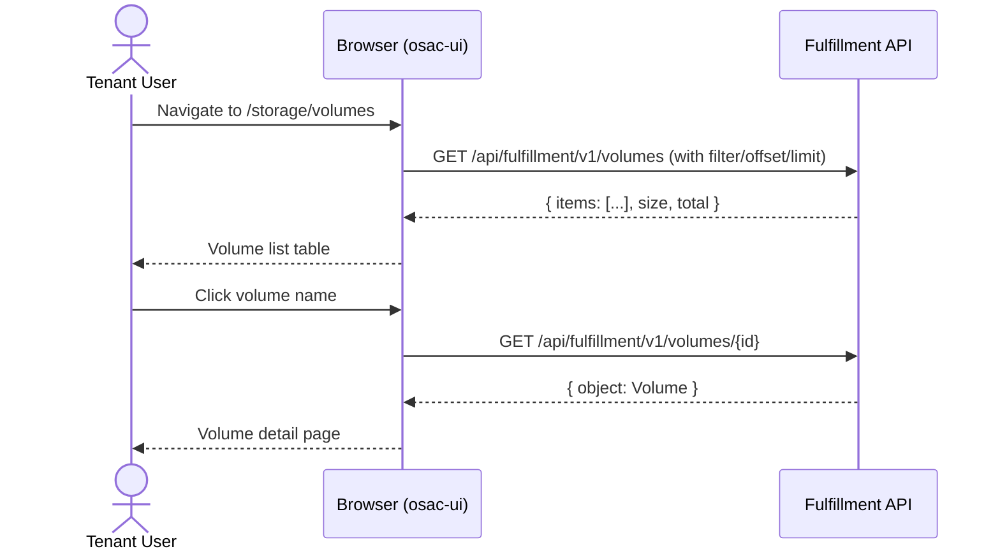

# Volume Get/List UI

## Summary

Add a tenant-facing Volume list page and detail page to the osac-ui web console,
consuming the read-only public Volume API (`List` and `Get` at
`/api/fulfillment/v1/volumes`). The UI displays volume inventory with
tenant-meaningful attributes (name, tier, size, access mode, state) and follows
the established list/detail page patterns. No mutating operations are exposed.
See [PRD](prd.md) for detailed requirements.

## Motivation

The backend public Volume API (OSAC-4542) exposes read-only `Get` and `List`
endpoints, but the console has no screens to consume them. Without a UI,
tenants must use the gRPC/REST API or CLI directly to view their storage
volumes — a workflow that is not viable for the typical Tenant User persona.
The console's storage experience is blocked until these screens exist.

The existing osac-ui patterns — `ListPage` / `ListPageBody` container
components, TanStack Query hooks, PatternFly 6 table and detail layouts — are
directly applicable. The volume list and detail pages follow the same structure
as existing tenant-facing resource pages (VMs, clusters, bare metal instances).

### Goals

- Reuse the established `ListPage` / `ListPageBody` container components and
  TanStack Query `useApiQuery` hook pattern.
- Follow the existing tenant-scoped resource page structure (list with status
  filtering, detail with spec/status cards).
- Consume only the public Volume API — no private API calls from tenant-facing
  pages.
- Generate public Volume TypeScript types from the proto via `pnpm gen-types`
  rather than hand-writing type definitions.
- Introduce no new shared UI infrastructure — volumes are a consumer of
  existing patterns.

### Non-Goals

- Volume lifecycle through the UI (create, update, delete) — deferred to later
  phases of the public Volume API ([OSAC-984](https://redhat.atlassian.net/browse/OSAC-984)).
- Volume attach/detach UI — tracked under
  [OSAC-4884](https://redhat.atlassian.net/browse/OSAC-4884).
- Cloud Provider Admin volume management views — admin-scoped pages will be
  added when mutating operations are available.
- Custom auto-polling logic — TanStack Query's built-in refetch intervals apply.
- User-facing documentation for this milestone.

## Proposal

The implementation extends three areas of the osac-ui codebase:

1. **`libs/types`** — regenerate types via `pnpm gen-types` to pick up the
   public Volume proto definitions (`Volume`, `VolumeSpec`, `VolumeStatus`,
   `VolumeAccessMode`, `VolumeState`, and the `Volumes` service descriptor with
   `List`/`Get`).
2. **`libs/ui-components`** — a `VolumeStatusLabel` component, a `VolumeTable`
   component, and list/detail page components (using the existing generic
   `useApiFetch`/`useApiQuery` hooks — no new per-resource hooks needed).
3. **`apps/app-frontend`** — nav entry, routing, and page wiring for the new
   Storage > Volumes section.

### Workflow Description

**Actors:** Tenant User, Tenant Admin (same UI flows — identical read scope),
Cloud Provider Admin (sees all tenants' volumes).

**Starting state:** User is authenticated, the public Volume API is reachable,
and at least one volume has been provisioned via the storage control plane
(OSAC-2872).

#### Listing volumes

1. Tenant User navigates to **Storage > Volumes** in the sidebar.
2. The `VolumesListPage` renders a table with columns: **Name** (link to
   detail), **State** (status badge), **Project**, **Storage Tier**,
   **Size (GiB)**, **Access Mode**, **Created**.
3. A filter toolbar allows filtering by state (CEL filter using the shared
   CEL builder with typed `VolumeState` enum values), name (CEL server-side
   filter on `metadata.name`), and project (CEL filter on
   `metadata.project`).
4. Pagination uses the standard OSAC `offset`/`limit` contract.
5. TanStack Query refetch interval handles live updates.

#### Viewing volume details

1. Tenant User clicks a volume name in the list.
2. The `VolumeDetailsPage` renders at `/storage/volumes/:id`.
3. A `ResourceDetailHeader` shows the volume name and state badge.
4. A detail overview card displays: id, name, storage tier, size, access mode,
   state, and status message (if present).
5. Metadata section shows tenant, project, created/updated timestamps.



The diagram shows the two read-only flows. No mutations are involved — the UI
is strictly a read surface for the volume inventory.

### API Extensions

No new API extensions. This UI change consumes the existing public Volume
`List` and `Get` endpoints from the fulfillment-service. No CRDs, webhooks, or
finalizers are introduced.

No new custom hooks are needed. The existing generic `useApiFetch` and
`useApiQuery` hooks are used to construct volume queries inline, following the
established pattern:

| Operation | RPC | Endpoint |
|-----------|-----|----------|
| List volumes | `List` | `GET /api/fulfillment/v1/volumes` |
| Get volume | `Get` | `GET /api/fulfillment/v1/volumes/{id}` |

No mutation hooks are needed — this release is read-only.

## UX Alignment

The `osac-ux` repo is deprecated (osac-project/osac-workspace#224). The
authoritative UI types live in `osac-ui` (`libs/types`) and are generated
directly from the backend proto via `pnpm gen-types`.

Public Volume types do not yet exist in osac-ui — only private Volume types
(from OSAC-2872) are currently generated. Once the public Volume proto from
OSAC-4542 is picked up by `pnpm gen-types`, the public types
(`Volume`, `VolumeSpec`, `VolumeStatus`, `VolumeAccessMode`, `VolumeState`,
`VolumesService`) are generated straight from the proto. There are **no
deviations to reconcile** by construction — the UI consumes the generated types
directly.

| UI field (generated TypeScript) | Proto field (public) | Notes |
|---|---|---|
| `id` | `id` | Immutable system-generated identifier; used as route param |
| `metadata.name` | `metadata.name` | Immutable RFC 1123 label; primary display name |
| `spec.storageTier` | `spec.storage_tier` | Storage tier name |
| `spec.sizeGib` | `spec.size_gib` | Capacity in GiB |
| `spec.accessMode` | `spec.access_mode` | `VolumeAccessMode` enum |
| `status.state` | `status.state` | `VolumeState` enum |
| `status.message` | `status.message` | Optional human-readable detail |

No deviations from the generated types. All fields are direct mappings with
standard protobuf-to-TypeScript camelCase conversion.

### Implementation Details/Notes/Constraints

#### File layout

New files in `libs/ui-components/src/`:

```
components/Volume/
  VolumeStatusLabel.tsx                      state badge (Creating/Available/Failed/Deleting)
  VolumeAccessModeLabel.tsx                  access mode display (ReadWriteOnce, etc.)
  VolumeTable.tsx                            table with columns and filtering
  VolumeDetailsCard.tsx                      spec/status summary card for detail page
pages/tenant/
  VolumesListPage.tsx                        list page
  VolumeDetailsPage.tsx                      detail page
  VolumeRoutes.tsx                           nested /storage/volumes/* router
```

#### API usage (generic hooks)

Volume pages use the existing generic `useApiFetch` and `useApiQuery` hooks
— no custom per-resource hook file is needed. Usage follows the established
pattern:

```ts
import { VolumesService } from '@osac/types/public';

// Construct the API client with useApiFetch
const volumeApi = useApiFetch(VolumesService);

// List volumes
const volumes = useApiQuery(volumeApi, 'list', {
  filter: celFilter,
  offset,
  limit,
});

// Get a single volume
const volume = useApiQuery(volumeApi, 'get', { id }, { enabled: !!id });
```

No mutation hooks — read-only release.

#### Nav and routing changes (`apps/app-frontend`)

`shellNav.ts` — add to tenant user nav under a "Storage" group:
```ts
{ id: 'storage-volumes', label: t('Volumes'), path: '/storage/volumes' }
```

`AppShell.tsx` — add route:
```tsx
<Route path="/storage/volumes/*" element={
  <RoleRoute allow={['tenantUser', 'tenantAdmin', 'cloudProviderAdmin']} ...>
    <VolumeRoutes />
  </RoleRoute>
} />
```

`VolumeRoutes.tsx` handles:
- `/storage/volumes` -> `VolumesListPage`
- `/storage/volumes/:id` -> `VolumeDetailsPage`

#### State badge (`VolumeStatusLabel`)

| API state | Label | PatternFly color |
|-----------|-------|------------------|
| CREATING | Creating | blue |
| AVAILABLE | Available | green |
| FAILED | Failed | red |
| DELETING | Deleting | grey |
| unset / unknown | Unknown | grey |

`DELETED` volumes are not returned by the API (archived), so no badge is
needed.

#### Access mode label (`VolumeAccessModeLabel`)

| Enum value | Display label |
|------------|---------------|
| READ_WRITE_ONCE | ReadWriteOnce |
| READ_ONLY_MANY | ReadOnlyMany |
| READ_WRITE_MANY | ReadWriteMany |
| READ_WRITE_ONCE_POD | ReadWriteOncePod |
| UNSPECIFIED | Unspecified |

Labels follow the Kubernetes PersistentVolume access mode naming convention
that storage users are familiar with.

#### Volume table columns (`VolumeTable`)

| Column | Source field | Notes |
|--------|-------------|-------|
| Name | `metadata.name` | Link to `/storage/volumes/{id}` |
| State | `status.state` | `VolumeStatusLabel` badge |
| Project | `metadata.project` | Project name |
| Storage Tier | `spec.storageTier` | Plain text |
| Size | `spec.sizeGib` | Formatted as `{n} GiB` |
| Access Mode | `spec.accessMode` | `VolumeAccessModeLabel` |
| Created | `metadata.createdAt` | Relative time (e.g., "2h ago") |

Sortable columns are not supported by the OSAC UI table framework at this time
and are deferred to future work.

Filter toolbar:
- State dropdown filter (uses the shared CEL builder with typed `VolumeState`
  enum values)
- Name filter (CEL server-side filter on `metadata.name`)
- Project filter (CEL server-side filter on `metadata.project`)

#### Volume detail page (`VolumeDetailsPage`)

Layout follows the `BareMetalDetailsPage` / `VmDetailsPage` pattern:

- `ResourceDetailHeader` with breadcrumb: "Volumes" -> volume name
- State badge next to the header
- No action buttons (read-only release)

Detail overview card sections:

**Identification:**
- ID (copyable)
- Name

**Configuration:**
- Storage Tier
- Size (formatted as `{n} GiB`)
- Access Mode (`VolumeAccessModeLabel`)

**Status:**
- State (`VolumeStatusLabel`)
- Message (if present; displayed in an expandable section for long messages)

**Metadata:**
- Tenant
- Project
- Created
- Last Updated

### Security Considerations

The volume UI consumes the same public REST API as other tenant-facing pages.
All authentication is handled by the Go proxy (OIDC session cookie). OPA
authorization is enforced server-side — the UI does not make authorization
decisions. Tenant isolation is enforced by the fulfillment service's
`DetermineVisibleTenants` logic.

No new authentication, authorization, or data exposure surface is introduced.
The UI displays only the public Volume representation — internal routing fields
(backend, protocol, hub, vendor_volume_id) are excluded from the public proto
by construction and never reach the browser.

### Failure Handling and Recovery

| Failure | What the user sees | Recovery |
|---------|--------------------|----------|
| Volume list load fails | Error state in `VolumesListPage` with retry | TanStack Query automatic retry |
| Volume detail load fails | Full-page error state | User navigates back and retries |
| Volume not found (`404`) | "Volume not found" message | User returns to the list page |
| API unreachable | Network error state | TanStack Query automatic retry; user reloads |
| Empty volume list | Empty state: "No volumes found" with explanatory text | Volumes are provisioned via the storage control plane |

### RBAC / Tenancy

No new RBAC or tenancy changes. The UI is accessible to `tenantUser`,
`tenantAdmin`, and `cloudProviderAdmin` roles (same `RoleRoute` guard pattern
as other resources). The API enforces tenant isolation server-side:

- Tenant User / Tenant Admin: see volumes in their own tenant(s)
- Cloud Provider Admin: see volumes across all tenants

The UI does not implement any client-side visibility filtering — row scoping is
handled entirely by the fulfillment service.

**Future consideration:** Shared volumes (volumes visible to multiple tenants
via explicit sharing policies) are not modeled in this release. If the Volume
API introduces sharing semantics in a later phase, the list page may need an
additional filter or visual indicator for shared vs. owned volumes.

### Observability and Monitoring

No new observability changes. Existing monitoring mechanisms apply.

### Risks and Mitigations

| Risk | Impact | Mitigation |
|------|--------|------------|
| Public Volume types not yet generated in osac-ui | Build fails if types are imported before `gen-types` is run | Sequence: merge backend proto first, run `pnpm gen-types`, then build UI. CI gen-types step handles this automatically. |
| Volume list may be large for Cloud Provider Admin | Slow table rendering, large API responses | Server-side pagination via `offset`/`limit`; default page size of 20. CEL state filter reduces result set. |
| No mutating actions available | Users may expect to manage volumes from the console | Empty action bar is intentional; the list and detail pages include no "create" or "delete" affordances. Mutating operations will be added in a future release (OSAC-984). |

### Drawbacks

Read-only is a partial capability — the console can display but not manage
volumes until later phases. However, read visibility is the prerequisite for
the console's storage experience and unblocks the UX/UI design gates
(OSAC-4546, OSAC-4547).

## Alternatives (Not Implemented)

**Embed volumes in an existing Storage management page.** A tab on the admin
Storage page (alongside backends and tiers) could show volumes. Rejected
because volumes are tenant-scoped resources — tenants need their own nav entry
and route tree, separate from the admin-facing storage management. The admin
storage page manages infrastructure (backends, tiers); the tenant volumes page
shows inventory.

**Use the private Volume types instead of waiting for public types.** The
private types already exist in osac-ui. Rejected because the private Volume
includes internal routing fields (backend, protocol, hub, vendor_volume_id)
that are not meaningful to tenants and must not be displayed. Consuming the
public types ensures the UI can only show tenant-meaningful fields by
construction.

**Skip the detail page and show all fields inline in the list.** A wider table
with all volume attributes. Rejected because the established OSAC pattern
separates list (scannable summary) from detail (full information), and the
detail page provides a stable deep-link target for console navigation and
support procedures.

## Open Questions [optional]

None.

## Test Plan

### Unit Tests

Unit tests (Vitest + React Testing Library):
- `VolumeStatusLabel` renders correct label and PatternFly color for each
  `VolumeState` value (CREATING -> blue, AVAILABLE -> green, FAILED -> red,
  DELETING -> grey, unset -> grey).
- `VolumeAccessModeLabel` renders the correct Kubernetes-convention label for
  each `VolumeAccessMode` value.
- `VolumeTable` renders the correct columns, formats size as `{n} GiB`, and
  links volume name to `/storage/volumes/{id}`.
- `VolumeTable` state filter dropdown generates the correct CEL filter string.
- `VolumeDetailsCard` renders all sections (identification, configuration,
  status, metadata) and handles missing optional fields (message absent).
- Volume list query via `useApiFetch(VolumesService)` + `useApiQuery` returns
  correct data for list and get operations.

### Integration Tests

Not applicable for this UI-only change. The public Volume API integration
tests are covered in the backend design (OSAC-4542).

### E2E Tests

- Navigate to `/storage/volumes`, verify the list page loads and displays
  volumes provisioned via the storage control plane.
- Click a volume name, verify navigation to `/storage/volumes/:id` and that the
  detail page displays the correct volume attributes.
- Verify state badge renders correctly for a volume in `AVAILABLE` state.
- Verify tenant isolation: a Tenant User in tenant A does not see volumes
  belonging to tenant B (validated at the API layer, but confirmed via UI).

## Graduation Criteria

Ships as part of the Volume Get/List feature (0.3). No separate maturity
ladder; the UI screens graduate with the backend API. Later OSAC-984 phases
add mutating lifecycle UI.

## Upgrade / Downgrade Strategy

Additive, read-only UI surface. Upgrade adds the new nav entry, routes, and
pages; downgrade removes them. No data migration or configuration change is
needed. Existing pages are unaffected.

## Version Skew Strategy

The UI consumes the public Volume API endpoints. If the fulfillment-service
does not yet expose these endpoints (e.g., during a rolling upgrade), the
volumes list page displays a TanStack Query error state. No data corruption
occurs. Upgrading the fulfillment-service restores functionality without
requiring a UI restart. The public Volume proto types are a strict subset of
the private types, so proto evolution follows standard additive-field rules.

## Support Procedures

**Symptom:** Volumes page shows an error or empty state.
**Diagnosis:** Check `GET /api/fulfillment/v1/volumes` returns a valid
response. If 403/401, the user's JWT may lack the required organization claim.
If 200 with empty items, no volumes have been provisioned via the storage
control plane (OSAC-2872).
**Resolution:** Verify the user has a valid session. Verify volumes exist by
checking the private API (admin). If no volumes exist, provision one via the
existing storage control plane path.

**Symptom:** Volume detail page shows "not found."
**Diagnosis:** The volume id in the URL does not match a visible volume. The
volume may have been deleted (archived) or belongs to a different tenant.
**Resolution:** Navigate back to the volume list. If the volume was deleted,
it no longer appears in the list (archived volumes are excluded by the API).

## Infrastructure Needed [optional]

None.
