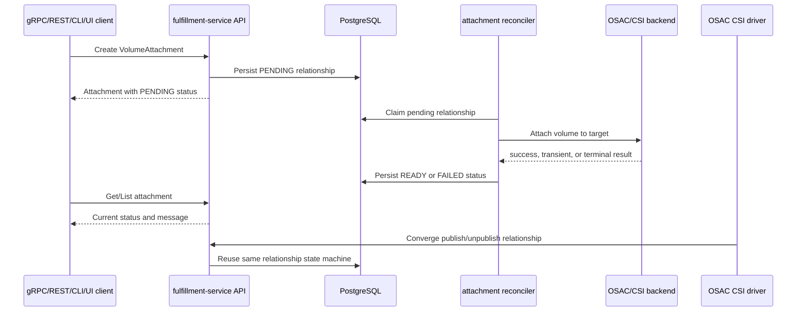

# Volume API Storage Attach and Detach

## Summary

The design adds a first-class, tenant-scoped `VolumeAttachment` resource for direct BMaaS and VMaaS attachment and uses a private CSI target variant for CaaS adapter operations. It persists desired state and observed lifecycle, delegates backend work to the OSAC operator for direct compute targets, and keeps CSI vendor dispatch for CaaS while converging state through fulfillment-service. The design provides public gRPC, REST, CLI, and UI behavior without exposing vendor-specific APIs or secrets.

## Motivation

The current Volume API records provisioning but not attachment, and the CSI driver directly proxies publish/unpublish calls to vendor controllers. This prevents consistent authorization, progress reporting, retry recovery, and deletion protection across OSAC compute services. The design uses the existing OSAC attachment-resource pattern to make the relationship durable and observable.

## Proposal

The proposal is specified in section 4 Design, with workflow in section 4.1, schema and API changes in sections 4.2-4.3, security and tenancy in sections 4.5 and 4.7, and failure recovery in section 4.6.

### Workflow Description

Clients create and delete an immutable attachment relationship; the API records intent and the controller reconciles it to backend state. CaaS follows the same relationship through CSI publish/unpublish. See sections 4.1 and 4.6.

### API Extensions

The new public `VolumeAttachments` service and private CSI target variant are described in sections 4.2 and 4.3. The change is additive and uses generated public protos from private source protos.

### Implementation Details/Notes/Constraints

The database migration, controller ownership, CSI migration, and version-skew constraints are described in sections 4.1, 4.2, 4.6, and 8.

### Security Considerations

Authentication, OPA authorization, target validation, tenant isolation, and secret non-disclosure are described in sections 4.5 and 4.7.

### Failure Handling and Recovery

Transient retries, deadlines, idempotency, terminal failures, deletion guards, and operator recovery are described in section 4.6 and Support Procedures.

### RBAC / Tenancy

The resource is tenant-scoped and provider-admin access is explicitly bounded in section 4.7.

### Observability and Monitoring

Metrics, structured transitions, events, and recovery signals are specified in section 7.

### Risks and Mitigations

The principal risks are migration adoption, backend/provider availability, and races between target/volume deletion. Mitigations are durable attachment state, conservative finalizers, unique relationship constraints, and staged CSI rollout; see section 8 and Support Procedures.

### Drawbacks

The first-class resource adds API, persistence, controller, and migration complexity compared with direct vendor proxying. This cost is accepted because action-only or proxy-only designs cannot provide durable progress, tenant authorization, deletion safety, and cross-service lifecycle behavior.

## 1. Overview

This design adds a first-class `VolumeAttachment` resource that represents the desired and observed relationship between an OSAC Volume and an OSAC-managed BMaaS or VMaaS compute target. Creating the resource requests attachment; deleting it requests detachment. Fulfillment-service persists the relationship and lifecycle status, while the attachment controller dispatches the backend operation and retries until the requested state is reached.

The OSAC CSI driver adapts `ControllerPublishVolume` and `ControllerUnpublishVolume` to the same attachment lifecycle for CaaS. Existing volume IDs, vendor routing, idempotency, and no-op backends remain compatible. Public gRPC, REST, CLI, and UI clients consume the generated public resource API. See [PRD](prd.md) for requirements context.

## 2. Goals and Non-Goals

### Goals

- Reuse the existing OSAC resource shape, generic CRUD services, tenant authorization, finalizers, and provisioning lifecycle.
- Persist attachment intent and observed state so requests remain recoverable after deadlines, process restarts, and client loss.
- Use explicit typed references for BMaaS and VMaaS targets instead of accepting arbitrary backend node identifiers.
- Preserve CSI compatibility by converging CSI publish/unpublish calls onto the same attachment operation and retaining legacy volume routing during migration.
- Make attachment relationships enforceable for volume deletion and target lifecycle cleanup.

### Non-Goals

- A user-facing force-detach operation.
- Direct public attachment to CaaS clusters or nodes; CaaS continues through PVC and CSI.
- Direct exposure of vendor-specific attachment APIs, credentials, or vendor identifiers.
- Changes to volume creation, resizing, or deletion semantics unrelated to attachment protection.

## 3. Motivation / Background

Volume records currently contain provisioning state but no attachment relationship. The CSI driver handles controller publish/unpublish by proxying directly to vendor CSI controllers, which gives Kubernetes a working path but leaves fulfillment-service unable to authorize, persist, observe, or protect the relationship. The proxy also returns transient vendor failures to CSI sidecars rather than owning a durable retry state.

OSAC already uses a first-class `ExternalIPAttachment` resource for immutable bindings with pending, ready, failed, and deleting states. A volume attachment follows the same resource pattern, but its target set is limited to OSAC-managed BMaaS and VMaaS compute and its backend operation must honor volume access modes and storage backend capabilities.

## 4. Design

### 4.1 Architecture

`VolumeAttachment` is a public resource generated from private source protos. The fulfillment service is the single authority for persisted state transitions, retry scheduling, finalizers, and public status. It validates the volume, target, tenancy, access mode, and uniqueness constraints, then creates the attachment record in `PENDING`. A provider adapter performs the backend operation and returns success, transient, or terminal results; the fulfillment worker retries transient results with exponential backoff. A deletion request moves the record to `DELETING`; the record is retained until backend detach completes.

The CSI driver remains the CaaS provider adapter. On `ControllerPublishVolume`, it validates the CSI request and asks fulfillment-service to create or converge a private `csi_node` relationship; fulfillment-service owns the persisted state and retry schedule, while the adapter invokes the vendor CSI controller. `csi_node` is excluded from the generated public API, so CaaS remains a PVC/CSI-only workflow. On `ControllerUnpublishVolume`, it converges the relationship to detached. Kubernetes sidecar retries remain safe because the relationship is keyed by volume and target and duplicate desired state is idempotent.



The diagram shows that the client request records intent before backend completion, while the worker owns eventual progress. CSI uses the same state machine rather than bypassing the control plane. Status reads remain available after the original request deadline.

The provider boundary is an internal gRPC contract owned by fulfillment-service. The BMaaS/VMaaS adapter is hosted with the operator integration and the CaaS adapter is hosted by the CSI driver. Both adapters accept a volume ID, typed target, read-only flag, and operation deadline, and return a backend-neutral result classification. They do not write attachment status directly; fulfillment-service applies every transition.

Responsibilities:

- **Fulfillment-service:** public API, validation, tenant authorization, persistence, status, deletion guards, retry scheduling, and authoritative state transitions.
- **OSAC operator/backend adapter:** implements the provider adapter for BMaaS and VMaaS calls behind the fulfillment attachment-provider interface; it does not own public attachment state.
- **OSAC CSI driver:** implements the CaaS provider adapter, maps CSI publish/unpublish requests to private `csi_node` relationships, and preserves legacy routing during migration.
- **CLI/UI:** create/delete or attach/detach through the public resource API, display status conditions, and do not expose vendor details.

Lifecycle sequence: create assigns the tenant annotation and Volume owner-reference, adds the attachment finalizer, persists `PENDING`, and creates the operator CR for direct targets. Reconciliation updates status and conditions after each provider result. Delete records the deletion timestamp, changes state to `DELETING`, requests detach, and removes the finalizer only after detach is confirmed or the backend reports the relationship absent. A terminal detach failure retains the finalizer and `DELETING` state for operator recovery.

### 4.2 Data Model / Schema Changes

Add a public `VolumeAttachment` resource following `ExternalIPAttachment`:

```text
VolumeAttachment {
  string id = 1;
  Metadata metadata = 2;
  VolumeAttachmentSpec spec = 3;
  VolumeAttachmentStatus status = 4;
}

VolumeAttachmentSpec {
  VolumeLocalReference volume = 1;          // required, immutable
  oneof target {
    ComputeInstanceLocalReference compute_instance = 2;
    BareMetalInstanceLocalReference baremetal_instance = 3;
    CsiNodeReference csi_node = 4;            // private field; excluded from public API
  }                                           // exactly one, immutable
  bool readonly = 5;                          // immutable; defaults false
}

VolumeAttachmentStatus {
  VolumeAttachmentState state = 1;             // output only
  optional string message = 2;                 // output only
  string volume_id = 3;                        // output only convenience field
  string target_id = 4;                        // output only convenience field
  repeated VolumeAttachmentCondition conditions = 5; // output only
  string hub = 6;                              // private, output only
}
```

Add the following messages to the private source proto; field numbers are reserved for this resource and are not reused. `volume` and the target oneof carry `google.api.field_behavior` annotations for `REQUIRED` and `IMMUTABLE`; `status` fields carry `OUTPUT_ONLY`; IDs use `buf.validate` non-empty constraints; a message-level CEL rule requires exactly one target; and `csi_node` plus `hub` use CleanAPI private annotations.

```text
VolumeLocalReference { string id = 1; string name = 2; }
CsiNodeReference { string cluster_id = 1; string node_id = 2; }
enum VolumeAttachmentState {
  VOLUME_ATTACHMENT_STATE_UNSPECIFIED = 0;
  VOLUME_ATTACHMENT_STATE_PENDING = 1;
  VOLUME_ATTACHMENT_STATE_READY = 2;
  VOLUME_ATTACHMENT_STATE_FAILED = 3;
  VOLUME_ATTACHMENT_STATE_DELETING = 4;
}
enum VolumeAttachmentConditionType {
  VOLUME_ATTACHMENT_CONDITION_TYPE_UNSPECIFIED = 0;
  VOLUME_ATTACHMENT_CONDITION_TYPE_ATTACHED = 1;
  VOLUME_ATTACHMENT_CONDITION_TYPE_DETACHED = 2;
  VOLUME_ATTACHMENT_CONDITION_TYPE_RECONCILING = 3;
}
VolumeAttachmentCondition {
  VolumeAttachmentConditionType type = 1;
  ConditionStatus status = 2;
  string reason = 3;
  string message = 4;
  Timestamp last_transition_time = 5;
}
```

`VolumeLocalReference`, `ComputeInstanceLocalReference`, and `BareMetalInstanceLocalReference` resolve by ID when set; name is accepted only for create and is resolved to an immutable ID before persistence. `CsiNodeReference` requires both an authorized CaaS cluster ID and non-empty node ID and is marked private with CleanAPI. The resource is immutable after creation; changing a target requires deleting the attachment and creating another one. `readonly` must be compatible with the CSI capability and volume access mode. Conditions use the shared `ConditionStatus` enum (`UNSPECIFIED`, `TRUE`, `FALSE`); top-level state remains the compatibility summary used by existing clients.

Add an attachment persistence table using the existing migration convention. It stores the resource JSON, standard metadata/tenant columns, and unique active relationship keys for `(volume_id, target_kind, target_id)`. A database-level reference or service transaction prevents deletion of a Volume while attachments in `PENDING`, `READY`, `FAILED`, or `DELETING` exist. The migration is additive and requires no backfill for existing volumes; existing CSI relationships are adopted by the CSI driver on the first publish/unpublish call after upgrade.

Volume status gains an output-only attachment summary only if list/get performance requires it; the attachment resource remains authoritative. No vendor volume ID, backend credential, or raw CSI secret is exposed through the public attachment resource.

### 4.3 API Changes

Add `VolumeAttachments` using the standard OSAC resource service pattern. The private source service uses standard request/response messages and CleanAPI generates the public service; `Signal` remains private and is used only for feedback-driven reconciliation:

| RPC | Public REST route | Behavior |
|---|---|---|
| `List` | `GET /api/fulfillment/v1/volume_attachments` | Lists authorized attachments; supports filter/order. |
| `Get` | `GET /api/fulfillment/v1/volume_attachments/{id}` | Returns desired target and observed lifecycle state. |
| `Create` | `POST /api/fulfillment/v1/volume_attachments` | Requests attach; returns `PENDING` or an already-satisfied `READY` object. |
| `Update` | `PATCH /api/fulfillment/v1/volume_attachments/{object.id}` | Metadata-only update; immutable spec fields are rejected. |
| `Delete` | `DELETE /api/fulfillment/v1/volume_attachments/{id}` | Requests detach; resource remains until detach completes. |

The public Volume API prerequisite `osac#743` must be available first. The private service also includes `Signal` for controller feedback, following existing attachment resources.

Validation rules:

- `volume` is required and must resolve to an existing, non-deleted Volume in a usable state.
- Exactly one target oneof member is required; arbitrary node/backend strings are rejected.
- The referenced target must be an OSAC-managed BMaaS or VMaaS resource visible to the caller.
- The attachment is rejected if the volume access mode and backend capability do not permit the requested concurrent relationship.
- An existing active relationship for the same volume and target converges to idempotent success.
- A duplicate relationship to a different target is accepted only for supported multi-attachment modes/backend capabilities.
- Delete is idempotent when the relationship is already absent or fully detached.
- Client deadlines apply to the request; a deadline does not cancel durable reconciliation. The response or subsequent Get reports `PENDING`, `READY`, or `FAILED`.

Example:

```json
POST /api/fulfillment/v1/volume_attachments
{
  "object": {
    "metadata": {"name": "database-disk-vm1"},
    "spec": {
      "volume": {"id": "vol-123"},
      "target": {"compute_instance": {"id": "ci-456"}},
      "readonly": false
    }
  }
}
```

The response contains the attachment ID and `status.state: PENDING` until the backend confirms attachment. A repeated request for the same logical relationship returns the existing object rather than creating duplicate work.

CLI adds public commands equivalent to `osac volume-attachment create`, `get`, `list`, and `delete`; command help follows the existing Markdown help conventions. UI adds attach/detach actions to authorized Volume and ComputeInstance views, shows `PENDING`, `READY`, `FAILED`, and `DELETING`, and disables destructive actions while attachment state makes them unsafe.

### 4.4 Scalability and Performance

Attachment reconciliation is bounded by the number of active relationships and backend operation time. API writes add one resource row and one status update per state transition. List queries require indexes on tenant, volume, target, and state. The unique relationship index makes idempotency an indexed lookup rather than a full scan.

The worker uses bounded concurrency and exponential backoff. It must not create an unbounded goroutine per request. Backend calls use the caller deadline for the initial request and controller-owned deadlines for later retries. The design assumes attachment cardinality is proportional to managed volumes and compute targets, not an unbounded event stream.

### 4.5 Security Considerations

Authentication remains in the existing gRPC interceptor chain. OPA rules authorize VolumeAttachment operations using the attachment tenant and referenced Volume/target tenants. Tenant users and tenant administrators may access only relationships within their tenant. Provider administrators may operate across tenants only when their existing provider-level policy grants access.

The server resolves references under authorization before creating the relationship, preventing an unauthorized caller from using an attachment as an existence oracle. Target IDs are validated against OSAC resource types, and vendor IDs, CSI secrets, backend endpoints, and raw node credentials remain private. CSI service identities receive only the internal permissions required to converge relationships for authorized tenant-scoped Volume resources.

### 4.6 Failure Handling and Recovery

| Failure | Control-plane behavior | User-visible result |
|---|---|---|
| Invalid volume or target | Reject before persistence with `InvalidArgument` or `NotFound`. | Request fails with named validation error. |
| Cross-tenant reference | OPA/interceptor rejects access. | `PermissionDenied`; no relationship is created. |
| Unsupported access/backend combination | Validate before dispatch. | `FailedPrecondition`; no backend call. |
| Backend transient failure | Keep relationship `PENDING`, record message, retry with exponential backoff. | `PENDING` status and progress message. |
| Backend terminal attach failure | Set `FAILED`, retain diagnostic message, allow explicit retry through the standard signal/reconcile path. | `FAILED`; no false `READY` state. |
| Request deadline exceeded | Leave durable relationship pending; caller may Get or repeat the same request. | Deadline error for the request; state remains observable and retry-safe. |
| Backend reports already attached | Treat as successful if it matches the requested volume/target relationship. | `READY`, no duplicate effect. |
| Backend reports already detached/not found | Treat as successful during detach. | Attachment deletion completes. |
| Node-local/no-attach backend | Mark operation successful without vendor controller call. | `READY` or completed delete. |
| Target deletion | Target controller requests deletion of all relationships referencing the target and waits for detach. | Attachments enter `DELETING`; target cleanup does not leave stale active relationships. |
| Volume deletion while attached | Volume delete returns `FailedPrecondition` or remains blocked by in-use protection until relationships are gone. | Volume remains present until all attachments detach. |
| Controller restart | Reconcile persisted `PENDING`, `FAILED`, and `DELETING` relationships. | Progress resumes without client recreation. |

No force-detach path is provided. Terminal detach failure remains visible for operator recovery and the attachment finalizer prevents the relationship from disappearing while backend state is uncertain.

### 4.7 RBAC / Tenancy

`VolumeAttachment` is tenant-scoped and uses the same tenant metadata and owner-reference conventions as other tenant resources. The service assigns `metadata.annotations["osac.openshift.io/tenant"]` to the resolved tenant ID and `metadata.annotations["osac.openshift.io/owner-reference"]` to the parent Volume ID; callers cannot override either value. The Volume is the logical owner because the attachment protects its deletion, while target controllers discover attachments by indexed target reference for cleanup. Local references never accept a caller-supplied tenant ID. The Volume and target must belong to the same tenant; a cross-tenant relationship is rejected even for a provider administrator. Provider administrators operate across tenant environments by making separately authorized requests within each tenant, not by creating cross-tenant relationships. Names are resolved only within the caller's authorized tenant scope, so identical names in different tenants cannot collide.

The API adds create/get/list/update/delete permissions for tenant roles and corresponding provider-admin permissions. CSI identities use a dedicated internal policy path and cannot use public provider-admin authority. Attachment deletion and volume deletion checks execute inside the same authorization and persistence boundary to avoid a time-of-check/time-of-use gap.

The fulfillment-service attachment worker requests an operator-side attachment CR for BMaaS and VMaaS, carrying only the attachment ID, volume ID, target reference, and desired read-only flag. The operator attachment controller implements the internal `AttachmentProvider` contract and returns results to fulfillment-service; it does not report public state directly. For private `csi_node` relationships, the CSI driver implements the provider contract and returns vendor results to fulfillment-service; it uses the same persisted relationship and finalizer rules.

### 4.8 Extensibility / Future-Proofing

The target oneof permits additional OSAC-managed compute target types without changing the relationship or retry model. The status state machine can carry conditions and backend-neutral messages without exposing vendor data. Keeping the public object declarative allows future watch/event interfaces and alternative backend workers without changing client intent semantics. CaaS remains an adapter rather than a second public attachment model.

## 5. Interface Changes

### IC-1: Public VolumeAttachment resource API

**Requirements:** FR-1, FR-2, FR-4, FR-5, FR-6, FR-7, FR-9, NFR-1

Add public gRPC and REST List/Get/Create/Update/Delete operations with typed Volume, ComputeInstance, and BareMetalInstance references; see sections 4.2 and 4.3.

### IC-2: Attachment lifecycle status

**Requirements:** FR-4, FR-5, FR-7, FR-9, FR-10

Expose `PENDING`, `READY`, `FAILED`, and `DELETING` state plus observable messages through Get/List and generated client types; see sections 4.2 and 4.6.

### IC-3: CLI volume-attachment commands

**Requirements:** FR-1, FR-4, FR-5, FR-9, FR-10

Add public `osac volume-attachment create|get|list|delete` commands that use the resource API and render lifecycle state; see section 4.3.

### IC-4: UI attach/detach behavior

**Requirements:** FR-1, FR-4, FR-5, FR-9, FR-10

Add authorized Volume and ComputeInstance attach/detach actions and status rendering; see section 4.3. UI field alignment requires validation against `osac-ui` and `osac-ux` when those repositories are available.

### IC-5: CSI publish/unpublish adapter

**Requirements:** FR-3, FR-5, FR-7, FR-8, FR-10

Change the OSAC CSI driver controller publish/unpublish path to converge the VolumeAttachment lifecycle while preserving legacy volume-context/vendor-ID fallback and no-op backends; see sections 4.1 and 4.6.

### IC-6: Lifecycle deletion protection

**Requirements:** FR-9, FR-10

Change Volume and compute-target deletion behavior to block unsafe volume deletion and initiate attachment cleanup; see sections 4.2 and 4.6.

### IC-7: Authorization and operator recovery documentation

**Requirements:** FR-10, NFR-1, NFR-2

Document gRPC, REST, CLI, UI, progress, error, authorization, migration, and terminal detach recovery semantics; see sections 4.5 through 4.7.

## 6. Alternatives (Not Implemented)

### First-class VolumeAttachment resource (selected)

- **Pros:** Matches `ExternalIPAttachment`, supports durable status and retries, makes deletion protection and target cleanup explicit, and works for BMaaS/VMaaS as well as CSI adapters.
- **Cons:** Adds a resource, controller, persistence, API surface, and migration logic.
- **Reason selected:** The PRD requires observable asynchronous lifecycle and a design-defined object model; the existing OSAC attachment pattern provides the closest implementation boundary.

### Action-only Attach/Detach RPCs

- **Pros:** Smaller initial API surface and direct correspondence to user actions.
- **Cons:** Does not naturally persist desired state, list relationships, recover after restart, protect deletion, or represent a deadline-exceeded operation.
- **Reason rejected:** Fails the durable progress, lifecycle safety, and retry requirements without recreating a resource model behind the RPC.

### Kubernetes VolumeAttachment as the public source of truth

- **Pros:** Existing CaaS controllers already understand Kubernetes attachment semantics and CSI retries.
- **Cons:** Does not represent BMaaS/VMaaS targets, couples public OSAC tenancy to cluster internals, and cannot protect fulfillment Volume deletion across all compute services.
- **Reason rejected:** CaaS is only one delivery path; direct OSAC compute targets require a control-plane relationship.

### Continue direct vendor CSI proxying

- **Pros:** Lowest immediate code change and preserves current CSI routing.
- **Cons:** No public OSAC lifecycle, durable status, control-plane authorization, target cleanup, or volume deletion guard.
- **Reason rejected:** It is the temporary OSAC-4187 path and does not satisfy the feature requirements.

## 7. Observability and Monitoring

- Emit structured attachment transition events containing attachment ID, volume ID, target kind/ID, state, attempt number, and error class; never log CSI secrets or vendor credentials.
- Add counters for attach attempts, detach attempts, successful transitions, terminal failures, transient retries, idempotent convergences, and no-op operations.
- Add gauges for pending and deleting attachment counts and a histogram for backend operation duration.
- Emit Kubernetes events or equivalent operator events when an attachment enters `FAILED` or remains `DELETING` beyond the configured recovery threshold.
- Expose attachment state and last error through the existing resource status and logs so operators can recover terminal detach failures without backend-specific user access.

## Risks and Mitigations

| Risk | Mitigation |
|---|---|
| A CSI publish succeeds before the API response and the client retries. | Use the immutable `(volume, target)` relationship key and treat backend already-attached responses as idempotent success. |
| Target deletion races with attachment creation. | Resolve target state under transaction, index attachments by target, and have the target controller block finalizer removal until attachment cleanup completes. |
| A backend worker loses connectivity while an attachment is pending. | Persist `PENDING`, use bounded exponential backoff, expose retry counters, and resume reconciliation after restart. |
| Migration creates a duplicate or detaches an existing CSI relationship. | Preserve legacy volume context/vendor IDs, adopt on first CSI operation, and never delete an unknown existing attachment solely because its control-plane row is absent. |
| A public status exposes backend implementation details. | Return only backend-neutral state, reason, and message; keep vendor IDs, endpoints, and secrets private. |

Security review is owned by fulfillment-service authorization maintainers and OSAC platform security reviewers; storage and CSI maintainers review provider and migration behavior.

## 8. Impact and Compatibility

The public API addition is backward-compatible for existing clients. The database migration is additive. Existing Volumes require no recreation and gain attachment protection once the new service is deployed.

CSI migration must be staged: deploy the attachment API and controller, update CSI to support the new adapter while retaining legacy context/status fallback, then switch new CaaS publish/unpublish calls to the attachment path. Old CSI callers continue sending standard CSI operations. During version skew, the new CSI driver must operate against a service that understands the attachment API before enabling the new path; otherwise it must retain the legacy proxy behavior and expose the deployment mismatch through readiness/metrics.

Existing in-flight CSI attachments must not be detached solely because no `VolumeAttachment` record exists after upgrade. Adoption must be lazy or inventory-backed, and the migration must preserve the current vendor volume ID/backend mapping until the relationship is represented by the new control plane.

Downgrade must leave existing attachment records intact and retain the legacy CSI proxy fallback. Operators must not delete attachment rows as part of rollback; unresolved relationships remain visible for the next upgraded controller.

## UX Alignment

The `osac-ui` and `osac-ux` checkouts are not present in this workspace, so no matching `@temp-api` TypeScript definition could be inspected. The backend contract uses the existing OSAC resource shape and snake_case proto fields. Before implementation, the UI team must map `spec.volume`, `spec.compute_instance`/`spec.baremetal_instance`, `status.state`, `status.message`, and `status.conditions` to the generated UI types; no backend field should be renamed to match a UI-only convention.

## 9. Open Questions

### 9.1 UI repository alignment

**Question:** Which `osac-ui` and `osac-ux` revisions define the attach/detach UI placement and generated API field names?

**Owner:** OSAC UI maintainers

**Impact:** Determines the concrete UI component and UX Alignment mapping for IC-4; the backend contract remains as specified in section 4.3.

## Test Plan

Detailed behavioral coverage is in [04-testplan.md](04-testplan.md). It covers every normalized PRD requirement and every interface change.

### Unit Tests

- Validate typed references, immutable specs, access-mode/backend capability checks, duplicate relationship convergence, no-op backends, and state transitions.
- Test authorization decisions, tenant filtering, deletion guards, finalizer behavior, transient retry classification, deadline handling, and terminal failures.
- Test CSI adapter mapping, legacy fallback, vendor AlreadyExists/NotFound behavior, and controller restart reconciliation.

### Integration Tests

- Exercise API/database/controller lifecycle with a fake backend: create, pending, retry, ready, delete, deleting, and failed states.
- Verify volume deletion is blocked while attached and target deletion initiates cleanup.
- Verify public REST/gRPC and CLI behavior, generated API compatibility, and OPA tenant/provider authorization.

### E2E Tests

- Add the backend-neutral representative flow to `osac/tests/e2e/storage/test_volume_attachment_lifecycle.py`, using the existing storage fixtures and polling helpers.
- Cover retry after transient backend failure, invalid target, cross-tenant denial, terminal backend failure, and CSI migration without recreating an existing volume.

## Graduation Criteria

- Public gRPC, REST, CLI, and UI contracts are implemented and documented.
- BMaaS and VMaaS direct attachment and CaaS CSI adapter flows pass required automated coverage.
- Existing CSI volumes continue operating through upgrade and the attachment lifecycle survives service/driver restarts.
- No-force-detach recovery is documented and observable through status, events, metrics, and logs.
- The OSAC 0.3 release acceptance suite passes, including the representative E2E and all specified negative scenarios.

## Upgrade / Downgrade Strategy

Upgrade uses additive schema/API deployment first, then controller/worker deployment, then CSI adapter rollout. New clients are enabled only after the service and worker support the attachment resource. Existing CSI attachments remain on legacy routing until adopted; no automatic detach is performed solely due to migration.

Rollback keeps the additive schema and attachment records. The CSI driver falls back to legacy vendor routing when the attachment API is unavailable, while operators resolve any pending relationships after the service is restored. Volume deletion remains conservative whenever an active attachment record exists.

## Version Skew Strategy

The service must support old CSI clients sending standard publish/unpublish calls during a rolling update. The new CSI driver must detect attachment API incompatibility and retain legacy routing rather than silently dropping attachment requests. The new API is not considered enabled for user-facing direct operations until `osac#743` and generated public clients are deployed.

## Support Procedures

- Inspect `VolumeAttachment.status.state`, `status.message`, structured transition logs, retry counters, pending/deleting gauges, and backend operation duration.
- For `FAILED` attach, correct the target/backend condition and signal or retry reconciliation; do not manually mutate status.
- For `DELETING`, verify backend attachment state and target availability. The resource remains protected until detach is confirmed; no force-detach API is available.
- If the attachment controller is unavailable, existing workloads continue using already-attached volumes, while new transitions remain pending and visible.
- Disablement must stop new attachment requests and leave existing relationships/status records intact. Re-enabling the controller resumes reconciliation without recreating volumes.

## Infrastructure Needed

No new repository is required. Implementation uses the existing fulfillment-service, osac-operator, osac-csi-driver, and workspace E2E test infrastructure. The `osac-ui` and `osac-ux` checkouts must be available for UI implementation and UX type alignment.
