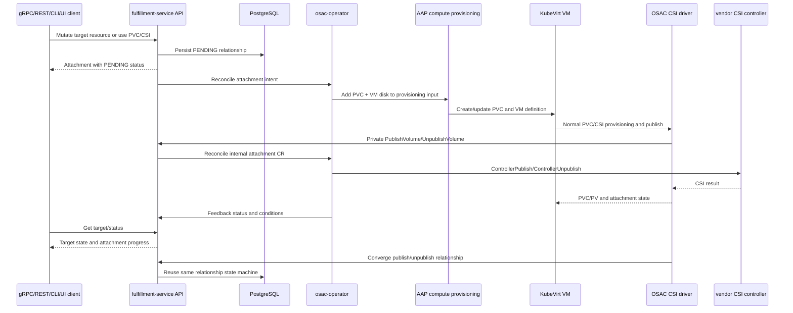

# Volume API Storage Attach and Detach

## Summary

The design adds an internal, tenant-scoped `VolumeAttachment` CR for BMaaS, VMaaS, and CaaS reconciliation. Public VMaaS intent is expressed by mutating `ComputeInstance.spec.additional_disks` with an existing Volume reference; AAP creates a PVC and references it from the KubeVirt VM, and the normal OSAC CSI flow binds that PVC to the existing OSAC Volume. BMaaS uses its target API and operator flow; CaaS continues through standard PVC/CSI plus private publish/unpublish APIs. The canonical project annotation for an existing OSAC Volume on a PVC is `osac.openshift.io/volume-id`.

## Motivation

The current Volume API records provisioning but not attachment. VMaaS disk provisioning is driven by ComputeInstance/AAP input and KubeVirt DataVolumes/PVCs, while the CSI driver owns the Kubernetes binding path. A direct vendor attach call would bypass the VM's PVC and KubeVirt disk model. The design therefore makes attachment intent declarative, target-specific, and internal: ComputeInstance mutations, BareMetalInstance mutations, and native PVC/CSI flows create internal attachment CRs that reconcile the relationship.

## Proposal

The proposal is specified in section 4 Design, with workflow in section 4.1, schema and API changes in sections 4.2-4.3, security and tenancy in sections 4.5 and 4.7, and failure recovery in section 4.6.

### Workflow Description

Clients mutate the target resource or use the native PVC/CSI flow; the API records target-specific intent and creates/updates an internal attachment CR. CaaS follows the native relationship through private CSI publish/unpublish. See sections 4.1 and 4.6.

### API Extensions

The public ComputeInstance/BareMetalInstance mutations and private CSI `PublishVolume`/`UnpublishVolume` methods are described in sections 4.1, 4.2, and 4.3. The change is additive and uses generated public protos from private source protos.

### Implementation Details/Notes/Constraints

The database migration, controller ownership, CSI migration, and version-skew constraints are described in sections 4.1, 4.2, 4.6, and 8.

### Security Considerations

Authentication, OPA authorization, target validation, tenant isolation, and secret non-disclosure are described in sections 4.5 and 4.7.

### Failure Handling and Recovery

Transient retries, deadlines, idempotency, terminal failures, deletion guards, and operator recovery are described in section 4.6 and Support Procedures.

### RBAC / Tenancy

The resource is tenant-scoped and provider-admin access is explicitly bounded in section 4.7.

### Observability and Monitoring

Metrics, structured transitions, events, and recovery signals are specified in section 7.

### Risks and Mitigations

The principal risks are migration adoption, backend/provider availability, and races between target/volume deletion. Mitigations are durable attachment state, conservative finalizers, unique relationship constraints, and staged CSI rollout; see section 8 and Support Procedures.

### Drawbacks

The first-class resource adds API, persistence, controller, and migration complexity compared with direct vendor proxying. This cost is accepted because action-only or proxy-only designs cannot provide durable progress, tenant authorization, deletion safety, and cross-service lifecycle behavior.

## 1. Overview

This design adds an internal `VolumeAttachment` CR that represents the desired and observed relationship between an OSAC Volume and an OSAC-managed compute target. Public target APIs create or remove the relationship; the CR is not a public fulfillment resource. Fulfillment-service persists the relationship and lifecycle status, while target-specific controllers reconcile it through AAP, PVC/KubeVirt, BMaaS host operations, or private CSI publish/unpublish.

The OSAC CSI driver adapts `ControllerPublishVolume` and `ControllerUnpublishVolume` to the internal attachment lifecycle for CaaS and VMaaS. Existing volume IDs, vendor routing, idempotency, and no-op backends remain compatible. Public gRPC, REST, CLI, and UI clients mutate target resources rather than creating a public VolumeAttachment object. See [PRD](prd.md) for requirements context.

## 2. Goals and Non-Goals

### Goals

- Let callers inspect and retry attachment progress after deadlines, process restarts, and client loss.
- Let authorized callers target BMaaS and VMaaS resources through typed references rather than arbitrary backend node identifiers.
- Preserve existing CSI-managed workloads while the new attachment lifecycle is enabled in a controlled migration.
- Prevent volume and compute-target deletion from leaving active storage relationships.
- Keep the public contract backend-neutral across direct compute, CSI, CLI, and UI workflows.

### Non-Goals

- A user-facing force-detach operation.
- Direct public attachment to CaaS clusters or nodes; CaaS continues through PVC and CSI.
- Direct exposure of vendor-specific attachment APIs, credentials, or vendor identifiers.
- Changes to volume creation, resizing, or deletion semantics unrelated to attachment protection.

## 3. Motivation / Background

Volume records currently contain provisioning state but no attachment relationship. The CSI driver handles controller publish/unpublish by proxying directly to vendor CSI controllers, which gives Kubernetes a working path but leaves fulfillment-service unable to authorize, persist, observe, or protect the relationship. The proxy also returns transient vendor failures to CSI sidecars rather than owning a durable retry state.

OSAC already uses a first-class `ExternalIPAttachment` resource for immutable bindings with pending, ready, failed, and deleting states. A volume attachment follows the same resource pattern, but its target set is limited to OSAC-managed BMaaS and VMaaS compute and its backend operation must honor volume access modes and storage backend capabilities.

## 4. Design

### 4.1 Architecture

The internal `VolumeAttachment` CR is not a public resource. Fulfillment-service authorizes target mutations and persists the relationship, then creates or updates the operator attachment intent in `PENDING`. For VMaaS, `osac-operator` adds the attachment intent to the ComputeInstance provisioning input; AAP creates the PVC and adds the PVC to the KubeVirt VM definition. The PVC carries `osac.openshift.io/volume-id`, allowing the CSI driver to bind the existing OSAC Volume instead of provisioning a new one. BMaaS uses its target API and operator flow. A deletion mutation removes the attachment intent; AAP removes the PVC/VM disk reference, and CSI performs the normal unpublish path where applicable.

The CSI driver remains the CaaS and VMaaS data-plane entry point. For VMaaS it receives a normal PVC/CSI request, detects `metadata.annotations["osac.openshift.io/volume-id"]`, and returns the existing OSAC Volume details to the external-provisioner without provisioning a new backend Volume. When CSI publish/unpublish occurs, `osac-csi-driver` calls the private fulfillment Volume API `PublishVolume`/`UnpublishVolume`; those methods create or converge the internal `VolumeAttachment` relationship and authorize it against the target intent. For CaaS, the internal Attachment CR uses `target.osacReference {kind: "ClusterOrder", id: "..."}` plus `target.csiTarget {clusterId, nodeId}`; the CSI driver supplies the node identity through the same private API. `osac-operator` performs the durable relationship reconciliation and the concrete vendor ControllerPublish/ControllerUnpublish operation. Kubernetes sidecar retries remain safe because the PVC/PV and internal attachment relationship are keyed by the OSAC volume ID and target.


```mermaid
sequenceDiagram
    participant Client as gRPC/REST/CLI/UI client
    participant API as fulfillment-service API
    participant DB as PostgreSQL
    participant Operator as osac-operator
    participant AAP as AAP compute provisioning
    participant KubeVirt as KubeVirt VM
    participant CSI as OSAC CSI driver
    participant Vendor as vendor CSI controller

    Client->>API: Mutate target resource or use PVC/CSI
    API->>DB: Persist PENDING relationship
    API-->>Client: Attachment with PENDING status
    API->>Operator: Reconcile attachment intent
    Operator->>AAP: Add PVC + VM disk to provisioning input
    AAP->>KubeVirt: Create/update PVC and VM definition
    KubeVirt->>CSI: Normal PVC/CSI provisioning and publish
    CSI->>API: Private PublishVolume/UnpublishVolume
    API->>Operator: Reconcile internal attachment CR
    Operator->>Vendor: ControllerPublish/ControllerUnpublish
    Vendor-->>CSI: CSI result
    CSI-->>KubeVirt: PVC/PV and attachment state
    Operator->>API: Feedback status and conditions
    Client->>API: Get target/status
    API-->>Client: Target state and attachment progress
    CSI->>API: Converge publish/unpublish relationship
    API->>DB: Reuse same relationship state machine
```

The diagram shows that public target mutation records intent, while the CSI data path calls the private fulfillment API and the operator owns vendor publish/unpublish. AAP and KubeVirt create the VM/PVC relationship; no public VolumeAttachment object is created.

The operator boundary is an internal attachment-intent reconciler, not a public API. For VMaaS it validates an existing ComputeInstance, updates the ComputeInstance provisioning input consumed by AAP, and owns the vendor publish/unpublish operation after private CSI requests arrive. For BMaaS it validates an existing BareMetalInstance, resolves the host initiator, ensures the storage-system host object, and performs the vendor attach operation through a backend adapter. It tracks the requested attachment ID and desired target state in operator status, retries through the existing reconciliation lifecycle, and reports status through feedback.

Responsibilities:

- **Fulfillment-service:** public API, validation, tenant authorization, persistence, deletion guards, and feedback/status synchronization.
- **OSAC operator:** owns attachment intent, ComputeInstance/AAP input, BareMetalInstance host identity and host-object/attach operations, target cleanup, and feedback status.
- **OSAC CSI driver:** handles the normal PVC/PV/CSI path. It recognizes `osac.openshift.io/volume-id`, binds an existing OSAC Volume without CreateVolume, and preserves vendor routing for publish/unpublish.
- **CLI/UI:** create/delete or attach/detach through the public resource API, display status conditions, and do not expose vendor details.

Lifecycle sequence: create assigns tenant metadata and the Volume owner-reference, persists `PENDING`, and creates the operator attachment intent. The operator adds its finalizer, updates the ComputeInstance provisioning input, and waits for AAP, PVC, KubeVirt, and CSI status. Delete changes the relationship to `DELETING`; the operator removes the PVC/VM disk intent and waits for normal CSI unpublish before removing its finalizer. Target controllers use the same target deletion guard and cleanup handshake. A terminal detach failure retains the operator finalizer and status for recovery.

### 4.1.1 VMaaS Existing-VM Attachment Flow

For an existing VMaaS `ComputeInstance`, the user mutates `ComputeInstance.spec.additional_disks` with an `existing_volume.id`. The operator creates an internal `VolumeAttachment` whose `target.osacReference` is `{kind: "ComputeInstance", id: "..."}`. The CSI target is resolved later from the PVC/cluster/node workflow; the public API does not directly call CSI or mutate a vendor attachment:

1. `fulfillment-service` validates that the Volume is available, the ComputeInstance exists in the same tenant, and the relationship is not already present.
2. The service accepts the ComputeInstance mutation and creates the internal attachment intent in `PENDING`. The intent references the Volume ID, ComputeInstance ID, access mode, and desired read-only setting.
3. `osac-operator` reconciles the intent into the ComputeInstance provisioning input. The input contains the existing OSAC Volume ID and a deterministic PVC name/attachment ID, plus the canonical PVC annotation `osac.openshift.io/volume-id: <osac-volume-id>`.
4. AAP's VM provisioning playbook creates the PVC in the VM tenant namespace and adds that PVC to the KubeVirt VM's disk/volume definition. The PVC carries `osac.openshift.io/volume-id: <osac-volume-id>` and is handled by the normal dynamic CSI provisioning path.
5. The CSI chart runs the external-provisioner with `--extra-create-metadata`, so `CreateVolumeRequest.parameters` contains the PVC namespace/name/UID and generated PV name. The OSAC CSI driver uses that identity to call the private fulfillment Volume API, which looks up the matching internal attachment intent and returns the existing Volume details. The annotation is retained for admission/audit and must match the intent, but is not trusted as authorization and is not assumed to arrive in the CSI request. The driver returns the existing CSI volume ID, capacity, and context without provisioning storage; the external-provisioner creates the ordinary PV from that response and binds it to the PVC. No separate static-PV or OSAC wrapper resource is created.
6. KubeVirt causes the normal CSI ControllerPublish/NodeStage/NodePublish sequence. The CSI driver uses the existing backend/vendor routing, including `AlreadyExists`, `NotFound`, `Unimplemented`, and no-attach behavior.
7. Operator feedback observes the PVC, PV, VM disk, and CSI readiness, then updates the operator intent and fulfillment `VolumeAttachment` to `READY` or `FAILED`.

The reverse path removes the PVC reference from the VM provisioning input, lets AAP remove the PVC/VM disk relationship, and waits for normal CSI unpublish before the operator reports detach complete. The OSAC Volume itself is not deleted by attachment removal. Boot-disk and additional-disk attachments use the same flow; the only difference is which VM disk list receives the PVC reference.

VMaaS partial states are explicit and recoverable: `IntentPending`, `PVCRequested`, `VolumeResolved`, `PVBound`, `VMReferenceApplied`, `PublishPending`, `Ready`, `DetachRequested`, `UnpublishPending`, and `Failed`. The operator adopts an existing PVC/PV by deterministic attachment ID, never creates duplicates, and resumes from the first incomplete state after restart. A PV without its PVC is recreated through the normal CSI provisioner path; a PVC without VM wiring is reintroduced into the ComputeInstance provisioning input; a VM reference without a completed publish remains `PublishPending`; and detach retains the internal intent until unpublish and Kubernetes resource cleanup complete. Existing OSAC Volume deletion is never part of PVC/PV cleanup.

The PVC annotation is the declarative marker for the existing-volume path, while the persisted attachment intent and PVC namespace/name/UID are authoritative for authorization. `osac.openshift.io/volume-id` is immutable after PVC creation and may be set only by the trusted VMaaS provisioning path. A PVC with that annotation must not provision a new backend volume. The CSI driver returns the existing volume details to the external-provisioner, which creates the ordinary PV object. When that PV is later deleted, the driver recognizes the existing-volume context and does not invoke fulfillment Volume deletion. A missing or invalid annotation follows ordinary dynamic provisioning only for PVCs without an attachment intent.

### 4.1.2 BMaaS Semi-Automatic Attachment Flow

BMaaS does not receive a PVC or KubeVirt disk. Its attachment request identifies a `BareMetalInstance` target and the operator prepares the storage-system host identity before attaching the existing OSAC Volume:

1. The internal attachment intent targets `spec.target.osacReference { kind: "BareMetalInstance", id: "..." }` and may include a storage-host protocol preference when the Volume backend supports both iSCSI and NVMe/TCP.
2. `osac-operator` reads an explicit initiator from the BareMetalInstance's typed storage-initiator status/metadata when available. The preferred future field is `status.storage_initiators`, with protocol, initiator type, and identifier. A compatibility annotation may supply the same value while older BareMetalInstance versions are present, then the reconciler writes the resolved value to `spec.target.storageHost`.
3. If no explicit initiator exists, the operator derives a stable identity from the BareMetalInstance name and immutable ID. The derived value is persisted in the Attachment status so it remains stable if the resource is renamed or its display metadata changes:
   - iSCSI: `iqn.2026-01.io.osac:bm.<sanitized-name>-<short-id>`
   - NVMe/TCP: `nqn.2014-08.org.nvmexpress:osac:bm:<sanitized-name>-<short-id>`

   The operator validates IQN/NQN character and length rules, uses the immutable ID to prevent collisions, and records whether the identity was `Explicit` or `Derived`.
4. The operator's backend adapter ensures the storage-system host object exists for the resolved IQN or NQN. Host creation is idempotent; an existing host with a conflicting initiator is a terminal failure. The adapter uses the concrete vendor storage/CSI-controller integration, not a public backend-specific API.
5. After the host is ready, the adapter attaches the existing OSAC vendor volume to that host. It uses the Volume's resolved backend, vendor volume ID, protocol, and the requested read-only mode. Repeated attach treats vendor `AlreadyExists` as success.
6. The operator reports `READY` only after host creation and volume attach succeed. Status includes the resolved protocol, initiator, host identity, target portals/endpoints, target IQN/NQN, LUN or namespace information when supplied by the backend, and a generated connection-command template.
7. The user performs the final host-side discovery and connection. The UI and CLI expose the generated instructions, and the operator logs the same redacted instructions without credentials:
   - iSCSI uses `iscsiadm` discovery/login with the target portal and IQN.
   - NVMe/TCP uses `nvme discover` and `nvme connect` with the portal, port, and NQN.

Detach reverses the flow: the operator unpublishes the volume from the host, retains the host object when other attachments use it, and removes the host object only when no attachment references it and the backend policy permits cleanup. The design does not claim that OSAC can execute `iscsiadm` or `nvme connect` inside the user's bare-metal operating system; those commands are deliberately user/operator actions.

### 4.2 Data Model / Schema Changes

There is no public `VolumeAttachment` protobuf resource or public VolumeAttachment CRUD service. The public VMaaS API mutates `ComputeInstance.spec.additional_disks`; BMaaS uses the BareMetalInstance API; CaaS uses the standard PVC/CSI workflow. The operator-side Kubernetes `VolumeAttachment` CR is an internal reconciliation object created by the CSI/target-specific integration and is not exposed through the public fulfillment API.

The operator adds a Kubernetes `VolumeAttachment` CRD (in its own API package):

```text
VolumeAttachmentSpec: volumeID, tenant, target, readonly
target: osacReference { kind, id }, oneof { csiTarget { clusterId, nodeId }, storageHost { protocol, iqn, nqn, fcWwpns } }
VolumeAttachmentStatus: state, message, operationToken, claimGeneration,
  attemptCount, nextAttemptAt, vendorVolumeID, conditions
```

The CRD carries `osac.openshift.io/tenant` metadata, uses the `osac.openshift.io/volume-attachment` finalizer, and is reconciled only by `osac-operator`. `target.osacReference` identifies the OSAC resource: `ComputeInstance` for VMaaS, `ClusterOrder` for CaaS, and `BareMetalInstance` for BMaaS. `target.csiTarget` is the CSI publish identity; `target.storageHost` is the BMaaS storage-system host identity. They are intentionally separate because an OSAC target is not necessarily a Kubernetes node or vendor host.

The public ComputeInstance API extends `ComputeInstanceDisk` with an existing-volume reference. The disk message uses a oneof between dynamic disk configuration (`size_gib`/`storage_tier`) and `existing_volume.id`. `additional_disks` accepts append/remove mutations for existing-volume entries; ordinary VM disk configuration remains subject to existing immutability rules. `boot_disk.existing_volume` is allowed only during ComputeInstance creation because replacing a running VM root disk requires separate boot-order and power-state handling. The public ComputeInstance REST/gRPC Update, CLI, and UI are the VMaaS attach/detach interfaces.

The operator Attachment CR stores the ComputeInstance ID, attachment ID, existing Volume ID, deterministic PVC name, target disk role, and lifecycle conditions. The PV name and UID are observed from the external-provisioner after binding; the CR does not claim ownership of a separate wrapper object. Its status stores operator execution details; these details are not exposed as a public VolumeAttachment resource.

Add an attachment persistence table and active-relationship helper table using the existing numbered migration convention. The helper stores `(attachment_id, tenant, volume_id, target_kind, target_id, state)` and has a partial unique index for non-deleted relationships on `(volume_id, target_kind, target_id)`. Operator execution state, operation token, claim generation, retry schedule, and vendor result live in the operator Attachment CR status; fulfillment-service stores only the public resource status synchronized by feedback. All database transactions use the same lock order: Volume row, then target mirror row, then helper rows. Create attachment and delete Volume transactions reject objects with a deletion timestamp, then insert/check the helper row or return custom `volume_in_use` SQLSTATE mapped to `FailedPrecondition`.

Target deletion uses an explicit two-phase handshake because fulfillment PostgreSQL and Kubernetes cannot share a transaction. The target controller registers its finalizer when the target is created, and the rollout migration backfills it for existing targets. During deletion reconciliation it calls private `BeginTargetDeletion(target_kind, target_id)`, which briefly locks the target mirror row, marks it deleting, and commits a deletion guard before releasing the row lock. Attachment creation always locks the Volume first, then the target mirror row, and observes the committed guard; worker reconciliation uses the same Volume-then-target order. `BeginTargetDeletion` never holds a target lock while waiting on a Volume or helper row, so no reverse lock order exists. The target controller then calls `ListByTarget`; each relationship is moved to `DELETING` and detached. It removes the already-present target finalizer only after fulfillment-service returns `TargetAttachmentsGone`. A target delete request that cannot acquire the guard remains pending; attachment creation cannot race past it.

The target finalizer key is `osac.openshift.io/volume-attachment`. The rollout backfill Job upserts a target-mirror row and patches this finalizer only for existing ComputeInstance and BareMetalInstance objects without a deletion timestamp, recording a migration epoch and per-target result. It is idempotent and retries conflicts. A target already marked for deletion is quarantined in the mirror table instead of being patched: new attachment creation is rejected for that target, existing relationships are moved to `DELETING` and drained immediately, and the mirror retains the target ID until `TargetAttachmentsGone`. The feature gate remains disabled until every non-deleting target has the finalizer and every quarantined target has no active relationship. This avoids adding a finalizer after Kubernetes deletion has started.

Target status and internal Attachment CR status expose lifecycle progress as needed; the public Volume remains an independent resource and does not embed target-specific attachment state. No vendor volume ID, backend credential, or raw CSI secret is exposed through common public status. BMaaS connection details are returned through a target-specific `GetConnection` operation tied to the BareMetalInstance, Volume, and internal attachment ID. OPA permits the owning tenant roles, authorized provider administrators, and the authorized OSAC CSI/service identity; returned commands are redacted and never contain credentials.

### 4.3 API Changes

Public attachment behavior is exposed through the existing target APIs; no public VolumeAttachment CRUD service is added.

| Public surface | Attach request | Detach request |
|---|---|---|
| VMaaS gRPC/REST | Patch `ComputeInstance.spec.additional_disks` with an `existing_volume.id`; for creation-time boot disks, set `spec.boot_disk.existing_volume`. | Remove the matching existing-volume disk entry from `spec.additional_disks`. Boot-disk removal/replacement is restricted to ComputeInstance creation workflows. |
| VMaaS CLI/UI | Add an existing Volume to the ComputeInstance disk list. | Remove the existing Volume entry from the disk list. |
| BMaaS API | Add an existing Volume reference to the BareMetalInstance attachment field defined by the BMaaS API. | Remove that Volume reference. |
| CaaS | Standard PVC/CSI workflow; CSI calls private fulfillment `PublishVolume`/`UnpublishVolume`. | Standard PVC/CSI workflow. |

`ComputeInstanceDisk` gains an `existing_volume` reference in a oneof with dynamic disk configuration. Existing-volume entries carry the OSAC Volume ID and are the public VMaaS attachment intent. Additional disk entries are mutable only for adding/removing existing-volume attachments; normal dynamically provisioned disk configuration retains its existing immutability rules. `osac#743` remains a prerequisite for CSI access to the public Volume API.

The private fulfillment API adds `ResolveExistingVolume`, `PublishVolume`, and `UnpublishVolume` for CSI identities. `ResolveExistingVolume` receives the authenticated cluster identity, PVC namespace/name/UID, generated PV name, and the OSAC volume annotation; the service resolves the matching internal attachment intent and returns the existing Volume's CSI handle, capacity, backend, and context. Publish/unpublish requests contain the OSAC Volume ID, `clusterId`, `nodeId`, PVC identity where applicable, the internal attachment correlation ID, and authenticated caller context. The service derives the tenant from the authenticated cluster/service identity, resolves the target intent, and requires that the Volume and target belong to the same tenant. It rejects a PVC annotation that has no matching authorized intent; the annotation alone is never authorization. The service creates or converges the internal relationship and signals `osac-operator`, which owns the vendor publish/unpublish call. These methods are not public user operations.

The private service adds these concrete controller messages and RPCs:

```protobuf
message TargetReference { string kind = 1; string id = 2; }
message BeginTargetDeletionRequest { TargetReference target = 1; }
message BeginTargetDeletionResponse { bool guard_acquired = 1; }
message ListByTargetRequest { TargetReference target = 1; }
message ListByTargetResponse { repeated string attachment_ids = 1; }
message TargetAttachmentsGoneRequest { TargetReference target = 1; }
message TargetAttachmentsGoneResponse { bool gone = 1; }
service VolumeAttachmentController {
  rpc BeginTargetDeletion(BeginTargetDeletionRequest) returns (BeginTargetDeletionResponse) { option (cleanapi.method).private = true; }
  rpc ListByTarget(ListByTargetRequest) returns (ListByTargetResponse) { option (cleanapi.method).private = true; }
  rpc TargetAttachmentsGone(TargetAttachmentsGoneRequest) returns (TargetAttachmentsGoneResponse) { option (cleanapi.method).private = true; }
}
```

The same private service defines the CSI data-plane contract:

```protobuf
message ResolveExistingVolumeRequest {
  string cluster_id = 1;
  string pvc_namespace = 2;
  string pvc_name = 3;
  string pvc_uid = 4;
  string pv_name = 5;
  string volume_annotation = 6;
}
message ResolveExistingVolumeResponse {
  string volume_id = 1;
  int64 capacity_bytes = 2;
  string backend = 3;
  map<string, string> volume_context = 4;
  string attachment_id = 5;
}
message PublishVolumeRequest {
  string cluster_id = 1;
  string node_id = 2;
  string volume_id = 3;
  string attachment_id = 4;
  string pvc_namespace = 5;
  string pvc_name = 6;
  string pvc_uid = 7;
  bool readonly = 8;
}
message PublishVolumeResponse { string operation_id = 1; }
rpc ResolveExistingVolume(ResolveExistingVolumeRequest) returns (ResolveExistingVolumeResponse);
rpc PublishVolume(PublishVolumeRequest) returns (PublishVolumeResponse);
rpc UnpublishVolume(PublishVolumeRequest) returns (PublishVolumeResponse);
```

They are private and are called by ComputeInstance and BareMetalInstance controllers during their finalizer workflow. `BeginTargetDeletion` acquires the target deletion guard; `ListByTarget` returns active relationship IDs; `TargetAttachmentsGone` succeeds only when the helper table has no relationship for the target.

Validation rules for target mutations:

- An existing-volume disk reference must resolve to an existing, non-deleted Volume in a usable state.
- The target Volume and ComputeInstance/BareMetalInstance must belong to the same tenant.
- Adding the same Volume to the same target is idempotent; changing immutable disk fields returns `AlreadyExists` or `InvalidArgument` according to the target API contract.
- Adding a second target is accepted only when the Volume access mode and backend support multi-attachment.
- Removing an existing-volume disk changes the internal attachment intent to `DELETING`; it does not delete the OSAC Volume.
- Client deadlines apply to the target mutation; a deadline does not cancel durable operator reconciliation.
- CaaS private `PublishVolume`/`UnpublishVolume` requests must match an authorized internal attachment relationship before the operator or CSI path is invoked.

### 4.4 Scalability and Performance

Attachment reconciliation is bounded by the number of active internal attachment intents and backend operation time. ComputeInstance updates add one target mutation and one status update per state transition. Relationship queries require indexes on tenant, volume, and target. The unique relationship index makes idempotency an indexed lookup rather than a full scan.

The worker uses bounded concurrency and exponential backoff. It must not create an unbounded goroutine per request. Backend calls use the caller deadline for the initial request and controller-owned deadlines for later retries. The design assumes attachment cardinality is proportional to managed volumes and compute targets, not an unbounded event stream.

### 4.5 Security Considerations

Authentication remains in the existing gRPC interceptor chain. OPA rules authorize target mutations and private CSI publish operations using the target tenant and referenced Volume tenant. Tenant users and tenant administrators may access only relationships within their tenant. Provider administrators may operate on resources in multiple tenants only through separately authorized same-tenant requests; no role can create a cross-tenant Volume-to-target relationship.

The server resolves Volume references under authorization before mutating the target resource, preventing an unauthorized caller from using an attachment as an existence oracle. Target IDs are validated against OSAC resource types, and vendor IDs, CSI secrets, backend endpoints, and raw node credentials remain private. CSI service identities receive only the internal permissions required to publish/unpublish an authorized relationship.

### 4.6 Failure Handling and Recovery

| Failure | Control-plane behavior | User-visible result |
|---|---|---|
| Invalid volume or target | Reject before persistence with `InvalidArgument` or `NotFound`. | Request fails with named validation error. |
| Cross-tenant reference | OPA/interceptor rejects access. | `PermissionDenied`; no relationship is created. |
| Unsupported access/backend combination | Validate before dispatch. | `FailedPrecondition`; no backend call. |
| Backend transient failure | Keep relationship `PENDING`, record message, and retry at 1s, 2s, 4s, then exponential backoff capped at 5m for eight attempts. Persist `next_attempt_at` and attempt count. | `PENDING` status and progress message. |
| Backend terminal attach failure or exhausted retry budget | Set `FAILED`, retain diagnostic message, and stop automatic retries. An authorized provider/operator identity may call the private `Signal` RPC, which resets the retry schedule without changing `spec`. | `FAILED`; no false `READY` state. |
| Request deadline or lost AAP/CSI response | Leave durable relationship pending; operator reconciliation resumes from the Attachment CR status. Existing CSI `AlreadyExists`/`NotFound` handling converts ambiguous vendor state to one effective relationship. | Deadline error for the request; state remains observable and retry-safe. |
| Backend reports already attached | Treat as successful if it matches the requested volume/target relationship. | `READY`, no duplicate effect. |
| Backend reports already detached/not found | Treat as successful during detach. | Attachment deletion completes. |
| Node-local/no-attach backend | Mark operation successful without vendor controller call. | `READY` or completed delete. |
| Target deletion | The target delete transaction locks the target row, marks it deleting, and blocks new attachment inserts. Its finalizer requests detach for every helper row and is removed only after all relationships are gone. | Attachments enter `DELETING`; target cleanup does not leave stale active relationships. |
| Volume deletion while attached | The Volume delete transaction locks the Volume row and returns `FailedPrecondition` with SQLSTATE `volume_in_use` when any helper row exists. | Volume remains present until all attachments detach. |
| Controller restart | Reconcile persisted `PENDING`, `FAILED`, and `DELETING` relationships. | Progress resumes without client recreation. |

No force-detach path is provided. Terminal detach failure remains visible for operator recovery and the attachment finalizer prevents the relationship from disappearing while backend state is uncertain.

### 4.7 RBAC / Tenancy

Internal attachment intents are tenant-scoped and use the same tenant metadata and target-reference conventions as other operator resources. The Volume remains independent; the target mutation and internal intent carry the Volume ID and target tenant. Callers cannot override tenant metadata. The Volume and target must belong to the same tenant; a cross-tenant relationship is rejected even for a provider administrator. Provider administrators operate across tenant environments by making separately authorized requests within each tenant, not by creating cross-tenant relationships. Names are resolved only within the caller's authorized tenant scope, so identical names in different tenants cannot collide.

The API adds target update permissions for tenant roles and corresponding provider-admin permissions. CSI identities use a dedicated internal publish/unpublish policy path and cannot use public provider-admin authority. Attachment deletion and volume deletion checks execute inside the same authorization and persistence boundary to avoid a time-of-check/time-of-use gap.

The fulfillment-service controller creates/updates internal attachment intent records and receives status through the existing operator feedback controller. The operator reconciler owns the internal Attachment CR for VMaaS, BMaaS, and CaaS relationships; the CSI driver invokes private `PublishVolume`/`UnpublishVolume` to create/converge the relationship at data-plane time. The CSI driver does not expose a second public attachment service.

### 4.8 Extensibility / Future-Proofing

The target oneof permits additional OSAC-managed compute target types without changing the relationship or retry model. The status state machine can carry conditions and backend-neutral messages without exposing vendor data. Keeping the public object declarative allows future watch/event interfaces and alternative backend workers without changing client intent semantics. CaaS remains an adapter rather than a second public attachment model.

## 5. Interface Changes

### IC-1: Public target-resource attachment API

**Requirements:** FR-1, FR-2, FR-4, FR-5, FR-6, FR-7, FR-9, NFR-1

Add target-resource mutations for existing-volume disk references on ComputeInstance and BareMetalInstance, plus private CSI publish/unpublish methods; see sections 4.1.1, 4.1.2, and 4.3.

### IC-2: Attachment lifecycle status

**Requirements:** FR-4, FR-5, FR-7, FR-9, FR-10

Expose `PENDING`, `READY`, `FAILED`, and `DELETING` through target status/feedback and existing target-resource status surfaces; internal Attachment CR status contains detailed reconciliation stages.

### IC-3: CLI volume-attachment commands

**Requirements:** FR-1, FR-4, FR-5, FR-9, FR-10

Add ComputeInstance/BareMetalInstance CLI mutations for existing-volume disk/attachment references and render target status; see section 4.3.

### IC-4: UI attach/detach behavior

**Requirements:** FR-1, FR-4, FR-5, FR-9, FR-10

Add authorized ComputeInstance/BareMetalInstance disk attach/detach actions and status rendering; see section 4.3. UI field alignment requires validation against `osac-ui` and `osac-ux` when those repositories are available.

### IC-5: CSI publish/unpublish adapter

**Requirements:** FR-3, FR-5, FR-7, FR-8, FR-10

Change the OSAC CSI driver to recognize `osac.openshift.io/volume-id` on VMaaS PVCs, create/bind a PersistentVolume for the pre-existing OSAC Volume without invoking fulfillment CreateVolume, and preserve normal ControllerPublish/ControllerUnpublish, legacy volume-context/vendor-ID routing, and no-op backend behavior where applicable; see sections 4.1.1, 4.2, and 4.6.

### IC-6: Lifecycle deletion protection

**Requirements:** FR-9, FR-10

Change Volume and compute-target deletion behavior to block unsafe volume deletion and initiate attachment cleanup; see sections 4.2 and 4.6.

### IC-7: Authorization and operator recovery documentation

**Requirements:** FR-10, NFR-1, NFR-2

Document gRPC, REST, CLI, UI, progress, error, authorization, migration, and terminal detach recovery semantics; see sections 4.5 through 4.7.

## 6. Alternatives (Not Implemented)

### Internal VolumeAttachment CR (selected)

- **Pros:** Supports durable status and retries, makes deletion protection and target cleanup explicit, and keeps implementation state out of the public API.
- **Cons:** Adds an operator CR, feedback wiring, persistence, and target-specific reconciliation.
- **Reason selected:** Public target APIs remain native to VMaaS/BMaaS while the internal CR provides one recoverable relationship model.

### Private Publish/Unpublish APIs

- **Pros:** Keeps CaaS and VMaaS CSI operations aligned with standard publish/unpublish semantics and avoids exposing internal CRDs.
- **Cons:** Requires fulfillment authorization against the internal attachment relationship and careful idempotency/error mapping.
- **Reason selected:** These APIs are internal data-plane operations; public user intent remains expressed through target resources.

### Kubernetes VolumeAttachment as the public source of truth

- **Pros:** Existing CaaS controllers already understand Kubernetes attachment semantics and CSI retries.
- **Cons:** Does not represent BMaaS/VMaaS targets, couples public OSAC tenancy to cluster internals, and cannot protect fulfillment Volume deletion across all compute services.
- **Reason rejected:** CaaS is only one delivery path; direct OSAC compute targets require a control-plane relationship.

### Continue direct vendor CSI proxying

- **Pros:** Lowest immediate code change and preserves current CSI routing.
- **Cons:** No public OSAC lifecycle, durable status, control-plane authorization, target cleanup, or volume deletion guard.
- **Reason rejected:** It is the temporary OSAC-4187 path and does not satisfy the feature requirements.

## 7. Observability and Monitoring

- Emit structured attachment transition events containing attachment ID, volume ID, target kind/ID, state, attempt number, and error class; never log CSI secrets or vendor credentials.
- Add counters for attach attempts, detach attempts, successful transitions, terminal failures, transient retries, idempotent convergences, and no-op operations.
- Add gauges for pending and deleting attachment counts and a histogram for backend operation duration.
- Emit Kubernetes events or equivalent operator events when an attachment enters `FAILED` or remains `DELETING` beyond the configured recovery threshold.
- Expose attachment state and last error through the existing resource status and logs so operators can recover terminal detach failures without backend-specific user access.

## Risks and Mitigations

| Risk | Mitigation |
|---|---|
| A CSI publish succeeds before the API response and the client retries. | Use the immutable `(volume, target)` relationship key and treat backend already-attached responses as idempotent success. |
| Target deletion races with attachment creation. | Resolve target state under transaction, index attachments by target, and have the target controller block finalizer removal until attachment cleanup completes. |
| A backend worker loses connectivity while an attachment is pending. | Persist `PENDING`, use bounded exponential backoff, expose retry counters, and resume reconciliation after restart. |
| Migration creates a duplicate or detaches an existing CSI relationship. | Preserve legacy volume context/vendor IDs, adopt on first CSI operation, and never delete an unknown existing attachment solely because its control-plane row is absent. |
| A public status exposes backend implementation details. | Return only backend-neutral state, reason, and message; keep vendor IDs, endpoints, and secrets private. |

Security review is owned by fulfillment-service authorization maintainers and OSAC platform security reviewers; storage and CSI maintainers review provider and migration behavior.

## 8. Impact and Compatibility

The public API addition is backward-compatible for existing clients. The database migration is additive. Existing Volumes require no recreation and gain attachment protection once the new service is deployed.

CSI migration uses an explicit feature-negotiation matrix and never silently falls back after a durable relationship has been recorded:

| Fulfillment service | CSI driver | Behavior |
|---|---|---|
| Old | Old | Legacy direct vendor publish/unpublish remains active. |
| New, attachment feature disabled | Old | Legacy direct vendor publish/unpublish remains active. |
| New, attachment feature enabled | Old | Legacy path remains active until the operator migration gate verifies vendor inventory; the service does not create new-path records from old CSI calls. |
| New, attachment feature enabled | New | New CSI calls create/converge the private `csi_node` relationship; the operator executes vendor CSI operations. Legacy calls are rejected with `FailedPrecondition` if the private relationship API is unavailable rather than being silently routed outside durable state. |
| Old | New | New CSI readiness fails because the required private API capability is absent; no publish/unpublish operation is accepted. |

Before enabling the new path, an operator migration Job uses the extracted vendor CSI routing package to inventory published nodes through the vendor `LIST_VOLUMES_PUBLISHED_NODES` capability. It writes results to an operator-owned staging table with a migration epoch, snapshot token, cursor, and page checksums. A vendor without that CSI capability is not eligible for the new feature gate. The Job promotes stable results to private `csi_node` Attachment CRs and fulfillment helper rows only after every configured backend inventory succeeds. A restarted Job resumes its epoch while the vendor snapshot token remains valid; if the token or checksum changes, it aborts the epoch, deletes staged rows, and starts a new one. No partial relationship set is visible. Rollback disables the new path, leaves adopted Attachment CRs intact, and permits the old CSI path only after the operator confirms no new-path reconcile is pending for that target.

The staging table is `(migration_epoch, backend, snapshot_token, cursor, page_checksum, rows_json, state)` with a unique `(migration_epoch, backend, cursor)` key. Epoch states are `RUNNING`, `STABLE`, `PROMOTED`, and `ABORTED`; promotion changes all backend rows from `STABLE` to `PROMOTED` in one transaction, while any checksum or backend failure changes the epoch to `ABORTED` and deletes its staged rows. The operator feature gate stores the promoted epoch and rejects Attachment CR reconciles from older epochs. Rollback first changes the gate to `DRAINING`, waits for operator reconciles to reach a terminal result, then enables `LEGACY`; it cannot enable legacy mode while an Attachment CR is pending.

Downgrade must leave existing attachment records intact and retain the legacy CSI proxy fallback. Operators must not delete attachment rows as part of rollback; unresolved relationships remain visible for the next upgraded controller.

## UX Alignment

The `osac-ui` and `osac-ux` checkouts are not present in this workspace, so no matching `@temp-api` TypeScript definition could be inspected. The public UI contract is target-specific: VMaaS maps to `ComputeInstance.spec.additional_disks[].existing_volume`, BMaaS maps to the BareMetalInstance attachment field, and CaaS remains the PVC workflow. Internal `target.osacReference`, `target.csiTarget`, and `target.storageHost` fields are not public UI fields. Before implementation, the UI team must map these target mutations and lifecycle conditions to generated UI types; no backend field should be renamed to match a UI-only convention.

## 9. Open Questions

### 9.1 UI repository alignment

**Question:** Which `osac-ui` and `osac-ux` revisions define the attach/detach UI placement and generated API field names?

**Owner:** OSAC UI maintainers

**Impact:** Determines the concrete UI component and UX Alignment mapping for IC-4; the backend contract remains as specified in section 4.3.

## Test Plan

Detailed behavioral coverage is in [testplan.md](testplan.md). It covers every normalized PRD requirement and every interface change.

### Unit Tests

- Validate typed references, immutable specs, access-mode/backend capability checks, duplicate relationship convergence, no-op backends, and state transitions.
- Test authorization decisions, tenant filtering, deletion guards, finalizer behavior, transient retry classification, deadline handling, and terminal failures.
- Test CSI adapter mapping, legacy fallback, vendor AlreadyExists/NotFound behavior, and controller restart reconciliation.

### Integration Tests

- Exercise API/database/controller lifecycle with a fake backend: create, pending, retry, ready, delete, deleting, and failed states.
- Verify volume deletion is blocked while attached and target deletion initiates cleanup.
- Verify public REST/gRPC and CLI behavior, generated API compatibility, and OPA tenant/provider authorization.

### E2E Tests

- Add the backend-neutral representative flow to `osac/tests/e2e/storage/test_volume_attachment_lifecycle.py`, using the existing storage fixtures and polling helpers.
- Cover retry after transient backend failure, invalid target, cross-tenant denial, terminal backend failure, and CSI migration without recreating an existing volume.

## Graduation Criteria

- Public gRPC, REST, CLI, and UI contracts are implemented and documented.
- BMaaS and VMaaS direct attachment and CaaS CSI adapter flows pass required automated coverage.
- Existing CSI volumes continue operating through upgrade and the attachment lifecycle survives service/driver restarts.
- No-force-detach recovery is documented and observable through status, events, metrics, and logs.
- Helm values, operator Attachment CRDs/RBAC, shared vendor-routing configuration, migrations, metrics, and installer sequencing are validated in the supported installation path.
- `osac-ui` and `osac-ux` are available and the generated UI field mapping is reviewed before UI acceptance.
- The OSAC 0.3 release acceptance suite passes, including the representative E2E and all specified negative scenarios.

## Upgrade / Downgrade Strategy

Upgrade uses additive schema/API deployment first, then controller/worker deployment, then CSI adapter rollout. New clients are enabled only after the service and worker support the attachment resource. Existing CSI attachments remain on legacy routing until adopted; no automatic detach is performed solely due to migration.

Rollback keeps the additive schema and attachment records. The CSI driver falls back to legacy vendor routing when the attachment API is unavailable, while operators resolve any pending relationships after the service is restored. Volume deletion remains conservative whenever an active attachment record exists.

## Version Skew Strategy

The service supports old CSI clients sending standard publish/unpublish calls during a rolling update. The new CSI driver requires the private attachment API capability during readiness and does not invoke vendor publish/unpublish when the capability is unavailable. The new API is not enabled for user-facing direct operations until `osac#743`, generated public clients, operator Attachment CRDs/RBAC, shared vendor-routing code, and the operator inventory migration gate are deployed.

## Support Procedures

- Inspect `VolumeAttachment.status.state`, `status.message`, structured transition logs, retry counters, pending/deleting gauges, and backend operation duration.
- For `FAILED` attach, correct the target/backend condition and signal or retry reconciliation; do not manually mutate status.
- For `DELETING`, verify backend attachment state and target availability. The resource remains protected until detach is confirmed; no force-detach API is available.
- If the attachment controller is unavailable, existing workloads continue using already-attached volumes, while new transitions remain pending and visible.
- Disablement must stop new attachment requests and leave existing relationships/status records intact. Re-enabling the controller resumes reconciliation without recreating volumes.

## Infrastructure Needed

Implementation uses the existing fulfillment-service, osac-operator, osac-csi-driver, osac-installer, and workspace E2E infrastructure. It adds a fulfillment-service attachment migration, operator Attachment CRDs/controllers/RBAC, shared vendor-routing code extracted from `osac-csi-driver/pkg/proxy`, operator feature-gate configuration, attachment metrics, and Helm values. `osac-installer` must deploy these in dependency order: database migration, fulfillment API, operator CRDs/RBAC, operator/CSI rollout, operator inventory migration, then feature enablement. No provider Service, mTLS callback, or CSI-side provider endpoint is required. The `osac-ui` and `osac-ux` checkouts must be available for UI implementation and UX type alignment.
