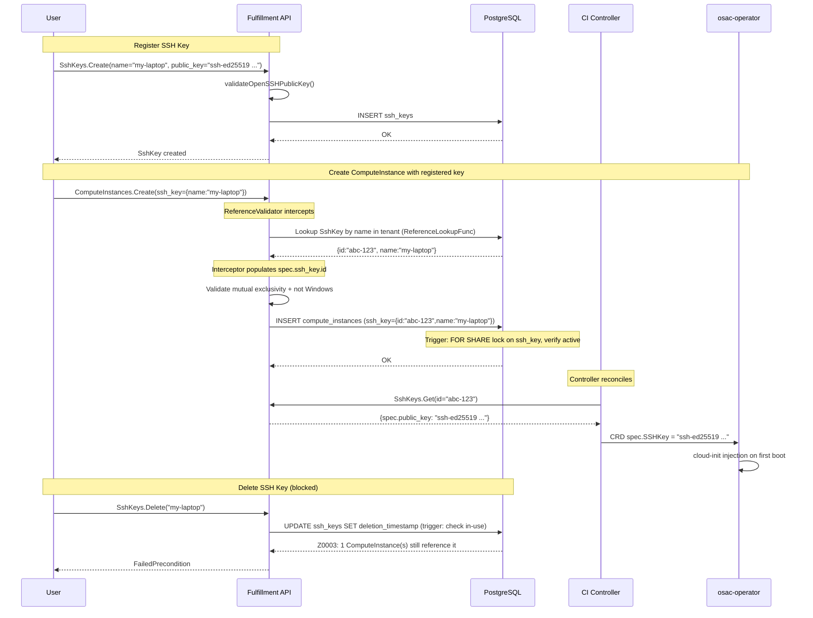

# Public SSH Key Registry

## Summary

Introduce a new `SshKey` resource in the fulfillment-service that lets tenants register named SSH public keys and reference them by name when creating a ComputeInstance. The `ComputeInstanceSpec` gains an `SshKeyReference ssh_key` field (message with `id` + `name`). `SshKeyReference` is a tenant-scoped exception to the standard `Reference`/`LocalReference` convention (API.md §References) — the registered lookup function ignores the project parameter because SshKeys are tenant-wide. The `ReferenceValidator` gRPC interceptor validates user-provided references at API create time. A PostgreSQL `check_compute_instance_ssh_key_ref` trigger provides defense-in-depth validation with `FOR SHARE` locking. Catalog and template SSH key defaults are out of scope for this milestone. SSH key references are provided exclusively through the ComputeInstance create request. The ComputeInstance controller resolves the key at reconciliation time via `SshKeys.Get` using the canonical `id` and passes the raw public key material to the osac-operator CRD for cloud-init injection on first boot. See [PRD](prd.md) for detailed requirements.

## Motivation

Today, every ComputeInstance creation requires the user to paste the full SSH public key string into `spec.ssh_public_key`. There is no way to name, store, or reuse a key. This is error-prone (a single mistyped character silently derails VM access) and diverges from the register-once-reference-by-name model used by AWS EC2 key pairs, GCP, and GitHub.

The fulfillment-service already stores raw SSH public keys inline on ComputeInstance and BareMetalInstance specs, and already has a `validateOpenSSHPublicKey()` function that parses keys using `golang.org/x/crypto/ssh`. The existing Secret resource is not a fit because SSH public keys are not secret data, and storing them in Vault would add complexity without security benefit.

### Goals

- Introduce `SshKey` as a first-class, service-agnostic resource with its own proto, gRPC service, and database table, following the standard OSAC object shape (`id`, `Metadata`, `Spec`, `Status`).
- Reuse the existing `validateOpenSSHPublicKey()` function for key validation.
- Reference SSH keys via a typed `SshKeyReference` message (with `id` + `name` fields). `SshKeyReference` is a tenant-scoped exception to the standard `Reference`/`LocalReference` naming convention (API.md §References) — it deliberately omits the `Local` suffix to avoid the `isLocalReference()` project-scoped lookup in `reference_validator.go`. The registered lookup function ignores the project parameter and resolves by `(tenant, id)` or `(tenant, name)` only. The `ReferenceValidator` gRPC interceptor validates user-provided references and auto-populates `id` from `name` at create time.
- Resolve SSH key references at reconciliation time in the ComputeInstance controller via `SshKeys.Get` using the canonical `id` (auto-populated by the interceptor at create time).
- Enforce referential integrity between `SshKey` and `ComputeInstance` using dual-layer defense: the `ReferenceValidator` gRPC interceptor provides immediate API feedback at create time, while a PostgreSQL `check_compute_instance_ssh_key_ref` trigger (SQLSTATE `Z0002`, `SELECT ... FOR SHARE`) provides concurrency-safe defense-in-depth validation. Deletion protection uses the `check_ssh_key_not_in_use` trigger (SQLSTATE `Z0003`).
- Support the feature via API, CLI (`osac create/get/delete sshkey`), and UI.

### Non-Goals

- Adding an `ssh_key` reference field to `BareMetalInstance` or `Cluster` in this milestone. The registry API is service-agnostic by design (D1), but only ComputeInstance integration is delivered.
- A functional `Update` RPC for `SshKey`. The private proto defines `Update` and `Signal` as structural requirements of `GenericServer.Build()`, but the server returns `Unimplemented` for `Update`. Neither `Update` nor `Signal` is exposed in the public proto or as a public REST endpoint (D10). To change a key's name, the user deletes and re-registers.
- Storing SSH public keys in Vault or the existing `Secret` resource. Public keys are not secret data.
- Quota enforcement on the number of registered SSH keys per tenant (D7).
- Catalog or template SSH key defaults. SSH keys are tenant/user access identities, not VM profile settings. SSH key references are provided exclusively through the ComputeInstance create request in this milestone.
- Private key storage, multiple keys per VM, key rotation, or external secret manager integration (see PRD Out of Scope).

## Proposal

Three components change:

1. **New `SshKey` resource** (fulfillment-service): A tenant-scoped resource with GenericServer integration. Public API exposes List, Get, Create, and Delete. Update and Signal are private-only (Update returns `Unimplemented`; Signal delegates to `generic.Signal`). Stores the SSH public key material in PostgreSQL. Validated with `ssh.ParseAuthorizedKey` on create. Names are unique per tenant (including during pending deletion, per the standard platform contract). Rejects non-empty `metadata.project` (SshKey is tenant-scoped, not project-scoped).

2. **`ComputeInstance` field addition** (fulfillment-service): A new `SshKeyReference ssh_key` field (field 21) on `ComputeInstanceSpec` references a registered key using a tenant-only typed reference (`id` + `name` message). Mutually exclusive with the existing `spec.ssh_public_key` (field 7). The `ssh_key` reference is immutable after creation. The existing raw `ssh_public_key` field remains mutable to preserve backward compatibility. The `ReferenceValidator` gRPC interceptor validates user-provided references via the registered tenant-only `ReferenceLookupFunc` and auto-populates the `id` from `name` (or vice versa) at create time. The server enforces mutual exclusivity. The controller resolves the key at reconciliation time via `SshKeys.Get` using `spec.ssh_key.id`.

3. **CLI extension** (fulfillment-service): A new `osac create sshkey` subcommand with `--name` and `--public-key`/`--public-key-file` flags. The existing `osac create computeinstance` command gains an `--ssh-key` flag. Generic `osac get`/`osac delete` commands auto-discover the new type via reflection.

The osac-operator receives the raw key in `spec.SSHKey` as before and needs no changes. The osac-ui changes are tracked as a separate deliverable in the same milestone.

### Workflow Description

#### Registering an SSH key

**Actor**: Tenant Admin or Tenant User.
**Starting state**: User has an SSH key pair generated locally.

1. **Tenant User** calls `SshKeys.Create` (via API, CLI `osac create sshkey --name my-laptop --public-key "ssh-ed25519 ..."`, or UI) with `metadata.name` and `spec.public_key`.
2. **Fulfillment-service** validates:
   - `metadata.project` is empty (SshKey is tenant-scoped; non-empty project is rejected with `InvalidArgument`).
   - `metadata.name` is a valid DNS label (protovalidate).
   - `spec.public_key` is a well-formed OpenSSH public key (`validateOpenSSHPublicKey`).
   - `metadata.name` is unique within the tenant (database unique index).
3. **Fulfillment-service** persists the SshKey in PostgreSQL and returns the created object.

#### Creating a ComputeInstance with a registered key

**Actor**: Tenant Admin or Tenant User.
**Starting state**: At least one SshKey is registered in the tenant.

1. **Tenant User** calls `ComputeInstances.Create` with `spec.ssh_key = {name: "my-laptop"}` (the registered key name). The user may provide `name`, `id`, or both.
2. **`ReferenceValidator` interceptor** (gRPC unary interceptor) validates the `SshKeyReference` field via the registered tenant-only `ReferenceLookupFunc`, auto-populating the missing `id` (if the user provided only `name`) or `name` (if the user provided only `id`). If the SSH key does not exist, the interceptor returns `InvalidArgument` before the request reaches the server handler. Note: unlike `SecretLocalReference`, `SshKeyReference` uses a custom name (without the `Local` suffix) to avoid the `isLocalReference()` project-scoped lookup — see the lookup registration section for details.
3. **Fulfillment-service** validates (in order):
   a. Mutual exclusivity: `spec.ssh_key` and `spec.ssh_public_key` cannot both be set (`InvalidArgument`).
   b. Guest OS compatibility: if the catalog item resolves to a Windows guest, `ssh_key` is rejected (`InvalidArgument`).
   c. User data type compatibility: if `user_data_secret` is set and the catalog item indicates ignition-type user data (not cloud-init), `ssh_key` is rejected (`InvalidArgument: SSH key injection requires cloud-init; ignition user data is not compatible`). **Platform note**: All currently supported Linux images in the OSAC platform use cloud-init for first-boot configuration. Ignition-based images (e.g., Fedora CoreOS, RHCOS) are not yet supported as catalog items. This check is a forward-compatibility guard — if ignition-based images are added in a future milestone, this validation prevents SSH key references from being silently ignored (ignition does not consume cloud-init SSH key injection). If the platform adds ignition support before SshKey reaches GA, the injection mechanism must be extended to support ignition's `passwd.users[].sshAuthorizedKeys` path.
4. **Fulfillment-service** persists the ComputeInstance. The database trigger `check_compute_instance_ssh_key_ref` re-validates the SSH key reference at INSERT time with a `SELECT ... FOR SHARE` lock, preventing a concurrent deletion race (TOCTOU). If the key was deleted between the interceptor check and the INSERT, the trigger raises `Z0002`. Both `id` and `name` are populated in the stored record (auto-populated by the interceptor). The raw key is **not** copied into `spec.ssh_public_key` — spec is user-controlled (API.md).
5. **ComputeInstance controller** resolves `spec.ssh_key` at reconciliation time: calls `SshKeys.Get` (private API) using `spec.ssh_key.id` (the canonical ID auto-populated by the interceptor at create time). Extracts `spec.public_key` and passes it to the osac-operator CRD as `spec.SSHKey`.
6. **osac-operator** injects the key into the VM via KubeVirt/cloud-init on first boot.

#### Deleting an SSH key

**Actor**: Tenant Admin or Tenant User.

1. **Tenant User** calls `SshKeys.Delete`.
2. **Database trigger** (`check_ssh_key_not_in_use`) checks whether any active ComputeInstance references the key.
3. If referenced: deletion is rejected with SQLSTATE `Z0003`, surfaced as `FailedPrecondition: cannot delete SshKey 'my-laptop': N ComputeInstance(s) still reference it`.
4. If not referenced: the key is soft-deleted.



### API Extensions

**New gRPC service**: `SshKeys` in both public (`osac.public.v1`) and private (`osac.private.v1`) packages.

| Method | REST Transcoding | Description |
|--------|-----------------|-------------|
| `List` | `GET /api/fulfillment/v1/ssh-keys` | List SSH keys in the tenant |
| `Get` | `GET /api/fulfillment/v1/ssh-keys/{id}` | Get a specific SSH key by ID |
| `Create` | `POST /api/fulfillment/v1/ssh-keys` | Register a new SSH key |
| `Delete` | `DELETE /api/fulfillment/v1/ssh-keys/{id}` | Delete an SSH key |
| `Update` | (private only, no REST) | Required by GenericServer; returns `Unimplemented` |
| `Signal` | (private only, no REST) | Required by GenericServer; no-op for SshKey |

**GenericServer integration**: `GenericServer.Build()` requires all six RPCs (List, Get, Create, Update, Delete, Signal) to discover their request/response message types at startup. Omitting any RPC from the proto causes a hard startup error. Therefore:
- The private `SshKeys` proto defines all six RPCs. The public proto defines List, Get, Create, and Delete only — `Update` and `Signal` are private-only, following the same private-method pattern as Signal (D10: no update or rename endpoint).
- `PrivateSshKeysServer.Update` returns `codes.Unimplemented` with the message `"SshKey update is not supported; delete and re-register to change a key"`. No public REST endpoint or OPA authorization entry is exposed for Update — clients never reach it.
- `Signal` follows the standard GenericServer pattern (delegates to `generic.Signal`).

**Event payload**: The `Event` message's `payload` oneof in `event_type.proto` must include an `SshKey` entry at the next available field number (36) so that event notifications carry the SshKey payload. Without this, SshKey events would silently drop their payload.

**Modified gRPC service**: `ComputeInstances` — the `Create` method gains SSH key mutual exclusivity and guest OS validation. Reference validation is handled by the `ReferenceValidator` interceptor (not custom server logic). No new RPC methods.

**Modified proto message**: `ComputeInstanceSpec` gains `SshKeyReference ssh_key = 21` in both public and private APIs. Field 20 is already allocated to `SecretLocalReference user_data_secret = 20`. The `user_data_secret` field provides the precedent for typed reference messages on `ComputeInstanceSpec`. Note: `SshKeyReference` deliberately does not use the `LocalReference` suffix — see the lookup registration section for why. Coordinate the exact field number at implementation time — use the next available number after the highest allocated field in `ComputeInstanceSpec`.

**Server registration**: The following files must be updated to register SshKey:

| File | Change |
|------|--------|
| `register_servers.go` | Build and register `SshKeysServer` (public) and `PrivateSshKeysServer` (private) in the shared (always-registered) block — SshKey CRUD is not feature-gated. The `EnableSshKeyReference` feature gate (see Version Skew Strategy) controls only whether `ComputeInstance.spec.ssh_key` references are accepted by admission, not whether the SshKey service itself is available |
| `unknown_service_handler.go` | Not required — SshKey is shared infrastructure, not VMaaS-gated. It is always registered regardless of VMaaS/CaaS/BMaaS flags |
| `start_rest_gateway_cmd.go` | Add `publicv1.RegisterSshKeysHandler` and `privatev1.RegisterSshKeysHandler` to the shared (always-registered) handler list |
| `authz.rego` | Add SshKey method entries (see RBAC / Tenancy section) |
| `grpc_authz_interceptor_test.go` | Add test cases for SshKey methods: client allowed, unauthenticated rejected |

## UX Alignment

No `@temp-api` file exists for `SshKey` in `osac-ux/libs/ui-components/src/api/v1/`. This is a new resource.

**UI changes are tracked as a separate deliverable** within the same milestone, in the `osac-ui` repository. The UI work includes:
- Creating `libs/ui-components/src/api/v1/ssh-key.ts` with `useApiQuery`/`useMutation` hooks for SshKey CRUD after `pnpm gen-types` runs.
- Registering `ssh-keys` in the `ApiRoute` type (`libs/ui-components/src/api/types.ts`).
- Adding SSH key management pages (list, create, delete) under the tenant section.
- Refactoring the existing `SshKeyField.tsx` (multiline paste textarea) to a key-selection dropdown that lists registered keys from `SshKeys.List`, with an option to fall back to raw key paste for backward compatibility.

### Implementation Details/Notes/Constraints

#### SshKey Proto Schema

```protobuf
// ssh_key_type.proto (private — source of truth)
message SshKey {
  string id = 1;
  Metadata metadata = 2;
  SshKeySpec spec = 3;
  SshKeyStatus status = 4;
}

message SshKeySpec {
  // OpenSSH authorized_keys format. Required. Immutable.
  string public_key = 1 [
    (buf.validate.field).string.min_len = 1,
    (google.api.field_behavior) = REQUIRED,
    (google.api.field_behavior) = IMMUTABLE
  ];
}

message SshKeyStatus {}

// Reference to an SshKey resource. SshKeyReference is a tenant-scoped exception
// to the standard Reference/LocalReference convention (API.md §References).
// Unlike *LocalReference messages (which imply project-scoped lookup via
// isLocalReference() in reference_validator.go), SshKeyReference uses a
// tenant-only lookup — the registered lookup function ignores the project
// parameter entirely. This is correct because SshKeys are tenant-wide resources
// that do not support project scoping. The message has only id + name fields;
// no project, shared, or tenant fields are included.
message SshKeyReference {
  string id = 1;
  string name = 2;
}
```

The public proto is auto-generated from the private proto via `uv run dev.py build protos`. `SshKeyStatus` is initially empty but provides an extension point for future fields (e.g., key algorithm, fingerprint). The `SshKeyReference` message has the same shape as `SecretLocalReference` (`{id, name}`) but uses a distinct name (`SshKeyReference` rather than `SshKeyLocalReference`) to avoid the `isLocalReference()` naming convention in `reference_validator.go`, which assumes project-scoped lookup. See the lookup registration section below for how the tenant-only lookup is registered.

#### ComputeInstance Field Addition

```protobuf
// In compute_instance_type.proto (private — source of truth)
message ComputeInstanceSpec {
  // ... existing fields 1-19 ...

  // Typed reference to a registered SSH key within the same tenant.
  // The ReferenceValidator interceptor validates the reference via the
  // registered lookup function and auto-populates id from name (or vice
  // versa) at create time. SshKeyReference is registered explicitly (not
  // auto-discovered by "LocalReference" suffix) with a tenant-only lookup.
  // Mutually exclusive with ssh_public_key. Immutable after creation.
  // Only valid for cloud-init instances; rejected for Windows instances
  // and ignition-based user data.
  SshKeyReference ssh_key = 21 [(google.api.field_behavior) = IMMUTABLE];
}
```

Mutual exclusivity of `ssh_public_key` (field 7) and `ssh_key` (field 21) is enforced in server-side Go code, not in proto annotations, because cross-field validation with optional fields requires runtime logic.

#### Server Implementation

**`PrivateSshKeysServer`**: Uses `GenericServer[*privatev1.SshKey]` for standard CRUD. Custom logic:

- `Create` validation:
  1. `metadata.project` must be empty — SshKey is tenant-scoped, not project-scoped (`InvalidArgument` if non-empty).
  2. `metadata.name` required (Go check, in addition to protovalidate).
  3. `spec.public_key` parsed via `validateOpenSSHPublicKey()` — reuses existing function from `ssh_validation.go`.
- `Update` returns `codes.Unimplemented` with message `"SshKey update is not supported; delete and re-register to change a key"`. The RPC exists as a structural requirement of `GenericServer` but is private-only — not exposed in the public proto or as a public REST endpoint (D10).
- `Signal` delegates to `generic.Signal` (standard pattern).

**`SshKeysServer`** (public): Standard delegation pattern — maps public SshKey to private via `GenericMapper`, delegates to `PrivateSshKeysServer`.

**`PrivateComputeInstancesServer.Create` update**: After existing catalog-item and template validation, add (in order):

1. **Mutual exclusivity**: If both `ssh_key` and `ssh_public_key` are set, return `InvalidArgument: spec.ssh_key and spec.ssh_public_key are mutually exclusive`.
2. **Guest OS validation**: If `ssh_key` (or `ssh_public_key`) is set and the catalog item resolves to a Windows guest OS (`GuestOSFamily == "windows"`), return `InvalidArgument: SSH key injection is not supported for Windows instances`.
3. **User data type validation**: If `ssh_key` is set and the instance's user data type is ignition (not cloud-init), return `InvalidArgument: SSH key injection requires cloud-init; ignition user data is not compatible`. Note: all currently supported Linux catalog items use cloud-init; this is a forward-compatibility guard for potential future ignition-based images.

**SSH key reference validation (two-layer defense)**: Two complementary mechanisms validate SSH key references:

1. **Layer 1 — `ReferenceValidator` interceptor** (immediate API feedback): When a `ComputeInstances.Create` request arrives, the interceptor discovers the `SshKeyReference ssh_key` field, invokes the registered tenant-only `ReferenceLookupFunc` (backed by a `GenericDAO[*privatev1.SshKey]` that ignores the project parameter — see lookup registration above), and validates that the referenced SSH key exists within the tenant. If the key does not exist, the interceptor returns `InvalidArgument` before the request reaches the server handler. The interceptor also auto-populates `id` from `name` (or vice versa). This layer provides fast user feedback.

2. **Layer 2 — DB trigger `check_compute_instance_ssh_key_ref`** (defense-in-depth): A `BEFORE INSERT OR UPDATE` trigger on `compute_instances` acquires a `FOR SHARE` lock on the referenced SSH key row and verifies it is active. This serves as defense-in-depth:
   - **TOCTOU race prevention**: The interceptor's DAO lookup does not hold a row lock. Between the interceptor check and the database INSERT, a concurrent `SshKeys.Delete` could soft-delete the key. The trigger's `FOR SHARE` lock serializes against concurrent deletion, closing the race window (matching the `check_secret_ref_exists` pattern from migration 111).
   - **Catch-all safety net**: Catches any reference that bypasses the interceptor (e.g., direct DB writes, future write paths). The `Z0002` error maps to `InvalidArgument` via the DAO's SQLSTATE mapping.

**Server registration** for reference validation: Add SshKey lookups to `reference_lookups.go`:

```go
sshKeysDAO, err := dao.NewGenericDAO[*privatev1.SshKey]().
    SetLogger(logger).
    SetTenancyLogic(tenancyLogic).
    SetMetricsRegisterer(metricsRegisterer).
    Build()
if err != nil {
    return fmt.Errorf("failed to create SshKey DAO for reference lookups: %w", err)
}

// Tenant-only lookup function: receives (ctx, tenant, project, id, name)
// from the validator but IGNORES the project parameter. SshKeys are tenant-
// scoped resources — the lookup resolves by (tenant, id) or (tenant, name)
// only. The validator passes callerTenant + callerProject by default
// (reference_validator.go lines 428-429); this function simply doesn't use
// the project. Cross-tenant references fail because the lookup is scoped
// to the caller's tenant.
sshKeyLookup := func(ctx context.Context, tenant, project, id, name string) (
    foundID, foundName string, err error,
) {
    // project is intentionally ignored — SshKey is tenant-scoped, not project-scoped
    return references.NewScopedDAOLookupFunc(sshKeysDAO)(ctx, tenant, "" /* no project */, id, name)
}

validator.Register(
    "osac.private.v1.SshKeyReference",
    sshKeyLookup,
)
validator.Register(
    "osac.public.v1.SshKeyReference",
    sshKeyLookup,
)
```

**Why `SshKeyReference` instead of `SshKeyLocalReference`**: The `reference_validator.go` `isLocalReference()` function checks whether a message type name ends with `LocalReference` and, if so, uses the caller's project for scoped lookup. Since `SshKey` is tenant-scoped (not project-scoped), using `SshKeyLocalReference` would trigger incorrect project-scoped behavior. By naming the message `SshKeyReference` (without the `Local` suffix), we avoid the `isLocalReference()` semantic and register a custom lookup function that ignores the project parameter entirely. No changes to `reference_validator.go` are required — the validator passes `callerTenant` and `callerProject` by default, and our lookup function simply doesn't use `project`.

The server does **not** copy the resolved key into `spec.ssh_public_key` — API.md mandates that spec is exclusively user-controlled.

**`PrivateComputeInstancesServer.validateImmutability` update**: Add immutability enforcement for `spec.ssh_key` only:

```go
updatingSshKey := updateIncludesField(mask, "spec.ssh_key")
// ...
if updatingSshKey && !proto.Equal(existingSpec.GetSshKey(), newSpec.GetSshKey()) {
    return grpcstatus.Errorf(grpccodes.InvalidArgument,
        "cannot change spec.ssh_key: ssh_key is immutable after creation")
}
```

Note: `spec.ssh_key` comparison uses `proto.Equal` because `SshKeyReference` is a message type, not a string.

**Immutability asymmetry**: The existing raw `ssh_public_key` field remains mutable to preserve backward compatibility. The `ssh_key` reference is immutable because changing it without re-provisioning creates a VM whose injected key does not match the spec — the osac-operator injects the key only on first boot via cloud-init, so a post-creation reference change would have no effect on the running VM. This asymmetry is intentional: `ssh_public_key` mutability is an existing contract that callers may depend on; `ssh_key` immutability is a new constraint on a new field.

**ComputeInstance controller update**: The `addExplicitFields` function is extended to resolve `spec.ssh_key` at reconciliation time:

1. If `spec.ssh_key` is set (the message is non-nil), call `SshKeys.Get` (private API) using `spec.ssh_key.id`. The `id` is always available because the `ReferenceValidator` interceptor auto-populated it from `name` at create time. Using `Get`-by-ID is a direct single-row lookup — no CEL filter, tenant scoping, or result-count assertion needed. Tenant isolation is guaranteed by the interceptor at create time (the lookup function is scoped to the tenant).
2. **gRPC error classification**: The controller classifies gRPC errors from the `SshKeys.Get` call using typed errors to set specific `status.state` and condition `reason` values, bypassing the hardcoded `ReconciliationFailed` reason. See the classification table below.
3. On success, extract `spec.public_key` from the resolved SshKey and set `spec.SSHKey` on the osac-operator CRD.

**Structured error type for reconciler integration**: The existing reconciler (`computeinstance_reconciler_function.go:157`) marks every non-`errTransientK8sError` error as failed via `setReconciliationFailed`. To support the SSH key error classification, define a structured `SshKeyResolutionError` type that is consumed and logged **inside** the ComputeInstance reconciler's SSH key resolution block, **before** the error reaches the generic reconciler's error handler:

```go
// SshKeyResolutionError represents an error during SSH key resolution in the
// ComputeInstance reconciler. It carries classification metadata (Permanent flag,
// typed Reason) so the reconciler can decide whether to call setReconciliationFailed
// or preserve the instance's current status.
type SshKeyResolutionError struct {
    // Permanent indicates whether this error should mark the instance as failed.
    // true: set status.state to failed, add condition with Reason.
    // false: log warning, preserve current status, retry on next sync.
    Permanent bool
    // Reason is the typed condition reason (e.g., "SshKeyNotFound", "SshKeyInvalid").
    // Only meaningful when Permanent is true.
    Reason string
    // Err is the underlying gRPC or application error.
    Err error
}

func (e *SshKeyResolutionError) Error() string {
    return fmt.Sprintf("ssh key resolution error (permanent=%t, reason=%s): %v",
        e.Permanent, e.Reason, e.Err)
}

func (e *SshKeyResolutionError) Unwrap() error { return e.Err }
```

**Consumption site and error ownership**: The ComputeInstance reconciler owns the status update for SSH key resolution errors. After handling, it returns `nil` to prevent the generic reconciler from overwriting the typed failure reason. The `SshKeyResolutionError` is consumed **inside** the ComputeInstance reconciler (in the `addExplicitFields` SSH key resolution block), and the generic reconciler never sees SSH key resolution errors:

```go
// In addExplicitFields, after SshKeys.Get call:
var sshKeyErr *SshKeyResolutionError
if err != nil && errors.As(err, &sshKeyErr) {
    if sshKeyErr.Permanent {
        // Permanent: set failed state with typed reason, log error.
        // Return nil — the CI reconciler owns this status update.
        // The generic reconciler must NOT overwrite the typed reason.
        logger.Error("SSH key resolution failed permanently",
            "reason", sshKeyErr.Reason, "error", sshKeyErr.Err)
        t.setReconciliationFailedWithReason(sshKeyErr.Err, sshKeyErr.Reason)
        return nil // handled — do not propagate to generic reconciler
    }
    // Transient: log warning, do NOT change status, return nil.
    // The instance will be re-reconciled on the next event or periodic sync.
    logger.Warn("SSH key resolution failed transiently, will retry on next sync",
        "error", sshKeyErr.Err)
    return nil // handled — do not propagate to generic reconciler
}

// Feature gate disabled: return nil to preserve current status.
if !enableSshKeyReference && spec.GetSshKey() != nil {
    logger.Warn("SSH key reference feature is disabled, skipping resolution")
    return nil // handled — do not propagate to generic reconciler
}
```

The generic reconciler's error-handling block (`computeinstance_reconciler_function.go:157`) does **not** need modification for SSH key errors — it never sees them. Only non-SSH-key errors (e.g., instance-type resolution failures, K8s errors) reach the generic reconciler's `setReconciliationFailed` handler:

```go
// Generic reconciler error handler (line 157) — unchanged.
// SSH key resolution errors are handled above and return nil.
// Only non-SSH-key errors reach here.
if reconcileErr != nil && !errors.Is(reconcileErr, errTransientK8sError) {
    t.setReconciliationFailed(reconcileErr)
}
```

Tests must verify: (a) `SshKeyResolutionError` with `Permanent=false` is caught by `errors.As` in the SSH key resolution block, logged as warning, and returns `nil` — the generic reconciler never calls `setReconciliationFailed`, (b) `SshKeyResolutionError` with `Permanent=true` is caught by `errors.As`, calls `setReconciliationFailedWithReason` with the typed `Reason`, returns `nil`, and the generic reconciler does not see the error (no double-handling), (c) feature gate disabled with `spec.ssh_key` set returns `nil` — preserves status and does not write CRD, (d) non-SSH-key errors (e.g., instance-type resolution failures) still reach the generic reconciler's `setReconciliationFailed` unchanged.

**gRPC Error Classification Table:**

| gRPC Code | Classification | Controller Behavior |
|---|---|---|
| `NotFound` | Permanent | Set `status.state` to failed state, add condition with reason `SshKeyNotFound`. |
| `InvalidArgument` | Permanent | Set `status.state` to failed state, add condition with reason `SshKeyInvalid`. |
| `PermissionDenied` | Transient (rollout) | Log warning, do not change status (see rollout note below). |
| `Unavailable` | Transient | Log warning, do not change status. |
| `DeadlineExceeded` | Transient | Log warning, do not change status. |
| `Unimplemented` | Transient (rollout) | Log warning, do not change status (see rollout note below). |
| `Aborted` | Transient | Log warning, do not change status. Indicates a database deadlock retry; safe to retry. |
| `Internal` | Transient | Log warning, do not change status. Indicates a generic server-side failure; alert if persistent. |
| `Canceled` | Stop | Do not change status, do not retry. Context was canceled (e.g., controller shutdown). |
| _(any other code)_ | Transient (default) | Log warning with the unexpected code, do not change status. Treat unknown codes as transient to avoid prematurely failing instances on unexpected error shapes. |

**Terminology note**: `ComputeInstanceStatus` uses a `state` field (`ComputeInstanceState` enum), not `phase`. Throughout this section, "set failed state" means setting `status.state` to the appropriate failed enum value and adding a condition with a specific `reason` string (e.g., `SshKeyNotFound`, `SshKeyInvalid`). The typed `reason` values bypass the generic `ReconciliationFailed` reason, giving operators and support tooling precise failure classification.

**What "permanent" means**: A permanent error sets the instance's state to failed and adds a diagnostic condition. However, the instance **will still be re-reconciled** on the next watch event or 1-hour periodic full sync — the periodic sync pushes every object through `objectChannel`, including failed ones. On re-reconciliation, the controller re-evaluates the SSH key reference: if the underlying condition persists (key still missing), it re-sets the failed state; if the condition has been resolved (key re-registered, permission granted), reconciliation proceeds normally. "Permanent" means "the controller marks the failure and stops the current reconciliation attempt" — not "the instance is never reconciled again."

**Reconciliation retry model**: The reconciler does **not** have an automatic requeue or exponential backoff mechanism. When a transient error occurs, the controller logs the warning and returns without changing instance status. The error is retried only when the next reconciliation is triggered by a future event (e.g., a watch event on the ComputeInstance or SshKey) or by the **1-hour periodic full sync**. This means transient errors may take up to 1 hour to self-resolve in the absence of new events.

**Rollout-transient codes**: `PermissionDenied` and `Unimplemented` are classified as transient because they occur naturally during the staged feature gate rollout (Stage 1 → Stage 3) — the SshKey service may not yet be fully authorized or the RPC may not be registered on all pods. Once the feature gate is enabled (Stage 3) and the rollout is complete, persistent `PermissionDenied` or `Unimplemented` errors indicate a genuine configuration or deployment problem. **Recommendation**: set up alerting for these codes if they persist for more than 2 periodic sync cycles (>2 hours) after gate enablement.

This resolution pattern follows the same approach as `InstanceTypes.Get` for resolving cores/memory from `spec.instance_type` — direct ID-based lookup with the ID pre-populated at create time by the `ReferenceValidator` interceptor.

#### Database Migration

The `ssh_keys` table requires an explicit migration (GenericDAO does not auto-create tables). Migration `113_create_ssh_keys_tables.up.sql` (coordinate numbering at implementation time; current latest is 112):

```sql
-- Create tables for SshKey resources.
create table ssh_keys (
  id text not null primary key,
  name text not null default '',
  creation_timestamp timestamp with time zone not null default now(),
  deletion_timestamp timestamp with time zone not null default 'epoch',
  finalizers text[] not null default '{}',
  creator text not null default '',
  tenant text not null default '',
  project ltree not null default ''::ltree,
  labels jsonb not null default '{}'::jsonb,
  annotations jsonb not null default '{}'::jsonb,
  data jsonb not null,
  version integer not null default 0
);

create table archived_ssh_keys (
  id text not null,
  name text not null default '',
  creation_timestamp timestamp with time zone not null,
  deletion_timestamp timestamp with time zone not null,
  archival_timestamp timestamp with time zone not null default now(),
  finalizers text[] not null default '{}',
  creator text not null default '',
  tenant text not null default '',
  project ltree not null default ''::ltree,
  labels jsonb not null default '{}'::jsonb,
  annotations jsonb not null default '{}'::jsonb,
  data jsonb not null,
  version integer not null default 0
);

-- Indexes:
create index ssh_keys_by_name_tenant on ssh_keys (name, tenant);
create index ssh_keys_by_creator on ssh_keys (creator);
create index ssh_keys_by_tenant on ssh_keys (tenant);
create index ssh_keys_by_label on ssh_keys using gin (labels);

-- Tenant-wide unique name across all rows (active and pending-deletion).
-- Deliberately omits `project` — SshKey is tenant-scoped (D6), not project-scoped.
-- Names remain reserved while deletion is pending, matching the standard OSAC
-- platform contract (API.md: "A name remains reserved while the object exists,
-- including while deletion is pending until archival completing").
create unique index ssh_keys_unique_name_per_tenant
  on ssh_keys (name, tenant)
  where name != '';

-- Tenant foreign key:
alter table ssh_keys
  add constraint ssh_keys_tenant_fk
  foreign key (tenant) references tenants (name);

-- Immutability of key columns:
create trigger check_immutable_columns
  before update on ssh_keys
  for each row
  execute function check_immutable_columns('id', 'name', 'tenant', 'project');

-- Active-object materialization (required by the GenericDAO active-objects framework):
create table active_ssh_keys (
  id text not null primary key references ssh_keys (id) on delete cascade
);

create trigger materialize_active_objects
  before insert or update on ssh_keys
  for each row execute function materialize_active_objects();
```

A second migration `114_add_ssh_key_delete_protection_trigger.up.sql` adds deletion protection:

```sql
-- Index for SSH key reference lookups on compute_instances (by ID, since the
-- ReferenceValidator interceptor auto-populates spec.ssh_key.id at create time):
create index compute_instances_by_ssh_key_id on compute_instances
  ((data->'spec'->'ssh_key'->>'id'))
  where deletion_timestamp = 'epoch'
    and data->'spec'->'ssh_key'->>'id' is not null;

-- Prevent deleting an SSH key while active ComputeInstances reference it.
-- Looks up by ID (the canonical identifier populated by the ReferenceValidator
-- interceptor), matching the Secret deletion protection pattern in migration 111.
create function check_ssh_key_not_in_use() returns trigger as $$
declare
  ci_count bigint;
begin
  select count(*) into ci_count
  from compute_instances
  where deletion_timestamp = 'epoch'
    and data->'spec'->'ssh_key'->>'id' = old.id;

  if ci_count > 0 then
    raise exception using
      errcode = 'Z0003',
      message = format(
        'cannot delete SshKey ''%s'': %s ComputeInstance(s) still reference it',
        old.name, ci_count
      );
  end if;

  return new;
end;
$$ language plpgsql;

create trigger check_ssh_key_not_in_use
  before update on ssh_keys
  for each row
  when (old.deletion_timestamp = 'epoch' and new.deletion_timestamp != 'epoch')
  execute function check_ssh_key_not_in_use();
```

The same migration also adds the Z0002 reference-existence trigger for TOCTOU race prevention and defense-in-depth validation. The trigger rejects any persisted SSH key reference that: (a) lacks both `id` and `name` (incomplete), (b) has an inconsistent `name` (the `id` points to a key with a different name), or (c) points to an inactive or different-tenant key. This closes gaps if another write path bypasses the interceptor.

```sql
-- Validate SSH key references on ComputeInstance insert and update, taking a
-- row lock that conflicts with a concurrent SshKey soft-delete (same pattern
-- as check_secret_ref_exists in migration 111). This trigger serves as
-- defense in depth — the ReferenceValidator interceptor is the primary
-- validation path, but this trigger catches any reference that bypasses
-- the interceptor (e.g., direct DB writes, future write paths):
--   * Closes the TOCTOU race between interceptor lookup and DB insert
--   * Rejects incomplete references (missing id or name)
--   * Rejects inconsistent name (id points to key with different name)
--   * Rejects inactive or different-tenant keys
create function check_compute_instance_ssh_key_ref() returns trigger as $$
declare
  ssh_key_id text;
  ref_name text;
  old_ssh_key_id text;
  found_id text;
  found_name text;
begin
  ssh_key_id := new.data->'spec'->'ssh_key'->>'id';
  ref_name := new.data->'spec'->'ssh_key'->>'name';

  -- On UPDATE of an active row, skip if the reference has not changed.
  if tg_op = 'UPDATE' and old.deletion_timestamp = 'epoch' then
    old_ssh_key_id := old.data->'spec'->'ssh_key'->>'id';
    if ssh_key_id is not distinct from old_ssh_key_id then
      return new;
    end if;
  end if;

  -- Reject incomplete references: both id and name must be present.
  -- The ReferenceValidator interceptor must produce canonical {id, name}
  -- references before persistence. This trigger is the safety net.
  if coalesce(ssh_key_id, '') = '' and coalesce(ref_name, '') != '' then
    raise exception using
      errcode = 'Z0002',
      message = format(
        'Incomplete SshKey reference: name ''%s'' is set but id is missing; '
        'the reference must be normalized to {id, name} before persistence',
        ref_name
      );
  end if;

  if coalesce(ref_name, '') = '' and coalesce(ssh_key_id, '') != '' then
    raise exception using
      errcode = 'Z0002',
      message = format(
        'Incomplete SshKey reference: id ''%s'' is set but name is missing; '
        'the reference must include both id and name',
        ssh_key_id
      );
  end if;

  if coalesce(ssh_key_id, '') = '' then
    return new;
  end if;

  -- Verify the SSH key exists, is active, and belongs to the same tenant.
  -- FOR SHARE lock serializes against concurrent soft-delete.
  select id, name into found_id, found_name
  from ssh_keys
  where id = ssh_key_id
    and tenant = new.tenant
    and deletion_timestamp = 'epoch'
  for share;

  if found_id is null then
    raise exception using
      errcode = 'Z0002',
      message = format(
        'SshKey ''%s'' does not exist or has been deleted',
        ssh_key_id
      );
  end if;

  -- Reject inconsistent name: id points to a key with a different name.
  if found_name != ref_name then
    raise exception using
      errcode = 'Z0002',
      message = format(
        'SshKey reference inconsistent: id ''%s'' resolves to name ''%s'' but reference has name ''%s''',
        ssh_key_id, found_name, ref_name
      );
  end if;

  return new;
end;
$$ language plpgsql;

create trigger check_compute_instance_ssh_key_ref
  before insert or update of data, deletion_timestamp on compute_instances
  for each row
  when (new.deletion_timestamp = 'epoch')
  execute function check_compute_instance_ssh_key_ref();
```

**Two-layer validation model**: SSH key references are validated by two complementary mechanisms. This is not redundant — each layer covers a different gap:
- **Layer 1 — `ReferenceValidator` interceptor**: Provides immediate `InvalidArgument` API feedback for user-provided references, auto-populates `id`/`name`, and enforces tenant scoping. Runs before the server handler. Does **not** hold a row lock.
- **Layer 2 — `check_compute_instance_ssh_key_ref` DB trigger** (defense in depth): Acquires `FOR SHARE` lock to prevent TOCTOU races with concurrent deletion, rejects incomplete references (missing `id` or `name`), rejects inconsistent `name` (id points to key with different name), and rejects inactive or different-tenant keys. Catches any reference that bypasses the interceptor (e.g., direct DB writes, future write paths).
- **Z0003 trigger**: Prevents SSH key deletion while active ComputeInstances reference it.

This follows the Secret reference pattern from migration 111 (which uses both the `ReferenceValidator` interceptor and a `check_secret_ref_exists` database trigger).

#### CLI Commands

- **`osac create sshkey`**: New subcommand in `internal/cmd/cli/create/sshkey/create_sshkey_cmd.go`. Follows the `create externalip` pattern (simple resource with a few flags). Flags:
  - `--name, -n` (required): Name for the SSH key (DNS label format).
  - `--public-key` (mutually exclusive with `--public-key-file`): Raw SSH public key string.
  - `--public-key-file` (mutually exclusive with `--public-key`): Path to a file containing the SSH public key. Read with `os.ReadFile`, trim whitespace with `strings.TrimSpace`.
  - Both `--public-key` and `--public-key-file` support the `~/.ssh/id_*.pub` convention.
  - Registered in `internal/cmd/cli/create/create_cmd.go`.
  - Help text uses Markdown with `{{ bt }}` for inline code per CLI conventions.
- **`osac create computeinstance`**: Add `--ssh-key` flag (mutually exclusive with existing `--ssh-public-key`). Set `spec.ssh_key = {name: "<value>"}` on the request object. The `ReferenceValidator` interceptor auto-populates the `id` field — the CLI does not need to resolve name→id. API responses return `spec.ssh_key = {id: "...", name: "..."}` instead of a bare string.
- **`osac get sshkey`** / **`osac delete sshkey`**: Work automatically via reflection — no code needed.

### Security Considerations

SSH public keys are **not sensitive data** — they are designed to be shared publicly. No redaction, encryption, or Vault storage is needed. The existing fulfillment-service security model applies without changes:

- **Authentication**: JWT-validated via the gRPC interceptor chain.
- **Authorization**: Tenant-scoped via OPA policies. SshKey follows the same tenant isolation model as all other resources — authorization keyed on `metadata.tenant`, not on `metadata.creator` (D2).
- **Input validation**: `ssh.ParseAuthorizedKey` rejects malformed keys. The `buf.validate` `min_len` constraint prevents empty strings. No key-strength or algorithm-allowlist check is applied (D4).
- **Tenant isolation**: SshKey records are scoped to a tenant. The `ReferenceValidator` interceptor validates that the SSH key belongs to the same tenant as the ComputeInstance at create time (the `ReferenceLookupFunc` is scoped to the requesting tenant).
- **Audit log safety**: SSH public keys are not secret, but raw key material can be lengthy and noisy in audit logs. The existing structured logging interceptor logs gRPC metadata (method, tenant, user) but does **not** log request/response bodies by default. No additional redaction is needed for SshKey. If a future audit-logging feature adds body logging, `spec.public_key` should be truncated or omitted from audit entries to avoid log bloat (not a security concern, but an operational one).

### Failure Handling and Recovery

| Failure Mode | System Behavior | User Observation |
|---|---|---|
| **Create with invalid key** | `validateOpenSSHPublicKey` rejects; returns `InvalidArgument` | Clear error: "invalid OpenSSH public key: ..." |
| **Create with duplicate name** | DB unique index rejects; returns `AlreadyExists` | "SshKey with name 'my-laptop' already exists in this tenant" |
| **Create with non-empty project** | Server rejects; returns `InvalidArgument` | "SshKey does not support projects; metadata.project must be empty" |
| **Delete while referenced** | Trigger raises `Z0003`; DAO returns `ErrInUse`; server returns `FailedPrecondition` | "cannot delete SshKey 'my-laptop': N ComputeInstance(s) still reference it" |
| **Create ComputeInstance with non-existent SSH key** | `ReferenceValidator` interceptor's `ReferenceLookupFunc` returns not-found; interceptor returns `InvalidArgument` before the request reaches the server handler | "SshKey 'my-laptop' not found in this tenant" |
| **Create ComputeInstance with SSH key on Windows** | Server detects Windows guest OS; returns `InvalidArgument` | "SSH key injection is not supported for Windows instances" |
| **Create ComputeInstance with SSH key on ignition instance** | Server detects ignition user data type; returns `InvalidArgument` | "SSH key injection requires cloud-init; ignition user data is not compatible" |
| **Create ComputeInstance with both ssh_key and ssh_public_key** | Server rejects; returns `InvalidArgument` | "spec.ssh_key and spec.ssh_public_key are mutually exclusive" |
| **Update ComputeInstance attempts to change ssh_key** | Immutability check rejects; returns `InvalidArgument` | "cannot change spec.ssh_key: ssh_key is immutable after creation" |
| **Concurrent delete + ComputeInstance create** | Two-layer defense: `ReferenceValidator` interceptor provides first check (no lock); `check_compute_instance_ssh_key_ref` trigger acquires `FOR SHARE` lock on SSH key row at INSERT, serializing against concurrent soft-delete | No race: either the ComputeInstance is created with the key (trigger lock blocks delete), or the trigger detects deleted key and raises Z0002 |
| **Controller: SshKey not found (`NotFound` — permanent)** | Controller sets `status.state` to failed, adds condition with `reason=SshKeyNotFound`; instance will be re-reconciled on next event or periodic sync but will re-fail if key is still missing | Instance enters Failed state; user must delete and recreate the instance with a valid SSH key reference (see Support Procedures) |
| **Controller: invalid SSH key reference (`InvalidArgument` — permanent)** | Controller sets `status.state` to failed, adds condition with `reason=SshKeyInvalid`; re-reconciled on next sync | Instance enters Failed state with specific reason |
| **Controller: fulfillment-service unavailable (`Unavailable`/`DeadlineExceeded` — transient)** | Controller logs warning; does **not** automatically requeue — retries on next event or 1-hour periodic sync | Instance remains in current state; resolves when service recovers and next sync fires |
| **Controller: permission/implementation gap (`PermissionDenied`/`Unimplemented` — transient during rollout)** | Controller logs warning; retries on next event or 1-hour periodic sync | Expected during staged rollout (gate disabled on some pods); alert if persistent post-gate |
| **Controller: database deadlock (`Aborted` — transient)** | Controller logs warning; retries on next event or 1-hour periodic sync | Transient database contention; self-resolves |
| **Controller: internal server error (`Internal` — transient)** | Controller logs warning; retries on next event or 1-hour periodic sync | Alert if persistent — indicates a server-side bug or infrastructure issue |
| **Controller: context canceled (`Canceled` — stop)** | Controller does not change instance status; reconciliation resumes on next controller start or next event | No user-visible impact |
| **Controller: unexpected gRPC code (default — transient)** | Controller logs warning with the unexpected code; does not change status | Treated as transient to avoid prematurely failing instances |
| **Database unavailable** | Standard `Internal` error from GenericDAO | "internal error" — no partial state since operations are transactional |

SshKey itself is an API-only resource with no async provisioning. The ComputeInstance controller handles SSH key resolution as part of its existing reconciliation loop. **Note**: the reconciler has no automatic requeue mechanism — all transient errors are retried only via future watch events or the 1-hour periodic sync (see the gRPC Error Classification Table in the controller update section).

### RBAC / Tenancy

SshKey inherits the existing tenant-scoped authorization model:
- `metadata.tenant` determines ownership (set by the tenancy logic interceptor).
- OPA policies enforce tenant isolation at the gRPC interceptor level.
- `metadata.creator` is informational only — any user in the tenant can manage any SshKey in that tenant (D2).

**OPA policy update required**: The `authz.rego` `has_client_permissions` allowlist must be extended with the public SshKey method entries:

```rego
"/osac.public.v1.SshKeys/Create",
"/osac.public.v1.SshKeys/Delete",
"/osac.public.v1.SshKeys/Get",
"/osac.public.v1.SshKeys/List",
```

`Update` is intentionally omitted from the public OPA allowlist because it is not exposed in the public proto (D10). Clients cannot reach the private `Unimplemented` stub through the public API.

**Authorization test coverage**: `grpc_authz_interceptor_test.go` must include test cases verifying that SshKey methods are allowed for authenticated clients and rejected for unauthenticated requests.

The reference trigger enforces cross-resource tenant consistency: a ComputeInstance can only reference an SshKey within the same tenant.

### Observability and Monitoring

No new observability changes. Existing monitoring mechanisms apply.

The `GenericServer` framework emits standard Prometheus metrics for all CRUD operations (request count, latency, error rate) keyed by service name. These automatically cover SshKey operations. The existing structured logging interceptor logs all gRPC calls with tenant, user, and method metadata.

### Risks and Mitigations

| Risk | Mitigation |
|---|---|
| **SSH key deletion and re-registration with the same name** — if a user could delete an SSH key and re-register with the same name, the ID-based reference on existing ComputeInstances would become stale (pointing to the old, deleted key's ID). | Deletion is blocked while any ComputeInstance references the key (Z0003 trigger). Names remain reserved during pending deletion (standard platform contract), preventing reuse until archival completes. The `SshKeyReference` stores the canonical `id` (a tenant-scoped reference that ignores project), so even if a new key with the same name were created (after archival), existing ComputeInstances would reference the old ID and the controller would get `NotFound`, correctly entering the failed state. |
| **Migration number collision** — another migration may claim the next available number. | Coordinate migration numbering with the team at implementation time. |
| **Trigger performance on large tables** — the `check_ssh_key_not_in_use` trigger scans `compute_instances` on every SSH key deletion. | The partial index `compute_instances_by_ssh_key_id` on `(data->'spec'->'ssh_key'->>'id')` (active rows, non-null) ensures index-only lookups. |

### Drawbacks

This design introduces a new first-class resource with its own proto, service, server, and migration. The maintenance cost is proportional to a standard OSAC resource — approximately 4 proto files, 2 server files, 2 migrations, and 1 CLI subcommand. The alternative (embedding keys in the existing Secret resource) would avoid this cost but would misuse Vault for non-secret data and couple the SSH key lifecycle to Secret's update/backend semantics.

The `SshKeyReference` stores both `id` and `name`, using a tenant-only lookup that is a deliberate exception to the standard `Reference`/`LocalReference` convention (SshKeys are tenant-wide, not project-scoped). The `ReferenceValidator` interceptor auto-populates whichever field the user omits. Users reference keys by name (as the PRD requires) while the controller resolves by ID (for stability).

## Alternatives (Not Implemented)

### Alternative 1: Embed SSH keys in the existing Secret resource

Store SSH public keys as a `Secret` with a discriminator field (e.g., `spec.type = "ssh-public-key"`).

**Pros**: Reuses existing Secret proto, service, server, and migration. No new resource type.

**Cons**: SSH public keys are not secret data — storing them in Vault adds unnecessary complexity, latency, and operational dependency. Secret's `spec.data` is `map<string, bytes>` (designed for multiple key-value entries), whereas an SSH key is a single string. Secret has Update semantics that conflict with the immutability requirement. Secret data is redacted in List/Create responses, which is unnecessary for public keys.

**Rejection reason**: Misuse of the Secret resource's purpose and infrastructure. The overhead of a new resource type is small and justified by the cleaner abstraction.

### Alternative 2: Store SSH key as a plain string (name only) on ComputeInstance

Reference the SSH key by name only (`optional string ssh_key = 21`) instead of a typed reference message.

**Pros**: Simpler proto definition — no reference message needed. Users provide just the name string.

**Cons**: Violates the platform's typed-reference API contract (API.md §References). Bypasses the `ReferenceValidator` interceptor framework, requiring custom server-side validation logic and a custom database trigger (Z0002) for create-time reference validation. The controller must use a `List` query with CEL filter instead of a direct `Get`-by-ID, adding complexity. No auto-population of `id` from `name` — the controller must resolve by name on every reconciliation, requiring tenant-scoping logic. Inconsistent with every other cross-resource reference in the codebase (all use typed `*Reference` or `*LocalReference` messages).

**Rejection reason**: API contract violation. The `ReferenceValidator` interceptor is the platform's standard mechanism for reference validation; bypassing it creates technical debt and misses the auto-population, validation, and metrics it provides. This was the approach in revisions 1–5 and was corrected in revision 6.

### Alternative 3: Do nothing

Users continue pasting raw SSH public keys on every ComputeInstance creation.

**Pros**: No implementation cost.

**Cons**: Does not solve the stated problem. Every competing cloud platform (AWS, GCP, Azure) provides a key registry. Customer feedback explicitly requests this capability.

**Rejection reason**: Fails to meet customer requirements.

## Test Plan

### Unit Tests

- `validateOpenSSHPublicKey` rejects malformed keys (already tested; verify no regression).
- `PrivateSshKeysServer.Create` rejects empty `metadata.name`.
- `PrivateSshKeysServer.Create` rejects non-empty `metadata.project`.
- `PrivateSshKeysServer.Create` rejects invalid `spec.public_key` (parse failure, trailing content).
- `PrivateSshKeysServer.Create` rejects duplicate name within the same tenant.
- `PrivateSshKeysServer.Create` allows the same name in different tenants.
- `PrivateSshKeysServer.Delete` succeeds when no ComputeInstance references the key.
- `PrivateSshKeysServer.Delete` fails with `ErrInUse` when a ComputeInstance references the key.
- `PrivateSshKeysServer.Update` returns `Unimplemented`.
- `PrivateComputeInstancesServer.Create` rejects both `ssh_key` and `ssh_public_key` set simultaneously.
- `PrivateComputeInstancesServer.Create` rejects `ssh_key` for Windows instances.
- `PrivateComputeInstancesServer.Create` rejects `ssh_key` when user data type is ignition (not cloud-init).
- `PrivateComputeInstancesServer.Update` rejects changes to `spec.ssh_key` (immutability, using `proto.Equal` for message comparison).
- `PrivateComputeInstancesServer.Update` allows changes to `spec.ssh_public_key` (remains mutable for backward compatibility).
- `ReferenceValidator` interceptor resolves `SshKeyReference` by name → populates `id` using the tenant-only lookup function (which ignores the project parameter).
- `ReferenceValidator` interceptor rejects `SshKeyReference` when the SSH key does not exist (`InvalidArgument`).
- `ReferenceValidator` interceptor resolves `SshKeyReference` by id → populates `name`.
- `ReferenceValidator` interceptor does not use project for `SshKeyReference` lookup (tenant-only resolution, regardless of caller's project context).
- Database trigger `check_ssh_key_not_in_use` blocks deletion when active ComputeInstances reference the key by `id` (Z0003).
- Database trigger `check_compute_instance_ssh_key_ref` fires on INSERT with existing key — succeeds and acquires `FOR SHARE` lock (Z0002 path).
- Database trigger `check_compute_instance_ssh_key_ref` fires on INSERT with missing/deleted key — raises Z0002.
- Database trigger `check_compute_instance_ssh_key_ref` fires on INSERT with cross-tenant key — raises Z0002 (tenant mismatch).
- Database trigger `check_compute_instance_ssh_key_ref` rejects incomplete reference: `name` is non-empty but `id` is empty — raises Z0002 (`name-only reference, incomplete`).
- Database trigger `check_compute_instance_ssh_key_ref` rejects incomplete reference: `id` is non-empty but `name` is empty — raises Z0002 (`id-only reference, incomplete`).
- Database trigger `check_compute_instance_ssh_key_ref` rejects inconsistent name: `id` resolves to a key with a different name — raises Z0002 (`name mismatch`).
- Database trigger `check_compute_instance_ssh_key_ref` accepts empty reference: both `id` and `name` are empty or null — returns new (no SSH key configured).
- Database trigger `check_compute_instance_ssh_key_ref` accepts valid `{id, name}` reference: both fields populated, `id` references an active key in the same tenant, and name matches — succeeds.
- Reconciler: transient SSH key resolution error (e.g., `Unavailable`) returns `nil` — generic reconciler never calls `setReconciliationFailed`, instance status preserved.
- Reconciler: feature gate disabled with `spec.ssh_key` set returns `nil` — preserves instance status and does not write CRD.
- Reconciler: permanent SSH key errors (`SshKeyNotFound`, `SshKeyInvalid`) call `setReconciliationFailedWithReason` with typed conditions, then return `nil` (no double-handling by generic reconciler).
- ComputeInstance controller resolves `spec.ssh_key` to raw key material via `SshKeys.Get` using `spec.ssh_key.id` and sets CRD `spec.SSHKey`.
- ComputeInstance controller sets `status.state` to failed with condition `reason=SshKeyNotFound` when `SshKeys.Get` returns `NotFound`.
- ComputeInstance controller sets `status.state` to failed with condition `reason=SshKeyInvalid` when `SshKeys.Get` returns `InvalidArgument`.
- ComputeInstance controller logs warning and does not change status for `Aborted` (deadlock retry) and `Internal` (generic failure) gRPC errors.
- ComputeInstance controller treats unknown/unexpected gRPC error codes as transient (logs warning, does not change status).
- ComputeInstance controller logs warning and does not change status for transient gRPC errors (`Unavailable`, `DeadlineExceeded`, `PermissionDenied`, `Unimplemented`) — recovery via next event or 1-hour periodic sync.
- ComputeInstance controller does not change status and does not retry on `Canceled` (context cancellation).
- ComputeInstance controller returns blocking error when `EnableSshKeyReference` feature gate is disabled and `spec.ssh_key` is set.
- `GenericMapper` correctly maps SshKey and SshKeyReference between public and private types.
- OPA policy allows SshKey methods for authenticated clients (`grpc_authz_interceptor_test.go`).

### Integration Tests

- Create an SshKey, list it, get it by ID, get it by name (via filtered list), delete it — full CRUD lifecycle in a test database.
- Create an SshKey, create a ComputeInstance referencing it, attempt to delete the SshKey — verify `ErrInUse` is returned.
- Delete the ComputeInstance, then delete the SshKey — verify success.
- Create a ComputeInstance with `ssh_key = {name: "my-laptop"}` — verify the `ReferenceValidator` interceptor auto-populates `id`, the controller resolves the key via `SshKeys.Get` using `spec.ssh_key.id`, and the CRD receives the raw key material.
- **Concurrent deletion race — both orderings**: (a) ComputeInstance INSERT commits first: Z0003 trigger blocks the concurrent SshKey soft-delete. (b) SshKey soft-delete commits first: `check_compute_instance_ssh_key_ref` trigger on the ComputeInstance INSERT detects the deleted key and raises Z0002. Both orderings must be tested to verify no dangling references.
- Concurrent creation of two SshKeys with the same name in the same tenant — verify exactly one succeeds and the other returns `AlreadyExists`.
- Verify name remains reserved while deletion is pending: create key "my-laptop", delete it, attempt to re-create "my-laptop" before archival completes — verify `AlreadyExists` is returned (matching the platform contract: names remain reserved during pending deletion).
- **Cross-tenant isolation**: Create SshKeys with identical names (`"shared-name"`) in two different tenants (tenant-A and tenant-B). Create a ComputeInstance in tenant-A referencing `{name: "shared-name"}`. Verify the tenant-only lookup resolves to tenant-A's key (the `ReferenceLookupFunc` ignores project and is scoped to the requesting tenant). Verify the stored `spec.ssh_key.id` is tenant-A's key ID. Verify the CRD receives tenant-A's public key material.

### E2E Tests

- Tenant User registers an SSH key via API, creates a ComputeInstance selecting that key, and verifies the SSH key is injected into the VM via cloud-init (SSH into the VM using the registered key). This test lives in `tests/e2e/` in the monorepo (not `osac-test-infra`) and spans fulfillment-service, osac-operator, and the provisioned VM. It follows the existing pytest patterns in `tests/e2e/`.

## Graduation Criteria

Expected stages: Dev Preview -> Tech Preview -> GA.

**Dev Preview exit criteria** (all must pass before promoting to Tech Preview):

| Category | Criterion | Verification |
|---|---|---|
| **API lifecycle** | SshKey CRUD (Create, List, Get, Delete) and ComputeInstance Signal complete end-to-end | Integration tests pass: create key, list, get by ID, delete; Signal delegates to `generic.Signal` without error |
| **Tenant isolation** | Cross-tenant SSH key reference blocked at both API and database layers | Integration test: tenant-A ComputeInstance referencing tenant-B SshKey is rejected by `ReferenceValidator` interceptor (`InvalidArgument`) AND by Z0002 trigger (tenant mismatch) |
| **First-boot injection** | SSH key is present and usable in the provisioned VM | E2E test: register key, create ComputeInstance, SSH into VM using the registered key — connection succeeds |
| **Rollback blocking** | Downgrade is rejected when active SSH key references exist | Manual or automated verification: `osac get computeinstances --filter "this.spec.ssh_key.id != ''"` returns results → downgrade procedure blocks until references are cleared |
| **Transient controller errors** | Transient SSH key resolution errors preserve instance status and re-reconcile on next sync | Unit tests: `SshKeyResolutionError{Permanent: false}` → status unchanged, no CRD write; instance re-reconciled on next periodic sync (1-hour) or watch event |

**Tech Preview exit criteria** (additional, in production environment):
- Feature gate enabled in at least one staging/production environment for ≥2 weeks without regression.
- No persistent `PermissionDenied` or `Unimplemented` errors after gate enablement (monitored via existing Prometheus metrics).
- CLI (`osac create sshkey`, `osac create computeinstance --ssh-key`) validated by ≥2 internal users.
- UI SSH key management pages functional and reviewed by UX.

**GA exit criteria**:
- All Tech Preview criteria sustained for ≥4 weeks in production.
- No open P1/P2 bugs against SshKey functionality.
- Support procedures documented and validated by support engineering.
- Downgrade procedure executed successfully in staging at least once.

## Upgrade / Downgrade Strategy

This is a new API with no upgrade impact. The `SshKey` resource and the `ComputeInstanceSpec.ssh_key` field are additive — existing ComputeInstances with `ssh_public_key` set continue to work unchanged.

**Rollout** is controlled by the `EnableSshKeyReference` feature gate (see Version Skew Strategy below). This gate decouples the binary rollout from feature activation, preventing silent SSH key loss during mixed-version windows.

**Downgrade is blocked while active SSH key references exist.** The pre-downgrade validation rejects the downgrade if any ComputeInstance references an SSH key — the old controller cannot reconcile them, and silently dropping the reference would create VMs without the expected SSH key.

**Pre-downgrade validation** (must pass before proceeding):
```
osac get computeinstances --filter "this.spec.ssh_key.id != ''"
```
If this returns any results, **the downgrade is blocked**. The operator must resolve all active SSH key references before proceeding.

**Destructive escape hatch** (not a normal rollback path): If the downgrade is urgent and active references exist, the operator must delete the affected ComputeInstances through the API and recreate them with `spec.ssh_public_key` (raw key). Do **not** clear `spec.ssh_key` via direct DB update — this bypasses audit logging, validation, and can leave inconsistent state. This is a destructive procedure that causes VM downtime; it is not a seamless rollback.

**Downgrade procedure** (after pre-downgrade validation passes):
1. Disable the `EnableSshKeyReference` feature gate (new ComputeInstances can no longer reference SSH keys).
2. Revert the controller first (so it stops trying to resolve `ssh_key` references).
3. Revert the fulfillment-service binary.
4. Drop the `ssh_keys` table and remove the database triggers via a down migration.

## Version Skew Strategy

The cross-component dependency is the fulfillment-service controller resolving `spec.ssh_key` via `SshKeys.Get` (using `spec.ssh_key.id`) and passing the raw key to the osac-operator CRD as `spec.SSHKey`. The osac-operator itself is unchanged — it receives a raw SSH key string as before.

A **staged feature gate** (`EnableSshKeyReference`) prevents silent SSH key loss during mixed-version rollout. Without this gate, a newer fulfillment-service API could accept `spec.ssh_key` references that an older controller silently ignores (protobuf unknown field handling), creating VMs without the expected SSH key — a silent degradation the user cannot detect.

### Feature Gate Implementation

The feature gate follows the existing service-tier flag pattern in `flags.go` (`--enable-caas`, `--enable-vmaas`, etc.) but controls a single feature rather than a service tier:

| Aspect | Value |
|---|---|
| **Helm chart value** | `features.enableSshKeyReference` (boolean, default `false`) |
| **Command-line flag** | `--enable-ssh-key-reference` — registered in **two** binaries: `services/flags.go` for the gRPC server (alongside `--enable-caas`, `--enable-vmaas`) and `start/controller/start_controller_cmd.go` for the controller (which has its own cobra flag registration at line 86). The flag value is threaded to the reconciler function via the `FunctionBuilder` (e.g., `.SetEnableSshKeyReference(flags.EnableSshKeyReference)`) |
| **Default** | `false` — SSH key references are disabled until explicitly enabled |
| **Consuming deployments** | `fulfillment-grpc-server` (admission validation in the gRPC interceptor chain) and `fulfillment-controller` (controller resolution in `addExplicitFields`). The `fulfillment-rest-gateway` does not need the flag — it proxies gRPC calls to the grpc-server, which enforces the gate. |

The Helm chart templates for `fulfillment-grpc-server` and `fulfillment-controller` pass the flag via container args:

```yaml
# In charts/service/templates/grpc-server/deployment.yaml and controller/deployment.yaml:
args:
  - --enable-ssh-key-reference={{ .Values.features.enableSshKeyReference | default false }}
```

### Staged Rollout Procedure

**Stage 1 — Deploy with gate DISABLED** (default):
- Deploy the new fulfillment-service binary (API server + controller) with `--enable-ssh-key-reference=false` (the default).
- SshKey CRUD is fully operational — tenants can register, list, get, and delete SSH keys.
- The `PrivateComputeInstancesServer.Create` admission logic **rejects** any `ComputeInstance` request that sets `spec.ssh_key` with `InvalidArgument: SSH key references are not yet enabled; the EnableSshKeyReference feature gate is disabled`. The gate controls whether the API server accepts SSH key references on ComputeInstance — when disabled, the interceptor is effectively bypassed because the admission check runs before it.
- The controller's `addExplicitFields` path for `spec.ssh_key` is also gated — if encountered (e.g., direct DB insertion bypassing admission), the controller returns a **blocking error**: it logs a warning and leaves the instance in its current state without writing the CRD. The instance will be re-reconciled on the next event or periodic sync; once the gate is enabled, the controller resolves references normally. This prevents silent SSH key loss — skipping resolution would write the CRD without an SSH key, creating a VM the user cannot access.

**Stage 2 — Verify full rollout**:
- The operator must verify that **all** API server and controller pods are running the new version before enabling the gate. The fulfillment-service Helm chart deploys three separate Deployments; all three must be verified:
  1. **Deployment rollout status** (all three Deployments):
     ```
     kubectl rollout status deployment/fulfillment-controller -n <namespace>
     kubectl rollout status deployment/fulfillment-grpc-server -n <namespace>
     kubectl rollout status deployment/fulfillment-rest-gateway -n <namespace>
     ```
     All three must report all replicas updated and available.
  2. **Pod image digest** (verify identical image across all pods using the actual Helm chart `app` labels):
     ```
     kubectl get pods -l app=fulfillment-controller \
       -o jsonpath='{.items[*].status.containerStatuses[0].imageID}' -n <namespace>
     kubectl get pods -l app=fulfillment-grpc-server \
       -o jsonpath='{.items[*].status.containerStatuses[0].imageID}' -n <namespace>
     kubectl get pods -l app=fulfillment-rest-gateway \
       -o jsonpath='{.items[*].status.containerStatuses[0].imageID}' -n <namespace>
     ```
     All image digests must match the expected release image.
- Both signals should be checked: rollout status confirms all replicas are updated, image digest confirms no stale cached images.

**Stage 3 — Enable the gate**:
- Update the Helm values to set `features.enableSshKeyReference: true` and redeploy. This passes `--enable-ssh-key-reference=true` to the `fulfillment-grpc-server` and `fulfillment-controller` deployments.
- `ComputeInstance.Create` now accepts `spec.ssh_key` references. The two-layer validation activates: the `ReferenceValidator` interceptor validates user-provided references and auto-populates `id` from `name`, and the DB trigger provides defense-in-depth concurrency safety.
- The controller resolves `spec.ssh_key` via `SshKeys.Get` using `spec.ssh_key.id` as described in the controller update section.

### Why a Feature Gate Instead of Rollout Ordering

Simple rollout ordering ("deploy API before controller") is insufficient because:
1. Rolling deployments create a **mixed-version window** where old and new pods coexist — the old controller pod may process a ComputeInstance with `spec.ssh_key` before it is replaced.
2. The old controller silently ignores `ssh_key` (protobuf unknown field handling), creating a VM without an SSH key. The user has no indication the key was lost.
3. The feature gate eliminates this window entirely: no `ssh_key` references can enter the system until **all** pods can handle them.

## Support Procedures

- **Symptom**: User reports "cannot delete SshKey" error.
  - **Diagnosis**: The SSH key is referenced by an active ComputeInstance. Query: `osac get computeinstances --filter "this.spec.ssh_key.name == '<key-name>'"` or `--filter "this.spec.ssh_key.id == '<key-id>'"`.
  - **Resolution**: Delete the referencing ComputeInstance(s) first, then retry the SSH key deletion.

- **Symptom**: ComputeInstance creation fails with "SshKey not found."
  - **Diagnosis**: The referenced SSH key does not exist in the tenant, or was deleted between the user's intent and the API call.
  - **Resolution**: Verify with `osac get sshkey <name>`. Re-register the key if needed.

- **Symptom**: ComputeInstance stuck in `Failed` with reason `SshKeyNotFound`.
  - **Diagnosis**: The controller could not resolve `spec.ssh_key.id` via `SshKeys.Get`. The SshKey was deleted outside the trigger protection (e.g., direct DB manipulation) or was never created due to a race. This is an invariant violation — the database triggers should prevent this state under normal operation.
  - **Resolution**: Delete the affected ComputeInstance and recreate it with a valid SSH key reference. Note: the controller resolves by `id`, not `name`. Re-registering an SSH key with the same name produces a **new ID** — existing ComputeInstances still reference the old ID and will continue to fail with `SshKeyNotFound` (correct behavior, since the old key material is gone). If many ComputeInstances are affected, treat this as an incident requiring controlled repair (identify the root cause of the invariant violation before recreating instances).

- **Disabling the feature**: Set `features.enableSshKeyReference: false` in Helm values and redeploy. New ComputeInstances can no longer set `spec.ssh_key` (admission rejects it). For existing ComputeInstances that have `spec.ssh_key` set but have not yet been fully reconciled, the controller returns a **blocking error** and leaves the instance in its current state — it does **not** skip resolution or write the CRD without an SSH key (consistent with Stage 1 behavior). Instances that were fully reconciled before the gate was disabled continue to function — their CRD already has `spec.SSHKey` set and the controller does not re-resolve on every reconciliation. SshKey CRUD (register, list, delete) remains operational so tenants can manage their keys in preparation for re-enablement. For a full removal, additionally remove the `SshKeys` gRPC service registration from `register_servers.go` and the OPA allowlist entries from `authz.rego`.

## Infrastructure Needed

None.

---

## Provenance

Drafted by: design:draft skill (design workflow)
Revision 1: design:revise — addressed 6 findings from Review 1 (field collision, OPA authz, GenericServer Update stub, spec ownership, name uniqueness scoping, immutability + Windows behavior) and redacted customer names.
Revision 2: design:revise — addressed 6 blocking findings (B1–B6) and 7 design additions (RA1–RA7) from Review 2: key resolution via List not Get, explicit migration SQL, GenericServer Signal/events/registration/REST/feature-gating/authz-tests, validation order and dual immutability, version skew rollout ordering, E2E test location, project rejection, resolution error semantics, audit log safety, catalog item field policy, UI as external deliverable, CLI implementation details, concurrent test scenarios.
Revision 3: design:revise — addressed 4 findings from Review 3: (1) DB trigger on compute_instances changed from INSERT-only to `before insert or update of data, deletion_timestamp` matching the Secret reference pattern from migration 111; (2) removed partial unique index `WHERE deletion_timestamp = 'epoch'` to follow the standard platform name-reservation contract (API.md: names remain reserved during pending deletion until archival completes); (3) removed unsafe "re-register same name" recovery procedure — controller resolves names at reconciliation time, so re-registering with different material would silently change what existing VMs receive; (4) kept Update RPC private-only — no public PATCH endpoint or OPA entry exposed for the always-Unimplemented Update stub. Findings C1 (tenant scoping), C2 (version skew strategy), and I6 (error classification) were not modified — they require human decisions.
Revision 4: design:revise — incorporated 3 final design decisions from human review: (C1) Controller lookup tenant safety — explicit tenant+name CEL filter with `limit=2`, post-assertion verification, cross-tenant integration test, no tenant impersonation metadata; (C2) Version skew prevention via staged feature gate `EnableSshKeyReference` — 3-stage rollout with observable rollout signals; (I6) gRPC error classification table — permanent/transient/stop classification, corrected "standard requeue" to actual no-automatic-requeue behavior.
Revision 5: design:revise — addressed 4 findings from Review 4: gate-disabled blocking error, correct deployment names, DB trigger for create-time validation, error classification completion.
Revision 6: design:revise — redesigned `spec.ssh_key` from `optional string` to typed `SshKeyReference` message, replaced Z0002 trigger with ReferenceValidator interceptor, replaced controller List+CEL with Get-by-ID, specified exact feature gate implementation, fixed gate-disabled contradiction, fixed pod selectors.
Revision 8: design:revise — addressed 5 auto-fixable findings from Review 7: (C2) Z0002 trigger incomplete reference validation — trigger now rejects references where `name` is non-empty but `id` is empty (incomplete reference, SQLSTATE Z0002); catalog application path must normalize name-only references to `{id, name}` before persistence; added test cases for name-only, mismatched, empty, and valid references. (I3) Catalog message name corrected from `ComputeInstanceCatalogItemSpec` to `ComputeInstanceCatalogItemFields`; specified `SshKeyReferenceFieldPolicy` following `SecretReferenceFieldPolicy` pattern; noted deprecated `field_definitions` vs `fields` path; addressed tenant-scoped SshKeys in global catalog items (name-only defaults resolved per-tenant). (I5) Sentinel error consumption site — replaced raw sentinels with structured `SshKeyResolutionError` type consumed inside the ComputeInstance reconciler's SSH key resolution block via `errors.As(&sshKeyErr)` BEFORE errors reach the generic reconciler; permanent errors call `setReconciliationFailedWithReason`, transient errors convert to `errSshKeyTransient`; only non-SSH-key errors reach generic reconciler's "Reconciliation failed" log. (I7) Cloud-init eligibility for non-cloud-init Linux — added validation rejecting `ssh_key` when user data type is ignition; documented that all currently supported OSAC Linux images use cloud-init and ignition is not yet supported; added forward-compatibility guard for future ignition support. (Graduation criteria) Replaced vague "based on production deployment feedback" with measurable Dev Preview/Tech Preview/GA exit criteria covering API lifecycle, tenant isolation, catalog behavior, first-boot injection, rollback blocking, and transient controller errors. C1 (LocalReference project scope) and I4 (feature gate Helm chart specifics) left untouched for team discussion — resolved in revision 9 (C1: renamed to SshKeyReference with tenant-only lookup; C2/I4: unified normalizer replaces per-path validation). I6 (field number) confirmed correct — field 21 is right.
Revision 7: design:revise — addressed 2 critical, 4 important, and 6 smaller findings from Review 6: (CRITICAL 1) Restored dual-layer defense model — Z0002 `check_compute_instance_ssh_key_ref` trigger re-added alongside `ReferenceValidator` interceptor to close TOCTOU race between interceptor lookup (no row lock) and concurrent SSH key deletion; trigger uses `SELECT ... FOR SHARE` lock on active ssh_key row, matching `check_secret_ref_exists` pattern from migration 111. (CRITICAL 2) Catalog-injected reference validation — `validateAndTransformCatalogItem` runs after interceptor, so catalog-defaulted `ssh_key` references bypass interceptor validation; Z0002 trigger serves as integrity boundary for these references; tests added for missing/cross-tenant/valid catalog defaults. (IMPORTANT 3) Fixed scoped lookup — replaced `RegisterDAOLookup`/`NewDAOLookupFunc` (unscoped) with `NewScopedDAOLookupFunc` matching SecretLocalReference pattern at `reference_lookups.go:305-312`. (IMPORTANT 4) Feature gate wiring to controller — specified flag registration in both `services/flags.go` (gRPC server) and `start/controller/start_controller_cmd.go` (controller binary); flag threaded to reconciler via `FunctionBuilder.SetEnableSshKeyReference`. (IMPORTANT 5) Reconciler sentinel errors — defined `errSshKeyTransient` and `errSshKeyFeatureDisabled` sentinel types recognized by reconciler's error handler (line 157) to skip `setReconciliationFailed` for transient/gate-disabled cases, preserving instance status. (IMPORTANT 6) Downgrade safety — replaced unsafe "clear spec.ssh_key via direct DB update" with supported migration path: pre-downgrade validation query, delete-and-recreate through API, not raw SQL. (SMALLER) Fixed support filter to use `this.spec.ssh_key.name`/`.id`; fixed support text to explain controller resolves by ID (re-registering same name produces new ID); fixed risk index path to nested `data->'spec'->'ssh_key'->>'id'`; corrected field number from 20 to 21 (field 20 is `user_data_secret`); fixed date to 2026-09-11; added OSAC-4510 to tracking-link.
Revision 9: design:revise — resolved 2 team decisions (C1 and C2 from Review 7/8): (C1) Renamed `SshKeyLocalReference` to `SshKeyReference` throughout — the `LocalReference` suffix implies project-scoped lookup via `isLocalReference()` in `reference_validator.go`, but SshKeys are tenant-scoped; using `SshKeyReference` (without `Local`) avoids this semantic conflict. Registered a tenant-only lookup function that receives `(ctx, tenant, project, id, name)` but ignores the `project` parameter, resolving by `(tenant, id)` or `(tenant, name)` only. No changes to `reference_validator.go` required. Added explicit documentation that `SshKeyReference` is a tenant-scoped exception to the standard `Reference`/`LocalReference` convention. Added code-level catalog restriction: global catalog items must not contain `ssh_key.id` in defaults (name-only references resolved per-tenant). (C2) Replaced per-path catalog-injected reference validation with a unified SSH key normalizer that runs after catalog defaults are merged. Normalizer rules: resolve name-only → `{id, name}`, allow id+name only when matching, reject id-only, reject empty present references, reject mismatched/cross-tenant/inactive keys. Enhanced Z0002 DB trigger to also reject id-without-name and inconsistent name (id points to key with different name) as defense in depth. Specified normalizer scope: runs during Create; must also run during Update if immutability is relaxed in future. Documented interceptor interaction: interceptor runs first for user refs, normalizer runs second for all refs (including catalog-injected). Updated test plan with normalizer unit tests, catalog restriction tests, and tenant-only resolution tests. Updated feature gate description to clarify the gate controls whether the API server accepts ssh_key references (gate disabled = interceptor, normalizer, and catalog SSH key defaults all bypassed).
Revision 10: design:revise — final revision incorporating 5 changes from rev9 review and user scoping decision: (1) Removed all catalog/template SSH key default support — the unified SSH key normalizer, `SshKeyReferenceFieldPolicy`, catalog field policy references, catalog normalization path, global catalog restriction logic, and related test cases were all removed. SSH key references are provided exclusively through the ComputeInstance create request; catalog integration is explicitly out of scope for this milestone. (2) Kept `ssh_public_key` mutable — only `ssh_key` (the new typed reference) is immutable; removed `ssh_public_key` from immutability enforcement and documented the asymmetry (backward compatibility for the existing field; immutability for the new field because changing a reference without re-provisioning creates a VM whose injected key does not match the spec). (3) Fixed reconciler error ownership — the ComputeInstance reconciler now returns `nil` after handling SSH key resolution errors (both permanent and transient), preventing the generic reconciler from overwriting the typed failure reason; eliminated `errSshKeyTransient` and `errSshKeyFeatureDisabled` sentinel types in favor of returning `nil` directly. (4) Reframed downgrade as blocked while active SSH key references exist — pre-downgrade validation rejects the downgrade; the delete-and-recreate procedure is a destructive escape hatch, not a normal rollback path. (5) Simplified validation model from three-layer to two-layer (interceptor + DB trigger) — no normalizer layer needed since catalog-injected refs are out of scope.
Inputs: [prd.md](prd.md), [clarifications.md](clarifications.md), [design-context.md](design-context.md) (ingest), [research-findings.md](research-findings.md) (research)
