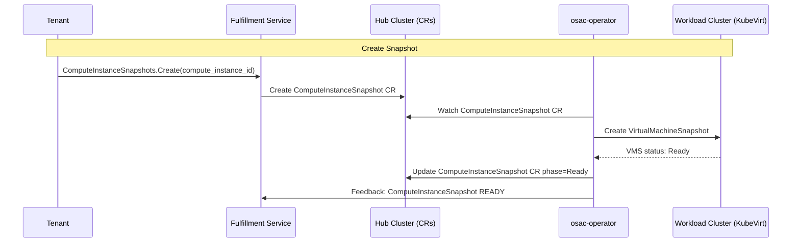
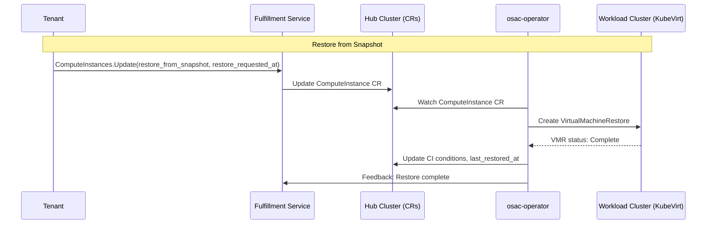
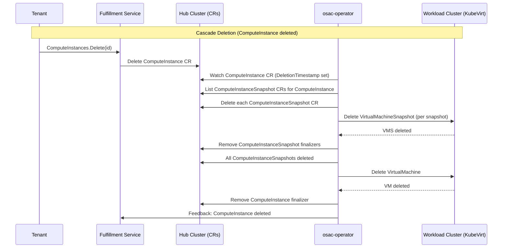

<!-- markdownlint-disable-next-line MD025 -->
# VM Snapshots

## Summary

This enhancement introduces a ComputeInstanceSnapshot API for OSAC ComputeInstance resources, enabling tenants to create, list, get, delete, and restore from point-in-time snapshots of their virtual machines. Since OSAC tenants have no direct access to the clusters where their VMs run, snapshot management must be exposed through the fulfillment-service API and orchestrated by the osac-operator, which interacts with KubeVirt's `VirtualMachineSnapshot` and `VirtualMachineRestore` primitives on the workload cluster. The feature supports both online snapshots (taken while the VM is running, with optional guest agent quiescing) and offline snapshots (taken while the VM is stopped). Restore is in-place only, reverting the VM's disks and configuration to the state captured in a selected snapshot.

## Terminology

- **Snapshot**: A point-in-time capture of a ComputeInstance's disk state and VM configuration. Snapshots are tied to the specific ComputeInstance they were taken from and cannot exist independently.
- **Online Snapshot**: A snapshot taken while the VM is running. KubeVirt uses the QEMU guest agent (when available) to quiesce the guest filesystem before capturing disk state, ensuring crash-consistent or application-consistent snapshots.
- **Offline Snapshot**: A snapshot taken while the VM is stopped. The disk state is captured at rest, guaranteeing full consistency.
- **In-place Restore**: Reverting a ComputeInstance's disks and VM configuration to the state captured in a snapshot. The VM must be stopped before restoring. The restore overwrites the current disk contents; it does not create a new ComputeInstance.
- **VirtualMachineSnapshot (KubeVirt)**: The underlying KubeVirt custom resource that captures a point-in-time snapshot of a `VirtualMachine`, including its `DataVolume`/`PVC` disk state and VM spec.
- **VirtualMachineRestore (KubeVirt)**: The underlying KubeVirt custom resource that restores a `VirtualMachine` from a `VirtualMachineSnapshot`.

## Motivation

OSAC tenants run virtual machines through the ComputeInstance API but have no direct access to the Kubernetes clusters where those VMs execute. This means tenants cannot use KubeVirt's native snapshot capabilities (`VirtualMachineSnapshot`, `VirtualMachineRestore`) because they have no access to the workload cluster's API server. Without an OSAC-level snapshot API, tenants have no way to:

- Capture the state of a VM before making risky changes (software upgrades, configuration changes)
- Roll back a VM to a known-good state after a failed update
- Create recovery points as part of a maintenance workflow

This gap forces tenants to rely on application-level backup strategies or external tooling, neither of which can capture the full VM state (disks, configuration) in a single atomic operation.

### User Stories

- As a Cloud Provider Admin, I want snapshots to be automatically deleted when a ComputeInstance is deleted so that orphaned snapshots do not consume storage indefinitely.
- As a Cloud Provider Admin, I want to monitor snapshot operations (creation, deletion, restore) so that I can detect and troubleshoot failures.
- As a Cloud Provider Admin, I want a configurable default limit on snapshots per ComputeInstance so that I can prevent storage exhaustion before a formal quota system is implemented.
- As a tenant, I want to create a snapshot of my running ComputeInstance so that I can capture its current state before applying a software upgrade.
- As a tenant, I want to create a snapshot of my stopped ComputeInstance so that I can preserve its disk state before making configuration changes.
- As a tenant, I want to list all snapshots of a specific ComputeInstance so that I can see available recovery points and their creation times.
- As a tenant, I want to delete a snapshot I no longer need so that I can free up storage resources.
- As a tenant, I want to restore my ComputeInstance from a specific snapshot so that I can roll back to a known-good state after a failed update.
- As a tenant, I want to see the progress and status of my snapshot creation and restore operations so that I know when they complete or if they fail.

### Goals

- Provide a self-service API for tenants to create, list, get, and delete snapshots of their ComputeInstances through the fulfillment-service.
- Support both online (VM running) and offline (VM stopped) snapshots, with filesystem quiescing via the QEMU guest agent when available.
- Enable tenants to restore a ComputeInstance in-place from a selected snapshot via the fulfillment-service API.
- Automatically cascade-delete all snapshots when the parent ComputeInstance is deleted.
- Expose snapshot and restore lifecycle status through conditions on the respective resources, following existing OSAC condition patterns.
- Maintain tenant isolation: tenants can only see and manage snapshots of their own ComputeInstances.

### Non-Goals

The following are explicitly out of scope for this proposal and may be addressed in future enhancements:

- **Exporting snapshots as images**: Converting a snapshot into a reusable VM image (e.g., for use as a `ComputeInstanceTemplate` source or for distribution via an image registry) is out of scope. This would require additional infrastructure for image conversion, storage, and registry integration.
- **Creating a new ComputeInstance from a snapshot**: Restoring a snapshot into a brand-new ComputeInstance (clone) is not supported in this proposal. Only in-place restore to the original ComputeInstance is supported.
- **Scheduled or automated snapshots**: Automatic snapshot creation on a schedule or triggered by events (e.g., before an upgrade) is not included. Tenants must explicitly create snapshots.
- **Snapshot quotas or storage limits**: Limiting the number of snapshots per ComputeInstance or the total snapshot storage per tenant will be addressed in a separate quota proposal.
- **Cross-cluster snapshot migration**: Moving snapshots between workload clusters is not supported.
- **Application-consistent snapshots with custom hooks**: While online snapshots leverage the QEMU guest agent for filesystem quiescing, custom pre/post-snapshot hooks inside the guest are not supported.

## Proposal

The VM Snapshot feature introduces a new `ComputeInstanceSnapshot` resource as a first-class OSAC entity, following the established pattern of all other OSAC resources (proto types + gRPC service in fulfillment-service, CRD + dual controller in osac-operator). Snapshots are child resources of a ComputeInstance — they are created against a specific VM and cannot exist independently.

The restore operation is modeled as a declarative signal on the ComputeInstance resource, following the same timestamp-based pattern used for VM restarts (`spec.restart_requested_at` / `status.last_restarted_at`). This keeps the restore mechanism consistent with existing OSAC conventions and avoids introducing a separate Restore resource for what is fundamentally an operation on the ComputeInstance.

### Workflow Description

**Actors:**

- **Tenant**: A user who manages ComputeInstances and their snapshots through the fulfillment-service API.
- **Provider/Admin**: An operator administrator who monitors and troubleshoots the system.
- **osac-operator**: The Kubernetes operator that reconciles OSAC CRDs into KubeVirt resources on the workload cluster.
- **fulfillment-service**: The gRPC/REST API server that stores OSAC resource state and exposes tenant-facing APIs.

<!-- markdownlint-capture -->
#### Creating a Snapshot
<!-- markdownlint-disable MD029 -->
1. The tenant creates a snapshot of their ComputeInstance:

  ```bash
  osac create computeinstancesnapshot --compute-instance <compute-instance-id> --description "Before upgrade"
  ```

2. The fulfillment-service validates that the referenced ComputeInstance exists and belongs to the tenant, creates a `ComputeInstanceSnapshot` record in PostgreSQL with state `CREATING`, and creates a corresponding `ComputeInstanceSnapshot` CR on the hub cluster.
3. The osac-operator's ComputeInstanceSnapshot controller detects the new `ComputeInstanceSnapshot` CR.
4. The controller looks up the parent ComputeInstance CR to find the `VirtualMachineReference` (the KubeVirt VM name and namespace on the workload cluster).
5. The controller creates a KubeVirt `VirtualMachineSnapshot` CR on the workload cluster, targeting the KubeVirt `VirtualMachine`.
6. The controller watches the `VirtualMachineSnapshot` status and updates the OSAC `ComputeInstanceSnapshot` CR's phase and conditions accordingly:
   - While KubeVirt reports the snapshot is in progress: phase = `Creating`, condition `Ready` = `False`.
   - When KubeVirt reports the snapshot is ready: phase = `Ready`, condition `Ready` = `True`, `creationTime` and `online` fields populated.
   - If KubeVirt reports failure: phase = `Failed`, condition `Ready` = `False` with error message.
7. The feedback controller syncs the OSAC `ComputeInstanceSnapshot` CR status back to the fulfillment-service via the private gRPC API.
8. The tenant polls the snapshot status until it reaches `READY`:

  ```bash
  osac get computeinstancesnapshot <snapshot-id>
  ```
<!-- markdownlint-restore -->



##### Create Error Cases

###### Non-existent ComputeInstance

```bash
$ osac create computeinstancesnapshot --compute-instance nonexistent-id --description "Before upgrade"
Error: compute instance "nonexistent-id" not found
```

###### ComputeInstance not owned by tenant

```bash
$ osac create computeinstancesnapshot --compute-instance <other-tenants-ci-id> --description "Before upgrade"
Error: compute instance "<other-tenants-ci-id>" not found
```

(Same "not found" error to avoid leaking existence of other tenants' resources.)

###### ComputeInstance not yet provisioned (no VM on workload cluster)

```bash
$ osac create computeinstancesnapshot --compute-instance <ci-id> --description "Before upgrade"
Error: compute instance "<ci-id>" is not yet provisioned
```

<!-- markdownlint-capture -->
#### Listing Snapshots
<!-- markdownlint-disable MD029 -->
1. The tenant lists snapshots, optionally filtering by ComputeInstance:

  ```bash
  osac list computeinstancesnapshots --compute-instance <compute-instance-id>
  ```

2. The fulfillment-service returns all snapshots belonging to the tenant's ComputeInstances, with support for pagination, filtering (CEL expressions), and ordering.

<!-- markdownlint-restore -->

<!-- markdownlint-capture -->
#### Restoring from a Snapshot
<!-- markdownlint-disable MD029 -->
1. The tenant stops the ComputeInstance and confirms it reaches `Stopped` state:

  ```bash
  osac update computeinstance <compute-instance-id> --run-strategy Halted
  osac get computeinstance <compute-instance-id>
  ```

2. The tenant triggers a restore from a specific snapshot:

  ```bash
  osac update computeinstance <compute-instance-id> --restore-from-snapshot <snapshot-id>
  ```

3. The fulfillment-service validates that the snapshot exists, belongs to the same ComputeInstance, and is in `READY` state. It updates the ComputeInstance record and CR. The fulfillment-service intentionally does not validate VM running state because its view of VM state is eventually consistent via the feedback loop; the ComputeInstance controller is the authoritative enforcer (see step 5).
4. The ComputeInstance controller detects that `spec.restore_requested_at` is greater than `status.last_restored_at` and that `spec.restore_from_snapshot` is set.
5. The controller verifies the VM is stopped. If the VM is running, it sets the `RestoreFailed` condition with a message indicating the VM must be stopped first.
6. The controller creates a KubeVirt `VirtualMachineRestore` CR on the workload cluster, referencing the KubeVirt `VirtualMachineSnapshot` associated with the OSAC ComputeInstanceSnapshot.
7. The controller sets the `RestoreInProgress` condition to `True` on the ComputeInstance CR.
8. The controller watches the `VirtualMachineRestore` status:
   - When KubeVirt reports the restore is complete: set `status.last_restored_at` to `spec.restore_requested_at`, clear `RestoreInProgress`, set `RestoreInProgress` condition to `False`.
   - If KubeVirt reports failure: set `RestoreFailed` condition to `True` with error details.
9. The feedback controller syncs the updated conditions and status back to the fulfillment-service.
10. The tenant starts the ComputeInstance:

  ```bash
  osac update computeinstance <compute-instance-id> --run-strategy Always
  ```
<!-- markdownlint-restore -->



##### Restore Error Cases

###### Snapshot not in READY state

```bash
$ osac update computeinstance <ci-id> --restore-from-snapshot <snapshot-id>
Error: compute instance snapshot "<snapshot-id>" is not ready
```

###### Snapshot not found or does not belong to this ComputeInstance

```bash
$ osac update computeinstance <ci-id> --restore-from-snapshot <other-ci-snapshot-id>
Error: compute instance snapshot "<other-ci-snapshot-id>" not found
```

(Same "not found" error for non-existent snapshots and snapshots belonging to a different ComputeInstance, to avoid leaking existence of other resources.)

<!-- markdownlint-capture -->
#### Deleting a Snapshot
<!-- markdownlint-disable MD029 -->

1. The tenant deletes a snapshot:

  ```bash
  osac delete computeinstancesnapshot <snapshot-id>
  ```

2. The fulfillment-service marks the snapshot as `DELETING` and updates the `ComputeInstanceSnapshot` CR on the hub cluster.
3. The ComputeInstanceSnapshot controller deletes the corresponding KubeVirt `VirtualMachineSnapshot` on the workload cluster.
4. Once the KubeVirt snapshot is removed, the controller removes its finalizer from the OSAC `ComputeInstanceSnapshot` CR, allowing Kubernetes garbage collection to proceed.
5. The feedback controller syncs the deletion state to fulfillment-service.

<!-- markdownlint-restore -->

##### Delete Error Cases

###### Deleting non-existent snapshot

```bash
$ osac delete computeinstancesnapshot nonexistent-id
Error: compute instance snapshot "nonexistent-id" not found
```

###### Snapshot not owned by tenant

```bash
$ osac delete computeinstancesnapshot <other-tenants-snapshot-id>
Error: compute instance snapshot "<other-tenants-snapshot-id>" not found
```

(Same "not found" error to avoid leaking existence of other tenants' resources.)

#### Cascade Deletion

When a ComputeInstance is deleted:

1. The ComputeInstance controller's deletion handler queries for all `ComputeInstanceSnapshot` CRs that reference the ComputeInstance.
  **Security requirement:** The query must filter by both `spec.computeInstanceRef` AND the `osac.openshift.io/tenant` annotation to ensure only snapshots owned by the same tenant are deleted.
2. Each `ComputeInstanceSnapshot` CR is deleted, triggering the ComputeInstanceSnapshot controller's deletion flow (which deletes the underlying KubeVirt `VirtualMachineSnapshot`).
3. Only after all snapshots are fully deleted does the ComputeInstance controller proceed with its own deletion finalizer logic.



### API Extensions

#### New gRPC Services (fulfillment-service)

**Public API** (`proto/public/osac/public/v1/`):

- `compute_instance_snapshot_type.proto` — `ComputeInstanceSnapshot` message with `ComputeInstanceSnapshotSpec`, `ComputeInstanceSnapshotStatus`, `ComputeInstanceSnapshotState` enum, `ComputeInstanceSnapshotCondition`, `ComputeInstanceSnapshotConditionType` enum
- `compute_instance_snapshots_service.proto` — `ComputeInstanceSnapshots` service with `Create`, `Get`, `List`, `Delete` RPCs and HTTP annotations

**Private API** (`proto/private/osac/private/v1/`):

- `compute_instance_snapshot_type.proto` — mirrors public type
- `compute_instance_snapshots_service.proto` — `ComputeInstanceSnapshots` service with `Create`, `Get`, `List`, `Delete`, `Update`, and `Signal` RPCs

#### Modified gRPC Types (fulfillment-service)

**ComputeInstance type** (both public and private):

- `ComputeInstanceSpec`: Add `restore_from_snapshot` (optional string) and `restore_requested_at` (optional timestamp) fields
- `ComputeInstanceStatus`: Add `last_restored_at` (optional timestamp) field
- `ComputeInstanceConditionType` enum: Add `RESTORE_IN_PROGRESS` and `RESTORE_FAILED` values

#### New CRD (osac-operator)

- `ComputeInstanceSnapshot` CRD (`api/v1alpha1/computeinstancesnapshot_types.go`) — Kubernetes representation of a snapshot, with spec referencing the parent ComputeInstance and status tracking the KubeVirt VirtualMachineSnapshot lifecycle

#### Modified CRD (osac-operator)

- `ComputeInstance` CRD: Add `restoreFromSnapshot` and `restoreRequestedAt` fields to spec, `lastRestoredAt` to status, new condition types `RestoreInProgress` and `RestoreFailed`

#### New Controllers (osac-operator)

- `computeinstancesnapshot_controller.go` — Provisions/deprovisions KubeVirt `VirtualMachineSnapshot` on the workload cluster
- `computeinstancesnapshot_feedback_controller.go` — Syncs ComputeInstanceSnapshot CR status to fulfillment-service via private gRPC API

#### Modified Controllers (osac-operator)

- `computeinstance_controller.go` — Add restore handling: detect `restoreRequestedAt` signal, create KubeVirt `VirtualMachineRestore`, update conditions and `lastRestoredAt`. Add cascade deletion of ComputeInstanceSnapshot CRs.

#### Finalizers

- `osac.openshift.io/computeinstancesnapshot-finalizer` — on `ComputeInstanceSnapshot` CR, ensures KubeVirt `VirtualMachineSnapshot` is deleted before the OSAC ComputeInstanceSnapshot CR is removed
- `osac.openshift.io/computeinstancesnapshot-feedback-finalizer` — on `ComputeInstanceSnapshot` CR, ensures final state is synced to fulfillment-service before removal

#### RBAC

The osac-operator will need additional RBAC permissions:

```go
+kubebuilder:rbac:groups=snapshot.kubevirt.io,resources=virtualmachinesnapshots;virtualmachinerestores,verbs=get;list;watch;create;delete
+kubebuilder:rbac:groups=osac.openshift.io,resources=computeinstancesnapshots,verbs=get;list;watch;create;update;patch;delete
+kubebuilder:rbac:groups=osac.openshift.io,resources=computeinstancesnapshots/status,verbs=get;update;patch
+kubebuilder:rbac:groups=osac.openshift.io,resources=computeinstancesnapshots/finalizers,verbs=update
```

### Implementation Details/Notes/Constraints

#### ComputeInstanceSnapshot Proto Type (fulfillment-service)

```proto
// compute_instance_snapshot_type.proto (public)

message ComputeInstanceSnapshot {
  string id = 1;
  Metadata metadata = 2;
  ComputeInstanceSnapshotSpec spec = 3;
  ComputeInstanceSnapshotStatus status = 4;
}

message ComputeInstanceSnapshotSpec {
  // Reference to the ComputeInstance this snapshot belongs to.
  // Must be the ID of an existing ComputeInstance owned by the tenant.
  // This cannot be modified after the snapshot is created.
  string compute_instance = 1;

  // User-provided description of the snapshot.
  optional string description = 2;
}

message ComputeInstanceSnapshotStatus {
  // Indicates the overall state of the snapshot.
  ComputeInstanceSnapshotState state = 1;

  // Conditions describing the detailed status of the snapshot.
  repeated ComputeInstanceSnapshotCondition conditions = 2;

  // Timestamp when the snapshot data was fully captured.
  // Empty while the snapshot is still being created.
  optional google.protobuf.Timestamp creation_time = 3;

  // Size of the snapshot data in bytes.
  // Populated when the snapshot reaches READY state.
  optional int64 size_bytes = 4;

  // Whether the snapshot was taken while the VM was running (online)
  // or while the VM was stopped (offline).
  bool online = 5;
}

enum ComputeInstanceSnapshotState {
  COMPUTE_INSTANCE_SNAPSHOT_STATE_UNSPECIFIED = 0;
  COMPUTE_INSTANCE_SNAPSHOT_STATE_CREATING = 1;
  COMPUTE_INSTANCE_SNAPSHOT_STATE_READY = 2;
  COMPUTE_INSTANCE_SNAPSHOT_STATE_FAILED = 3;
  COMPUTE_INSTANCE_SNAPSHOT_STATE_DELETING = 4;
}

message ComputeInstanceSnapshotCondition {
  ComputeInstanceSnapshotConditionType type = 1;
  ConditionStatus status = 2;
  google.protobuf.Timestamp last_transition_time = 3;
  optional string reason = 4;
  optional string message = 5;
}

enum ComputeInstanceSnapshotConditionType {
  COMPUTE_INSTANCE_SNAPSHOT_CONDITION_TYPE_UNSPECIFIED = 0;

  // Indicates that the snapshot data has been captured successfully.
  COMPUTE_INSTANCE_SNAPSHOT_CONDITION_TYPE_READY = 1;
}
```

ComputeInstanceSnapshot naming follows the standard OSAC `Metadata` pattern: tenants provide a name via `metadata.name` at creation time, subject to the same uniqueness validation applied to other OSAC resources. Auto-generated UUIDs are used for the `id` field.

#### ComputeInstanceSnapshots Service Proto (fulfillment-service)

```proto
// compute_instance_snapshots_service.proto (public)

service ComputeInstanceSnapshots {
  rpc List(ComputeInstanceSnapshotsListRequest) returns (ComputeInstanceSnapshotsListResponse) {
    option (google.api.http) = {get: "/api/fulfillment/v1/compute_instance_snapshots"};
  }

  rpc Get(ComputeInstanceSnapshotsGetRequest) returns (ComputeInstanceSnapshotsGetResponse) {
    option (google.api.http) = {
      get: "/api/fulfillment/v1/compute_instance_snapshots/{id}"
      response_body: "object"
    };
  }

  rpc Create(ComputeInstanceSnapshotsCreateRequest) returns (ComputeInstanceSnapshotsCreateResponse) {
    option (google.api.http) = {
      post: "/api/fulfillment/v1/compute_instance_snapshots"
      body: "object"
      response_body: "object"
    };
  }

  rpc Delete(ComputeInstanceSnapshotsDeleteRequest) returns (ComputeInstanceSnapshotsDeleteResponse) {
    option (google.api.http) = {delete: "/api/fulfillment/v1/compute_instance_snapshots/{id}"};
  }
}

message ComputeInstanceSnapshotsListRequest {
  optional int32 offset = 1;
  optional int32 limit = 2;
  optional string filter = 3;
  optional string order = 4;
}

message ComputeInstanceSnapshotsListResponse {
  int32 size = 1;
  int32 total = 2;
  repeated ComputeInstanceSnapshot items = 3;
}

message ComputeInstanceSnapshotsGetRequest {
  string id = 1;
}

message ComputeInstanceSnapshotsGetResponse {
  ComputeInstanceSnapshot object = 1;
}

message ComputeInstanceSnapshotsCreateRequest {
  ComputeInstanceSnapshot object = 1;
}

message ComputeInstanceSnapshotsCreateResponse {
  ComputeInstanceSnapshot object = 1;
}

message ComputeInstanceSnapshotsDeleteRequest {
  string id = 1;
}

message ComputeInstanceSnapshotsDeleteResponse {}
```

> **Note:** The public `ComputeInstanceSnapshots` service intentionally omits an `Update` RPC. Snapshots are immutable after creation — their spec (including `description`) cannot be modified once the snapshot is taken. This reflects the nature of snapshots as point-in-time captures.

The private API mirrors the public API and adds `Update` and `Signal` RPCs, following the existing pattern. The private `Update` RPC is used exclusively by the feedback controller to sync status fields (state, conditions, creation_time, size_bytes, online) from the osac-operator back to the fulfillment-service — it does not allow spec modifications.

#### ComputeInstance Proto Changes (fulfillment-service)

> **Implementation prerequisite**: The field numbers and enum values below are illustrative based on the proto definitions at the time of writing. Before implementation, verify the current highest field numbers in `ComputeInstanceSpec`, `ComputeInstanceStatus`, and `ComputeInstanceConditionType`, check for any `reserved` declarations or retired numbers (e.g., spec fields 12 and 13 are currently unassigned), and assign the next available numbers to avoid wire-format collisions.

New fields added to existing `ComputeInstanceSpec`:

```proto
// The ID of the snapshot to restore from. Set this field together with
// restore_requested_at to initiate an in-place restore.
// The snapshot must belong to this ComputeInstance and be in READY state.
// The VM must be stopped (run_strategy = "Halted") before initiating a restore.
optional string restore_from_snapshot = 16;

// Timestamp signal to request a restore from snapshot.
// Set this field to the current time to request a restore.
// The controller will execute the restore if this timestamp is greater than
// status.last_restored_at.
// This is a declarative signal mechanism, following the same pattern as
// restart_requested_at.
optional google.protobuf.Timestamp restore_requested_at = 17;
```

New field added to existing `ComputeInstanceStatus`:

```proto
// Records when the last restore was initiated by the controller.
// Set to spec.restore_requested_at when the controller processes a restore request.
// Empty if no restore has been performed.
optional google.protobuf.Timestamp last_restored_at = 6;
```

New values added to `ComputeInstanceConditionType` enum:

```proto
// Indicates that a restore from snapshot is in progress.
// When status is TRUE, a restore operation is currently in progress.
// When status is FALSE, no restore is currently in progress.
COMPUTE_INSTANCE_CONDITION_TYPE_RESTORE_IN_PROGRESS = 7;

// Indicates that a restore request has failed.
// When status is TRUE, the restore could not be executed.
// The message field will contain details about the failure.
// When status is FALSE, there is no restore failure.
COMPUTE_INSTANCE_CONDITION_TYPE_RESTORE_FAILED = 8;
```

#### ComputeInstanceSnapshot CRD (osac-operator)

```go
// api/v1alpha1/computeinstancesnapshot_types.go

// ComputeInstanceSnapshotSpec defines the desired state of a ComputeInstanceSnapshot
type ComputeInstanceSnapshotSpec struct {
    // ComputeInstanceRef is the name of the ComputeInstance CR this snapshot belongs to.
    // Must reference an existing ComputeInstance in the same namespace.
    // +kubebuilder:validation:Required
    // +kubebuilder:validation:MinLength=1
    // +kubebuilder:validation:XValidation:rule="self == oldSelf",message="computeInstanceRef is immutable"
    ComputeInstanceRef string `json:"computeInstanceRef"`

    // Description is a user-provided description of the snapshot.
    // +kubebuilder:validation:Optional
    // +kubebuilder:validation:MaxLength=256
    Description string `json:"description,omitempty"`
}

// ComputeInstanceSnapshotPhase represents the phase of a ComputeInstanceSnapshot
// +kubebuilder:validation:Enum=Creating;Ready;Failed;Deleting
type ComputeInstanceSnapshotPhase string

const (
    ComputeInstanceSnapshotPhaseCreating ComputeInstanceSnapshotPhase = "Creating"
    ComputeInstanceSnapshotPhaseReady    ComputeInstanceSnapshotPhase = "Ready"
    ComputeInstanceSnapshotPhaseFailed   ComputeInstanceSnapshotPhase = "Failed"
    ComputeInstanceSnapshotPhaseDeleting ComputeInstanceSnapshotPhase = "Deleting"
)

// ComputeInstanceSnapshotConditionType is a valid value for .status.conditions.type
type ComputeInstanceSnapshotConditionType string

const (
    // ComputeInstanceSnapshotConditionReady indicates the snapshot data has been captured.
    ComputeInstanceSnapshotConditionReady ComputeInstanceSnapshotConditionType = "Ready"
)

// VirtualMachineSnapshotReference contains a reference to the KubeVirt VirtualMachineSnapshot
type VirtualMachineSnapshotReference struct {
    // Name of the KubeVirt VirtualMachineSnapshot CR
    Name string `json:"name"`
    // Namespace of the KubeVirt VirtualMachineSnapshot CR
    Namespace string `json:"namespace"`
}

// ComputeInstanceSnapshotStatus defines the observed state of a ComputeInstanceSnapshot
type ComputeInstanceSnapshotStatus struct {
    // Phase provides a single-value overview of the ComputeInstanceSnapshot state
    // +kubebuilder:validation:Optional
    Phase ComputeInstanceSnapshotPhase `json:"phase,omitempty"`

    // Conditions holds an array of conditions describing the ComputeInstanceSnapshot state
    // +kubebuilder:validation:Optional
    Conditions []metav1.Condition `json:"conditions,omitempty"`

    // Reference to the KubeVirt VirtualMachineSnapshot on the workload cluster
    // +kubebuilder:validation:Optional
    VirtualMachineSnapshotRef *VirtualMachineSnapshotReference `json:"virtualMachineSnapshotRef,omitempty"`

    // CreationTime is when the snapshot data was fully captured
    // +kubebuilder:validation:Optional
    CreationTime *metav1.Time `json:"creationTime,omitempty"`

    // SizeBytes is the total size of the snapshot data
    // +kubebuilder:validation:Optional
    SizeBytes *int64 `json:"sizeBytes,omitempty"`

    // Online indicates whether the snapshot was taken while the VM was running
    // +kubebuilder:validation:Optional
    Online bool `json:"online,omitempty"`

    // Jobs tracks the history of snapshot operations.
    // JobStatus is an existing shared type from api/v1alpha1/job_types.go used by other OSAC resources to track operation history.
    // +kubebuilder:validation:Optional
    Jobs []JobStatus `json:"jobs,omitempty"`
}

// +kubebuilder:object:root=true
// +kubebuilder:subresource:status
// +kubebuilder:resource:shortName=cisnap
// +kubebuilder:printcolumn:name="ComputeInstance",type=string,JSONPath=`.spec.computeInstanceRef`
// +kubebuilder:printcolumn:name="Phase",type=string,JSONPath=`.status.phase`
// +kubebuilder:printcolumn:name="Online",type=boolean,JSONPath=`.status.online`
// +kubebuilder:printcolumn:name="CreationTime",type=date,JSONPath=`.status.creationTime`

// ComputeInstanceSnapshot is the Schema for the computeinstancesnapshots API
type ComputeInstanceSnapshot struct {
    metav1.TypeMeta   `json:",inline"`
    metav1.ObjectMeta `json:"metadata,omitempty,omitzero"`
    Spec              ComputeInstanceSnapshotSpec   `json:"spec"`
    Status            ComputeInstanceSnapshotStatus `json:"status,omitempty,omitzero"`
}

// +kubebuilder:object:root=true

// ComputeInstanceSnapshotList contains a list of ComputeInstanceSnapshot
type ComputeInstanceSnapshotList struct {
    metav1.TypeMeta `json:",inline"`
    metav1.ListMeta `json:"metadata,omitempty"`
    Items           []ComputeInstanceSnapshot `json:"items"`
}
```

#### ComputeInstance CRD Changes (osac-operator)

New fields added to `ComputeInstanceSpec`:

```go
// RestoreFromSnapshot is the name of the ComputeInstanceSnapshot CR to restore from.
// Set this field together with RestoreRequestedAt to initiate an in-place restore.
// The ComputeInstanceSnapshot must reference this ComputeInstance and be in Ready phase.
// The ComputeInstance must be stopped (RunStrategy = Halted) before restoring.
// +kubebuilder:validation:Optional
RestoreFromSnapshot string `json:"restoreFromSnapshot,omitempty"`

// RestoreRequestedAt is a timestamp signal to request a restore from snapshot.
// Set this field to the current time to request a restore.
// The controller will execute the restore if this timestamp is greater than
// status.lastRestoredAt.
// +kubebuilder:validation:Optional
// +kubebuilder:validation:Format=date-time
RestoreRequestedAt *metav1.Time `json:"restoreRequestedAt,omitempty"`
```

New field added to `ComputeInstanceStatus`:

```go
// LastRestoredAt records when the last restore was initiated by the controller.
// Set to spec.restoreRequestedAt when the controller processes a restore.
// Empty if no restore has been performed.
// +kubebuilder:validation:Optional
// +kubebuilder:validation:Format=date-time
LastRestoredAt *metav1.Time `json:"lastRestoredAt,omitempty"`
```

New condition type constants:

```go
// ComputeInstanceConditionRestoreInProgress indicates a restore from snapshot is in progress
ComputeInstanceConditionRestoreInProgress ComputeInstanceConditionType = "RestoreInProgress"

// ComputeInstanceConditionRestoreFailed indicates a restore request has failed
ComputeInstanceConditionRestoreFailed ComputeInstanceConditionType = "RestoreFailed"
```

#### ComputeInstanceSnapshot Controller Logic (osac-operator)

The ComputeInstanceSnapshot controller follows the dual-controller pattern:

**Resource Controller** (`computeinstancesnapshot_controller.go`):

Before any reconciliation logic, the controller checks the `osac.openshift.io/management-state` annotation. If the annotation is present and set to `Unmanaged`, the controller skips reconciliation and returns immediately. This follows the standard OSAC operator convention shared by all controllers.

1. **On create** (DeletionTimestamp is zero, no finalizer):
   - Add finalizer `osac.openshift.io/computeinstancesnapshot-finalizer`.
   - Look up the parent ComputeInstance CR by `spec.computeInstanceRef`.
   - Validate the ComputeInstance exists and has a `VirtualMachineReference` (VM is provisioned).
   - Determine the KubeVirt VM name and namespace from the ComputeInstance's status.
   - Create a KubeVirt `VirtualMachineSnapshot` on the workload cluster targeting the KubeVirt `VirtualMachine`.
   - Set phase to `Creating`.

2. **On reconcile** (snapshot exists, KubeVirt VMS created):
   - Fetch the KubeVirt `VirtualMachineSnapshot` from the workload cluster.
   - Map KubeVirt snapshot status to OSAC ComputeInstanceSnapshot status:
     - KubeVirt `ReadyToUse = true` → phase `Ready`, condition `Ready` = `True`, populate `creationTime`, `sizeBytes`, `online`.
     - KubeVirt `ReadyToUse = false` and no error → phase `Creating`, condition `Ready` = `False`.
     - KubeVirt error or failure deadline exceeded → phase `Failed`, condition `Ready` = `False` with error message.
   - Update the OSAC ComputeInstanceSnapshot CR status if changed.

3. **On delete** (DeletionTimestamp is set):
   - Delete the KubeVirt `VirtualMachineSnapshot` from the workload cluster.
   - Wait until the KubeVirt resource is gone (requeue if still present).
   - Remove the `computeinstancesnapshot-finalizer`.

**Feedback Controller** (`computeinstancesnapshot_feedback_controller.go`):

Following the established feedback controller pattern:

- On phase changes: sync OSAC ComputeInstanceSnapshot phase → fulfillment-service ComputeInstanceSnapshot state via private `ComputeInstanceSnapshots.Update` gRPC.
- Phase-to-state mapping: `Creating` → `CREATING`, `Ready` → `READY`, `Failed` → `FAILED`, `Deleting` → `DELETING`.
- On deletion: send final deletion state via `ComputeInstanceSnapshots.Signal`, then remove the feedback finalizer.
- Handle `NotFound` gracefully during deletion (fulfillment-service may archive before finalizer removal).

#### Restore Logic in ComputeInstance Controller

Added to the existing ComputeInstance controller's `handleUpdate` method:

1. Check if spec.restoreRequestedAt > status.lastRestoredAt (new restore request).
2. If yes:
   a. Validate spec.restoreFromSnapshot is set and references an existing ComputeInstanceSnapshot CR in Ready phase.
   b. Validate the ComputeInstance is stopped (phase == Stopped).
      - If not stopped: set RestoreFailed condition with message "ComputeInstance must be stopped before restoring".
      - Return without requeue (tenant must stop the VM and re-trigger).
   c. Look up the ComputeInstanceSnapshot CR's VirtualMachineSnapshotRef to find the KubeVirt VMS name.
   d. Create a KubeVirt VirtualMachineRestore on the workload cluster, targeting the VM
      and referencing the KubeVirt `VirtualMachineSnapshot`.
   e. Set RestoreInProgress condition to True with reason "RestoreRequested".
   f. Clear RestoreFailed condition if previously set.
3. If RestoreInProgress is True:
   a. Check the KubeVirt VirtualMachineRestore status.
   b. If complete: set status.lastRestoredAt = spec.restoreRequestedAt,
      set RestoreInProgress to False, clear RestoreFailed.
   c. If failed: set RestoreFailed to True with error details,
      set RestoreInProgress to False.
   d. If in progress: requeue after StatusPollInterval.

> **Note:** After a successful restore, `spec.restoreFromSnapshot` and `spec.restoreRequestedAt` remain set in the ComputeInstance spec. This is consistent with the `restartRequestedAt` pattern — the timestamp guard (`restoreRequestedAt > lastRestoredAt`) prevents re-triggering, and the stale snapshot reference is harmless. To initiate another restore (from the same or a different snapshot), the tenant sets `restoreRequestedAt` to a new timestamp.

#### Tenant Isolation

- Snapshots inherit tenant isolation from their parent ComputeInstance.
- The `ComputeInstanceSnapshot` CR must include the `osac.openshift.io/tenant` annotation, copied from the parent ComputeInstance.
- The `osac.io/owner-reference` annotation on the ComputeInstanceSnapshot CR must reference the parent ComputeInstance.
- The fulfillment-service ensures tenants can only access snapshots belonging to their own ComputeInstances.
- The `ComputeInstanceSnapshots.List` and `ComputeInstanceSnapshots.Get` endpoints enforce tenant scoping through the same CEL filter and authorization mechanisms used by other resources.

#### Database Schema (fulfillment-service)

A new `compute_instance_snapshots` table following the standard OSAC database pattern:

```sql
CREATE TABLE compute_instance_snapshots (
    id UUID PRIMARY KEY,
    creation_timestamp TIMESTAMPTZ NOT NULL,
    update_timestamp TIMESTAMPTZ NOT NULL,
    deletion_timestamp TIMESTAMPTZ,
    finalizers TEXT[],
    creators TEXT[],
    tenants TEXT[],
    labels JSONB,
    annotations JSONB,
    compute_instance_id TEXT NOT NULL,
    data JSONB NOT NULL                     -- Serialized ComputeInstanceSnapshot protobuf
);

CREATE INDEX idx_compute_instance_snapshots_compute_instance_id
    ON compute_instance_snapshots (compute_instance_id);
```

Notes:

- The `data` JSONB column contains the serialized ComputeInstanceSnapshot protobuf, following OSAC's standard database pattern.
- `deletion_timestamp` supports soft delete (NULL = active, non-NULL = soft-deleted).
- `tenants` array stores tenant IDs for isolation enforcement.
- `labels` and `annotations` are JSONB columns for metadata, following the standard OSAC resource pattern.
- `finalizers` and `creators` are standard OSAC resource lifecycle columns.
- Index on `compute_instance_id` enables efficient listing of snapshots by ComputeInstance.

#### Cross-Component Integration

| Component | Changes |
| --- | --- |
| **fulfillment-service** | New `ComputeInstanceSnapshot` proto types and `ComputeInstanceSnapshots` services (public + private), ComputeInstance proto updates (restore fields + conditions), new database table, server implementation, OPA policies |
| **osac-operator** | New `ComputeInstanceSnapshot` CRD + dual controller, ComputeInstance CRD updates (restore fields + conditions), ComputeInstance controller updates (restore logic, cascade delete), new RBAC for `snapshot.kubevirt.io` |
| **osac-installer** | RBAC updates for the operator ServiceAccount to access `snapshot.kubevirt.io` resources on the workload cluster |

### Risks and Mitigations

**Risk: Online snapshot inconsistency without guest agent**
If the QEMU guest agent is not installed in the guest VM, online snapshots may not be filesystem-consistent (crash-consistent only). Tenants may not realize their snapshot is crash-consistent rather than application-consistent.
**Mitigation**: Expose the `online` flag in the ComputeInstanceSnapshot status so tenants can see whether the snapshot was taken online. Document that installing the QEMU guest agent is recommended for consistent online snapshots. Consider adding a condition or warning when the guest agent is not detected.

**Risk: Restore overwrites data without confirmation**
In-place restore is destructive — it replaces the current disk contents with the snapshot state. If a tenant accidentally restores from the wrong snapshot, data is lost.
**Mitigation**: The two-field declarative signal pattern (`restore_from_snapshot` + `restore_requested_at`) makes accidental restores unlikely — the tenant must explicitly set both fields. The VM must be stopped first, adding another deliberate step. Consider recommending that tenants create a snapshot before restoring as a best practice.

**Risk: Snapshot storage consumption**
Snapshots consume storage on the workload cluster's storage backend (CSI VolumeSnapshots). Without quotas, a tenant could create an unbounded number of snapshots and exhaust storage.
**Mitigation**: Snapshot quotas are out of scope for this proposal but are listed as a future enhancement. Providers can monitor snapshot storage through standard Kubernetes storage metrics. As an interim measure, the operator could log warnings when a ComputeInstance has more than a configurable threshold of snapshots.

**Risk: KubeVirt snapshot feature not available on the workload cluster**
The workload cluster may not have the KubeVirt snapshot feature gate enabled or the storage backend may not support CSI VolumeSnapshots.
**Mitigation**: The ComputeInstanceSnapshot controller should check for the presence of the `VirtualMachineSnapshot` CRD on the workload cluster at startup. If not available, the controller should log an error and set snapshots to `Failed` state with a clear message. Document the KubeVirt and storage prerequisites.

### Drawbacks

- **Increased API surface**: Adding a new first-class resource (ComputeInstanceSnapshot) with its own CRUD service increases the API surface area. This adds maintenance burden for proto definitions, server implementation, database table, OPA policies, and controllers. However, snapshots are a fundamental VM management capability that tenants expect, and the alternative of not providing them forces tenants into application-level backup strategies.

- **Storage cost opacity**: Tenants can see their snapshot count and individual sizes, but may not understand the cumulative storage cost or how storage backend deduplication affects actual consumption. This is mitigated by the future quota system.

- **Restore requires VM downtime**: In-place restore requires stopping the VM first, which means workloads on the VM are interrupted. This is a KubeVirt constraint for in-place restore. The alternative (creating a new VM from a snapshot) would avoid downtime but is deferred to a future enhancement.

## Alternatives (Not Implemented)

### Separate Restore Resource

Instead of using the declarative signal pattern on ComputeInstance (`restore_from_snapshot` + `restore_requested_at`), an alternative is to introduce a separate `SnapshotRestore` resource (similar to KubeVirt's `VirtualMachineRestore`).

**Pros**: Cleaner separation of concerns; restore operations are independently trackable with their own lifecycle.
**Cons**: Adds another CRD, proto type, service, and controller pair. Over-engineered for in-place-only restore. Not consistent with the existing restart signal pattern.

**Decision**: The declarative signal pattern is simpler, consistent with `restart_requested_at`, and sufficient for in-place restore. If future enhancements add "restore to new VM" support, a separate Restore resource may become warranted.

### Restore RPC on ComputeInstanceSnapshots Service

Instead of updating the ComputeInstance spec to trigger a restore, an alternative is to add a `Restore` RPC to the `ComputeInstanceSnapshots` service.

**Pros**: More intuitive API ("restore this snapshot") rather than "update this ComputeInstance with a restore signal."
**Cons**: Breaks the declarative resource model — RPCs that trigger side effects are imperative, not declarative. The OSAC pattern uses declarative spec changes to drive controller behavior. A custom RPC would also need special handling in the fulfillment-service (it's not a standard CRUD operation).

**Decision**: The declarative signal on ComputeInstance is more consistent with OSAC's resource-oriented architecture.

### ComputeInstanceSnapshots as Sub-resource of ComputeInstance

Instead of a top-level `ComputeInstanceSnapshot` resource, snapshots could be modeled as a sub-resource of ComputeInstance (e.g., `ComputeInstances/{id}/ComputeInstanceSnapshots`).

**Pros**: Clearer parent-child relationship in the API path. Simpler authorization (inherits from ComputeInstance).
**Cons**: Not consistent with how other OSAC child resources are modeled (e.g., Subnet is a top-level resource that references VirtualNetwork, not a sub-resource). Sub-resources in gRPC/REST are more complex to implement with grpc-gateway. Top-level resources with filter-by-parent are the established OSAC pattern.

**Decision**: Follow the existing OSAC pattern of top-level resources with parent references and filtering.

## Open Questions

1. **Guest agent quiescing indicator**: The `online` field indicates whether the snapshot was taken while the VM was running, but it does not distinguish between crash-consistent snapshots (guest agent unavailable) and filesystem-consistent snapshots (guest agent quiesced the filesystem). Should the ComputeInstanceSnapshot status include a separate `quiesced` boolean or condition to surface this distinction? KubeVirt's `VirtualMachineSnapshot` status includes indications about whether the guest agent was used.

2. **Maximum snapshots per VM**: Should there be a hard limit on the number of snapshots per ComputeInstance, even before a full quota system is implemented? A reasonable default (e.g., 20-50) could prevent storage exhaustion while a proper quota system is developed.

## Test Plan

### Unit Tests (fulfillment-service)

- **ComputeInstanceSnapshot server CRUD**: Verify Create, Get, List, Delete operations with valid and invalid inputs.
- **Tenant isolation**: Verify that tenants cannot access snapshots belonging to other tenants' ComputeInstances.
- **Create validation**: Verify that creating a snapshot requires a valid, existing ComputeInstance ID owned by the tenant.
- **Delete behavior**: Verify that deleting a snapshot transitions it through the `DELETING` state.
- **List filtering**: Verify CEL filter expressions work for filtering by `compute_instance`, `state`, and `metadata.name`.
- **ComputeInstance restore fields**: Verify that the `restore_from_snapshot` and `restore_requested_at` fields are correctly persisted and retrieved.
- **Restore validation**: Verify that the fulfillment-service rejects restore requests when the snapshot is not in `READY` state or does not belong to the target ComputeInstance.

### Unit Tests (osac-operator)

- **ComputeInstanceSnapshot controller reconciliation**:
  - Creating a ComputeInstanceSnapshot CR should create a KubeVirt `VirtualMachineSnapshot` on the workload cluster.
  - Deleting a ComputeInstanceSnapshot CR should delete the corresponding KubeVirt `VirtualMachineSnapshot`.
  - KubeVirt VMS `ReadyToUse = true` should transition the ComputeInstanceSnapshot phase to `Ready`.
  - KubeVirt VMS failure should transition the ComputeInstanceSnapshot phase to `Failed`.
  - Missing parent ComputeInstance should set the ComputeInstanceSnapshot to `Failed` with appropriate message.
  - Missing VirtualMachineReference on ComputeInstance (VM not yet provisioned) should requeue.
- **ComputeInstanceSnapshot feedback controller**:
  - Phase changes should be synced to fulfillment-service via gRPC.
  - Deletion should send final state and remove the feedback finalizer.
  - `NotFound` from fulfillment-service during deletion should be handled gracefully.
- **ComputeInstance restore logic**:
  - Setting `restoreRequestedAt` > `lastRestoredAt` with valid `restoreFromSnapshot` and VM stopped should create a KubeVirt `VirtualMachineRestore`.
  - Restore request on a running VM should set `RestoreFailed` condition.
  - Restore request with a non-existent or non-Ready snapshot should set `RestoreFailed` condition.
  - Successful KubeVirt restore should set `lastRestoredAt` and clear `RestoreInProgress`.
  - Failed KubeVirt restore should set `RestoreFailed` condition.
- **Cascade deletion**:
  - Deleting a ComputeInstance should trigger deletion of all associated ComputeInstanceSnapshot CRs.
  - ComputeInstance finalizer should not be removed until all ComputeInstanceSnapshot CRs are fully deleted.
- **Tenant isolation**:
  - ComputeInstanceSnapshot CR must carry the `osac.openshift.io/tenant` annotation from the parent ComputeInstance.
  - ComputeInstanceSnapshot CR must carry the `osac.io/owner-reference` annotation referencing the parent ComputeInstance.
- **CRD validation**:
  - `computeInstanceRef` should be immutable (reject updates that change it).
  - `description` should be limited to 256 characters.

### Integration Tests (fulfillment-service)

- **End-to-end snapshot lifecycle**: Create a ComputeInstance, create a snapshot, verify it reaches `READY`, list snapshots filtered by ComputeInstance, delete the snapshot.
- **End-to-end restore lifecycle**: Create a ComputeInstance, create a snapshot, stop the VM, restore from snapshot, verify restore completes, start the VM.
- **Cascade deletion**: Create a ComputeInstance with multiple snapshots, delete the ComputeInstance, verify all snapshots are deleted.
- **Error cases**: Attempt to create a snapshot for a non-existent ComputeInstance, attempt to restore from a snapshot in `CREATING` state, attempt to restore a running VM.

### Integration Tests (osac-operator)

- **Kind cluster tests**: Deploy the operator with mock or real KubeVirt, create ComputeInstanceSnapshot CRs, verify KubeVirt VirtualMachineSnapshot resources are created and status is synced.
- **Feedback loop**: Verify that ComputeInstanceSnapshot status changes are correctly propagated to the fulfillment-service mock.

### E2E Tests

- **Full snapshot workflow**: Using a deployed OSAC environment with KubeVirt, test the complete tenant workflow:
  1. Create a ComputeInstance and wait for it to be Running.
  2. Write data to the VM's disk (e.g., create a file).
  3. Create a snapshot and wait for it to be Ready.
  4. Modify data on the VM's disk (e.g., delete the file).
  5. Stop the VM.
  6. Restore from the snapshot.
  7. Start the VM.
  8. Verify the data is restored (the file exists again).
- **Online snapshot**: Create a snapshot while the VM is running, verify it completes and the `online` flag is `true`.
- **Offline snapshot**: Stop the VM, create a snapshot, verify it completes and the `online` flag is `false`.
- **Multiple snapshots**: Create multiple snapshots of the same VM, list them, restore from a specific one, verify correctness.

### Focus Areas

- **Snapshot consistency**: Verify that online snapshots with the QEMU guest agent produce filesystem-consistent data.
- **Concurrent operations**: Verify behavior when a snapshot is being created while a restore is requested (should fail gracefully).
- **Storage backend compatibility**: Test with the CSI drivers available in the target environment to ensure VolumeSnapshot support works correctly.
- **Large disk snapshots**: Test with VMs that have large disks to verify snapshot creation doesn't time out.

## Graduation Criteria

Graduation criteria will be defined when targeting a release. Expected stages:

- **Dev Preview**: ComputeInstanceSnapshot CRUD and in-place restore functional in development environments. Basic tenant isolation enforced. Limited to a single workload cluster.
- **Tech Preview**: Online and offline snapshot modes validated. Cascade deletion working reliably. Performance tested with multiple concurrent snapshot operations. E2E tests passing in CI.
- **GA**: Snapshot quotas implemented (separate proposal). Production deployment feedback incorporated. Documentation complete. Support procedures validated with real incidents.

## Upgrade / Downgrade Strategy

Not applicable - OSAC is pre-GA.

## Version Skew Strategy

Not applicable - OSAC is pre-GA.

## Support Procedures

### Failure Modes

- **Snapshot stuck in Creating**:
  - Check the ComputeInstanceSnapshot CR status and conditions: `kubectl get computeinstancesnapshot <name> -n <namespace> -o yaml`
  - Check the KubeVirt VirtualMachineSnapshot on the workload cluster: `kubectl get virtualmachinesnapshot -n <vm-namespace>` (on workload cluster)
  - Common causes: storage backend does not support CSI VolumeSnapshots, insufficient storage quota on the workload cluster, KubeVirt snapshot feature gate not enabled.
  - Check osac-operator logs: `kubectl logs -n osac-system deployment/osac-operator-controller-manager -f | grep snapshot`

- **Snapshot stuck in Deleting**:
  - Check if the KubeVirt VirtualMachineSnapshot still exists on the workload cluster.
  - Check if the finalizer is present on the ComputeInstanceSnapshot CR.
  - Common causes: workload cluster unreachable, RBAC permissions missing for `snapshot.kubevirt.io` resources.

- **Restore stuck (RestoreInProgress is True indefinitely)**:
  - Check the KubeVirt VirtualMachineRestore on the workload cluster: `kubectl get virtualmachinerestore -n <vm-namespace>` (on workload cluster)
  - Common causes: storage backend restore failure, insufficient storage quota.
  - Check ComputeInstance conditions for error messages.

- **RestoreFailed condition**:
  - Check the condition message for details.
  - Common causes: VM not stopped before restore, snapshot not in Ready state, snapshot belongs to a different ComputeInstance.

### Disabling the Feature

- To disable snapshot operations without removing the CRD: scale the ComputeInstanceSnapshot controller to 0 by disabling it via environment variable (to be added: `OSAC_ENABLE_COMPUTEINSTANCESNAPSHOT_CONTROLLER`).
- Existing ComputeInstanceSnapshot CRs will persist but will not be reconciled. New ComputeInstanceSnapshot CRs will not create KubeVirt VirtualMachineSnapshots.
- The restore functionality on ComputeInstance can be disabled by not setting the restore fields. If a restore is already in progress, it will complete on the KubeVirt side but the operator will not update the ComputeInstance status until re-enabled.

### Recovery

- Re-enable snapshot operations by re-enabling the controller. The controller will resume reconciliation of all ComputeInstanceSnapshot CRs, including any that were created while disabled.
- If a restore left the ComputeInstance in an inconsistent state (KubeVirt restore completed but operator didn't update status), re-reconciliation will detect the completed VirtualMachineRestore and update the status accordingly.

## Infrastructure Needed

The feature requires KubeVirt snapshot support and a CSI-compatible storage backend on the workload cluster:

- **KubeVirt snapshot support**: The workload cluster must have KubeVirt with the snapshot feature gate enabled and a CSI driver that supports VolumeSnapshots. This is expected to be available in all OSAC deployment targets.
- **Storage backend with CSI VolumeSnapshot support**: Required for KubeVirt to create disk snapshots. Most production-grade CSI drivers (Ceph RBD, OpenStack Cinder, etc.) support this.
