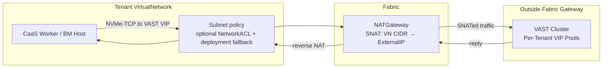

# Storage Networking (Phase 1)

## Summary

Provide the routing and SNAT path for tenant-Subnet block-storage traffic from
CaaS workers and BMaaS hosts to the VAST storage cluster — located outside the
managed network fabric gateway — using the existing NATGateway primitive.
VMaaS CSI traffic continues to use the management network. A platform-level
Storage CIDR reservation prevents tenant VirtualNetwork CIDRs from
overlapping with VAST VIP addresses. Tenant Subnet policy still governs
tenant-Subnet traffic: the path is available only when the effective
NetworkACL policy permits it.

This design covers the **VAST backend only**. Other storage backends (Pure
Storage FlashBlade, Ceph, etc.) are not in scope. See [PRD](prd.md) for
detailed requirements.

## Motivation

The storage subsystem (OSAC-1332, OSAC-1111) assumes "CaaS cluster nodes have
network reachability to the storage backend" without defining how that
reachability is achieved. Tenant workloads run inside isolated VirtualNetworks
on the OSAC fabric. The VAST cluster sits outside the managed network fabric
gateway. Without an explicit networking path, three problems arise:

1. **No route to storage.** Tenant VirtualNetworks are fabric-isolated. Traffic
   destined for VAST VIPs has no defined exit path.

2. **Silent IP overlap.** If a tenant's VN CIDR overlaps with the VAST VIP
   range, the fabric routes those packets internally instead of externally.
   Storage access fails with no clear error.

3. **NAT capacity.** Block storage generates concurrent NVMe-TCP sessions and
   CSI operations through the NATGateway. There is no validation that the NAT
   pool supports this load.

The approach proposed here — treating VAST as a service outside the managed
fabric gateway, consumed via SNAT — is the simplest viable path for the first
phase. It reuses existing networking primitives (VirtualNetwork, NATGateway,
ExternalIP) and avoids per-tenant VLAN configuration on the VAST side. Storage
tenant isolation is not required for the first phase.

### Goals

- Reuse existing networking primitives (NATGateway, ExternalIP, NetworkClass).
  No new CRDs or controllers for storage networking.
- Enforce Storage CIDR reservation via validation in the fulfillment-service,
  preventing VirtualNetwork CIDR overlap at creation time.
- Ensure the default tenant onboarding flow produces a network configuration
  with the required route and NATGateway. Storage traffic also requires the
  deployment ACL fallback to permit it, or a selected Subnet with an
  associated NetworkACL that permits it.
- Support all three consumer types: VMaaS and CaaS use the VAST CSI driver
  when their applicable network policy permits the data path; BMaaS receives
  the network path when its Subnet policy permits it and configures storage
  manually.

### Non-Goals

- Storage tenant isolation at the network level (deferred to OSAC-5073).
  Per-tenant VAST VIP pools exist but are not network-isolated from each
  other in the first phase.
- Direct-attach, VLAN-based, SR-IOV, or RDMA storage networking paths.
- NFS or file storage — block storage only for the first phase.
- Per-subnet NAT granularity (NATGateway is per-VirtualNetwork).
- Network-level QoS or bandwidth reservation for storage traffic.
- East-west GPU-to-storage paths (deferred per OSAC-1382).

## Current Storage Architecture

This section describes how storage works today for each OSAC service type
and storage protocol, and what each path requires from the network.
Understanding the baseline motivates why the changes proposed in this design
are necessary — and why they are sufficient for the first phase.

The following describes current behavior for both block and file protocols
for context. This proposal's first-phase scope is block storage only. The NFS
and file-storage paths below, including VM guest mounts, are existing-system
context and are not included in its requirements or deliverables.

This design covers the **VAST backend only**. The OSAC CSI meta-driver
supports multiple vendors (VAST, Pure Storage, Trident), but VAST is the
only backend deployed in production. Other backends may require different
networking considerations in the future.

### Storage Protocols

VAST exposes two storage protocols:

| Protocol | VAST CSI Provisioner | Transport | StorageClass Binding Mode |
|----------|---------------------|-----------|---------------------------|
| **Block** | `block.csi.vastdata.com` | NVMe-TCP (TCP port 4420) | `WaitForFirstConsumer` |
| **File (NFS)** | `csi.vastdata.com` | NFS (TCP port 2049) | `Immediate` |

Both protocols connect to VAST VIP addresses managed by the VAST cluster.
Each tenant receives a dedicated VAST VIP pool (e.g.,
`osac-<tenant>-vippool`); the VIP addresses are drawn from the Storage VIP
CIDR defined in this design.

LVMS (node-local block storage via topolvm) is available for single-node
development VMaaS deployments. It uses local disks and has no network
requirements — it is excluded from this analysis.

### Storage Control Plane: OSAC CSI Meta-Driver

The OSAC CSI meta-driver (`csi.osac.openshift.io`, OSAC-2872) decouples
tenant clusters from vendor-specific storage drivers. Tenant clusters see a
single CSI identity; the meta-driver routes each CSI operation to the
correct vendor plugin based on `volume_context["osac.backend"]`:

- **Controller plugin** (Deployment on hub): CreateVolume calls the
  fulfillment-service Volume API, which creates a Volume CR on the hub.
  The osac-operator's VolumeReconciler calls the vendor CSI controller
  (e.g., VAST) to provision the actual volume. ControllerPublishVolume
  proxies to the vendor controller using opaque `vendor_context` (subsystem,
  vip_pool_name).
- **Node plugin** (DaemonSet on target cluster): NodeStageVolume and
  NodePublishVolume route to vendor node plugins via `--vendor-sockets`
  mapping. The VAST node plugin initiates the NVMe-TCP connection (block)
  or NFS mount (file) on the node where kubelet runs.

For CSI volumes, storage data-plane traffic originates from the node running
the CSI node plugin — not from inside a VM guest. Tenant-Subnet policy applies
to CaaS worker and BMaaS host paths; VMaaS CSI traffic uses the management
network.

### Storage Onboarding: Two-Stage Model

All managed services follow a two-stage onboarding model:

- **Stage 1 — backend setup:** The StorageReconciler creates the tenant's
  VAST resources — tenant account, views, QoS policies, VIP pool,
  per-tenant Manager credentials. This runs on the hub cluster and
  communicates with the VAST management API. The results are stored in a
  hub Secret (`vast-tenant-config-<tenant>`). Stage 1 is a control-plane
  operation with no tenant-network dependency.

- **Stage 2 — cluster-side setup:** AAP installs the OSAC CSI meta-driver,
  VAST CSI backends (via the `csi-backends` Helm chart), a CSI Secret
  with per-tenant credentials, and per-tenant StorageClasses on the target
  cluster. StorageClasses are labeled with `osac.openshift.io/tenant`,
  `osac.openshift.io/storage-tier`, and `osac.openshift.io/storage-protocol`.

The trigger for each stage differs by service:

| Service | Stage 1 Trigger | Stage 2 Target | Stage 2 Trigger |
|---------|----------------|----------------|-----------------|
| **VMaaS** | Tenant `Phase=Ready` | VMaaS target cluster (shared) | Same as Stage 1 |
| **CaaS** | Tenant `Phase=Ready` | Per-tenant CaaS cluster | `ClusterOrder.Phase=Ready` (OSAC-1332) |
| **BMaaS** | — | — | — (tenant-managed) |

### VMaaS Storage

#### How It Works

VMaaS VMs run as KubeVirt pods on a shared VMaaS target cluster (the hub
cluster or a dedicated management cluster). Both storage stages run during
tenant onboarding. After onboarding, the VMaaS target cluster has the OSAC
CSI meta-driver, VAST CSI backends, per-tenant credentials, and per-tenant
StorageClasses for both block and NFS.

**Block (NVMe-TCP):** When a VM's PVC uses a block StorageClass, the OSAC
CSI meta-driver routes CreateVolume through the fulfillment-service to the
VAST CSI controller on the hub. At mount time, kubelet calls NodeStageVolume
on the **OCP node** where the VM pod is scheduled. The VAST node plugin
initiates an NVMe-TCP connection to the tenant's VAST VIP from the OCP
node, discovers the NVMe subsystem, and presents the block device to the VM
via virtio.

**File (NFS via CSI):** The flow is identical through volume creation. At
mount time on the OCP node, the VAST node plugin performs an NFS mount to
the tenant's VAST VIP. The mounted filesystem is projected into the VM pod.

**File (NFS via VM guest mount):** A VM can also mount NFS directly from
the guest OS using its tenant VirtualNetwork NIC, bypassing the CSI driver
entirely. The NFS traffic in this case originates from the VM guest, not the
OCP node.

#### Networking Requirements

VMaaS has **two distinct data-plane paths** depending on whether storage I/O
originates from the OCP node (CSI) or the VM guest (direct mount):

```
Block / NFS via CSI:
  OCP node (CSI node plugin)
    → NVMe-TCP or NFS to VAST VIP
    → exits management cluster network via management SNAT
    → routes to VAST (outside fabric gateway)

NFS via VM guest mount:
  VM guest (tenant VN NIC)
    → NFS to VAST VIP
    → exits tenant VirtualNetwork via NATGateway (SNAT)
    → routes to VAST (outside fabric gateway)
```

| Requirement | CSI path (block and NFS) | VM guest mount path (NFS only) |
|-------------|--------------------------|--------------------------------|
| **Traffic origin** | OCP node (management network) | VM guest (tenant VirtualNetwork) |
| **SNAT provider** | Management cluster's own NAT or direct routing | Tenant VN's NATGateway + ExternalIP |
| **Outbound TCP** | NVMe-TCP port 4420 or NFS port 2049 | NFS port 2049 |
| **No inbound from VAST** | Yes — all connections client-initiated | Yes |
| **Tenant Subnet policy** | Management-network policy applies; tenant Subnet ACL does not | Deployment fallback or the VM Subnet's associated ACL must permit the flow and, under `DENY`, its replies |
| **CIDR overlap risk** | Management network CIDR vs. VAST VIPs (admin responsibility) | Tenant VN CIDR vs. VAST VIPs (this design prevents it) |

The CSI path (used for all PVC-based storage) depends on the management
cluster's network having a route to VAST. This is an infrastructure
prerequisite configured at deployment time — the management cluster's
network is admin-controlled, not tenant-controlled.

The VM guest mount path depends on the tenant VN's NATGateway and the effective
policy on the VM's Subnet. The Storage CIDR reservation prevents route overlap;
it does not permit traffic through a Subnet ACL.

### CaaS Storage

#### How It Works

CaaS clusters are Hosted Control Plane (HyperShift) clusters with
bare-metal worker nodes placed on tenant Subnets via the OSAC Networking
API. Stage 1 runs during tenant onboarding. Stage 2 is triggered when a
ClusterOrder reaches `Phase=Ready` — the StorageReconciler retrieves the
cluster's admin kubeconfig via the HostedControlPlane API and triggers AAP
to install the OSAC CSI meta-driver and per-tenant StorageClasses on the
CaaS cluster. A `ClusterStorageReady` condition on the ClusterOrder tracks
completion.

CaaS clusters use the same StorageClass properties as VMaaS:

| Property | File (NFS) | Block |
|----------|------------|-------|
| Provisioner | `csi.vastdata.com` | `block.csi.vastdata.com` |
| Binding mode | `Immediate` | `WaitForFirstConsumer` |
| Reclaim policy | `Delete` | `Delete` |

**Block (NVMe-TCP):** Same OSAC CSI meta-driver architecture. The CSI
controller operations (create, delete, publish, unpublish) are routed
through the fulfillment-service on the hub. At mount time on the CaaS
**bare-metal worker node**, the VAST node plugin initiates an NVMe-TCP
connection to the tenant's VAST VIP.

**File (NFS):** Same flow, with NFS mount instead of NVMe-TCP at the worker
node level.

#### Networking Requirements

CaaS worker nodes are bare-metal servers whose fabric ports are moved from
the provisioning network to the tenant Subnet during provisioning
(OSAC-2135). After provisioning, each worker node is directly on the
tenant's fabric segment within the VirtualNetwork. Unlike VMaaS, **there is
only one data-plane path** — all CSI traffic originates from the CaaS worker
node, which is on the tenant VN.

```
CaaS worker node (CSI node plugin, on tenant VN)
  → NVMe-TCP or NFS to VAST VIP
  → exits tenant VirtualNetwork via NATGateway (SNAT)
  → routes to VAST (outside fabric gateway)
```

| Requirement | Detail |
|-------------|--------|
| **Outbound TCP to VAST VIP** | NVMe-TCP (port 4420) for block, NFS (port 2049) for file |
| **NATGateway on VirtualNetwork** | Worker nodes use the VN's NATGateway for egress. VAST VIPs are outside the fabric gateway. |
| **Subnet policy** | The deployment fallback or the Subnet's associated NetworkACL must permit the flow; with `DENY`, allow both egress and reply ingress. |
| **No inbound from VAST** | All storage connections are client-initiated. |
| **No VN CIDR overlap with VAST VIPs** | If the VN CIDR overlaps, the fabric routes storage traffic internally — storage silently fails. |

### BMaaS Storage

#### How It Works

BMaaS provides bare-metal hosts to tenants. No automated storage onboarding
runs for BMaaS — there is no Stage 1 or Stage 2. BMaaS tenants are
responsible for all storage configuration on their hosts.

**Block (NVMe-TCP):** The tenant configures an NVMe-TCP initiator on the
host, discovers the VAST subsystem (VIP pool FQDN or IP), and manages
credentials. The NVMe-TCP session is established directly from the host to
the VAST VIP.

**File (NFS):** The tenant mounts VAST NFS exports directly using standard
NFS client tools, pointing to the VAST VIP.

#### Networking Requirements

BMaaS hosts are provisioned on a tenant Subnet. During provisioning, the
bare-metal-fulfillment-operator moves the host's fabric port from the
provisioning network to the tenant network (OSAC-1437). After provisioning,
the host has a fabric IP on the tenant Subnet and uses the VN's NATGateway for
external connectivity when the Subnet policy permits it.

```
BM host (tenant VN)
  → NVMe-TCP or NFS to VAST VIP
  → exits tenant VirtualNetwork via NATGateway (SNAT)
  → routes to VAST (outside fabric gateway)
```

| Requirement | Detail |
|-------------|--------|
| **Outbound TCP to VAST VIP** | NVMe-TCP (port 4420) for block, NFS (port 2049) for file |
| **NATGateway on VirtualNetwork** | Same SNAT path as CaaS |
| **Subnet policy** | The deployment fallback or the Subnet's associated NetworkACL must permit the flow; with `DENY`, allow both egress and reply ingress. |
| **No inbound from VAST** | All storage connections are client-initiated |
| **No VN CIDR overlap with VAST VIPs** | Same risk as CaaS |
| **Tenant-managed configuration** | Unlike VMaaS/CaaS, the tenant installs and configures storage software. The platform provides the route and NAT path; the effective Subnet policy must also permit the traffic. |

### Summary: Data-Plane Paths to VAST

| Service | Protocol | Traffic Origin | Network Path | SNAT Provider |
|---------|----------|----------------|--------------|---------------|
| **VMaaS** | Block (NVMe-TCP) | OCP node (CSI) | Management network | Management cluster NAT / direct routing |
| **VMaaS** | File (NFS via CSI) | OCP node (CSI) | Management network | Management cluster NAT / direct routing |
| **VMaaS** | File (NFS guest mount) | VM guest | Tenant VirtualNetwork | Tenant NATGateway |
| **CaaS** | Block (NVMe-TCP) | BM worker node (CSI) | Tenant VirtualNetwork | Tenant NATGateway |
| **CaaS** | File (NFS) | BM worker node (CSI) | Tenant VirtualNetwork | Tenant NATGateway |
| **BMaaS** | Block (NVMe-TCP) | BM host | Tenant VirtualNetwork | Tenant NATGateway |
| **BMaaS** | File (NFS) | BM host | Tenant VirtualNetwork | Tenant NATGateway |

CaaS, BMaaS, and VMaaS guest-mount paths all share the same data-plane
pattern: tenant Subnet policy → NATGateway (SNAT) → upstream routing → VAST.
The Storage CIDR reservation prevents tenant VN CIDRs from overlapping with
VAST VIPs, but the effective Subnet policy must also permit the traffic.

VMaaS CSI-based storage (block and NFS via CSI) takes a different path
through the management cluster's network. The management cluster's route to
VAST is an infrastructure prerequisite — the admin ensures this during
deployment, and the management network's CIDR is admin-controlled (not
subject to tenant VN creation). The Storage CIDR reservation does not
directly protect this path, but since the management network is not
tenant-managed, there is no risk of accidental overlap.

## Proposal

### Overview of Changes

The design introduces three changes to the existing platform:

1. **Storage CIDR on NetworkClass** — a new field on the NetworkClass
   configuration that declares the IP range reserved for VAST VIP addresses.
   This is set once at installation time.

2. **VirtualNetwork CIDR validation** — the fulfillment-service rejects
   VirtualNetwork creation requests whose IPv4 CIDR overlaps with the Storage
   CIDR. This prevents tenants from creating networks that would trap
   storage-bound traffic in the fabric.

3. **Default networking validation** — the NetworkClass default VN CIDR is
   validated against the Storage CIDR at configuration time, ensuring
   auto-provisioned tenant networks do not have a route conflict. Subnet ACL
   policy remains a separate prerequisite for storage traffic.

No new controllers, CRDs, or networking resources are introduced. The existing
NATGateway (one per VirtualNetwork, auto-provisioned during tenant onboarding)
provides the SNAT path for permitted tenant traffic to the VAST cluster. This
storage design neither creates NetworkACLs nor changes Subnet associations or
the deployment ACL fallback.

### Changes Per Component

All components live in the `osac` monorepo.

| Component | Changes |
|---|---|
| **fulfillment-service** | Add `storage_cidrs` field to NetworkClass. Add CIDR overlap validation to VirtualNetwork creation. Validate NetworkClass default VN CIDR against storage CIDRs. |
| **proto** | Add `storage_cidrs` to the NetworkClass proto definition. |
| **osac-operator** | No changes. NATGateway provides SNAT for egress traffic permitted by the Subnet policy. |
| **osac-aap** | No changes. Storage provisioning playbooks already configure VAST CSI with VIP pool information from the tenant hub Secret. |
| **osac-installer** | Update NetworkClass manifests to include the Storage CIDR for the deployment. |

### Workflow Description

#### Network Path: CaaS or BMaaS Workload → VAST



This diagram shows the tenant-Subnet data-plane path for CaaS workers and
BMaaS hosts. A workload inside a tenant VirtualNetwork initiates an NVMe-TCP
connection to a VAST VIP address. Because the VAST VIP falls outside the VN
CIDR (as enforced by the overlap validation), the fabric routes permitted
packets externally through the NATGateway. The NATGateway performs SNAT,
replacing the workload's private source IP with the NATGateway's ExternalIP.
The VAST cluster sees the ExternalIP as the source and responds to it. Return
traffic follows the reverse NAT path back through the Subnet's ingress policy,
which is evaluated independently from egress.
VMaaS CSI traffic follows the management-network path described in VMaaS
Storage, not this tenant-Subnet path.

#### Effective Subnet Policy

Storage CIDR validation prevents route overlap; it does not bypass the
NetworkACL policy enforced at the tenant Subnet boundary. CaaS worker nodes
and BMaaS hosts using tenant Subnets for block storage must pass the source
Subnet's egress policy before reaching the NATGateway, and return packets must
pass that Subnet's ingress policy after reverse NAT.

With a deployment `PERMIT` fallback, unmatched packets pass unless a matching
NetworkACL `DENY` rule applies. With a `DENY` fallback, the Subnet's associated
NetworkACL must allow egress to the VAST addresses on the required TCP service
ports (4420 for NVMe-TCP and the configured VMS API port when that endpoint is
routable from tenant VirtualNetworks). It must also allow ingress TCP traffic
from the configured VAST VIP source CIDRs to the deployment-approved client
ephemeral destination-port range. If a separately routable VMS API endpoint is
outside those VIP CIDRs, add an ingress rule for its CIDR to the same client
ephemeral destination-port range so API replies are permitted. The range must
match the client hosts' actual ephemeral source ports; do not assume a
universal numeric range. Since the ACL is stateless, each direction is
decided independently. File storage and NFS port 2049 are outside this phase's
scope.

The default Subnet has no NetworkACL association, and that association cannot
be added after creation. Under a `DENY` fallback, a storage workload must use
a separate Subnet created with the required ACL association: create the
NetworkACL first, associate it when creating the Subnet, then attach the
workload. The VMaaS CSI path originating on the management network does not
cross a tenant Subnet and is governed by the management network's policy.

#### Personas

- **Cloud Infrastructure Admin:** Configures the Storage CIDR on
  NetworkClass at installation time. Provisions ExternalIPPools and
  ExternalIPs for NATGateways.
- **Cloud Provider Admin:** Validates that the deployment's default VN CIDR
  does not conflict with the Storage CIDR. Coordinates with the VAST
  administrator to ensure VIP pool addresses fall within the Storage CIDR.
- **Tenant Admin / Tenant User:** Creates VirtualNetworks (or uses defaults).
  Receives a clear error if the chosen CIDR overlaps with the storage range.
  CaaS and VMaaS storage works via VAST CSI when the effective Subnet policy
  permits the path; VMaaS CSI traffic on the management network follows that
  network's policy.
- **BMaaS Tenant:** Has network connectivity to VAST when the effective
  Subnet policy permits the external path. Configures storage on bare-metal
  hosts manually.

#### Prerequisites

1. NetworkClass is configured with the Storage CIDR. The value must cover
   all VAST IP addresses that tenant workloads or CSI node plugins may
   connect to:
   - The **data-plane VIP pool range** — this is the
     `VAST_VIP_POOL_SUPERNET` configured on the storage-operations
     InstanceGroup (e.g., `10.100.0.0/22`). If VIP pools are pre-created
     by the cloud admin rather than carved from the supernet,
     `storage_cidrs` must cover those pool ranges as well.
   - The **VAST management endpoint** (VMS API) — if its IP is routable
     from tenant networks. The CSI node plugin on each target cluster
     contacts the VMS API (`X_CSI_VMS_HOST`) for volume publish/unpublish
     operations. If the management endpoint is on the same data network as
     the VIP pools, the supernet already covers it. If it is on a separate
     management network that is not routable from tenant VNs, it does not
     need to be included.
2. Tenant onboarding has completed, creating a default VirtualNetwork,
   Subnet, and NATGateway with an ExternalIP.
3. The ExternalIP used by the NATGateway is routable to the VAST addresses
   covered by the Storage CIDR (via the datacenter's upstream routing).
4. The effective policy permits block-storage traffic on every tenant Subnet
   used by CaaS workers or BMaaS hosts. Under a `DENY` fallback, the
   NetworkACL must be associated when the Subnet is created and permit egress
   to the required storage endpoints and ports plus return ingress.

#### VMaaS and CaaS Storage Access

VMaaS block CSI traffic originating from the management network follows that
network's routing and policy. For CaaS block-storage traffic, the selected
Subnet's effective policy must permit the VAST flow. With a `PERMIT` fallback,
no ACL rule is needed unless an associated ACL has a matching deny. With a
`DENY` fallback, use a Subnet created with an associated ACL that allows the
required egress and return ingress before attaching the workload.

#### BMaaS Storage Access

BMaaS hosts are provisioned on a tenant Subnet within a VirtualNetwork.
The NATGateway provides SNAT for traffic permitted by the Subnet policy. Under
a `DENY` fallback, create and associate an ACL that allows the VAST egress and
return ingress before attaching the host. The tenant must configure an
NVMe-TCP initiator on the bare-metal host manually.

### API Extensions

#### NetworkClass: `storage_cidrs` Field

A new repeated field on the NetworkClass configuration:

```protobuf
message NetworkClassConfig {
  // ... existing fields ...

  // CIDR ranges reserved for storage backend addresses.
  // VirtualNetwork creation is rejected if the VN's IPv4 CIDR
  // overlaps with any of these ranges.
  // Configured at installation time. Immutable after initial set.
  repeated string storage_cidrs = N;
}
```

The field is a list of CIDR strings (e.g., `["198.51.100.0/24"]`). Using a
list rather than a single CIDR accommodates deployments where VAST VIPs span
multiple non-contiguous ranges.

Validation rules:
- Each entry must be a valid IPv4 CIDR in canonical form.
- Entries must not overlap with each other.
- The field is immutable after initial configuration (preventing accidental
  removal that would allow conflicting VNs to be created).

#### VirtualNetwork CIDR Validation

The fulfillment-service's VirtualNetwork creation handler adds an overlap
check:

```
For each CIDR in NetworkClass.storage_cidrs:
  If VirtualNetwork.ipv4_cidr overlaps with CIDR:
    Reject with INVALID_ARGUMENT:
      "VirtualNetwork CIDR {vn_cidr} overlaps with storage range
       {storage_cidr}. Choose a CIDR that does not overlap with
       storage ranges."
```

This check runs alongside existing VN validation (CIDR format, immutability).
The error message names both CIDRs so the tenant can make an informed choice.

#### NetworkClass Default VN CIDR Validation

When a NetworkClass is created or updated, the fulfillment-service validates
that `defaults.virtual_network_cidr` does not overlap with any entry in
`storage_cidrs`. This prevents the auto-provisioned default VN from
conflicting with storage.

No existing resources are modified by this enhancement. The new field is
additive to NetworkClass, and the validation is a new precondition on
VirtualNetwork creation.

## UX Alignment

No `@temp-api` file exists for NetworkClass or VirtualNetwork in osac-ux.
Storage CIDR configuration is an admin-level installation concern with
no UI surface in the first phase.

### Implementation Details/Notes/Constraints

#### CIDR Overlap Detection

The overlap check is a standard prefix containment test: two CIDRs overlap if
either contains the other's first address or last address. Go's `net.IPNet`
provides `Contains()` for this. The check is O(n) in the number of
`storage_cidrs` entries, which is expected to be 1–3.

#### Routing Guarantee

The Storage CIDR reservation ensures correctness by construction:

1. The VAST VIP addresses are within the Storage CIDR.
2. No tenant VirtualNetwork CIDR overlaps with the Storage CIDR.
3. Therefore, when a workload sends a packet to a VAST VIP, the destination
   does not match the VN's local CIDR.
4. The fabric treats it as external traffic and routes it through the
   NATGateway (SNAT) to the upstream network.
5. The upstream network routes to VAST (standard IP routing).

This avoids any fabric-level routing table changes or special storage-aware
routing rules. The fabric's default behavior — route non-local traffic
externally — is sufficient.

#### NAT Capacity Considerations

Each NVMe-TCP session from a workload to VAST uses one TCP connection through the
NATGateway. The NATGateway performs source NAT using its ExternalIP. A single
ExternalIP supports approximately 64k concurrent connections (limited by the
ephemeral port range).

For the first phase, the expected scale is:
- Single-digit tenants, each with a small number of clusters or VMs.
- Each cluster or VM mounts a small number of PersistentVolumes.
- Each PV produces one NVMe-TCP session.

A single ExternalIP per NATGateway is sufficient for this scale. If future
scale exceeds this, the NATGateway can be extended to support multiple
ExternalIPs (out of scope for the first phase).

#### BMaaS Connectivity

BMaaS hosts are provisioned on a tenant Subnet and use the NATGateway for
permitted external connectivity. With a `DENY` fallback, use a Subnet created
with an associated ACL that permits VAST traffic and replies. No BMaaS-specific
NAT changes are needed.

The BMaaS tenant is responsible for:
- Installing the VAST CSI driver or configuring NVMe-TCP on their hosts.
- Configuring the VAST endpoint (VIP pool FQDN or IP).
- Managing VAST credentials for their workloads.

#### Interaction with Storage Onboarding

The storage onboarding flow (OSAC-1332) installs the VAST CSI driver on
tenant clusters with connection parameters from the hub Secret
(`vast-tenant-config-<tenant>`). The hub Secret contains `vip_pool_name`
or `vip_pool_fqdn` — these point to the tenant's VIP pool whose addresses
are within the Storage CIDR.

No changes to the storage onboarding flow are required. The CSI driver
connects to the VAST VIP when its management-network policy or the selected
tenant Subnet's effective policy permits the flow. NATGateway and external
routing provide the path but do not override NetworkACL decisions.

### Security Considerations

This design inherits the existing security model without changes:

- **Network policy.** Existing NetworkACLs and the deployment fallback remain
  in force for tenant Subnets. NAT does not override them. No new initiated
  ingress paths are created; return packets are separately evaluated by the
  stateless ingress policy.
- **VAST credentials.** VAST CSI credentials are stored in hub Secrets
  and projected to tenant clusters via AAP. This flow is unchanged.
- **No DNAT.** VAST does not initiate connections to tenant workloads. All
  storage connections are outbound (client-to-server), using SNAT only.
- **Storage CIDR.** The CIDR is configured by the Cloud Infrastructure
  Admin at installation time and is immutable. Tenants cannot modify or
  bypass it.

### Failure Handling and Recovery

| Failure Mode | Behavior | Recovery | User Observes |
|---|---|---|---|
| NATGateway not provisioned on VN | No external connectivity from VN. Storage unreachable. | Default tenant onboarding creates NATGateway. If missing, admin provisions one manually. | Connection timeouts on PVC mount. |
| NATGateway ExternalIP not routable to VAST | SNAT succeeds but packets don't reach VAST. | Admin fixes upstream routing to ensure ExternalIP pool can reach the Storage CIDR. | Connection timeouts on PVC mount. |
| Subnet policy denies storage traffic | Packets are dropped at the Subnet boundary before reaching VAST, or return packets are dropped on ingress. | Use the deployment `PERMIT` fallback where appropriate, or create a NetworkACL and a separate Subnet with rules allowing storage egress and return ingress before attaching the workload. ACL associations cannot be added to an existing Subnet. | PVC provisioning or mount times out. |
| Storage CIDR not configured on NetworkClass | No overlap validation. Tenants can create VNs that conflict with VAST VIPs. | Admin configures the field before tenant onboarding. VNs created before configuration are not retroactively validated. | Storage may or may not work depending on whether the tenant VN CIDR happens to overlap. |
| NAT port exhaustion | New NVMe-TCP sessions fail. Existing sessions continue. | Reduce concurrent PV count, or (future) expand NAT pool. | PVC mount hangs for new volumes. Existing volumes continue working. |
| VAST cluster unreachable | Storage connections time out. CSI operations fail. | Restore VAST cluster or upstream network path. | PVC provisioning fails. Existing mounted volumes may hang. |

### RBAC / Tenancy

No RBAC or tenancy changes required. The Storage CIDR is a
platform-level (NetworkClass) configuration managed by the Cloud
Infrastructure Admin. VirtualNetwork CIDR validation is enforced by the
fulfillment-service for all tenants uniformly. Storage tenant isolation is
explicitly not required for the first phase.

### Observability and Monitoring

No new metrics, events, or alerts are introduced. The existing fulfillment-service
request metrics cover the VirtualNetwork creation path (including rejection
due to CIDR overlap). The existing NATGateway and ExternalIP status conditions
provide visibility into the NAT path health.

Operators debugging storage connectivity issues should check:
1. VirtualNetwork has a NATGateway in Ready state.
2. NATGateway's ExternalIP is Allocated and routable.
3. The deployment ACL fallback and the workload Subnet's NetworkACL permit
   egress to VAST and the independently evaluated return traffic.
4. Upstream routing allows ExternalIP → Storage CIDR.
5. VAST cluster is healthy and VIP pool is serving.

### Risks and Mitigations

| Risk | Mitigation |
|---|---|
| Admin forgets to configure Storage CIDR before tenant onboarding | Document as a required installation step. Future: add a preflight check that warns if storage backends are registered but no Storage CIDR is configured. |
| Existing VNs (created before Storage CIDR is configured) have overlapping CIDRs | The validation applies only to new VN creation. Existing VNs are not retroactively checked. Document that the Storage CIDR must be configured before the first tenant is onboarded. |
| VAST VIP addresses change after deployment | The Storage CIDR is a superset range, not the exact VIP list. As long as new VIPs are allocated within the same CIDR, no platform changes are needed. If the range changes entirely, a new NetworkClass with updated storage_cidrs is required. |
| Single ExternalIP per NATGateway limits NAT capacity | Sufficient for the first phase scale. Monitor connection counts. Future: extend NATGateway to support multiple ExternalIPs. |
| Deployment uses a `DENY` fallback while storage workloads use the default Subnet | The default Subnet has no ACL association and cannot be changed after creation. Document the policy prerequisite and create a custom ACL and Subnet before attaching storage workloads. |

### Drawbacks

The approach assumes VAST is external and that upstream routing supports the
SNAT path. Tenant Subnet policy must also permit the storage flows. This adds
latency compared to direct-attach or VLAN-based storage paths, and NAT adds a
throughput constraint. For the first phase this is acceptable — performance-critical
storage networking (GPU-to-storage, RDMA) is explicitly deferred.

The Storage CIDR is a blunt instrument: it reserves an entire range from
all tenants, even those that don't use storage. For the first phase with
single-digit tenants this is not a problem, but a more granular approach may
be needed at scale.

## Alternatives (Not Implemented)

### 1. Per-Tenant VLAN to VAST

Provision a dedicated VLAN per tenant on the VAST cluster, giving each tenant
direct L2 connectivity to their VAST VIP pool.

**Pros:** No NAT overhead. True network isolation per tenant.
**Cons:** Requires VLAN configuration on the VAST cluster for each tenant.
Significantly more complex operationally. Does not scale within the first
phase timeframe.
**Rejected:** The JIRA feature description explicitly calls for "the simplest
viable connectivity solution." Per-tenant VLANs are the opposite.

### 2. Direct-Attach Storage Network

Use a dedicated storage NIC (the `storage` role on HostType/BareMetalInstanceType)
to connect workloads directly to the VAST network without NAT.

**Pros:** Best performance. No NAT port limits. Suitable for high-throughput
storage workloads.
**Cons:** Requires dedicated NICs, switch configuration, and a separate
storage network fabric. Not available in all deployments. Much more complex.
**Rejected:** Deferred to a future enhancement for performance-sensitive
workloads. Not viable for the first phase.

### 3. No CIDR Reservation (Documentation-Only)

Document that admins must choose non-overlapping CIDRs but do not enforce it
in the platform.

**Pros:** No code changes required.
**Cons:** Silent failures when CIDRs overlap. Debugging storage connectivity
issues caused by routing conflicts is extremely difficult.
**Rejected:** The failure mode (storage silently unreachable) is too severe
and hard to diagnose. Platform-enforced validation is worth the small
implementation cost.

### 4. Fabric-Level Static Routes

Configure fabric-level static routes to force traffic destined for VAST VIPs
to exit the fabric, regardless of VN CIDR overlap.

**Pros:** No CIDR reservation needed. Works even with overlapping ranges.
**Cons:** Requires backend-specific configuration. Breaks the abstraction
that the fabric handles routing consistently. Different fabric backends
would need separate implementations.
**Rejected:** Adds backend-specific complexity. CIDR reservation is simpler
and independent of the selected fabric backend.

## Open Questions

None. All questions resolved during drafting.

## Test Plan

### Unit Tests

- VirtualNetwork CIDR overlap validation: reject creation when VN CIDR
  overlaps with any entry in `storage_cidrs`. Accept when no overlap.
  Cover partial overlap, containment in both directions, adjacent
  non-overlapping ranges, and empty `storage_cidrs`.
- NetworkClass validation: reject default VN CIDR that overlaps with
  `storage_cidrs`. Accept non-overlapping defaults.
- `storage_cidrs` field validation: reject malformed CIDRs, reject
  overlapping entries within the list, accept valid non-overlapping CIDRs.
- Immutability: reject attempts to modify `storage_cidrs` after initial
  configuration.

### Integration Tests

- End-to-end tenant onboarding with Storage CIDR configured: verify
  default VN is created with non-overlapping CIDR, NATGateway is provisioned,
  and the network path to an external endpoint is functional when the
  deployment fallback permits unmatched traffic.
- With a `DENY` fallback, verify CaaS or BMaaS storage traffic fails on the
  default Subnet, then succeeds on a separately created Subnet whose ACL
  allows egress to the required VAST service port and ingress from VAST VIP
  CIDRs to the approved client ephemeral destination-port range. When the VMS
  API endpoint has a separate tenant-routable CIDR, verify the ACL also allows
  egress to its API port and ingress replies from that endpoint CIDR. Verify
  replies to ports within the range pass, replies to ports outside it are
  blocked, and a matching deny rule still blocks the flow.
- VirtualNetwork creation rejection: configure Storage CIDR, attempt
  to create a VN with overlapping CIDR, verify rejection with descriptive
  error message.

### E2E Tests

- Provision a CaaS cluster on a tenant Subnet whose effective policy permits
  VAST traffic, install VAST CSI via storage onboarding, create a PVC, and
  verify the PV mounts and storage traffic reaches VAST through the NATGateway.
- For VMaaS, provision a VM and verify the VAST CSI PVC mounts through the
  management-network path; this does not exercise tenant-Subnet ACL policy.
- BMaaS: provision a bare-metal host on a Subnet whose effective policy
  permits the VAST TCP service port and return traffic, then verify a TCP
  connection to the VAST VIP succeeds.

## Graduation Criteria

N/A. OSAC is in active development and has not been released to customers.

## Upgrade / Downgrade Strategy

Pre-GA change. The `storage_cidrs` field is additive to NetworkClass.
Existing deployments upgrading to this version have no `storage_cidrs`
configured, which means no overlap validation is enforced — the behavior is
identical to before the change. The admin configures the field as part of
the first phase deployment.

## Version Skew Strategy

The `storage_cidrs` validation is entirely within the fulfillment-service.
No operator or AAP changes are required. The fulfillment-service can be
deployed independently. If the field is configured in the fulfillment-service
but the VAST cluster is not yet set up, the only effect is that tenants
cannot create VNs overlapping with the reserved range — a safe precondition.

## Support Procedures

To diagnose storage connectivity issues:

1. Verify NetworkClass has `storage_cidrs` configured:
   check via the fulfillment-service admin API.

2. Verify the tenant's VirtualNetwork CIDR does not overlap:
   compare VN CIDR against storage CIDRs.

3. Verify NATGateway is Ready:
   `kubectl get natgateway -n <tenant-ns>` — check Phase=Ready.

4. Verify the deployment ACL fallback and the Subnet's associated NetworkACL
   permit the flow and its return traffic. Under `DENY`, confirm the workload
   uses a Subnet created with the required ACL association.

5. Verify ExternalIP is Allocated:
   `kubectl get externalip -n <tenant-ns>` — check State=Allocated.

6. Verify upstream routing:
   from a host with the ExternalIP, verify TCP connectivity to a VAST VIP on
   the NVMe-TCP port (4420).

7. Check CSI driver logs on the tenant cluster:
   `kubectl logs -n vast-csi daemonset/vast-csi-node` for NVMe-TCP
   connection errors.

## Infrastructure Needed

None.

---

## Provenance

Authored: revise @ design 0.11.3 - 2bd6607, workspace main @ 2293f9140
Phases: revise, revise, revise

> This document's phase history does not include an initial /draft — structure was not verified against the template from origin.

<!-- ai-workflow-provenance:{"schema_version":1,"provenance_kind":"session","workflow":"design","workflow_version":"0.11.3","ai_workflows":"2bd6607","source_repo":"2293f9140","source_repo_branch":"main","commits_behind_main":0,"commits_ahead_main":0,"main_ref":"main","phases":["revise","revise","revise"],"authoring_modes":["skill"],"context_changed":false,"origin_untracked":true} -->
