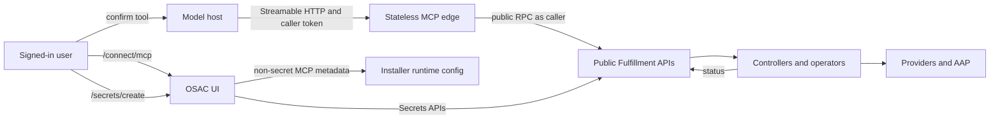
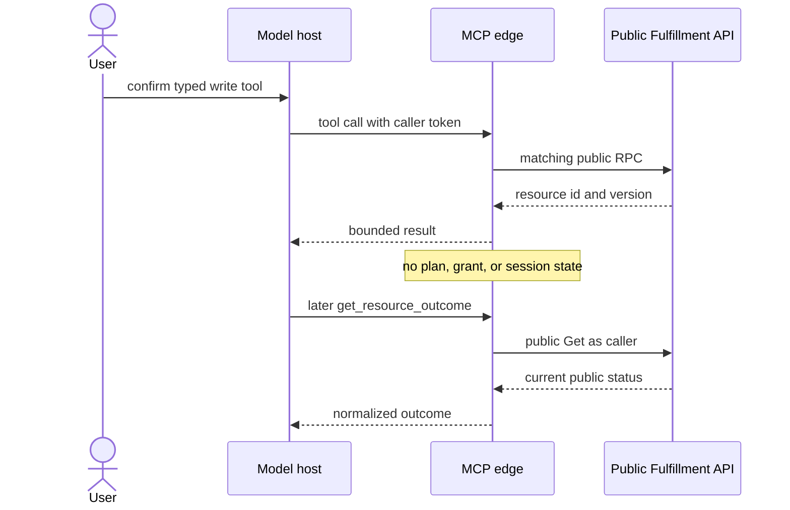

# OSAC MCP Server for infrastructure provisioning

| Field | Value |
| --- | --- |
| Author(s) | Tommy Hughes |
| Jira | [OSAC-5731](https://redhat.atlassian.net/browse/OSAC-5731) |
| PRD | [prd.md](prd.md) |
| Date | 2026-09-30 |

# 1. Overview

OSAC will provide a supported remote Model Context Protocol (MCP) endpoint as a
stateless adapter over public Fulfillment APIs. It forwards the signed-in
caller's token, exposes allowlisted discovery plus typed write tools, and
leaves authorization, tenancy, validation, and resource status to
Fulfillment.

Host tool confirmation is the human gate, Fulfillment authorization is
authoritative, and mutating tools call the public API directly. OSAC does not
add a durable plan service, execution grants, or a second approval UI. Missing
Secret values are created in the existing OSAC Secret UI; MCP then selects
the reference. [Locked: D16, D20, D25] [User]

See the [PRD](prd.md) for the detailed product requirements.

# 2. Goals and Non-Goals

## 2.1 Goals

- Preserve public Fulfillment APIs as the authorization, tenancy, validation,
  and lifecycle boundary for every MCP operation.
- Keep the MCP process stateless: no plan, grant, handoff, or audit tables.
- Expose allowlisted generic reads and typed write tools split so each tool
  has one MCP annotation tuple, never an unrestricted service or Kubernetes
  proxy.
- Use the model-host tool prompt as the per-write human gate.
- Publish one OSAC MCP endpoint contract (`publicURL`, OAuth resource, trust
  metadata, and `check_connection`) for the required local Cursor, Codex, and
  Claude surfaces. Harness install and sign-in follow each host's current MCP
  documentation. [Locked: D31, D32]

## 2.2 Non-Goals

- Add infrastructure actions that existing OSAC public APIs do not support, or
  add FabricDomain, identity administration, console, SSH, event-streaming, or
  in-guest application-management journeys. [Locked: D6, D26-D29]
- Provide a general Observability MCP or a separately verified model or agent
  identity. [Locked: D20, D37]
- Add a durable MCP plan, `execute_plan_step`, plan-wide approval, automatic
  rollback, automatic retry of an uncertain create, a separate dry-run, or an
  OSAC UI write-approval page. [Locked: D13, D16-D18] [User]
- Configure model hosts through the OSAC CLI, provide a one-click installer,
  duplicate Cursor, Codex, or Claude MCP product documentation, or support
  cloud-brokered agents and Claude Desktop Chat for private endpoints.
  [Locked: D11, D30-D33]
- Add a dedicated Secret-handoff API or page. Missing values use existing
  `/secrets/create`. [Locked: D25] [User]

# 3. Motivation / Background

Current `main` has no MCP implementation. OSAC-4388 already proved Streamable
HTTP, caller token forwarding, allowlisted list/get, and typed ComputeInstance
create/delete that mutate on the tool call. The first implementation PR
rebuilds that fulfillment-service MCP package and
`fulfillment-service/it/it_mcp_server_test.go` on current `main`, with write
tools registered only when a development-only flag is set. It does not merge
the experimental branch. [User] [Jira: OSAC-4388]

That path is enough for first delivery: host prompt plus the caller's token,
public resource status, and Secret bytes kept out of the model. This Feature
extends that adapter across the PRD resource families instead of introducing
an MCP coordination control plane. [User]

Fulfillment already authenticates the caller, enforces tenant and Project
visibility, validates catalog policy, persists desired state, and reports
provider outcomes. MCP maps tools onto those APIs. [Codebase:
fulfillment-service/internal/servers/]

# 4. Design

## 4.1 Architecture

### Components and responsibilities

Four surfaces change:

1. **MCP edge process:** terminates Streamable HTTP, validates `aud=osac-api`,
   registers allowlisted tools, forwards the caller bearer token on each
   public Fulfillment RPC, and maps results into bounded MCP responses. It
   retains no cross-request state.
2. **Existing public resource services:** perform every infrastructure
   mutation and remain authoritative for authorization, tenancy, catalog
   policy, references, validation, and resource status.
3. **OSAC UI and proxy:** `/connect/mcp` copies OSAC endpoint, client, and
   trust values and links official host MCP docs. Missing Secret values use
   the existing Secret create wizard. No MCP plan-review or handoff page is
   added.
4. **Installer and identity configuration:** deploy the endpoint, TLS,
   readiness, OAuth clients, replicas, and non-secret runtime configuration.



The host confirms a typed tool. MCP forwards the caller token on one public
RPC and keeps no plan, grant, or session tables. `/connect/mcp` copies
installer runtime metadata and links official host MCP docs; it is not a
host-product tutorial.
Missing Secret values use the existing `/secrets/create` wizard; MCP then
selects the reference. Later status is the public Fulfillment resource, so a
pod restart does not lose infrastructure state.



### Write path

1. Read-only tools discover eligible offerings, Projects, networking, Secret
   **references**, and current resource state.
2. A typed write tool validates the same field, catalog, and reference rules
   as the target public API, then invokes that API with the caller token. The
   host prompt on that tool is the per-write gate. Conversational agreement
   is not a write. A later uncalled tool is not previewed by the server; a
   multi-resource sequence is a series of confirmed calls. [Locked: D12, D16]
   [User]
3. Delete, public exposure, publication, and restart are separate tools from
   create so `destructiveHint` and `idempotentHint` stay honest. OSAC does
   not add a second confirmation protocol. [Locked: D14] [User]
4. After a definite failure, MCP returns the error and does not invoke later
   tools. It does not roll back earlier resources. [Locked: D13]
5. After an uncertain create, MCP checks for a trustworthy public resource
   record. If the outcome remains unknown, it reports that and does not retry
   the create. [Locked: D17]
6. `get_resource_outcome` reads the public Get as the caller so later sessions
   see actual state. Request acceptance is not readiness. [Locked: D21]

Changed targets or settings are a new tool call with new arguments, which
receives a new host prompt. [Locked: D15]

### Tool surface

MCP tool annotations are per-tool. Each registered tool has exactly one hint
tuple. Annotations are untrusted host hints, not authorization. Unspecified
writes default to destructive and non-idempotent.

<!-- markdownlint-disable MD013 -->

| Class | Tools | readOnlyHint | destructiveHint | idempotentHint | openWorldHint |
| --- | --- | --- | --- | --- | --- |
| Read | `check_connection`, `list_resources`, `get_resource`, `get_resource_outcome` | true | — | — | true |
| Create | `create_network_resource`, `create_compute_instance`, `create_cluster`, `create_bare_metal_instance`, `create_volume`, `create_project`, `create_catalog_offering` | false | false | false | true |
| Set power | `set_compute_instance_power`, `set_bare_metal_instance_power` | false | false | true | true |
| Volume metadata update | `update_volume` | false | false | true | true |
| Update | `update_compute_instance`, `update_cluster`, `update_bare_metal_instance`, `update_project`, `update_catalog_offering` | false | true | false | true |
| Restart | `restart_compute_instance`, `restart_bare_metal_instance` | false | true | false | true |
| Delete | `delete_network_resource`, `delete_compute_instance`, `delete_cluster`, `delete_bare_metal_instance`, `delete_volume`, `delete_catalog_offering` | false | true | false | true |
| Public exposure | `expose_network_resource` | false | true | false | true |
| Publish | `publish_catalog_offering` | false | true | false | true |

<!-- markdownlint-enable MD013 -->

Each tool also sets a human-readable `title`.

`openWorldHint` asks whether the tool reaches an unpredictable or dynamic set
of external entities. Web search, email, social networks, external APIs, and
customer workspaces are open-world. A tool limited to a fixed local memory
store is closed-world. Default is true.

The hint applies on both sides of the call. Before execution, open-world
inputs may leave the agent's local boundary (here: bearer token, tenant and
resource identifiers sent to OSAC). After execution, open-world results may
contain untrusted instructions, links, or text someone else controls (here:
public `status.message` and condition text from operators and providers).

Every OSAC MCP tool is a remote Streamable HTTP call into a tenant
infrastructure control plane, so `openWorldHint` is true on all of them,
including `check_connection`. An allowlisted type set is a closed schema, not
a closed world. `check_connection` still leaves the host with the caller's
token; it is not a local memory store.

A closed-world annotation would not make OSAC trusted. It would only describe
the intended domain. Hosts still need transport authentication, server
identity, output validation, and a policy for which returned content may
reach the model. OSAC still omits Secret bytes and raw upstream payloads
from tool results.

Create is not idempotent: there is no OSAC create idempotency key, and FR-17
forbids retrying an uncertain create. Delete is not MCP-idempotent: a second
call returns `not_found`. Start/stop set `run_strategy` and are hinted
idempotent when the identical Update is a no-op. Restart retriggers, so it
is not idempotent. Volume Update is metadata-only. Other Updates may change
disks, networking, or catalog content, so they are hinted destructive and
non-idempotent. Project Update stays unregistered until the public wrapper
propagates `lock=true`.

Read tools:

<!-- markdownlint-disable MD013 -->

| Tool | Behavior |
| --- | --- |
| `check_connection` | Authenticated read-only check of endpoint, server version, enabled capabilities, caller context, and permission summary. |
| `list_resources` | Bounded, allowlisted discovery; Secret results contain metadata and references only. |
| `get_resource` | Allowlisted retrieval; `Secrets/Get` is never registered. |
| `get_resource_outcome` | Normalized actual state, conditions, timing, facts, unknowns, and next action. |

<!-- markdownlint-enable MD013 -->

Write tools (mutate on the confirmed call). A resource-type discriminator is
allowed only inside a class that shares the same hint tuple (for example
`create_network_resource` for VirtualNetwork, Subnet, and SecurityGroup).
Create is never combined with delete, publish, public exposure, or restart.

<!-- markdownlint-disable MD013 -->

| Tool | Allowlisted mutations |
| --- | --- |
| `create_network_resource` | Create VirtualNetwork, Subnet, or SecurityGroup. |
| `expose_network_resource` | Create ExternalIP, ExternalIPAttachment, or NATGateway. |
| `delete_network_resource` | Delete those networking resources. |
| `create_compute_instance` | Create. |
| `update_compute_instance` | Update. |
| `set_compute_instance_power` | Start or stop via existing `run_strategy`. |
| `restart_compute_instance` | Restart via the existing restart trigger. |
| `delete_compute_instance` | Delete. |
| `create_cluster` | Create. |
| `update_cluster` | Update. |
| `delete_cluster` | Delete. |
| `create_bare_metal_instance` | Create. |
| `update_bare_metal_instance` | Update. |
| `set_bare_metal_instance_power` | Start or stop via existing `run_strategy`. |
| `restart_bare_metal_instance` | Restart via the existing restart trigger. |
| `delete_bare_metal_instance` | Delete. |
| `create_volume` | Create. |
| `update_volume` | Allowed metadata update. |
| `delete_volume` | Delete. |
| `create_project` | Create. |
| `update_project` | Update, only after `lock=true` is proven. |
| `create_catalog_offering` | Create supported ComputeInstance, Cluster, or BareMetalInstance offerings. |
| `update_catalog_offering` | Update those offerings. |
| `delete_catalog_offering` | Delete those offerings. |
| `publish_catalog_offering` | Publish those offerings. |

<!-- markdownlint-enable MD013 -->

The server converts the validated input to the target protobuf request and
calls the public RPC. It does not accept an arbitrary service name, method
name, protobuf type, CEL expression, or raw JSON RPC payload. [Locked: D2]

Networking has no public Update. An in-place edit returns
`unsupported_in_place` and may describe create/delete replacements in the
error details; it never silently replaces a resource. [Locked: D34-D35]
[Codebase: proto/private/osac/private/v1/volume_type.proto]
[Codebase: fulfillment-service/internal/servers/projects_server.go]

Prerequisite creates are ordinary typed writes when the caller is authorized.
If the caller cannot create a required prerequisite, MCP returns
`authorization`, names what is missing, and stops. It does not escalate
identity or open an approval handoff. [Locked: D3, D7]

### Secret values

MCP may list and select authorized Secret references. It never accepts or
returns Secret bytes. `Secrets/Get` is not registered.

When a required Secret is missing, the tool result names the gap and points
the user to the existing `/secrets/create` wizard. After the Secret exists,
the caller resumes with `list_resources` / `get_resource` and continues the
typed write. That is the OSAC-controlled interaction required by D25; no new
handoff resource is added. [Locked: D25] [User]

### Later-session outcomes and correlation

`get_resource_outcome` is the later-session contract. MCP Tasks are not
required.

Administrators inspect MCP-initiated writes using existing Fulfillment
diagnostics plus MCP operational logs. `metadata.creator` identifies the
create caller only; it is not the actor for a later update or delete.

MCP origin is the tool name in MCP logs. Unrestricted MCP logs hash the JWT
`sub`. Access-controlled Fulfillment RPC diagnostics for that public method
record the authenticated subject, the same way UI/CLI writes are attributed.
Operators correlate by resource ID and time. Given a known user, they confirm
by hashing that user's `sub` and matching the MCP log field. No
`MCPWriteRecords` API is added. [Locked: D19] [User]

## 4.2 Data Model / Schema Changes

No new PostgreSQL schema is required. MCP does not persist plans, confirmations,
attempts, grants, handoffs, or write records. Resource state remains in existing
Fulfillment tables.

## 4.3 API Changes

No new public Fulfillment RPCs are added for MCP coordination. Tool JSON
schemas live in the fulfillment-service MCP package and map to existing public
methods. After proto changes that already exist for resources, regenerate with
`make -C proto generate` as usual; this Feature does not introduce MCP
protobuf services. [Codebase: proto/AGENTS.md]

The MCP edge calls existing public gRPC methods with the caller token. It does
not add execution-grant metadata or a private MCP listener.

### MCP result and error envelopes

Mutation acceptance is not readiness. A successful write result contains:

```json
{
  "resource": {
    "type": "ComputeInstance",
    "id": "uuid",
    "version": 1
  },
  "next_actions": ["Call get_resource_outcome with the resource reference."]
}
```

Errors use stable categories:

```json
{
  "category": "authorization",
  "grpc_code": "PermissionDenied",
  "message": "The caller cannot create the required Subnet.",
  "retryable": false,
  "details": []
}
```

Categories are `connectivity`, `tls_trust`, `authentication`,
`authorization`, `protocol_incompatible`, `invalid_request`, `not_found`,
`conflict`, `service_unavailable`, `upstream_failure`, `rate_limited`, and
`unknown_outcome`. Assert both `category` and `grpc_code`:

<!-- markdownlint-disable MD013 -->

| category | grpc_code |
| --- | --- |
| connectivity | Unavailable |
| tls_trust | FailedPrecondition |
| authentication | Unauthenticated |
| authorization | PermissionDenied |
| protocol_incompatible | FailedPrecondition |
| invalid_request | InvalidArgument |
| not_found | NotFound |
| conflict | Aborted |
| service_unavailable | Unavailable |
| upstream_failure | Unknown |
| rate_limited | ResourceExhausted |
| unknown_outcome | Unknown |

<!-- markdownlint-enable MD013 -->

Raw upstream payloads are not returned.

### Normalized resource outcome

`get_resource_outcome` accepts `{resource_type, resource_id}` and performs the
allowlisted public Get as the caller:

```json
{
  "resource": {"type": "ComputeInstance", "id": "uuid", "version": 4},
  "lifecycle_state": "running",
  "conditions": [{
    "type": "ready",
    "status": "true",
    "reason": "Provisioned",
    "message": "The instance is ready.",
    "last_transition_time": "2026-09-30T14:08:00Z"
  }],
  "timing": {"observed_at": "2026-09-30T14:09:00Z"},
  "facts": [{"name": "internal_ip_address", "value": "10.0.0.8"}],
  "unknowns": [],
  "next_actions": []
}
```

The mapper uses only fields visible through the public API:

<!-- markdownlint-disable MD013 -->

| Family | State, conditions, timing, and facts |
| --- | --- |
| Networking | Family `status.state` and safe `status.message`; public transition time where present; allocated address and attachment relationships as facts. Families without conditions return an empty list, not invented conditions. |
| ComputeInstance | `status.state`, all public condition type/status/reason/message/transition times, state transition/restart times, and internal/external addresses. |
| Cluster | `status.state`, public conditions and transition time, API/console endpoints, node-set summaries, and Secret references without values. |
| BareMetalInstance | `status.state`, public conditions and transition time, restart observation, attachment addresses, and non-sensitive hardware facts. |
| Volume | `status.state` and safe message. Public metadata timestamps are reported; the private backend transition time, provider, vendor ID, protocol, and vendor context are not exposed. |
| Project and catalog | Current metadata/version and public spec/status fields; no asynchronous provider state is implied. |

<!-- markdownlint-enable MD013 -->

Missing or private evidence is named in `unknowns`. Request acceptance is
never mapped to resource readiness. [Locked: D21, D28, D36]

### UI proxy integration

`/connect/mcp` is authenticated like the rest of the UI. Non-secret MCP
runtime values come from installer-injected UI/proxy configuration, the same
way the UI chart ConfigMap already supplies `FULFILLMENT_API_URL`. They are
not a Fulfillment Connect RPC and not a new `/api/integrations` namespace.

The proxy today serves `/api/login*` and `/api/fulfillment/*`. MCP setup may
add a small authenticated JSON handler next to the login routes, or equivalent
chart-injected config the SPA already loads. Exact path is an implementation
choice. The payload is `publicURL`, per-host public client IDs and callbacks,
trust mode, CA fingerprint when private trust is on, and `check_connection`
as the verification tool. The PEM bundle may travel in that payload or as a
sibling GET if it should not sit in JSON.

No MCP-specific Secret-handoff or plan-approval routes are added.

## 4.4 Scalability and Performance

The MCP edge is stateless and runs at least two replicas behind a ClusterIP
Service, with configurable resources, a PodDisruptionBudget, topology spread,
graceful drain, probes, and `maxUnavailable: 0`. No workflow state is stored
in a pod.

Each tool call is one public Fulfillment RPC plus mapping. Database load is
the existing resource write/read path. Request bodies are capped at 1 MiB at
the MCP edge. Per-subject and per-tenant rate and concurrency limits apply
across the replica set, not per pod: a shared limiter or cluster-wide
ingress policy enforces the aggregate quota. Product rate defaults are Open
Question 9.1.

## 4.5 Security Considerations

- The MCP server validates issuer, signature, time claims, token type,
  subject, and `aud=osac-api`, then forwards the bearer token per gRPC call.
  It never caches or stores the token. [PRD: NFR-1]
- Public resource services and OPA remain authoritative. MCP has no privileged
  service identity and no execution grant. [Locked: D20]
- Separate public OAuth clients are registered for Cursor, Codex, and Claude
  with PKCE S256, exact callback allowlists, `fullScopeAllowed=false`, no
  client secret, and only required scopes. DCR/CIMD is not enabled.
- Tool inputs, schemas, traces, and logs exclude bearer tokens, Secret bytes,
  private keys, unrestricted prompts, and raw upstream responses. [PRD: NFR-2]
- `Secrets/Get` is absent. Secret discovery is reference-only.
- Host auto-approval of write tools is an accepted residual risk.
  MCP annotations are untrusted host hints, not authorization; write tools
  are split so those hints stay honest. [Locked: D16] [User]
- `openWorldHint` is true on every tool. Calls leave the host (token and
  identifiers). Resource results may include operator- or provider-authored
  status text. A closed-world hint would not make OSAC trusted and would
  mis-describe a remote control plane as a local memory store.
- The endpoint validates HTTP `Origin`, TLS hostname, OAuth resource and
  issuer metadata, callback URIs, and request audience. Private-CA bypass flags
  are not part of the supported configuration.

## 4.6 Failure Handling and Recovery

<!-- markdownlint-disable MD013 -->

| Failure | Server behavior | User-visible result |
| --- | --- | --- |
| Invalid or missing prerequisite | Reject the write tool; perform no write. | `invalid_request` or `not_found` with the missing reference. |
| Caller lacks prerequisite permission | Do not call the target RPC. | `authorization`; names the prerequisite; no identity elevation. |
| Host rejects the write tool | MCP is not invoked. | No infrastructure change. |
| Changed arguments | New tool call with new payload. | New host prompt; previous call cannot be reused as a different mutation. |
| Definite target API error | Return the mapped error. | No rollback of earlier successful writes. |
| Response lost after a create | Public Get/list for the intended identity if one exists; otherwise `unknown_outcome`. | Do not retry the create. |
| Provisioning later fails | Resource status remains authoritative. | `get_resource_outcome` shows actual failure. |
| Downstream unavailable | Do not invent success. | `service_unavailable` or `upstream_failure`. |
| Rate limit exceeded | Reject before the Fulfillment RPC. | `rate_limited` with `retry_after_seconds`. |
| Missing Secret value | Do not accept Secret bytes. | Point to existing `/secrets/create`; resume with the reference. |

<!-- markdownlint-enable MD013 -->

Network replacement is non-atomic. Deletion is never inferred from an edit
request. [Locked: D34]

## 4.7 RBAC / Tenancy

No new Keycloak user role is introduced.

- Every discovery and mutation runs as the signed-in caller through existing
  public method, tenant, Project, ownership, catalog, and reference policies.
- Users see only resources they are already allowed to see through Fulfillment.
- Tenant and platform administrators retain existing Project, catalog, and
  diagnostic rights. MCP does not add a parallel audit ACL.

[Locked: D3, D8-D9, D19-D20, D24, D27]

## 4.8 Extensibility / Future-Proofing

An internal registry maps each tool to input schema, target gRPC method,
annotation tuple, and outcome formatter. Adding a tool requires an explicit
registry entry, tests, and deployed journey evidence. Public API discovery
never automatically publishes a new MCP tool.

If tool count becomes a measured host limitation, the same registry can
publish compute, networking, storage, and administration profiles. Profile
cuts must not recombine tools that have different annotation tuples.

# 5. Interface Changes

## IC-1: Remote MCP endpoint and OAuth resource

**Requirements:** FR-10, NFR-1, NFR-3, NFR-4

The installer exposes one configured HTTPS `publicURL` for Streamable HTTP and
RFC 9728 protected-resource metadata. The endpoint validates `aud=osac-api`,
uses separate public PKCE clients for Cursor, Codex, and Claude, and preserves
the caller token on public Fulfillment calls.

## IC-2: Read-only MCP connection check

**Requirements:** FR-12, NFR-3, NFR-4

`check_connection` returns endpoint/server version, authenticated caller
context, enabled resource families, and a tenant-safe permission summary
without creating or changing a resource. Like every other OSAC MCP tool it
sets `openWorldHint` true: the call leaves the host with the caller's token.
The payload still omits resource status, condition messages, and raw
upstream bodies.

## IC-3: Allowlisted discovery and normalized outcomes

**Requirements:** FR-1, FR-2, FR-3, FR-4, FR-5, FR-6, FR-7, FR-8, FR-18,
NFR-2, NFR-6

`list_resources`, `get_resource`, and `get_resource_outcome` expose bounded,
allowlisted infrastructure and prerequisites. Secret discovery is
reference-only.

## IC-4: Sequential host-confirmed writes

**Requirements:** FR-1, FR-13, FR-15, FR-16, FR-17

There is no durable plan object. A multi-resource request is a sequence of
typed write tools. Each write is a separate host-confirmed call whose
arguments are the review of that step. A denied or uninvoked tool performs no
mutation. A later tool is not called after a definite failure. Uncalled later
writes are not previewed by the server.
[Locked: D12 subsequent override 2026-09-30, D13, D16] [User]

## IC-5: Typed write tools with honest annotations

**Requirements:** FR-2, FR-3, FR-4, FR-5, FR-6, FR-7, FR-8, FR-14, NFR-6

Write tools are split so each tool has one MCP annotation tuple. Create is
never combined with delete, public exposure, publication, or restart. Each
tool accepts typed inputs and invokes the matching public RPC on the
confirmed call. `openWorldHint` is true on every registered tool.

## IC-6: Host tool confirmation

**Requirements:** FR-8, FR-13, FR-14, NFR-1

The model-host prompt on each write tool is the human gate. Delete, public
exposure, publication, restart, and non-volume Update tools set
`destructiveHint`. Create tools set `destructiveHint` false and
`idempotentHint` false. Annotations are hints, not authorization. OSAC does
not record a server-side approval object. [Locked: D14, D16] [User]

## IC-7: Direct public API execution

**Requirements:** FR-13, FR-16, FR-17, NFR-1

The MCP edge calls the existing public resource API with the caller token. It
does not issue execution grants or persist attempts. Uncertain creates are
not retried. [Locked: D17] [User]

## IC-8: Existing Secret create UI

**Requirements:** FR-9, NFR-2

MCP selects Secret references only. Missing values are created in the
existing `/secrets/create` wizard; the journey resumes with the resulting
reference. [Locked: D25] [User]

## IC-9: MCP origin in existing audit surfaces

**Requirements:** FR-19, NFR-1, NFR-2

Administrators use existing Fulfillment RPC diagnostics for the authenticated
subject, plus MCP logs (tool, hashed `sub`, resource, time).
`metadata.creator` is create-only. No `MCPWriteRecords` API is added.
[Locked: D19] [User]

## IC-10: MCP setup page and runtime metadata

**Requirements:** FR-11, FR-12, NFR-3, NFR-4

The role-neutral `/connect/mcp` UI page copies installer-injected MCP runtime
configuration through the existing authenticated UI proxy: `publicURL`,
per-host public client and callback, CA fingerprint when configured, and
`check_connection` as the verification tool. It links the current official
Cursor, Codex, and Claude remote MCP documentation for how that host adds a
server and completes PKCE. OSAC does not maintain a full host-product
tutorial. Exact config URL is an implementation choice next to `/api/login`;
it is not a Fulfillment method. [Locked: D31, D32]

## IC-11: Supported Helm and installer configuration

**Requirements:** FR-10, NFR-3, NFR-4

`global.mcp` supplies `enabled`, `publicURL`, OAuth issuer/audience/client
configuration, trust mode, CA source, replica count, resources, request limits,
and rate/concurrency settings. `osac-infra` owns idempotent Keycloak client
reconciliation; the platform chart owns endpoint resources. Both are
conditional on MCP enablement.

## IC-12: MCP health, readiness, and overload behavior

**Requirements:** FR-12, NFR-4

Internal `/livez` and `/readyz` probes, graceful drain, two-replica rollout,
request-size bounds, cluster-wide concurrency and rate limits, and stable
`rate_limited` responses are part of the supported service contract.

## IC-13: Host-specific OAuth client registrations

**Requirements:** FR-10, NFR-1, NFR-3

The installer registers separate public PKCE clients and exact local callbacks
for Cursor, Codex, and Claude with minimal scopes and no client secrets.

## IC-14: Supported tool and troubleshooting documentation

**Requirements:** FR-10, FR-11, FR-12, NFR-4

First-party documentation lists supported tools/actions, installation, OSAC
endpoint and trust values, links to official host MCP docs, private trust,
host confirmation, Secret create in existing UI, asynchronous outcomes, and
OSAC-side error categories. Host-harness errors defer to vendor
documentation. [Locked: D32]

NFR-5 creates no separate product interface. `testplan.md` maps
requirements to the ICs above.

# 6. Alternatives Considered

## Durable MCP plans and `execute_plan_step`

A frozen plan would restore the complete-sequence preview D12 originally
required and would support digest-stable replay. It adds schema, APIs, and UX
OSAC-4388 did not need. FR-13 now requires sequential typed writes with host
confirmation. [User]

## OSAC UI as the write gate

A review page would survive host auto-approval but duplicates the host prompt
and leaves the harness. Rejected. [Locked: D16] [User]

## Dedicated Secret-handoff saga

A handoff resource would bind type/name/expiry more tightly than
`/secrets/create`. Existing Secret create already collects values outside the
model. First delivery reuses that UI. [Locked: D25] [User]

## Execution grants and a private MCP write listener

Grants reduce confused-deputy risk if MCP ever gained a privileged identity.
This design never uses a privileged identity, so grants are omitted. [User]

## Generic Fulfillment method dispatcher

A `service/method/payload` tool expands quickly but weakens schemas and the
supported boundary. Typed write tools with one annotation tuple each are
selected.

## MCP Tasks as the status record

Tasks are optional in hosts. Public resource status is the portable contract.

## Dynamic OAuth client registration

DCR/CIMD expands Keycloak attack surface. Pre-registered public PKCE clients
are selected.

## Cherry-pick or merge the complete PoC branch

The branch is stale and mixed. The first PR rebuilds the MCP package and tests
on current `main`. [User]

## Ship the PoC OAuth demo client as a supported CLI

Keep it as a test and Inspector reference only. [Locked: D33]

## Do nothing

Leaves no supported model-host interface.

## Risks and Mitigations

- **Host auto-approval:** some hosts can skip prompts. Mitigation: caller
  token and existing Fulfillment authorization still apply; support docs tell
  operators to keep write confirmation enabled. [Locked: D16] [User]
- **No frozen multi-step preview:** FR-13 does not require the server to show
  uncalled later writes before the first mutation. Mitigation: each host
  prompt carries that write's full arguments. [User]
- **Uncertain creates without MCP idempotency keys:** a lost response may not
  have a client token. Mitigation: Get/list before any retry; never blindly
  recreate. [Locked: D17]
- **Volume journey:** public Volume APIs exist; the real CSI consumer path is
  unresolved. Mitigation: Open Question 9.2; do not claim FR-6 E2E pass until
  it is answered.

## Drawbacks

This approach is weaker than a server-verified OSAC UI approval and weaker
than a frozen plan digest. Partial failure handling is the client's
responsibility (stop calling later tools). MCP origin for FR-19 is
Fulfillment RPC identity plus MCP logs, not a dedicated audit list. Those
are accepted so MCP stays a thin adapter over existing APIs. [User]

# 7. Observability and Monitoring

The implementation adds:

- counters and latency histograms for MCP requests by tool, read/write class,
  result category, and protocol version;
- gauges for active requests and readiness dependencies;
- trace spans for MCP invocation and the downstream resource RPC;
- sanitized structured logs with caller subject hash, tenant, tool, resource,
  gRPC code, and duration;
- alerts for sustained readiness failure, elevated authentication/5xx errors,
  and rate-limit spikes.

Tokens, Secret values, raw prompts, and unbounded bodies are excluded.
Tenant and resource IDs are OSAC control-plane identifiers, not Secret values.
The hashed `sub` in unrestricted MCP logs is matched by hashing a known
user's subject; the admin-visible caller for FR-19 is the authenticated
subject on the corresponding Fulfillment RPC.

# 8. Impact and Compatibility

No new Fulfillment protobuf services or MCP tables are added. Existing public
resource requests, UI, CLI, and direct API workflows are unchanged.

MCP tool names become supported only after deployment and host-matrix tests.
The first implementation PR rebuilds the experimental MCP package with writes
gated off by default.

Implementation dependency order is:

1. Rebuild the fulfillment-service ComputeInstance MCP package, official MCP
   Go SDK dependency, unit tests, command registration, and
   `fulfillment-service/it/it_mcp_server_test.go` on current `main`. Keep
   writes disabled unless the development-only flag is supplied. Any OAuth
   demo client stays a test and Inspector reference, not a supported CLI.
   [User] [Jira: OSAC-4388]
2. Add remaining typed write tools and `get_resource_outcome`. Jira
   determines journey order; none is removed from Feature scope.
3. Add the supported chart/installer, OAuth clients, health, replicas, limits,
   `/connect/mcp` setup page, and first-party documentation.
4. Add deployed MCP, resource-family, real-host, failure, and compatibility
   suites required for support.

The initial SDK version and protocol advertisement are Open Question 9.3.

# 9. Open Questions

## 9.1 What supported rate and availability targets should size the endpoint?

- **Owner:** Cloud Infrastructure maintainers
- **Impact:** §4.4 replica/resources defaults, load tests, alerts, and
  installer values.

## 9.2 What deployed workflow proves the OSAC Volume journey?

- **Owner:** Storage and CSI maintainers
- **Impact:** FR-6 acceptance and the deployed test boundary in NFR-5.

The public Volume API supports lifecycle methods, but current deployed storage
tests do not prove a Volume-to-consumer create, attach/mount, I/O, and cleanup
journey. [Related: OSAC-4845]

## 9.3 Which SDK and protocol revision should be the initial support baseline?

- **Owner:** Fulfillment MCP and QE maintainers
- **Impact:** §8 protocol advertisement, dependency version, callback
  registrations, and host certification.

---

## Provenance

Authored: revise @ design 0.11.3 - 2bd6607, workspace main @ 8e3e2c790
Phases: draft, revise, revise, revise, respond, respond, respond, revise, revise, revise, revise, revise, revise, revise, revise, revise, revise

<!-- ai-workflow-provenance:{"schema_version":1,"provenance_kind":"session","workflow":"design","workflow_version":"0.11.3","ai_workflows":"2bd6607","source_repo":"8e3e2c790","source_repo_branch":"main","commits_behind_main":0,"commits_ahead_main":1308,"main_ref":"main","phases":["draft","revise","revise","revise","respond","respond","respond","revise","revise","revise","revise","revise","revise","revise","revise","revise","revise"],"authoring_modes":["skill"],"context_changed":false,"origin_untracked":false} -->
