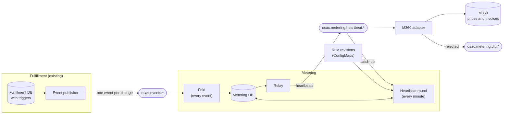

# Metering on the OSAC event log

## Summary

Fulfillment already publishes every change to a billable resource as an event on the tenant's Kafka topic.
Metering reads those topics directly and turns them into usage:

- **Billing rules are data.** Versioned ConfigMaps say when each resource bills, for example "a VM bills while it is
  RUNNING". There are no hard-coded state machines.
- **Metering sends differences.** Every minute it compares what should have been billed with what it already sent,
  and sends the difference, positive or negative. M360 adds the differences up and applies prices.
- **Everything can be rebuilt from Kafka.** Losing or restoring the metering database never bills usage twice and
  never loses any.

See the [PRD](prd.md) for the requirements.

## Motivation

Today's metering has three problems:

- **Two sources of truth.** A Watch consumer and a periodic List reconciler both write meter state, so they race and
  issue conflicting corrections.
- **Hard-coded transitions.** Billing behavior lives in per-resource state-transition tables in code, so every rule
  change is a code change.
- **Double billing after a restore.** M360 is append-only and drops only a heartbeat whose ID it has already seen.
  A database restored from a backup doesn't know which heartbeats were sent after the backup was taken, so it sends
  that time again under new IDs, and M360 bills it twice.

### Goals

- Use fulfillment's event topics as the single source of truth for billing.
- Express billing behavior as versioned data, interpreted by one generic piece of code.
- Let each CSP configure billing without code changes: meter rules (through revisions), the retention period, and
  the heartbeat interval.
- Produce the same usage from the same events every time: across restarts, upgrades, and database restores.
- Never bill usage twice and never lose any, even if the metering database is lost.
- Keep today's meters and their dimensions, and cover every metered resource type in one pipeline, including bare
  metal, storage, and networking. This design supersedes OSAC-2506, OSAC-3141, and OSAC-3145.

### Non-Goals

- Pricing, invoices, quotas, and user-facing usage views. M360 owns pricing; this pipeline only produces usage.
- MaaS, which stays metered as it is today, separately from this pipeline.
- Migrating existing deployments. This is greenfield: nothing old is migrated, and the previous pipeline is removed.
- Vendor-fed bandwidth metering.

### Behavior changes

Compared with today's metering and the superseded designs:

- A cluster's control plane bills its installation time (PROGRESSING) only once the cluster reaches READY; a cluster
  that fails or is deleted first bills nothing for it. Today it bills from the first PROGRESSING.
- A cluster's worker nodes bill as the VMs or bare-metal hosts they are, instead of through the cluster's worker
  meters (today, one per node set, multiplied by its node count). They bill like any VM or host, including while
  the cluster installs.
- With the default rules, allocation meters (bare-metal allocation, volumes, external IPs, NAT gateways) bill until
  the object is physically deleted. OSAC-3141 and OSAC-3145 stopped volumes, external IPs, and NAT gateways at the
  deletion request.
- Usage is sent as interval differences, positive or negative, instead of cumulative heartbeats plus separate
  correction events.
- Each tenant has its own event, heartbeat, and dead-letter topics, kept for the retention period (see Topics).
  Today's shared topics keep records for 30 to 90 days.
- A run shorter than one second is not billed (PRD CAP-4). Today's volume meter bills sub-second runs.

## Proposal

### Big picture



| Who | When | What it does |
|---|---|---|
| Fulfillment | Every write | Triggers check the write; the publisher sends a snapshot to the tenant's event topic. |
| Fold | Every event | Adds a history row for every changed fact; facts it already has change nothing. |
| Heartbeat round | Every minute, per tenant | Catches up, computes what should be billed, and writes the difference. |
| Relay | Continuously | Sends the heartbeats a round wrote to the tenant's heartbeat topic. |
| M360 adapter | Continuously | Forwards heartbeats to M360; moves rejected ones to the tenant's dead-letter topic. |
| M360 | On receipt | Drops repeated heartbeat IDs, applies prices, and invoices. |

### Key ideas

1. **The event log is the only source.** Every billable change in fulfillment becomes an event on the tenant's
   topic, in order. Metering never asks fulfillment for current state.
2. **Rules are versioned data.** A meter definition says which states bill, the unit and multiplier, and the
   dimensions to send. Rules change by adding a revision that takes effect at a future time, so past usage is always
   computed with the rules it was billed under.
3. **Send differences, not totals.** Metering keeps a ledger of what it already sent. Each round sends
   `should − already`, so a late event or a correction is just another difference. Both sides can be rebuilt from
   Kafka: "should" from the event topic, "already" from the heartbeat topic.

### Example

A VM, with one-minute rounds:

| Time | What happens | The round sends |
|---|---|---|
| 10:00:00 | VM created, STARTING | |
| 10:00:40 | VM is RUNNING | |
| 10:01:00 | Round | +20 s for 10:00:40–10:01:00 |
| 10:02:00 | Round | +60 s for 10:01:00–10:02:00 |
| 10:02:30 | VM stops, but the update reaches fulfillment late, at 10:03:10 | |
| 10:03:00 | Round; the stop isn't known yet | +60 s for 10:02:00–10:03:00 |
| 10:04:00 | Round; the stop is known now | −30 s for 10:02:30–10:03:00 |

The total is 110 s, exactly 10:00:40 to 10:02:30. Nothing was replaced: the late event simply produced a correction.

### API Extensions

No new user-facing API or UI. Metering reads fulfillment's private protobuf events. Protobuf field meanings never
change, and CI checks wire compatibility.

### Implementation Details/Notes/Constraints

#### Topics

Each tenant has three topics, created together by tenant onboarding (OSAC-983 defines how):

| Topic | Written by | Read by |
|---|---|---|
| `osac.events.<tenant>` | Fulfillment's event publisher | Metering |
| `osac.metering.heartbeat.<tenant>` | Metering | The M360 adapter, and metering itself to catch up |
| `osac.metering.dlq.<tenant>` | The M360 adapter | Operators |

All three have one partition and are never compacted. They keep records for the **retention period**: indefinitely by
default, and configurable per installation. Metering rebuilds its database from these topics (see Recovery), so the
retention period also limits recovery: restoring a backup needs every record written after the backup was taken, and
rebuilding an empty database needs every record. A future retention job will move records older than the retention
period to cold storage, where recovery can still read them by offset. A tenant's topics may be deleted only after its
final invoice; metering then stops the tenant and deletes its rows.

Metering and the adapter discover tenants by listing topics, start a new tenant at offset 0, and never create topics.

#### Meter definitions

A meter definition says, for one resource type:

- the meter and component names, and the unit. A unit never changes; a different unit needs a new meter name.
- when the resource is billable (`billable_when`): a set of states, plus optional conditions on fields that are
  fixed at creation.
- the multiplier (for example, a volume's size) and the dimensions to send.

Every meter also sends these dimensions: `deployment` (an ID configured per installation that never changes),
tenant, project, catalog, template, and meter type.

**`once`.** Some time should be billed only if the resource eventually became usable. `once: <states>` means: after
creation, and after any non-billable state, bill nothing until the resource reaches one of those states; when it
does, also bill the time since then. A cluster with `once: READY` bills its installation time once it is ready, and
nothing if the installation fails.

**Default meters.** FAILED is never billable. A CSP can change any of this with its own revisions (see Rule
revisions).

| Resource | Meter (unit) | Bills while | `once` | Resource dimensions |
|---|---|---|---|---|
| ComputeInstance | `compute` (second) | RUNNING | | instance type, image, boot disk size |
| Cluster | `control_plane` (second) | PROGRESSING, READY | READY | template, version |
| BareMetalInstance | `allocation` (second) | STARTING, RUNNING, STOPPING, STOPPED, DELETING | STARTING, RUNNING | instance type |
| BareMetalInstance | `consumption` (second) | RUNNING | | instance type |
| Volume | `capacity` (gibibyte_second) | AVAILABLE, DELETING | AVAILABLE | storage tier |
| ExternalIP | `allocation` (second) | ALLOCATED, DELETING | ALLOCATED | pool, IP family, attribution, attached |
| NATGateway | `allocation` (second) | READY, DELETING | READY | virtual network, external IP |

- Volume capacity multiplies by the volume's provisioned GiB.
- Allocation meters bill through DELETING until physical deletion; compute and cluster meters stop when the resource
  leaves its active states. A CSP that wants billing to stop when deletion starts can make DELETING non-billable.
- The instance type is the one actually running, after any required restart.
- Only block volumes with a vendor volume ID are billed. A volume's size can't change after creation.

**No double billing.** Each physical resource bills itself, through its own meters. A cluster's worker nodes are
ordinary VMs or bare-metal hosts, so they bill as VMs or hosts, and the cluster bills only its control plane.
Nothing is billed twice, and metering never needs to know which resource belongs to which. The total is the same as
billing workers through the cluster, as long as the CSP prices a worker node like any other VM or host. If a CSP
wants cluster workers priced or reported separately, the alternative is to bill them through the cluster: every
resource created for another records its owner at creation, and the default rules exclude owned resources from
their own meters.

**Counting time.** Durations are exact, to the microsecond. A run, a span during which a meter is continuously
billable, that lasts less than one second is not billed (CAP-4). Usage is split wherever the state, a dimension, or
the rules change, and at every UTC midnight: M360 dates each heartbeat by a single timestamp, so a piece crossing
midnight at month end would otherwise fall entirely into one month. Nothing bills after a resource's deletion, even
if a different clock stamped a later state.

**Fields a rule can use.** Each resource type's tracked fields are defined once, as annotations on its protobuf
fields: which fields are tracked, of which kind, and which field holds each changing field's change time. Both
metering's fold and fulfillment's triggers (see Source contract) take their list from these annotations, so the two
can't drift apart. Tracked fields come in three kinds:

- **Changing fields** report when they changed: the state, a VM's instance type, a cluster's version, and an
  external IP's attachment and attribution.
- **Fields known at creation** never change, such as the image, template, or storage tier.
- **Fields set once, later** start empty and are set once, then never change, such as a volume's size and vendor
  ID. Their value is treated as known from creation. That is safe because rules use them only while the resource
  is billable, and they are set by then.

#### Rule revisions

Rules change by adding a revision, never by editing one. A revision is a ConfigMap, `osac-metering-rules-<NNNN>`,
holding the complete meter definitions and the time it takes effect (`effective_at`). From that time on, it replaces
the previous revision; usage before it is still computed with the previous one. For example, if revision 0001 bills
VMs while RUNNING, and revision 0002, effective January 1, also bills PAUSED, then December's usage follows 0001 and
January's follows 0002.

A revision looks like this (illustrative; other meters omitted):

```yaml
apiVersion: v1
kind: ConfigMap
metadata:
  name: osac-metering-rules-0002
immutable: true
data:
  effective_at: "2027-01-01T00:00:00Z"
  meters.yaml: |
    - resource: ComputeInstance
      meter: compute
      unit: second
      billable_when:
        states: [RUNNING, PAUSED]
      dimensions: [instance_type, image, boot_disk_size_gib]
    - resource: Volume
      meter: capacity
      unit: gibibyte_second
      billable_when:
        states: [AVAILABLE, DELETING]
        once: [AVAILABLE]
        fields: { protocol: BLOCK, vendor_volume_id: set }
      multiplier: provisioned_size_gib
      dimensions: [storage_tier]
```

- Revisions are immutable ConfigMaps, and an admission policy blocks deleting them. Only cluster administrators can
  create them; metering only reads them.
- Metering reads revisions when it starts, so a new revision needs a metering restart before its `effective_at`.
  Metering refuses to start, with a notification, if a new revision would take effect in the past, or if a revision
  it has already used is missing.

**Changing the metering code.** Rules are meant to change; the code that folds events and evaluates rules is not. CI
replays recorded event logs to check that a new release computes the same usage for past events. If a release does
change past results, its rounds recompute history and send the differences as corrections. Reproducing past usage
exactly as it was billed then requires replaying the old events with the release that produced them. That is the
operator's responsibility and out of scope for this design. Adding a tracked field is safe: re-folding the event
topics from offset 0 fills it in for every resource and changes nothing else.

#### How metering runs

The metering service runs three loops against one PostgreSQL database:

| Loop | Runs | Reads | Writes |
|---|---|---|---|
| Fold | Continuously, as events arrive | The tenant's event topic | `history`, and the tenant's event offset |
| Round | Every interval | `history`, rules, `ledger`, heartbeat topic | `ledger`, `outbox`, last round time |
| Relay | Continuously | `outbox` | The heartbeat topic; then deletes sent rows and moves the heartbeat offset |

The loops meet only in the database. A round waits until the fold has folded all of the tenant's events, so it never
computes from half-folded facts. Pods may overlap, for example during an upgrade; each loop takes a per-tenant lock
in PostgreSQL, so each tenant's work runs one at a time. The round's lock is separate from the event offset, so the
fold keeps going while a round runs.

#### Metering database

Every table can be rebuilt from Kafka or from the revision ConfigMaps (see Recovery):

| Table | Holds | Written by | Used for | Rebuilt from |
|---|---|---|---|---|
| `history` | Facts: a resource's field, its value, and since when | Fold | Computing `should` | Event topic |
| `ledger` | Per meter: intervals sent, with multipliers | Round, catch-up | Computing `already` | Heartbeat topic |
| `outbox` | Heartbeats a round wrote, not yet on Kafka | Round; the relay deletes | Sending safely | Not needed |
| `progress` | Per tenant: event and heartbeat offsets, last round time and offset | All loops | Resuming | Topics |
| `rule_revisions` | Each revision used, with its `effective_at` | Startup | Startup checks | ConfigMaps |

- `history` has one row per resource, field, and since, for example (vm-7, state, 10:00:40) = RUNNING. Deletion is a
  row too: (vm-7, deleted, 11:05:12).
- The ledger keeps one row per stretch of unchanged multiplier, not one row per heartbeat, so it grows with changes,
  not with time.
- The outbox needs no rebuild: a ledger rebuilt from the heartbeat topic doesn't include heartbeats that were never
  sent, so the next round computes and sends them again.

A meter is one series of usage: one resource, one meter definition and component, and one set of dimension values.
A VM whose instance type changes therefore has two `compute` meters, one per type.

#### The fold

The fold is the only code that reads events. Every snapshot already states, for each tracked field, its value and
since when. A field has a since once it is known: a changing field from its change time, and a fixed field from the
resource's creation, once it is set. The fold copies those facts into `history`:

```
fold(event):                                         # one PostgreSQL transaction per event
  for each tracked field of the snapshot that has a since:
    write history(resource, field, since) = value    # already there? then nothing changes
  if the event is a deletion:
    write history(resource, deleted, since = the event's timestamp)
  progress[tenant].event_offset = event.offset + 1   # only moves forward
```

**One new row for every changed fact.** A row is added only when the event carries a fact `history` doesn't have
yet: a state change, a changed field, a set-once field getting its value, or a deletion. The rest of the event
restates facts already recorded, and writing them again changes nothing. Most events, such as status conditions,
messages, or URL updates, add no rows at all, so `history` grows with billing changes, not with events: a VM that
receives 200 events over its life typically has about six rows. Each row also keeps the event offset that wrote it,
so a round can find the facts added since the previous round. Events of types metering doesn't track only advance
the offset.

**Order doesn't matter.** The fold never compares an event with what it stored before; it only adds facts. Its
result is the set of all facts in all events, and the source contract (see below) guarantees that each history row
has exactly one possible value. So applying an event twice, replaying from any offset, or applying events in a
different order produces the same `history`. That is why the fold needs no event IDs, no versions, and no special
case for a resource's first event.

Example: a VM that is resized and later deleted, and the history rows its events add:

| Event | The snapshot says | New history rows |
|---|---|---|
| v1 | Created at 10:00:00, STARTING, type small | (state, 10:00:00) = STARTING; (type, 10:00:00) = small |
| v2 | RUNNING since 10:00:40, type small since 10:00:00 | (state, 10:00:40) = RUNNING |
| v2 | (the same event, delivered again) | None |
| v3 | RUNNING since 10:00:40, type large since 10:30:00 | (type, 10:30:00) = large |
| v4 | STOPPED since 11:00:00, type large since 10:30:00 | (state, 11:00:00) = STOPPED |
| v5 | Deleted; the event's timestamp is 11:05:12 | (deleted, 11:05:12) |

Each snapshot restates the facts that are still current, such as type small since 10:00:00 in v2; writing them again
changes nothing. With the default rules, this VM's compute usage is 10:00:40 to 11:00:00: 29 min 20 s on its
type-small meter and 30 min on its type-large meter.

The times come from the snapshots, so usage reflects when things happened, not when metering learned about them.
Neither the fold nor the round's calculation reads a clock, another tenant's data, or anything besides the events,
the rules, and metering's own tables; the round's time is an input. The same events and rules therefore always
produce the same usage, whether applied in one pass, across restarts, or after a restore.

#### Heartbeat rounds

A round runs for each tenant every interval (one minute by default, configurable), in one PostgreSQL transaction:

```
round(tenant, roundTime):                      # roundTime = 10:01:00, 10:02:00, ... on PostgreSQL's clock
  lock the tenant's round                      # overlapping pods take turns; one round per round time commits
  catchUp(tenant)                              # see Recovery; normally finds nothing
  if catch-up isn't finished, or the tenant's events aren't all folded yet:
    stop                                       # try again next round
  for each meter in should or in the ledger:   # only those that can have changed (see below)
    should  = usage(meter, upTo = roundTime)   # computed from history and the rules; never stored
    already = ledger[meter]                    # stored in PostgreSQL
    for each piece where should and already differ:
      add a heartbeat to the outbox            # quantity = (should − already) multiplier × piece duration
    ledger[meter] = should
  progress[tenant].last_round = (roundTime, the event offset folded)
```

`should` is computed from `history`. `already` is the ledger, stored in PostgreSQL, so a crash loses nothing: a round
commits its ledger and its heartbeats together, or neither. After a database restore, catch-up brings the ledger up
to date before anything is compared.

A round visits meters in the ledger too, because a late event can remove a meter entirely. Example: VM-7 runs as type
small; the operator reports a resize to large at 10:30, and the next three rounds send +60 s each on the large meter.
A late event then shows the VM had stopped at 10:29:30, so the large meter has no usage at all. The 10:34 round sends
−30 s on the small meter and −180 s on the large one, priced as large, so the charge cancels exactly.

**What a round computes.** Only three kinds of meter can change between two rounds, and a round computes only these:

- **Meters billable at the previous round,** because time has passed. Each needs just the latest interval, from the
  resource's current values, and its ledger row's end moves forward. They are the ledger rows that end at the
  previous round's time.
- **Meters of resources with new facts:** rows written after the event offset the previous round used, or dated
  after the previous round, because a writer's clock can run slightly ahead. Each such resource is recomputed from
  its own few rows.
- **Meters of resource types a new revision affects,** once, in the round where the revision takes effect.

Nothing else can change: a closed meter with no new facts gives the same answer as last time. So a round's work is
proportional to the heartbeats it sends, not to the size of `history`. In a typical round, each meter that is still
billable gets one heartbeat, for the latest interval, and other meters get none.

The round's time comes from PostgreSQL's clock, so all pods agree on it, and each round's time is later than the
previous one. A shorter interval keeps running totals fresher; a longer one sends fewer heartbeats, and each
heartbeat is a rated transaction in M360.

**The relay.** A database transaction and a Kafka write can't commit together. So a round doesn't send heartbeats
itself: it writes them to the outbox in the same transaction as the ledger, and the database stays consistent
whatever crashes. The relay, a separate loop, sends outbox rows to the tenant's heartbeat topic in order, waits for
Kafka to confirm, then deletes them and moves the tenant's heartbeat offset. If it crashes after sending and before
deleting, it sends them again with the same IDs, and M360 drops the copies.

#### Heartbeats

A heartbeat is one CloudEvent (`osac.resource.heartbeat.v1`) on the tenant's heartbeat topic, using the existing
`schema.Usage` shape. For the VM in the Example above, the 10:02 round sends (field names illustrative):

```json
{
  "id": "4c1f9a7e…",
  "type": "osac.resource.heartbeat.v1",
  "time": "2026-10-05T10:01:00Z",
  "data": {
    "tenant_id": "acme",
    "resource_type": "ComputeInstance",
    "resource_id": "vm-7",
    "meter": "compute",
    "component": "compute",
    "billing_dimensions": { "deployment": "us-east", "project": "web", "instance_type": "small" },
    "usage": {
      "semantics": "interval",
      "from": "2026-10-05T10:01:00Z",
      "to": "2026-10-05T10:02:00Z",
      "quantity": "60.000000",
      "unit": "second",
      "precision": "microsecond"
    },
    "heartbeat_time": "2026-10-05T10:02:00Z",
    "last_applied_offset": 41,
    "rules_revision": "0001"
  }
}
```

- `from` is inclusive and `to` exclusive, in UTC. The CloudEvent `time` is `from`.
- `quantity` is exact fixed-point text in the meter's unit. A correction has the same shape with a negative
  quantity: the 10:04 round of the Example sends `-30.000000` for 10:02:30–10:03:00.
- `heartbeat_time` is the round time. With `last_applied_offset` and `rules_revision`, it traces the heartbeat to
  the events and rules that produced it.
- The `id` is a hash of tenant, resource, meter, component, dimensions, `from`, `to`, and round time. It names which
  piece of usage this is (what and when), and those fields are already unique. It leaves out the quantity, so a
  resent heartbeat keeps its ID even if a later release formats the number differently. Different rounds never
  share an ID, because their round times differ; if a round is sent twice, M360 drops the copies.
- Consumers add heartbeats up; they never replace one.

#### Delivery to M360

The M360 adapter reads every tenant's heartbeat topic and forwards each heartbeat with its ID; M360 drops IDs it has
already seen. If M360 rejects a heartbeat, the adapter moves it to the tenant's dead-letter topic (DLQ) and keeps
going. The DLQ is mandatory: the adapter refuses to start without one.

A notification stays on while a tenant's DLQ has unhandled records; the handled position is a consumer-group offset.
Once the cause is fixed, an operator replays them:

1. Stop the adapter.
2. Reset its position on the tenant's heartbeat topic to the earliest unhandled record's original offset.
3. Mark the DLQ handled up to its end.
4. Restart the adapter. M360 drops the heartbeats it already has.

#### Recovery

After a database restore, metering's tables are behind Kafka. The fold catches up on its own: it resumes reading the
event topic at the tenant's event offset, and re-applying events it had already folded changes nothing. The ledger
is brought up to date by catch-up, which every round runs first:

```
catchUp(tenant):
  start = progress[tenant].last_round.time
  read the heartbeat topic from progress[tenant].heartbeat_offset, a bounded number of whole rounds at a time:
    skip a heartbeat whose round time is not after start, or whose ID was already read in this catch-up
    add its multiplier, quantity ÷ (to − from), to ledger[its meter] over [from, to)
  move the heartbeat offset past what was read
  set last_round to the time and event offset of the last round read   # every heartbeat carries both
```

Normally catch-up finds nothing, because the relay has already moved the heartbeat offset past every heartbeat it
sent. After a restore, it finds the heartbeats sent after the backup was taken.

Example: a backup records a running VM as billed until 10:02. Heartbeats for 10:02–10:05 were sent before the
database was lost, and the backup is restored at 10:10. Without catch-up, the 10:11 round would send 10:02–10:11, and
M360 would bill 10:02–10:05 twice. With catch-up, the round sends only 10:05–10:11.

An empty database is just an old backup: the fold replays every event from offset 0, and catch-up replays every
heartbeat. Both need the topics to still hold those records, which the retention period decides.

#### What happens when

| Situation | What happens |
|---|---|
| An event arrives late | The next round sends the correction. |
| An event is delivered twice | Re-applying it writes facts that already exist; nothing changes. |
| Metering crashes mid-event or mid-round | The transaction rolls back, and the work is redone. |
| Two metering pods run at once | Each loop locks the tenant, so the tenant's work runs one at a time. |
| The database is restored from a backup | Catch-up adds what was sent after the backup; nothing is sent twice. |
| The database is lost | It is rebuilt from the topics, starting at offset 0. |
| M360 rejects a heartbeat | It goes to the tenant's DLQ, and a notification stays on until it is replayed. |
| A new rule revision is added | It takes effect at its `effective_at`, once metering has restarted. |
| A writer re-reports a time but not a new value | Fulfillment keeps the old time (see Source contract). |
| A pod's clock and PostgreSQL's differ by over five minutes | The round is skipped, with a notification. |
| PostgreSQL's clock moves backwards | Rounds wait until it passes the last round time. |
| A revision metering has used is missing | Metering refuses to start, with a notification. |
| A captured change can't become an event | It is quarantined; the tenant's later events wait until it's republished. |
| A tenant's topics are deleted after its final invoice | Metering stops the tenant and deletes its rows. |

#### Source contract

Usage is only as accurate as the facts fulfillment reports. Database triggers in fulfillment's database enforce, for
every write to a billable resource, including direct SQL:

- **A value change comes with a later time.** A changed state needs a later `state_transition_time`, and a changed
  changing field needs a later change time (see the table below).
- **A time changes only with its value.** If a write changes a change time but not the value, the trigger keeps the
  old time. Two writers with different clocks, or an operator re-reporting a phase after a restart, would otherwise
  turn one fact into two, and a backward one would end billing early. Keeping the old time, rather than rejecting
  the write, means a timestamp never blocks a status update.
- **Fixed fields don't change.** Fields known at creation never change, and fields set once never change after they
  are set. A field is annotated as fixed only if the API already rejects changing it; otherwise the trigger would
  reject legitimate writes.
- A write that breaks these rules fails, and its transaction rolls back.

Together, these rules give every history row exactly one possible value, which is what makes the fold safe to repeat
and independent of order.

Changing fields, and when their change time is set:

| Field | Change time | Set by |
|---|---|---|
| State, on every resource | When the state changes | Whoever writes the state |
| ComputeInstance instance type | When the new type is actually running, after any required restart | The operator |
| Cluster version | When fulfillment accepts an upgrade | Fulfillment |
| ExternalIP attachment and attribution | When the IP is attached or detached | The operator |

Fulfillment also guarantees:

- **Stable IDs.** `Event.id` is the ID of the captured change, so a retried publish keeps its ID. The fold doesn't
  need it, but it keeps the contract clean: a future meter that counts occurrences would key its facts by event ID.
- **Deletion time.** Physical deletion is stamped when fulfillment deletes the row, after finalizers, and published
  as the deletion event's timestamp. The deletion request shows up earlier, as the DELETING state.
- **No gaps.** A captured change that can't be converted to an event is quarantined, with a notification. The
  publisher holds back that tenant's later events until the change is fixed and republished; it is never dropped.
- **One writer per topic.** A single, fenced publisher writes each tenant's event topic.

#### Release prerequisites

- **OSAC-983 amendment**, made in a separate PR to that design: metering reads topics directly instead of using
  Watch; `Event.id` is the stable `changes.id`, and Watch resumes from a separate cursor; topics keep records for the
  retention period; onboarding creates each tenant's three topics.
- **Topic permissions:** metering reads event topics and reads and writes heartbeat topics; the adapter reads
  heartbeat topics and writes DLQs; fulfillment can't create topics.
- **Notifications:** a notification mechanism exists (OSAC has none today). Metering, fulfillment, and the adapter
  use it for startup refusals, quarantined changes, and non-empty DLQs.
- **M360 contract test**, run against a real M360 tenant, confirming that M360:
  - rates negative quantities as negative charges;
  - prices a heartbeat at the rate in effect at its time, so a correction cancels exactly what it corrects;
  - drops a repeated heartbeat ID permanently;
  - bills a heartbeat in the UTC-day period that contains its time;
  - rejects an invalid heartbeat synchronously;
  - accepts a correction dated in an already-invoiced period and applies it on the next invoice.
- **Worker nodes on the tenant's topic:** a cluster's worker VMs and hosts belong to the cluster's tenant. Today they
  belong to the system tenant, whose topic metering doesn't read, so until they move they aren't billed at all.
- **Kubernetes 1.30 or later**, for the admission policy that protects revisions.
- **Deployment order:** fulfillment's capture changes and metering are deployed before the first tenant is onboarded.

#### Interface changes

| ID | Change | Requirements |
|---|---|---|
| IC-1 | Metering reads event snapshots from Kafka, resuming from offsets in PostgreSQL. | CAP-14, CAP-15, CAP-16 |
| IC-2 | Versioned, immutable rule revisions and a deterministic fold. | CAP-2, CAP-5, CAP-6, CAP-11, CAP-12, CAP-17 |
| IC-3 | Per-tenant v1 heartbeats with positive or negative quantities. | CAP-4, CAP-11, CAP-12, CAP-15, CAP-16 |
| IC-4 | Per-tenant event, heartbeat, and DLQ topics created at onboarding, with a retention period. | CAP-7, CAP-14 |
| IC-5 | Change times for the fields in the Source contract table. | CAP-11, CAP-12 |

## Test Plan

Every test checks the same expected result: once the system settles, each tenant's heartbeats add up to the usage the
rules give over its full event log, and no heartbeat ID is billed twice. After any DLQ replay, M360 holds exactly the
heartbeats metering sent. The companion test plan lists the cases.

Unit and integration tests, against real PostgreSQL and Kafka, gate every merge:

- **Determinism and idempotency:** folding a recorded event log in one pass, with restarts at random points, with
  every event delivered twice, or in shuffled order, gives the same `history`.
- **Past results:** a new release computes the same usage as the previous release for recorded event logs.
- **Meters:** every state transition of every meter, including deletion during provisioning, deletion after a
  failure, and a cluster that fails before READY; a cluster's worker nodes bill only as VMs or hosts; a late event
  that removes a meter sends its full negative correction.
- **Revisions:** shipped revisions parse, use only supported fields, and never change; a revision first loaded after
  its `effective_at` makes metering refuse to start.
- **Recovery:** a restore that misses many rounds, or a rebuild into an empty database, re-sends nothing; two pods
  catching up at once apply each heartbeat once; a long backlog is applied in bounded steps.
- **Durations:** a run from 10:00:00.2 to 10:00:02.8 bills exactly 2.6 s; a dimension change at 10:00:01.5 splits
  it into 1.3 s and 1.3 s; a run under one second bills nothing; a piece crossing midnight splits in two.
- **Source contract:** the triggers reject a value change without a later time and any change to a fixed field, and
  keep the old time when only the time changes.

The M360 contract test checks the M360 prerequisites against a real M360 tenant.

End-to-end chaos tests run on a deployed hub: kill metering at random points; run two pods through rolling upgrades;
restore database backups minutes and hours old, and rebuild from an empty database; restart Kafka brokers and cut
the network; delay controller updates for hours; jump the pod's and the database's clocks forward and back; take M360
down, and make it reject a heartbeat, then fix the cause and replay the DLQ.

Graduation: the chaos suite passes repeatedly with zero billing difference, and the M360 contract test passes.

---

## Provenance

Authored: draft @ design 0.11.3 - 9b25062, workspace feat/osac-4500-quota-foundation @ 2b2a641db
Final: revise @ design 0.11.3 - 9b25062, workspace feat/osac-4500-quota-foundation @ f2afb1b17

> Context changed between draft and revise.

<!-- ai-workflow-provenance:{"schema_version":1,"provenance_kind":"session","workflow":"design","workflow_version":"0.11.3","ai_workflows":"9b25062","source_repo":"f2afb1b17","source_repo_branch":"feat/osac-4500-quota-foundation","commits_behind_main":0,"commits_ahead_main":6,"main_ref":"main","phases":["draft","manual-edit","revise","revise"],"authoring_modes":["manual","skill"],"context_changed":true,"origin_untracked":false} -->
