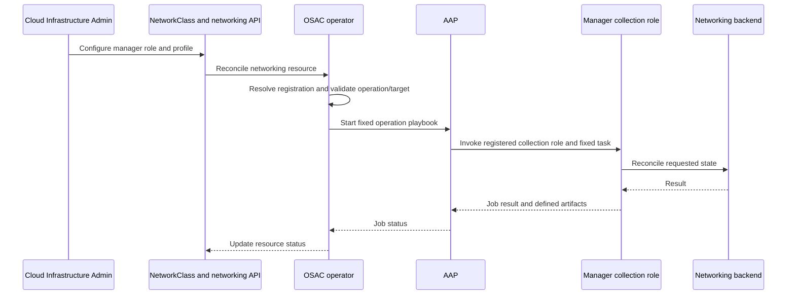

# OSAC Network Manager Integration Contract

| Field       | Value |
|-------------|-------|
| Author(s)   | Dan Manor (dmanor@redhat.com) |
| Jira        | https://redhat.atlassian.net/browse/OSAC-5928 |
| PRD         | [Network Manager Integration Contract PRD](prd.md) |
| Date        | 2026-10-04 |

# 1. Overview

This design defines the integration contract for Fabric Manager and K8s Manager implementations used by OSAC networking. The contract is independent of implementation source: OSAC-distributed implementations such as Netris and Agentless VLAN, and implementations built or maintained by other parties, use the same registration, operation, Ansible Automation Platform (AAP), and status boundaries. See the [Network Manager Integration Contract PRD](prd.md) for product requirements and the [Unified Networking Design](/enhancements/OSAC-1433-unified-networking/design.md) for how OSAC selects and orchestrates the roles.

A conforming implementation registers one manager role, implements every operation and workload-target combination assigned to that role in the selected profile, and provides the corresponding AAP collection role entry points. Once OSAC implements and enforces this versioned contract, another implementation can be added through configuration and AAP content without supplier-specific changes to OSAC APIs or dispatch code. The contract's operation vocabulary is fixed; adding a new OSAC resource operation requires an OSAC change.

# 2. Goals and Non-Goals

## 2.1 Goals

- Define the Fabric Manager and K8s Manager boundaries and the shared registration format.
- Define the operation identifiers, AAP role entry points, inputs, outputs, and lifecycle behavior an implementation must provide.
- Require each implementation to provide the complete operation and workload-target set assigned to its role in the selected profile; reject incompatible profiles and unavailable work before an AAP job starts.
- Permit implementations from any source to integrate through the same stable interface.

## 2.2 Non-Goals

- Change tenant-facing networking resources or their semantics; those are defined by the unified networking PRD and design.
- Specify backend-specific mappings to Netris, Cumulus, OVN-Kubernetes, or another networking product.
- Allow an implementation to add new OSAC resource kinds, operation identifiers, dispatch rules, or tenant API fields.

# 3. Motivation / Background

OSAC discovers Fabric and K8s managers from ConfigMaps and dispatches provisioning to AAP. AAP selects a collection role using the implementation strategy associated with the resource. The current registration parser reads the manager name, description, and broad capabilities, but does not declare a contract version or implementation reference. Contract v1 obtains the required operations and targets from the fixed role-dispatch matrix, not per-manager registration data. The move-network-attachment and DHCP-lease playbooks also default a missing implementation strategy to Netris; contract v1 removes that product-specific default and requires the selected implementation to be explicit. The detailed manager obligations currently sit inside the unified networking design alongside OSAC's own profile-selection and dispatch flow. [Codebase: osac-operator/pkg/networkmanager/types.go; osac-operator/pkg/dispatcher/dispatch.go; osac-aap/playbook_osac_create_virtual_network.yml]

That arrangement makes it hard to tell which requirements belong to OSAC and which belong to each manager implementation. A per-manager operation list would let implementations opt out of work already assigned to their role and duplicate the contract in each registration. This document is the normative implementation contract. The unified networking design describes OSAC's integration flow and links here for the complete manager obligations. [User]

# 4. Design

## 4.1 Architecture

The provider configures a Fabric Manager and, optionally, a K8s Manager in a NetworkClass. The operator resolves each configured manager by its registered name and role. OSAC's fixed dispatch table selects the role for each resource operation and validates that the operation and workload target are available in the selected profile. OSAC passes the validated manager registration to AAP, including its implementationRef; a playbook must not default to a particular implementation when that reference is missing. AAP invokes the corresponding task in the referenced collection. The manager reconciles its backend, and OSAC records job and resource status.



The diagram shows the stable integration boundary: NetworkClass chooses a registered role, OSAC validates and dispatches a fixed operation, and the implementation owns only its backend reconciliation. Managers do not implement an in-process Go interface; the shared AAP provider and the collection role entry points form the integration surface. [Codebase: osac-operator/pkg/dispatcher/dispatch.go; osac-aap/playbook_osac_create_virtual_network.yml]

The two roles have distinct responsibilities:

- A Fabric Manager realizes physical-fabric operations such as routed network isolation, L2 segments, IPAM, ACLs, inbound translation, outbound NAT, and fabric workload-port movement.
- A K8s Manager realizes Kubernetes-native VM networking and, in a fabric-backed profile, the K8s side of a Subnet or overlay-to-fabric bridge. In a K8s-only profile it may serve the operations that the fixed dispatcher permits without a Fabric Manager.

OSAC assigns each operation to a manager role using the selected profile and fixed dispatch table. That role assignment defines the complete v1 implementation contract for the selected profile: every Fabric Manager implements every operation and target assigned to Fabric, and every K8s Manager implements every operation and target assigned to K8s in that profile. Registration does not declare an operation subset. OSAC rejects an incompatible manager/profile combination and any operation or target the selected profile does not route; it never sends that work to another manager. If a registered collection lacks a required task, the AAP job fails; that is implementation nonconformance, not an unsupported-operation response.

## 4.2 Data Model / Schema Changes

Each implementation installs a ConfigMap in the OSAC operator namespace. Its role label determines whether it is a Fabric Manager or K8s Manager. The ConfigMap name follows the existing chart convention: osac-network-fabric-manager-<name> or osac-network-k8s-manager-<name>, with underscores in the name normalized to hyphens. The data.name value is the logical identifier selected by NetworkClass. implementationRef independently identifies the fully qualified collection role invoked by AAP.

Version 1 requires `name`, `implementationRef`, `contractVersion`, and `capabilities`. `description` is optional. `name` must be unique within its manager role and is the logical identifier selected by NetworkClass. `implementationRef` is a fully qualified Ansible collection role name with the form `namespace.collection.role`; it is independent of `data.name` and may refer to any collection installed in the AAP execution environment. `contractVersion` must be `v1`. Contract v1 recognizes the address-family values `ipv4`, `ipv6`, and `dualStack`, the integration values `evpn-vxlan` and `primarySubnet`, and the hardware value `dpuSupport`. The currently supported address-family profile requires `ipv4` and does not support IPv6 or dual-stack. Capabilities describe technical compatibility; they never declare resource operations or allow a manager to omit operations assigned by the selected profile.

A Fabric Manager may additionally declare `compatibleK8sManagers`, a comma-separated list of exact K8s Manager `data.name` values, and a K8s Manager may declare `compatibleFabricManagers`, a comma-separated list of exact Fabric Manager `data.name` values. These fields are optional; an absent or empty list declares no compatible peers. Names are case-sensitive, unique within each list, and contain no whitespace. For a combined profile, the selected registrations must list each other in the corresponding fields as well as declare the profile's required capabilities. Capabilities are necessary but are not sufficient to establish pair compatibility. A publisher adds a peer name only after the pair's supported collection versions pass the contract's pair integration suite; the release record identifies those versions. Each supported AAP execution environment pins the collection versions in that record. Upgrading either collection requires rerunning the pair suite before the peer declaration remains supported. OSAC validates the declarations and mutual match at selection time, while the Enclave UI discovers and filters choices from the registration inventory. OSAC does not execute or independently verify the pair test at runtime; the peer declaration is the publisher's assertion that the recorded test gate passed. No product names or compatible-pair list are compiled into OSAC or the UI.

The manager registration does not contain an operation or target list. Contract v1 defines the complete operation and target set assigned to each role by the selected profile; a conforming implementation provides every required AAP task and target combination in that profile. The operation table and fixed profile dispatch rules are the source of truth and apply uniformly to every implementation.

```yaml
apiVersion: v1
kind: ConfigMap
metadata:
  name: osac-network-fabric-manager-fabric-example
  namespace: osac
  labels:
    osac.openshift.io/network-fabric-manager: "true"
data:
  name: fabric_example
  implementationRef: acme.networking.fabric_manager
  description: "Example fabric integration"
  contractVersion: "v1"
  capabilities: "ipv4,evpn-vxlan"
  compatibleK8sManagers: "k8s_example"
```

A K8s-only implementation instead declares `ipv4,primarySubnet`; the
K8s-only profile requires `primarySubnet` when no Fabric Manager is configured.
A Fabric Manager that has no combined-profile peer omits
`compatibleK8sManagers` or supplies an empty value.

A K8s Manager registration uses the corresponding K8s role label and chart
name; its required data fields are identical:

```yaml
apiVersion: v1
kind: ConfigMap
metadata:
  name: osac-network-k8s-manager-k8s-example
  namespace: osac
  labels:
    osac.openshift.io/network-k8s-manager: "true"
data:
  name: k8s_example
  implementationRef: acme.networking.k8s_manager
  description: "Example Kubernetes networking integration"
  contractVersion: "v1"
  capabilities: "ipv4,evpn-vxlan"
  compatibleFabricManagers: "fabric_example"
```

The recognized labels are osac.openshift.io/network-fabric-manager and osac.openshift.io/network-k8s-manager. The target vocabulary is compute_instance, cluster, and baremetal_instance; targets are part of operation inputs and fixed dispatch rules, not registration fields. Unknown labels, versions, or capabilities, malformed implementationRef values, empty required fields, duplicate names within one role, and malformed or duplicate peer names make a registration invalid. A syntactically valid peer name may be registered before that peer is installed; the pair is not selectable until both registrations exist and mutually name one another. The operator reports the ConfigMap and invalid field or missing pair in its diagnostic.

Contract v1 recognizes three selectable profiles. The operator derives the profile from the managers selected in NetworkClass and their technical capabilities; a registration never lists operations or targets.

| Profile | Required manager registrations | Complete role assignment |
|---|---|---|
| Fabric-only IPv4 | Fabric Manager declares ipv4; no K8s Manager is selected | Fabric Manager implements every Fabric operation in §4.3. SecurityGroup and ExternalIPAttachment targets are cluster and baremetal_instance. Workload attachment moves and DHCP lease queries target baremetal_instance only; CaaS physical workers use the same BaremetalInstance path through BMaaS. ComputeInstance is unavailable because this profile has no K8s network integration. |
| Fabric-backed EVPN | Fabric and K8s Managers both declare `ipv4` and `evpn-vxlan`, and each registration's peer list names the other's exact logical name | Fabric Manager implements every Fabric operation in §4.3. K8s Manager implements `subnet.create` and `subnet.delete`. SecurityGroup and ExternalIPAttachment targets are compute_instance, cluster, and baremetal_instance. Workload attachment moves and DHCP lease queries target baremetal_instance only; CaaS physical workers use the same BaremetalInstance path through BMaaS. |
| K8s-only IPv4 | K8s Manager declares ipv4 and primarySubnet; no Fabric Manager is selected | K8s Manager implements the complete fallback set in §4.3: VirtualNetwork, Subnet, SecurityGroup, ExternalIPPool, ExternalIP, and ExternalIPAttachment. SecurityGroup and ExternalIPAttachment target compute_instance only. NATGateway, workload attachment moves, and Fabric DHCP lease queries are unavailable. |

These are the only manager combinations selectable under contract v1. The `evpn-vxlan` capability is required on both managers in the combined profile, but it does not prove that their implementations interoperate. A combined profile is selectable only when both registrations mutually name each other and the pair has passed its release-specific integration test. The pair test validates the shared handoff and end-to-end behavior. The `primarySubnet` capability selects the K8s-only fallback. Any combination that does not match one of these profiles is rejected before AAP dispatch. A passing pair test certifies only the tested manager and collection versions; it does not make every K8s Manager compatible with every Fabric Manager.

The existing operator parser and Helm template do not yet read or render implementationRef or contractVersion. Implementing those fields and registration validation is part of the OSAC contract-enforcement work; the ConfigMap above describes the target interface, not a claim about current runtime support. [Codebase: osac-operator/pkg/networkmanager/types.go; osac-operator/charts/operator/templates/network-managers.yaml]

## 4.3 API Changes

No tenant-facing gRPC, REST, CRD, or resource-schema changes are required. The implementation-facing changes are the registration fields above, a common AAP job payload, fixed task entry points, and the operation result contract below.

List, Get, and other API reads are served by OSAC and are not dispatched to a manager. The operation identifiers below cover backend provisioning only.

Every AAP invocation receives the same osac_job_vars envelope:

```yaml
osac_job_vars:
  operation: external_ip_attachment.create
  manager:
    name: example
    role: fabric
    implementationRef: acme.networking.fabric_manager
    contractVersion: v1
  resource:
    apiVersion: osac.openshift.io/v1alpha1
    kind: ExternalIPAttachment
    metadata: {}
    spec: {}
  context: {}
```

operation is the canonical operation identifier from the table. manager is resolved from the selected role's validated registration. resource is the full Kubernetes resource object, including metadata and spec. The generic AAP playbook invokes manager.implementationRef and uses the fixed tasks_from name in the table. The referenced collection must be installed in the AAP execution environment. Manager credentials are supplied through provider-managed AAP credentials or Secrets; credentials must not be placed in the registration ConfigMap or resource payload. AAP playbooks must not substitute a default implementation.
Ansible supports dynamically included roles by variable and the `tasks_from` selector; implementationRef uses a fully qualified collection role name. See [Ansible Core include_role documentation](https://docs.ansible.com/projects/ansible-core/2.17/collections/ansible/builtin/include_role_module.html) and [using collection roles by FQCN](https://docs.ansible.com/projects/ansible/latest/collections_guide/collections_using_playbooks.html). [Research: §1]

The operation input examples below show only the fields nested under
`osac_job_vars.context`; each invocation also receives the full envelope above.
For `subnetRef`, OSAC's canonical value is the Subnet namespace and name joined
by `/`. Managers compare that exact reference with the requested attachment.

| Operation identifier | Assigned role | AAP playbook and collection task | Required input | Required behavior and result |
|----------------------|---------------|----------------------------------|---------------|------------------------------|
| virtual_network.create / virtual_network.delete | Fabric; K8s fallback only in a K8s-only profile | playbook_osac_create_virtual_network / create_virtual_network; playbook_osac_delete_virtual_network / delete_virtual_network | VirtualNetwork metadata.uid; spec.region, spec.ipv4Cidr, spec.networkClass | Create or remove the isolated routing domain and associated allocation. A K8s fallback may create a logical grouping. Different VirtualNetworks remain isolated. |
| subnet.create / subnet.delete | Fabric and configured K8s role; K8s-only profile uses K8s fallback | playbook_osac_create_subnet / create_subnet; playbook_osac_delete_subnet / delete_subnet | Subnet metadata.uid; spec.virtualNetwork parent reference; spec.ipv4Cidr; in Fabric-backed EVPN, context.fabricHandoffConfigMap on both create and delete | Create or remove the L2 segment and the K8s network resources assigned to that role. In Fabric-backed EVPN, Fabric writes the standard handoff ConfigMap and the K8s Manager reads it. The Subnet CIDR belongs to its VirtualNetwork and does not overlap a sibling Subnet. |
| security_group.apply / security_group.delete | Fabric; K8s fallback only in a K8s-only profile | playbook_osac_create_security_group / create_security_group; playbook_osac_delete_security_group / delete_security_group | SecurityGroup metadata.uid; spec.virtualNetwork; spec.ingressRules and spec.egressRules; context.securityGroup.subnetCidrs and context.securityGroup.attachments | Enforce the OSAC SecurityGroup semantics: default deny; each matching IPv4 rule permits traffic, with ingress matching source CIDRs and egress matching destination CIDRs; TCP/UDP port ranges are matched only for those protocols, and ICMP/ALL ignore ports. Preserve the supplied rule order. Automatically allow return traffic for established connections. Apply policy to every attached endpoint, including same-Subnet and routed traffic; updates remove obsolete rules, and delete removes only rules owned by this SecurityGroup. |
| external_ip_pool.create / external_ip_pool.delete | Fabric; K8s fallback only in a K8s-only profile | playbook_osac_create_external_ip_pool / create_external_ip_pool; playbook_osac_delete_external_ip_pool / delete_external_ip_pool | ExternalIPPool metadata.uid; spec.cidrs contains exactly one canonical IPv4 CIDR; spec.ipFamily is IPv4 | Register or remove the backend allocation pool. OSAC owns API capacity counters. |
| external_ip.allocate / external_ip.release | Fabric; K8s fallback only in a K8s-only profile | playbook_osac_create_external_ip / create_external_ip; playbook_osac_delete_external_ip / delete_external_ip | ExternalIP metadata.uid; spec.pool; resolved pool UID and canonical IPv4 CIDR in `context.externalIPPool` | Allocate or release one address from the selected pool and return it through `osac_result`; OSAC owns API status and annotations. |
| external_ip_attachment.create / external_ip_attachment.delete | Fabric; K8s fallback only in a K8s-only profile | playbook_osac_attach_external_ip / attach_external_ip; playbook_osac_detach_external_ip / detach_external_ip | ExternalIPAttachment metadata.uid; spec.externalIP; target resource reference; spec.targetEndpoint for Cluster API or Ingress endpoints; resolved target kind, UID, and primary address in `context.target` | Create or remove inbound translation for a target allowed by the selected profile and fixed dispatch rules. Remove the attachment before its ExternalIP is released. |
| nat_gateway.create / nat_gateway.delete | Fabric only; no K8s fallback | playbook_osac_create_nat_gateway / create_nat_gateway; playbook_osac_delete_nat_gateway / delete_nat_gateway | NATGateway metadata.uid; spec.virtualNetwork; spec.externalIP; canonical Subnet CIDRs in `context.virtualNetwork.subnetCidrs`; allocated address in `context.externalIP.address` | Create or remove outbound SNAT for the VirtualNetwork using its ExternalIP. |
| workload_attachment.move | Fabric only; BaremetalInstance target only | playbook_osac_move_network_attachment / move_network_attachment | Workload resource kind and metadata.uid; normalized attachment binding in `context.attachment` | Move a physical workload port to the selected tenant Subnet on attach; restore the provider provisioning network on detach. Both directions are retry-safe. |
| dhcp_lease.query | Fabric Manager for BaremetalInstance lease discovery only; CaaS physical workers use BMaaS | playbook_osac_query_dhcp_lease / query_dhcp_lease | Workload resource kind and metadata.uid; requested bindings in `context.attachments` | Resolve the lease for each requested attachment and return the result defined below. |

For `subnet.create` in the Fabric-backed EVPN profile, OSAC runs the Fabric
Manager first. OSAC supplies both manager jobs with the same deterministic
reference in `osac_job_vars.context.fabricHandoffConfigMap`; the reference
contains the operator namespace and the ConfigMap name
`osac-fabric-handoff-<subnet-uid>`. The Fabric Manager creates or updates
that contract-defined ConfigMap with data assigned by the physical fabric. It
then returns the ordinary `osac_result` envelope with `data: {}`. The handoff
values are not returned in `osac_result`.

The v1 `evpn-vxlan` ConfigMap schema is:

```yaml
apiVersion: v1
kind: ConfigMap
metadata:
  name: osac-fabric-handoff-<subnet-uid>
  namespace: <osac-operator-namespace>
  labels:
    osac.openshift.io/contract: network-manager-v1
    osac.openshift.io/profile: evpn-vxlan
    osac.openshift.io/subnet-uid: "<Subnet UID>"
  annotations:
    osac.openshift.io/observed-generation: "1"
data:
  contractVersion: "v1"
  profile: evpn-vxlan
  subnetUID: "<Subnet UID>"
  observedGeneration: "1"
  l2Vni: "12345"
  l3Vni: "23456"
  l2RouteTargets: '{"import":["65000:12345"],"export":["65000:12345"]}'
  l3RouteTargets: '{"import":["65000:23456"],"export":["65000:23456"]}'
  reservedIPv4CIDRs: '["192.0.2.0/27"]'
```

The generated ConfigMap name is deterministic for the Subnet UID and is stable
across retries. `observedGeneration` is updated only after the Fabric Manager
has reconciled that generation. `l2Vni` and `l3Vni` are canonical decimal
integers in the positive 24-bit VXLAN range assigned to the Subnet and its
parent VirtualNetwork. `l2RouteTargets` and `l3RouteTargets` are JSON objects whose `import` and
`export` values are non-empty arrays of unique, fully qualified route-target
strings in `<global-admin>:<local-admin>` form. `global-admin` is an ASN or
canonical IPv4 address; `local-admin` is a canonical decimal integer. Wildcard
route targets are not part of contract v1. These are BGP extended-community
values as defined by [RFC 4360](https://www.rfc-editor.org/rfc/rfc4360); the
format is also used by [FRR EVPN](https://docs.frrouting.org/en/stable-10.2/evpn.html#evpn-route-targets).
The Fabric Manager reports the actual import/export values used by its fabric
and the K8s Manager applies them without deriving or substituting values. The
selected pair's integration test verifies that these values interoperate.
`reservedIPv4CIDRs` is a JSON array containing the complete set of IPv4
addresses in the Subnet CIDR that the fabric manager reserves for its
gateway, infrastructure interfaces, or DHCP service; the array may be empty.
Each CIDR must be canonical and contained by the Subnet CIDR. The ConfigMap
contains no credentials or supplier-specific keys.

After the Fabric task succeeds, OSAC validates the `osac_result` envelope,
reads the referenced ConfigMap, and verifies its contract version, profile,
Subnet UID, observed generation, required keys, VNI range, route-target
syntax, and CIDR containment. OSAC records the ConfigMap UID and resourceVersion
and passes those values with the same name/namespace reference to the K8s
Manager. The K8s Manager independently reads the ConfigMap and verifies its
UID, resourceVersion, Subnet UID, and generation before configuring CUDN and
EVPN. A missing, changed, malformed, or stale ConfigMap prevents K8s
dispatch or leaves the Subnet non-ready. The manager identities remain
independent: Fabric writes only this shared contract object, and K8s reads it
without calling Fabric or relying on a supplier-specific API.

The Fabric role needs AAP-provided Kubernetes credentials to create and update
this ConfigMap; the K8s role needs read access; OSAC needs read and delete
access. These are standard Kubernetes API permissions carried through AAP,
not supplier-specific OSAC or operator dependencies. OSAC deletes the
ConfigMap only after both K8s and Fabric `subnet.delete` stages succeed. Other
K8s Manager operations receive `context: {}` unless this contract defines
additional context.

For `subnet.delete` in the Fabric-backed EVPN profile, OSAC runs the K8s
Manager first and validates its `osac_result`. Only after the K8s Manager
confirms that its Subnet-owned network objects are absent does OSAC run the
Fabric Manager's `subnet.delete` task to remove the physical segment. A failed
K8s cleanup keeps the Subnet non-ready and blocks Fabric deletion while OSAC
retries. Fabric-only profiles dispatch deletion to Fabric only; K8s-only
profiles dispatch the K8s fallback only.

OSAC normalizes reference data and authoritative workload identity into
`context` so a manager does not need supplier-specific OSAC lookups. When a
field is listed below, it is required and is resolved from OSAC's authorized
resource state:

```yaml
# external_ip.allocate
externalIPPool:
  uid: "<Pool UID>"
  cidr: 198.51.100.0/24

# external_ip_attachment.create/delete
target:
  kind: BaremetalInstance
  uid: "<Target UID>"
  ipAddress: 192.0.2.21

# nat_gateway.create/delete
virtualNetwork:
  subnetCidrs: [192.0.2.0/24, 192.0.3.0/24]
externalIP:
  address: 198.51.100.21

# security_group.apply/delete
securityGroup:
  subnetCidrs: [192.0.2.0/24, 192.0.3.0/24]
  attachments:
    - bindingUID: "<Binding UID>"
      workloadKind: BaremetalInstance
      workloadUID: "<Workload UID>"
      hostUID: "<Host UID>"
      interface: eno1
      macAddress: "02:00:00:00:00:21"
      subnetUID: "<Subnet UID>"
      subnetRef: tenant-a/subnet-a
      virtualNetworkUID: "<VirtualNetwork UID>"
      virtualNetworkRef: tenant-a/network-a
      tenantID: tenant-a

# workload_attachment.move
attachment:
  bindingUID: "<Binding UID>"
  workloadKind: BaremetalInstance
  workloadUID: "<Workload UID>"
  hostUID: "<Host UID>"
  interface: eno1
  macAddress: "02:00:00:00:00:21"
  subnetUID: "<Subnet UID>"
  subnetRef: tenant-a/subnet-a
  virtualNetworkUID: "<VirtualNetwork UID>"
  virtualNetworkRef: tenant-a/network-a
  tenantID: tenant-a
  action: ATTACH
  provisioningNetworkID: provisioning

# dhcp_lease.query
attachments:
  - bindingUID: "<Binding UID>"
    subnetUID: "<Subnet UID>"
    subnetRef: tenant-a/subnet-a
    interface: eno1
    macAddress: "02:00:00:00:00:21"
```

For a detach, `attachment.action` is `DETACH` and the same stable binding
identity and provider provisioning-network ID are supplied. For each `security_group.apply`, `securityGroup.attachments` contains the complete current binding set for that group, sorted by opaque `bindingUID`. OSAC invokes apply for group creation, rule updates, and binding additions or removals. A `bindingUID` is stable across retries for the same attachment and unique among attachments in the deployment. The case-sensitive `workloadKind` values are `ComputeInstance`, `Cluster`, and `BaremetalInstance`, corresponding to the dispatch targets `compute_instance`, `cluster`, and `baremetal_instance`. The manager applies policy only to listed bindings and removes policy from bindings absent from a later snapshot. In a fabric-backed profile the target set is compute_instance, cluster, and baremetal_instance; the K8s-only fallback target is compute_instance. For each attachment, enforce policy at the workload boundary for ingress and egress packets, including traffic switched within one Subnet, traffic routed between Subnets, and traffic through ExternalIP/NAT paths. A SecurityGroup with no rules denies all traffic for its attached bindings. Every v1 rule is an allow rule. When multiple SecurityGroups are attached to one binding, the effective allow set is the union of their rules; a flow is allowed if any attached group has a matching rule, and otherwise it is denied. Rule order is preserved in the input and implementation, but it does not turn an allow rule into a deny rule. Ingress matches source CIDRs and egress matches destination CIDRs. TCP/UDP port ranges apply only to those protocols; ICMP and ALL ignore ports. Established return traffic for an allowed flow is automatically allowed. The manager must converge to that behavior, not merely create provider ACL objects. For target and
ExternalIP references, OSAC resolves the selected resource and supplies its
current authoritative address; the manager must not infer identity from a
display name.

Every successful task returns an AAP artifact named `osac_result`, including
tasks with no operation-specific data:

```yaml
schemaVersion: "v1"
operation: subnet.create
resourceUID: "<Kubernetes UID>"
observedGeneration: 1
  data: {}
```

The artifact identifies the exact operation, resource UID, and generation the
task reconciled. Operation-specific `data` is:

| Operation | Required result data |
|---|---|
| Fabric `subnet.create` in `evpn-vxlan` profile | `{}`; the VNI, route-target, and reserved-CIDR handoff is written to the contract-defined ConfigMap above |
| `external_ip.allocate` | `externalIP.address`, a canonical IPv4 address durably reserved to the ExternalIP UID and inside its selected ExternalIPPool |
| `external_ip.release` | `externalIP.releaseState: RELEASED`, returned only after the UID-owned reservation is absent |
| `dhcp_lease.query` | `leases`, an array of `{subnetRef, interface, ipAddress, macAddress}` entries, one unambiguous entry per requested attachment |
| `workload_attachment.move` | `attachment`, containing the binding UID, resulting state (`ATTACHED` or `RESTORED`), and observed backend port identity |
| All other successful operations | `{}`; successful job completion asserts convergence to the requested state |

OSAC validates the artifact schema and its operation, UID, and generation
before updating resource status or starting the next manager stage. It stores
intermediate results in its durable provisioning record. The EVPN ConfigMap
is the single contract-defined exception: Fabric writes it, K8s reads it, and
OSAC validates and manages its lifecycle as defined above. No manager-specific
ConfigMap, annotation, or callback may be used for handoff. A manager must
make state changes retry-safe by resource UID and return the same allocation
on retry. Managers do not call private OSAC callbacks or write OSAC resource
status as a second result channel. A failed task returns a sanitized
diagnostic and no success artifact; OSAC keeps the resource non-ready and
retries or reports the failure according to the operation lifecycle.

For `dhcp_lease.query`, the Fabric Manager matches each request by the exact
`subnetRef`, `interface`, and authoritative `macAddress` tuple. MAC comparison
is case-insensitive after normalization. It returns exactly one entry for each
requested binding and no extra entries; OSAC correlates the lease to that
binding using the same tuple. A missing, stale, or non-unique match fails with
a diagnostic rather than returning a partial or guessed result. The result
fields use this exact schema:

```yaml
data:
  leases:
    - subnetRef: tenant-a/subnet-a
      interface: eno1
      ipAddress: 192.0.2.21
      macAddress: "02:00:00:00:00:21"
```

The table is the complete operation vocabulary and fixed role-dispatch matrix for contract v1. Fulfillment-service enforces the shared creation-readiness and deletion-dependency gates before an operation is persisted or dispatched; operator controllers retain their existing dependency checks before backend deletion. Managers receive only operations whose API references satisfy those gates. The manager owns cleanup of its backend objects, not deletion of OSAC API resources. The Fabric Manager implements every Fabric operation assigned by the selected profile. The K8s Manager implements every K8s operation assigned by the selected profile. Fabric-only assigns all physical-fabric operations to Fabric. Fabric-backed EVPN assigns the same Fabric operations and also assigns subnet.create and subnet.delete to K8s. K8s-only assigns VirtualNetwork, Subnet, SecurityGroup, ExternalIPPool, ExternalIP, and ExternalIPAttachment to K8s. NATGateway, physical port movement, and Fabric DHCP lease queries remain Fabric-only. Registrations cannot opt out of assigned operations.

The target assignments in the profile table are exhaustive. Fabric-only and Fabric-backed EVPN managers implement SecurityGroup policy and ExternalIPAttachment for every target in their profile. K8s-only fallback implements those operations for ComputeInstance only. `workload_attachment.move` and `dhcp_lease.query` are Fabric-only and target BaremetalInstance; CaaS physical workers use this same path through BMaaS. Cluster-level SecurityGroup and ExternalIPAttachment operations remain Fabric operations. VM addresses come from OVN-Kubernetes status. Every implementation supports every operation-target combination assigned by its selected profile.

AAP task behavior and results are part of the interface:

- The manager task treats the supplied resource spec as desired state. The create/apply task for a SecurityGroup runs for both initial creation and rule updates. OSAC also invokes `security_group.apply` when a referenced workload binding is added or removed, passing the complete current binding snapshot. On attach, policy application must succeed before OSAC reports the network attachment Ready; on detach, the workload is removed from the network before the updated snapshot removes its policy. A failed policy job leaves the affected workload non-ready and is retried.
- For `workload_attachment.move`, `context.attachment.action` is authoritative and is exactly `ATTACH` or `DETACH`. OSAC derives it from the workload lifecycle; the manager does not infer the action from deletionTimestamp. `DETACH` restores the configured provisioning network and must succeed if the tenant Subnet has already been deleted.
- On ExternalIP allocation, the manager durably reserves an address by ExternalIP UID before returning `osac_result.data.externalIP.address`. Reconciliation of the same UID returns the same address. OSAC validates the result and owns writing API status and the `osac.openshift.io/allocated-address` annotation. Release removes the reservation before returning `RELEASED`.
- `dhcp_lease.query` returns exactly one matching lease entry for every requested attachment in `osac_result.data.leases`; a missing, stale, or ambiguous match fails the job with a diagnostic.
- `workload_attachment.move` receives normalized attachment context: binding UID, workload kind and UID, host UID, interface, authoritative MAC address, Subnet UID and reference, VirtualNetwork UID and reference, tenant identity, attach/detach action, and provider provisioning-network ID. The Fabric Manager validates these values and returns the observed binding state in the result.
- For operations without a defined artifact, successful AAP task completion means the backend has converged to the requested state. The operator owns resource phase, conditions, and provisioning job history.

An implementation conforms to v1 for a selected profile when its registration passes validation, its collection provides every operation and target entry point assigned to its role by that profile, each task returns the required result, and retries and failures follow §4.6. A deployment can combine implementations from different sources; each selected role is validated independently. The implementation author's release checklist is: install the collection and all backend modules/SDKs in the AAP execution environment; deploy the role-labeled ConfigMap with its logical name, implementationRef, contractVersion, technical capabilities, and any tested peer declarations; implement every required task and result for the selected profile; verify retries, deletion, tenant scoping, and diagnostics; run the pair integration suite for every declared peer and record the exact collection versions; and configure only profiles whose fixed dispatch assignments and peer pairing the selected managers implement. No backend-specific OSAC API, operator, dispatcher, or UI change is required after OSAC supports this contract version. Runtime prerequisites such as a CUDN CRD remain documented profile dependencies rather than manager plugins installed outside the AAP execution environment.

## 4.4 Scalability and Performance

Registration data is small and read during manager discovery or configuration reconciliation. Operation and target validation use the fixed profile dispatch matrix before AAP job creation. The contract adds no per-resource database tables or persistent operation state; backend state remains owned by each manager. Existing AAP job volume and retention limits are unchanged.

## 4.5 Security Considerations

The operator namespace and existing Kubernetes RBAC protect manager registration ConfigMaps. Registration data contains no credentials. AAP credentials or provider-managed Secrets supply backend access, and AAP must not expose secret values in job artifacts or logs. Networking API authorization remains in the fulfillment service. Where an implementation creates Kubernetes child resources, it preserves the applicable tenant and owner-reference metadata and acts only on resources it is authorized to manage. [Codebase: AGENTS.md]

## 4.6 Failure Handling and Recovery

- Missing or invalid registration: OSAC reports the affected manager/profile as not ready with a diagnostic naming the manager role, ConfigMap, and invalid field. It does not start AAP.
- Operation or target unavailable in the selected profile: OSAC records a failed condition naming the profile, operation identifier, and target, and does not start AAP or choose another manager. A missing required task in a registered implementation fails its AAP job and identifies implementation nonconformance.
- Missing AAP collection or task entry point: the AAP job fails with the role/task name; OSAC retains the resource failure and retries according to its existing reconciliation backoff after the deployment is corrected.
- Backend API error or timeout: the manager task fails with the backend diagnostic. The manager leaves retryable state safe to reconcile; OSAC records the AAP job and retries.
- Invalid operation output: a missing, malformed, stale, or mismatched `osac_result` artifact is treated as a failed job. OSAC does not report allocation, subnet handoff, lease discovery, or attachment movement as successful.
- Repeated create/apply: the manager converges to the resource's desired spec without duplicate backend objects or stale SecurityGroup rules. Repeated delete of an absent backend object succeeds.

## 4.7 RBAC / Tenancy

No tenant-facing RBAC changes are required. Networking API authorization remains in the fulfillment service. Registration ConfigMaps and AAP credentials are provider-scoped. A manager receives the same tenant-scoped resource context OSAC already authorizes; it must not read or mutate other tenants' resources.

## 4.8 Extensibility / Future-Proofing

A new implementation is added by installing its AAP collection, deploying a valid role-specific registration, and selecting its name in NetworkClass. No supplier-specific OSAC API or dispatch code is needed after OSAC supports contract v1. A new resource kind, operation identifier, target type, or incompatible task payload requires an OSAC contract-version change and corresponding dispatcher support; implementations cannot extend those vocabularies independently.

# 5. Interface Changes

## IC-1: Versioned manager registration

**Requirements:** FR-1, FR-2, FR-3, FR-5

Manager ConfigMaps contain implementationRef and contractVersion and may declare exact compatible peer names. The operator validates the role label, manager identity, version, capabilities, and peer-list syntax; the fixed profile dispatch matrix defines the complete operation and target set.

## IC-2: AAP collection operation entry points

**Requirements:** FR-1, FR-2, FR-3

A Fabric or K8s implementation provides a collection role resolved by implementationRef and every operation behavior assigned to its role in §4.3. Each required operation-target pair has one defined tasks_from entry point and receives the shared osac_job_vars envelope. In an EVPN profile, both roles receive the contract-defined ConfigMap reference; Fabric writes the handoff and K8s reads it.

## IC-3: Fixed profile dispatch and manager availability

**Requirements:** FR-3, FR-4, FR-5

OSAC validates manager/profile compatibility and each requested operation-target pair against the selected profile's fixed dispatch matrix before starting AAP. A fabric-backed EVPN profile requires `evpn-vxlan` on both managers and mutual declarations naming the exact selected peer. A K8s-only profile requires `primarySubnet` on its K8s Manager. Work unavailable in the profile or an unregistered/unpaired manager combination produces a diagnostic naming the profile and manager pair; OSAC rejects it before AAP and never switches to another manager. Implementations are responsible for the complete operation set assigned to their role and for publishing only peer combinations that passed pair testing.

## IC-4: ExternalIP allocation and DHCP lease results

**Requirements:** FR-2

ExternalIP allocation returns its address in `osac_result`; OSAC validates the result and owns the allocated-address annotation and status update. DHCP lookup returns leases in `osac_result.data.leases`. OSAC treats missing, malformed, stale, or mismatched results as job failures.

## IC-5: Standard EVPN handoff ConfigMap

**Requirements:** FR-2, FR-5

For the Fabric-backed EVPN profile, Fabric writes the standard Subnet-UID-owned ConfigMap containing VNIs, import/export route targets, reserved IPv4 CIDRs, and generation. OSAC validates it and passes a version-pinned reference; the K8s Manager reads it. OSAC deletes it after both manager cleanup stages succeed.

# 6. Alternatives Considered

### Keep the detailed contract in the Unified Networking design

This keeps all networking design material in one file. It also couples OSAC's role-selection flow with the implementation obligations and makes implementation designs depend on a long section in a document whose primary purpose is the shared API architecture. A separate normative document provides one link for implementation authors; the unified design remains the place that explains orchestration.

### Derive every role from the manager name in the OSAC collection

This is how the current playbooks address osac.templates.netris and other built-in roles. It is simple for roles shipped in the OSAC collection, but an independently maintained implementation would have to extend or replace that collection. The contract instead lets the provider register an explicit fully qualified role reference while keeping the task names and job payload fixed.

### Require manager implementations to register a Go interface

An in-process interface can express typed inputs and outputs. It would require backend-specific code to run inside or alongside the operator, while current provisioning is delegated to AAP and Ansible collection roles. The AAP contract reuses the established provisioning boundary and keeps external API credentials outside the operator.

### Allow each implementation to define new operation identifiers

Dynamic identifiers could make implementations independent of OSAC releases. The dispatcher, API resource model, operation status, and AAP playbooks must understand each operation, so an unknown operation cannot be safely executed by OSAC. Contract v1 fixes the operation and target vocabulary and requires every implementation to support the complete set assigned to its manager role.

### Allow implementations to omit operations from their manager role

A per-registration subset could accommodate incomplete backends, but it would make a nominally conforming manager provide a different API and duplicate the contract in every ConfigMap. Contract v1 requires the complete role-specific operation set. Profile-specific K8s fallback is handled only by the fixed dispatcher; OSAC never substitutes another manager when a required role is missing.

# 7. Observability and Monitoring

No new metrics are required. Existing resource conditions, events, AAP job history, and reconciliation logs report registration, dispatch, task, and backend failures. Diagnostics include the selected manager name, role, operation identifier, and target when one applies.

# 8. Impact and Compatibility

This document defines the target manager contract. Current OSAC code parses only name, description, and capabilities; AAP playbooks derive the role from the manager name and some default to Netris. OSAC implementation work must add generic implementationRef, contractVersion, and peer-declaration parsing and chart rendering; pass the common manager/operation/context envelope; resolve arbitrary installed collection roles; validate mutual pair compatibility and fixed profile dispatch; read and validate the standard EVPN handoff ConfigMap; persist and validate `osac_result`; report clear failures; and remove hardcoded Netris defaults before other implementations can rely on this contract.

Existing manager registrations and AAP collections must be updated with implementationRef and contractVersion, and each collection must provide the complete operation and target set assigned to its manager role. Combined-profile registrations must add mutually compatible peer names and pass pair testing before selection. The EVPN pair uses a standard Kubernetes ConfigMap written and consumed through AAP. Version 1 adds no tenant API or tenant resource CRD fields. Once enforcement is implemented, an old registration without contractVersion is invalid and must be updated with the manager rollout. Incompatible changes to operation inputs, outputs, or identifiers require a new contract version.

---

## Provenance

Authored: draft @ design 0.11.3 - 2bd6607, workspace main @ 1f3b63b82 (52 behind origin/main)
Final: revise @ design 0.11.3 - 2bd6607, workspace main @ e97b06357

> Context changed between draft and revise.

<!-- ai-workflow-provenance:{"schema_version":1,"provenance_kind":"session","workflow":"design","workflow_version":"0.11.3","ai_workflows":"2bd6607","source_repo":"e97b06357","source_repo_branch":"main","commits_behind_main":0,"commits_ahead_main":0,"main_ref":"main","phases":["draft","revise","revise","revise","revise"],"authoring_modes":["skill"],"context_changed":true,"origin_untracked":false} -->
