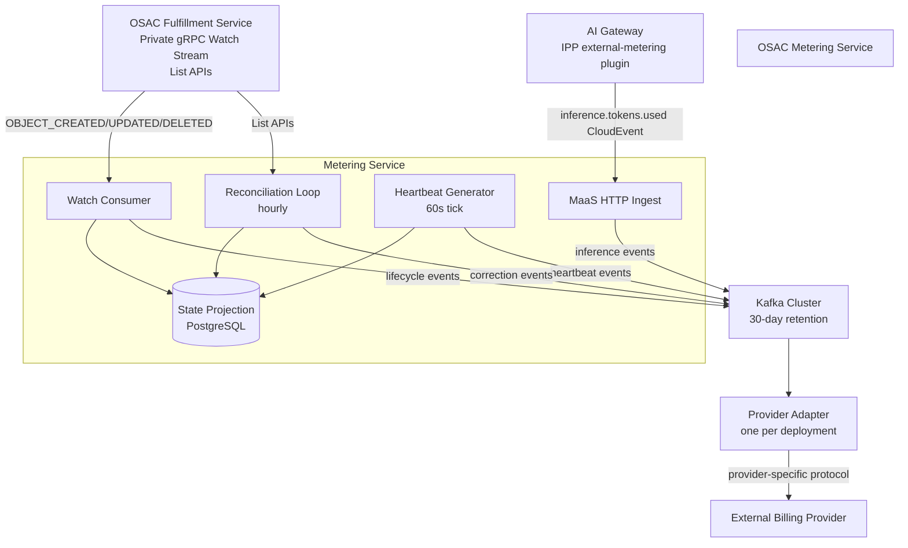
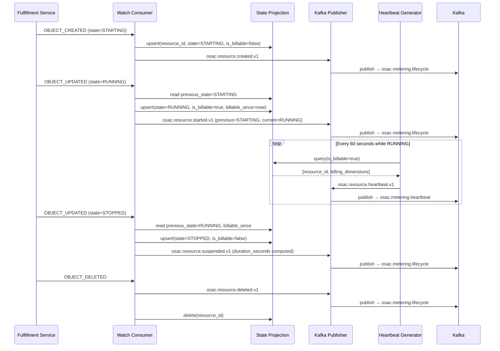
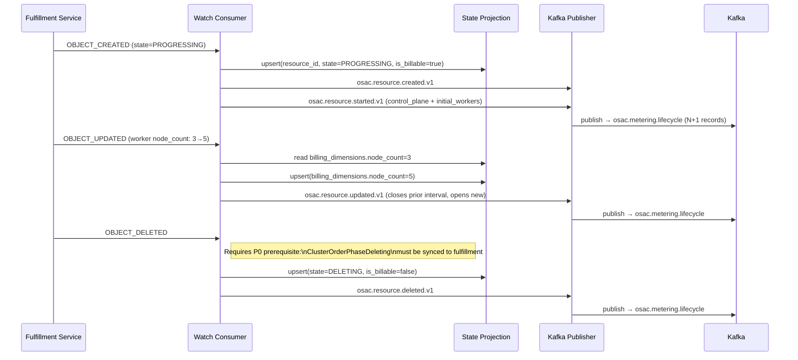
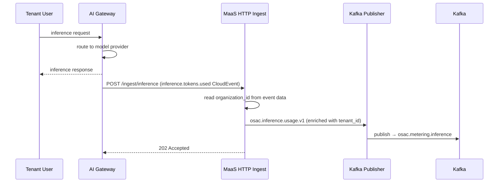
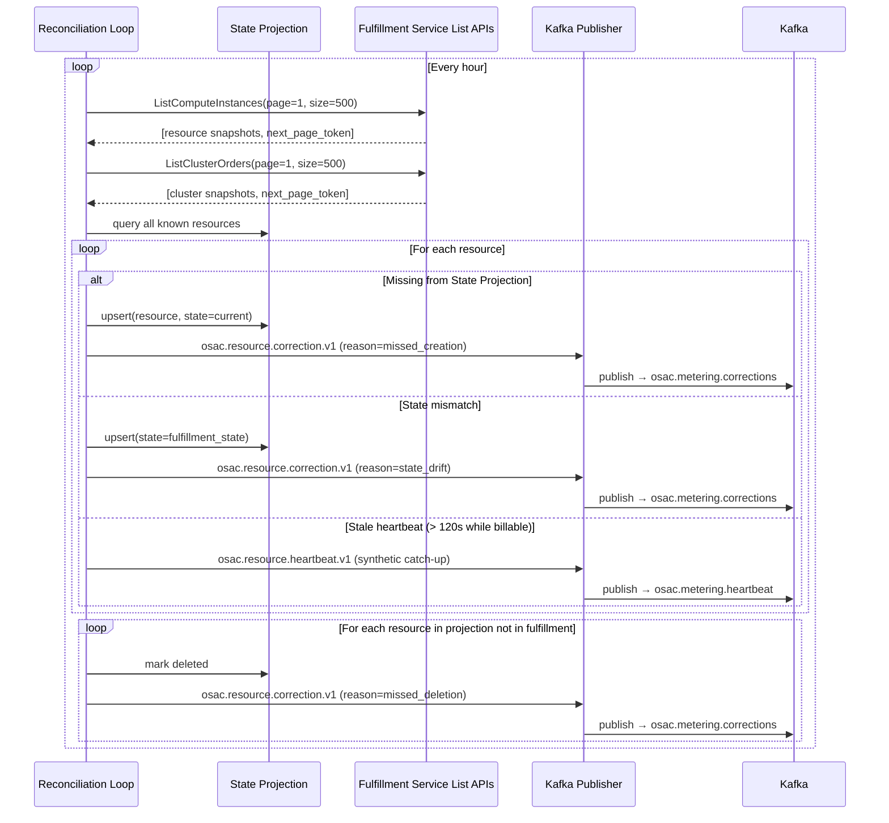
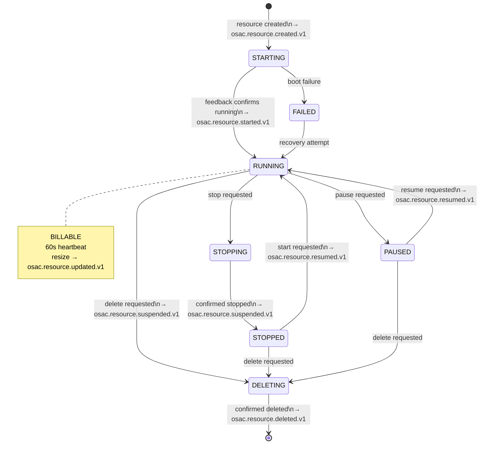
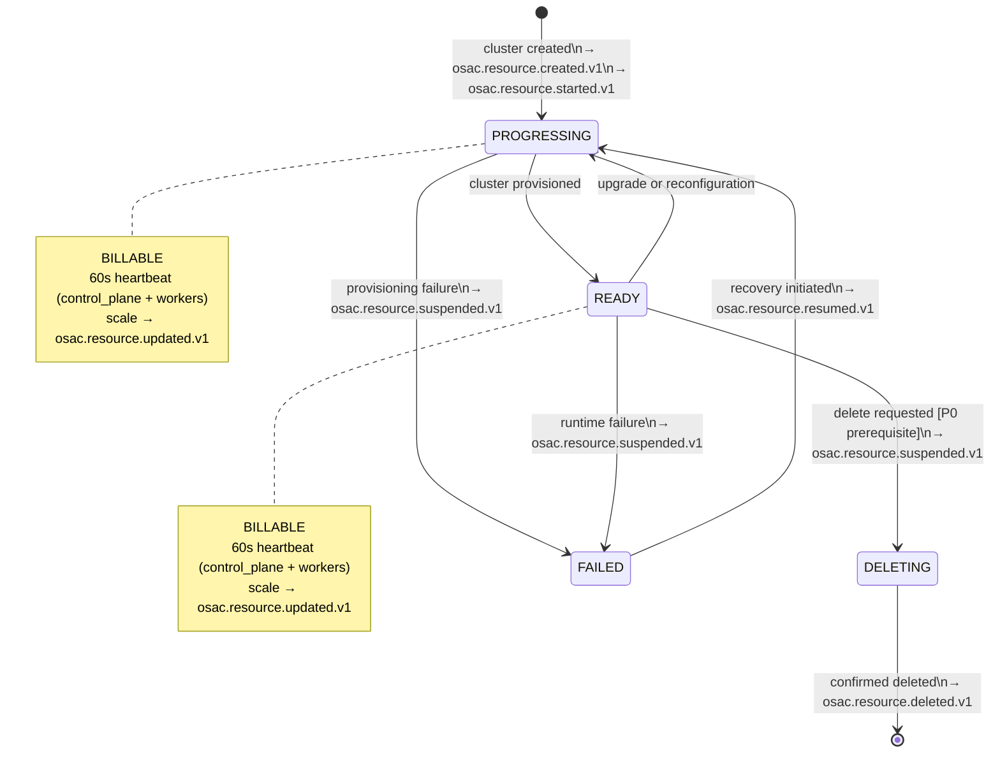

# OSAC Metering and Usage Tracking

## Summary

This design introduces a dedicated OSAC Metering Service that consumes the fulfillment-service private gRPC Watch stream and AI Gateway inference events, enriches raw snapshots into structured lifecycle records with billing dimensions, and publishes canonical CloudEvents 1.0 to a durable Kafka cluster. Downstream, a swappable Provider Adapter consumes from Kafka and translates canonical events into the format required by the active billing provider — the adapter is fully replaceable as a deployment operation, not a pipeline change. See [PRD](prd.md) for detailed requirements.

## Motivation

OSAC provisions and manages three classes of cloud services — VMaaS (VMs), CaaS (Kubernetes clusters), and MaaS (AI inference) — each with distinct lifecycle semantics and billing models. No production-grade metering infrastructure exists today. Different billing providers (Red Hat Cost Management, OpenMeter, Monetize360) have different ingestion protocols, and tying the metering pipeline to any single provider would require a rewrite to switch. A unified architectural layer is needed between OSAC's resource lifecycle events and any downstream billing system.

The critical architectural insight is the separation between **metering** (what happened, when, to which resource, for how long) and **billing** (how much to charge). The Metering Service owns the former permanently. The provider adapter owns the translation. This separation means the metering record is authoritative and audit-grade regardless of which billing system is active or temporarily unavailable.

The design unifies two event sources — the fulfillment-service Watch stream (VMaaS/CaaS lifecycle events) and the AI Gateway HTTP ingest (MaaS inference events) — into a single Kafka-backed pipeline. Adapters consume from Kafka in a pull model that decouples OSAC from provider-specific protocols and availability requirements.

### Goals

1. **Vendor neutrality via stable internal contract** — all events are CloudEvents 1.0 published to Kafka; adding or replacing a billing provider requires only deploying a new adapter, not changes to the Metering Service or fulfillment-service
2. **Pull-model consumption** — provider adapters consume from Kafka at their own pace; OSAC never pushes to a billing provider, eliminating retry storm risk and providing natural backpressure
3. **At-least-once delivery with idempotent deduplication** — exactly-once across Kafka + external HTTP is not achievable without distributed transactions; idempotency is enforced by CloudEvent `id` at the adapter boundary [PRD: D-2]
4. **Metering decoupled from provisioning** — the Metering Service is a read-only consumer of fulfillment-service state; no metering code path is on the critical path of resource lifecycle operations [PRD: D-2]
5. **Reconciliation as first-class correctness** — the hourly reconciliation loop is not a fallback for failures; it is expected to detect and correct gaps continuously, even in a healthy system
6. **Explicit over implicit** — every state transition is enriched with `previous_state`, `current_state`, `transition_time`, and `duration_seconds`; receiving adapters never need to infer state from sequences of events
7. **Cloud-native and air-gap compatible** — all components run as containerized workloads on OpenShift with no external SaaS dependencies [PRD: NFR-12]

### Non-Goals

- **Costing, billing, invoicing, and quota enforcement** — deferred to a separate PRD; the Metering Service produces usage data, not charges [PRD: §2.2]
- **BMaaS, Storage, and Networking metering** — deferred to a future PRD (OSAC-2506); the canonical event model supports future resource types without architectural changes
- **Usage Query API and tenant-facing usage views** — the API and UI for querying aggregated usage are a planned companion design. This design covers event production, not consumption. In the interim, provider-native query capabilities (OpenMeter API, Cost Management UI) serve the PRD's visibility requirements (CAP-1, CAP-8, CAP-9, CAP-10)
- **Custom meters for non-OSAC services [PRD: CAP-6]** — services not tracked by the fulfillment-service or the AI Gateway require direct publication to Kafka in the canonical CloudEvents format, bypassing the Metering Service's Watch Consumer, State Projection, and heartbeat/reconciliation subsystems. This is a different integration pattern that warrants its own design.
- **Network bandwidth metering** — data source ownership is unresolved [PRD: §2.2]
- **Multi-region aggregation** — each region runs an independent Metering Service instance; cross-region aggregation via Kafka MirrorMaker 2 is deferred

## Proposal

The design introduces four components:

1. **OSAC Metering Service** (Go binary) — consumes the fulfillment-service Watch stream and AI Gateway events; maintains a PostgreSQL State Projection; generates heartbeats and corrections; publishes CloudEvents to Kafka
2. **Kafka cluster** (AMQ Streams / Strimzi) — five purpose-built topics with 30-day retention providing durability, replay, and provider migration capability
3. **Provider Adapter framework** (Go) — a shared framework for building billing provider adapters, handling Kafka consumption, retry, DLQ, and idempotency
4. **Provider Adapters** — one active per deployment, selected via Helm values; initial adapters for OpenMeter, Cost Management, and Monetize360

The Metering Service contains four subsystems: Watch Consumer (snapshot → lifecycle transition conversion), Heartbeat Generator (60-second periodic usage records), Reconciliation Loop (hourly State Projection vs fulfillment List API comparison), and MaaS HTTP Ingest (inference event reception).



The Metering Service consumes the fulfillment-service private Watch stream — the natural integration boundary, since all resource lifecycle state changes already flow through it — and produces canonical CloudEvents to Kafka. The Watch stream delivers resource snapshots, not transition records — the Watch Consumer enriches these into lifecycle transitions by maintaining the State Projection. The AI Gateway IPP plugin delivers per-request inference events via the HTTP ingest endpoint.

### Workflow Description

#### VMaaS VM Lifecycle

When a Cloud Infrastructure Admin provisions a VM through the fulfillment-service, the Metering Service tracks its lifecycle:



VMaaS bills RUNNING only [PRD: CAP-11]. Stopped and paused VMs do not accrue compute usage. Resources allocated to a VM that remain reserved (storage, IPs) must continue to be metered — this is addressed by subsidiary resource meters in a future PRD.

#### CaaS Cluster Lifecycle

CaaS clusters are billable in both PROGRESSING and READY states [PRD: CAP-12]. Each cluster generates N+1 Kafka records per heartbeat or transition: one for the control plane and one per worker node set, enabling per-resource-class billing [PRD: CAP-2].



**P0 prerequisite:** The `clusterorder-feedback` controller does not sync `ClusterOrderPhaseDeleting` to fulfillment-service. Until fixed, clusters appear READY/PROGRESSING during teardown, causing over-billing. The Reconciliation Loop emits corrections when a cluster disappears from the List API without a prior DELETING transition.

#### MaaS Inference Request

MaaS has no fulfillment resource and no state machine. One event is emitted per inference request [PRD: CAP-13]:



MaaS usage data must be queryable within 60 seconds of inference completion [PRD: CAP-13]. The Metering Service publishes to Kafka synchronously before returning HTTP 202.

**Tenant attribution:** The AI Gateway's external-metering plugin includes `organization_id` and `cost_center` in the `inference.tokens.used` CloudEvent data ([opendatahub-io/ai-gateway-payload-processing#386](https://github.com/opendatahub-io/ai-gateway-payload-processing/pull/386)), sourced from `x-maas-organization-id` and `x-maas-cost-center` headers injected by Authorino from the MaaSSubscription's TokenMetadata. The Metering Service maps `organization_id` to `tenant_id` for billing attribution. Events without a resolved `organization_id` route to the DLQ with `reason=tenant_resolution_failed`.

**MaaS delivery resilience:** MaaS inference events have no fulfillment resource to reconcile against — unlike VMaaS/CaaS, lost events are unrecoverable. The AI Gateway IPP plugin is expected to retry delivery on connection failure or non-2xx responses. Events lost during a Metering Service restart that exceeds the AI Gateway's retry budget are an accepted trade-off of the single-replica model. This will be resolved by raising a requirement for the IPP plugin to support publishing directly to Kafka, eliminating the HTTP hop and the data loss window.

#### Reconciliation Loop

The Reconciliation Loop runs every 60 minutes, comparing the State Projection against fulfillment-service List APIs:



On every Metering Service startup — not just cold start — a full reconciliation runs synchronously before the Watch Consumer begins processing. At 10K resources with 500/page, this is approximately 20 API calls (under 10 seconds).

### API Extensions

The Metering Service introduces no CRDs, webhooks, or aggregated API servers. It is a standalone service that consumes existing fulfillment-service private APIs (Watch stream, List APIs) and introduces the following new interfaces:

**HTTP Endpoints (Metering Service):**

| Endpoint | Method | Purpose | Authentication |
|----------|--------|---------|----------------|
| `/ingest/inference` | POST | Receives `inference.tokens.used` CloudEvents from AI Gateway IPP plugin | Kubernetes SA JWT or mTLS |
| `/healthz` | GET | Liveness probe | None |
| `/readyz` | GET | Readiness probe (Watch stream connected, Kafka producer ready) | None |
| `/metrics` | GET | Prometheus metrics | None |

**CloudEvents Extension Attributes:**

All OSAC metering events use CloudEvents 1.0 with the following extension attributes:

| Extension Attribute | Type | Required | Description |
|--------------------|------|----------|-------------|
| `osacresourceid` | String (UUID) | Yes | Unique identifier of the metered resource |
| `osacresourcetype` | String | Yes | `compute_instance`, `cluster_order`, `maas_inference` |
| `osactenant` | String | Yes | Tenant identifier for isolation and billing attribution |
| `osacproject` | String | No | Project identifier for sub-tenant billing breakdown |
| `osactrace` | String | No | W3C Trace Context `traceparent` for distributed tracing |

**Provider Adapter Go Interface:**

```go
type MeteringEvent struct {
    CloudEvent cloudevents.Event
    Topic      string
    Partition  int32
    Offset     int64
}

type SubmitResult struct {
    ProviderEventID string
    Idempotent      bool
}

type ProviderAdapter interface {
    Name() string
    Submit(ctx context.Context, event MeteringEvent) error
    Flush(ctx context.Context) (SubmitResult, error)
    HealthCheck(ctx context.Context) error
    Close() error
}
```

The framework calls `Submit()` per event — the adapter may process it immediately or buffer internally. `Flush()` is called periodically (configurable interval, default 10s) and on graceful shutdown. Kafka consumer offsets are committed only after a successful `Flush()`, not after each `Submit()`. This supports both per-event providers (OpenMeter: `Submit` forwards immediately, `Flush` is a no-op) and batch providers (Cost Management: `Submit` buffers, `Flush` uploads the batch and returns the result).

The adapter framework handles Kafka consumer lifecycle, offset management, flush scheduling, retry policy (exponential backoff: initial 1s, max 5m, max 10 attempts), DLQ publication, Prometheus metrics, and structured logging.

## UX Alignment

No `@temp-api` file exists for metering resources in `osac-ux/libs/ui-components/src/api/v1/`. The Metering Service is a backend event pipeline; tenant-facing usage views are a separate design concern (Usage Query API).

### Implementation Details/Notes/Constraints

#### Canonical Event Model

All lifecycle events share a base schema. The base event carries **common fields** that every adapter can access, plus a **`billing_dimensions`** object containing only resource-type-specific attributes. The adapter receives the full CloudEvent and decides how to compose the provider-specific payload from base fields and `billing_dimensions` — there is no duplication between the two.

| Field | Type | Description |
|-------|------|-------------|
| `resource_id` | string (UUID) | Fulfillment resource identifier |
| `resource_type` | string | `compute_instance`, `cluster_order`, `maas_inference` |
| `tenant_id` | string | Tenant identifier (billing attribution) |
| `project_id` | string (optional) | Project identifier (sub-tenant grouping; null until P2 prerequisite) |
| `catalog_item_id` | string (optional) | Originating catalog offer [PRD: CAP-17] |
| `template_id` | string (optional) | Originating template [PRD: CAP-17] |
| `previous_state` | string | State before transition (null for created events) |
| `current_state` | string | State after transition |
| `transition_time` | string (RFC3339) | When the transition occurred |
| `duration_seconds` | integer | Seconds spent in `previous_state` |
| `billing_dimensions` | object | Resource-type-specific attributes (see Billing Dimensions) |
| `schema_version` | string | Event schema version (e.g., `v1`) |

#### Event Types by Resource

| Event Type | VMaaS | CaaS | MaaS | Billing Effect |
|-----------|-------|------|------|----------------|
| `osac.resource.created.v1` | Yes | Yes | No | Records existence; no billing |
| `osac.resource.started.v1` | Yes | Yes | No | Billing interval opens |
| `osac.resource.updated.v1` | Yes (resize) | Yes (scale) | No | Closes interval, opens new with updated dimensions |
| `osac.resource.suspended.v1` | Yes (stop/pause/fail) | Yes (fail/delete) | No | Billing interval closes |
| `osac.resource.resumed.v1` | Yes | Yes (recovery) | No | New billing interval opens |
| `osac.resource.deleted.v1` | Yes | Yes | No | Final interval closes |
| `osac.resource.heartbeat.v1` | Yes (60s, RUNNING) | Yes (60s, PROGRESSING/READY) | No | Periodic usage confirmation |
| `osac.resource.correction.v1` | Yes | Yes | Yes | Adjusts prior interval |
| `osac.inference.usage.v1` | No | No | Yes | Per-request token usage |

#### Correction Event Schema

The `osac.resource.correction.v1` event is emitted by the Reconciliation Loop when it detects a discrepancy between the State Projection and fulfillment-service. It carries the base event fields plus correction-specific fields that tell the adapter what was wrong and how to adjust the billing record.

| Field | Type | Description |
|-------|------|-------------|
| `reason` | string | `missed_creation`, `state_drift`, `missed_deletion` |
| `description` | string | Human-readable explanation of the discrepancy |
| `corrected_state` | string | The state the resource should be in |
| `previous_state_in_projection` | string | What the Metering Service believed (null for `missed_creation`) |
| `actual_state_from_source` | string | What fulfillment-service reports (null for `missed_deletion`) |
| `affected_interval` | object | The billing interval that was incorrectly metered |
| `affected_interval.from` | string (RFC3339) | Start of the incorrect interval |
| `affected_interval.to` | string (RFC3339) | End of the incorrect interval (correction time) |
| `affected_interval.overbilled_seconds` | integer | Positive = overbilled, negative = underbilled |
| `original_event_id` | string (UUID) | CloudEvent `id` of the lifecycle event being corrected (null for `missed_creation`) |

Example — state drift (resource was STOPPED but projection had RUNNING):

```json
{
  "resource_id": "a1b2c3d4-e5f6-7890-abcd-ef1234567890",
  "resource_type": "compute_instance",
  "tenant_id": "tenant-acme-corp",
  "project_id": "project-gpu-training",
  "catalog_item_id": "ci-rhel10-gpu-workstation",
  "template_id": "tmpl-rhel10-large-gpu",
  "reason": "state_drift",
  "description": "State Projection had RUNNING; fulfillment reports STOPPED",
  "corrected_state": "STOPPED",
  "previous_state_in_projection": "RUNNING",
  "actual_state_from_source": "STOPPED",
  "affected_interval": {
    "from": "2026-07-19T09:00:00.000Z",
    "to": "2026-07-19T10:15:30.000Z",
    "overbilled_seconds": 4530
  },
  "original_event_id": "7f3a2b1c-4d5e-6f7a-8b9c-0d1e2f3a4b5c",
  "billing_dimensions": {
    "instance_type": "large-gpu",
    "image_ref": "rhel-10.2-x86_64",
    "boot_disk_size_gib": 100
  },
  "schema_version": "v1"
}
```

For `missed_creation`, `previous_state_in_projection` and `original_event_id` are null — there was no prior record. `affected_interval.from` is the resource's `created_at` from fulfillment. For `missed_deletion`, `actual_state_from_source` is null — the resource no longer exists in fulfillment. `affected_interval.from` is the last heartbeat timestamp.

#### VMaaS State Machine



#### CaaS State Machine



#### Billing Dimensions

`billing_dimensions` carries only **resource-type-specific attributes** — the fields that distinguish one resource's billing from another within the same type. Common fields (`tenant_id`, `project_id`, `resource_type`, `catalog_item_id`, `template_id`) are in the base event and are not duplicated here. The adapter receives the full CloudEvent and composes the provider-specific payload from both base fields and `billing_dimensions` as appropriate for its target billing system.

**VMaaS `billing_dimensions`:**

```json
{
  "instance_type": "large-gpu",
  "image_ref": "rhel-10.2-x86_64",
  "boot_disk_size_gib": 100
}
```

**CaaS `billing_dimensions`** — one Kafka record per cluster component (N+1 per heartbeat/transition):

```json
{
  "cluster_template": "ocp-ci-small",
  "release_image": "quay.io/openshift-release-dev/ocp-release:4.17.0-x86_64",
  "component": "worker",
  "host_type": "ci-worker",
  "node_count": 3
}
```

Control plane uses `"component": "control_plane"`, `"host_type": "_control_plane"`, `"node_count": 1`.

**MaaS `billing_dimensions`:**

```json
{
  "organization_id": "acme-corp",
  "cost_center": "engineering",
  "subscription": "acme-sub-1",
  "provider": "anthropic",
  "model": "claude-sonnet-4-20250514",
  "prompt_tokens": 1500,
  "completion_tokens": 800,
  "total_tokens": 2300,
  "cached_input_tokens": 200,
  "cache_creation_tokens": 0,
  "reasoning_tokens": 150,
  "duration_ms": 3200
}
```

The adapter decides which base fields to include in the provider's meter definition. For example, an OpenMeter adapter might define a VMaaS meter grouped by `tenant_id + instance_type`, while a Cost Management adapter might group by `tenant_id + project_id + instance_type`. That mapping is the adapter's responsibility, not the Metering Service's.

#### Schema Versioning

All event types carry a `schema_version` field and the CloudEvents `type` includes the version suffix (e.g., `osac.resource.started.v1`). Breaking changes increment the version; adapters must handle both `v1` and `v2` during transition windows (minimum 30 days, matching Kafka retention). Non-breaking additions (new optional fields) do not increment the version.

#### Kafka Topic Design

| Topic | Event Types | Partition Key | Partitions | Retention | Replication |
|-------|------------|---------------|------------|-----------|-------------|
| `osac.metering.lifecycle` | `osac.resource.{created,started,updated,suspended,resumed,deleted}.v1` | `osacresourceid` | 24 | 30 days | 3 |
| `osac.metering.heartbeat` | `osac.resource.heartbeat.v1` | `osacresourceid` | 24 | 30 days | 3 |
| `osac.metering.inference` | `osac.inference.usage.v1` | `osactenant` | 12 | 30 days | 3 |
| `osac.metering.corrections` | `osac.resource.correction.v1` | `osacresourceid` | 6 | 30 days | 3 |
| `osac.metering.dlq` | All failed events | original topic | 6 | 90 days | 3 |

Partition counts: `lifecycle` and `heartbeat` at 24 support up to 24 parallel consumers and distribute load at 10K+ active resources. `inference` at 12 is tenant-partitioned. `corrections` at 6 reflects low volume. DLQ has 90-day retention for investigation.

Each adapter uses a single consumer group across all consumed topics. Consumer groups are independent — a new adapter gets its own group and can start at any offset.

**Retention responsibility:** Kafka's 30-day retention serves operational replay and provider migration, not long-term audit. The PRD's 13-month aggregated data retention requirement [PRD: §4] is the billing provider's responsibility — the provider aggregates raw events into usage records and retains them per its own retention policy. The Metering Service's correction audit log (1-year minimum) covers the audit trail for billing adjustments independently of Kafka retention.

#### State Projection Schema

```
TABLE metering_resource_state (
    resource_id           TEXT        NOT NULL,
    resource_type         TEXT        NOT NULL,
    tenant_id             TEXT        NOT NULL,
    project_id            TEXT,
    catalog_item_id       TEXT,
    template_id           TEXT,
    current_state         TEXT        NOT NULL,
    is_billable           BOOLEAN     NOT NULL DEFAULT FALSE,
    billable_since        TIMESTAMPTZ,
    last_heartbeat_at     TIMESTAMPTZ,
    last_metered_at       TIMESTAMPTZ,
    billing_dimensions    JSONB       NOT NULL DEFAULT '{}',
    fulfillment_version   BIGINT      NOT NULL DEFAULT 0,
    version               BIGINT      NOT NULL DEFAULT 0,
    created_at            TIMESTAMPTZ NOT NULL DEFAULT now(),
    updated_at            TIMESTAMPTZ NOT NULL DEFAULT now(),

    PRIMARY KEY (resource_id),
    INDEX idx_billable (is_billable, last_heartbeat_at) WHERE is_billable = TRUE,
    INDEX idx_tenant (tenant_id),
    INDEX idx_type_state (resource_type, current_state)
)
```

The State Projection is an eventually consistent projection of fulfillment-service state. The Watch Consumer provides near-real-time updates; the Reconciliation Loop provides hourly consistency guarantees. The projection is authoritative for Metering Service operations (heartbeat generation, reconciliation) but never used as a source of truth for external consumers — Kafka topics serve that role.

CaaS clusters store multiple billing components in `billing_dimensions` JSONB:

```json
{
  "cluster_template": "ocp-ci-small",
  "components": [
    {"component": "control_plane", "host_type": "_control_plane", "node_count": 1},
    {"component": "worker", "host_type": "ci-worker", "node_count": 3}
  ]
}
```

The Watch Consumer and Reconciliation Loop both write to the State Projection. Concurrency is managed via PostgreSQL row-level locking (`SELECT FOR UPDATE`). The reconciler never overwrites a state newer than the fulfillment snapshot — it uses the resource's `updated_at` timestamp for freshness detection.

**State Projection recovery:** If the database is lost, clear the table, run startup reconciliation (rebuilds from fulfillment List APIs), and optionally replay `osac.metering.lifecycle` from Kafka for historical context. Kafka is the system of record for historical metering data; the State Projection is a mutable operational cache.

#### Reconciliation Algorithm

1. Paginate all resources via fulfillment List APIs (500/page)
2. Build `resource_id → current_state` maps from fulfillment and State Projection
3. For each resource in fulfillment:
   - **Not in projection:** emit `correction.v1` with `reason=missed_creation`; upsert
   - **State mismatch:** emit `correction.v1` with `reason=state_drift`; update
   - **Stale heartbeat (> 120s while billable):** emit synthetic heartbeat
4. For each resource in projection not in fulfillment: emit `correction.v1` with `reason=missed_deletion`; mark deleted

The reconciler uses the resource's `updated_at` from fulfillment to avoid overwriting fresher Watch Consumer updates. Corrections are published to `osac.metering.corrections`, not `osac.metering.lifecycle`, so adapters can distinguish primary events from adjustments.

#### Reliability

At-least-once delivery is enforced at every hop:

| Hop | Mechanism |
|----|-----------|
| Watch stream → Watch Consumer | gRPC reconnect with exponential backoff; startup reconciliation fills gaps |
| Watch Consumer → Kafka | `acks=all`, `enable.idempotence=true` |
| MaaS HTTP Ingest → Kafka | Synchronous Kafka publish before HTTP 202; AI Gateway retries on non-2xx |
| Kafka → Adapter | Consumer offset committed only after successful `Submit()` |
| Adapter → Billing Provider | Exponential backoff (max 10 attempts, ~85 min); DLQ after exhaustion |

Each CloudEvent has a globally unique `id` (UUID v4). Adapters maintain a dedup cache (in-memory, TTL 10 min) keyed on CloudEvent `id`. For providers with native idempotency (e.g., OpenMeter), the `id` is passed as the idempotency key.

Events for a given `resource_id` are partitioned to the same Kafka partition, ensuring ordering within a resource. Out-of-order events (from Watch Consumer reconnect or reconciliation) are handled by checking `transition_time` against the last recorded time and routing to the provider's correction API if earlier.

#### Provider Adapters

One adapter is deployed per OSAC installation as a separate Go binary / Helm chart. Provider selection is a Helm value. Provider credentials and Kafka SASL credentials are referenced via Kubernetes Secrets (or external secret operator CRs); literal values in Helm values are not supported.

```yaml
metering:
  adapter:
    enabled: true
    provider: cost-management
    image:
      repository: quay.io/osac/metering-adapter-cost-management
      tag: v1.0.0
    kafka:
      consumerGroup: osac-metering-cost-management
      startOffset: latest
    provider:
      endpoint: https://cost-management.example.com
      apiKeySecretRef: metering-provider-credentials
```

| Adapter | Provider | Protocol |
|---------|----------|----------|
| `openmeter-adapter` | OpenMeter | CloudEvents HTTP ingest |
| `cost-management-adapter` | Red Hat Cost Management | Prometheus Remote Write or CSV upload |
| `m360-adapter` | Monetize360 | REST API (requires translation proxy) |
| `custom-adapter` | Custom | Implements `ProviderAdapter` interface |

**Migration replay:** Deploy the new adapter with `startOffset: <timestamp>`. Kafka delivers all events from that position. Replay progress is tracked via `osac_adapter_replay_lag_events` gauge. The Metering Service does not participate in replay.

#### Dead-Letter Queue

Events move to `osac.metering.dlq` when the adapter exhausts retry attempts or encounters a non-retryable error. DLQ event envelope includes: `dlq.original-topic`, `dlq.original-offset`, `dlq.failure-reason`, `dlq.failure-count`, `dlq.failed-at`. DLQ retention is 90 days. Manual replay is supported via a CLI tool (`osac-metering-dlq-replay`).

#### High Availability and Restart Recovery

The Metering Service runs as a **single-replica Kubernetes Deployment** with startup reconciliation as the availability mechanism. The Watch Consumer, Heartbeat Generator, and Reconciliation Loop are singleton processes — running multiple replicas without coordination would produce duplicate Watch stream subscriptions, duplicate heartbeats, and duplicate correction events. Leader election (e.g., via Kubernetes lease) would add coordination complexity disproportionate to the availability gain, because the Metering Service is not on the provisioning critical path and Kafka provides event durability.

This satisfies NFR-1 ("no single point of failure") because the Metering Service is stateless in the durable sense: the State Projection is a rebuildable cache, Kafka is the durable event store, and the fulfillment-service List APIs are the authoritative resource state. A pod restart loses at most one heartbeat interval (~60 seconds of metering gap), which the startup reconciliation fills before the Watch Consumer resumes.

**On restart:** (1) run a full reconciliation against fulfillment List APIs before accepting Watch events; (2) reconnect the Watch stream; (3) resume heartbeat generation once the State Projection is populated. Cold start and warm start are handled identically — reconciliation always runs at startup. Kafka Publisher resumes from its last committed position.

#### Assumptions

1. Kafka is a new infrastructure dependency introduced by the Metering Service. Deployment requires the AMQ Streams (or Strimzi) operator installed on the target OpenShift cluster with a minimum 3-broker cluster [Assumption]
2. PostgreSQL is available for the Metering Service — dedicated or shared instance [Assumption]
3. P0 prerequisite (`ClusterOrderPhaseDeleting` gap) is completed before CaaS production metering
4. P1 prerequisite (`status.state_transition_time`) is completed before sub-minute billing accuracy is required
5. MaaS inference event schema is settled: the AI Gateway external-metering plugin emits `inference.tokens.used` CloudEvents with `organization_id`, `cost_center`, token counts, and model metadata
6. One external billing provider is active per deployment at any time
7. P2 prerequisite: fulfillment-service populates `project_id` on ComputeInstance and ClusterOrder resources from the Organizations EP's project attribution. Until completed, the `project_id` field in metering events is null and project-level billing breakdown (CAP-8, CAP-9) is not possible

### Security Considerations

**Watch Stream Authentication:** The Metering Service authenticates to the fulfillment-service private Watch stream using a dedicated service account OSAC JWT token. Tokens are rotated via Kubernetes ServiceAccount token projection. mTLS is required; certificates managed by cert-manager.

**Kafka Security:**

| Aspect | Mechanism |
|--------|-----------|
| Transport | SASL/TLS on all connections |
| Producer ACL | Metering Service: WRITE to all `osac.metering.*` topics |
| Consumer ACL | Each adapter: READ on consumed topics only |
| DLQ ACL | Adapters: WRITE to `osac.metering.dlq` |
| Admin ACL | No adapter has topic management ACL |

**MaaS HTTP Ingest:** Not publicly exposed. Accepts requests only from the AI Gateway, authenticated via Kubernetes SA JWT or mTLS client certificate.

**Audit Log:** All `osac.resource.correction.v1` events are written to a dedicated append-only audit log in addition to Kafka, recording: original event ID, correction reason, before/after state, timestamp, and triggering system. Retained for the data residency period (minimum 1 year).

**Input Validation:** The MaaS HTTP Ingest endpoint validates CloudEvent structure, required fields (`specversion`, `type`, `source`), and data payload schema before publishing. Malformed events are rejected with HTTP 400, not forwarded to Kafka. Request body size is bounded (configurable, default 64 KiB) to prevent memory exhaustion.

**Platform Security Baseline:** The Metering Service inherits the OSAC platform security posture: FIPS-validated cryptography (RHEL Go Toolset FIPS mode) for all TLS operations, encrypted StorageClasses for Kafka and PostgreSQL persistent volumes, and Kubernetes NetworkPolicies restricting traffic between Metering Service, Kafka, PostgreSQL, and adapter pods.

### Failure Handling and Recovery

| Failure Mode | Detection | Recovery | Data Loss Risk |
|-------------|-----------|----------|----------------|
| Kafka unavailable | Producer errors; `osac_metering_kafka_publish_errors_total` alert | In-memory buffer (bounded, 10K events); publish on recovery; post-recovery reconciliation | Low: short outages covered by buffer; extended outage may lose events, reconciliation catches gaps |
| Fulfillment Service restarts | Watch stream EOF; auto-reconnect with backoff | Watch Consumer reconnects; startup reconciliation fills gap | None |
| Billing provider unavailable | Adapter `Submit()` errors; retry policy triggers | Exponential backoff (max 10 attempts); events stay in Kafka; resume from last committed offset | None: Kafka durability; billing delivery delayed, not lost |
| Duplicate lifecycle events | CloudEvent `id` in adapter dedup cache | Dedup cache suppresses duplicate; `osac_adapter_duplicates_suppressed_total` increments | None |
| Out-of-order events | `transition_time` earlier than last recorded | Route to provider correction API; `osac_adapter_out_of_order_events_total` | None |
| Missing events (gap) | Reconciliation detects State Projection ≠ fulfillment | Reconciler emits `correction.v1`; updates projection | None: corrected retroactively |
| Heartbeat failure | `last_heartbeat_at` stale; reconciler detects | Reconciler emits synthetic catch-up heartbeat | Low: at most one 60s gap per failure window |
| Stuck DLQ | DLQ depth grows; `osac_metering_dlq_depth` alert | On-call investigates; fixes root cause; replays DLQ | None: 90-day DLQ retention |
| Metering Service cold start | State Projection empty | Startup reconciliation rebuilds from fulfillment List APIs | None |

### RBAC / Tenancy

**Tenant Isolation:** Every metering event carries `tenant_id` via `osactenant` CloudEvent extension and `data.tenant_id`. The Metering Service enforces:
- Watch Consumer derives `tenant_id` from the fulfillment resource's `osac.openshift.io/tenant` annotation
- MaaS HTTP Ingest derives `tenant_id` from the inference event's `organization_id` field
- No event is published to Kafka without a resolved `tenant_id`; unresolvable events route to DLQ with `reason=tenant_resolution_failed`

**Data Isolation:** The State Projection indexes by `tenant_id`; all queries are tenant-scoped. No event routing or aggregation crosses tenant boundaries within the Metering Service.

**Provider Adapter Tenant Safety:** Adapters receive all tenants' events on shared Kafka topics (partitioned by resource_id, not tenant_id). Adapter implementations must not expose one tenant's data to another during translation.

**Air-Gap Compatibility:** All components run on-premise within the OSAC installation. No outbound calls to external CDNs, license servers, or SaaS telemetry endpoints. The billing provider endpoint may be on-premise or an on-premise proxy.

**Project-Scoped Visibility [PRD: D-1]:** Tenant Users see usage for projects they have access to, scoped via RBAC at the Usage API layer. This is out of scope for the metering pipeline — the Metering Service carries `project_id` as a passthrough dimension for downstream filtering.

### Observability and Monitoring

**Metering Service Metrics:**

| Metric | Type | Labels | Alert Threshold |
|--------|------|--------|-----------------|
| `osac_metering_events_published_total` | counter | `topic`, `event_type`, `resource_type` | — |
| `osac_metering_kafka_publish_errors_total` | counter | `topic`, `error_type` | > 0 for 5m |
| `osac_metering_kafka_publish_latency_seconds` | histogram | `topic` | p99 > 5s |
| `osac_metering_heartbeat_lag_seconds` | gauge | `resource_type` | > 120s |
| `osac_metering_reconciliation_duration_seconds` | histogram | — | > 300s |
| `osac_metering_reconciliation_corrections_total` | counter | `reason`, `resource_type` | > 10/hour |
| `osac_metering_reconciliation_last_completed_at` | gauge | — | `time() - value > 7200` |
| `osac_metering_state_projection_resources` | gauge | `resource_type`, `is_billable` | — |
| `osac_metering_watch_stream_reconnects_total` | counter | — | > 3/hour |
| `osac_metering_inference_ingest_latency_seconds` | histogram | — | p99 > 5s |
| `osac_metering_inference_ingest_errors_total` | counter | `error_type` | > 0 for 5m |

**Provider Adapter Metrics:**

| Metric | Type | Labels | Alert Threshold |
|--------|------|--------|-----------------|
| `osac_adapter_events_submitted_total` | counter | `provider`, `topic` | — |
| `osac_adapter_events_failed_total` | counter | `provider`, `error_type` | > 0 for 5m |
| `osac_adapter_retry_duration_seconds` | histogram | `provider` | — |
| `osac_adapter_duplicates_suppressed_total` | counter | `provider` | — |
| `osac_adapter_out_of_order_events_total` | counter | `provider` | — |
| `osac_adapter_consumer_lag_events` | gauge | `provider`, `topic` | > 10000 for 5m |
| `osac_adapter_replay_lag_events` | gauge | `provider` | — |
| `osac_metering_dlq_depth` | gauge | `topic` | > 0 |

**Kubernetes Events:** The Metering Service emits Kubernetes events for: Watch stream disconnection and reconnection, reconciliation completion with correction count, DLQ threshold exceeded, and startup reconciliation completion.

**Structured Logging:** All components use structured JSON logging with fields: `event_id`, `resource_id`, `tenant_id`, `topic`, `offset`, `provider`, `error`. Log correlation via W3C Trace Context `traceparent`.

### Risks and Mitigations

| Risk | Likelihood | Impact | Mitigation |
|------|-----------|--------|------------|
| ClusterOrderPhaseDeleting gap (P0) | Confirmed | CaaS over-billing; financial liability | Block CaaS production metering on P0 fix. Reconciler emits corrections. Alert on cluster billing > 24h without heartbeat. |
| Heartbeat volume at scale | Medium | Kafka throughput, State Projection load | 10K VMs: ~167 events/s. CaaS clusters multiply by N+1 per cluster (1K clusters × 6 components = 100 events/s additional). Combined 10K VMs + 1K clusters: ~267 events/s (comfortable for Kafka). At 100K VMs: ~1,767/s (still within Kafka throughput). Heartbeat generator batches DB queries — one query returns all billable resources, not one query per resource. |
| MaaS tenant attribution depends on auth-side wiring | Medium | `organization_id` is client-assertable until Authorino injects it from MaaSSubscription TokenMetadata | The external-metering plugin reads `organization_id` from `x-maas-organization-id` headers. Until the auth-side wiring is complete (Authorino overwriting client-supplied headers), a malicious client could assert a false `organization_id`. Alert on `tenant_resolution_failed` DLQ events; block production MaaS billing on auth-side completion. |
| M360 translation proxy complexity | Confirmed | Extra operational component; format drift risk | M360 adapter encapsulates translation. Pin API version in config; alert on version mismatch. |
| Kafka operational overhead | Medium | Additional platform component | Use AMQ Streams (supported, OCP-native). Leverage Strimzi operators. Add Kafka to existing monitoring stack. |
| State Projection unbounded growth | Low | Storage cost; slow reconciliation | TTL cleanup for deleted resources (30 days post-deletion). Index `is_billable` and `updated_at`. Partition by `resource_type` if exceeding 10M rows. |
| Watch stream snapshot semantics | Confirmed | State machine bugs cause incorrect billing | Comprehensive unit tests for state machine transitions. Integration tests with fulfillment mock. Reconciler as correctness backstop. |
| Provider API contract changes | Medium | Silent billing failures | Adapter CI with contract tests (Pact or schema snapshots). Alert on `events_failed_total` spike. DLQ 90-day retention for post-fix replay. |

### Drawbacks

The strongest argument against this design is **operational complexity**. Introducing Kafka as a required infrastructure dependency adds deployment, monitoring, and operational overhead to every OSAC installation. For small deployments with a single billing provider and stable network connectivity, the durability and replay guarantees that Kafka provides may be over-engineered — a simpler direct-push architecture could serve adequately with lower operational cost.

Additionally, the Metering Service is a new Go binary that must be built, tested, deployed, and maintained alongside existing OSAC components. This increases the team's surface area and introduces a new failure domain, even though that failure domain is designed to be non-critical (provisioning-independent).

The design accepts this complexity because the PRD requirements (provider portability, event replay, provider migration, and audit-grade durability) cannot be met by simpler alternatives. The operational overhead is bounded by using AMQ Streams (supported, OCP-native) and Helm-based deployment.

## Alternatives (Not Implemented)

### Do Nothing

Continue without production metering. Each provider builds their own metering against the fulfillment Watch stream. This fragments the metering approach, produces inconsistent data models across deployments, and prevents OSAC from offering metering as a platform capability. Rejected because the PRD establishes metering as a core requirement.

### Direct Push (Watch Stream → Single Consumer)

A single Go service consumes the Watch stream and pushes events directly to a billing provider's API. Works for single-provider installations with stable connectivity. Breaks on provider portability (changing providers requires rewriting the consumer), durability under provider outages (no durable event log to replay from), replay for migration (no transition history is retained), and multi-provider support (fan-out requires duplicating the consumer or adding coupling logic). Architecturally insufficient for production requirements.

### OpenTelemetry Collector Pipeline

Replace the Metering Service with an OTel Collector that receives events as OTel traces/metrics and exports to billing providers. Works for standard observability pipelines; fails on heartbeat generation (OTel collectors do not generate synthetic events), state machine logic (requires stateful processing OTel is not designed for), and observability coupling (metering becomes a shared failure domain with monitoring). OTel is the right tool for metrics, logs, and traces — not for stateful billing event generation.

### Push Model (Fulfillment Service → Provider)

Fulfillment-service directly pushes billing events to the billing provider on state changes. Introduces tight coupling (fulfillment-service must know about billing providers), retry storms on provider unavailability (billing logic in the provisioning critical path), and no heartbeat capability. Violates the core principle that metering must never be on the critical path of provisioning. Categorically rejected.

### Comparison

| Requirement | Do Nothing | Direct Push | OTel | Push Model | This Design |
|------------|-----------|------------|------|-----------|-------------|
| Provider portability | No | No | Partial | No | Yes |
| Durability under provider outage | No | No | No | No | Yes |
| Replay for migration | No | No | No | No | Yes |
| Heartbeat for long-running resources | No | Partial | No | No | Yes |
| Metering decoupled from provisioning | N/A | Yes | Yes | No | Yes |
| Air-gap compatible | N/A | Yes | Yes | Yes | Yes |
| Historical reconstruction | No | No | No | No | Yes |

## Open Questions

1. **PostgreSQL instance:** Should the Metering Service use a dedicated PostgreSQL instance or a separate database on the shared fulfillment-service cluster? A dedicated instance simplifies operational isolation but increases resource cost. [Owner: platform team]

2. **Default adapter for Dev Preview:** Red Hat Cost Management is the default adapter when no provider is explicitly configured. The Cost Management adapter is in progress; a file/stdout adapter may serve as a fallback for early validation if the Cost Management adapter is not ready. [Owner: design author]

3. **BMaaS Signal-only feedback handling:** The Watch Consumer must handle `OBJECT_SIGNALED` events differently from `OBJECT_UPDATED` — Signal events carry delta payloads, not full snapshots. The handler design is deferred to a future PRD but may affect the Watch Consumer interface. [Owner: design author]

## Test Plan

### Unit Tests

Using Ginkgo/Gomega:

- **Watch Consumer state machine:** verify snapshot → lifecycle transition for every VMaaS state path (STARTING→RUNNING, RUNNING→STOPPED, RUNNING→PAUSED, STOPPED→RUNNING, etc.) and CaaS state path (PROGRESSING→READY, READY→FAILED, FAILED→PROGRESSING)
- **Watch Consumer enrichment:** verify `previous_state`, `current_state`, `duration_seconds`, and `billing_dimensions` are computed correctly from State Projection lookup
- **Heartbeat Generator:** verify billable resource query returns only `is_billable=true` resources; verify heartbeat event emission at 60s interval; verify heartbeat stops when resource becomes non-billable
- **Reconciliation Loop:** verify detection of missing resources (missed_creation), state drift (state_mismatch), stale heartbeats (> 120s), and orphaned resources (missed_deletion); verify correction event generation with correct reason codes
- **MaaS HTTP Ingest:** verify tenant_id resolution from `organization_id` field; verify rejection when `organization_id` is missing; verify CloudEvent schema validation rejects malformed events; verify synchronous Kafka publish before HTTP 202
- **Provider Adapter framework:** verify retry with exponential backoff (1s, 2s, 4s, ...); verify DLQ routing after max attempts; verify dedup cache suppresses duplicate CloudEvent IDs; verify out-of-order events (`transition_time` earlier than last recorded for same `resource_id`) are routed to correction handling

### Integration Tests

Using Kind cluster + Kafka (via testcontainers or embedded) + PostgreSQL:

- **End-to-end lifecycle:** create a ComputeInstance via fulfillment → verify Watch Consumer produces `created.v1` and `started.v1` on Kafka `osac.metering.lifecycle` topic → update to STOPPED → verify `suspended.v1` with correct `duration_seconds`
- **Heartbeat generation:** create a billable resource → verify heartbeat events appear on `osac.metering.heartbeat` at ~60s intervals
- **Reconciliation gap detection:** three scenarios: (a) `missed_creation` — create a resource directly in fulfillment DB (bypassing Watch stream) → run reconciliation → verify `correction.v1` with `reason=missed_creation`; (b) `state_drift` — update resource state in fulfillment without Watch event → run reconciliation → verify `correction.v1` with `reason=state_drift`; (c) `missed_deletion` — delete resource from fulfillment while it remains in State Projection → run reconciliation → verify `correction.v1` with `reason=missed_deletion`
- **MaaS ingest:** POST an `inference.tokens.used` CloudEvent to `/ingest/inference` → verify event appears on `osac.metering.inference` with resolved `tenant_id`
- **Watch stream disconnect:** simulate Watch stream disconnect (kill fulfillment-service gRPC connection) while resources are billable → verify Watch Consumer reconnects, heartbeats continue from State Projection, and reconciliation catches any missed lifecycle events
- **Adapter integration:** produce events to Kafka → verify adapter's `Submit()` is called with correctly translated events → verify offset commit after successful `Flush()` → verify DLQ on repeated failure

### E2E Tests

Using pytest / osac-test-infra against a deployed OSAC installation:

- **VMaaS lifecycle metering:** provision a VM → wait for RUNNING → verify lifecycle events on Kafka → stop VM → verify `suspended.v1` → delete VM → verify `deleted.v1` → query aggregated usage and verify instance-type-seconds
- **CaaS lifecycle metering:** provision a cluster → verify control_plane + worker heartbeat events → scale worker node set → verify `updated.v1` with new node_count → delete cluster → verify final interval
- **MaaS inference metering:** send inference request → verify `osac.inference.usage.v1` appears on Kafka within 60s with correct token counts
- **Duplicate suppression:** send a duplicate lifecycle event with the same CloudEvent `id` → verify adapter does not double-submit
- **Restart recovery:** restart Metering Service pod → verify startup reconciliation runs → verify no metering gap for resources that were billable during downtime
- **Short-lived resource (CAP-4):** create and delete a VM within 30s → verify the resource appears in usage data
- **Performance (NFR-2, NFR-4):** sustained heartbeat generation at 10K concurrent billable resources — verify Kafka publish latency remains under 5s and no heartbeat lag exceeds 120s
- **Upgrade (CAP-15):** upgrade Metering Service pod (Recreate strategy) while resources are billable — verify startup reconciliation fills the gap and no metering data is lost

## Graduation Criteria

### Dev Preview

- Metering Service deployed via Helm on OCP with AMQ Streams
- VMaaS lifecycle events (created, started, suspended, deleted) published to Kafka
- Heartbeat generation for RUNNING VMs at 60s interval
- Basic reconciliation loop (hourly, detects missed creation/deletion)
- Cost Management adapter consuming from Kafka (or file/stdout adapter for early validation)
- Unit and integration test coverage for Watch Consumer and Heartbeat Generator

### Tech Preview

- CaaS lifecycle events with per-component billing (control plane + worker node sets)
- MaaS HTTP ingest with tenant resolution and Kafka publication
- Full reconciliation loop (state drift, stale heartbeat, correction events)
- DLQ handling and replay tooling
- Cost Management and M360 adapters
- E2E test coverage in osac-test-infra
- Prometheus metrics and alerting rules deployed

### GA

- Production-grade reliability (P0 prerequisite resolved, startup reconciliation validated)
- Adapter contract testing in CI
- State Projection recovery procedures documented and tested
- Provider migration replay validated end-to-end
- Performance benchmarks at 10K+ concurrent billable resources
- Support procedures and operational runbook documented
- Installation guide and API reference for the HTTP ingest endpoint published
- MaaS production billing requires Authorino auth-side wiring complete — `organization_id` injected from MaaSSubscription TokenMetadata, not client-asserted ([opendatahub-io/ai-gateway-payload-processing#386](https://github.com/opendatahub-io/ai-gateway-payload-processing/pull/386))

## Upgrade / Downgrade Strategy

**Metering Service upgrade:** The Metering Service is deployed as a Kubernetes Deployment with `Recreate` strategy (consistent with the single-replica model). During upgrade, the old pod terminates first; the new pod runs startup reconciliation on boot, filling the brief metering gap before resuming Watch stream consumption and heartbeat generation. Kafka topic schemas are versioned — adapters handle both `v1` and `v2` during the 30-day transition window.

**State Projection schema migration:** Database schema changes use sequential migration files applied on startup (same pattern as fulfillment-service). Non-breaking column additions are applied with defaults; breaking changes require a migration that runs before the new code processes events.

**Kafka topic configuration changes:** Topic partition count increases are applied via Strimzi/AMQ Streams KafkaTopic CR updates. Retention period changes take effect immediately. Partition count decreases are not supported by Kafka — plan partition counts for the expected scale ceiling.

**Downgrade:** Rolling back the Metering Service to a prior version is safe as long as the State Projection schema has not been migrated with a breaking change. If a breaking migration was applied, downgrade requires restoring the database from backup and re-running startup reconciliation. Kafka topics are unaffected by service version changes.

## Version Skew Strategy

The Metering Service depends on two upstream components:

**Metering Service ↔ fulfillment-service:** The Metering Service consumes the private Watch stream and List APIs. If fulfillment-service adds new resource states or changes the Watch stream format, the Metering Service's Watch Consumer must be updated. The Metering Service should be upgraded after fulfillment-service in a coordinated release. An older Metering Service receiving unknown states from a newer fulfillment-service logs a warning and treats the state as non-billable (safe default). A newer Metering Service consuming from an older fulfillment-service works without issues — the reconciliation loop ensures eventual consistency. Field-level changes in the Watch stream payload (field renames, type changes, removed fields) are breaking changes requiring coordinated release — the Watch Consumer's CI should include a contract test validating expected field paths against the fulfillment-service proto definition.

**Metering Service ↔ Provider Adapter:** The adapter consumes from Kafka using the canonical CloudEvent schema. Schema versioning (via `schema_version` field and CloudEvents `type` suffix) ensures forward compatibility. A newer Metering Service publishing `v2` events alongside `v1` works with an older adapter that only understands `v1` — the adapter ignores unrecognized `type` values and logs a warning. An older Metering Service publishing `v1` works with a newer adapter that supports both versions.

## Support Procedures

**Symptom: Metering events not appearing on Kafka topics**
- Check `osac_metering_kafka_publish_errors_total` for producer errors
- Check `osac_metering_watch_stream_reconnects_total` for Watch stream disconnections
- Verify Kafka broker connectivity: `kafkacat -b kafka:9092 -L`
- Verify Metering Service pod logs for connection errors

**Symptom: Billing provider not receiving events**
- Check `osac_adapter_events_failed_total` for adapter submission errors
- Check `osac_metering_dlq_depth` for growing DLQ
- Verify adapter pod logs for provider API errors
- Check consumer group lag: `kafka-consumer-groups.sh --describe --group osac-metering-<provider>`

**Symptom: Reconciliation corrections increasing**
- Check `osac_metering_reconciliation_corrections_total` by `reason` label
- `missed_creation`: Watch stream may be dropping events; check reconnect count
- `state_drift`: fulfillment-service may be processing updates outside Watch notification window
- `missed_deletion`: may indicate the ClusterOrderPhaseDeleting P0 gap

**Disabling the Metering Service:** Scale the Metering Service Deployment to 0 replicas. No impact on OSAC provisioning — the Metering Service is a read-only consumer. Billing data stops flowing to the provider. On re-enable, startup reconciliation catches all transitions missed during downtime.

**Disabling a Provider Adapter:** Scale the adapter Deployment to 0 replicas. Events continue accumulating in Kafka (30-day retention). On re-enable, the adapter resumes from its last committed offset.

**Symptom: Incorrect billing data submitted to provider (systematic bug)**
- Scale the adapter Deployment to 0 replicas to stop event flow
- Identify the root cause and affected time window via Kafka topic inspection (`kafka-console-consumer.sh` with timestamp bounds)
- Fix the Metering Service and deploy the corrected version
- Emit correction events for the affected interval via the reconciliation loop (force a full reconciliation run)
- Resume the adapter — it replays from its last committed offset, including the correction events
- Provider-side reversal of already-submitted incorrect data is provider-specific and outside OSAC's scope

**Kafka data loss (full cluster loss):** Replication factor 3 protects against single-broker failure. If the entire Kafka cluster is lost, historical metering data is unrecoverable from OSAC — the billing provider's retained aggregated data becomes the authoritative record. Startup reconciliation rebuilds the State Projection from fulfillment List APIs, restoring current state for forward metering. Kafka cluster backup and recovery is an AMQ Streams / Strimzi operational responsibility.

## Infrastructure Needed

- **Kafka cluster:** Red Hat AMQ Streams or upstream Strimzi deployed on OpenShift. Minimum 3 brokers for replication factor 3. Five topics with configurations specified in the Kafka Topic Design section. Estimated storage with 30-day retention and replication factor 3:

  | Scale | Heartbeat | Lifecycle | Inference | Corrections + DLQ | Total |
  |-------|-----------|-----------|-----------|-------------------|-------|
  | 10K VMs + 1K clusters | ~1.1 TB | ~3 GB | ~1 GB | < 1 GB | ~1.1 TB |
  | 100K VMs + 5K clusters | ~10 TB | ~25 GB | ~5 GB | < 5 GB | ~10 TB |

  Heartbeat dominates storage — one event per billable resource per 60 seconds, ~500-600 bytes each, replicated 3x. Plan broker disk accordingly; consider reducing heartbeat retention independently if storage is constrained (heartbeats are periodic confirmations, not audit records).
- **PostgreSQL database:** For the State Projection. Either a dedicated instance or a separate database on an existing PostgreSQL cluster. Estimated storage: < 1 GiB at 100K tracked resources.
- **Container images:** `osac-metering-service` and `osac-metering-adapter-<provider>` images published to `quay.io/osac/`.
- **Helm charts:** `osac-metering` chart (Metering Service + Kafka topic provisioning) and `osac-metering-adapter` chart (per-provider adapter deployment).
- **New repository:** `osac-project/osac-metering` for Metering Service and adapter source code, Helm charts, and CI configuration.
- **Deployment order:** (1) Kafka cluster and topics via Strimzi KafkaTopic CRs, (2) PostgreSQL database with schema migrations, (3) `osac-metering` chart (Metering Service — runs startup reconciliation, waits for Kafka and PostgreSQL readiness), (4) `osac-metering-adapter` chart (adapter — waits for Kafka readiness and Metering Service topics to exist).
