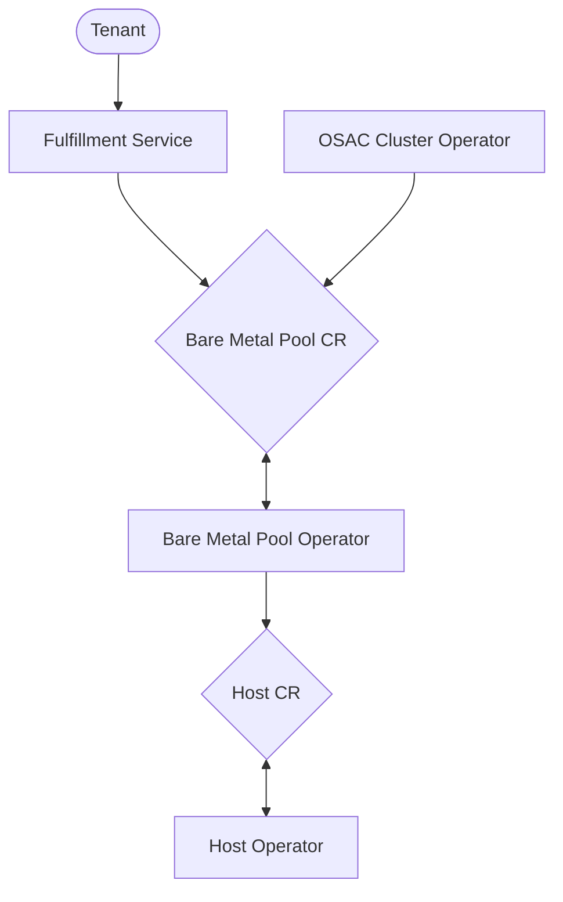

# Bare Metal Fulfillment

## Summary

Bare metal fulfillment refers to the process through which bare metal hosts are acquired and configured. Requests for bare metal fulfillment could be triggered by an OSAC tenant, or by a provider workflow, or by other OSAC fulfillment processes (such as cluster fulfillment).

## Motivation

OSAC requires the manipulation of bare metal, whether for cluster fulfillment or agent provisioning or to satisfy tenant requests. Bare metal fulfillment provides a unified API for this manipulation while also giving us a single point of integration with backend bare metal inventory and management systems.

### User Stories

* As a Cloud Provider Admin, I want a bare metal fulfillment architecture that allows support for multiple bare metal backends
* As a Cloud Provider Admin, I want to integrate OSAC with an external bare metal inventory that can still be used as a source of truth regarding the utilization of bare metal.
* As a Cloud Provider Admin, I want to utilize bare metal fulfillment in workflows such as cluster fulfillment and agent provisioning
* As a tenant user, I want to utilize bare metal fulfillment to acquire and configure hardware

### Goals

We will implement a bare metal fulfillment architecture that:

* Enables support for multiple bare metal backends
* Integrates with an external bare metal inventory and maintains it as a source of truth regarding bare metal utilization
* Allows providers to specify bare metal workflows that automate bare metal configuration (such as image provisioning)
* Is usable by tenants, providers, and within other OSAC fulfillment workflows (such as cluster fulfillment)

### Non-Goals

* This proposal does not address bare metal networking; that topic depends upon a completed OSAC Networking API, which is still in discussion and development.
* This proposal does not implement serial console access to bare metal hosts.
* This proposal does not accommodate a single OSAC environment with multiple bare metal inventories (although the architecture is designed to support this feature in the future).
* This proposal does not address reporting and billing requirements; those will be addressed in a future enhancement that exposes these resources in the fulfillment service.

## Proposal

### CRDs and Operators

We propose creating the following CRDs (full specifications can be found in the [API Extensions section](#API Extensions) below):

* **Host Lease:** Represents a lease on a host; an ephemeral resource that can be used to manipulate the host after acquisition, and which can be safely deleted when the host is released.

  * **Host Class:** Specifies how a host can be managed (OpenStack, Carbide, etc). Each Host is associated with one Host Class.
  * **Host Type:** Describes the type of hardware represented by this host. Analogous to "instance type" in AWS or "resource class" in Ironic. E.g. `fc430`, `h100`
  * **Host Template:** An Ansible role that details setup and teardown steps for an individual host.

* **Bare Metal Pool:** Represents a collection of bare metal hosts that share a common desired configuration, and which cannot be used by others for the lifetime of the bare metal pool. It specifies three items:

  * **Host Sets:** A collection of desired hosts
  * **Profile:** A configuration that specifies how the bare metal pool should behave. It specifies additional restrictions when selecting hosts, the template that should be applied to the bare metal pool, and the template that should be applied to each host. Profiles will initially be stored in a ConfigMap; a future enhancement may create Profile CRDs instead.
     * **Bare Metal Pool Template:** An Ansible role that details setup and teardown steps for a bare metal pool as a whole.

These CRDs will be managed by the following operators:

* **Host Operator:**

  * Queries the backend inventory, assigns a host, and populates the Host Lease CR with information about that host (including the Host Class).
  * Executes setup/teardown templates applicable to an individual host.
  * Allows bare metal management operations to be performed upon the associated host through modification of the Host Lease CR's `spec`. These operations will be limited to those that a Cloud Provider Admin will not need to customize; initially we will only support power management.

* **Bare Metal Pool Operator:**

  * Creates/deletes Host Lease CRs corresponding to the hosts desired for the bare metal pool.
  * Executes setup/teardown templates applicable to the entire bare metal pool (and not to individual hosts).

### Bare Metal Inventory

The host operator assumes the existence of an external bare metal inventory. This inventory must meet the following requirements:

* hosts that specify a host type (`fc430`, `h100`, etc)
* capability for arbitrary label assignment upon a host

As an example, OpenStack Ironic fulfills the first requirement through its node's `resource_class` attribute, and the second through the node's `extra` dictionary attribute.

The operator supports multiple types of inventories through a Go interface. This interface requires the following functions to be implented:

* *FindFreeHost(ctx context.Context, matchExpressions map[string]string)*: Finds an unassigned host filtered by the expressions in `matchExpressions`.
* *AssignHost(ctx context.Context, inventoryHostID string, bareMetalPoolID string, bareMetalPoolHostID string, labels map[string]string)*: Assigns the host identified in the inventory as `inventoryHostID` to the bare metal pool and host lease specified by `bareMetalPoolID` and `bareMetalPoolHostID`, while also applying the additional labels specified by `labels`.
* *UnassignHost(ctx context.Context, inventoryHostID string, labels []string)*: Unassigns the host identified in the inventory as `inventoryHostID`, while also unsetting any labels listed in `labels`.

Note that an inventory implementation may break apart the match expressions in order to perform host selection in a way specific to that implementation; for example, the OpenStack implementation will compare a `hostType` match expression against an Ironic node's `resourceClass`, while comparing any other match expressions to values found in the `extra` attribute.

A bare metal inventory will be specified in OSAC as follows:

``` yaml
name: bare-metal-inventory
type: openstack                                  # corresponds to a bare metal inventory implementation
options: <access and credentials information>
hostClass: openstack                             # applied to a Host Lease after a host is assigned
networkClass: openstack                          # applied to a Host Lease after a host is assigned
```
An inventory will be managed as a Secret, although a later enhancement may create a Bare Metal Inventory CR instead.

For now, we assume that there is exactly one bare metal inventory specified; a later enhancement may support multiple inventories.

### Bare Metal Management

The host operator will support multiple bare metal management systems through a bare metal management interface. This interface requires the following function to be implented:

* *SetHostPowerState(ctx context.Context, inventoryHostID string, targetPowerState string)*: Sets the target power state of the host identified in the inventory as `inventoryHostID`

Each `hostClass` will correspond to a specific bare metal management implementation.

### Workflow Description



Bare metal fulfillment begins with the creation of a Bare Metal Pool CR. This creation might be triggered by a tenant (through the fulfillment service), a provider (through their own workflow), or another OSAC fulfillment workflow (such as cluster fulfillment).

#### Bare Metal Pool Creation

1. The Bare Metal Pool CR is created, specifying the desired Host Set and Profile
2. The Bare Metal Pool Operator:
  * Iterates through `spec.hostSets` and creates a Host Lease CR for each requested host
    * Uses the following values when creating the Host Lease CRs
      * Adds the host set’s host type to the Host Lease CRs `spec.selector` dictionary
      * Adds the values in the profile’s `matchLabels` attribute to the Host Lease CRs `spec.selector` dictionary
      * Sets `spec.template`
        * The template ID is taken from the profile’s `hostTemplate` value
        * The template input is taken from `spec.profile.input`
    * Executes the provisioning step of the template specified by the profile’s `bareMetalPoolTemplate`
3. The Host Operator:
  * Assigns a host to individual Host Lease CRs by:
    * Querying configured Bare Metal Inventory for a host that matches the Host Lease CR’s `spec.selector` dictionary and assigns it to the Bare Metal Pool
    * Updating the Host Lease CR with information returned from the above query, as well as the `hostClass` and `networkClass` specified by the operator’s inventory configuration
  * Executes the provisioning step of the template specified by the Host Lease CR’s `spec.template`

#### Bare Metal Pool Scale Up

1. The Bare Metal Pool CR is modified to add an additional host in the specified Host Set
2. The Bare Metal Pool Operator:
  * Counts the pool’s existing Host Lease CRs against requested hosts, and creates Host Lease CRs as required
    * Uses the following values when creating the Host Lease CRs
      * Adds the host set’s host type to the Host Lease CRs `spec.selector` dictionary
      * Adds the values in the profile’s `matchLabels` attribute to the Host Lease CRs `spec.selector` dictionary
      * Sets `spec.template`
        * The template ID is taken from the profile’s `hostTemplate` value
        * The template input is taken from `spec.profile.input`
3. The Host Operator:
  * Assigns a host to new Host Lease CRs by:
    * Querying configured Bare Metal Inventory for a host that matches the Host Lease CR’s `spec.selector` dictionary and assigns it to the Bare Metal Pool
    * Updating the Host Lease CR with information returned from the above query, as well as the `hostClass` and `networkClass` specified by the operator’s inventory configuration
  * Executes the provisioning step of the template specified by the Host Lease CR’s `spec.template`

#### Bare Metal Pool Scale Down

1. The Bare Metal Pool CR is modified to remove a host in the specified Host Set
2. The Bare Metal Pool Operator:
  * Counts pool’s Host Lease CRs against requested hosts, and identifies Host Lease CRs to be removed
    * The operator may prioritize Host Lease CRs with a “to-be-removed” annotation
  * Deletes selected Host Lease CRs
3. Host Operator
  * Executes the deprovisioning step of the template specified by the Host Lease CR’s `spec.template`
  * Unsets the Host Lease CR’s `hostClass`
  * Updates the bare metal inventory to unassign the bare metal pool from the host
  * Allows Host Lease CR to be deleted

#### Bare Metal Pool Deletion

1. The Bare Metal Pool CR is deleted
2. The Bare Metal Pool Operator:
  * Deletes the pool’s Host Lease CRs
  * Executes the deprovisioning step of the template specified by the profile’s `bareMetalPoolTemplate`
  * Allows Bare Metal Pool CR to be deleted after the above operations are complete
3. The Host Operator:
  * Executes the deprovisioning step of the template specified by the Host Lease CR’s `spec.template`
  * Unsets the Host Lease CR’s `hostClass`
  * Updates the bare metal inventory to unassign the bare metal pool from the host
  * Allows Host Lease CR to be deleted

### API Extensions

#### Bare Metal Pool

The Bare Metal Pool CR acts as the entrypoint into bare metal fulfillment. For example:

``` yaml
apiVersion: osac.openshift.io/v1alpha1
kind: BareMetalPool
metadata:
  name: bm-pool-12345
  namespace: osac-namespace
spec:
  hostSets:
    - hostType: fc430
      replicas: 2
    - hostType: h100
      replicas: 1
  profile:
    name: imageProvisioning
    templateParameters: some-json-string
```

The profile allows for the automated configuration of a Bare Metal Pool. For example, an `imageProvisioning` profile might look like the following:

``` yaml
imageProvisioning:
  matchLabels:
    managedBy: None
    provisionState: available
  expectedParameters: ["imageURL"]
  bareMetalPoolTemplate: osac.templates.bm_private_network_create
  hostTemplate: osac.templates.bm_host_image_provision
```

* `matchLabels`: additional constraints to be used when selecting hosts for the Bare Metal Pool
* `bareMetalPoolTemplate`: similar to an OSAC cluster template; specifies an Ansible role with setup and tear down actions to be applied for the bare metal pool as a whole
* `hostTemplate`: similar to an OSAC cluster template; specifies an Ansible role with setup and tear down actions to be applied for an individual host
* `expectedParameters`: parameters expected by the above templates

Profiles are specified by the provider in a configuration file that can be read by the Bare Metal Pool Operator.

#### Host Lease

Host Lease CRs are created by the Bare Metal Pool Operator when it reconciles a Bare Metal Pool CR:

``` yaml
apiVersion: osac.openshift.io/v1alpha1
kind: HostLease
metadata:
  name: host-54321
  namespace: osac-namespace
  ownerReferences:
  - apiVersion: osac.openshift.io/v1alpha1
    kind: BareMetalPool
    name: bm-pool-12345
    namespace: osac-namespace
spec:
  selector:
    hostSelector:
      hostType: fc430
      managedBy: None
      provisionState: available
  templateID: osac.templates.bm_host-image-provision
  templateParameters: some-json-string
```

When a Host Lease CR is created, it is not initially associated with a host from the backend inventory. That association only occurs once the Host Operator performs reconciliation:

``` yaml
apiVersion: osac.openshift.io/v1alpha1
kind: HostLease
metadata:
  name: host-54321
  namespace: osac-namespace
  ownerReferences:
  - apiVersion: osac.openshift.io/v1alpha1
    kind: BareMetalPool
    name: bm-pool-12345
    namespace: osac-namespace
spec:
  selector:
    hostType: fc430
    managedBy: None
    provisionState: available
  templateID: osac.templates.bm_host-image-provision
  templateParameters: some-json-string
  externalID: host-id
  externalName: host-name
  hostClass: openstack
  networkClass: openstack
status:
  poweredOn: false
```

That assignment also sets the Host Lease CR's `hostClass` and `networkClass`. Once the `hostClass` is set, the Host Lease CR allows management operations against the assigned host (limited to power control for this proposal):

``` yaml
apiVersion: osac.openshift.io/v1alpha1
kind: HostLease
metadata:
  name: host-54321
  namespace: osac-namespace
  ownerReferences:
  - apiVersion: osac.openshift.io/v1alpha1
    kind: BareMetalPool
    name: bm-pool-12345
    namespace: osac-namespace
spec:
  selector:
    hostType: fc430
    managedBy: None
    provisionState: available
  templateID: osac.templates.bm_host-image-provision
  templateParameters: some-json-string
  externalID: host-id
  externalName: host-name
  hostClass: openstack
  networkClass: openstack
  poweredOn: true
status:
  poweredOn: false
```

`networkClass` is not directly utilized by the bare metal operators; however, it may be used within the templates that initialize a Host Lease.

### Implementation Details/Notes/Constraints

Bare metal fulfillment is designed to support varying bare metal inventory and management backends. These backends may often be one and the same - OpenStack Ironic, Carbide - but they may also be different - Netbox for inventory, and OpenShift BareMetalHosts for management.

We integrate with these backends through two different interfaces defined by the host operator: a bare metal inventory interface, and a bare metal management backend.

We assume that the external inventory should always contain an accurate representation of the current state of any bare metal host. As a result, we do not have an intermediate host representation within OSAC, as that merely adds an additional sync requirement.

### Risks and Mitigations

We need to integrate with a variety of bare metal backends. If our design does not allow us to do so easily, then we may find ourselves in a position where we need to restructure and recode a significant
chunk of our architecture. In order to mitigate this risk, we will clearly identify the process for integrating with a backend; and we will isolate the integration points to both minimize the needed integration work, and to reduce the impact of portions of this architecture need to be reworked.

### Drawbacks

TBD

## Alternatives (Not Implemented)

One question that has been raised is whether it's possible to standardize on a single bare metal management backend, with OpenShift BareMetalHosts identified as an ideal backend. However BareMetalHosts do not represent the temporary access to a bare metal resource that Host Leases do. In addition there are some gaps with OSAC requirements, such as the capability to support alternative bare metal backends.

## Test Plan

TBD

## Graduation Criteria

TBD

### Removing a deprecated feature

TBD

## Upgrade / Downgrade Strategy

TBD

## Version Skew Strategy

TBD

## Support Procedures

TBD

## Infrastructure Needed [optional]

None
