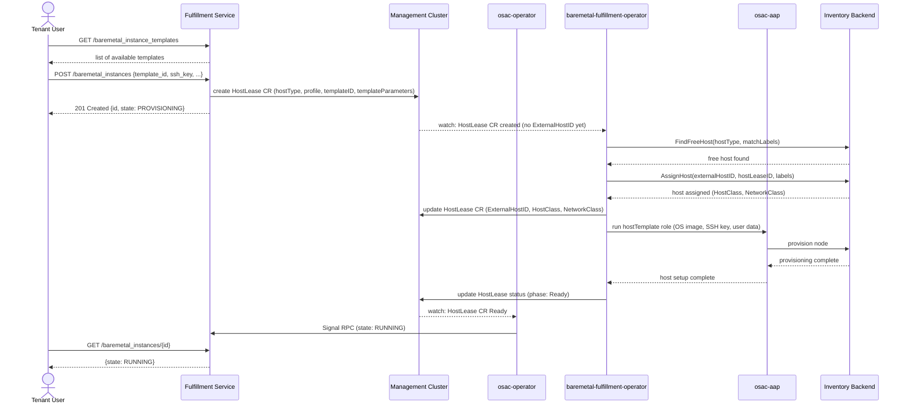

# BareMetal Instance API

## Summary

This enhancement introduces `BaremetalInstance` and `BaremetalInstanceTemplate` resources to the OSAC fulfillment-service public API, enabling tenants to provision and manage physical bare metal servers through a self-service interface. Templates encode the default instance type, OS base image, and network configuration and are published by Cloud Provider Admins via `osac-aap`. The design adopts a pluggable provider architecture — implemented in a dedicated baremetal fulfillment component — so that future bare metal backends can be integrated without breaking the API. This EP is scoped to the fulfillment-service API layer; operator, provisioning, UX, and E2E concerns are tracked as companion work items under OSAC-1118.

## Motivation

OSAC currently provides no fulfillment path for workloads requiring direct hardware access. Tenants running GPU-intensive, high-performance networking, or latency-sensitive workloads have no self-service mechanism to request and manage bare metal nodes through OSAC.

### User Stories

* As a **Tenant User**, I want to browse available `BaremetalInstanceTemplate` objects so that I can select the one that matches my workload requirements.
* As a **Tenant User**, I want to provision a bare metal server by specifying a `BaremetalInstanceTemplate` so that I can run workloads that require direct hardware access without manual coordination with the cloud provider.
* As a **Tenant User**, I want to monitor the lifecycle state of my bare metal server (provisioning, running, failed) so that I can take corrective action if provisioning fails.
* As a **Tenant User**, I want to control the run strategy (power on/off) of my bare metal server so that I can manage its operational state without deprovisioning it.
* As a **Tenant User**, I want to restart my bare metal server so that I can perform maintenance without deprovisioning it.
* As a **Tenant User**, I want to deprovision my bare metal server when my workload is complete so that resources are released.
* As a **Cloud Provider Admin**, I want to define and publish `BaremetalInstanceTemplate` objects so that I can control which hardware profiles and OS images are available to tenants.
* As a **Cloud Infrastructure Admin**, I want the OSAC stack to integrate with BCM (NVIDIA Base Command Manager) so that bare metal provisioning is automated through the existing control plane.

### Goals

* Provide a self-service API for tenants to create `BaremetalInstance` resources referencing a `BaremetalInstanceTemplate`.
* Define `BaremetalInstanceTemplate` as a provider-managed global catalog resource exposing the available hardware profile, OS base image, and default network configuration.
* Align the `BaremetalInstance` API shape with the existing `ComputeInstance` API (same `id`, `metadata`, `spec`, `status` envelope, same condition and state patterns, same run strategy and restart signal mechanism).
* Expose the API through both gRPC and the existing REST gateway.

### Non-Goals

* Integration with OSAC networking resources (`VirtualNetwork`, `Subnet`, `SecurityGroup`) — deferred to a future enhancement; in this initial phase, network configuration is fixed by the Cloud Provider Admin as part of the `BaremetalInstanceTemplate` and tenants have no mechanism to configure networking at provision time. A dedicated networking enhancement will enable tenants to create their own `Subnet` and attach it to a `BaremetalInstance`.
* Custom hardware profile or OS image selection by tenants at provision time — fixed by the template. Tenants requiring a different profile must request the Cloud Provider Admin to publish a new template.
* Per-organization template scoping — templates are global; a BMaaS catalog feature is deferred to a future enhancement.
* `osac-operator` CRD definitions and controller implementation — covered in companion work.
* AAP playbook implementation — covered in companion work.
* Baremetal fulfillment component implementation — covered in companion work.

  The intended division of responsibility between these two components is: the baremetal-fulfillment-operator handles host assignment and host-level provisioning (via `HostLease` CRs and `osac-aap`); the osac-operator watches `HostLease` CRs for status changes and pushes them back to the fulfillment service via the `Signal` RPC. See the Workflow Description section for details.
* UI and UX — covered in companion work.
* E2E test implementation — covered in companion work.
* Support for multiple bare metal backends in this initial release — the architecture is designed for future extensibility.
* Quota enforcement for `BaremetalInstance` — deferred to a future enhancement.

## Proposal

The proposal introduces two new resource types to the fulfillment-service public API:

**`BaremetalInstanceTemplate`** is a provider-defined, read-only resource that encodes a validated combination of hardware profile (instance flavor), OS base image, and default network configuration. Templates are defined by Cloud Provider Admins as Ansible roles in `osac-aap` and published to the fulfillment service via the provisioning pipeline. Tenants discover available templates via List/Get and reference one when creating a `BaremetalInstance`. This mirrors the role of `ComputeInstanceTemplate` for VMs.

**`BaremetalInstance`** is a tenant-created resource representing a provisioned bare metal server. Its `spec` references a template and carries provisioning parameters (SSH public key, user data, run strategy, restart signal). Its `status` exposes the lifecycle state and conditions aligned with the `ComputeInstance` pattern.

Provisioning is driven by a chain of components: the fulfillment service creates a `HostLease` CR in the management cluster when a `BaremetalInstance` is created. The baremetal fulfillment operator picks up the `HostLease`, finds and assigns a free host from the inventory backend, and triggers `osac-aap` for host-level setup (OS image, SSH key, user data). The osac-operator watches `HostLease` CRs for status changes and pushes updates back to the fulfillment service via the `Signal` RPC. `HostLease` is an internal implementation detail; tenants never interact with it directly.

### Workflow Description

**Actors:**
- **Cloud Provider Admin** — defines `BaremetalInstanceTemplate` objects as Ansible roles in `osac-aap`; templates are published to the fulfillment service via the provisioning pipeline.
- **Tenant User** — creates and manages `BaremetalInstance` resources via the public API.
- **Fulfillment Service** — handles `BaremetalInstance` CRUD and creates `HostLease` CRs directly in the management cluster.
- **osac-operator** — watches `HostLease` CRs for status changes and pushes them to the fulfillment service via the `Signal` RPC; does not create any CRs in this flow.
- **baremetal-fulfillment-operator** — reconciles `HostLease` CRs: finds and assigns a free host from the inventory backend, then triggers `osac-aap` for host-level provisioning.
- **osac-aap** — executes the provisioning and deprovisioning Ansible roles (OS image, SSH key, user data); triggered by the baremetal-fulfillment-operator.
- **Inventory Backend** — the bare metal inventory used to find and assign free hosts (e.g. OpenStack Ironic or BCM).

#### Provisioning

1. The Cloud Provider Admin defines one or more `BaremetalInstanceTemplate` objects as Ansible roles in `osac-aap`. The provisioning pipeline applies these roles and publishes the resulting templates to the fulfillment service.
2. The Tenant User lists available templates:
   ```
   GET /api/fulfillment/v1/baremetal_instance_templates
   ```
3. The Tenant User creates a `BaremetalInstance` referencing the desired template:
   ```
   POST /api/fulfillment/v1/baremetal_instances
   ```
4. The fulfillment service creates a `HostLease` CR in the management cluster; `BaremetalInstance.status.state` is set to `BAREMETAL_INSTANCE_STATE_PROVISIONING`.
5. The baremetal-fulfillment-operator picks up the `HostLease` and queries the inventory backend to find and assign a free host matching the requested host type and selector.
6. The baremetal-fulfillment-operator triggers `osac-aap` to run the host-level provisioning template (OS image, SSH key, user data) and updates the `HostLease` status on completion.
7. The osac-operator watches the `HostLease` CR and pushes status updates to the fulfillment service via the `Signal` RPC; the fulfillment service reflects this in `BaremetalInstance.status`.
8. The Tenant User polls until `status.state` is `BAREMETAL_INSTANCE_STATE_RUNNING`:
   ```
   GET /api/fulfillment/v1/baremetal_instances/{id}
   ```

#### Failure Handling

If any step in the provisioning chain fails (playbook error, BCM API failure, `HostLease` stuck), the osac-operator sets `BaremetalInstance.status.state` to `BAREMETAL_INSTANCE_STATE_FAILED` via the `Signal` RPC. The tenant can inspect the `conditions` field for details. To retry, the tenant deletes and recreates the `BaremetalInstance`; note that recreating may result in a different physical host being assigned from the inventory.

#### Deprovisioning

1. The Tenant User deletes the instance:
   ```
   DELETE /api/fulfillment/v1/baremetal_instances/{id}
   ```
2. The fulfillment service deletes the `HostLease` CR; `BaremetalInstance.status.state` transitions to `BAREMETAL_INSTANCE_STATE_DELETING`.
3. The baremetal-fulfillment-operator reconciles the `HostLease` deletion: triggers `osac-aap` for the host-level deprovisioning template, then unassigns the host from the inventory backend.
4. The osac-operator watches the `HostLease` CR deletion and pushes final status via the `Signal` RPC.
5. The `BaremetalInstance` resource is removed once deprovisioning completes.

#### Provisioning Sequence



### API Extensions

**New gRPC services (public API):**
- `BaremetalInstances` — CRUD for tenant-managed bare metal instances.
- `BaremetalInstanceTemplates` — List/Get for provider-defined templates (read-only for tenants).

**New gRPC service (private API):**
- `BaremetalInstances` (private) — adds the `Signal` RPC for `osac-operator` feedback, following the existing `ComputeInstances` private API pattern.

**REST gateway routes:**
- `GET    /api/fulfillment/v1/baremetal_instance_templates`
- `GET    /api/fulfillment/v1/baremetal_instance_templates/{id}`
- `GET    /api/fulfillment/v1/baremetal_instances`
- `GET    /api/fulfillment/v1/baremetal_instances/{id}`
- `POST   /api/fulfillment/v1/baremetal_instances`
- `PATCH  /api/fulfillment/v1/baremetal_instances/{object.id}` — `{object.id}` is the gRPC-gateway convention for PATCH: the request body carries the full object and the ID is bound via `object.id`, matching the `ComputeInstance` pattern.
- `DELETE /api/fulfillment/v1/baremetal_instances/{id}`

**PATCH semantics:** The `PATCH` endpoint supports partial updates to mutable fields only: `run_strategy` and `restart_requested_at`. The `template`, `ssh_key`, and `user_data` fields are immutable after creation; requests that attempt to modify them are rejected with `400 Bad Request`. A `FieldMask` is applied automatically from the fields present in the request body.

### Implementation Details/Notes/Constraints

#### Proto: BaremetalInstanceTemplate

```protobuf
message BaremetalInstanceTemplate {
  string id = 1;
  Metadata metadata = 2;

  // Human-friendly short description (CLI/UI single-line display).
  string title = 3;

  // Human-friendly long description in Markdown format.
  string description = 4;

  // Default spec values applied when creating a BaremetalInstance from this template.
  BaremetalInstanceTemplateSpecDefaults spec_defaults = 5;
}

// BaremetalInstanceTemplateSpecDefaults follows the same convention as other OSAC template types.
// No overridable spec fields are defined in this initial version; fields will be added in future
// enhancements as tenant-configurable options are introduced (e.g. networking integration).
message BaremetalInstanceTemplateSpecDefaults {}
```

#### Proto: BaremetalInstance

```protobuf
message BaremetalInstance {
  string id = 1;
  Metadata metadata = 2;
  BaremetalInstanceSpec spec = 3;
  BaremetalInstanceStatus status = 4;
}

message BaremetalInstanceSpec {
  // Reference to the BaremetalInstanceTemplate. Required on create; immutable after creation.
  string template = 1;

  // SSH public key injected into the OS at provisioning time. Immutable after creation.
  // Must be a valid SSH public key in OpenSSH format (ssh-rsa, ssh-ed25519, etc.).
  // Invalid keys are rejected at create time with a 400 error.
  optional string ssh_key = 2;

  // User data (e.g. cloud-init). Passed to the OS at first boot. Immutable after creation.
  // Maximum size: 64 KB.
  optional string user_data = 3;

  // Run strategy controls the power state of the bare metal instance (on/off).
  // Named run_strategy for alignment with ComputeInstance; an enum is used rather
  // than a boolean to leave room for future states (e.g. suspended backends).
  optional BaremetalInstanceRunStrategy run_strategy = 4;

  // RestartRequestedAt is a timestamp signal to request a power cycle.
  // Set to the current time to trigger an immediate restart.
  // The controller executes the restart if this timestamp is greater than status.last_restarted_at.
  optional google.protobuf.Timestamp restart_requested_at = 5;
}

message BaremetalInstanceStatus {
  BaremetalInstanceState state = 1;
  repeated BaremetalInstanceCondition conditions = 2;

  // LastRestartedAt records when the last restart was initiated by the controller.
  optional google.protobuf.Timestamp last_restarted_at = 3;
}

enum BaremetalInstanceRunStrategy {
  BAREMETAL_INSTANCE_RUN_STRATEGY_UNSPECIFIED = 0;

  // The instance is kept powered on.
  BAREMETAL_INSTANCE_RUN_STRATEGY_ALWAYS      = 1;

  // The instance is powered off.
  BAREMETAL_INSTANCE_RUN_STRATEGY_HALTED      = 2;
}

enum BaremetalInstanceState {
  BAREMETAL_INSTANCE_STATE_UNSPECIFIED  = 0;
  BAREMETAL_INSTANCE_STATE_PROVISIONING = 1;
  BAREMETAL_INSTANCE_STATE_RUNNING      = 2;
  BAREMETAL_INSTANCE_STATE_FAILED       = 3;
  BAREMETAL_INSTANCE_STATE_DELETING     = 4;
}

enum BaremetalInstanceConditionType {
  BAREMETAL_INSTANCE_CONDITION_TYPE_UNSPECIFIED           = 0;

  // Infrastructure has been allocated to this instance by the baremetal fulfillment component.
  BAREMETAL_INSTANCE_CONDITION_TYPE_PROVISIONED           = 1;

  // OS image and user configuration have been applied by the provisioning provider.
  BAREMETAL_INSTANCE_CONDITION_TYPE_CONFIGURATION_APPLIED = 2;

  // The machine is available and assigned to the tenant (HostLease active).
  // Does not indicate OS readiness — the tenant is responsible for OS-level checks.
  BAREMETAL_INSTANCE_CONDITION_TYPE_READY                 = 3;

  // A power cycle (restart) is currently in progress.
  BAREMETAL_INSTANCE_CONDITION_TYPE_RESTART_IN_PROGRESS   = 4;

  // A restart request has failed.
  BAREMETAL_INSTANCE_CONDITION_TYPE_RESTART_FAILED        = 5;

  // Configuration changes require a restart to take effect.
  BAREMETAL_INSTANCE_CONDITION_TYPE_RESTART_REQUIRED      = 6;
}
```

#### Alignment with ComputeInstance

`BaremetalInstance` intentionally mirrors `ComputeInstance`:
- Same `id` + `Metadata` + `spec` + `status` envelope.
- Same condition shape (`ConditionStatus`, `last_transition_time`, `reason`, `message`).
- Same CRUD service shape and REST route pattern (`/api/fulfillment/v1/<resource>`).
- Same private API `Signal` RPC for `osac-operator` feedback loop.
- Same run strategy (`run_strategy`) and restart signal mechanism (`restart_requested_at`, `last_restarted_at`).

Fields specific to VMs (network attachments) are absent from `BaremetalInstance` in this initial version and may be added in future enhancements.

### Risks and Mitigations

**Risk:** Backend API changes break the provisioning path.
**Mitigation:** The provider abstraction in the baremetal fulfillment component isolates backend-specific code. Integration tests run against a BCM-compatible environment in CI.

**Risk:** Long provisioning times (bare metal typically takes 10–30 minutes) confuse tenants or expose timeout issues.
**Mitigation:** The `PROVISIONING` state and condition set give clear asynchronous progress signals. No API call blocks on physical provisioning; the osac-operator and baremetal fulfillment component reconcile asynchronously.

**Risk:** Tenant isolation errors — one tenant accesses or deprovisions another tenant's bare metal instance.
**Mitigation:** Follows the same OPA-based authorization model as `ComputeInstance`. Tenant scoping is enforced at the fulfillment-service layer via existing middleware.

**Risk:** Tenants provision unlimited bare metal instances, exhausting backend capacity.
**Mitigation:** Quota enforcement for `BaremetalInstance` is deferred to a future enhancement. Until quotas are implemented, capacity limits must be managed out-of-band by the Cloud Provider Admin.

**Risk:** Compromised backend credentials expose the bare metal backend to unauthorized access.
**Mitigation:** Credential storage and management for the baremetal backend are out of scope for this EP and will be defined in a dedicated security enhancement. The baremetal fulfillment component must not embed credentials in CRDs or API responses.

### Drawbacks

Adding `BaremetalInstance` as a fulfillment-service abstraction over `HostLease` introduces a translation layer. This is an explicit trade-off: it preserves tenant-facing API stability and alignment with OSAC conventions at the cost of keeping the two representations in sync.

## Alternatives (Not Implemented)

**Expose `HostLease` directly as the tenant-facing API instead of introducing `BaremetalInstance`.** This avoids the translation layer between `BaremetalInstance` and `HostLease`. However, `HostLease` is also used by cluster-as-a-service and agent provisioning workflows that do not go through the fulfillment service; coupling the public API schema to it would expose internal provisioning details to tenants and prevent independent evolution of the public API. The `BaremetalInstance` API shape also aligns with OSAC conventions (`id` + `metadata` + `spec` + `status`, same `Signal` RPC feedback loop as `ComputeInstance`) in a way that `HostLease` does not.

**Map `BaremetalInstance` to the existing `ComputeInstance` resource with a baremetal flag.** This avoids a new resource type but conflates VM and bare metal semantics, complicates template definitions, and requires dispatching on a field value rather than resource type. A dedicated resource type provides cleaner separation of concerns and allows independent API evolution.

**Expose the bare metal backend API directly to tenants.** This bypasses OSAC entirely, eliminating tenant isolation, quota enforcement, and the pluggable backend architecture. Not viable for a multi-tenant cloud platform.

## Open Questions

1. ~~Should `BaremetalInstance` and `HostLease` be the same object, or remain distinct?~~ **Closed:** Distinct. The fulfillment service creates a `HostLease` as the internal backend CRD, but `HostLease` is also used by other workflows (cluster-as-a-service, agent provisioning) that bypass the fulfillment service entirely. Coupling the public API schema to `HostLease` would make future consolidation a breaking change.

## Test Plan

Test plan will be finalized during the implementation phase. Expected coverage:

- **Unit tests:** Proto field validation, state machine transitions, provider interface mocking.
- **Integration tests:** `BaremetalInstance` CRUD via gRPC, template List/Get, Signal RPC feedback loop, OPA authorization enforcement, PATCH immutability enforcement.
- **E2E tests:** Full provisioning and deprovisioning workflow against BCM; CI pipeline configured to run E2E tests on merge.

Tricky areas: asynchronous provisioning lifecycle (tests must handle delays or mock the provider), template immutability enforcement after create, tenant isolation boundary checks, and failure-path recovery (FAILED state → delete → recreate).

## Graduation Criteria

Graduation criteria will be defined when targeting a release. Expected progression:

- **Dev Preview:** API available, BCM backend functional, basic CRUD working end-to-end.
- **Tech Preview:** E2E tests passing in CI, UX available, pluggable backend architecture validated with at least one additional backend stub.
- **GA:** Production deployment, full test coverage, support procedures operationally validated.

## Upgrade / Downgrade Strategy

This is a new API with no impact on existing resources. Downgrading requires deleting all `BaremetalInstance` and `BaremetalInstanceTemplate` resources and uninstalling the new CRDs from the management cluster before reverting the fulfillment-service image.

## Version Skew Strategy

The fulfillment-service, baremetal-fulfillment-operator, and osac-operator must be upgraded together. If the baremetal-fulfillment-operator is not running, `HostLease` CRs will not be reconciled and new `BaremetalInstance` create requests will remain in `PROVISIONING` indefinitely. If the osac-operator baremetal controller is not running, status updates will not propagate back to the fulfillment service.

## Support Procedures

**Symptom:** `BaremetalInstance` stuck in `BAREMETAL_INSTANCE_STATE_PROVISIONING`.
**Diagnosis:** Check baremetal-fulfillment-operator logs for inventory or AAP errors. Check osac-aap job logs for playbook failures. Verify the `HostLease` CR exists and that `ExternalHostID` has been set (indicates host was found in inventory).
**Resolution:** If the host was allocated but provisioning failed, delete the `HostLease` CR manually and delete the `BaremetalInstance` to trigger a clean retry.

**Symptom:** All `BaremetalInstance` creations remain in `BAREMETAL_INSTANCE_STATE_PROVISIONING` with no `HostLease` created.
**Diagnosis:** The fulfillment service may not be able to reach the management cluster API. Check fulfillment-service logs for Kubernetes API errors.
**Resolution:** Verify management cluster connectivity and credentials used by the fulfillment service.

**Symptom:** All `BaremetalInstance` creations transition to `BAREMETAL_INSTANCE_STATE_FAILED`.
**Diagnosis:** Check baremetal-fulfillment-operator logs for inventory API or AAP errors. Validate inventory backend credentials, verify AAP availability, and confirm network connectivity.
**Resolution:** Rotate credentials if expired, resolve network connectivity issues, then retry by deleting the failed `BaremetalInstance` and recreating it.

**Symptom:** Create returns `404 Not Found` for the template ID.
**Diagnosis:** The `BaremetalInstanceTemplate` does not exist or is not visible to the tenant's organization.
**Resolution:** Cloud Provider Admin must create and publish the appropriate template via `osac-aap`.

**Disabling the API:** Scale the baremetal-fulfillment-operator and the osac-operator baremetal controller to 0 replicas. Existing `HostLease` CRs persist but are not reconciled. Re-enabling both resumes reconciliation without data loss.

## Infrastructure Needed

BCM (NVIDIA Base Command Manager) access (credentials, API endpoint) is required for integration and E2E testing. This infrastructure is managed by the cloud provider and must be provisioned as part of the OSAC CI environment setup.
