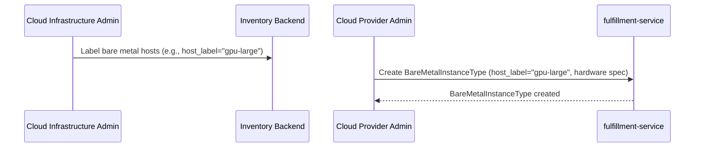
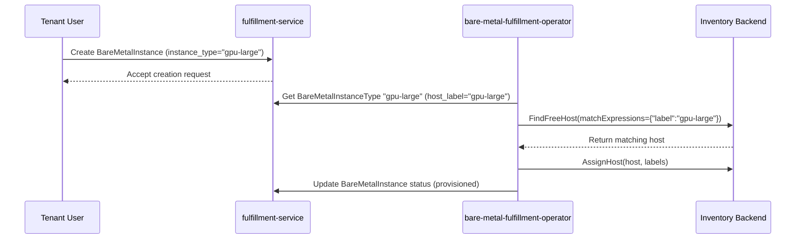

# Bare Metal Instance Types

## Summary

This enhancement introduces BareMetalInstanceType resources that provide a discoverable hardware type catalog for bare metal infrastructure provisioning. Cloud Provider Admins define BareMetalInstanceTypes via the OSAC API, specifying hardware metadata and a host label selector. Cloud Infrastructure Admins label inventory hosts to classify them by hardware profile. During provisioning, the BMaaS operator reads the selected BareMetalInstanceType, extracts its host label, and passes it to the inventory client to claim a matching host.

**Architectural Role:** BareMetalInstanceTypes serve as a user-facing discovery and selection mechanism. Once a Tenant User selects a type, the label on that type drives host selection in the inventory backend. The enhancement transforms opaque bareMetalInstanceType strings into a rich, discoverable catalog while keeping host-selection logic in the BMaaS operator where it already lives.

**Terminology Evolution:** This design standardizes terminology by replacing legacy references to "hostType", "host_type", and "HostType" with consistent "BareMetalInstanceType" naming throughout the system.

## Motivation

OSAC currently lacks a concept of hardware types surfaced from inventory backends, forcing users to work with opaque bareMetalInstanceType strings in cluster templates and bare metal configurations. This prevents tenant users from knowing what hardware types exist based on CPU, memory, accelerators, and other specifications when provisioning bare metal instances or clusters.

The current system provides no visibility into available hardware types, their specifications, or what inventory hosts back them. Users cannot make informed decisions about which hardware types suit their workloads, and cluster catalog items cannot reference specific hardware types for agent provisioning.

This design addresses these limitations by introducing a manually-administered hardware type catalog where Cloud Provider Admins define types with host label selectors, Cloud Infrastructure Admins label hosts accordingly, and the BMaaS operator resolves the label at provisioning time to claim a matching host.

### Goals

- Reuse the existing resource management patterns for consistency with OSAC's architecture
- Support both direct BareMetalInstance and Cluster creation, integrating their catalog items with hardware types
- Enable Cloud Provider Admins to define BareMetalInstanceTypes with host label selectors that the BMaaS operator uses to claim matching inventory hosts during provisioning
- Maintain backward compatibility with existing catalog_item-based bare metal instance creation

### Non-Goals

- Billing or metering integration with inventory backends
- Storage inventory beyond basic local storage metadata
- Multi-backend inventory collision handling (single backend per deployment)
- Automatic discovery and creation of BareMetalInstanceTypes from inventory backends
- Complex lifecycle management with deprecation workflows

## Proposal

This enhancement adds BareMetalInstanceType resources to the fulfillment-service following established API patterns. Cloud Provider Admins create BareMetalInstanceType resources specifying hardware metadata and a host label selector. Cloud Infrastructure Admins apply matching labels to inventory hosts. Tenant users list and select available types, then reference them when creating BareMetalInstances or Clusters through catalog items. At provisioning time, the BMaaS operator reads the selected type's label and passes it to the inventory client to claim a matching host.

The design introduces three primary components: BareMetalInstanceType gRPC services in fulfillment-service, label-based host selection in bare-metal-fulfillment-operator, and integration points in existing bare metal workflows.

### Workflow Description

**Primary Actors:**
- **Cloud Infrastructure Admins:** Label inventory hosts by hardware profile and configure inventory backend connection
- **Cloud Provider Admins:** Create and manage BareMetalInstanceType resources with host label selectors matching the labels applied by Cloud Infrastructure Admins
- **Tenant Users:** Discover and select hardware types for bare metal provisioning

**Administrative Setup Workflow:**



Cloud Infrastructure Admins apply a label (e.g., `"gpu-large"`) to all inventory hosts that share that hardware profile. Cloud Provider Admins then create a corresponding BareMetalInstanceType in OSAC with the same label and the hardware metadata that describes those hosts. These two steps must be coordinated out-of-band — OSAC does not validate that the label on a BareMetalInstanceType matches any actual hosts at creation time.

**Tenant Usage Workflow:**

1. **Discovery:** Tenant user lists available BareMetalInstanceTypes via UI, CLI, or API [FR-1]
2. **Selection:** User examines hardware specifications and selects appropriate type based on workload requirements
3. **Creation:** User creates BareMetalInstance with instance_type field referencing the selected type [FR-2], or creates Cluster with instance_type field for bare metal node sets [FR-3]
4. **Provisioning:** BMaaS operator reads the BareMetalInstanceType, extracts the host_label, and passes it to the inventory client to claim a matching labeled host [FR-7]

**Provisioning Workflow:**



**Error Handling:**
- **No matching hosts:** Operator sets BareMetalInstance to a failed/pending state with an explanatory status condition; no silent substitution with non-matching hardware
- **Invalid type reference:** Operator logs error and sets status condition; provisioning does not proceed

### API Extensions

This enhancement adds the following API extensions to fulfillment-service:

**New gRPC Services:**
- `BareMetalInstanceTypes` (public) — List/Get operations for tenant discovery
- `PrivateBareMetalInstanceTypes` (private) — Full CRUD + Signal RPC for Cloud Provider Admin management

**Modified Services:**
- `BareMetalInstances` — Add instance_type field support
- `Clusters` — Support BareMetalInstanceType selection for cluster node sets [FR-3]
- `ClusterCatalogItems` — Enable BareMetalInstanceType selection during cluster provisioning workflow
- `BareMetalInstanceCatalogItems` — Enhanced to work with BareMetalInstanceType selection
- `ClusterTemplates` — Support BareMetalInstanceType references in node set definitions

**New Database Tables:**
- `bare_metal_instance_types` — Follows standard DAO schema pattern with JSON-serialized protobuf data

**Controller Extensions:**
- Enhanced BareMetalInstance controller in bare-metal-fulfillment-operator to read the selected BareMetalInstanceType's host_label and pass it as a matchExpression to `inventory.Client.FindFreeHost` during provisioning [FR-7]

**Operational Impact:**
- fulfillment-service downtime prevents BareMetalInstanceType queries and new instance creation but does not affect in-flight provisioning in the operator
- Inventory backend downtime during provisioning causes the operator to retry with backoff; no impact on listing or type management

### Implementation Details/Notes/Constraints

**BareMetalInstanceType Proto Schema:** [FR-4]

```protobuf
// Public API
message BareMetalInstanceType {
  string id = 1;
  Metadata metadata = 2;
  BareMetalInstanceTypeSpec spec = 3;
  BareMetalInstanceTypeStatus status = 4;
}

message BareMetalInstanceTypeSpec {
  BareMetalHardwareSpec hardware = 1;           // Hardware specifications
  string host_label = 2;                        // Inventory host label set by Cloud Infra Admin
  string description = 3;                       // Human-readable description
}

message BareMetalInstanceTypeStatus {
  // Reserved for future status fields
}

message BareMetalHardwareSpec {
  BareMetalCPUSpec cpu = 1;                     // CPU specifications
  BareMetalMemorySpec memory = 2;               // Memory specifications
  BareMetalStorageSpec storage = 3;             // Storage specifications
  repeated BareMetalAcceleratorSpec accelerators = 4;  // GPU, FPGA, TPU, and other accelerators
  repeated BareMetalNetworkPortSpec network_ports = 5; // Network interfaces
  map<string, string> capabilities = 6;        // Freeform capability tags
}

message BareMetalCPUSpec {
  int32 cores = 1;                              // Total CPU cores
  string architecture = 2;                      // x86_64, aarch64, etc.
  string model = 3;                             // CPU model name
  int32 threads_per_core = 4;                   // Hyperthreading factor
}

message BareMetalMemorySpec {
  int64 total_gb = 1;                           // Total memory in GB
  string type = 2;                              // DDR4, DDR5, etc.
}

message BareMetalStorageSpec {
  repeated BareMetalDiskSpec disks = 1;         // Individual disks
  int64 total_capacity_gb = 2;                  // Total capacity
}

message BareMetalDiskSpec {
  string type = 1;                              // SSD, NVMe, HDD
  int64 capacity_gb = 2;                        // Disk capacity
  string interface = 3;                         // SATA, NVMe, SAS
}

message BareMetalAcceleratorSpec {
  string type = 1;                              // GPU, FPGA, TPU, etc.
  string model = 2;                             // Specific model
  optional string vendor = 3;                   // NVIDIA, AMD, Intel, etc.
  optional int32 memory_gb = 4;                 // Accelerator memory (if applicable)
}

message BareMetalNetworkPortSpec {
  string type = 1;                              // Ethernet, InfiniBand
  string speed = 2;                             // 1Gbps, 10Gbps, etc.
  int32 count = 3;                              // Number of ports
}
```

**BareMetalInstance Integration:**

The BareMetalInstanceSpec message adds a required instance_type field, differing from the ComputeInstance pattern where instance_type is optional [Codebase: fulfillment-service/proto/public/osac/public/v1/compute_instance_type.proto]. Unlike VMs which allow flexible CPU/memory specification, bare metal hardware has fixed configurations requiring type selection:

```protobuf
message BareMetalInstanceSpec {
  // Existing fields preserved for backward compatibility
  string catalog_item = 1;
  // ... other existing fields ...

  // Required field - unlike ComputeInstance, bare metal hardware configurations are fixed
  // Both catalog_item and instance_type are required: catalog_item defines provisioning template,
  // instance_type specifies which BareMetalInstanceType (and therefore which inventory label)
  // the operator should use to claim a host
  string instance_type = 20;                    // Reference to BareMetalInstanceType name
}
```

**Host Label Selection Implementation:** [FR-5, FR-6, FR-7]

The bare-metal-fulfillment-operator extends its BareMetalInstance reconciler to perform label-based host selection:

1. Read the `instance_type` field from the BareMetalInstanceSpec
2. Query fulfillment-service private API to retrieve the corresponding BareMetalInstanceType and its `host_label`
3. Call `inventory.Client.FindFreeHost(ctx, map[string]string{"label": host_label})` to claim a matching host
4. Proceed with provisioning using the claimed host; if no host matches, set a status condition and requeue

The existing `inventory.Client` interface [Codebase: bare-metal-fulfillment-operator/internal/inventory/client.go] already supports `matchExpressions map[string]string` in `FindFreeHost`, requiring no interface changes. Each inventory backend implementation (openstack.go, metal3.go) must translate the matchExpression to the backend's native label query mechanism.

**Cloud Provider Admin Workflow:**

Cloud Provider Admins use the private API (or CLI) to create BareMetalInstanceType resources:

```yaml
# Example: creating a BareMetalInstanceType
name: gpu-large
spec:
  host_label: "gpu-large"          # Must match label applied by Cloud Infra Admin
  description: "Large GPU node with dual A100"
  hardware:
    cpu:
      cores: 64
      architecture: x86_64
    memory:
      total_gb: 512
    accelerators:
      - type: GPU
        model: A100
        vendor: NVIDIA
        memory_gb: 80
        count: 2
```

Cloud Infrastructure Admins apply the matching label to inventory hosts via the inventory backend's native mechanisms (e.g., OpenStack Ironic node metadata, Metal3 BareMetalHost labels). OSAC does not validate label consistency at type-creation time — this coordination is an operational responsibility.

**Performance Considerations:**

- **Listing Operations:** [NFR-1] BareMetalInstanceType listing uses the same CEL filtering infrastructure as existing resources, ensuring consistent performance
- **Provisioning Label Lookup:** [NFR-2] The operator fetches the BareMetalInstanceType once per reconciliation cycle; the result may be cached within a reconciliation loop. The fulfillment-service read is a single gRPC call that does not impact provisioning latency significantly.

**Integration with ClusterCatalogItems:** [FR-3]

ClusterTemplateNodeSet objects are extended to reference BareMetalInstanceTypes:

```protobuf
message ClusterTemplateNodeSet {
  string host_type = 1;                         // Deprecated (legacy hostType) - kept for backward compatibility
  string bare_metal_instance_type = 2;          // Required field referencing BareMetalInstanceType
  int32 size = 3;
}
```

**Database Schema Considerations:**

BareMetalInstanceTypes follow the generic DAO pattern with JSON-serialized protobuf storage [Codebase: fulfillment-service/]. The `host_label` field is stored within the JSON blob; no materialized helper tables are needed since listing does not require label-based filtering.

### Security Considerations

This enhancement inherits the existing security model without introducing new attack vectors. BareMetalInstanceType resources follow standard tenant isolation patterns:

- **Tenant Isolation:** All BareMetalInstanceType resources include `osac.openshift.io/tenant` annotations for multi-tenant filtering, though most types are globally visible
- **Input Validation:** Hardware metadata undergoes protobuf validation; malformed data is rejected at API creation time
- **Authorization:** BareMetalInstanceType listing and selection uses existing tenant-based RBAC without additional permissions
- **Inventory Backend Access:** The BMaaS operator uses configured credentials with least-privilege access to inventory APIs for host selection

Platform-defined BareMetalInstanceTypes are globally visible across tenants, similar to PublicIPPool resources, enabling hardware type sharing while maintaining provisioning isolation.

### Failure Handling and Recovery

**No Matching Hosts:**
- Operator sets a status condition (e.g., `HostSelectionFailed`) on the BareMetalInstance with a message indicating no hosts matched the label
- Operator requeues with backoff; does not substitute a non-matching host
- No silent capability mismatch — FR-7 enforcement is strict

**Invalid instance_type Reference:**
- Operator sets a status condition indicating the referenced BareMetalInstanceType does not exist
- Provisioning does not proceed until the reference is corrected

**Label Mismatch (Cloud Infra Admin / Cloud Provider Admin Coordination Failure):**
- If no inventory hosts carry the label specified in the BareMetalInstanceType, provisioning fails with `HostSelectionFailed`
- This is an operational issue; no automated remediation — operator surfaces it via status conditions and events

**Reconciliation Behavior:**
- Controller restart: operator re-reads BareMetalInstanceType on next reconcile; no state stored across restarts for type lookup
- Database connection loss: standard DAO retry behavior applies
- Inventory backend unavailability: operator retries with exponential backoff; status condition reflects retry state

**Idempotency Guarantees:**
- BareMetalInstance creation with instance_type is idempotent; duplicate requests return existing instance
- Host selection is idempotent for a given BareMetalInstance: once a host is claimed, the operator stores the host ID and does not re-select on subsequent reconciles

### RBAC / Tenancy

**Tenant Isolation Requirements:**
All BareMetalInstanceType resources include required tenant isolation metadata:
- `osac.openshift.io/tenant`: Tenant scoping (often empty for globally-visible types)
- `osac.openshift.io/owner-reference`: Resource hierarchy for cleanup

**Visibility Model:**
- **Platform types:** Globally visible across tenants (empty tenant annotation) to enable hardware sharing
- **Filtered listing:** Public API respects tenant visibility rules; private API allows cross-tenant access for Cloud Provider Admins

**RBAC Rules:**
No new RBAC permissions required. BareMetalInstanceType operations use existing tenant-based authorization:
- **Listing:** Tenant users see globally-visible types plus tenant-scoped types
- **Management:** Cloud Provider Admins use the private API with service account credentials

**OPA Policy Enforcement:**
Existing OPA policies automatically apply to BareMetalInstanceType resources through standard annotation-based filtering. No policy changes required.

### Observability and Monitoring

**New Prometheus Metrics:**
- `osac_bare_metal_instance_types_total` (gauge): Count of BareMetalInstanceType resources
- `osac_bare_metal_host_selection_duration_seconds` (histogram): Duration of host label selection during provisioning
- `osac_bare_metal_host_selection_failures_total{reason}` (counter): Host selection failures by reason (label_not_found, inventory_unavailable, etc.)

**New Kubernetes Events:**
- `HostSelectionStarted` (Normal): Operator began host label selection for a BareMetalInstance
- `HostSelectionSucceeded` (Normal): Matching host found and claimed
- `HostSelectionFailed` (Warning): No hosts matched the label or inventory was unavailable

**Structured Log Events:**
- Host selection logs include BareMetalInstanceType name, host_label, and whether a matching host was found
- Instance type lookup logs include the fetched type name for audit tracking

**Alerting Thresholds:**
- `HostSelectionFailed` events on more than N BareMetalInstances simultaneously may indicate a label configuration issue or inventory exhaustion

### Risks and Mitigations

**Technical Risks:**

1. **Label Coordination Failure**
   - **Risk:** Cloud Infrastructure Admins and Cloud Provider Admins apply mismatched labels, causing all provisioning for a type to fail with `HostSelectionFailed`
   - **Mitigation:** Clear status conditions surface the mismatch immediately; operational runbooks document the coordination requirement; future tooling could optionally validate label existence at type-creation time

2. **Hardware Metadata Accuracy**
   - **Risk:** Cloud Provider Admin enters incorrect hardware specs in the BareMetalInstanceType (e.g., wrong CPU count), leading users to select types based on inaccurate information
   - **Mitigation:** Hardware metadata is informational only — the label selector governs which hosts are claimed; incorrect metadata is an admin error, not a security or correctness risk for provisioning

3. **Hardware Metadata Schema Evolution**
   - **Risk:** Inventory backends may expose new hardware types not covered by current schema
   - **Mitigation:** Freeform capabilities field captures additional metadata; proto schema allows backward-compatible extensions

4. **Cross-Component Version Skew**
   - **Risk:** bare-metal-fulfillment-operator and fulfillment-service version mismatches during upgrades
   - **Mitigation:** Host selection uses versioned private API; unknown fields are ignored rather than rejected

**Performance Risks:**

1. **Database Query Performance**
   - **Risk:** Complex hardware filtering queries could degrade listing performance [NFR-1]
   - **Mitigation:** Listing uses the standard CEL filtering infrastructure; no complex join queries required since host_label is stored in the JSON blob and not used as a listing filter

### Drawbacks

**Manual Configuration Coordination:** Cloud Provider Admins and Cloud Infrastructure Admins must coordinate labels out-of-band. This is an operational burden not present in auto-discovery approaches. The coordination requirement is documented in operational runbooks and surfaced via status conditions on provisioning failures.

**Hardware Metadata Staleness:** Since hardware specs are entered manually by Cloud Provider Admins, they may not reflect actual hardware changes (e.g., if a host's accelerators are replaced). The label-based selection still works correctly; only the metadata shown to users becomes inaccurate. A future auto-sync (NFR-3, NFR-4) could address this.

**Migration Burden:** Existing cluster templates and catalog items using opaque bareMetalInstanceType strings will eventually need updates to reference BareMetalInstanceTypes. The design maintains backward compatibility to minimize immediate migration requirements.

## Alternatives (Not Implemented)

**Alternative 1: Automatic Discovery from Inventory**
*Description:* The bare-metal-fulfillment-operator periodically queries the inventory backend for host types and automatically creates/updates corresponding BareMetalInstanceType resources in fulfillment-service.
*Pros:* Hardware catalog stays up to date without manual admin coordination; new hardware types appear automatically.
*Cons:* Requires inventory backends to expose structured hardware type metadata (not all do); groups hosts by hardware specification which is ambiguous when specs differ slightly; forces a "discovery controller" that runs continuously and consumes resources; hardware metadata accuracy depends on inventory backend data quality rather than admin intent.
*Rejection Reason:* The label-based manual approach gives Cloud Provider Admins explicit control over what hardware types are exposed to tenants and how they map to inventory hosts, avoiding ambiguity in host grouping. Auto-discovery is deferred to NFR-3/NFR-4 as an optional future enhancement.

**Alternative 2: Embedded Hardware Metadata in Inventory Client**
*Description:* Extend the existing inventory.Client interface to return hardware metadata directly without separate BareMetalInstanceType resources.
*Pros:* Fewer moving parts; no additional API surface; simpler data model.
*Cons:* Hardware types not discoverable through standard APIs; no tenant filtering; tightly couples inventory details to provisioning logic.
*Rejection Reason:* Fails to provide tenant-facing hardware discovery [FR-1] and conflicts with OSAC's resource-oriented architecture.

**Alternative 3: Reuse Existing InstanceType for All Hardware**
*Description:* Extend the current InstanceType resource to support both VM and bare metal hardware instead of creating BareMetalInstanceType.
*Pros:* Single instance type concept; unified user experience; less API surface.
*Cons:* VM and bare metal hardware have fundamentally different metadata (accelerators, network ports, storage types, host_label for inventory matching); mixed resource semantics create confusion; complicates filtering and validation.
*Rejection Reason:* The hardware metadata schemas and provisioning mechanics are sufficiently different to warrant separate resource types.

**Alternative 4: Inventory-Direct Querying at Provisioning Time**
*Description:* Skip BareMetalInstanceType resources entirely and query inventory backends directly during BareMetalInstance creation to validate hardware availability.
*Pros:* Always up-to-date availability information; simpler type concept.
*Cons:* No tenant-facing hardware catalog; inventory backend becomes critical path for all provisioning operations; poor user experience for discovery.
*Rejection Reason:* Creates unacceptable availability risks while eliminating user-facing hardware discovery [FR-1].

## Open Questions

### 1. Label Format and Namespace
**Question:** Should host labels be free-form strings (e.g., `"gpu-large"`) or namespaced key-value pairs (e.g., `"osac.openshift.io/hardware-profile=gpu-large"`)? A namespaced format avoids collisions with other labels on inventory hosts but adds complexity for Cloud Infrastructure Admins.
**Owner:** Platform team
**Impact:** Affects the `host_label` field definition in the proto schema and the `FindFreeHost` matchExpression format passed to inventory clients.

### 2. Label Validation at Type Creation Time
**Question:** Should the fulfillment-service (or operator) validate that the `host_label` on a new BareMetalInstanceType matches at least one actual inventory host at creation time? This would catch coordination errors early but requires the API server to query the inventory backend at write time.
**Owner:** Platform team
**Impact:** Tradeoff between early error detection and write-path inventory backend dependency.

### 3. Integration Simplification Strategy
**Question:** With host selection deferred to the provisioning layer, how should BMaaS and CaaS handle a BareMetalInstance that remains in `HostSelectionFailed` state? Should there be an automatic retry policy, a maximum retry count, or manual intervention required?
**Owner:** Platform team
**Impact:** Affects user experience when labeled hosts are temporarily exhausted or unavailable.

## Test Plan

**Unit Testing:**
- BareMetalInstanceType CRUD operations via public and private APIs
- Hardware metadata validation with malformed input
- host_label selection logic in the BareMetalInstance reconciler with mocked inventory clients
- Status condition updates for HostSelectionFailed and HostSelectionSucceeded

**Integration Testing:**
- End-to-end provisioning workflow: create BareMetalInstanceType → create BareMetalInstance → operator claims labeled host
- BareMetalInstance creation with invalid instance_type reference (non-existent type)
- Host selection failure scenario: type exists but no inventory hosts carry the label
- ClusterCatalogItem integration with BareMetalInstanceType references

**E2E Testing (via osac-test-infra):**
- Complete workflow: Cloud Infra Admin labels hosts → Cloud Provider Admin creates BareMetalInstanceType → Tenant provisions BareMetalInstance → host with matching label is claimed
- UI and CLI workflows for BareMetalInstanceType listing and selection
- Concurrent provisioning with multiple BareMetalInstanceTypes each targeting different labels
- Inventory backend label filtering correctness (OpenStack and Metal3)

**Challenging Test Areas:**
- Operator behavior when the BareMetalInstanceType is deleted while a BareMetalInstance referencing it is mid-provisioning
- Race conditions between host claim and concurrent provisioning requests for the same label
- Multi-tenant visibility correctness with complex organizational structures

## Graduation Criteria

**Note:** Section not required until targeted at a release.

Graduation criteria will be defined when targeting a release. Expected stages: Dev Preview → Tech Preview → GA based on production deployment feedback and label-based provisioning reliability metrics.

## Upgrade / Downgrade Strategy

**Upgrade Impact:**
This enhancement introduces new APIs with no upgrade impact on existing functionality. The BareMetalInstance catalog_item workflow remains fully functional during and after the upgrade.

**Migration Path:**
Users can adopt BareMetalInstanceType references incrementally:
1. Deploy enhanced fulfillment-service with BareMetalInstanceType APIs
2. Cloud Infrastructure Admins label inventory hosts
3. Cloud Provider Admins create BareMetalInstanceType resources with matching labels
4. Update cluster templates and catalog items to reference instance types
5. Optionally deprecate catalog_item-based workflows

**Downgrade Requirements:**
Downgrading requires deleting all BareMetalInstanceType resources and reverting to catalog_item-based bare metal provisioning before reverting fulfillment-service and operator versions.

## Version Skew Strategy

**Component Compatibility:**
- **fulfillment-service with BareMetalInstanceType APIs + bare-metal-fulfillment-operator without label selection:** BareMetalInstanceTypes can be created and listed; provisioning falls back to existing catalog_item behavior
- **fulfillment-service without BareMetalInstanceType APIs + bare-metal-fulfillment-operator with label selection:** Label selection lookup fails gracefully; operator falls back to existing provisioning flow
- **Mixed fulfillment-service versions:** Private API versioning ensures label selection reads succeed or fail gracefully

**CRD Compatibility:**
No new CRDs are introduced. All API changes are additive protobuf fields that maintain backward compatibility with existing clients.

## Support Procedures

**Failure Detection:**
- **Host selection failures:** Check `osac_bare_metal_host_selection_failures_total` metric and `HostSelectionFailed` events on bare-metal-fulfillment-operator
- **Label mismatch:** BareMetalInstance status conditions surface the host_label that found no matching hosts in inventory

**Disabling the Feature:**
- **Revert to catalog_item workflow:** Update cluster templates and remove instance_type references; BareMetalInstanceTypes remain but are unused

**Recovery Procedures:**
- **No matching hosts:** Cloud Infrastructure Admin applies the correct label to inventory hosts; operator retries automatically
- **Incorrect hardware metadata:** Cloud Provider Admin updates the BareMetalInstanceType spec via private API; does not affect in-flight provisioning

## Infrastructure Needed

None. This enhancement uses existing OSAC infrastructure: fulfillment-service APIs, bare-metal-fulfillment-operator controllers, and PostgreSQL database. No new test infrastructure, repositories, or CI changes are required.
