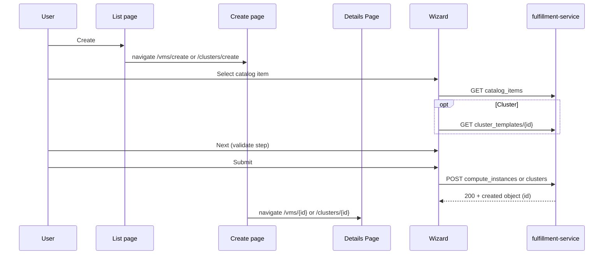

# Configuration Wizard for Cluster and VM Resources

## Summary

Rewrite the osac-ui catalog provision wizard: static fields per resource type, five fixed steps, catalog overlay on Configuration and Networking only, Formik/Yup validation, and dedicated create pages (`/vms/create`, `/clusters/create`) with list-page breadcrumbs. Each adapter supplies its own Configuration and Networking step components. See [PRD](prd.md) for field-level requirements.

## Motivation

Today's wizard discovers fields from `field_definitions`, optionally skips Configuration, disables Next until valid, and hosts a VM-only flow in a portal overlay. The cluster adapter is a stub. The PRD requires a fixed five-step flow, API-backed pickers, validate-all-on-click, and full cluster support — a rewrite is lower risk than patching the catalog-driven model.

### Goals

- Rewrite `catalogProvision/` with Formik/Yup, PatternFly Wizard, and per-adapter Configuration/Networking step components.
- Host wizard on routed create pages; list **Create** navigates to `/vms/create` or `/clusters/create`.
- Implement cluster adapter end-to-end (catalog, template fetch, node_sets table, create).
- Next always enabled; validate entire step on click (PRD §2.2).
- On successful create, navigate to the VM or cluster **Details Page** using `id` from the POST response (`/vms/{id}`, `/clusters/{id}`).

### Non-Goals

- Backend API or proto changes; BareMetalInstance; multi-NIC; cluster pool add/remove; `host_type` changes; Formik/Yup outside this wizard.

## Proposal

Rewrite under `osac-ui/apps/app-frontend/src/components/catalogProvision/`. `CatalogProvisionWizard` embeds in create pages and owns shared steps (Catalog, Access, Review). **Configuration** and **Networking** are adapter components — VM pickers and cluster node_sets/CIDR fields are not shareable.

Catalog `field_definitions` overlay matching static paths on Configuration and Networking only (labels, editable, default, `validation_schema`). Access ignores catalog. Payloads limited to PRD §2.1.1 paths.

New hooks in `libs/ui-components/src/api/v1/`: instance types, virtual networks, subnets, security groups, cluster catalog items, cluster templates, host types, cluster create. VM picker fields depend on fulfillment-service `spec.instance_type` and `spec.is_windows` (PRs #735, #734).

### Workflow Description

Tenant User on `/vms` or `/clusters` clicks **Create** → navigates to create route → wizard with breadcrumb (list label → **Create**). Cancel or breadcrumb back uses unsaved-progress guard.



| Step | Owner | Content |
|------|-------|---------|
| Catalog | Shared | `adapter.useCatalogItems()`; cluster `onCatalogItemSelected` fetches template |
| Access | Shared | Name, SSH key; cluster adds pull secret; no catalog overlay |
| Configuration | Adapter | VM: image, OS family, instance type, user data, boot disk, run strategy. Cluster: release image, node_sets table |
| Networking | Adapter | VM: VN → subnet → SG pickers. Cluster: pod/service CIDR |
| Review | Shared | `adapter.getReviewSections()`; submit via `buildCreatePayload` |

Register `/vms/create` and `/clusters/create` before `:id` routes. On failure: inline errors on step; create 4xx stays on Review; deprecated instance type warnings are non-blocking.

### API Extensions

No API extensions. Wizard consumes existing `ComputeInstanceCatalogItems`, `ClusterCatalogItems`, `InstanceTypes`, networking list APIs, `ClusterTemplates`, `HostTypes`, and create APIs. Server-side catalog validation (`catalog_item_validation.go`) unchanged.

### Implementation Details/Notes/Constraints

**Routing and pages [User]:** `VmCreatePage` / `ClusterCreatePage` host the wizard, breadcrumbs, and provision handler. List pages drop embedded wizard and `wizardRef.open()`. Wizard drops portal (`createPortal`), imperative handle, and overlay CSS.

**Post-submit navigation:** On successful `POST`, read `id` from the response body (fulfillment returns the created `ComputeInstance` or `Cluster` at the root). Navigate to the **Details Page** at `/vms/{id}` or `/clusters/{id}` — not back to the list. If `id` is missing, stay on Review with an error. Surface create warnings (e.g. deprecated instance type) on the Details Page or via a transient alert before navigation.

**Adapter interface:**

```typescript
interface CatalogProvisionAdapter<TItem, TValues, TPayload> {
  kind: CatalogProvisionKind;
  useCatalogItems: () => UseQueryResult<TItem[]>;
  getInitialValues: (catalogItem: TItem | null) => TValues;
  buildCreatePayload: (values: TValues, catalogItem: TItem) => TPayload;
  ConfigurationStep: ComponentType<{ catalogItem: TItem | null }>;
  NetworkingStep: ComponentType<{ catalogItem: TItem | null }>;
  accessFields: AccessFieldDescriptor[];
  getStepSchema: (stepId: WizardStepId, fieldDefinitions: FieldDefinition[]) => AnyObjectSchema;
  getReviewSections: (values: TValues, catalogItem: TItem) => ReviewSection[];
  onCatalogItemSelected?: (item: TItem, helpers: FormikHelpers<TValues>) => void | Promise<void>;
  // wizard chrome labels
}
```

**Module layout:**

```text
wizard/adapters/
  computeInstanceAdapter.ts, clusterAdapter.ts, types.ts
  computeInstance/  VmConfigurationStep, VmNetworkingStep, fields.ts, schemas.ts
  cluster/            ClusterConfigurationStep, ClusterNetworkingStep, fields.ts, schemas.ts
```

Adapter steps use Formik context, own API hooks and loading UI, and export Yup fragments. Shared helpers: `buildStepSchema` (overlay merge), `applyCatalogOverlay`. Paths use PRD `spec.*` notation; wire builders output camelCase OpenAPI shapes.

**Formik/Yup [User]:** Single `<Formik>` in orchestrator; `enableReinitialize` on catalog change. Validate-on-click: run `adapter.getStepSchema(step)`, `setTouched` for all step fields, show alert if invalid. Overlay: `editable: false` forces catalog default at build time; merge `validation_schema` into Yup for supported JSON Schema subset.

**Defaults** (when no catalog default): `run_strategy` → `Always`; OS family → Linux; single list-API option → auto-select (§5 precedence TBD).

**Removed:** `partitionFieldDefinitions`, generic `ConfigurationStep`/`CatalogFieldInput`, `canProceedWizardStep`, text-based networking rows.

Update `docs/specs/ui-flows/catalog-provision-wizard.yaml` and `manage-virtual-machines.yaml` for routed create pages and five-step flow.

### Security Considerations

No auth changes. Session-scoped REST; tenant isolation server-side. Sensitive fields masked on Access; no localStorage persistence.

### Failure Handling and Recovery

| Failure | User sees |
|---------|-----------|
| Catalog / template / picker API error | Step or field error; refetch |
| Step validation | Inline errors + alert; no advance |
| Create 4xx | Error on Review |
| Create 2xx without `id` | Error on Review |
| Create 2xx with `id` | Navigate to Details Page (`/vms/{id}` or `/clusters/{id}`) |
| Cancel / browser back with draft | Discard confirmation → list |

No server writes until create succeeds.

## Open Questions

1. Picker overlay: catalog `default` vs single-option auto-select precedence (§5).
2. Catalog default not in picker list: block vs warn-and-blank.
3. Required `?` fields: SSH keys, boot disk, cluster CIDRs.
4. Empty template `node_sets`: block vs filter vs warn.

## Test Plan

Manual testing.

## Version Skew Strategy

UI requires fulfillment-service `spec.instance_type` and `spec.is_windows` for VM pickers — coordinate osac-installer image pins.
