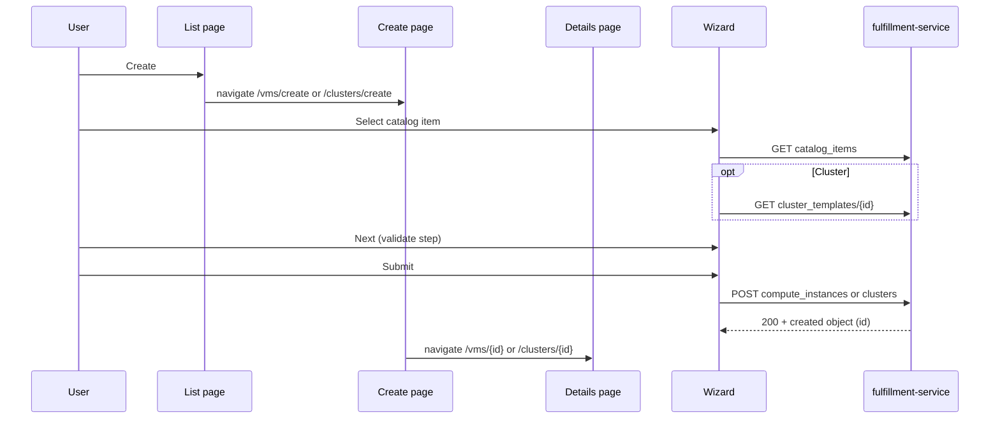

# Configuration Wizard for Cluster and VM Resources

## Summary

Rewrite the osac-ui catalog provision wizard with static fields per resource type, a fixed five-step flow (Catalog Item → General → Configuration → Networking → Review), catalog overlay on Configuration and Networking non-picker fields only, Formik/Yup validation with validate-all-on-Next, `OsacForm` layout wrapper, i18n for all user-visible strings, and dedicated create pages (`/vms/create`, `/clusters/create`) with list-page breadcrumbs. Each adapter supplies its own Configuration and Networking step components. See [PRD](prd.md) for field-level requirements.

### Goals

- Rewrite `catalogProvision/` with Formik/Yup, PatternFly Wizard, `OsacForm`, i18n (`useTranslation`), shared Formik-connected field components, and per-adapter Configuration/Networking step components.
- Host the wizard on routed create pages; list **Create** navigates to `/vms/create` or `/clusters/create`.
- Implement the cluster adapter end-to-end (catalog, template fetch, `node_sets` table, create).
- Next always enabled; validate every field on the current step when Next is clicked, including fields that have not blurred.
- On successful create, navigate to the VM or cluster Details page using `id` from the POST response (`/vms/{id}`, `/clusters/{id}`).

## Proposal

Rewrite under `osac-ui/apps/app-frontend/src/components/catalogProvision/`. `CatalogProvisionWizard` embeds in create pages and owns shared steps (Catalog Item, General, Review). **Configuration** and **Networking** are adapter components — VM pickers and cluster `node_sets`/CIDR fields are not shareable.

Static field paths are hardcoded per resource type (PRD §2.1.1). Catalog `field_definitions` overlay matching static paths on **Configuration** and **Networking** non-picker fields only (`display_name`, `editable`, `default`, `validation_schema`). The **General** step and picker-backed paths (`spec.instance_type`, `spec.network_attachments` and nested paths) ignore catalog `field_definitions` in v1. Create payloads include only PRD §2.1.1 paths plus catalog item reference; VM hardcodes `spec.image.source_type` = `registry`.

New hooks in `libs/ui-components/src/api/v1/`: instance types, virtual networks, subnets, security groups, cluster catalog items, cluster templates, host types, cluster create. VM picker fields depend on fulfillment-service `spec.instance_type` and `spec.is_windows` (PRs #735, #734).

### Workflow Description

Tenant user on `/vms` or `/clusters` clicks **Create** → navigates to the create route → wizard with breadcrumb (list label → **Create**). Cancel or breadcrumb back uses an unsaved-progress guard.



| Step | Owner | Content |
|------|-------|---------|
| Catalog Item | Shared | `adapter.useCatalogItems()`; cluster `onCatalogItemSelected` fetches template |
| General | Shared | Name (required), optional SSH key; cluster adds required pull secret; catalog `field_definitions` ignored |
| Configuration | Adapter | VM: image, OS family, instance type, user data, boot disk, run strategy. Cluster: release image, `node_sets` table |
| Networking | Adapter | VM: VN → subnet → SG pickers (single `network_attachments` entry). Cluster: pod/service CIDR |
| Review | Shared | `adapter.getReviewSections()` — same labels and values as wizard steps; submit via `buildCreatePayload` |

Register `/vms/create` and `/clusters/create` before `:id` routes. On failure: inline errors on the step; any non-2xx create response stays on Review; deprecated instance type warnings from create response are non-blocking and surfaced after submit.

**Catalog overlay (non-picker fields on Configuration and Networking):**

| Aspect | Matching `field_definitions` entry | No matching entry |
|--------|-----------------------------------|-------------------|
| Label | `display_name` or wizard default | Wizard default |
| Editable | `editable: false` → read-only control | Editable |
| Default | Catalog `default` if set; else blank | Blank |
| Validation | `validation_schema` merged into Yup | API/wizard validation |

Non-editable fields without a catalog `default` render blank and read-only (disabled control, same widget type). Non-editable fields with a catalog `default` render read-only with the default value; both cases include the value in the payload when present.

**Wizard defaults** (when no catalog `default`):

| Field | Default |
|-------|---------|
| `spec.run_strategy` | `Always` |
| VM OS family (`spec.is_windows`) | Linux (`false`); wizard always sends an explicit value |
| Instance type picker | Auto-select when `InstanceTypes.List` returns exactly one option |
| Networking pickers | Auto-select when a list returns exactly one option (VN → subnet → SGs) |

**VM Configuration specifics:** `spec.user_data` and `spec.boot_disk.size_gib` are optional — omit from payload when empty. `spec.is_windows` (OS family) uses `RadioButtonField` (Linux / Windows); wizard always sends an explicit value. `spec.instance_type` sends the type name only (not `cores`/`memory_gib`). Instance type labels show `metadata.name`, cores, memory, and **DEPRECATED** when applicable; OBSOLETE types excluded from the picker.

**VM General specifics:** `spec.ssh_key` is optional — omit from payload when empty (same pattern as `spec.user_data`).

**VM Networking specifics:** Load VN list first; on selection, filter subnets and security groups with `this.spec.virtual_network == "<vn-id>"`. Assemble one `network_attachments` element: `{ "subnet": "<id>", "security_groups": ["<id>"] }`. Virtual network ID is not sent in the attachment payload.

**Cluster Configuration specifics:** After catalog selection, `ClusterTemplates.Get` drives one table row per template `node_sets` key. Columns: pool name and `host_type` (read-only, from template + `HostTypes.Get`); **Nodes** = editable `size` per pool (`size` > 0 when pools exist). Payload sends template `host_type` + tenant `size` per pool.

When the template returns **empty** `node_sets`, the Configuration step shows a clear PatternFly warning alert (e.g. that the backing template defines no worker pools), renders an empty pool table, and does **not** block Next — the tenant may continue through Networking and Review. Create payload omits `spec.node_sets` (or sends an empty map if the API requires the key). Review reflects the empty pool state with the same warning context.

**Cluster General specifics:** `spec.ssh_public_key` is optional — omit from payload when empty (same pattern as VM `spec.ssh_key`).

**Cluster Networking specifics:** `spec.network.pod_cidr` and `spec.network.service_cidr` are optional — omit from payload when empty. Yup validates format only when a value is present.

**Step validation:** Next is always enabled. On click, run the step Yup schema, `setTouched` for all step fields, surface inline errors for untouched fields, and show an alert if invalid; do not advance until the step passes.

### API Extensions

No API extensions. The wizard consumes existing `ComputeInstanceCatalogItems`, `ClusterCatalogItems`, `InstanceTypes`, networking list APIs (`GET /api/fulfillment/v1/virtual_networks`, `.../subnets`, `.../security_groups`), `ClusterTemplates`, `HostTypes`, and create APIs. Server-side catalog validation (`catalog_item_validation.go`) is unchanged.

### Implementation Details/Notes/Constraints

**Routing and pages:** `VmCreatePage` / `ClusterCreatePage` host the wizard, breadcrumbs, and provision handler. List pages drop the embedded wizard and `wizardRef.open()`. The wizard drops portal (`createPortal`), imperative handle, and overlay CSS.

**Post-submit navigation:** On successful `POST`, read `id` from the response body. Navigate to `/vms/{id}` or `/clusters/{id}`. If `id` is missing, stay on Review with an error. Surface create warnings (e.g. deprecated instance type) via transient alert before navigation or on the Details page.

**Adapter interface:**

```typescript
interface CatalogProvisionAdapter<TItem, TValues, TPayload> {
  kind: CatalogProvisionKind;
  useCatalogItems: () => UseQueryResult<TItem[]>;
  getInitialValues: (catalogItem: TItem | null) => TValues;
  buildCreatePayload: (values: TValues, catalogItem: TItem) => TPayload;
  ConfigurationStep: ComponentType<{ catalogItem: TItem | null }>;
  NetworkingStep: ComponentType<{ catalogItem: TItem | null }>;
  generalFields: GeneralFieldDescriptor[];
  getWizardSchema: (fieldDefinitions: FieldDefinition[]) => AnyObjectSchema;
  getStepFieldPaths: (stepId: WizardStepId) => string[];
  getReviewSections: (values: TValues, catalogItem: TItem) => ReviewSection[];
  onCatalogItemSelected?: (item: TItem, helpers: FormikHelpers<TValues>) => void | Promise<void>;
}
```

**Module layout:**

```text
libs/ui-components/src/components/form/
  InputField, SelectField, RadioButtonField — shared Formik-connected controls (reusable outside wizard)
wizard/
  adapters/
    computeInstanceAdapter.ts, clusterAdapter.ts, types.ts
    computeInstance/  VmConfigurationStep, VmNetworkingStep, fields.ts, schemas.ts
    cluster/            ClusterConfigurationStep, ClusterNetworkingStep, fields.ts, schemas.ts
```

**Shared form field components:** Wizard steps render inputs through shared components under `libs/ui-components/src/components/form/` that bind to the parent `<Formik>` context — not local `useState` or manual `value`/`onChange` props. These live in `@osac/ui-components` so other forms can reuse them. At minimum:

| Component | PatternFly control | Formik binding |
|-----------|-------------------|----------------|
| `InputField` | `TextInput`, `TextArea` | `name` → `useField` (or `<Field>`); `value`, `onChange`, `onBlur` from Formik; `meta.error` / `meta.touched` for inline validation |
| `SelectField` | `FormSelect` | Same; `options` prop for `FormSelectOption` list |
| `RadioButtonField` | `Radio`, `RadioGroup` | Same; `options` prop for labeled choices (e.g. VM OS family: Linux / Windows → `spec.is_windows`) |

Each component wraps a PatternFly `FormGroup` (label, `fieldId`, `isRequired`, helper text for errors). Props include `name` (Formik path), `label` (already-translated string from the step), `isRequired`, `isDisabled` / `readOnly` (catalog `editable: false`), and widget-specific options (e.g. `multiline`, `type="number"`, `isPassword` for pull secret; `options` with `value` / `label` for `SelectField` and `RadioButtonField`). Adapter and shared steps compose these components inside `OsacForm`; picker-backed fields may use `SelectField` or thin wrappers (e.g. `PickerSelectField`) that still source value and errors from Formik.

**`OsacForm` wrapper:** Every wizard step that renders editable fields wraps its field list in `OsacForm` from `@osac/ui-components` (`libs/ui-components/src/components/Form/OsacForm.tsx`) — not raw PatternFly `Form`. `OsacForm` provides responsive grid layout and blocks native submit; wizard navigation stays on PatternFly Wizard footer buttons. ESLint already requires `OsacForm` over direct `Form` imports in osac-ui.

**i18n:** All user-visible wizard copy uses i18next via `useTranslation` from `@osac/ui-components/hooks/useTranslation` (never import from `react-i18next` directly). Use hardcoded string keys in `t('...')` so `pnpm i18n` can extract keys into `libs/i18n/locales/en/translation.json` (committed with source changes; CI fails if out of sync). Apply to step titles, intros, field labels (wizard defaults), buttons, validation alert text, empty-`node_sets` warning, and Review section headings. Catalog `display_name` from `field_definitions` overrides the wizard default label when present and is shown as-is (server-provided, not passed through `t()`). Pure helpers (e.g. `getReviewSections`, static field descriptors) accept `t: TFunction` from the calling component rather than calling `useTranslation` internally.

Adapter steps use Formik context, own API hooks and loading UI, and export Yup fragments. Shared helpers: `buildWizardSchema` (compose adapter fragments + overlay merge for non-picker Configuration/Networking paths), `applyCatalogOverlay`, `validateStepFields` (subset validation for the current step). Paths use PRD `spec.*` notation; wire builders output camelCase OpenAPI shapes.

**Formik/Yup:** Single `<Formik>` in the orchestrator with one wizard-level Yup schema from `adapter.getWizardSchema(fieldDefinitions)` — not per-step schemas. A single schema lets future cross-step rules reference values from any step (e.g. Networking validation depending on Configuration choices) without re-plumbing. Validate-on-Next runs Yup against only the current step's field paths via `adapter.getStepFieldPaths(stepId)` while the full schema retains access to all `values`. Each step body: `OsacForm` → shared `InputField` / `SelectField` / `RadioButtonField` from `@osac/ui-components` bound to Formik state — no raw PatternFly `Form` and no duplicated error wiring. Overlay merge applies only to non-picker Configuration and Networking fields. `editable: false` forces catalog default at build time when present and passes `isDisabled` to field components; merge `validation_schema` into Yup for the supported JSON Schema subset. Validate-on-Next uses the same Formik `errors` / `touched` state those components display. Yup validation messages that surface to the user should use i18n keys where the schema supports message overrides.

**Catalog item change:** Do not use `enableReinitialize` — it would reset user edits whenever `initialValues` changes. Instead, `onCatalogItemSelected` explicitly calls `resetForm({ values: getInitialValues(item) })` (and fetches cluster template when applicable) so reinitialization happens only on intentional catalog selection, not on unrelated parent re-renders.

**PRD §5 decisions (v1):** Ignore catalog `field_definitions` on picker-backed paths (`spec.instance_type`, `spec.network_attachments`). No wizard UI for `spec.additional_disks` — boot disk only. Empty cluster template `node_sets`: warn on Configuration, do not block step navigation (see Cluster Configuration specifics above). PRD `?` fields are **optional**: `spec.ssh_key` / `spec.ssh_public_key`, `spec.boot_disk.size_gib`, `spec.network.pod_cidr`, and `spec.network.service_cidr` — omit from payload when blank; Yup does not require them on Next.

**Removed:** `partitionFieldDefinitions`, generic `ConfigurationStep`/`CatalogFieldInput`, `canProceedWizardStep`, text-based networking rows, catalog-driven field discovery. Replaced by static field tables, `OsacForm`, and Formik-connected `InputField` / `SelectField` / `RadioButtonField` components.

Update `docs/specs/ui-flows/catalog-provision-wizard.yaml` for routed create pages and the five-step flow. Run `pnpm i18n` after adding or changing wizard strings.

### Security Considerations

No auth changes. Session-scoped REST via the generated OpenAPI client; tenant isolation is enforced server-side. Sensitive fields (pull secret) are masked on the General step; no localStorage persistence of draft values.

### Failure Handling and Recovery

| Failure | User sees |
|---------|-----------|
| Catalog / template / picker API error | Step or field error; refetch |
| Step validation | Inline errors on all invalid fields + alert; no advance |
| Create non-2xx | Error on Review |
| Create 2xx without `id` | Error on Review |
| Create 2xx with `id` | Navigate to Details page; show non-blocking warnings if present |
| Cancel / browser back with draft | Discard confirmation → list |

No server writes until create succeeds.

### Risks and Mitigations

| Risk | Mitigation |
|------|------------|
| Large rewrite vs incremental patch | Fixed PRD field set and step model make incremental patching brittle; adapters isolate VM/cluster divergence |
| fulfillment-service version skew (`instance_type`, `is_windows`) | Coordinate osac-installer image pins; document in Version Skew Strategy |
| Catalog overlay edge cases on read-only fields without defaults | PRD defines blank read-only UX; test with catalog items that lock fields without defaults |
| Cluster provision with empty template `node_sets` | Non-blocking Configuration warning; empty pool table; tenant can complete wizard; API may reject create — surface API error on Review |

## Test Plan

- Lint passes.
- i18n: `pnpm i18n` passes after wizard string changes; spot-check translated labels in General, Configuration, and Review steps.
- Manual: end-to-end VM and cluster provision via `/vms/create` and `/clusters/create`; cluster catalog item whose template has empty `node_sets` (warning shown, wizard completable); submit with optional fields left blank.
