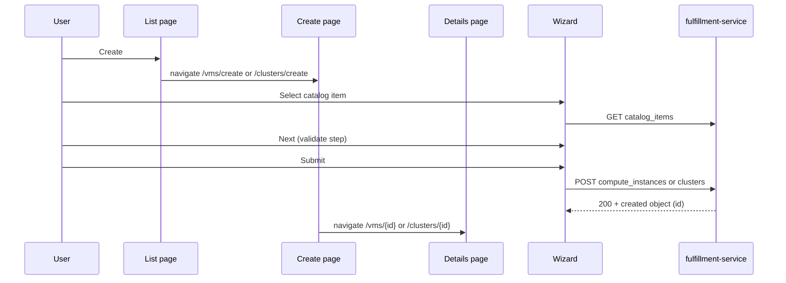

# Configuration Wizard for Cluster and VM Resources

## Summary

Rewrite the osac-ui catalog provision wizard with static fields per resource type, a fixed five-step flow (Catalog Item → General → Configuration → Networking → Review), catalog overlay on Configuration and Networking non-picker fields only, Formik/Yup validation with validate-all-on-Next, `OsacForm` layout wrapper, i18n for all user-visible strings, and dedicated create pages (`/vms/create`, `/clusters/create`) with list-page breadcrumbs. Each adapter supplies its own Configuration and Networking step components. See [PRD](prd.md) for field-level requirements.

### Goals

- Rewrite `catalogProvision/` with Formik/Yup, PatternFly Wizard, `OsacForm`, i18n (`useTranslation`), shared Formik-connected field components, and per-adapter Configuration/Networking step components.
- Host the wizard on routed create pages; list **Create** navigates to `/vms/create` or `/clusters/create`.
- Implement the cluster adapter end-to-end (catalog, tenant-managed `node_sets` table, create).
- Next always enabled; validate every field on the current step when Next is clicked, including fields that have not blurred.
- On successful create, navigate to the VM or cluster Details page using `id` from the POST response (`/vms/{id}`, `/clusters/{id}`).
- Component tests (Vitest + jsdom + Testing Library) cover step validation, Back navigation with preserved values, Cancel/discard guard, and submit error paths for both VM and cluster adapters (see [Test Plan](#test-plan)).

## Proposal

Rewrite under `osac-ui/apps/app-frontend/src/components/catalogProvision/`. `CatalogProvisionWizard` embeds in create pages and owns shared steps (Catalog Item, General, Review). **Configuration** and **Networking** are adapter components — VM pickers and cluster `node_sets`/CIDR fields are not shareable.

Static field paths are hardcoded per resource type (PRD §2.1.1). Catalog `field_definitions` overlay matching static paths on **Configuration**, **Networking** non-picker fields, and **General basics** fields (`ssh_key`, `ssh_public_key`, `pull_secret`) for `display_name`, `editable`, and `validation_schema`. Picker-backed paths (`spec.instance_type`, `spec.network_attachments` and nested paths, cluster `spec.node_sets` host type per row) ignore catalog `field_definitions` in v1. Create payloads include only PRD §2.1.1 paths plus catalog item reference; VM hardcodes `spec.image.source_type` = `registry`.

New hooks in `libs/ui-components/src/api/v1/`: instance types, virtual networks, subnets, security groups, cluster catalog items, host types (list), cluster create. VM picker fields depend on fulfillment-service `spec.instance_type` and `spec.is_windows` (PRs #735, #734). Cluster Configuration uses `HostTypes.List` for per-row host type pickers; it does **not** call `ClusterTemplates.Get` for `node_sets`.

### Workflow Description

Tenant user on `/vms` or `/clusters` clicks **Create** → navigates to the create route → wizard with breadcrumb (list label → **Create**). Cancel or breadcrumb back uses an unsaved-progress guard.



| Step | Owner | Content |
|------|-------|---------|
| Catalog Item | Shared | `adapter.useCatalogItems()` |
| General | Shared | Name (required), optional SSH key (catalog `ssh_key` overlay); cluster adds required pull secret and optional `ssh_public_key` overlay |
| Configuration | Adapter | VM: image, OS family, instance type, user data, boot disk, run strategy. Cluster: release image, tenant-managed `node_sets` table (add/remove rows) |
| Networking | Adapter | VM: VN → subnet → SG pickers (single `network_attachments` entry). Cluster: pod/service CIDR |
| Review | Shared | `adapter.getReviewSections()` — same labels and values as wizard steps; submit via `buildCreatePayload` |

Register `/vms/create` and `/clusters/create` before `:id` routes. On failure: inline errors on the step; any non-2xx create response stays on Review; deprecated instance type warnings from create response are non-blocking and surfaced after submit.

**Catalog overlay (non-picker Configuration/Networking fields and General basics):**

| Aspect | Matching `field_definitions` entry | No matching entry |
|--------|-----------------------------------|-------------------|
| Label | `display_name` or wizard default | Wizard default |
| Editable | `editable: false` → read-only control | Editable |
| Default | Catalog `default` when set; else blank (Configuration, Networking, and General basics) | Blank |
| Validation | `validation_schema` merged into Yup | API/wizard validation |

Non-editable fields without a catalog `default` render blank and read-only (disabled control, same widget type). Fields with a catalog `default` render with the parsed default on catalog selection — read-only when `editable: false`, editable when `editable: true` — and include the wizard value in the client payload when non-blank.

**Fulfillment create (`applyFieldDefinitions`):** The wizard prefills and sends basics values from catalog `default` when present. If the tenant clears an optional basics field, the client omits it from the POST body; fulfillment may still apply the catalog `default` server-side when defined.

**Wizard defaults** (when no catalog `default`):

| Field | Default |
|-------|---------|
| `spec.run_strategy` | `Always` |
| VM OS family (`spec.is_windows`) | Linux (`false`); wizard always sends an explicit value |
| Instance type picker | Auto-select when `InstanceTypes.List` returns exactly one option |
| Networking pickers | Auto-select when a list returns exactly one option (VN → subnet → SGs) |

**VM Configuration specifics:** `spec.user_data` and `spec.boot_disk.size_gib` are optional — omit from payload when empty. `spec.is_windows` (OS family) uses `RadioButtonField` (Linux / Windows); wizard always sends an explicit value. `spec.instance_type` sends the type name only (not `cores`/`memory_gib`). Instance type labels show `metadata.name`, cores, memory, and **DEPRECATED** when applicable; OBSOLETE types excluded from the picker.

**VM General specifics:** `spec.ssh_key` is optional — prefill catalog `default` on catalog selection when defined; merge catalog `ssh_key` `field_definition` for label, `editable`, and `validation_schema`. Omit from client payload only when blank (tenant cleared or no catalog default). When non-blank, send the parsed plain string (prefilled default or user edit).

**VM Networking specifics:** Load VN list first; on selection, filter subnets and security groups with `this.spec.virtual_network == "<vn-id>"`. Assemble one `network_attachments` element: `{ "subnet": "<id>", "security_groups": ["<id>"] }`. Virtual network ID is not sent in the attachment payload.

**Cluster Configuration specifics:** `spec.node_sets` is **tenant-composed** — the wizard does **not** load, display, or apply `ClusterTemplate.spec.node_sets`. On Configuration, render an editable table with **Add node set** / **Remove** actions. Each row: **Host type** (`SelectField` from `HostTypes.List` — [PRD §2.1.6](prd.md#216-cluster-host-type-picker-api)) and **Nodes** (`size` number input, > 0). `ClusterNodeSet` requires only `host_type` and `size` — no separate name column. Validation: at least one row required; host type and positive `size` required per row; **duplicate host types blocked** (each host type id at most once). `buildClusterCreatePayload` uses **host type id as the map key** and sets `host_type` on the value to the same id. Review shows host type label and node count per row. Filter or disable host types already selected on other rows in remaining dropdowns. `ClusterConfigurationStep` loads the host type list on mount; no `useClusterTemplate` call.

**Cluster General specifics:** `spec.ssh_public_key` and `spec.pull_secret` follow the same General basics overlay rules as VM `spec.ssh_key` (prefill catalog `default`, label, editable, validation). `spec.pull_secret` remains required on the wizard when no catalog rule makes it optional.

**Cluster Networking specifics:** `spec.network.pod_cidr` and `spec.network.service_cidr` are optional — omit from payload when empty. Yup validates format only when a value is present.

**Step validation:** Next is always enabled. On click, run the step Yup schema, `setTouched` for all step fields, surface inline errors for untouched fields, and show an alert if invalid; do not advance until the step passes.

### API Extensions

No API extensions to create payloads. The wizard consumes existing `ComputeInstanceCatalogItems`, `ClusterCatalogItems`, `InstanceTypes`, networking list APIs (`GET /api/fulfillment/v1/virtual_networks`, `.../subnets`, `.../security_groups`), `HostTypes.List` (`GET /api/fulfillment/v1/host_types`), and create APIs. Server-side catalog validation (`catalog_item_validation.go` / `applyFieldDefinitions`) still applies catalog `field_definitions` on create when the client omits a field the wizard left blank. The wizard does **not** use `ClusterTemplates.Get` for Configuration `node_sets`.

### Implementation Details/Notes/Constraints

**Routing and pages:** `VmCreatePage` / `ClusterCreatePage` host the wizard, breadcrumbs, and provision handler. List pages drop the embedded wizard and `wizardRef.open()`. The wizard drops portal (`createPortal`), imperative handle, and overlay CSS.

**Post-submit navigation:** On successful `POST`, read `id` from the response body. Navigate to `/vms/{id}` or `/clusters/{id}`. If `id` is missing, stay on Review with an error. Surface create warnings (e.g. deprecated instance type) via transient alert before navigation or on the Details page.

**Adapter interface:**

```typescript
interface CatalogProvisionAdapter<TItem, TValues, TPayload> {
  kind: CatalogProvisionKind;
  useCatalogItems: () => UseQueryResult<TItem[]>;
  getInitialValues: (catalogItem: TItem | null) => TValues;
  buildCreatePayload: (values: TValues, catalogItem: TItem) => TPayload;
  ConfigurationStep: ComponentType<{ catalogItem: TItem | null }>;
  NetworkingStep: ComponentType<{ catalogItem: TItem | null }>;
  generalFields: GeneralFieldDescriptor[];
  resolveGeneralFields?: (catalogItem: TItem | null) => GeneralFieldDescriptor[];
  getWizardSchema: (fieldDefinitions: FieldDefinition[]) => AnyObjectSchema;
  getStepFieldPaths: (stepId: WizardStepId) => string[];
  getReviewSections: (values: TValues, catalogItem: TItem) => ReviewSection[];
  onCatalogItemSelected?: (item: TItem, helpers: FormikHelpers<TValues>) => void | Promise<void>;
}
```

**Module layout:**

```text
libs/ui-components/src/components/form/
  InputField, SelectField, RadioButtonField — shared Formik-connected controls (reusable outside wizard)
wizard/
  adapters/
    computeInstanceAdapter.ts, clusterAdapter.ts, types.ts
    computeInstance/  VmConfigurationStep, VmNetworkingStep, fields.ts, schemas.ts
    cluster/            ClusterConfigurationStep, ClusterNetworkingStep, fields.ts, schemas.ts
```

**Shared form field components:** Wizard steps render inputs through shared components under `libs/ui-components/src/components/form/` that bind to the parent `<Formik>` context — not local `useState` or manual `value`/`onChange` props. These live in `@osac/ui-components` so other forms can reuse them. At minimum:

| Component | PatternFly control | Formik binding |
|-----------|-------------------|----------------|
| `InputField` | `TextInput`, `TextArea` | `name` → `useField` (or `<Field>`); `value`, `onChange`, `onBlur` from Formik; `meta.error` / `meta.touched` for inline validation |
| `SelectField` | `FormSelect` | Same; `options` prop for `FormSelectOption` list |
| `RadioButtonField` | `Radio`, `RadioGroup` | Same; `options` prop for labeled choices (e.g. VM OS family: Linux / Windows → `spec.is_windows`) |

Each component wraps a PatternFly `FormGroup` (label, `fieldId`, `isRequired`, helper text for errors). Props include `name` (Formik path), `label` (already-translated string from the step), `isRequired`, `isDisabled` / `readOnly` (catalog `editable: false`), and widget-specific options (e.g. `multiline`, `type="number"`, `isPassword` for pull secret; `options` with `value` / `label` for `SelectField` and `RadioButtonField`). Adapter and shared steps compose these components inside `OsacForm`; picker-backed fields may use `SelectField` or thin wrappers (e.g. `PickerSelectField`) that still source value and errors from Formik.

**`OsacForm` wrapper:** Every wizard step that renders editable fields wraps its field list in `OsacForm` from `@osac/ui-components` (`libs/ui-components/src/components/Form/OsacForm.tsx`) — not raw PatternFly `Form`. `OsacForm` provides responsive grid layout and blocks native submit; wizard navigation stays on PatternFly Wizard footer buttons. ESLint already requires `OsacForm` over direct `Form` imports in osac-ui.

**i18n:** All user-visible wizard copy uses i18next via `useTranslation` from `@osac/ui-components/hooks/useTranslation` (never import from `react-i18next` directly). Use hardcoded string keys in `t('...')` so `pnpm i18n` can extract keys into `libs/i18n/locales/en/translation.json` (committed with source changes; CI fails if out of sync). Apply to step titles, intros, field labels (wizard defaults), buttons, validation alert text, node-sets add/remove actions, and Review section headings. Catalog `display_name` from `field_definitions` overrides the wizard default label when present and is shown as-is (server-provided, not passed through `t()`). Pure helpers (e.g. `getReviewSections`, static field descriptors) accept `t: TFunction` from the calling component rather than calling `useTranslation` internally.

Adapter steps use Formik context, own API hooks and loading UI, and export Yup fragments. Shared helpers: `buildWizardSchema` (compose adapter fragments + overlay merge for non-picker Configuration/Networking paths and General basics), `applyCatalogOverlay`, `validateStepFields` (subset validation for the current step). Paths use PRD `spec.*` notation; wire builders output camelCase OpenAPI shapes.

**Formik/Yup:** Single `<Formik>` in the orchestrator with one wizard-level Yup schema from `adapter.getWizardSchema(fieldDefinitions)` — not per-step schemas. A single schema lets future cross-step rules reference values from any step (e.g. Networking validation depending on Configuration choices) without re-plumbing. Validate-on-Next runs Yup against only the current step's field paths via `adapter.getStepFieldPaths(stepId)` while the full schema retains access to all `values`. Each step body: `OsacForm` → shared `InputField` / `SelectField` / `RadioButtonField` from `@osac/ui-components` bound to Formik state — no raw PatternFly `Form` and no duplicated error wiring. Overlay merge applies to General basics and non-picker Configuration and Networking fields. `editable: false` passes `isDisabled` to field components; catalog `default` is applied to Formik on catalog selection when present; merge `validation_schema` into Yup for the supported JSON Schema subset. Validate-on-Next uses the same Formik `errors` / `touched` state those components display. Yup validation messages that surface to the user should use i18n keys where the schema supports message overrides.

**Catalog item change:** Do not use `enableReinitialize` — it would reset user edits whenever `initialValues` changes. Instead, `onCatalogItemSelected` explicitly calls `resetForm({ values: getInitialValues(item) })` and applies catalog overlay defaults so reinitialization happens only on intentional catalog selection, not on unrelated parent re-renders. Cluster catalog selection does **not** fetch `ClusterTemplates.Get` or seed `spec.node_sets` from the template.

**PRD §5 decisions (v1):** Ignore catalog `field_definitions` on picker-backed paths (`spec.instance_type`, `spec.network_attachments`, `spec.node_sets` host type picker). No wizard UI for `spec.additional_disks` — boot disk only. Cluster `node_sets` are tenant-composed (add/remove rows); template `node_sets` are ignored. PRD `?` fields are **optional**: `spec.boot_disk.size_gib`, `spec.network.pod_cidr`, and `spec.network.service_cidr` — omit from payload when blank. `spec.ssh_key` / `spec.ssh_public_key` are optional basics fields — prefill catalog `default` when defined; omit from client payload only when blank.

**Removed:** `partitionFieldDefinitions`, generic `ConfigurationStep`/`CatalogFieldInput`, `canProceedWizardStep`, text-based networking rows, catalog-driven field discovery. Replaced by static field tables, `OsacForm`, and Formik-connected `InputField` / `SelectField` / `RadioButtonField` components.

Update `docs/specs/ui-flows/catalog-provision-wizard.yaml` for routed create pages and the five-step flow. Run `pnpm i18n` after adding or changing wizard strings.

### Security Considerations

No auth changes. Session-scoped REST via the generated OpenAPI client; tenant isolation is enforced server-side. Sensitive fields (pull secret) are masked on the General step; no localStorage persistence of draft values.

### Failure Handling and Recovery

| Failure | User sees |
|---------|-----------|
| Catalog / template / picker API error | Step or field error; refetch |
| Step validation | Inline errors on all invalid fields + alert; no advance |
| Create non-2xx | Error on Review |
| Create 2xx without `id` | Error on Review |
| Create 2xx with `id` | Navigate to Details page; show non-blocking warnings if present |
| Cancel / browser back with draft | Discard confirmation → list |

No server writes until create succeeds.

### Risks and Mitigations

| Risk | Mitigation |
|------|------------|
| Large rewrite vs incremental patch | Fixed PRD field set and step model make incremental patching brittle; adapters isolate VM/cluster divergence; component tests lock navigation, validation, and state-retention flows |
| PatternFly modal / picker behavior in jsdom | Shared `wizardFlow.helpers.ts`; test-setup mocks (`matchMedia`, `ResizeObserver`); manual smoke for visual regressions |
| fulfillment-service version skew (`instance_type`, `is_windows`) | Coordinate osac-installer image pins; document in Version Skew Strategy |
| Catalog overlay edge cases on read-only fields without defaults | PRD defines blank read-only UX; test with catalog items that lock fields without defaults |
| Cluster provision with no node sets defined | Configuration validation requires at least one row before Next; surface inline errors on the table |

## Test Plan

### Unit tests (existing pattern)

Keep pure-logic coverage in colocated `*.test.ts` files under `libs/ui-components/src/components/catalogProvision/wizard/`:

- `validateStep.test.ts` — Yup subset validation, nested `errors` / `touched` mapping.
- `wizardBuild.test.ts` — step ordering, `buildCreatePayload` shape, catalog overlay on non-picker fields.
- Adapter `schemas.ts` / `payload.ts` — Yup fragments and payload omission rules for optional fields.

Run with `pnpm test` from `osac-ui/`; CI must pass.

### Component tests (new)

Vitest + jsdom + `@testing-library/react` + `@testing-library/user-event`. Config in `apps/app-frontend/vitest.config.ts`; run with `pnpm test` from `osac-ui/`.

Render the wizard (or a step) in a shared harness: `QueryClientProvider`, i18n provider, mock `ApiFetch`, and mocked list/create responses. Query by **role/label** (accessible names from field labels / i18n). Use `await userEvent.*` for interactions.

**Shared helpers** (`catalogProvision/test/`):

```text
fixtures.ts              — catalog items, templates, picker list responses
wizardFlow.helpers.ts    — fillGeneralStep, clickWizardNext/Back/Cancel, advanceTo*Step
renderWizard.tsx         — RTL render + providers
createMockApiFetch.ts    — protobuf-aware API fixtures
```

**File layout:**

```text
libs/ui-components/src/components/catalogProvision/
  test/                                    — shared fixtures + flow helpers
  CatalogProvisionWizard.test.tsx          — validation, navigation, cancel, submit
  wizard/adapters/computeInstance/
    VmConfigurationStep.test.tsx
    VmNetworkingStep.test.tsx
    schemas.test.ts
  wizard/adapters/cluster/
    ClusterConfigurationStep.test.tsx
    ClusterNetworkingStep.test.tsx
apps/app-frontend/src/pages/
  VmCreatePage.test.tsx
  ClusterCreatePage.test.tsx
```

#### Validation and step gating

| Scenario | Assert |
|----------|--------|
| Next on Catalog Item with no selection | Inline error + step alert; remain on Catalog Item |
| Next on General with empty required name (and cluster pull secret) | Errors on all required fields **without prior blur**; alert visible; no advance |
| Next on Configuration with missing required VM fields (`source_ref`, instance type, etc.) | Field-level errors; step does not change |
| Invalid CIDR format on cluster Networking (value present) | Format error on offending field; no advance |
| Invalid catalog `validation_schema` on overlay field | Merged Yup rule fires on Next |
| Valid step after errors | Fix values → Next advances; errors clear on corrected fields |
| Empty cluster `node_sets` (no rows) | Configuration blocks Next; inline error on table (at least one node set required) |
| Duplicate host type on cluster Configuration | Inline error; host type excluded from other row pickers; no advance until resolved |

#### Back navigation and form state

| Scenario | Assert |
|----------|--------|
| General → Configuration → Back | Name, SSH key, pull secret (cluster) unchanged in inputs |
| Configuration → Networking → Back | Release image, node set host types and sizes preserved |
| Networking → Review → Back | Picker selections and CIDR values preserved |
| Review → Back through all steps | Every field still matches values entered earlier |
| Change catalog item after editing | `onCatalogItemSelected` resets to `getInitialValues`; prior edits discarded |
| Catalog overlay read-only field | Value from catalog `default` shown; input disabled; value still present after Back |

#### Cancel, breadcrumb, and discard guard

| Scenario | Assert |
|----------|--------|
| Cancel with pristine wizard | Navigate to list (`/vms` or `/clusters`); no confirmation modal |
| Cancel after editing any field | Discard confirmation modal; **Stay** closes modal and keeps wizard + edits |
| Cancel → **Discard** | Navigate to list; no create API call |
| Breadcrumb list link with dirty form | Same confirmation as Cancel; confirm returns to list |
| Browser/history back with dirty form | Same guard (if wired on create page) |

#### Forward navigation and Review

| Scenario | Assert |
|----------|--------|
| Happy path VM | Select catalog item → fill required fields on each step → Review shows same labels/values as steps |
| Happy path cluster | Tenant adds one or more node set rows; selects host type from dropdown and node count; Review lists host type and size per row |
| Optional basics / config fields left blank | Review shows empty/omitted state; client payload omits those keys (assert via mocked create handler) |
| Catalog ssh_key default on select | General SSH field prefilled with parsed catalog default; create payload includes plain-string `ssh_key` unless tenant clears the field |
| Single-option picker lists | Instance type / VN / subnet / SG auto-selected; value visible on Review after Back |

#### Submit and API errors

| Scenario | Assert |
|----------|--------|
| Review Submit success (mock 2xx + `id`) | Create called once with `buildCreatePayload` shape; navigate to `/vms/{id}` or `/clusters/{id}` |
| Create non-2xx | Remain on Review; error message surfaced; form values unchanged |
| Create 2xx without `id` | Remain on Review; error surfaced |
| Catalog / template / picker hook error | Step-level error state; refetch control or message (per adapter step test) |
| Deprecated instance type warning in create response | Non-blocking warning shown; navigation still proceeds when `id` present |

#### Adapter-specific component tests

- **VM Configuration:** OS family radio toggles `spec.is_windows`; obsolete instance types excluded from picker options.
- **VM Networking:** Subnet/SG lists filter after VN selection; changing VN clears dependent picks unless auto-select applies.
- **Cluster Configuration:** Tenant can add/remove node set rows; host type dropdown from `HostTypes.List`; `host_type` and `size` > 0 validated per row; at least one row required; duplicate host types blocked; payload map key = host type id.
- **Cluster Networking:** Optional CIDR fields — empty allowed; invalid format blocked on Next only when non-empty.

Component tests are required for merge; add cases when fixing wizard regressions.

### i18n and lint

- `pnpm lint` and `pnpm i18n` pass after wizard string changes.
- Component tests use the same i18n provider as the app so labels resolve consistently in queries.

### Manual smoke

End-to-end VM and cluster provision via `/vms/create` and `/clusters/create`; cluster wizard with manually added node sets and host type dropdown; submit with optional fields left blank; verify Details page after successful create.
