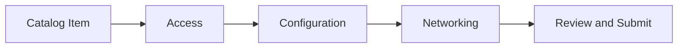

# Configuration Wizard for Cluster and VM Resources

## 1. Goals and Non-Goals

### 1.1 Goals

- Tenants provision VMs and clusters by selecting a catalog offering and completing a guided wizard with a **fixed field set per resource type** ([§2.1.1](#211-static-wizard-fields)).
- Both resource types use the same five steps: **Catalog Item → Access → Configuration → Networking → Review** (submit from Review). **Access** collects identity and credentials; **Configuration** collects image/release, sizing, and platform parameters — not networking placement.
- Catalog `field_definitions` overlay matching static paths on **Configuration** and **Networking** steps only (not Access) for **display name**, **editability**, **default**, and **validation_schema** — they do not add fields or payload paths ([§2.1.2](#212-catalog-overlay-and-defaults)).

### 1.2 Non-Goals

- **BareMetalInstance** provisioning (separate PRD)
- **Template parameters**
- **Multi-NIC** — wizard submits one `network_attachments` entry (one VN, one subnet, security groups); no add/remove NIC rows
- **Cluster pool add/remove** — tenants edit **size** only for template-defined `spec.node_sets` pools; no add/remove pools or `host_type` changes
- **`spec.additional_disks`** — wizard scope undecided ([§5](#5-open-decisions)); default: boot disk only

## 2. Requirements

### 2.1 Field model

#### 2.1.1 Static wizard fields

Fields are hardcoded per resource type, not discovered from `field_definitions`. **Access** step fields always use wizard defaults (labels, editability, validation); catalog `field_definitions` are **ignored** on Access ([§2.1.2](#212-catalog-overlay-and-defaults)). **Required** column: **?** = required vs optional not yet decided ([§5](#5-open-decisions)).

**ComputeInstance**


| Step            | Path                      | Label                                    | Widget                                 | Required |
| --------------- | ------------------------- | ---------------------------------------- | -------------------------------------- | -------- |
| Access          | `metadata.name`           | Name                                     | Text                                   | Required |
| Access          | `spec.ssh_key`            | SSH public key                           | Text (multiline)                       | ?        |
| Configuration   | `spec.image.source_ref`   | VM image (OCI reference)                 | Text                                   | Required |
| Configuration   | `spec.is_windows`         | OS family                                | Radio (`Linux`, `Windows`)             | Required |
| Configuration   | `spec.instance_type`      | Instance type                            | Picker ([§2.1.5](#215-vm-instance-type-picker-api)) | Required |
| Configuration   | `spec.user_data`          | User data (cloud-init / Ignition)        | Text (multiline)                       | Optional |
| Configuration   | `spec.boot_disk.size_gib` | Boot disk size (GiB)                     | Number                                 | ?        |
| Configuration   | `spec.run_strategy`       | Run strategy                             | Select (`Always`, `Halted`)            | Required |
| Networking      | `spec.network_attachments` | Virtual network, subnet, security groups | Pickers ([§2.1.4](#214-vm-networking-picker-apis)) | Required |

**Notes:**

- **`spec.user_data`**: plain multiline string (cloud-init or Ignition); omit from payload when empty. Stored as Secret → KubeVirt `cloudInitNoCloud`.
- **`spec.image`**: wizard collects `source_ref` only; payload always sets `spec.image.source_type` to **`registry`**. Future: ComputeImage list picker ([OSAC-979](https://redhat.atlassian.net/browse/OSAC-979)).
- **`spec.is_windows`**: Configuration-step **OS family** radio — **Linux** → `is_windows: false`; **Windows** → `is_windows: true`. Maps to the optional boolean added in [fulfillment-service PR #734](https://github.com/osac-project/fulfillment-service/pull/734) ([OSAC-717](https://redhat.atlassian.net/browse/OSAC-717)); the reconciler maps this to CR `guestOSFamily` for AAP provisioning. Required on the wizard; default selection **Linux** when no catalog `default` ([§2.1.2](#212-catalog-overlay-and-defaults)). The wizard always sends an explicit value.
- **`spec.instance_type`**: Configuration-step **instance type** picker — tenant selects a named compute bundle (cores + memory) from [§2.1.5](#215-vm-instance-type-picker-api). Payload sends **`spec.instance_type` only** (instance type name); the wizard does **not** collect or send `spec.cores` or `spec.memory_gib` ([VM Instance Types EP](/enhancements/vm-instance-types), [fulfillment-service PR #735](https://github.com/osac-project/fulfillment-service/pull/735) / OSAC-1217). The API validates the name and state; the reconciler resolves cores/memory on the CR. Catalog overlay interaction is **undecided** ([§5](#5-open-decisions)).
- **Disks**: wizard collects `spec.boot_disk.size_gib` only unless [§5](#5-open-decisions) chooses `spec.additional_disks`.
- **Networking**: pickers assemble a single `spec.network_attachments` entry; raw JSON not shown. Catalog overlay interaction is **undecided** ([§5](#5-open-decisions)). APIs: [§2.1.4](#214-vm-networking-picker-apis).

**Cluster**


| Step            | Path                        | Label                                                         | Widget                               | Required |
| --------------- | --------------------------- | ------------------------------------------------------------- | ------------------------------------ | -------- |
| Access          | `metadata.name`             | Name                                                          | Text                                 | Required |
| Access          | `spec.ssh_public_key`       | SSH public key                                                | Text (multiline)                     | ?        |
| Access          | `spec.pull_secret`          | Pull secret                                                   | Text (multiline, masked)             | Required |
| Configuration   | `spec.release_image`        | OpenShift version (release image)                             | Text                                 | Required |
| Configuration   | `spec.node_sets`            | Worker node pools                                             | Table | Required |
| Networking      | `spec.network.pod_cidr`     | Pod network CIDR                                              | Text                                 | ?        |
| Networking      | `spec.network.service_cidr` | Service network CIDR                                          | Text                                 | ?        |

**Notes:**

- **`spec.node_sets`**: after catalog selection, load `ClusterTemplates.Get` → one table row per `node_sets` key. Columns: pool name and `host_type` (read-only, from template + `HostTypes.Get`); **Nodes** = `size` input (each pool `size` must be > 0). Empty template `node_sets` handling is **undecided** ([§5](#5-open-decisions)). Payload: template `host_type` + tenant/catalog `size` per pool.

**Create payload:** Only paths in [§2.1.1](#211-static-wizard-fields) plus catalog item reference; VM hardcodes `spec.image.source_type` = `registry`; VM sends `spec.instance_type` and `spec.is_windows` explicitly, not `spec.cores` or `spec.memory_gib`.

#### 2.1.2 Catalog overlay and defaults

For each static field on **Configuration** and **Networking** steps, match `field_definitions` by `path`. **Access** step fields ignore catalog `field_definitions` entirely (wizard labels, editability, and validation only). Non-matching paths are **ignored** (not on Review, not in payload).

**Picker-backed fields:** `spec.instance_type` and `spec.network_attachments` load options from list APIs ([§2.1.5](#215-vm-instance-type-picker-api), [§2.1.4](#214-vm-networking-picker-apis)). How catalog `field_definitions` interact with those pickers (overlay, defaults, auto-select) is **undecided** ([§5](#5-open-decisions)).

| Aspect     | Matching entry                                                              | No matching entry     |
| ---------- | --------------------------------------------------------------------------- | --------------------- |
| Label      | `display_name` or wizard default                                            | Wizard default        |
| Editable   | `editable: false` → read-only on wizard step; blank when no catalog `default` | `true`                |
| Default    | Catalog `default` if set; else blank                                        | Blank                 |
| Validation | `validation_schema` maps to integer/enum/text widgets; inline errors on blur; full step validation on Next (see [§2.2](#22-wizard-behavior)) | API/wizard validation |

Non-editable fields (`editable: false`) are **read-only** on the wizard step (Configuration or Networking), not hidden. With a catalog `default`, the value is included in the payload. Without a catalog `default`, the field is **blank and read-only**. Read-only fields use disabled/read-only controls (same widget type as editable fields where applicable).

**Default rules:** Fields start **blank** unless catalog `default` is set or a **special case** applies:


| Case                | Behavior                                                                                                                 |
| ------------------- | ------------------------------------------------------------------------------------------------------------------------ |
| `spec.run_strategy` | Pre-select `Always` when no catalog `default`                                                                            |
| OS family (VM)      | Pre-select **Linux** (`is_windows: false`) when no catalog `default`                                                     |
| Instance type (VM)  | **auto-select** when `InstanceTypes.List` returns exactly one option — subject to catalog overlay decision ([§5](#5-open-decisions)) |
| Networking pickers  | **auto-select** when a list returns exactly one option (VN → subnet → SGs) — subject to catalog overlay decision ([§5](#5-open-decisions)) |

#### 2.1.3 Open required fields

Fields marked **?** in [§2.1.1](#211-static-wizard-fields) — resolve Required vs Optional before implementation ([§5](#5-open-decisions)).

### 2.1.4 VM networking picker APIs

The wizard loads picker options from the **public** fulfillment APIs (`osac.public.v1`). The UI uses the generated OpenAPI client (REST); gRPC equivalents are listed for reference.

| Picker | gRPC | REST | Purpose |
| ------ | ---- | ---- | ------- |
| Virtual network | `VirtualNetworks.List` | `GET /api/fulfillment/v1/virtual_networks` | Tenant-visible virtual networks |
| Subnet | `Subnets.List` | `GET /api/fulfillment/v1/subnets` | Subnets in the selected virtual network |
| Security groups | `SecurityGroups.List` | `GET /api/fulfillment/v1/security_groups` | Security groups in the selected virtual network |

**List request parameters** (all three): optional query `filter` (CEL), `limit`, `offset`, `order`. Tenant scope is implicit from the authenticated session.

**Subnet and security group filters** (after virtual network selection):

```text
this.spec.virtual_network == "<vn-id>"
```

**Picker display and values:**

| Picker | Option label | Selected value |
| ------ | ------------ | -------------- |
| Virtual network | `metadata.name` (fallback `id`) | VirtualNetwork `id` — drives subnet/SG list filters only |
| Subnet | `metadata.name` (fallback `id`) | Subnet `id` |
| Security group | `metadata.name` (fallback `id`) | SecurityGroup `id` (multi-select) |

**Create payload assembly** — one `spec.network_attachments` element:

```json
{
  "subnet": "<subnet-id>",
  "security_groups": ["<security-group-id>"]
}
```

Per `NetworkAttachment` in `compute_instance_type.proto`. The wizard does not send virtual network ID in `network_attachments`; placement is implied by the subnet (security groups must belong to the same virtual network).

**Load order:** virtual network list → on selection, load filtered subnet and security group lists → auto-select when a list returns exactly one item ([§2.1.2](#212-catalog-overlay-and-defaults)); catalog `default` interaction subject to [§5](#5-open-decisions).

### 2.1.5 VM instance type picker API

The Configuration step loads instance type options from the **public** fulfillment API (`osac.public.v1`). The UI uses the generated OpenAPI client (REST); gRPC equivalent listed for reference.

| Picker | gRPC | REST | Purpose |
| ------ | ---- | ---- | ------- |
| Instance type | `InstanceTypes.List` | `GET /api/fulfillment/v1/instance_types` | Tenant-visible instance types (ACTIVE and DEPRECATED by default) |

**List request parameters:** optional query `filter` (CEL), `limit`, `offset`, `order`. Tenant scope is implicit from the authenticated session. The default list excludes **OBSOLETE** instance types (not selectable for new VMs).

**Picker display and values:**

| Picker | Option label | Selected value |
| ------ | ------------ | -------------- |
| Instance type | `metadata.name` plus `spec.cores` and `spec.memory_gib` (e.g. `standard-4-16 — 4 vCPU, 16 GiB`); indicate **DEPRECATED** state in the label when `spec.state` is DEPRECATED | Instance type name (`metadata.name` / `id`) → `spec.instance_type` on create |

**Create payload:** send only the instance type **name** string:

```json
{
  "instance_type": "standard-4-16"
}
```

Do **not** send `cores` or `memory_gib` — they are mutually exclusive with `instance_type` at the API ([PR #735](https://github.com/osac-project/fulfillment-service/pull/735)).

**Deprecation handling:** if the selected type is DEPRECATED, create may succeed with **warnings** in the response; the wizard surfaces those warnings after submit (non-blocking). OBSOLETE types are not offered in the picker.

**Load order:** load instance type list when entering Configuration → auto-select when the list returns exactly one item ([§2.1.2](#212-catalog-overlay-and-defaults)); catalog `default` interaction subject to [§5](#5-open-decisions).

### 2.2 Wizard behavior



- **Catalog Item:** Require catalog item selection.
- **Review:** Shows the same values the user sees on wizard step fields (Access, Configuration, Networking) — blank, catalog- or wizard-defaulted, or user-entered — with the same labels as on each step. Submit from Review.
- **Step navigation:** Next is always enabled. On click, validate every field on the current step — including fields that have not yet blurred and therefore have no inline error shown. Surface any hidden errors inline; if validation fails, show an alert asking the user to fix the errors and do not advance.

## 3. Acceptance Criteria

- Wizard provisions VM or Cluster using only [§2.1.1](#211-static-wizard-fields) payload paths plus hardcoded VM `source_type` and catalog item reference.
- Five-step flow: Catalog Item → Access → Configuration → Networking → Review; submit from Review.
- Review shows the same values as on wizard step fields (blank, default-driven, or user-entered).
- Catalog overlay and default rules per [§2.1.2](#212-catalog-overlay-and-defaults) on Configuration and Networking only (Access ignores `field_definitions`); picker-backed field overlay resolved per [§5](#5-open-decisions); non-editable fields without `default` appear blank and read-only on their wizard step and on Review; non-editable fields with `default` appear read-only with value on their wizard step and on Review.
- VM: single `network_attachments` entry assembled from picker APIs; instance type picker sets `spec.instance_type` (not `cores`/`memory_gib`); OS family radio sets `spec.is_windows` (default **Linux**); optional `user_data` omitted when empty; create warnings for deprecated instance types are shown to the user.
- Cluster: `node_sets` matches template pool keys with template `host_type` and tenant `size` > 0; empty template `node_sets` handling per [§5](#5-open-decisions).
- All **?** requiredness decisions and picker overlay questions resolved before release ([§5](#5-open-decisions)).
- On Next click, validate all fields on the current step (including untouched fields); surface hidden inline errors; show an alert if invalid; do not advance until the step is valid.

## 4. Dependencies

- `ComputeInstanceCatalogItem`, `ClusterCatalogItem` (with `field_definitions`)
- `ClusterTemplates.Get`, `HostTypes.Get` (cluster Configuration step)
- `VirtualNetworks.List`, `Subnets.List`, `SecurityGroups.List` (gRPC `osac.public.v1`) / REST `GET /api/fulfillment/v1/virtual_networks`, `.../subnets`, `.../security_groups` ([§2.1.4](#214-vm-networking-picker-apis))
- `InstanceTypes.List` (gRPC `osac.public.v1`) / REST `GET /api/fulfillment/v1/instance_types` ([§2.1.5](#215-vm-instance-type-picker-api))
- ComputeInstance and Cluster create APIs
- `spec.instance_type` on ComputeInstance ([OSAC-1217](https://redhat.atlassian.net/browse/OSAC-1217), [fulfillment-service PR #735](https://github.com/osac-project/fulfillment-service/pull/735)) — required for VM instance type picker
- `spec.is_windows` on ComputeInstance ([OSAC-717](https://redhat.atlassian.net/browse/OSAC-717), [fulfillment-service PR #734](https://github.com/osac-project/fulfillment-service/pull/734)) — required for VM OS family in the wizard

## 5. Open decisions

Resolve before implementation.

### Required vs optional (`?`)

| Path | Resource |
| ---- | -------- |
| `spec.ssh_key` / `spec.ssh_public_key` | Both — **one decision**: Required (block Next) vs Optional (omit when empty, like `spec.user_data`) |
| `spec.boot_disk.size_gib` | ComputeInstance |
| `spec.network.pod_cidr`, `spec.network.service_cidr` | Cluster |

### Catalog overlay vs picker-backed fields

Picker-backed paths: `spec.instance_type`, `spec.network_attachments` (and nested paths such as `spec.network_attachments.subnet`). **Open question:** when a catalog item defines matching `field_definitions`, how do they interact with list-API pickers?

| Question | Options |
| -------- | ------- |
| **Overlay applies to picker fields?** | **Yes** — catalog `display_name`, `editable`, `default`, and `validation_schema` apply like other static fields; picker lists still populate options from APIs. **No** — picker UX is API-driven only; matching `field_definitions` are ignored for these paths. |
| **Catalog `default` vs single-option auto-select?** | When both a catalog `default` and a single-option list API result exist: **Catalog default wins** (pre-select catalog value; skip auto-select). **Auto-select wins** (use sole API option when no catalog `default`). **Fail** — wizard blocks if the sole API option differs from catalog `default`. **Other** — describe precedence rule. |
| **Catalog `default` not in list API options?** | When a matching `field_definitions` entry has a `default` that is **not** among the options returned by the picker list API: **Fail** — wizard blocks after catalog selection (or when the list loads) with an error; tenant cannot proceed until the catalog item or environment is corrected. **Ignore default** — treat as no catalog `default`; picker starts blank (or auto-selects if exactly one API option). **Warn and blank** — show a non-blocking warning; picker starts blank. **Other** — describe behavior. |
| **Nested networking paths?** | If overlay applies: do `field_definitions` on nested paths (e.g. `spec.network_attachments.subnet`) constrain picker defaults/validation, or only the top-level path? |

Resolve before implementation; document the chosen rule in [§2.1.2](#212-catalog-overlay-and-defaults) and update acceptance criteria.

### Cluster template `node_sets`

| Question | Options |
| -------- | ------- |
| **Empty template `node_sets` (Cluster)?** | After catalog selection, `ClusterTemplates.Get` returns **empty** `node_sets`: **Block** — wizard fails with an error; tenant cannot proceed until the catalog item or template is corrected. **Filter catalog** — do not offer catalog items whose backing template has empty `node_sets`. **Warn and continue** — show a non-blocking warning; Configuration step shows an empty pool table. **Other** — describe behavior. Payload when pools exist: template `host_type` + tenant/catalog `size` per pool ([§2.1.1](#211-static-wizard-fields)). |

Resolve before implementation; document the chosen rule in [§2.1.1](#211-static-wizard-fields) and update acceptance criteria.

### Additional disks

Not in [§2.1.1](#211-static-wizard-fields) today. **Unknown** whether v1 needs wizard UI for `spec.additional_disks[]` or boot disk + API/CLI is enough.

| Option | Outcome |
| ------ | ------- |
| **No (default)** | Out of scope ([§1.2](#12-non-goals)); boot disk only |
| **Yes** | Add repeatable `size_gib` rows on Configuration; add to §2.1.1 |
