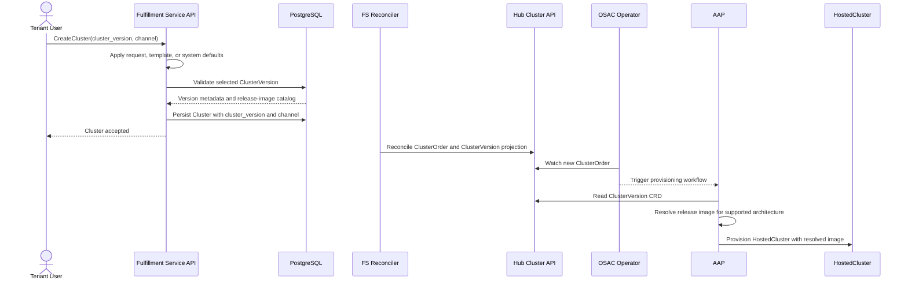
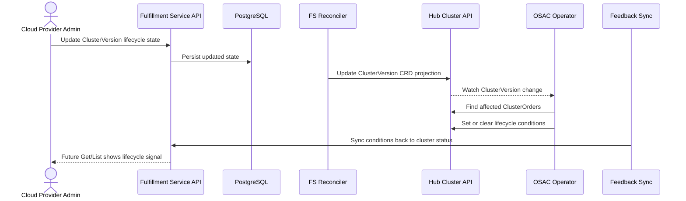

# ClusterVersion

## Summary

This enhancement introduces a `ClusterVersion` resource that lets OSAC expose OpenShift versions as managed catalog entries instead of asking users to provide raw release-image pullspecs. The fulfillment-service stores the catalog as the source of truth, projects it to hub clusters as a `ClusterVersion` CRD, validates version selection during cluster creation, and lets the operator surface lifecycle changes such as deprecation on existing clusters. See [PRD](prd.md) for detailed requirements.

## Motivation

Cluster creation currently requires a caller to know an exact OpenShift release image URL. That exposes implementation details, makes validation weaker than it should be, and provides no platform-level way to discover which versions are supported, deprecated, or obsolete. OSAC also lacks a shared version identity that later features, especially upgrade workflows, can reference.

Introducing a managed version catalog fixes those gaps. It gives admins a place to manage version availability and lifecycle, gives tenants a stable version identifier to select, and gives the platform a way to propagate lifecycle signals to already-created clusters without embedding release-image details in the user-facing API.

### Goals

- Keep semantic version selection in the API layer and defer release-image resolution to provisioning.
- Reuse existing all-hubs reconciliation and feedback patterns for cross-component propagation where possible.
- Carry version identity and channel metadata end-to-end without storing resolved release images on `Cluster` objects.
- Support future multi-architecture expansion without introducing a second version-to-image schema.
- Preserve an upgrade-compatible version identity model for later work such as OSAC-1415.

### Non-Goals

- Implement cluster upgrades, rollback, or upgrade orchestration. That remains the responsibility of OSAC-1415.
- Automatically import or synchronize versions from ACM `ClusterImageSet` resources in `v0.2`.
- Extend this design to VM image management; that remains separate work under `ComputeImage`.
- Add architecture-aware scheduling or NodePool-specific image selection in `v0.2`.
- Require the operator to resolve release images; image resolution remains a provisioning-layer responsibility.
- Guarantee catalog-item authoring-time validation in the first cut if the catalog-items work has not landed yet.

## Proposal

OSAC adds a new platform-global `ClusterVersion` resource. Each entry represents one OpenShift version and includes:

- the semantic version identifier exposed to users
- one or more release images, keyed by architecture
- lifecycle state such as active, deprecated, or obsolete
- optional update-channel metadata
- an optional replacement version for deprecated entries
- flags for availability to new clusters and default selection

The fulfillment-service remains the source of truth for this data. It reconciles the catalog to hub clusters as a `ClusterVersion` CRD so that downstream components can consume version identity and lifecycle changes locally. The operator uses the hub CRD to react to lifecycle changes on existing clusters. AAP uses the same hub CRD to resolve the actual release image during provisioning.

The cluster API stops accepting raw `release_image` input and instead uses:

- `cluster_version` as the selected version identifier
- `channel` as optional update-channel metadata

`ClusterTemplate` gains:

- `spec_defaults.cluster_version` for template-level defaulting
- `supported_architectures` to declare which architectures its provisioning implementation can handle

The initial milestone is `v0.2` and is focused on CaaS. The main affected components are:

- `fulfillment-service`
- `osac-operator`
- `osac-aap`
- `osac-installer`
- `osac-test-infra`

### Workflow Description

#### Actors

- **Cloud Provider Admin** manages the version catalog.
- **Tenant User** creates clusters using a selected version.
- **Fulfillment Service** validates requests and projects catalog data to hubs.
- **OSAC Operator** reacts to version lifecycle changes on existing cluster resources.
- **AAP** resolves the final release image during provisioning.

#### Admin workflow: manage the version catalog

1. A Cloud Provider Admin creates a `ClusterVersion` entry with a version identifier, at least one release image, and optional channel and lifecycle metadata. If `enabled` is not set explicitly, the server defaults it to `true` so the version is usable for new cluster creation by default.
2. The fulfillment-service validates the entry, persists it, and enforces catalog invariants such as unique version identity and at most one default version.
3. The fulfillment-service reconciles the entry to all hub clusters as a `ClusterVersion` CRD.
4. The admin can later mark the version as deprecated or obsolete, set a replacement version, disable it for new cluster creation, or change which version is the default.

#### Tenant workflow: create a cluster with a managed version



1. A Tenant User creates a cluster and may specify `cluster_version` and `channel`.
2. Resolution precedence for `cluster_version` is: explicit user input, then the default from the active request path (template or catalog item, but never both), then the system default version. If the request omits `cluster_version`, the server starts at the highest remaining source in that order.
3. The fulfillment-service validates that the selected version exists, is still available for new clusters, is not obsolete, and is compatible with the selected template.
4. The fulfillment-service stores `cluster_version` and `channel` on the cluster and reconciles them to the hub-facing `ClusterOrder`.
5. AAP resolves the release image from the hub `ClusterVersion` CRD and uses that resolved image for provisioning.

#### Error handling

| Scenario | API behavior | gRPC code |
| ---- | ---- | ---- |
| Referenced version does not exist | Reject the request before cluster creation. | `InvalidArgument` |
| Referenced version is disabled | Reject the request for new cluster creation. | `InvalidArgument` |
| Referenced version is obsolete | Reject the request for new cluster creation. | `InvalidArgument` |
| No version can be resolved through input or defaults | Reject the request until a caller or admin supplies one. | `InvalidArgument` |
| Provided channel is not valid for the selected version | Reject the request before persistence. | `InvalidArgument` |
| Selected version has no release image compatible with the template's supported architectures | Reject the request before persistence. | `InvalidArgument` |
| `cluster_version` or `channel` is changed after create | Reject the update because both fields are immutable. | `InvalidArgument` |
| A referenced version is still in use during deletion | Reject the deletion until references are removed. | `FailedPrecondition` |
| Two concurrent requests try to set different defaults | Allow one winner and reject the other update. | `FailedPrecondition` |

#### Lifecycle workflow: propagate deprecation or obsolescence



1. An admin updates a `ClusterVersion` lifecycle state in the fulfillment-service.
2. The reconciler updates the corresponding hub `ClusterVersion` CRD.
3. The operator detects the change, finds affected `ClusterOrder` resources, and sets or clears lifecycle conditions.
4. Those conditions are synced back to the fulfillment-service so that cluster `Get` and `List` responses expose the lifecycle signal.

`enabled` is treated as admission policy for new cluster creation, not as a lifecycle signal for already-created clusters. Changing `enabled` blocks new use of a version but does not add conditions to existing clusters.

### API Extensions

This enhancement adds or changes the following API surfaces:

- **Fulfillment gRPC/REST APIs**
  - New `ClusterVersions` API for managing and listing version catalog entries.
  - `Clusters` API replaces `release_image` input with `cluster_version` and `channel`.
  - `ClusterTemplates` gain version-default and architecture-capability fields relevant to cluster creation.
  - Public `ClusterVersions/List` hides disabled and obsolete versions by default unless the caller explicitly filters on lifecycle or availability fields.
  - The fulfillment-service event payload gains a `ClusterVersion` entry so create, update, and delete operations participate in change notifications and event-driven reconciliation.
- **OSAC CRDs**
  - New namespaced hub `ClusterVersion` CRD as a projection of the fulfillment-service catalog.
  - `ClusterOrder` gains `clusterVersion` and `channel`.
- **Lifecycle signaling**
  - Clusters receive lifecycle conditions such as deprecated or obsolete when their referenced version changes state.
  - The fulfillment-service cluster API surface gains matching lifecycle condition types `CLUSTER_CONDITION_TYPE_VERSION_DEPRECATED` and `CLUSTER_CONDITION_TYPE_VERSION_OBSOLETE` so those signals are visible on cluster `Get` and `List` responses.

The public API does not expose release-image URLs. Tenant-facing clients see semantic version information and lifecycle state, while release-image resolution stays internal.

#### Public `ClusterVersion` schema

The public API contract for `ClusterVersion` is intentionally small and safe for tenant-facing consumers:

```protobuf
message ClusterVersion {
  string id = 1;
  Metadata metadata = 2;
  ClusterVersionSpec spec = 3;
  ClusterVersionStatus status = 4;
}

message ClusterVersionSpec {
  optional bool enabled = 2;
  optional bool is_default = 3;
  repeated string available_channels = 4;
  ClusterVersionState state = 5;
  ClusterVersionDeprecation deprecation = 6;
  string version = 7;
}

enum ClusterVersionState {
  CLUSTER_VERSION_STATE_UNSPECIFIED = 0;
  CLUSTER_VERSION_STATE_ACTIVE = 1;
  CLUSTER_VERSION_STATE_DEPRECATED = 2;
  CLUSTER_VERSION_STATE_OBSOLETE = 3;
}

message ClusterVersionDeprecation {
  string replacement = 1;
  google.protobuf.Timestamp deprecation_timestamp = 2;
  google.protobuf.Timestamp obsolescence_timestamp = 3;
}
```

- **Stable identifier:** dependent features should reference `spec.version`.
- **Primary UI fields:** `spec.version`, `spec.state`, `spec.enabled`, `spec.is_default`, `spec.available_channels`, and `spec.deprecation.replacement`.
- **Timestamp semantics:** deprecation timestamps are system-managed lifecycle metadata rather than admin-supplied inputs.

#### Private-only fields

The private and internal form of `ClusterVersion` carries release-image metadata that is not exposed in the public API:

```protobuf
message ClusterVersionReleaseImage {
  string architecture = 1;
  string url = 2;
}
```

- **Visibility split:** private `ClusterVersionSpec` includes `release_images[]`; public `ClusterVersionSpec` does not.
- **Reason:** the platform can validate and resolve release images without exposing raw pullspecs to tenant-facing clients.
- **Naming model:** in the fulfillment-service, `metadata.name` may be a DNS-safe slug such as `ocp-4-17-0`; on the hub CRD, `metadata.name` is the semantic version string from `spec.version`, such as `4.17.0`.
- **Uniqueness key:** uniqueness is enforced on `spec.version`, not on `metadata.name`.

#### Changes to existing resource schemas

Dependent features are more likely to interact with the changes to existing schemas than with the new catalog resource itself:

```protobuf
message ClusterSpec {
  optional string cluster_version = 9;
  optional string channel = 10;
  // release_image is removed from the API contract.
}

message ClusterTemplateSpecDefaults {
  optional string cluster_version = 5;
  // release_image defaults are removed from this contract in favor of cluster_version.
}
```

```protobuf
message ClusterTemplate {
  repeated string supported_architectures = 8;
}
```

- **Template version defaults:** `spec_defaults.cluster_version` is set by the admin via the private API after template publication. The publish pipeline preserves admin-set values across re-publication.
- **ClusterOrder CRD:** gains `clusterVersion` and `channel`; it carries semantic version identity and channel metadata, not a resolved release image.
- **Cluster lifecycle API:** cluster responses gain matching lifecycle condition types for version deprecation and obsolescence so downstream features and UI flows can render durable warnings from cluster state.
- **Template migration:** `spec_defaults.release_image` is no longer part of the cluster-creation contract. Templates that previously relied on that field must migrate to `spec_defaults.cluster_version`.

#### UI-facing behavior

The public API behavior that matters most to UI consumers is:

- default `ClusterVersions/List` calls hide disabled and obsolete versions unless the caller explicitly filters for them
- create-time warnings are visible to gRPC callers, but REST callers should rely on cluster lifecycle conditions returned by later `Get` and `List` requests
- `enabled=false` blocks new cluster creation with a version but does not add a lifecycle condition to existing clusters
- `spec.deprecation.replacement` is the field UI flows can use to suggest a newer version when the current one is deprecated

Example public payload shape:

```json
{
  "id": "uuid",
  "metadata": {
    "name": "ocp-4-17-0"
  },
  "spec": {
    "version": "4.17.0",
    "enabled": true,
    "isDefault": true,
    "state": "DEPRECATED",
    "availableChannels": ["stable-4.17", "fast-4.17"],
    "deprecation": {
      "replacement": "4.18.0"
    }
  },
  "status": {}
}
```

#### CLI surface

- **Tenant flow:** `osac create cluster` accepts `--cluster-version` and `--channel`.
- **Admin flow:** the version catalog is managed with:
  - `osac create cluster-version`
  - `osac get cluster-version`
  - `osac get cluster-versions`
  - `osac update cluster-version`
  - `osac delete cluster-version`
- **Lookup behavior:** admin lookup should resolve by semantic version as well as object identity so commands such as `osac get cluster-version 4.17.0` are natural to use.
- **Rendered fields:** CLI output should expose the same user-facing fields as the public API: version, lifecycle state, enabled/default status, available channels, and replacement version when present.

### Implementation Details/Notes/Constraints

#### Design overview

- **Semantic version selection:** happens at the API layer.
- **Release-image resolution:** happens at provisioning time.
- **Why:** this separation keeps the user-facing cluster API stable and future-proofs the design for multi-architecture support and upgrade workflows.

#### Data model

The concise schema shape below keeps the fields that matter to the design and omits boilerplate:

```protobuf
message ClusterVersionSpec {
  repeated ClusterVersionReleaseImage release_images = 1;
  // Release images are stored per architecture so the model can grow into
  // multi-architecture support without introducing a second schema later.

  optional bool enabled = 2;
  // Controls whether new clusters may select this version.

  optional bool is_default = 3;
  // At most one active ClusterVersion may be default.

  repeated string available_channels = 4;
  // Carried now so later upgrade work can reuse the same version identity.

  ClusterVersionState state = 5;
  ClusterVersionDeprecation deprecation = 6;

  string version = 7;
  // This is the stable semantic version identifier.
}
```

```protobuf
message ClusterVersionDeprecation {
  string replacement = 1;
  // Must reference an existing, non-deleted ClusterVersion by spec.version.

  google.protobuf.Timestamp deprecation_timestamp = 2;
  // Set by the system when state transitions to DEPRECATED.

  google.protobuf.Timestamp obsolescence_timestamp = 3;
  // Set by the system when state transitions to OBSOLETE.
  // Both timestamps are cleared if the version returns to ACTIVE.
}
```

```go
type ClusterVersionSpec struct {
    ReleaseImages []ClusterVersionReleaseImage `json:"releaseImages"`
    State ClusterVersionState `json:"state,omitempty"`
    AvailableChannels []string `json:"availableChannels,omitempty"`
    Enabled bool `json:"enabled"`
    IsDefault bool `json:"isDefault,omitempty"`
    Deprecation *ClusterVersionDeprecation `json:"deprecation,omitempty"`
}

type ClusterVersionStatus struct{}
```

The hub projection is intentionally small: it carries version identity, lifecycle state, availability, and release-image metadata, but no provisioning status. `ClusterVersion` is reference data, not a provisionable resource, so it does not follow the usual AAP-backed Phase / Job-history pattern used by workload-facing OSAC resources. OSAC uses `osac.openshift.io/v1alpha1`, so this resource does not conflict with OpenShift's built-in `ClusterVersion` in `config.openshift.io/v1`. Using a short name such as `cver` or the fully qualified resource name avoids CLI ambiguity.

```protobuf
message ClusterSpec {
  optional string cluster_version = 9;
  // Replaces raw release_image selection in the user-facing API.

  optional string channel = 10;
  // Optional channel metadata validated against ClusterVersion.
}

message ClusterTemplateSpecDefaults {
  optional string cluster_version = 5;
  // Lets templates provide a default managed version.
}

message ClusterTemplate {
  repeated string supported_architectures = 8;
  // Declares what the provisioning implementation can actually handle.
}
```

`ClusterOrderSpec` carries `clusterVersion` and `channel` to the hub.

#### Core invariants

- A version identifier is unique among active `ClusterVersion` entries, and that uniqueness is enforced on `spec.version` rather than `metadata.name`.
- At most one version can be marked as the default.
- Setting `is_default=true` on one version clears the previous default within the same transaction.
- Obsolete versions cannot be used for new clusters.
- An obsolete or disabled version cannot be set as the default.
- If a default version transitions to `OBSOLETE` or is disabled (`enabled=false`), the server clears `is_default` as part of the same change.
- `spec.version` is immutable after creation.
- `cluster_version` and `channel` are immutable after cluster creation.
- Versions referenced by clusters or templates cannot be removed while still in use.
- Public APIs expose version identity and lifecycle state, but not release-image URLs.

#### Validation model

- **Create-time checks:** existence of the referenced version, availability for new cluster creation, lifecycle state, channel membership when provided, compatibility between the template's supported architectures and the version's available release images, and version format using a Kubernetes-safe semver subset because the version string becomes the hub `ClusterVersion` resource name.
- **Reference checks:** `deprecation.replacement`, when set, must point at an existing non-deleted `ClusterVersion`.
- **Template default checks:** `ClusterTemplate` create and update validate `spec_defaults.cluster_version` in the server layer so admins get descriptive errors; database triggers remain the race-safety backstop.
- **State transitions:** lifecycle state transitions are allowed in any direction.
- **Default guard:** if an admin attempts to set `is_default=true` on a version that is `OBSOLETE` or disabled, the request is rejected.
- **Deprecation signaling:** if a deprecated version is still allowed for new clusters, creation succeeds but the user receives a deprecation warning.
- **Client behavior:** gRPC callers can receive immediate create-time warnings. REST callers do not receive those sibling `warnings` fields because the gateway response body is the embedded `object`; for REST, the durable notification path is the cluster lifecycle conditions returned by later `Get` and `List` calls.

#### Database considerations

- **Persistence model:** the fulfillment-service needs new live and archived storage for `ClusterVersion`.
- **Uniqueness:** a partial unique index enforces unique active `spec.version`.
- **Single default:** a partial unique index enforces a single active default.
- **Reference integrity:** validation triggers reject clusters or templates that point at missing or deleted versions.
- **Delete protection:** soft deletion is rejected while references still exist.
- **Performance:** an index on `clusters.spec.cluster_version` keeps reference checks efficient.
- **Enforcement split:** these database checks complement, rather than replace, server-side validation. `spec.version` immutability is enforced in the server layer because generic immutable-column triggers cannot protect JSON payload fields.
- **Error mapping:** reference-validation failures translate to `InvalidArgument`, while delete-in-use failures translate to `FailedPrecondition`.

#### Reconciliation model

The fulfillment-service is the source of truth for `ClusterVersion` data and projects that data to hub-scoped consumers.

##### Projection

The fulfillment-service reconciles every `ClusterVersion` entry to a namespaced hub `ClusterVersion` CRD. This gives downstream components a local hub-scoped representation of version identity, lifecycle state, and release-image metadata without making the hub the source of truth. [[tenant_reconciler_function.go](https://github.com/osac-project/fulfillment-service/blob/737af8524e73674ee7b93434ee70d69f5b01fc9a/internal/controllers/onboarding/tenant_reconciler_function.go)]

The existing cluster reconciler is also modified to copy `spec.cluster_version` and `spec.channel` from the fulfillment-service `Cluster` into the hub `ClusterOrder`. That handoff is what lets operator and AAP logic consume semantic version identity from the hub-facing resource instead of a resolved image.

##### Triggers

Reconciler registration reacts both to `ClusterVersion` change events and to new-hub registration events. The new-hub trigger ensures that when a hub is added, existing `ClusterVersion` entries are reconciled to it immediately rather than waiting for the periodic full sync.

##### Operator ordering

On the operator side, lifecycle condition handling runs after the existing `ClusterOrder` reconciliation path. That ordering ensures version-state signaling augments normal provisioning reconciliation rather than replacing or short-circuiting it.

##### Current limitation

The reconciler inherits the all-hubs iteration behavior of the onboarding tenant reconciler: with multiple hubs, one unreachable hub can block progress to later hubs in the same pass. This is acceptable for the single-hub `v0.2` deployment model, but a future multi-hub design would likely need best-effort iteration and aggregated error reporting.

#### Provisioning model

AAP consumes the hub projection rather than relying on the user-facing cluster API to carry a resolved image.

##### Resolution point

AAP reads the namespaced hub `ClusterVersion` CRD during provisioning and resolves the final release image there rather than on the user-facing cluster API. This keeps the API contract semantic while allowing the provisioning layer to choose the concrete image it needs. In `v0.2`, existing templates use the `multi` architecture entry.

##### Failure behavior

Provisioning fails closed if the expected hub `ClusterVersion` CRD is missing. The design intentionally avoids silently falling back to a template-default release image because that would decouple actual provisioning behavior from the admin-managed version catalog and could provision the wrong OpenShift version.

##### Template version defaults

- `supported_architectures` is declared in template roles via `meta/osac.yaml` and published to the fulfillment-service through the AAP template pipeline.
- `spec_defaults.cluster_version` is set by the admin via the private API after template publication. The template author cannot know which `ClusterVersion` catalog entries exist in a given deployment, so this value is a deployment-specific choice rather than a template capability.

#### Event and feedback plumbing

This design has a forward event path for projection and a reverse feedback path for lifecycle visibility.

##### Forward path

`ClusterVersion` must participate in the fulfillment-service event payload flow so create, update, and delete operations emit change notifications. The event proto therefore needs a `ClusterVersion` entry in its payload `oneof`. Without that payload support, event-driven reconciliation does not happen. Without generic-server payload mapping for `ClusterVersion`, CRUD operations fail instead of committing because event emission rolls the transaction back.

##### Reverse path

Version lifecycle conditions set on `ClusterOrder` resources must be mirrored back into the fulfillment-service cluster status surface so API clients can see the same lifecycle signal the operator applies on the hub. This extends the existing `ClusterOrder` feedback path rather than introducing a `ClusterVersion`-specific feedback controller. The [feedback controller's condition switch](https://github.com/osac-project/osac-operator/blob/4ad2b2da0cdcdca69e4a9ed47e9f92f6267e4a2c/internal/controller/feedback_controller.go#L182-L199), the `ClusterOrder` condition type enum, and the fulfillment-service cluster condition enums must all be extended to handle the new lifecycle condition types.

##### `v0.2` scope

`v0.2` does not introduce a dedicated `ClusterVersion` feedback controller. `ClusterVersionStatus` is empty, so there is no resource-specific status to sync back. The fulfillment-service reconciler remains responsible for projecting, updating, and deleting the hub `ClusterVersion` CRD, while the operator's existing `ClusterOrder` controller watches `ClusterVersion` changes to set lifecycle conditions on affected orders.

#### Scope notes for `v0.2`

- The design supports channels now mainly so later upgrade work can reuse the same identity and metadata.
- Multi-architecture support is enabled by the schema shape, but `v0.2` still assumes existing templates resolve the `multi` image.
- Catalog-item authoring-time validation may be deferred if the catalog-items work lands later than this enhancement.
- Catalog-item consumption-time resolution needs no special path-resolution change: existing field-definition application already handles `spec.cluster_version`, so the added work is validation rather than a new substitution mechanism.
- `supported_architectures` must not be published before the fulfillment-service schema accepts the field; producer and consumer rollout order matters.

### Security Considerations

- **Authentication and authorization:** this enhancement inherits the existing OSAC security model. The fulfillment-service continues to use the current JWT-based request authentication chain, and write operations for the version catalog remain restricted through existing OPA-based admin authorization.
- **Data exposure:** `release_images[].url` remains private to admin-facing and internal flows; tenant-facing APIs expose semantic version identity and lifecycle metadata, but not raw image pullspecs.
- **Input validation:** version strings, channels, and template compatibility are validated before persistence so invalid references do not leak into downstream provisioning.

### Failure Handling and Recovery

| Failure mode | What happens | Recovery | User observes |
| ---- | ---- | ---- | ---- |
| Database error during create or update | The request transaction rolls back. | Retry the request after the backend recovers. | The API returns an internal error and no partial object is created. |
| Two requests race to set different default versions | One request succeeds and the other loses the uniqueness race. | Retry the losing request if needed after reviewing the current default. | The loser receives `FailedPrecondition`. |
| A referenced version is deleted between validation and persistence | Database-side reference checks reject the write. | Retry with a valid version after reconciliation settles. | The create or update fails with `InvalidArgument`. |
| The hub projection is temporarily missing or stale | Lifecycle conditions may not appear yet, or provisioning may fail closed if it depends on the missing projection. | Event-driven reconciliation or periodic full sync recreates the projection; retries then succeed. | Status may lag, or provisioning may fail and retry rather than silently using the wrong image. |
| AAP cannot resolve the hub `ClusterVersion` CRD | Provisioning stops before using an unmanaged fallback image. | Retry after the projection exists. | The cluster remains unprovisioned until reconciliation catches up. |
| `ClusterOrder` lifecycle-condition feedback sync back to fulfillment-service is unavailable | Hub-side lifecycle conditions still exist, but API-side cluster status may lag. | Controller retries continue until the sync path is healthy again. | Cluster `Get` and `List` may temporarily miss a lifecycle condition already visible on the hub. |
| A controller restarts mid-reconciliation | Reconciliation restarts from persisted state. | Normal controller retry behavior resumes the work. | At worst, propagation is delayed; the design relies on idempotent reconciliation rather than one-shot execution. |

### RBAC / Tenancy

- **Resource model:** `ClusterVersion` is a platform-global resource, not a tenant-owned one.
- **Visibility:** authenticated users may read tenant-safe version metadata, while create, update, and delete remain Cloud Provider Admin operations through OPA enforcement.
- **Tenant metadata:** no tenant isolation annotations such as `osac.openshift.io/tenant` or `osac.openshift.io/owner-reference` are required on `ClusterVersion` because it is not a tenant-scoped resource. Tenant isolation still applies at the consuming-resource level, where clusters and cluster orders remain tenant-owned.
- **Hub RBAC:** hub-access RBAC must allow the fulfillment-service reconciler to manage `ClusterVersion` CRDs on hub clusters, while the operator and AAP need read access to consume those projections.

### Observability and Monitoring

No new observability changes. Existing monitoring mechanisms apply.

- **API visibility:** `ClusterVersions` API requests use the existing fulfillment-service gRPC metrics and structured logging.
- **Controller visibility:** lifecycle propagation continues to surface through existing operator reconciliation logs and Kubernetes events.
- **Provisioning visibility:** AAP job output remains the primary signal for provisioning behavior and failure diagnosis.

### Risks and Mitigations

| Risk | Mitigation |
| ---- | ---------- |
| No catalog entries exist when the feature is deployed. | Ship seeded versions as part of the deployment story and document the admin setup flow. |
| The public cluster API changes from raw release-image input to version selection. | Treat this as a coordinated API change for a fresh-deployment milestone and update dependent components together. |
| Cross-component skew causes one component to expect fields another component does not yet support. | Deploy fulfillment-service schema changes and hub CRD support before enabling downstream publisher or provisioning changes. |
| The hub `ClusterVersion` projection lags behind the fulfillment-service source of truth. | Use event-driven reconciliation plus periodic full sync; treat hub state as eventually consistent but self-healing. |
| A selected version is incompatible with a template's provisioning implementation. | Validate architecture compatibility before provisioning begins. |
| Catalog-item integration lands later than this feature. | Keep the core version-catalog flow independent and phase catalog-item authoring validation separately if needed. |
| AAP receives a `ClusterOrder` before the corresponding hub `ClusterVersion` projection exists. | Fail provisioning explicitly, then rely on reconciliation and retry rather than falling back to an unmanaged image source. |

### Drawbacks

This design adds an administrative catalog-management step before tenants can create clusters. That is more operational overhead than allowing users to pass arbitrary release-image URLs directly.

The proposal also adds a new synchronization surface between the fulfillment-service and hub clusters. That increases cross-component complexity compared with a fulfillment-service-only design.

Finally, using a release-image array now is slightly more complex than a single string field, even though `v0.2` primarily uses one `multi` entry. The trade-off is that future architecture-specific support does not require a schema redesign.

## Alternatives (Not Implemented)

### Keep a single `release_image` string on the cluster API

This keeps the current API shape and avoids a new resource.

It was rejected because it preserves the current usability and validation problems, exposes infrastructure details to tenants, and does not create a reusable version identity for lifecycle or upgrade workflows.

### Add a `ClusterVersion` catalog but keep it only in the fulfillment-service

This avoids a new hub CRD and reduces synchronization work.

It was rejected because the operator would lose a local version resource to watch for lifecycle changes, and AAP would still need another way to resolve version data during provisioning. The hub projection gives both consumers a shared local representation.

### Model release images as a single field instead of an array

This simplifies the first implementation.

It was rejected because the design already needs to preserve a path to multi-architecture support. An array avoids a second schema migration and keeps the version-to-image relationship extensible from the start.

## Open Questions

- Should templates eventually be able to constrain version selection beyond architecture, for example by allowed channels or explicit version ranges?
- Should the system-managed deprecation timestamps remain in `spec.deprecation`, or should they move to a status-oriented surface to better match the usual rule that the system does not mutate object spec?

## Test Plan

The test strategy focuses on validating the catalog model at each layer rather than enumerating every test case in the design:

- **Unit tests:** version validation, default selection, immutability, lifecycle-state handling, and template compatibility checks in the fulfillment-service.
- **Operator tests:** propagation of deprecated and obsolete states to `ClusterOrder` conditions and sync of those conditions back to cluster status.
- **Integration tests:** end-to-end flow from version creation through cluster reconciliation, including delete protection and default fallback.
- **AAP tests:** release-image resolution from the hub `ClusterVersion` CRD and failure behavior when the projection is missing.
- **E2E tests:** admin catalog management plus tenant cluster creation using managed versions.

## Graduation Criteria

This enhancement should graduate by showing:

- stable creation of clusters through managed version selection instead of raw release-image input
- reliable propagation of version lifecycle state to existing clusters
- successful operation across the fulfillment-service, operator, and AAP integration points
- documented operational guidance for seeding versions and diagnosing failures

## Upgrade / Downgrade Strategy

OSAC `v0.2` assumes coordinated fresh deployment rather than in-place upgrades. No data migration is required for existing persisted version catalog data because the resource is new.

If later rollout scenarios require mixed-version operation, the safe order is to deploy fulfillment-service schema and hub projection support before enabling downstream publishing, operator consumption, or AAP resolution changes.

## Version Skew Strategy

The initial milestone assumes coordinated deployment of all affected components. Even with that assumption, the design expects a practical rollout order:

1. fulfillment-service API and reconciliation support
2. hub CRD support in the operator
3. template publication changes that emit architecture metadata
4. AAP changes that resolve release images from the hub `ClusterVersion`

This order prevents downstream components from depending on fields or resources that upstream components have not started producing yet.

## Support Procedures

### Detection

- ClusterVersion API failures appear in fulfillment-service logs and metrics.
- Cluster creation failures identify invalid, missing, disabled, or obsolete versions at request time.
- Lifecycle propagation failures appear as reconciliation failures on affected `ClusterOrder` resources.
- Provisioning failures caused by a missing hub projection appear in AAP job output.

### Diagnosis

- List `ClusterVersion` entries from the API to verify state, default selection, and channel metadata.
- Inspect hub `ClusterVersion` CRDs to confirm the fulfillment-service projection is current.
- Inspect `ClusterOrder` conditions to confirm lifecycle propagation.
- Inspect operator and AAP logs when hub state and provisioning behavior diverge.

- If CLI diagnostics are used, query the OSAC `ClusterVersion` resource by fully qualified name or by a short name such as `cver` to avoid confusion with OpenShift's built-in `ClusterVersion` resource.

### Recovery

- Recreate or fix a missing `ClusterVersion` entry, then allow reconciliation to repopulate the hub projection.
- Change cluster or template references before attempting to remove a version that is still in use. If catalog-item integration is enabled for the milestone, those references must also be cleared.
- Retry provisioning after the hub projection becomes available if AAP failed because the version was not yet reconciled.

### Disabling

This feature cannot be disabled independently without removing the new API and hub projection surfaces. The supported operational control is to disable specific versions by setting `enabled=false`, which blocks new cluster creation with those versions while leaving existing clusters unchanged.

## Infrastructure Needed

None beyond the normal component changes already described. If seeded default versions are treated as part of the milestone deliverable, they should be provided through the existing deployment workflow rather than through new project infrastructure.
