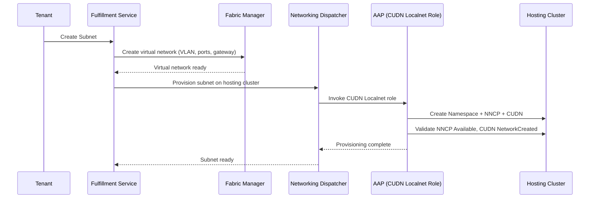

# CUDN Localnet: K8s Manager for Fabric-Bridged VMs

## Summary

This enhancement implements the first k8sManager backend for OSAC using
OVN-Kubernetes CUDN Localnet topology with 802.1Q VLAN tagging on br-ex.
It bridges KubeVirt VMs to the physical fabric without requiring BGP,
FRR-K8s, or VXLAN on the OCP side. See [PRD](prd.md) for detailed
requirements.

For motivation, goals, non-goals, and user stories, see the
[PRD](prd.md).

## Proposal

The CUDN Localnet k8s manager is an Ansible role registered via a
ConfigMap in the OSAC namespace. When the networking dispatcher
provisions a subnet on a hosting cluster, it invokes this role to create
the OCP-side resources that bridge the OVN overlay to the fabric segment.

The role manages three Kubernetes resources:
- **Namespace** with a label matching the CUDN's namespaceSelector.
- **NodeNetworkConfigurationPolicy (NNCP)** to add `localnet-physnet:br-ex`
  bridge-mappings on worker nodes.
- **ClusterUserDefinedNetwork (CUDN)** with Localnet topology, the
  fabric VLAN ID, and subnet CIDR.

### Workflow Description

**Cloud Infrastructure Admin** configures the fabric and NetworkClass.
**Tenant User** creates VirtualNetworks, Subnets, and VMs.

#### Subnet Provisioning

1. The tenant creates a VirtualNetwork (specifying a region and CIDR)
   and a Subnet (specifying the parent VirtualNetwork and CIDR). The
   operator resolves the NetworkClass for the region, which references
   the CUDN Localnet k8sManager.
2. The fabric manager creates the virtual network on the physical fabric:
   VLAN ID, switch port trunk membership, anycast gateway, DHCP disabled.
3. The networking dispatcher invokes the CUDN Localnet Ansible role with
   the VLAN ID, subnet CIDR, and hosting cluster details.
4. The Ansible role:
   a. Creates a namespace with the appropriate label.
   b. Applies an NNCP to add the `localnet-physnet:br-ex` bridge-mapping
      on all worker nodes (additive, does not modify existing mappings).
   c. Creates a CUDN with Localnet topology matching the fabric VLAN ID.
   d. Validates NNCP status is `Available` and CUDN reports
      `NetworkCreated: True`.
5. The subnet status transitions to Ready.



#### VM Creation (Tenant)

1. The tenant creates a ComputeInstance specifying the subnet.
2. OSAC creates a KubeVirt VM with two interfaces:
   - **default**: pod network (masquerade) for Kubernetes health probes.
   - **fabric**: the localnet CUDN for fabric connectivity.
3. OVN IPAM assigns an IP from the subnet range.
4. The VM is reachable from the fabric with L2 adjacency.

#### Subnet Deletion

1. The tenant deletes the Subnet in OSAC.
2. The dispatcher invokes the CUDN Localnet role in teardown mode.
3. The role deletes VMs, then the CUDN, then the namespace. The NNCP
   bridge-mapping is left in place (shared across subnets on the same
   cluster; removed only when no subnets remain).
4. The fabric manager removes the virtual network.

### API Extensions

This enhancement does not introduce new CRDs or modify existing OSAC
APIs. It implements a k8sManager backend that operates on upstream OCP
resources:

- **NodeNetworkConfigurationPolicy (NNCP)**: Created to add
  bridge-mappings. If the Ansible role is unavailable, existing NNCPs
  remain functional — VMs continue to work, but new subnets cannot be
  provisioned.
- **ClusterUserDefinedNetwork (CUDN)**: Created with Localnet topology.
  If the role is unavailable, existing CUDNs remain — running VMs are
  unaffected.
- **Namespace**: Created with a label for CUDN namespaceSelector
  matching.

The k8s manager is registered via a ConfigMap in the OSAC namespace,
referenced by the NetworkClass `k8sManager` field:

```yaml
apiVersion: v1
kind: ConfigMap
metadata:
  name: cudn-localnet-manager
  namespace: osac
data:
  type: cudn-localnet
  aap_job_template: osac_cudn_localnet
  description: "CUDN Localnet — bridges VMs to fabric via VLAN tagging"
```

### Implementation Details/Notes/Constraints

#### Ansible Role Structure

The role lives in `osac-aap` and follows the existing template pattern:

```
roles/cudn_localnet/
├── meta/
│   ├── osac.yaml              # Role metadata
│   └── argument_specs.yaml    # Parameter definitions
├── tasks/
│   ├── create.yaml            # Provision NNCP + CUDN
│   ├── delete.yaml            # Teardown
│   └── validate.yaml          # Bridge connectivity check
└── templates/
    ├── nncp.yaml.j2           # NNCP template
    └── cudn.yaml.j2           # CUDN template
```

#### NNCP Template

```yaml
apiVersion: nmstate.io/v1
kind: NodeNetworkConfigurationPolicy
metadata:
  name: localnet-bridge-mapping
spec:
  nodeSelector:
    node-role.kubernetes.io/worker: ""
  desiredState:
    ovn:
      bridge-mappings:
        - localnet: localnet-physnet
          bridge: br-ex
          state: present
```

This is additive — it appends `localnet-physnet:br-ex` alongside the
existing `physnet:br-ex` mapping without modifying br-ex itself.

#### CUDN Template

```yaml
apiVersion: k8s.ovn.org/v1
kind: ClusterUserDefinedNetwork
metadata:
  name: "{{ subnet_name }}"
spec:
  namespaceSelector:
    matchLabels:
      network: "{{ subnet_name }}"
  network:
    topology: Localnet
    localnet:
      role: Secondary
      physicalNetworkName: localnet-physnet
      vlan:
        mode: Access
        access:
          id: "{{ vlan_id }}"
      subnets:
        - "{{ cidr }}"
      ipam:
        mode: Enabled
        lifecycle: Persistent
```

#### Future: Multi-Cluster IPAM

The initial implementation targets a single hosting cluster per subnet.
When multi-cluster support is added, the key challenge is IP collision
avoidance: each cluster runs an independent OVN IPAM that assigns from
the same CIDR on the same L2 broadcast domain (same VLAN via the
fabric). Without coordination, two clusters will assign overlapping IPs,
causing ARP conflicts.

The planned approach uses the CUDN `excludeSubnets` field to
statically partition the subnet CIDR across clusters. At subnet
provisioning time, the dispatcher would invoke the Ansible role for
each hosting cluster with a cluster index and total count. The role
would calculate non-overlapping IP ranges and configure each cluster's
CUDN to exclude the other clusters' ranges. For example, a /24 across
2 clusters: cluster 0 excludes the upper /25, cluster 1 excludes the
lower /25.

Key design considerations for the future implementation:

- **CUDN immutability** — CUDNs cannot be modified after creation, so
  adding a cluster to an existing subnet requires deleting and
  recreating all CUDNs (VM downtime).
- **Partitioning strategy** — equal division is simplest but may waste
  address space on clusters with uneven utilization.
  Pre-partitioning for a maximum cluster count avoids re-partitioning
  but wastes more address space upfront.
- **Cluster ordering stability** — the dispatcher must assign
  deterministic, stable indices to clusters within a region.
- **Hosting cluster registry** — a data model mapping regions to
  hosting clusters is required before multi-cluster dispatch can work.

#### Masquerade Collision Guard

The role rejects any subnet CIDR that overlaps with 10.0.2.0/24.
KubeVirt's masquerade interface always assigns 10.0.2.2/24 to VMs on
the default pod network interface (enp1s0). If a localnet subnet uses
the same range, both VM interfaces get IPs in 10.0.2.0/24, breaking
routing on the fabric interface.

#### VM Interface Configuration

VMs get two interfaces:

```yaml
spec:
  template:
    spec:
      domain:
        devices:
          interfaces:
            - name: default
              masquerade: {}
            - name: fabric
              bridge: {}
      networks:
        - name: default
          pod: {}
        - name: fabric
          multus:
            networkName: "{{ subnet_name }}"
```

#### CUDN Immutability

CUDNs cannot be modified after creation. Changes to VLAN ID or subnet
require: (1) deleting all VMs using the CUDN, (2) deleting the CUDN,
(3) recreating the CUDN with new parameters, (4) recreating VMs. The
Ansible role handles this sequence in its update path.

#### Connectivity Model

| Scenario | Behavior |
|----------|----------|
| Same virtual network, same cluster | Direct switching within OVN (TTL=64) |
| Same virtual network, cross-cluster (future) | L2 via fabric overlay (TTL=64) — requires multi-cluster IPAM |
| Different virtual networks, same VPC/VRF | L3 routed via fabric gateway (TTL=63) — requires manual routes on VMs |
| Different virtual networks, different VPCs/VRFs | Isolated — no L2 or L3 path |

Cross-subnet L3 traffic within the same VPC/VRF requires explicit routes
on VMs via the fabric gateway. Without routes, traffic uses the pod
network default route and never reaches the fabric. Route management is
outside the k8s manager's scope.

SNAT via the fabric is supported when VMs have a default route via the
fabric gateway. The fabric SNAT IP is distinct from the OVN masquerade
IP, confirming two independent traffic paths.

#### Security Model

The CUDN Localnet k8s manager inherits the existing OSAC security model:

- **Tenant isolation** is enforced by the fabric manager via separate
  VLANs per virtual network and VPC/VRF isolation. The k8s manager maps
  these to separate CUDNs with distinct VLAN IDs.
- **Namespace isolation** is enforced by Kubernetes RBAC — each tenant
  segment gets its own namespace with the CUDN's namespaceSelector label.
- **No new authentication or authorization surfaces** are introduced.
  The Ansible role runs with AAP credentials and the k8s manager
  ConfigMap is in the OSAC admin namespace.

The same-node traffic gap (VM-to-VM traffic within OVN bypasses fabric
ACLs) is documented as a known limitation. OVN NetworkPolicy can
supplement fabric ACLs if same-node enforcement is required.

### Failure Handling and Recovery

| Failure Mode | Behavior | Recovery |
|--------------|----------|----------|
| NNCP fails to apply | Ansible role reports error, subnet stays in Provisioning state | Role retries NNCP application; admin can manually check NMState status |
| CUDN creation fails | Role reports error with CUDN status conditions | Role retries; common cause is physicalNetworkName mismatch with bridge-mapping |
| NNCP applied but CUDN reports error | Partial provisioning; subnet stays in Provisioning | Admin checks CUDN conditions; role can retry from CUDN creation |
| Hosting cluster unreachable | AAP job fails with connection error | Job is retried by the dispatcher; idempotent role handles re-runs |
| VM creation with no fabric IP | VM starts but fabric interface has no IP | Check: namespace label matches CUDN selector, NAD exists, IPAM enabled |
| Subnet deletion with running VMs | CUDN controller blocks deletion | Role drains VMs before deleting CUDN |

The Ansible role is idempotent — re-running after a partial failure
picks up from the last incomplete step.

### RBAC / Tenancy

No RBAC or tenancy changes to OSAC APIs. The k8s manager operates on
cluster-scoped OCP resources (NNCP, CUDN) using AAP service account
credentials. Tenant isolation is enforced at the fabric level (VLAN
separation) and the Kubernetes level (namespace scoping with CUDN
namespaceSelector).

### Observability and Monitoring

No new OSAC-level metrics or events. Observability relies on existing
OCP mechanisms:

- **NNCP status**: `oc get nncp` shows `Available`/`Degraded`
- **CUDN status**: `oc get clusteruserdefinednetwork` shows
  `NetworkCreated` condition
- **OVS bridge-mappings**: `ovs-vsctl get open_vswitch .
  external_ids:ovn-bridge-mappings` confirms mapping applied
- **VM interface status**: `oc get vmi -o jsonpath` shows fabric IP
  assignment
- **AAP job status**: AAP dashboard shows role execution success/failure

### Risks and Mitigations

| Risk | Mitigation |
|------|------------|
| CUDN immutability forces disruptive changes for config updates | Design provisioning to get it right first time; role handles full teardown/recreate sequence |
| Same-node traffic bypasses fabric ACLs | Document as limitation; OVN NetworkPolicy can supplement |
| OCP upgrade connectivity loss (OCPBUGS-66994) | Restart ovnkube-node pod or live-migrate VM; fixed in future OCP |
| NNCP bridge-mapping destructive bug (OCPBUGS-18869) | Fixed in OCP 4.15+; minimum version is 4.19 |

### Drawbacks

- **Secondary network only.** VMs have two interfaces — the pod network
  for Kubernetes probes and the fabric interface for tenant traffic. This
  dual-interface setup requires explicit routes for cross-subnet traffic
  and careful default route management. EVPN (primary network) would
  eliminate this complexity but requires FRR-K8s and OCP 4.22+.

- **No per-VM fabric visibility.** Unlike EVPN, the fabric doesn't learn
  individual VM MAC addresses via control plane. MAC learning happens via
  data-plane flooding. This limits fabric-level per-VM policies.

- **VLAN scale.** Each virtual network consumes a VLAN ID (1–4094). EVPN
  uses 24-bit VNIs (16M segments). For most deployments this is not a
  practical limit.

- **Single hosting cluster per subnet.** The initial implementation
  provisions each subnet on one hosting cluster. Multi-cluster subnet
  sharing requires IP partitioning via `excludeSubnets` and is planned
  as a future extension.

## Alternatives (Not Implemented)

### EVPN (OVN EVPN with FRR-K8s)

- **Pros:** Per-VM MAC/IP visibility in the fabric routing table,
  automatic L3 cross-subnet routing, primary network support (single
  interface, no route management).
- **Cons:** Requires OCP 4.22+ (TechPreview), FRR-K8s deployment, and
  EVPN BGP peering configuration — significantly higher complexity.
- **Rejection reason:** Too complex and immature for the first
  k8sManager. Planned as a future implementation once EVPN reaches GA.

### VRF-Lite (FRR-K8s with BGP VRF)

- **Pros:** Routed L3 connectivity with per-tenant VRF isolation,
  automatic routing via BGP.
- **Cons:** Does not provide L2 adjacency between VMs and bare-metal
  servers on the same fabric segment. Requires FRR-K8s with per-tenant
  VLAN+VRF configuration on both the cluster and the router.
- **Rejection reason:** L2 adjacency is a core requirement for
  infrastructure-agnostic subnets. VRF-Lite only provides L3.

### DPU-based bridging

- **Pros:** Hardware-accelerated bridging, offloads OVN datapath.
- **Cons:** Requires DPU hardware (e.g., NVIDIA BlueField), early
  maturity, limited OCP integration.
- **Rejection reason:** Hardware dependency and early maturity make it
  unsuitable as the first k8sManager. Potential future enhancement.

### Do nothing

- **Pros:** No implementation effort.
- **Cons:** The Unified Networking Architecture cannot provision
  fabric-connected VMs without a k8sManager implementation.
- **Rejection reason:** OSAC needs a working k8sManager now to validate
  the architecture, and Localnet is GA today (OCP 4.19+).

## Test Plan

### Verified Test Results

Testing was performed on 2 SNO clusters (OCP 4.21 and 4.22) on a
managed Netris fabric with 2 virtual networks (Alpha/VLAN 3, Beta/VLAN
5) and 4 VMs.

| Scenario | Expected | Result |
|----------|----------|--------|
| Same vnet, same cluster | L2 OK (TTL=64) | **PASS** |
| Diff vnet, same VPC, same cluster (with routes) | L3 OK (TTL=63) | **PASS** |
| Diff vnet, diff VPC, same cluster | Isolated | **PASS** |
| SNAT via fabric | Fabric public IP | **PASS** |

### Automated Test Strategy

- **Unit tests:** Subnet validation (masquerade collision guard, CIDR
  overlap detection).
- **Integration tests:** Ansible role execution against a kind cluster
  with NMState and OVN-K8s (NNCP creation, CUDN creation, validation
  checks).
- **E2E tests (osac-test-infra):** Full provisioning flow on a
  fabric-connected cluster — subnet creation, VM creation, L2
  connectivity within the cluster, VRF isolation.

## Graduation Criteria

- **Dev Preview:** Ansible role for CUDN Localnet provisioning on a
  single hosting cluster, tested manually on a fabric-connected
  cluster. All L2 connectivity and VRF isolation tests pass.
- **Tech Preview:** Bridge connectivity validation, masquerade guard,
  automated E2E tests in CI. Multi-cluster IP partitioning via
  `excludeSubnets`.
- **GA:** Production-hardened with upgrade testing, documented
  troubleshooting, support for multiple fabric controllers.

## Upgrade / Downgrade Strategy

This is a new k8sManager backend with no upgrade impact. The Ansible
role creates standard OCP resources (NNCP, CUDN, Namespace) that are
version-independent within the OCP 4.19+ requirement.

Downgrade: remove the k8s manager ConfigMap from the NetworkClass, then
delete CUDN and NNCP resources from hosting clusters. VMs must be
deleted before CUDN removal.

Upgrading the Ansible role itself is transparent — the role is
idempotent and re-runs against existing resources are no-ops.

## Version Skew Strategy

The k8s manager operates on stable OCP APIs (NMState v1, CUDN v1).
Version skew between the k8s manager Ansible role and OCP is handled by
the minimum OCP version requirement (4.19+). The role checks for NMState
Operator availability before applying NNCPs and reports an error if the
operator is missing.

No version skew concerns with fulfillment-service or osac-operator — the
k8s manager is invoked via AAP and does not depend on OSAC component
versions.

## Support Procedures

### Failure Detection

- **NNCP not applied:** `oc get nncp localnet-bridge-mapping` shows
  `Degraded`. Check NMState Operator logs.
- **CUDN not ready:** `oc get clusteruserdefinednetwork <name> -o yaml`
  shows error in conditions. Common cause: `physicalNetworkName` doesn't
  match any bridge-mapping.
- **VM has no fabric IP:** Verify namespace label matches CUDN selector,
  NAD exists (`oc get net-attach-def -n <ns>`), IPAM is enabled. Check
  via `virsh domifaddr`.
- **Masquerade collision:** Both VM interfaces show IPs in 10.0.2.0/24.
  The subnet CIDR must be changed.
- **virtctl ssh timeout:** Likely caused by a fabric default route
  redirecting return traffic. Use jump pods instead.

### Disabling the Feature

Remove the k8s manager ConfigMap from the NetworkClass. Existing CUDNs
and NNCPs remain functional — running VMs are unaffected. New subnet
provisioning will fail with "no k8sManager configured."

### Recovery

Re-add the ConfigMap to restore provisioning capability. The Ansible
role is idempotent — re-running against existing resources is safe.

### Known OCP Issues

- **OCPBUGS-43004:** Same-node connectivity issue in OCP < 4.19. Fixed
  in 4.19+.
- **OCPBUGS-18869:** NNCP bridge-mapping destructive bug in OCP 4.14.
  Fixed in 4.15+.
- **OCPBUGS-66994:** Upgrade connectivity loss. Workaround: restart
  ovnkube-node or live-migrate VM.

## Infrastructure Needed

- Access to a managed spine-leaf fabric with a controller (e.g., Netris)
  for E2E testing.
- At least 1 OCP cluster (4.19+) connected to the fabric. A second
  cluster is needed for future multi-cluster testing.
- CI integration for the Ansible role in osac-aap.
