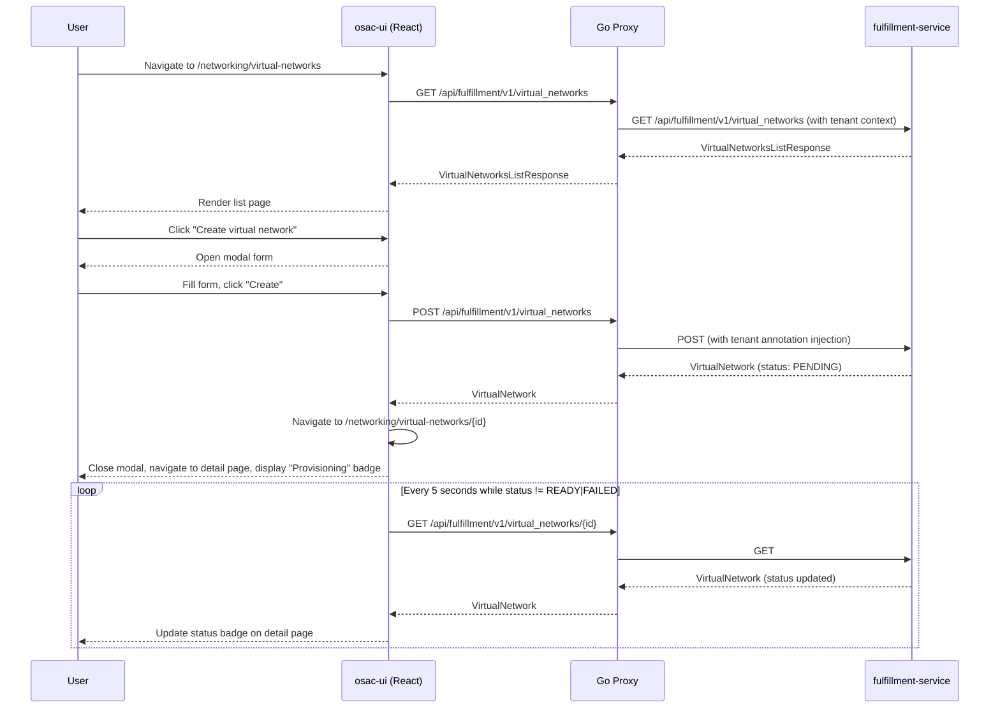

# OSAC Tenant UI: Networking Section

This enhancement adds a dedicated Networking section to the OSAC tenant UI for managing VirtualNetworks, Subnets, SecurityGroups, and PublicIPs, with integrated inline resource creation in the VMaaS wizard. See [PRD](prd.md) for detailed requirements.

## Summary

This design implements a tenant-facing UI for networking resource management using React 19, PatternFly 6, and TanStack Query. The implementation adds list/detail pages for VirtualNetworks, SecurityGroups, and PublicIPs, extends the existing VMaaS wizard with inline networking resource creation, and provides mutation hooks for create/update/delete operations against the fulfillment API. The design follows existing osac-ui patterns for page layout, query hooks, form validation, and wizard integration.

## Motivation

Tenant users and tenant admins currently manage networking resources (VirtualNetworks, Subnets, SecurityGroups, PublicIPs) via CLI or direct API calls. When provisioning VMs through the VMaaS wizard, users must pre-create networking resources in separate tools, then context-switch back to the wizard to select them. This creates friction for new tenants attempting their first VM provisioning and reduces discoverability of networking capabilities.

The fulfillment API already provides full CRUD operations for these resources. The osac-ui codebase includes read-only query hooks (`useVirtualNetworks`, `useSubnets`, `useSecurityGroups`) and a basic wizard networking step that lists resources for selection. This design extends the existing foundation with create/update/delete mutation hooks, dedicated pages for resource management, and inline creation workflows in the wizard.

The proposed UI leverages PatternFly 6 components (Table, Drawer, Modal, Wizard), TanStack Query for data fetching and cache management, and react-router-dom v7 for navigation. The design reuses existing form components (`SelectField`, `MultiSelectField`, `InputField`) and follows the established pattern for query hooks, page layout, and wizard adapters.

### Goals

- Reuse existing osac-ui patterns for query hooks, page layout, form validation, and wizard integration
- Support inline networking resource creation from the VMaaS wizard without leaving the wizard flow
- Provide accessible, responsive UI following PatternFly 6 design system and WCAG standards
- Handle resource lifecycle states (Provisioning, Ready, Failed, Deleting) with appropriate UI feedback and auto-refresh
- Enforce single network attachment per VM (one VirtualNetwork, one Subnet, optional SecurityGroups) in the wizard UX

### Non-Goals

- Provider-only resource management (NetworkClass CRUD, PublicIPPool CRUD, NATGateway, ExternalIPAttachment)
- BaremetalInstance or Cluster networking UI (out of scope for VMaaS phase)
- Migration or enhancement of the existing AdminNetworksPage topology view
- Multi-region VirtualNetwork support, cross-VN NIC attachments, and multi-NIC (multiple network attachments per VM) support (deferred to future phase)

## Proposal

This design adds three categories of UI components to osac-ui:

1. **Pages and components** in `libs/ui-components/src`: list pages for VirtualNetworks, SecurityGroups, and PublicIPs; detail pages with tabbed views for Subnets (VN detail) and Rules (SG detail); create/edit forms in modals; delete confirmation modals.

2. **API hooks** in `libs/ui-components/src/api/v1/networking.ts`: mutation hooks (`useCreateVirtualNetwork`, `useDeleteVirtualNetwork`, `usePatchSecurityGroup`, etc.) following the established pattern in `compute-instance.ts`; single-resource query hooks (`useVirtualNetwork(id)`, `useSecurityGroup(id)`, `usePublicIP(id)`); and invalidation helpers for cache management.

3. **Wizard extensions** in `libs/ui-components/src/components/catalogProvision/wizard/adapters/computeInstance/VmNetworkingStep.tsx`: inline VirtualNetwork creation modal; single network attachment UI; PublicIP allocation with IP family selection. Note: Subnet and SecurityGroup selection already exist in `VmNetworkingStep` (SelectField for subnets, MultiSelectField with chips for security groups).

Routing changes in `apps/app-frontend/src/shell` add a "Networking" section to the tenant user and tenant admin sidebars with navigation to `/networking/virtual-networks`, `/networking/security-groups`, and `/networking/public-ips`.

The design leverages the existing fulfillment API endpoints (`/api/fulfillment/v1/virtual_networks`, `/api/fulfillment/v1/subnets`, `/api/fulfillment/v1/security_groups`, `/api/fulfillment/v1/public_ips`, `/api/fulfillment/v1/public_ip_attachments`). No backend changes are required—the API surface is already stable.

### Workflow Description

#### Persona: Tenant User

**Workflow 1: Create a VirtualNetwork**

1. User navigates to Networking > Virtual Networks from the sidebar
2. User clicks "Create virtual network" button
3. Modal opens with form fields: Name (text input), IPv4 CIDR (text input with /16-/24 validation), IPv6 CIDR (optional text input). Note: NetworkClass is assigned automatically by the platform.
4. User fills required fields, sees inline validation errors below invalid fields after blur or submit attempt
5. User clicks "Create" (enabled; validation errors highlighted on submit if present)
6. POST `/api/fulfillment/v1/virtual_networks` with request body `{ object: { metadata: { name }, spec: { ipv4_cidr, ipv6_cidr } } }` (network_class assigned by backend)
7. On success: modal closes, navigate to VirtualNetwork detail page (`/networking/virtual-networks/{id}`)
8. Detail page shows "Provisioning" status badge (blue, spinner)
9. Auto-refresh polls every 5 seconds until status becomes "Ready" (green) or "Failed" (red)

**Workflow 2: Create a Subnet from VirtualNetwork detail page**

1. User navigates to VirtualNetwork detail page (`/networking/virtual-networks/{id}`)
2. User is on the Subnets tab (default)
3. User clicks "Create subnet" button
4. Modal opens with parent VN pre-selected (read-only), helper text shows parent VN CIDR and existing subnet CIDRs
5. User enters Name and CIDR (validated: within parent VN CIDR, no overlap with existing subnets)
6. User clicks "Create" (enabled; validation errors highlighted on submit if present)
7. POST `/api/fulfillment/v1/subnets` with request body `{ object: { metadata: { name }, spec: { virtual_network, ipv4_cidr } } }`
8. On success: modal closes, navigate to Subnet detail page (if detail pages exist for Subnets) or remain on VN detail with refreshed Subnets table

**Workflow 3: Create a SecurityGroup with inbound/outbound rules**

1. User navigates to Networking > Security Groups
2. User clicks "Create security group"
3. Modal opens with fields: Virtual Network (dropdown), Name (text input), Inbound Rules (expandable section with "Add rule" button), Outbound Rules (expandable section)
4. User selects VirtualNetwork, enters Name
5. User expands Inbound Rules, clicks "Add rule"
6. Inline rule form appears: Protocol (dropdown: TCP/UDP/ICMP/All), Port Range (text input, disabled if ICMP selected), Source CIDR (text input with CIDR validation)
7. User adds multiple rules, clicks "Create"
8. POST `/api/fulfillment/v1/security_groups` with request body `{ object: { metadata: { name }, spec: { virtual_network, inbound_rules: [...], outbound_rules: [...] } } }`
9. Side panel closes, SecurityGroups list refreshes

**Workflow 4: Allocate and Attach a PublicIP to a VM**

1. User navigates to Networking > Public IPs
2. User clicks "Allocate IP"
3. Modal dialog opens with fields: Pool (dropdown showing "pool-name (Available: N IPs)"), Name (text input)
4. User selects pool, enters name, clicks "Allocate"
5. POST `/api/fulfillment/v1/public_ips` with request body `{ object: { metadata: { name }, spec: { pool } } }`
6. Modal closes, new PublicIP appears in list with "Available" status
7. User clicks "Attach" action on the row
8. Side panel opens with searchable table of ComputeInstances (VMs)
9. User selects a VM, clicks "Attach"
10. POST `/api/fulfillment/v1/public_ip_attachments` with request body `{ public_ip_id, resource_id, resource_type: "ComputeInstance" }`
11. Side panel closes, PublicIP row updates to show "Attached" status and VM name in "Attached To" column

**Workflow 5: Provision a VM with inline networking resource creation**

1. User navigates to VMaaS catalog, selects a template, clicks "Create VM"
2. Wizard opens, user fills basic fields (name, SSH key)
3. User reaches Network Configuration step
4. If no VirtualNetworks exist: prominent message "You need to create a virtual network before provisioning a VM" with "Create Virtual Network" button
   - User clicks button, Create VN modal overlays wizard
   - User creates VN, modal closes, wizard auto-selects the new VN
5. Network Attachment section shows: Virtual Network (dropdown, auto-selected if only 1), "Create new VN" link
6. Subnet dropdown (SelectField) filters to selected VN, auto-selected if only 1. Note: Subnet selection already exists in `VmNetworkingStep`; no new "Create Subnet" link is added.
7. Security Groups multi-select (MultiSelectField with chips) filters to selected VN, pre-checked if only 1. Note: SecurityGroup selection already exists in `VmNetworkingStep`; no new "Create Security Group" link is added.
8. Public IP section: checkbox "Allocate Public IP" (default checked for new tenants with no existing IPs), IP Family dropdown (IPv4/IPv6, default IPv4)
9. If checkbox is checked, PublicIP is automatically allocated from available pool based on IP family
10. User clicks "Create VM"
11. POST `/api/fulfillment/v1/public_ips` (if checkbox checked, with IP family), then POST `/api/fulfillment/v1/compute_instances` with networking spec, then POST `/api/fulfillment/v1/public_ip_attachments` (if PublicIP allocated)
12. Wizard closes, user redirected to VM detail page

**Error handling variations:**

- **Validation failure:** Form submission blocked, inline error messages appear below invalid fields with specific guidance (e.g., "CIDR must be within parent VN range 10.0.0.0/16")
- **API error (4xx/5xx):** Toast notification with error message, form remains open with user's input preserved, "Retry" button available
- **Provisioning failure:** Resource transitions to "Failed" status, detail page shows collapsible alert with error message from `status.message`, "Retry" and "Delete" actions available. Retry re-submits the original POST request.
- **Delete blocked:** If VirtualNetwork has subnets or security groups, DELETE request returns 400, UI shows error modal: "Cannot delete VirtualNetwork. Delete all subnets and security groups first."



The same pattern applies to Subnets, SecurityGroups, and PublicIPs (with state names adjusted per resource type: PublicIPs use AVAILABLE/ATTACHED states, both non-terminal for polling purposes). Note: Post-create navigation to detail page applies to resources with dedicated detail pages (VirtualNetworks, SecurityGroups, PublicIPs); Subnets may remain on parent VN detail page if no Subnet detail page exists.

### API Extensions

This design does not introduce new API extensions. The fulfillment API already provides the required gRPC services and REST gateway endpoints:

- `VirtualNetworks` service: List, Get, Create, Patch, Delete
- `Subnets` service: List, Get, Create, Delete (no Patch—subnets are immutable after creation)
- `SecurityGroups` service: List, Get, Create, Patch, Delete
- `PublicIPs` service: List, Get, Create, Delete
- `PublicIPAttachments` service: Create (attach), Delete (detach)
- `PublicIPPools` service: List (read-only for tenants)

Note: `NetworkClasses` is platform-assigned and not exposed to tenant users in the UI. The fulfillment API assigns `spec.network_class` automatically during VirtualNetwork creation.

The UI consumes these services via the REST gateway (`/api/fulfillment/v1/*`). No CRD changes, webhooks, or finalizers are required—this is a pure frontend implementation.

### Implementation Details/Notes/Constraints

#### File Structure

Following NFR-3, the implementation adds these files to `libs/ui-components/src`:

**Pages** (new directory: `pages/networking/`):
- `pages/networking/VirtualNetworksPage.tsx` — list page with table, toolbar (search/filter/sort), empty state, "Create" button
- `pages/networking/VirtualNetworkDetailPage.tsx` — detail page with tabs (Subnets, Security Groups, Details), breadcrumb, status badge, Delete action
- `pages/networking/SecurityGroupsPage.tsx` — list page
- `pages/networking/SecurityGroupDetailPage.tsx` — detail page with tabs (Inbound Rules, Outbound Rules, Details)
- `pages/networking/PublicIPsPage.tsx` — list page with Allocate/Attach/Detach/Release actions

**Components** (new directory: `components/networking/`):
- `components/networking/VirtualNetworkCreateModal.tsx` — create modal for VirtualNetwork (used in list page and wizard inline creation)
- `components/networking/SubnetCreateModal.tsx` — create modal with parent VN CIDR helper text
- `components/networking/SecurityGroupCreateModal.tsx` — create modal with inline rule management
- `components/networking/SecurityGroupRuleRow.tsx` — reusable rule input row (Protocol dropdown, Port Range input, CIDR input)
- `components/networking/VirtualNetworkStatusLabel.tsx` — wrapper for ResourceStatusLabel with VN state mapping
- `components/networking/SecurityGroupStatusLabel.tsx` — wrapper for ResourceStatusLabel with SG state mapping
- `components/networking/PublicIPStatusLabel.tsx` — wrapper for ResourceStatusLabel with PublicIP state mapping
- `components/networking/PublicIPAllocateModal.tsx` — modal dialog for IP allocation
- `components/networking/PublicIPAttachDrawer.tsx` — side drawer with VM selection table (attach flow only—not a create form)
- `components/networking/SubnetsTable.tsx` — table component for Subnets tab
- `components/networking/SecurityGroupsTable.tsx` — table component for SG list and VN detail SG tab
- `components/networking/SecurityGroupRulesTable.tsx` — table component for Inbound/Outbound rules tabs with Add/Edit/Delete actions

**API hooks** (extend `api/v1/networking.ts`):

Current state:
```typescript
// Read-only hooks (already exist)
export const useVirtualNetworks = (params?, options?) => useApiQuery<VirtualNetworksListResponse, VirtualNetwork[]>(...)
export const useSubnets = (params?, options?) => useApiQuery<SubnetsListResponse, Subnet[]>(...)
export const useSecurityGroups = (params?, options?) => useApiQuery<SecurityGroupsListResponse, SecurityGroup[]>(...)
```

New additions:
```typescript
// Single-resource getters
export const useVirtualNetwork = (id: string) =>
  useApiQuery<VirtualNetwork>({
    queryKey: ['v1/virtual_networks', [id]],
    meta: { decode: VirtualNetworkSchema },
    enabled: Boolean(id?.trim()),
  });

export const useSubnet = (id: string) => useApiQuery<Subnet>({ queryKey: ['v1/subnets', [id]], ... });
export const useSecurityGroup = (id: string) => useApiQuery<SecurityGroup>({ queryKey: ['v1/security_groups', [id]], ... });
export const usePublicIP = (id: string) => useApiQuery<PublicIP>({ queryKey: ['v1/public_ips', [id]], ... });

// Mutation hooks
export const useCreateVirtualNetwork = () => {
  const apiFetch = useApiFetch();
  const qc = useApiQueryClient();
  return useMutation({
    mutationFn: async (vn: VirtualNetworkInput) =>
      apiFetch<VirtualNetwork>('v1/virtual_networks', {
        method: 'POST',
        body: { object: vn },
        decode: VirtualNetworkSchema,
      }),
    onSuccess: () => invalidateVirtualNetworksQueries(qc),
  });
};

export const useDeleteVirtualNetwork = () => {
  const apiFetch = useApiFetch();
  const qc = useApiQueryClient();
  return useMutation({
    mutationFn: (id: string) =>
      apiFetch<void>('v1/virtual_networks', { pathParams: [id], method: 'DELETE' }),
    onSuccess: () => invalidateVirtualNetworksQueries(qc),
  });
};

// Patch hook for SecurityGroups (rule updates)
export const usePatchSecurityGroup = () => {
  const apiFetch = useApiFetch();
  const qc = useApiQueryClient();
  return useMutation({
    mutationFn: ({ id, patch }: { id: string; patch: Partial<SecurityGroup> }) =>
      apiFetch<SecurityGroup>('v1/security_groups', {
        pathParams: [id],
        method: 'PATCH',
        body: { object: patch, field_mask: { paths: Object.keys(patch) } }, // Note: assumes flat patch; for nested updates, use a helper to generate dot-path field masks
        decode: SecurityGroupSchema,
      }),
    onSuccess: () => invalidateSecurityGroupsQueries(qc),
  });
};

// PublicIP attach/detach hooks
export const useAttachPublicIP = () => {
  const apiFetch = useApiFetch();
  const qc = useApiQueryClient();
  return useMutation({
    mutationFn: ({ publicIpId, resourceId, resourceType }: AttachPublicIPInput) =>
      apiFetch<PublicIPAttachment>('v1/public_ip_attachments', {
        method: 'POST',
        body: { object: { public_ip_id: publicIpId, resource_id: resourceId, resource_type: resourceType } },
        decode: PublicIPAttachmentSchema,
      }),
    onSuccess: () => {
      invalidatePublicIPsQueries(qc);
      invalidateComputeInstancesQueries(qc); // Refresh VM list to show attached IP
    },
  });
};

export const useDetachPublicIP = () => {
  const apiFetch = useApiFetch();
  const qc = useApiQueryClient();
  return useMutation({
    mutationFn: (attachmentId: string) =>
      apiFetch<void>('v1/public_ip_attachments', { pathParams: [attachmentId], method: 'DELETE' }),
    onSuccess: () => {
      invalidatePublicIPsQueries(qc);
      invalidateComputeInstancesQueries(qc);
    },
  });
};

// Cache invalidation helpers
const invalidateVirtualNetworksQueries = async (qc: ReturnType<typeof useApiQueryClient>) => {
  await qc.invalidateQueries({ queryKey: apiQueryKey('v1/virtual_networks', null) });
};
// ... similar invalidation helpers for subnets, security_groups, public_ips
```

Pattern follows `api/v1/compute-instance.ts`: mutation hooks use `useMutation` from TanStack Query, call `apiFetch` with method/body/decode, and invalidate relevant queries in `onSuccess`.

**Wizard integration** (extend existing file):

`libs/ui-components/src/components/catalogProvision/wizard/adapters/computeInstance/VmNetworkingStep.tsx` currently implements:
- VirtualNetwork selection via `SelectField` (auto-selected if only 1)
- Subnet selection via `SelectField` (filtered by selected VN, auto-selected if only 1)
- SecurityGroup selection via `MultiSelectField` with chips (filtered by selected VN, pre-checked if only 1)

The design extends it with:

1. **Inline VirtualNetwork creation modal:** "Create new VN" link opens a Modal overlay with `<VirtualNetworkForm />`. After successful creation (onSuccess callback), the modal closes and the wizard's VirtualNetwork dropdown refetches and auto-selects the new VN. **Note:** Subnet and SecurityGroup inline creation are NOT added—those selection controls already exist and work as-is.

2. **Single network attachment:** State variable `attachment: { virtualNetworkId, subnetId, securityGroupIds }`. Platform constraint enforced: exactly one network attachment per VM in this phase (multi-NIC deferred to future phase).

3. **PublicIP allocation:** Checkbox "Allocate Public IP" (default checked for new tenants with no existing IPs) and IP Family dropdown (IPv4/IPv6, default IPv4). When checked, wizard includes a pre-flight POST to allocate an IP from an appropriate pool based on IP family, then attaches it via POST to public_ip_attachments.

**Navigation changes:**

`apps/app-frontend/src/shell/shellNav.ts`:

```typescript
// In getTenantUserNav():
{
  kind: 'section',
  sectionId: 'nav-tenant-networking',
  label: t('Networking'),
  children: [
    { id: 'virtual-networks', label: t('Virtual Networks'), path: '/networking/virtual-networks' },
    { id: 'security-groups', label: t('Security Groups'), path: '/networking/security-groups' },
    { id: 'public-ips', label: t('Public IPs'), path: '/networking/public-ips' },
  ],
},

// In getTenantAdminNav(), under 'nav-admin-mgmt' section:
{
  kind: 'section',
  sectionId: 'nav-admin-networking',
  label: t('Networking'),
  children: [
    { id: 'virtual-networks', label: t('Virtual Networks'), path: '/networking/virtual-networks' },
    { id: 'security-groups', label: t('Security Groups'), path: '/networking/security-groups' },
    { id: 'public-ips', label: t('Public IPs'), path: '/networking/public-ips' },
  ],
},
// Preserve existing 'nav-admin-infra' section with admin-networks (topology view)
```

`apps/app-frontend/src/shell/AppShell.tsx` adds routes:

```typescript
<Route path="/networking/virtual-networks" element={<VirtualNetworksPage />} />
<Route path="/networking/virtual-networks/:id" element={<VirtualNetworkDetailPage />} />
<Route path="/networking/security-groups" element={<SecurityGroupsPage />} />
<Route path="/networking/security-groups/:id" element={<SecurityGroupDetailPage />} />
<Route path="/networking/public-ips" element={<PublicIPsPage />} />
```

#### Data Models

The UI consumes protobuf-generated TypeScript types from `libs/types/src/osac/public/v1/`. Key interfaces:

```typescript
interface VirtualNetwork {
  id: string;
  metadata?: {
    name?: string;
    labels?: Record<string, string>;
    annotations?: Record<string, string>;
    created_at?: Timestamp;
  };
  spec?: {
    network_class?: string;
    ipv4_cidr?: string;  // Required, /16 to /24
    ipv6_cidr?: string;  // Optional
  };
  status?: {
    state?: VirtualNetworkState;  // PENDING, READY, FAILED, DELETING
    message?: string;
  };
}

interface Subnet {
  id: string;
  metadata?: { name?: string; ... };
  spec?: {
    virtual_network?: string;  // Parent VN ID
    ipv4_cidr?: string;        // Required, within parent VN CIDR
  };
  status?: {
    state?: SubnetState;
    message?: string;
  };
}

interface SecurityGroup {
  id: string;
  metadata?: { name?: string; ... };
  spec?: {
    virtual_network?: string;
    inbound_rules?: SecurityGroupRule[];
    outbound_rules?: SecurityGroupRule[];
  };
  status?: { state?: SecurityGroupState; message?: string; };
}

interface SecurityGroupRule {
  protocol?: string;       // "TCP" | "UDP" | "ICMP" | "All"
  port_range?: string;     // e.g., "22", "80-443", empty for ICMP
  cidr?: string;           // Source (inbound) or Destination (outbound) CIDR
  description?: string;
}

interface PublicIP {
  id: string;
  metadata?: { name?: string; ... };
  spec?: {
    pool?: string;         // PublicIPPool ID
    address?: string;      // IP address (assigned by provider)
  };
  status?: {
    state?: PublicIPState; // PENDING, AVAILABLE, ATTACHED, FAILED, DELETING
    message?: string;
  };
}

interface PublicIPPool {
  id: string;
  metadata?: { name?: string; ... };
  spec?: {
    cidr?: string;
    available_count?: number;
  };
}

interface NetworkClass {
  id: string;
  metadata?: { name?: string; ... };
  spec?: { description?: string; };
}
```

#### Form Validation

All forms use Formik for state management and Yup for schema validation. Validation rules follow PRD requirements:

**VirtualNetwork:**
- `metadata.name`: required, DNS-valid (RFC 1123 subdomain: lowercase alphanumeric, hyphens, max 63 chars), unique within tenant (uniqueness checked server-side, client shows conflict error from 409 response)
- `spec.network_class`: assigned automatically by the platform (hidden from tenant users, omitted from create request)
- `spec.ipv4_cidr`: required, valid CIDR notation, prefix length between /16 and /24 (Yup regex: `/^(\d{1,3}\.){3}\d{1,3}\/(1[6-9]|2[0-4])$/`)
  Note: This regex is illustrative only and does not fully validate IPv4 octets (e.g., allows 999.999.999.999). Implementation should use a proper CIDR validation library such as `cidr-regex` or `ip-address`.
- `spec.ipv6_cidr`: optional, valid IPv6 CIDR if provided

**Subnet:**
- `metadata.name`: required, DNS-valid
- `spec.virtual_network`: required (pre-filled from parent VN, read-only in create form)
- `spec.ipv4_cidr`: required, valid CIDR, must be within parent VN CIDR range (client-side check via ip-address library), must not overlap existing subnets (checked by fetching existing subnets for the VN and validating ranges)

**SecurityGroup:**
- `metadata.name`: required, DNS-valid
- `spec.virtual_network`: required
- `spec.inbound_rules` / `spec.outbound_rules`:
  - `protocol`: required, one of ["TCP", "UDP", "ICMP", "All"]
  - `port_range`: required if protocol is TCP or UDP, disabled if ICMP, format: single port ("22") or range ("80-443"), validated via regex `/^\d+(-\d+)?$/`
  - `cidr`: required, valid CIDR notation

**PublicIP:**
- `metadata.name`: required (user-provided label)
- `spec.pool`: required, must match an existing PublicIPPool ID

Error messages follow a consistent template: "{Field name} {validation rule}". Examples:
- "Name is required"
- "IPv4 CIDR must be in /16 to /24 range"
- "Subnet CIDR must be within parent VirtualNetwork CIDR 10.0.0.0/16"
- "Port range is invalid. Use a single port (22) or range (80-443)"

#### Status Handling and Auto-Refresh

Resources transition through states: PENDING → READY, PENDING → FAILED, READY → DELETING → (deleted), AVAILABLE → ATTACHED (PublicIPs).

**Status badge rendering:**

Status badges use the shared `ResourceStatusLabel` component (`libs/ui-components/src/components/Resource/ResourceStatusLabel.tsx`) with resource-specific wrappers (e.g., `VirtualNetworkStatusLabel`, `SecurityGroupStatusLabel`, `PublicIPStatusLabel`) that map API state to `StatusKind` and display text. This follows the same pattern as `VmStatusLabel` and `ClusterStatusLabel`.

State → StatusKind mapping:
- PENDING (Provisioning): `StatusKind.InProgress` (blue, spinner icon)
- READY: `StatusKind.Success` (green)
- FAILED: `StatusKind.Danger` (red)
- DELETING: `StatusKind.InProgress` (blue, spinner icon)
- AVAILABLE (PublicIPs): `StatusKind.Success` (green)
- ATTACHED (PublicIPs): `StatusKind.Info` (blue)

**Auto-refresh logic:**

When a resource is in a non-terminal state (PENDING or DELETING), the list page enables auto-refresh via TanStack Query's `refetchInterval`:

```typescript
const { data: virtualNetworks = [], refetch } = useVirtualNetworks(
  {},
  {
    refetchInterval: (data) => {
      const hasNonTerminalState = data?.some(
        (vn) => vn.status?.state === 'PENDING' || vn.status?.state === 'DELETING'
      );
      return hasNonTerminalState ? 5000 : false; // 5 seconds if any resource is provisioning/deleting
    },
  }
);
```

Detail pages use the same pattern. On window focus, TanStack Query auto-refetches (default behavior, no config needed).

**Delete action behavior:**

- If DELETE fails with 400 (business rule violation, e.g., VN has children), show error modal with API message.
- If resource is in PENDING or DELETING state, Delete action is disabled (button grayed out).
- If DELETE fails with 500 (server error), rollback optimistic update and show error toast.

#### Accessibility

Following NFR-8:

- **Form labels:** All inputs use PatternFly `FormGroup` with `label` prop, which generates associated `<label>` elements.
- **Status badges:** Use `ResourceStatusLabel` component (via resource-specific wrappers like `VirtualNetworkStatusLabel`) which handles `aria-label` automatically based on state (e.g., `aria-label="Status: Ready"`, not just color).
- **Keyboard navigation:** All interactive elements (buttons, links, table rows) are keyboard-accessible. PatternFly components handle focus management by default.
- **Modal focus trap:** PatternFly `Modal` component traps focus within the modal when open.
- **Live regions:** Status changes (e.g., Provisioning → Ready) are announced via `aria-live="polite"` region wrapping the status badge.
- **Helper text:** CIDR inputs include helper text explaining expected format: "Enter a CIDR range (e.g., 10.0.0.0/16)".

#### Performance

**Pagination is out of scope** for this feature. Existing osac-ui list tables (VMs, clusters, catalog) do not use PatternFly `Pagination` today. Networking list pages follow the same non-paginated pattern for consistency across the UI.

Table pagination should be tracked as a **separate Jira** to implement holistically for all resource list pages (not only networking). This ensures consistent UX and avoids partial pagination where some tables paginate and others don't.

For performance: if operational monitoring reveals high latency on List endpoints when tenant resource counts grow large, pagination can be addressed in that cross-cutting Jira rather than as part of this networking-specific feature.

#### Responsive Design

Following NFR-6 and NFR-7:

- **Tables:** PatternFly responsive table pattern—on screens < 768px, tables use compound expansion: row shows only Name column, clicking row expands to show all details inline. No navigation to detail page on mobile.
- **Side panels:** PatternFly `Drawer` with `isInline={false}` becomes full-width on mobile.
- **Sidebar:** PatternFly `PageSidebar` is collapsible on all screen sizes (existing osac-ui behavior, no changes needed).

### Security Considerations

The design inherits the existing osac-ui security model without changes:

- **Authentication:** Handled by the Go proxy (`proxy/`). The proxy validates OIDC tokens and forwards authenticated requests to fulfillment-service with tenant context in headers.
- **Authorization:** Enforced by fulfillment-service. Tenant-scoped resources include `osac.openshift.io/tenant` annotation (injected server-side). OPA policies enforce tenant isolation—tenants can only see/modify their own resources.
- **Input validation:** Client-side validation (Formik + Yup) prevents common errors and improves UX, but does not replace server-side validation. The fulfillment API validates all inputs (CIDR ranges, name uniqueness, parent-child relationships) and returns 400 with error messages for invalid requests.
- **Data exposure:** The UI does not expose sensitive data. NetworkClass and PublicIPPool resources are platform-defined (read-only for tenants). The design does not introduce new data exposure risks.
- **RBAC:** No RBAC changes required. Existing persona-based access controls apply (tenant users and tenant admins can both access the Networking section).

No new security mechanisms are required for this UI-only enhancement.

### Failure Handling and Recovery

#### Client-Side Failures

**Network errors (fetch failures):**
- TanStack Query retries failed GET requests up to 3 times with exponential backoff (default behavior).
- If all retries fail, the UI shows an error state in the list page: empty state with "Failed to load" message and "Retry" button.
- Mutation errors (POST/PATCH/DELETE) are not retried automatically. The UI shows a toast notification with the error message and keeps the form open with user input preserved. User can click "Retry" to re-submit.

**Validation errors:**
- Client-side validation (Yup schema) shows inline error messages below each invalid field after blur or failed submit attempt. The Create/Submit button stays **enabled** (following the VM wizard pattern in `CatalogProvisionWizard`). When the user clicks Create with invalid fields, validation runs and errors are surfaced via `FieldValidationContext` / `getVisibleFieldError` (errors on touched fields, plus all invalid fields after submit). An inline validation alert appears if submit is attempted with errors.
- Server-side validation errors (400 responses) are shown as toast notifications with the API-provided error message. For example, a duplicate name returns 400 with message "VirtualNetwork with name 'prod-network' already exists", and the UI displays this verbatim.

#### API-Side Failures

**Provisioning failures:**
- If a VirtualNetwork/Subnet/SecurityGroup/PublicIP fails to provision (transitions to FAILED state), the resource remains in the database with `status.state = FAILED` and `status.message` containing the error reason.
- The detail page shows a collapsible `Alert` component (PatternFly) with the error message.
- Two actions are available: "Retry" and "Delete".
  - "Retry" re-submits the original POST request with the same parameters. This creates a new resource (the API does not support updating a FAILED resource to retry provisioning).
  - "Delete" removes the failed resource via DELETE request.
- The UI does not persist intermediate state—users must re-enter form data if retry also fails.

**Delete failures:**
- If DELETE returns 400 (e.g., VirtualNetwork has children), the UI shows a modal with the error message: "Cannot delete VirtualNetwork '{name}'. Delete all subnets and security groups first."
- If DELETE returns 500, the UI shows a toast: "Failed to delete VirtualNetwork. Please try again." The resource remains in the list.
- No automatic retry for DELETE failures.

**Idempotency:**
- CREATE operations are not idempotent (submitting the same request twice creates two resources with different IDs). The UI prevents double-submission by disabling the "Create" button after the first click and only re-enabling it if the request fails.
- PATCH and DELETE operations are idempotent (PATCH updates the resource to the specified state, DELETE removes it). Retrying these operations is safe.

**Controller reconciliation failures** (backend concern, but UI must handle the effects):
- If osac-operator fails to reconcile a VirtualNetwork CRD, the resource remains in PENDING state indefinitely (or transitions to FAILED if the controller sets an error condition).
- The UI auto-refresh mechanism (5-second polling) continues until a terminal state is reached or the user navigates away.
- If a resource is stuck in PENDING for > 5 minutes (30 refresh cycles), no special UI behavior—the user sees the spinner and can manually refresh or contact support. [Assumption: No timeout threshold is enforced client-side; stuck resources are a support/operational concern]

### RBAC / Tenancy

No RBAC or tenancy changes required. The design leverages existing mechanisms:

- **Tenant isolation:** All VirtualNetworks, Subnets, SecurityGroups, and PublicIPs include `osac.openshift.io/tenant` annotation (injected by fulfillment-service on POST based on the authenticated user's tenant context). The fulfillment API filters List responses by tenant annotation. The UI does not implement additional filtering—it trusts the API to return only tenant-scoped resources.
- **Owner references:** Parent-child relationships (VirtualNetwork → Subnets, VirtualNetwork → SecurityGroups) use `osac.openshift.io/owner-reference` annotations. The UI does not directly interact with these annotations—deletion blocking is enforced by the API (returns 400 if children exist).
- **Visibility constraints:** Tenant users and tenant admins see the same Networking section and have the same CRUD permissions. NetworkClass is platform-assigned (hidden from tenant users). PublicIPPool resources are platform-defined and read-only—the UI fetches pools via List endpoint for display purposes only.

No new OPA policies or RBAC roles are required.

### Observability and Monitoring

No new observability changes required. The design does not introduce new metrics, events, or logging. Existing observability mechanisms apply:

- **Metrics:** fulfillment-service already emits Prometheus metrics for API request rates, latencies, and error rates (by endpoint and status code). The new UI workflows increase traffic to existing endpoints (`/api/fulfillment/v1/virtual_networks`, etc.) but do not require new metrics.
- **Events:** Kubernetes events for VirtualNetwork/Subnet/SecurityGroup CRD reconciliation are emitted by osac-operator (existing behavior). The UI does not consume these events directly—it polls resource status via the API.
- **Logging:** The Go proxy logs all HTTP requests (method, path, status code, duration). No new log entries are required.

If operational monitoring reveals high latency on List endpoints when tenant resource counts approach NFR-9 thresholds, pagination should be reviewed (this is a performance tuning concern, not a new monitoring requirement).

### Risks and Mitigations

**Risk 1: PublicIP attach/detach API endpoint availability**

The PRD assumes `/api/fulfillment/v1/public_ip_attachments` endpoints exist for Attach (POST) and Detach (DELETE) operations (FR-27, FR-35). If these endpoints are not implemented:

- **Mitigation:** Verify endpoint availability during design review. If missing, file a Jira issue to implement the endpoints before UI development begins. If endpoints cannot be delivered in time, defer PublicIP attach/detach UI to a future milestone and remove FR-27, FR-28, FR-35 from scope.

**Risk 2: Subnet immutability not clearly communicated**

Subnets have no PATCH endpoint—CIDR is immutable after creation. Users may attempt to edit a Subnet's CIDR and be confused when no edit action is available.

- **Mitigation:** Add helper text to Subnet detail page: "Subnet CIDR cannot be changed after creation. To use a different CIDR, delete this subnet and create a new one." Document this constraint in user-facing documentation.

**Risk 3: SecurityGroup rule update UX complexity**

FR-20 states "Rule edits use `PATCH /api/fulfillment/v1/security_groups/{id}` to replace the full rule set." Individual rule Edit/Delete actions must batch changes client-side and submit one PATCH, or submit PATCH on each action.

- **Mitigation:** Use immediate PATCH on each Edit/Delete action (simpler UX, no client-side batching). Accept the additional API calls as a trade-off for simpler state management. If performance issues arise (e.g., user edits 10 rules rapidly), implement client-side batching with a "Save changes" button in a future iteration.

**Risk 4: PublicIPPool available IP count staleness**

FR-25 displays "Available: N IPs" in the pool dropdown. If `spec.available_count` is eventually consistent (updated by a background reconciliation loop), the displayed count may be stale.

- **Mitigation:** Refetch PublicIPPools when the Allocate IP modal opens (`enabled: isModalOpen` in query options). Accept minor staleness risk—if allocation fails due to pool exhaustion, the API returns 400 and the user selects a different pool.

**Risk 5: Wizard VN requirement enforcement ambiguity**

FR-36 states "block VM creation without network attachment." It is unclear whether the fulfillment API enforces this constraint (returns 400 on POST ComputeInstance without networking spec) or if the UI must prevent form submission.

- **Mitigation:** Assume the API enforces the constraint (returns 400). The wizard validates required fields client-side to provide helpful errors before submission, but relies on API validation as the authoritative check. If the API does not enforce the constraint, file a Jira issue to add server-side validation.

### Drawbacks

**API call volume:**
- Inline resource creation from the wizard (FR-33) increases API call volume: create VN → refetch VNs → create Subnet → refetch Subnets → create SG → refetch SGs. Each refetch invalidates TanStack Query cache and triggers a new List request. For a new tenant provisioning their first VM, this results in 6-9 API calls before the VM is created.
- **Trade-off:** Simpler client-side state management (rely on server as source of truth) at the cost of additional network round-trips. Alternative (client-side optimistic updates without refetch) adds complexity and risks stale UI state.

**Subnet CIDR immutability:**
- No edit action for Subnet CIDR after creation (no PATCH endpoint). Users must delete and recreate to change CIDR. This may be surprising for users familiar with cloud providers that allow CIDR expansion.
- **Trade-off:** Enforces platform design constraint (subnets are immutable for operational simplicity). Documenting this clearly in UX helper text mitigates user confusion.

**SecurityGroup rule update granularity:**
- Editing one rule replaces the entire inbound_rules or outbound_rules array (PATCH replaces full rule set). If two users edit rules on the same SecurityGroup concurrently, last-write-wins (no conflict detection).
- **Trade-off:** Simpler API design (no individual rule-level endpoints) at the cost of potential concurrent edit conflicts. This is acceptable for tenant-scoped resources where concurrent edits are rare. If conflicts become a support burden, implement optimistic locking (ETag-based) in a future iteration.

**Single NIC per VM constraint:**
- Multi-NIC support deferred to future phase. Each VM has exactly one network attachment (VirtualNetwork + Subnet + SecurityGroups).
- **Trade-off:** Simplifies initial networking wizard UX and reduces state management complexity. Multi-NIC support is documented in Non-Goals and will be added in a future phase.

## Alternatives (Not Implemented)

### Alternative 1: Modal dialogs instead of side drawers for create forms

**Description:** Use PatternFly `Modal` component for create forms instead of `DrawerPanelContent`.

**Pros:**
- Modals have stronger visual focus (overlay dims the background).
- Consistent with PublicIP allocation UI (FR-25 uses modal).

**Cons:**
- Drawers are PatternFly's recommended pattern for multi-field forms (better for longer forms like SecurityGroup with rule management).
- Drawers allow the user to reference the list table while filling the form (e.g., checking existing VN names to avoid conflicts).
- Inline wizard creation (FR-33) requires overlay pattern—drawer overlays wizard step without hiding it completely.

**Rejection reason:** Drawers provide better UX for multi-field forms and align with PatternFly design guidance for create/edit workflows.

### Alternative 2: Dedicated page for Subnets instead of VN detail tab

**Description:** Add Subnets to the sidebar (top-level navigation) and provide a `/networking/subnets` list page showing all subnets across all VNs.

**Pros:**
- Consistent with SecurityGroups pattern (top-level + VN-scoped).
- Easier to find all subnets for troubleshooting.

**Cons:**
- FR-13 explicitly states "Subnets must not have their own top-level sidebar entry."
- Subnets are tightly coupled to VirtualNetworks (always scoped to a parent VN, CIDR must be within parent VN CIDR). Surfacing them at the top level suggests independence that doesn't exist.
- Adds visual clutter to the sidebar.

**Rejection reason:** PRD requirement FR-13 explicitly excludes top-level Subnets navigation. The VN detail tab pattern reflects the parent-child relationship and keeps the sidebar concise.

### Alternative 3: Client-side batching for SecurityGroup rule edits

**Description:** When user edits multiple rules on a SecurityGroup, accumulate changes client-side and provide a "Save changes" button to submit one PATCH request.

**Pros:**
- Reduces API call volume (one PATCH for multiple rule edits).
- Allows user to review all changes before submitting.

**Cons:**
- Increases UI complexity: must track pending changes, show "unsaved changes" indicator, handle form abandonment (e.g., user navigates away without saving).
- Complicates error handling: if PATCH fails, which rules were applied and which weren't?
- Deviates from the immediate-feedback pattern used elsewhere in the UI (create forms submit immediately).

**Rejection reason:** Simplicity and consistency. Immediate PATCH on each Edit/Delete action aligns with the existing UX pattern and reduces client-side state management complexity. API call volume is acceptable for this use case (rule edits are infrequent operations).

### Alternative 4: Optimistic updates without refetch after create

**Description:** After creating a VirtualNetwork, insert the new resource into the TanStack Query cache client-side (optimistic update) without refetching the list.

**Pros:**
- Faster perceived performance (no network round-trip to refresh the list).
- Reduces API call volume.

**Cons:**
- Risk of stale cache: if the server assigns a different ID than the client expects, or if server-side defaults differ from client assumptions, the cached entry is incorrect.
- Complicates cache management: must handle race conditions (e.g., user creates two VNs rapidly).
- Inline wizard creation (FR-33) still requires refetch to populate the VN dropdown with the correct server-assigned ID.

**Rejection reason:** Reliability over performance. Refetching ensures the UI always reflects server state. The latency cost (one additional List request) is acceptable for infrequent create operations.

## Open Questions

### 1. PublicIP attach/detach API endpoint confirmation

**Question:** Does the fulfillment API provide `/api/fulfillment/v1/public_ip_attachments` endpoints for Attach (POST) and Detach (DELETE) operations as assumed in FR-27 and FR-35?

**Owner:** fulfillment-service team

**Impact:** High. If endpoints do not exist, PublicIP attach/detach UI (FR-27, FR-28, FR-35) must be deferred or the endpoints must be implemented before UI development begins.

### 2. NetworkClass platform assignment behavior

**Question:** Does the platform always assign exactly one NetworkClass per tenant, or can the assignment vary based on tenant tier/quota/region?

**Owner:** Platform team

**Impact:** Affects whether the UI needs to handle scenarios where no NetworkClass is available (show error state) or multiple classes exist (future dropdown restoration for advanced tenants).

### 3. Testing strategy and deliverables

**Question:** What testing deliverables are expected: unit tests (Vitest), integration tests (component tests with mocked API), E2E tests (Cypress), accessibility tests (axe), or a combination?

**Owner:** Product Owner / QE team

**Impact:** Medium. Determines implementation timeline and test coverage strategy. If E2E tests are required, the osac-ui E2E test infrastructure must support networking workflows.

## Test Plan

**Unit tests** (Vitest + React Testing Library):
- Form validation logic: test Yup schemas for VirtualNetwork, Subnet, SecurityGroup, PublicIP forms. Verify error messages for invalid inputs (DNS names, CIDR ranges, port ranges).
- Query hook behavior: test `useCreateVirtualNetwork`, `useDeleteVirtualNetwork`, etc. with mocked `apiFetch`. Verify mutation callbacks (onSuccess invalidates queries).
- Component rendering: test empty states, status badges, table row rendering with mocked data.

**Integration tests** (Vitest with mocked API):
- List page workflows: fetch resources, render table, click "Create" button, submit form, verify optimistic update and refetch.
- Detail page workflows: fetch single resource, render tabs, navigate between tabs.
- Wizard inline creation: open VN create drawer from wizard, submit form, verify drawer closes and wizard dropdown refetches.

**E2E tests** (Cypress):
- End-to-end VirtualNetwork creation: navigate to /networking/virtual-networks, create VN, verify it appears in list with Provisioning status, wait for Ready status.
- End-to-end VM provisioning with inline networking creation: navigate to catalog, select template, create VM, create VN inline from wizard, create Subnet inline, select SG, allocate PublicIP, submit wizard, verify VM appears in list.
- Error handling: attempt to delete VN with subnets, verify error modal appears with correct message.

**Accessibility tests** (axe-core via Cypress):
- Run axe checks on all list pages, detail pages, and forms. Verify no critical accessibility violations (missing labels, focus traps, color contrast issues).

**Tricky areas:**
- CIDR validation and range overlap checking (Subnet CIDR must be within parent VN CIDR and not overlap existing subnets).
- PublicIP allocation state management (checkbox + IP family selection, pre-flight allocation before VM creation).
- Auto-refresh logic (polling while resources are in non-terminal states, stopping when all resources reach terminal states).

Test plan will be fully developed during implementation. Expected coverage: 80% line coverage for new components and hooks, E2E tests for critical flows (VN creation, VM provisioning with inline networking).

## Graduation Criteria

Graduation criteria will be defined when targeting a release. Expected stages:

- **Dev Preview:** Feature deployed to internal dev environment, internal users validate basic workflows (create VN, create VM with networking).
- **Tech Preview:** Feature deployed to staging environment, external testers (friendly tenants) validate workflows and provide feedback. Known limitations (e.g., no multi-VN NIC attachments) documented in release notes.
- **GA:** All functional requirements (FR-1 through FR-45) delivered, accessibility compliance verified, performance thresholds met (NFR-9), E2E tests passing in CI, user-facing documentation published.

Success signals for GA:
- New tenants can provision their first VM without leaving the wizard (inline VN/Subnet/SG creation workflow completes successfully).
- List pages handle 100+ VirtualNetworks, 500+ Subnets, 200+ SecurityGroups, 1000+ PublicIPs with acceptable performance (< 2 seconds p95 load time for paginated lists).
- No critical accessibility violations (WCAG 2.1 Level AA compliance verified via axe-core).

## Upgrade / Downgrade Strategy

This is a new UI feature with no backend schema changes. No upgrade impact on existing deployments.

**Upgrade:**
- Deploy new osac-ui image with Networking section and extended wizard.
- Existing tenants see the new Networking section in the sidebar upon next page load (no user action required).
- Existing VirtualNetworks, Subnets, SecurityGroups, and PublicIPs created via CLI or API are immediately visible in the new UI.

**Downgrade:**
- Revert osac-ui image to previous version.
- Networking section disappears from sidebar, but resources created via the UI remain in the database (accessible via CLI/API).
- VMs provisioned via the UI with networking attachments continue to function (networking is persisted in ComputeInstance CRDs and fulfillment DB).

No data migration or manual steps required for upgrade or downgrade.

## Version Skew Strategy

The osac-ui frontend and fulfillment-service backend are versioned independently. This design assumes the fulfillment API endpoints (VirtualNetworks, Subnets, SecurityGroups, PublicIPs, PublicIPAttachments, PublicIPPools) are stable and available in the deployed fulfillment-service version.

**Version skew handling:**
- If osac-ui is upgraded before fulfillment-service, and the PublicIP attach/detach endpoints are not yet available, the Attach/Detach actions return 404. The UI shows a toast: "Feature not available. Please contact your administrator." [Assumption: osac-ui and fulfillment-service are deployed together, so this scenario is unlikely]
- If fulfillment-service is upgraded before osac-ui, no impact—the API is backward-compatible (new endpoints are additive, existing endpoints unchanged).
- Protobuf schema changes: if fulfillment-service adds new optional fields to VirtualNetwork/Subnet/SecurityGroup/PublicIP schemas, osac-ui ignores them until the UI is updated to consume them (protobuf forward compatibility).

No special version skew handling is required. The design assumes coordinated deployment of osac-ui and fulfillment-service (both deployed from the same osac-installer manifest).

## Support Procedures

**Failure detection:**

- **Symptom:** VirtualNetwork stuck in Provisioning state for > 5 minutes
  - **Check:** `kubectl get virtualnetworks -n <tenant-namespace>` to see CRD status
  - **Check:** osac-operator logs for reconciliation errors: `kubectl logs -n osac-system -l app=osac-operator | grep "VirtualNetwork/<id>"`
  - **Action:** If reconciliation loop is failing, check osac-operator deployment and restart if needed

- **Symptom:** UI shows "Failed to load" error on list pages
  - **Check:** Browser DevTools Network tab for failed API requests (5xx responses)
  - **Check:** Go proxy logs: `kubectl logs -n osac -l app=osac-ui-proxy` for upstream errors
  - **Action:** If fulfillment-service is unreachable, check service/pod status in osac namespace

- **Symptom:** User reports "Cannot delete VirtualNetwork" error
  - **Check:** UI error modal shows "Delete all subnets and security groups first"
  - **Action:** User must delete child resources before deleting VirtualNetwork (expected behavior, not a failure)

**Disabling the feature:**

- Remove the Networking section from `shellNav.ts` and redeploy osac-ui.
- Existing resources remain in the database (accessible via CLI/API).
- VMs with networking attachments continue to function.
- No impact on cluster health or running workloads.

**Re-enabling:**

- Restore the Networking section in `shellNav.ts` and redeploy.
- All resources created during the disabled period are immediately visible in the UI.
- No consistency issues—the UI is a view layer over the authoritative API.

## Infrastructure Needed

None.
