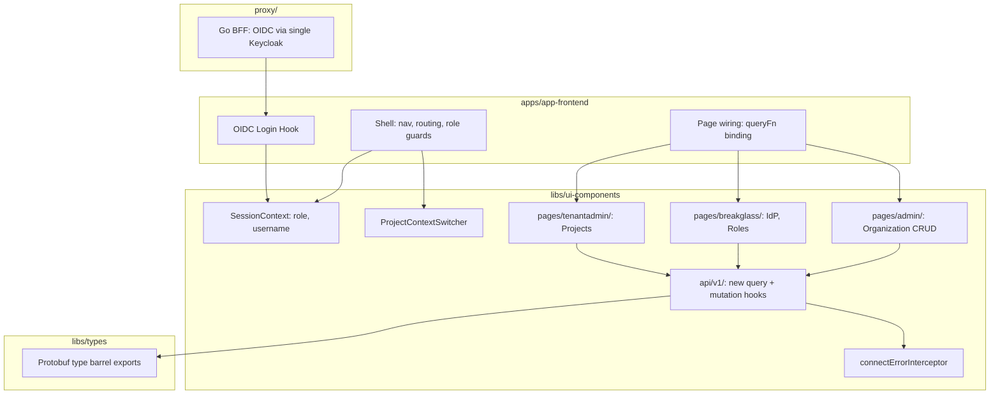
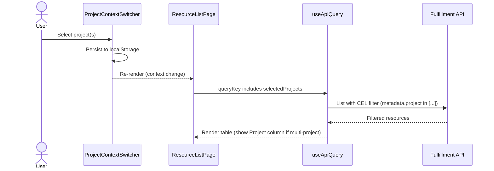

# Organizations & Authentication — UI

| Field       | Value                                                                          |
|-------------|--------------------------------------------------------------------------------|
| Author(s)   | rawagner@redhat.com                                                            |
| Jira        | [OSAC-2792](https://redhat.atlassian.net/browse/OSAC-2792)                     |
| PRD         | [03-prd.md](https://github.com/osac-project/enhancement-proposals/blob/main/enhancements/organizations/README.md)                                    |
| Date        | 2026-07-16                                                                     |

# 1. Overview

This design covers the OSAC Console (frontend and Go proxy) changes required to support the Organizations & Authentication feature defined in the [PRD](https://github.com/osac-project/enhancement-proposals/blob/main/enhancements/organizations/README.md). The work spans four areas:

1. **Shell changes** — role-differentiated sidebar navigation for four UI roles (`admin`, `tenant-idp-manager`, `tenant-admin`, `tenant-user`), with matching route guards and default routes.
2. **Project context switcher** — a multi-select masthead component that scopes resource pages to zero, one, or many projects, with hierarchical display and persistent selection.
3. **New management screens** — Organization CRUD (Cloud Provider Admin), Identity Provider configuration (Cloud Provider Admin / Tenant Admin / break-glass), Roles & Groups management (Cloud Provider Admin / Tenant Admin / break-glass), and Project CRUD with permissions (Cloud Provider Admin / Tenant Admin / Tenant User).
4. **Authentication changes** — a fourth `tenant-idp-manager` role mapping and `PermissionDenied` error handling in the Connect interceptor. The Go proxy continues to talk to a single Keycloak instance — Keycloak handles routing to the tenant-specific IdP internally.

The backend APIs (fulfillment-service, Keycloak integration, Kuadrant authorization) are assumed to exist per the PRD. This design addresses how the UI consumes them.

# 2. Goals and Non-Goals

## 2.1 Goals

- Reuse existing page patterns (`ListPage`, `ResourceDetailHeader`, `OsacForm`, `CatalogProvisionWizard`) for all new screens — no new shared UI infrastructure.
- Keep the `ui-components` package API-layer-agnostic: new hooks use the `useApiQuery`/`useApiFetch` pattern with no direct `@tanstack/react-query` imports.
- Add `tenant-idp-manager` as a fourth UI role without breaking the existing role-based rendering contract.
- Automatically scope project-scoped resource queries to the project context switcher selection — `useApiQuery` detects project-scoped resources via protobuf `Metadata.project` introspection and injects CEL filters without per-hook opt-in.
- Expose break-glass credentials exactly once at organization creation time; never persist or re-display them.

## 2.2 Non-Goals

- LDAP/AD/SAML IdP type support in the IdP configuration form — the protobuf `IdentityProviderSpec.config` is a `oneof` with only `OidcConfig` defined. Until the protobuf schema adds LDAP/AD/SAML config types, the form covers OIDC only. The PRD mentions multi-type support, but the generated types do not yet support it. [Codebase: libs/types/src/osac/public/v1/identity_provider_type_pb.ts]
- Quota management UI — deferred per the PRD.
- IdP health monitoring alerting — deferred per the PRD.

# 3. Motivation / Background

The OSAC Console currently serves a single-tenant experience: navigation is identical for all roles, there is no project context switcher, and no management screens exist for organizations, identity providers, roles, or projects. The session context carries only `role` and `username` — no tenant or organization identity.

The `navRowsForRole` function in `shellNav.ts` accepts a `role` parameter but ignores it, always returning the tenant-user navigation. The `UserRole` type defines three roles (`admin`, `tenant-admin`, `tenant-user`) but the UI does not differentiate between them. The OIDC login hook maps Keycloak `realm_access.roles` to these three values; the `tenant-idp-manager` Keycloak role falls through to `tenant-user`, which is incorrect — break-glass users would see Services and Networking pages they cannot use. [Codebase: apps/app-frontend/src/shell/shellNav.ts], [Codebase: apps/app-frontend/src/hooks/oidc-login.tsx]

Six of the eight auth-domain protobuf types (`Tenant`, `Project`, `ProjectMembership`, `Role`, `RoleBinding`, `IdentityProvider`) are generated in `libs/types/` but not exported from the barrel file — a mechanical prerequisite before any API hooks can be written. [Codebase: libs/types/src/index.ts]

The Connect error interceptor handles only `Unauthenticated` (401). With role-based access control, `PermissionDenied` (403) responses need handling so the UI can show access-denied states instead of generic errors. [Codebase: libs/ui-components/src/api/api-context.tsx]

# 4. Design

## 4.1 Architecture

The implementation touches three layers of the monorepo plus the Go proxy:



The diagram shows the dependency graph between new and modified components. `apps/app-frontend` wires shell navigation, OIDC login, and page routes. `libs/ui-components` holds the session context, project switcher, page components, and API hooks. `libs/types` exports the protobuf types consumed by hooks. The Go proxy connects to a single Keycloak instance (issuer URL from the fulfillment capabilities endpoint); Keycloak handles routing to the tenant-specific IdP. [Codebase: proxy/auth/capabilities.go]

### Role-differentiated navigation

`navRowsForRole` is extended to return different `NavRow[]` arrays based on role:

| Role | Sections | Default route |
|------|----------|---------------|
| `admin` | Administration (Organizations) + Organization (IdP, Roles & Groups, Projects) + Services + Networking | `/admin/organizations` |
| `tenant-idp-manager` | Organization (Identity Provider, Roles & Groups) | `/organization/identity-provider` |
| `tenant-admin` | Organization (Identity Provider, Roles & Groups, Projects) + Services + Networking | `/catalog` |
| `tenant-user` | Projects + Services + Networking | `/catalog` |

The `defaultRouteForRole` function in `shellRoutes.ts` returns the corresponding default route per role.

### Masthead

The masthead displays:
- **Username and role label** — the authenticated user's name and a human-readable role label (e.g., "Cloud provider admin", "IdP manager", "Tenant admin", "Tenant user"). The role label is derived from `UserRole` via a display-name map. The user dropdown provides Preferences and Log out actions.
- **Project context switcher** — visible to `admin`, `tenant-admin`, and `tenant-user` (see §4.1 Data flow: project-scoped resource queries). Hidden for `tenant-idp-manager` (break-glass users do not manage project-scoped resources).

### Route structure

New route trees are added to `AppShell.tsx`, each wrapped in a `RoleRoute` guard:

| Path prefix | Guard | Component |
|-------------|-------|-----------|
| `/admin/organizations/*` | `admin` | `OrganizationRoutes` |
| `/organization/identity-provider/*` | `admin`, `tenant-idp-manager`, `tenant-admin` | `IdentityProviderRoutes` |
| `/organization/roles/*` | `admin`, `tenant-idp-manager`, `tenant-admin` | `RolesGroupsRoutes` |
| `/organization/projects/*` | `admin`, `tenant-admin`, `tenant-user` | `ProjectRoutes` |

Existing tenant routes (`/catalog`, `/vms`, `/clusters`, `/bare-metal`, `/networking/*`) are guarded by `admin`, `tenant-admin`, and `tenant-user`.

### Data flow: project-scoped resource queries



The project context switcher stores the selection in React context and `localStorage`. `useApiQuery` automatically injects a CEL project filter for project-scoped resources (detected via protobuf `Metadata.project` field introspection). When zero projects are selected ("All projects"), no filter is applied — the API returns resources across all accessible projects.

## 4.2 Data Model / Schema Changes

No database or protobuf schema changes. The UI consumes existing protobuf types.

### Type barrel exports

Six type/service pairs must be added to `libs/types/src/index.ts`:

```ts
export * from './osac/public/v1/tenant_type_pb.js'
export * from './osac/public/v1/tenants_service_pb.js'
export * from './osac/public/v1/project_type_pb.js'
export * from './osac/public/v1/projects_service_pb.js'
export * from './osac/public/v1/project_membership_type_pb.js'
export * from './osac/public/v1/project_memberships_service_pb.js'
export * from './osac/public/v1/role_type_pb.js'
export * from './osac/public/v1/roles_service_pb.js'
export * from './osac/public/v1/role_binding_type_pb.js'
export * from './osac/public/v1/role_bindings_service_pb.js'
export * from './osac/public/v1/identity_provider_type_pb.js'
export * from './osac/public/v1/identity_providers_service_pb.js'
```

### Session context extension

`DemoShellRole` is renamed to `UserRole` and uses the Keycloak role strings directly, eliminating the `ROLE_MAP` indirection:

```ts
type UserRole = 'admin' | 'tenant-idp-manager' | 'tenant-admin' | 'tenant-user';
```

The UI uses the same role identifiers as Keycloak — no mapping layer. `admin` is derived from Keycloak `admin` group membership; `tenant-idp-manager` and `tenant-admin` from `realm_access.roles`; `tenant-user` is the implicit default for authenticated users with no recognized role or group.

### Project context state

A new `ProjectContextProvider` wraps the app shell. It holds:

```ts
interface ProjectContextValue {
  selectedProjects: string[];       // empty = "All projects"
  setSelectedProjects: (ids: string[]) => void;
}
```

Selection is persisted to `localStorage` under a tenant-and-user-scoped key (`osac.selectedProjects.<tenantId>.<username>`) and restored on mount. Scoping to the tenant and authenticated username ensures that users across different tenants — or different users sharing a browser — do not inherit each other's project selections. The `tenantId` and `username` come from `SessionContext`. When either value changes (e.g., re-login to a different tenant), the stored selection is not carried over. When a selected project is deleted (detected by comparing the query result against the stored IDs), it is silently removed from the selection.

The masthead switcher displays the current selection as a summary (e.g., "All projects", "team-a", "2 projects"). To change the selection, the user clicks a "Select projects" action which opens a modal. The modal handles hierarchical display (PatternFly `TreeView`, up to 4 levels deep) and paginated loading — it fetches projects page by page, building the tree incrementally, and supports search/filter to locate projects without scrolling through all pages. This separation keeps the masthead lightweight while the modal handles the complexity of pagination and tree rendering.

### Create form project scoping

Create actions (VM, Cluster, Bare Metal, Virtual Network) require a single target project in the API request. When the project context switcher has exactly one project selected, it is used automatically. When zero or multiple projects are selected, the create form includes a project selector field so the user can choose the target project. This applies to all create forms that produce project-scoped resources.

### No-projects empty state

If a Tenant User has no accessible projects (e.g., permissions revoked), resource pages render an empty state: "No projects available — contact your administrator." The project context switcher renders as an empty dropdown with a descriptive message.

## 4.3 API Changes

No new backend API endpoints are introduced by this design. The UI consumes existing fulfillment-service APIs.

### New API hooks

Hooks follow the existing `useApiFetch(ServiceDesc)` → Connect client → `useApiQuery` pattern. [Codebase: libs/ui-components/src/api/v1/compute-instance.ts]

**Query hooks** (in `libs/ui-components/src/api/v1/`):

| Hook | Service | Operation | File |
|------|---------|-----------|------|
| `useTenants` | `TenantsService` | `list` | `tenant.ts` |
| `useTenant` | `TenantsService` | `get` | `tenant.ts` |
| `useProjects` | `ProjectsService` | `list` | `project.ts` |
| `useProject` | `ProjectsService` | `get` | `project.ts` |
| `useProjectMemberships` | `ProjectMembershipsService` | `list` | `project-membership.ts` |
| `useRoles` | `RolesService` | `list` | `role.ts` |
| `useRoleBindings` | `RoleBindingsService` | `list` | `role-binding.ts` |
| `useIdentityProviders` | `IdentityProvidersService` | `list` | `identity-provider.ts` |
| `useIdentityProvider` | `IdentityProvidersService` | `get` | `identity-provider.ts` |

**Mutation hooks** (Connect `createClient` + TanStack `useMutation`):

| Hook | Method | Endpoint |
|------|--------|----------|
| `useCreateTenant` | `POST` | `/api/fulfillment/v1/tenants` |
| `useUpdateTenant` | `PATCH` | `/api/fulfillment/v1/tenants/{object.id}` |
| `useDeleteTenant` | `DELETE` | `/api/fulfillment/v1/tenants/{id}` |
| `useCreateProject` | `POST` | `/api/fulfillment/v1/projects` |
| `useDeleteProject` | `DELETE` | `/api/fulfillment/v1/projects/{id}` |
| `useCreateProjectMembership` | `POST` | `/api/fulfillment/v1/project_memberships` |
| `useDeleteProjectMembership` | `DELETE` | `/api/fulfillment/v1/project_memberships/{id}` |
| `useCreateRoleBinding` | `POST` | `/api/fulfillment/v1/role_bindings` |
| `useUpdateRoleBinding` | `PATCH` | `/api/fulfillment/v1/role_bindings/{object.id}` |
| `useDeleteRoleBinding` | `DELETE` | `/api/fulfillment/v1/role_bindings/{id}` |
| `useCreateIdentityProvider` | `POST` | `/api/fulfillment/v1/identity_providers` |
| `useUpdateIdentityProvider` | `PATCH` | `/api/fulfillment/v1/identity_providers/{object.id}` |
| `useDeleteIdentityProvider` | `DELETE` | `/api/fulfillment/v1/identity_providers/{id}` |

Note on Roles & Groups: The PRD describes role-to-group bindings (where groups are synced from the IdP to Keycloak). The actual fulfillment-service API uses `RoleBinding` objects that bind a role to a list of users — not groups. The Roles & Groups page design uses the API's `RoleBinding` model (role → users) rather than the PRD's group-based model. If the API is updated to support group-based bindings, the `RoleBindingDrawer` component switches to group selection. See open question §9.3.

Note: The actual API uses flat top-level paths (e.g., `/api/fulfillment/v1/identity_providers`) with `metadata.tenant` for scoping — not the nested organization paths described in the PRD.

### `ApiRoute` type extension

The `ApiRoute` union type (constraining query keys) is extended with entries for each new resource:

```ts
type ApiRoute =
  | 'compute-instances'
  | 'instance-types'
  // ... existing entries
  | 'tenants'
  | 'projects'
  | 'project-memberships'
  | 'roles'
  | 'role-bindings'
  | 'identity-providers';
```

### Connect error interceptor extension

`connectErrorInterceptor` is extended to handle `Code.PermissionDenied` alongside the existing `Unauthenticated` case — throwing a `ForbiddenError` that pages catch to render an access-denied empty state (reusing the existing `UnauthorizedErrorState` component pattern). [Codebase: libs/ui-components/src/api/api-context.tsx]

### Automatic project scoping

Project filtering is applied automatically by `useApiQuery` — individual hooks do not need to opt in. On every list query, `useApiQuery` uses `@bufbuild/protobuf` message descriptors to check whether the response type's `Metadata` has a `project` field. If it does, the resource is project-scoped and a CEL filter is injected based on the current project context:

- Single project selected: `this.metadata.project == "team-a"`
- Multiple projects selected: `this.metadata.project in ["team-a", "team-b"]`
- All projects (no selection): no filter applied — the API returns only resources the user has access to

This approach requires no manual list of project-scoped routes — it stays correct automatically as new resource types are added. The `selectedProjects` from `ProjectContextValue` are included in the query key so TanStack Query refetches when the selection changes.

## 4.4 Scalability and Performance

Impact is minimal and bounded to the browser:

- **CPU/memory**: No heavy computations. The project selection modal fetches projects page by page and builds the tree incrementally. No tree virtualization needed at expected scale (tens to low hundreds of projects per tenant).
- **Network**: New pages issue 1–3 API calls on mount (same pattern as existing resource pages). The project switcher fetches the project list once per mount and relies on TanStack Query stale-while-revalidate.
- **Storage**: `localStorage` stores the project selection per tenant/user (a JSON array of project IDs, typically < 1 KB).

Organization and project list pages use TanStack Query's `refetchInterval` (matching the pattern used by existing resource list pages) to auto-refresh and reflect changes made by other users. No custom polling logic — the standard TanStack Query refetch interval applies.

## 4.5 Security Considerations

### Break-glass credential display

Organization creation returns break-glass credentials in the API response. The console displays them in a one-time confirmation dialog with copy-to-clipboard. After the user dismisses the dialog:
- Credentials are not persisted to `localStorage`, `sessionStorage`, or any client-side store.
- Navigation away from the dialog is irreversible — the fulfillment-service does not persist the password (it is generated, sent to Keycloak, returned in the response, and discarded). Reading the tenant afterward returns empty credentials. Password reset is only possible via the Keycloak admin API directly.
- The password is temporary — the break-glass user must change it on first login.
- The dialog includes a warning: "Save these credentials now — they cannot be retrieved later."

The break-glass credentials are returned via the private API protobuf (`TenantStatus.break_glass_credentials`). The private API shares the same URL as the public API — the UI calls it the same way, using the private gRPC proto instead of the public one.

### Role resolution

With the `ROLE_MAP` removed, the OIDC login hook reads Keycloak `admin` group membership and `realm_access.roles` directly — the `UserRole` values match the Keycloak identifiers with no mapping layer. If a user matches multiple criteria (e.g., both `tenant-admin` role and `admin` group), the first match in priority order wins: `admin` > `tenant-admin` > `tenant-idp-manager` > `tenant-user`. Authenticated users with no recognized group membership or role are treated as `tenant-user` — there is no explicit `tenant-user` role in Keycloak; any authenticated user without a specific role assignment is a tenant-user by design. [Codebase: apps/app-frontend/src/hooks/oidc-login.tsx]

### Client-side authorization

The sidebar hides nav items the user's role does not permit. Route guards (`RoleRoute`) enforce the same constraints on direct URL access, rendering an access-denied state for unauthorized roles. These are UX guards only — the API enforces authorization server-side.

No secrets, tokens, or credentials are stored in source or tests. OIDC tokens remain in HttpOnly cookies managed by the Go proxy — the browser JavaScript never accesses them directly.

## 4.6 Failure Handling and Recovery

| Failure | What the user sees | Recovery |
|---------|--------------------|----------|
| Tenant IdP unavailable or misconfigured | Error message on login page with details from the IdP error callback | User retries; break-glass users authenticate directly to Keycloak, bypassing the external IdP |
| Keycloak outage | Login page fails to load or returns a connection error | Requires Keycloak recovery — no client-side workaround (break-glass auth also depends on Keycloak) |
| Session expired (401 from API) | Redirect to login flow | Automatic — `UnauthorizedError` triggers re-authentication |
| Permission denied (403 from API) | Access-denied empty state on the page | User contacts admin for role/permission changes |
| Organization list load fails | Error state with retry action (TanStack Query) | Automatic retry; manual refresh |
| Organization create fails | Inline error on the create form | User corrects input and resubmits |
| Break-glass credential dialog dismissed without copying | Credentials lost — cannot be retrieved | Cloud Provider Admin must reset via Keycloak Admin Console |
| IdP connectivity test fails | Error details shown inline on the Identity Provider page | User corrects IdP configuration and retests |
| Project list load fails | Error state in project switcher dropdown and project list page | TanStack Query retry |
| Delete fails due to child resources | Error message in confirmation modal listing blocking resources | User deletes child resources first and retries |
| Project context switcher references a deleted project | Stale project silently removed from selection on next project list fetch | Automatic |

## 4.7 RBAC / Tenancy

### Four UI roles

| Role | Keycloak source | Navigation | Project switcher |
|------|-----------------|------------|------------------|
| `admin` | `admin` group membership | Administration + Organization + Services + Networking | Yes |
| `tenant-idp-manager` | `tenant-idp-manager` role | Organization (IdP + Roles & Groups only) | No |
| `tenant-admin` | `tenant-admin` role | Organization + Services + Networking | Yes |
| `tenant-user` | _(no explicit role)_ | Projects + Services + Networking | Yes |

The `ROLE_MAP` in `oidc-login.tsx` is removed. `roleFromRoles` checks Keycloak group membership and `realm_access.roles` to resolve the UI role in priority order (`admin` > `tenant-admin` > `tenant-idp-manager` > `tenant-user`). Authenticated users with no recognized group or role are treated as `tenant-user`. If the user is not authenticated at all, the existing login redirect applies.

### Route guards

Route access is enforced by `RoleRoute`, which reads `role` from `SessionContext` and renders `UnauthorizedErrorState` for disallowed roles. The sidebar does not render nav links for disallowed sections, but direct URL access is handled gracefully.

### Tenant isolation

All API calls are scoped to the authenticated user's tenant via the Go proxy session (the Keycloak realm determines the tenant). The UI does not implement tenant filtering — the API returns only resources belonging to the user's organization.

Cloud Provider Admins (`admin`) operate cross-tenant — their API calls to the Organization/Tenant endpoints return all organizations. The organization list page does not apply tenant filtering.

### Visibility constraints

- Cloud Provider Admins (`admin`) have full access to all sections — Administration, Organization, Services, and Networking — including the project context switcher.
- Break-glass users (`tenant-idp-manager`) see only Identity Provider and Roles & Groups — no project switcher, no resource pages, no project management.
- Tenant Users see only projects they have at least `VIEWER` membership on (API-enforced — the project list endpoint returns only accessible projects).
- Project permissions tab on the project detail page is visible to `admin` and `tenant-admin` only.

## 4.8 Extensibility / Future-Proofing

The design accommodates likely future enhancements without over-engineering:

- **Additional IdP types**: The IdP configuration form renders fields based on `IdentityProviderSpec.config` (a protobuf `oneof`). Adding LDAP/SAML support requires adding form sections conditional on the selected type — no architectural change to the form infrastructure.
- **Quotas**: Organization and project detail pages use a tab layout. A "Quotas" tab can be added when quota management is implemented.
- **Multiple IdPs per Organization**: The API supports multiple IdPs per tenant with no server-side limit. The IdP page uses a list → detail pattern (same as other resource pages), accommodating multiple IdPs out of the box.
- **Organization-scoped login**: The Go proxy connects to a single Keycloak instance and obtains the OIDC issuer URL from the fulfillment capabilities endpoint. Keycloak internally routes to the correct IdP per organization based on the username. The UI simply redirects to Keycloak to start the login process and receives the user's token — org resolution is a Keycloak concern, not a UI concern.

# 5. Alternatives Considered

## Role-differentiated navigation via feature flags vs. role-based routing

**Approach**: Use feature flags or LaunchDarkly-style toggles to show/hide nav sections, rather than branching on the session role.

**Pros**: Decouples UI capability from the Keycloak role model; allows gradual rollout of admin features.

**Cons**: Adds a runtime dependency on a feature flag service; the PRD defines explicit role-based access, not feature-gated access; the existing `RoleRoute` pattern already provides role-based guards.

**Decision**: Use role-based navigation, consistent with the existing `RoleRoute` guard pattern and the PRD's explicit role definitions.

## Single-select project switcher vs. multi-select

**Approach**: A single-select dropdown (like the OpenShift namespace selector) instead of multi-select with an "All projects" default.

**Pros**: Simpler implementation; every API call has a single project filter; no need for a "Project" column in tables.

**Cons**: Users managing resources across multiple projects must switch context repeatedly; "All projects" view is not possible; does not match the PRD requirement for multi-project views.

**Decision**: Multi-select with "All projects" default, per the PRD. The API supports cross-project listing natively via CEL filter expressions, injected automatically by `useApiQuery`.

## Client-side project tree virtualization

**Approach**: Use a virtualized tree component (e.g., `react-window`) for the project switcher to handle large project counts.

**Pros**: Handles thousands of projects without DOM pressure.

**Cons**: Over-engineering — project counts per tenant are expected to be in the tens to low hundreds; PatternFly's `TreeView` component handles this scale without virtualization.

**Decision**: Use PatternFly `TreeView` without virtualization. Revisit if usage data shows tenants with 500+ projects.

## Separate Organization vs Tenant terminology in UI

**Approach**: The PRD uses "Organization" as the user-facing term. The API uses "Tenant". Two options: (a) display "Organization" labels while calling Tenant API endpoints, or (b) align UI labels with the API term "Tenant".

**Pros of (a)**: Matches PRD language and user mental model. **Cons of (a)**: Divergence between UI labels and API field names complicates debugging and documentation.

**Decision**: Deferred — this is an open question (§9.2). The component architecture uses "Organization" in user-facing labels and "Tenant" in code/API references, allowing either choice without refactoring.

# 6. Observability and Monitoring

No new observability changes. Existing monitoring mechanisms apply:
- TanStack Query error boundaries surface API failures in the UI.
- Go proxy access logs capture all API requests (including the new auth-domain endpoints).
- Browser console errors for unhandled rejections.
- OIDC login failures are logged by the Go proxy and displayed to the user.

# 7. Test Plan

Unit tests (Vitest + React Testing Library):

- **Role resolution** — `roleFromRoles` returns the correct `UserRole` for each priority combination; returns `'tenant-user'` when no recognized group or role is present (matching Keycloak semantics where tenant-user has no explicit role).
- **Role-differentiated navigation** — `navRowsForRole` returns the correct `NavRow[]` for each of the four roles; `defaultRouteForRole` returns the matching default route.
- **Route guards** — `RoleRoute` renders children for authorized roles; renders access-denied state for unauthorized roles (e.g., `tenant-user` accessing `/admin/organizations`).
- **Project context switcher** — `ProjectContextProvider` persists selection to `localStorage` under `osac.selectedProjects.<tenantId>.<username>`; restores on mount; silently removes deleted projects from selection.
- **Automatic project scoping** — `useApiQuery` injects CEL filter for project-scoped resources (resources with `Metadata.project`); omits filter for non-project-scoped resources; omits filter when no projects are selected ("All projects").
- **Organization CRUD** — create form validates required fields; break-glass credential dialog displays credentials and warns about one-time visibility; delete confirmation modal shows server error on `FailedPrecondition` (child resources exist).
- **Identity Provider form** — OIDC config form validates `client_id`, `client_secret`, `issuer`, `default_scopes` fields; connectivity test displays success/failure inline.
- **Roles & Groups** — roles table renders read-only list; `RoleBindingDrawer` manages role-to-user bindings.
- **Project CRUD** — create modal validates required fields; delete confirmation modal shows server error on `FailedPrecondition`; permissions tab renders project memberships with VIEWER/MANAGER roles.
- **Connect error interceptor** — `connectErrorInterceptor` converts `PermissionDenied` to `ForbiddenError`; passes through other error codes unchanged.
- **Session context** — `SessionProvider` supplies `role`, `username`, and `tenantId` from OIDC login response.

Integration tests (Vitest with mock Connect transport):

- Organization create happy path: fill form → submit → break-glass credential dialog → dismiss → redirect to detail page.
- IdP configuration: create OIDC IdP → test connectivity → verify status display.
- Project switcher interaction: select projects → verify list page re-fetches with CEL filter → deselect → verify unfiltered fetch.
- No-role user flow: authenticate with no recognized roles → verify tenant-user shell renders (tenant-user is the implicit default for users without explicit Keycloak roles).

Tricky areas: project scoping with `Metadata.project` introspection (ensuring non-project-scoped resources like Organizations are never filtered); role priority when a user has multiple roles; break-glass credential dialog dismissal (credentials must not be recoverable after close); `localStorage` key scoping per tenant and username.

# 8. Impact and Compatibility

## Backward-incompatible changes

- `UserRole` type gains `'tenant-idp-manager'` — any exhaustive switch/if-else on this type must handle the new value. All such sites are in `app-frontend` (nav, routes, default route).

## Breaking changes to existing behavior

- `navRowsForRole` currently returns the same nav for all roles. After this change, `admin` users see a different sidebar. This is intentional and required by the PRD, but it changes the experience for any existing `admin` users.
- The Connect error interceptor now throws `ForbiddenError` on 403 responses. Because the interceptor converts `ConnectError` *before* the error reaches hook consumers, any code catching `ConnectError` for `PermissionDenied` must be updated to catch `ForbiddenError` instead.

## Migration

No database migration. No data backfill. The only persistent state change is the `localStorage` key `osac.selectedProjects.<tenantId>.<username>` (new, not migrated).

## Compatibility with existing pages

Existing resource pages (VMs, Clusters, Bare Metal, Virtual Networks) gain project filtering automatically once the `ProjectContextProvider` and `useApiQuery` changes are in place. Because `useApiQuery` detects project-scoped resources via protobuf `Metadata.project` introspection and injects the CEL filter, no per-page changes are needed for list queries. Pages that render a "Project" column in tables when multiple projects are in scope will need a minor template update, but the filtering itself requires no opt-in.

# 9. Open Questions

## 9.1 Should the UI use "Organization" or "Tenant" as the user-facing term?

The PRD uses "Organization" throughout. The API model has deprecated `Organization` in favor of `Tenant`. The current codebase has both: the public API exports `Organization` types (legacy) and `Tenant` types (current).

- **Owner:** Product / UX team
- **Impact:** All user-facing labels, breadcrumbs, page titles, nav items, i18n keys

## 9.2 Which permissions model is authoritative — Keycloak Authorization Services scopes or ProjectMembership VIEWER/MANAGER?

The PRD describes fine-grained scoped permissions (`VIEW_PROJECT`, `MANAGE_PROJECT`, `CREATE_COMPUTE_INSTANCE`). The fulfillment-service implementation uses `ProjectMembership` with two roles (`VIEWER`, `MANAGER`) and `RoleBinding` objects for org-level role assignment.

This affects: the Project detail Permissions tab (does it show scoped permissions or VIEWER/MANAGER membership?), the Roles & Groups page (does it manage groups or RoleBindings?), and form field design for granting access.

- **Owner:** API / Backend team
- **Impact:** §4.1 (Roles & Groups page, Project permissions tab), §4.3 (which mutation hooks are needed)

## ~~9.3 How should the project context switcher work with paginated project listing?~~

**Resolved.** The masthead shows a summary of the current selection. A "Select projects" action opens a modal that handles tree rendering and pagination — fetching projects page by page, building the hierarchy incrementally, and supporting search/filter. See §4.1 (Project context state).
