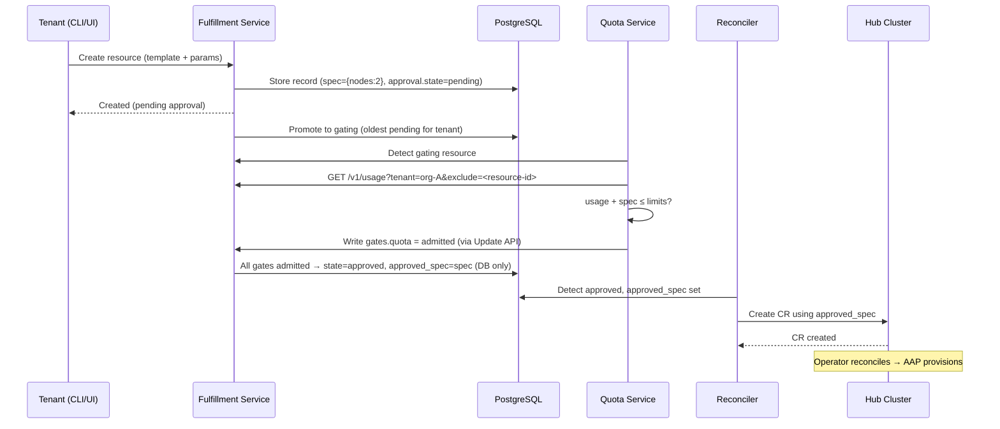

# Quota Management

## Summary

This proposal introduces a quota management system for the Open Sovereign AI Cloud (OSAC) that enforces resource limits on tenant provisioning requests. The system consists of three layers: a **metering layer** (a `/v1/usage` endpoint on the Fulfillment Service that reports per-tenant resource consumption), an **approval workflow** (a generic, extensible gating mechanism in the Fulfillment Service), and an **OSAC Quota Service** (a pluggable component that consumes metering data and makes quota-based gate decisions). The design follows Kubernetes-like declarative conventions: `spec` represents the user's intent, and `status.approval` reports the system's observations about gate decisions. Quota-internal state (`approved_spec`) is kept in the Fulfillment Service database, not exposed in the API.

## Motivation

Service providers need to enforce upper limits on the resources tenants can consume. Without quotas:

- A single tenant can accidentally or intentionally consume the entire infrastructure, starving other tenants
- Service providers cannot plan capacity or allocate resources fairly across organizations
- There is no mechanism for integration with external resource allocation systems (e.g., ColdFront at MOC)

Note: visibility into per-tenant resource utilization is a **metering** concern, addressed in this proposal by the `/v1/usage` endpoint. Metering is a prerequisite for quotas but also a standalone capability useful for billing, dashboards, and capacity planning.

### User Stories

- As a **service provider**, I want to create, modify, and delete resource quotas for tenant organizations, so that I can ensure fair resource distribution.
- As a **service provider**, I want to view quota limits and usage for all tenants, so that I can plan capacity and identify over-utilization.
- As a **tenant**, I want to view my resource quota limits and current utilization, so that I can plan my provisioning requests.
- As a **tenant**, I want to know when and why a request is rejected due to quota enforcement, so that I can adjust my request or contact my administrator.
- As a **tenant**, I want to scale my existing clusters within my quota limits, so that I can adapt to changing workload demands.
- As a **platform operator**, I want OSAC to work without quotas when I don't need them, so that I can adopt quota enforcement gradually.

### Goals

- Provide a metering capability (`/v1/usage` endpoint) that reports per-tenant resource consumption, usable by quotas, billing, dashboards, and capacity planning
- Implement a generic approval workflow in the Fulfillment API that enables quota enforcement in v1 and is extensible to other approval patterns (billing, policy, manual admin) in the future
- Introduce the OSAC Quota Service as a separate, pluggable component that consumes metering data and makes quota-based gate decisions
- Support create, scale-out/up, scale-in/down, and delete operations in the quota workflow
- Enable integration with external quota sources (e.g., ColdFront) via the Quota Service API
- Ensure backwards compatibility — quotas are fully opt-in via the `OSAC_APPROVAL_REQUIRED` flag (default: disabled), allowing deployments to run without a Quota Service and adopt quota enforcement gradually

### Non-Goals

- User interface components for quota management (will be addressed in a separate proposal)
- Billing or cost accounting integration (the architecture supports it via extensible gates and the metering endpoint, but billing logic is out of scope)
- Capacity planning or predictive quota management
- Per-hub or per-region quota limits (v1 enforces quotas globally per organization across all hubs; sub-dividing quotas by hub, region, or availability zone is deferred)
- **High availability and backup:** The Quota Service is deployed as a single replica with no automated backup, consistent with all other OSAC components (Fulfillment Service, OSAC Operator, Keycloak, etc.) which also run at `replicas: 1` with no backup strategy. The current OSAC platform does not address HA or backup for any component. The Quota Service's PostgreSQL database stores only quota limits (not resource data), so loss is recoverable by re-entering limits from ColdFront or admin records. When a platform-wide HA and backup initiative is undertaken, the Quota Service should be included.
- **Multi-gate coordination semantics:** v1 implements only the quota gate. The extensible gate structure is in place for future gates (billing, policy, manual admin), but the coordination semantics for multiple concurrent gates (reservation, rollback, ordering) are deliberately deferred until a concrete second gate is needed. See Future Work for details.

## Proposal

We propose five changes:

1. **Metering endpoint on the Fulfillment Service:** A `/v1/usage` endpoint that computes and returns per-tenant resource consumption by aggregating `approved_spec` footprints from the Fulfillment Service database. This is a standalone metering capability, not quota-specific — it serves quotas, CLI, UI, billing, and capacity planning.

2. **Generic approval workflow in the Fulfillment Service:** The Fulfillment Service API follows Kubernetes-like declarative conventions. `spec` represents the user's intent (always the latest desired state). A new `status.approval` block reports the system's observations about gate decisions, including `state` (pending/gating/approved/rejected) and an extensible `gates` map. The Fulfillment Service maintains `approved_spec` internally in its database (not exposed in the API) to track what has been approved and pushed to the hub. The Fulfillment Service only creates or updates CRs on the hub when `status.approval.state` is `"approved"`.

3. **Gating semaphore for sequential evaluation:** To prevent cross-gate race conditions, only one resource per tenant can be in `"gating"` state at a time. The Fulfillment Service promotes the oldest pending resource to `"gating"`, gate services evaluate it, and on completion the next pending resource is promoted.

4. **`OSAC_APPROVAL_REQUIRED` configuration flag:** A boolean flag on the Fulfillment Service (default `false`) that controls whether the approval workflow is active. When `false`, resources are immediately approved. When `true`, new resources and scale operations start with `status.approval.state = "pending"` and wait for gate services to evaluate. When this flag changes from `true` to `false` at runtime, the Fulfillment Service auto-approves all currently pending and gating resources to drain the backlog.

5. **OSAC Quota Service:** A standalone service that stores quota limits per tenant. It watches for resources in `"gating"` state, reads the tenant's current consumption from the `/v1/usage` metering endpoint, and writes its gate decision. When a quota limit increases, the Quota Service triggers re-evaluation of rejected resources. The Fulfillment Service handles re-evaluation triggers for deletions and scale-ins.

### Workflow Description

#### Sequence Diagrams

**Resource creation (happy path):**



#### Resource Creation

The following workflow applies to all resource types: clusters, compute instances (VMs), and host pools.

1. A **tenant** creates a new resource using the Fulfillment API (CLI or UI), specifying a template and parameters.

2. The **Fulfillment Service** creates a resource record in its database with the template-resolved details in `spec` (the user's intent). Internally, `approved_spec` is empty (nothing approved yet). If `OSAC_APPROVAL_REQUIRED` is `true`, `status.approval.state` is set to `"pending"`. If `false`, `approved_spec` is immediately set to match `spec`, `state` is set to `"approved"`, and processing proceeds (existing behavior). No CR is created on the hub until `state = "approved"`.

3. The **Fulfillment Service** promotes the oldest pending resource for this tenant to `"gating"` state. Only one resource per tenant can be in `"gating"` at a time (semaphore).

4. The **Quota Service** detects the gating resource and evaluates it:
   - Reads the tenant's current consumption from `/v1/usage?tenant=<id>&exclude=<resource-id>` (the endpoint excludes the gated resource from the aggregate)
   - Adds the gated resource's `spec` footprint to the usage
   - Compares the projected total against the tenant's quota limits
   - Writes its decision to `status.approval.gates.quota` via the Fulfillment Service Update API: `admitted` or `rejected` with reason

5. The **Fulfillment Service** checks the gate results:
   - **All gates admitted:** Sets `status.approval.state = "approved"` and `approved_spec = spec` (in the database). The reconciler creates the corresponding CR on the hub cluster. Promotes the next pending resource to gating.
   - **Any gate rejected:** Sets `status.approval.state = "rejected"`. The resource's `spec` (user intent) is preserved. No CR is created. Promotes the next pending resource to gating.

6. The **tenant** can check the status via the CLI (e.g., `fulfillment-cli get clusters`) which shows the approval state for each resource, and `fulfillment-cli get quota` to view their limits and current usage (backed by the `/v1/usage` endpoint).

#### Re-evaluation of Rejected Resources

When a tenant's resource footprint changes (resource deleted, scale-in completed, quota limit increased), rejected non-deleted resources without the `AdmissibilityExpired` condition are set back to `"pending"` state. The Fulfillment Service handles this for deletions and scale-ins; the Quota Service handles this for quota limit increases (via the FS Update API). This re-enters them into the normal gating flow:

- The Fulfillment Service promotes the oldest pending resource to `"gating"` (normal semaphore behavior)
- The Quota Service evaluates it using the `/v1/usage` endpoint
- If it now fits within quota, the Quota Service admits it — the FS transitions to `"approved"`
- If it still doesn't fit, the Quota Service rejects it again
- The next pending resource is then promoted to gating, and so on

This provides declarative retry behavior: the user's intent (in `spec`) is preserved, and the system reconciles toward it when conditions allow.

To prevent stale auto-provisioning, the Fulfillment Service sets an `AdmissibilityExpired` condition (standard K8s condition pattern) on resources that have been in `"rejected"` state beyond a configurable TTL (e.g., 24 hours, CSP-configurable). Resources with this condition are skipped during re-evaluation. The tenant can retry by "poking" the resource (e.g., a minor edit or dedicated retry command), which clears the condition and sets the resource back to `"pending"`.

#### Scale Operations

Scale operations apply to **clusters** (adding/removing worker nodes) and **host pools** (adding/removing hosts). Compute instances (VMs) have immutable resource specs (`cores`, `memoryGiB`, `bootDisk`) — they cannot be resized after creation. To change a VM's resources, the tenant must delete it and create a new one, which goes through the standard approval workflow.

- **Scale-out** (adding nodes to a cluster or hosts to a host pool): The tenant edits the resource via the Fulfillment API (e.g., changes `spec.node_sets.fc430.size` from 2 to 5). The Fulfillment Service updates `spec` to reflect the user's new intent. `approved_spec` (in the database) retains the current approved state (2 nodes). `status.approval.state` is set to `"pending"`, then promoted to `"gating"` when it's the tenant's turn.

  - **On approval:** All gates admit. `approved_spec` is set to match `spec` (in the DB). The reconciler pushes the updated spec to the hub CR. The Operator scales the cluster.
  - **On rejection:** The user's `spec` (5 nodes) is preserved as their intent. `approved_spec` stays at 2. The cluster keeps running at 2 nodes. If quota later frees up, the re-evaluation trigger automatically retries.

- **Scale-in** (removing nodes or hosts): When the new `spec` is less than or equal to `approved_spec`, no approval is needed — freeing resources is always allowed. The Fulfillment Service updates both `spec` and `approved_spec`, sets `state = "approved"`, pushes the change to the hub CR immediately, and the Operator scales down.

  General rule for spec changes: if `new_spec > approved_spec` → pending (needs gating); if `new_spec ≤ approved_spec` → approved immediately.

#### Resource Deletion

When a resource is deleted, it is soft-deleted in the Fulfillment Service (via `deletion_timestamp`). The Fulfillment Service triggers re-evaluation of rejected resources for that tenant. Deleted resources are excluded from all usage computations (both `/v1/usage` and quota checks).

#### Provisioning Failure

If provisioning fails after approval, the resource remains in the Fulfillment Service database with `status.state = FAILED` and `status.approval.state = "approved"`. It continues to count against quota (via the `/v1/usage` endpoint) because:
- Failures can be partial (e.g., 3 of 5 nodes allocated before failure)
- Automatically freeing quota on failure could cause over-commitment
- The tenant must explicitly delete the failed resource to free quota (standard cloud platform behavior)

### Metering: `/v1/usage` Endpoint

The Fulfillment Service provides a metering endpoint that computes per-tenant resource consumption. This is a **standalone capability**, not quota-specific — it serves any consumer that needs to know what a tenant is using.

**Endpoint:** `GET /v1/usage?tenant=<tenant-id>[&exclude=<resource-id>]`

**Response:** Aggregated resource footprint for the tenant:
```json
{
  "tenant": "org-mit-physics",
  "usage": {
    "clusters": 2,
    "nodes.h100": 8,
    "nodes.fc430": 6,
    "compute_instances": 4,
    "vcpus": 32,
    "memory_gib": 128
  }
}
```

**How it works:**
- Queries all approved, non-deleted resources for the tenant across all resource types (Clusters, ComputeInstances, HostPools)
- Sums the `approved_spec` footprints (stored in the FS database, not exposed in the API)
- The optional `exclude` parameter omits a specific resource from the aggregate — used by the Quota Service to exclude the resource being gated, so it can add that resource's `spec` (intent) separately

**Consumers:**
- **Quota Service** — reads tenant usage for gate decisions
- **CLI** (`fulfillment-cli get quota`) — shows tenants their limits and current usage
- **UI** — tenant dashboard for quota visibility
- **Future: billing, capacity planning, analytics**

**Authorization:** Tenants can only query their own tenant's usage. Only privileged service accounts (Quota Service, admins) can query arbitrary tenants. The `exclude` parameter must reference a resource belonging to the queried tenant.

**Implementation:** A SQL aggregation query over the existing `approved_spec` data in the Fulfillment Service database. This is a read-only endpoint with no state of its own.

### API Extensions

All resources gain a new `status.approval` block in the Fulfillment Service API. Following Kubernetes conventions, `spec` represents the user's intent and `status` contains the system's observations:

```yaml
Cluster:
  spec:                              # User's intent (always the latest desired state)
    template: "ocp_4_17_small"
    node_sets: {fc430: {size: 5}}    # What the user wants
  status:
    state: READY                     # Hub-reported observation (Operator writes)
    conditions: [...]                # Hub-reported conditions
    api_url: "https://..."
    node_sets: {fc430: {size: 2}}    # What's actually running on the hub
    approval:                        # Approval observations (Fulfillment Service reports)
      state: "rejected"             # pending | gating | approved | rejected
      gates:                        # Extensible gate structure
        quota:
          state: "rejected"
          reason: "Would exceed quota for nodes.fc430 by 3 (8/10)"
          timestamp: "2026-03-30T..."
```

Note: `approved_spec` is NOT in the API — it is maintained internally in the Fulfillment Service database. The `status.approval` block is purely observational, reporting the current gate decisions. Tenants can see what's running via `status.node_sets` (hub-reported) and their overall consumption via the `/v1/usage` endpoint.

**Approval states:**
- `"pending"` — Resource is waiting to be promoted to gating
- `"gating"` — Resource is being evaluated by gate services (only one per tenant at a time)
- `"approved"` — All gates admitted; resource is provisioned or being provisioned
- `"rejected"` — At least one gate rejected; user's `spec` is preserved as intent; may be re-evaluated when conditions change. If rejected beyond the configurable TTL, an `AdmissibilityExpired` condition is set (K8s condition pattern) — the resource is skipped during re-evaluation until the tenant retries

**Field write permissions:**

| Field | Tenant (public API) | Fulfillment Service | Gate Services (e.g., Quota Service) |
|-------|--------------------|--------------------|-------------------------------------|
| `spec` | Writable (via create/scale requests) | Resolves templates, validates | — |
| `status.approval.state` | Read only | Manages transitions (pending→gating→approved/rejected) | — |
| `status.approval.gates.<name>` | Read only | — | Each gate writes its own entry only |
| `approved_spec` | Not in API | Maintains in DB; sets to `spec` on approval | — |

**Pending resource modification rules:** The Fulfillment Service rejects modification requests (scale, parameter changes) for resources with `status.approval.state` in `"pending"` or `"gating"`. This prevents spec changes while gates are evaluating. However, **deletion of pending/gating resources is allowed**. Gate services must check that a resource has not been deleted before writing their decision.

**Fulfillment Service reconciler logic:**

1. If `approved_spec` is empty → skip entirely (no CR exists on the hub, nothing to sync)
2. If `status.approval.state = "approved"` and `spec != approved_spec` → set `approved_spec = spec`, create/update CR on hub using `approved_spec`, sync status from hub
3. If `approved_spec` is non-empty → sync status from hub (regardless of approval state)

The reconciler always uses `approved_spec` for hub CR operations, never `spec` directly. Hub selection happens during step 2 (after approval), matching current behavior. The reconciler relies on idempotent reconciliation, not transactional atomicity. This works consistently regardless of whether a Quota Service is deployed.

**Required proto/schema changes by resource type:**

| Resource Type | New Fields | Quota Footprint Source |
|--------------|-----------|----------------------|
| **Clusters** | `status.approval` block | `spec.node_sets` (already exists). Example footprint: `{clusters: 1, nodes.fc430: 2}` |
| **ComputeInstances** | `status.approval` block | `spec.cores`, `spec.memory_gib`, `spec.gpus` (already exist except `gpus`). Example: `{compute_instances: 1, vcpus: 8, memory_gib: 32}`. |
| **HostPools** | `status.approval` block | `spec.host_sets` (already exists). Example: `{nodes.h100: 3}` |

**Prerequisite — Fulfillment Service field-level write protection:** The current Fulfillment Service public API does not enforce field-level write restrictions uniformly. Before implementing the approval workflow:
1. Add `AddIgnoredFields(statusField)` to the ComputeInstances public server `inMapper` (parity fix)
2. Add `status.approval` block to ignored fields on all public `inMapper` configurations
3. Enforce immutability of `spec.template` and `spec.template_parameters` on Update in private servers

**Prerequisite — structured GPU field for VMs:** A structured `gpus` field must be added to `ComputeInstanceSpec` before GPU quota enforcement can be implemented. GPU is central to OSAC's AI workload value proposition and must not be deferred.

**Configuration:**

- **`OSAC_APPROVAL_REQUIRED`** (boolean, default `false`): When `false`, new requests are immediately approved and skip the approval workflow entirely. When `true`, new requests start with `state = "pending"`. When this flag changes from `true` to `false` at runtime, the Fulfillment Service auto-approves all pending and gating resources to drain the backlog.

### Implementation Details/Notes/Constraints

#### Resource Footprint Resolution

**Design principle — structured fields for all quotable dimensions:** The metering endpoint reads footprints from structured spec fields. For VMs and host pools, quotable dimensions are already explicit API fields (`spec.cores`, `spec.memory_gib`, `spec.gpus` for VMs; `spec.host_sets` for host pools). No template resolution needed.

For **clusters**, `spec.node_sets` is populated by the Fulfillment Service at creation time from the template's `default_node_request`. The FS resolves template defaults and tenant-provided node set sizes into structured `spec.node_sets` before persisting.

**Known gap — template parameter overrides:** If a tenant uses template parameters (e.g., `worker_count=5`) to override node count instead of explicit node sets, the FS currently stores the template default in `spec.node_sets` (not the parameter-overridden value). Ansible processes the parameter at provisioning time and creates a different number of nodes than what `spec.node_sets` says.

**Recommended fix:** `spec.node_sets` should be the single source of truth for node counts. Ansible roles should read node counts from the ClusterOrder CR's `nodeRequests` (which is derived from `spec.node_sets`), not from template parameters. Template parameters like `worker_count` that duplicate `spec.node_sets` functionality should be retired. This is a template architecture concern to be addressed together with the template maintainers.

#### Template Architecture Considerations

OSAC templates (`osac.templates` collection) and workflows (`osac.workflows` collection) now live together in the `osac-aap` repository. The `osac.workflows` collection provides reusable workflow playbooks with override support — CSPs import vendor workflows and customize specific steps via override variables, without duplicating code.

CSP-specific overrides (e.g., `osac.massopencloud` for MOC) can declare different `default_node_request` entries than the base templates. The AAP template discovery job must publish the **correct `default_node_request` for each fully-qualified template ID**.

**Override risk for quotas:** A workflow override could add resources (e.g., a monitoring node) without updating `default_node_request` in the template's `meta/osac.yaml`, causing the Quota Service to approve based on an understated footprint. Any override that changes the resource footprint must be accompanied by an updated `default_node_request`. CI validation should enforce consistency.

#### Implementation Open Questions

The following design questions are deferred to the implementation phase. They affect the queuing and scheduling behavior but not the core architectural model (approval states, gates, metering):

- **Queue discipline (FIFO vs best-effort):** Should pending resources be processed strictly in creation order (FIFO), or should smaller requests be allowed to skip blocked larger ones (backfilling)?
- **Head-of-line blocking:** If the first resource in the queue is a 32-node cluster that doesn't fit, should it block a 1-node cluster that would fit? Backfilling increases utilization but risks starvation for large requests.
- **Re-evaluation efficiency:** Setting all rejected resources back to pending on every footprint change may cause unnecessary write amplification at larger scale. A smarter approach (check if they'd fit before re-queuing) can be implemented as an optimization.

The [Kueue project](https://kueue.sigs.k8s.io/) (Kubernetes-native job queuing with quota management) provides proven patterns that should inform the implementation design:
- **BestEffortFIFO** (Kueue's default) is recommended over StrictFIFO — older workloads that don't fit do not block newer ones that would fit
- Kueue's **AdmissionCheck** pattern (external controllers gate admission via independent checks, workload admitted only when all checks pass) validates our extensible gates model
- Kueue features not applicable to v1 but potentially relevant for future work: **preemption**, **cohort-based borrowing**, and **flavor fungibility**

### OSAC Quota Service

The Quota Service is a standalone Go service with the following responsibilities.

**Core:**
- **Watch for gating resources:** Periodically query each resource type's List API on the Fulfillment Service, filtering for `"gating"` approval state (configurable interval, default 5s). Note: once the Fulfillment Service Events API is extended to support all resource types, the Quota Service should migrate to event-driven detection with polling as fallback.
- **Compute projected usage:** For each gating resource, read the tenant's current consumption from the `/v1/usage` metering endpoint (excluding the gated resource). Add the gated resource's `spec` footprint. Compare against quota limits.
- **Trigger re-evaluation:** When the Quota Service detects a quota limit increase, it sets rejected non-deleted resources (without `AdmissibilityExpired` condition) for that tenant back to `"pending"` via the Fulfillment Service Update API.
- **Make gate decisions:** Write to `status.approval.gates.quota` on the Fulfillment Service via the Update API. The Quota Service only writes to its own gate entry.
- **Concurrency control:** Process gating resources serially per tenant with a row lock. Since only one resource per tenant is in `"gating"` state at a time (enforced by the Fulfillment Service semaphore), this primarily prevents duplicate processing.

**Quota Management API:**
- `POST /quotas` — Create quota for a tenant (admin only)
- `GET /quotas` — List quotas (tenant sees own, admin sees all)
- `GET /quotas/{id}` — Get specific quota details
- `PUT /quotas/{id}` — Update quota (admin only)
- `DELETE /quotas/{id}` — Remove quota (admin only)

Quota limits are stored as sets of arbitrary key/value pairs to support new resource types without code changes:

```json
{
  "tenant": "org-mit-physics",
  "limits": {
    "clusters": 3,
    "nodes.h100": 20,
    "nodes.fc430": 10,
    "compute_instances": 15,
    "vcpus": 64,
    "memory_gib": 256
  }
}
```

**What the Quota Service does NOT do:**
- It does NOT write `status.approval.state` or `approved_spec`. The Fulfillment Service manages these.
- It does NOT modify resource specs. It only writes to `status.approval.gates.quota`.
- It does NOT compute usage itself. It reads the `/v1/usage` metering endpoint.

### Security Model

The Quota Service is a privileged component with write access to gate entries on all resources. The security model uses defense in depth:

| Layer | Control |
|-------|---------|
| **Authentication** | Dedicated Keycloak service account for the Quota Service |
| **Authorization** | Narrow `approval-writer` role — can only modify `status.approval.gates` entries. |
| **Quota API auth** | Separate `quota-admin` Keycloak role for ColdFront or admin users who manage quota limits. |
| **Audit logging** | All gate decisions and quota changes logged with actor, timestamp, and decision rationale |
| **Network policy** | Quota Service access restricted to the Fulfillment Service API and Keycloak. Designed to support migration to Gateway-routed access when the Organizations architecture is deployed. |
| **Hub CR protection** | Tenants interact via the Fulfillment API only. RBAC on the hub restricts CR modifications to the Fulfillment Service's service account. |

### Pluggability and Approval Service Independence

The Quota Service is **optional and replaceable**. The approval workflow is generic:

- The Fulfillment Service manages state transitions (pending → gating → approved/rejected) and the gating semaphore
- The reconciler only uses `approved_spec` (DB-internal) for hub CR operations
- The Fulfillment Service does NOT know about quotas, limits, or resource accounting

**Gate service minimum contract:** Watch for resources in `"gating"` state, write to own gate entry (`admitted` or `rejected` with reason). No state management, no coordination with other gates. Set `OSAC_APPROVAL_REQUIRED=false` for no approval at all.

### Integration with Organizations and Gateway Architecture

The [Organizations & Authentication proposal](../organizations/README.md) (merged) introduces a Gateway-based architecture. **Quota v1 is independently shippable** before Organizations — it uses the existing tenancy model (`tenants[]` array). When Organizations is implemented, the tenant scope maps to Organization without code changes, and the Quota Service migrates from direct FS access to Gateway-routed access.

### Quota Data Sources

The Quota Service API is generic — quota limits can be populated by any source:

- **Direct API calls** from an administrator using the CLI or custom scripts
- **ColdFront** (at MOC) pushing allocations via a dedicated ColdFront OSAC plugin
- **Billing systems** in commercial deployments

#### MOC Integration with ColdFront

At the Mass Open Cloud, [ColdFront](https://coldfront.readthedocs.io/en/stable/) serves as the authoritative source for resource allocations across multiple platforms (OpenShift, OpenStack, SLURM, and OSAC). ColdFront uses a push model — its OSAC plugin calls the Quota Service API to set quota limits. The Quota Service operates on raw resource counts; ColdFront handles abstraction layers (units of computing, multipliers) internally.

### Quota Reduction Policy

When an administrator reduces a tenant's quota below their current usage:

- **Existing resources are NOT affected.** Running clusters and VMs continue to operate normally.
- **New requests are rejected** until the tenant's usage drops below the new limit.
- The principle: **resource changes drive quota accounting, not the other way around.**

### Observability

| Metric | Type | Labels | Description |
|--------|------|--------|-------------|
| `quota_gate_decisions_total` | Counter | `result`, `resource_type`, `tenant` | Total gate decisions made |
| `quota_pending_resources` | Gauge | `tenant`, `resource_type` | Resources in pending or gating state |
| `quota_utilization_ratio` | Gauge | `tenant`, `resource_type` | Current usage / limit ratio |
| `quota_decision_duration_seconds` | Histogram | `result` | Gate evaluation time |
| `quota_reevaluation_triggers_total` | Counter | `tenant` | Re-evaluation triggers |

| Alert | Condition | Severity |
|-------|-----------|----------|
| `QuotaServiceGatingBacklog` | Resources in gating >5 minutes | Warning |
| `QuotaServiceDown` | Pod not ready | Critical |
| `QuotaTenantNearLimit` | utilization_ratio > 0.9 | Info |

### Risks and Mitigations

| Risk | Impact | Mitigation |
|------|--------|------------|
| **Race conditions** | Concurrent requests could both pass quota | Gating semaphore: one per tenant at a time |
| **Quota Service unavailability** | Requests blocked in pending | Standard K8s pod restart. Admin can set `OSAC_APPROVAL_REQUIRED=false`. |
| **Quota Service compromise** | Could admit any request | Narrow `approval-writer` role, gate entries only |
| **Gating timeout** | Slow gate blocks tenant queue | Configurable timeout, FS reverts to pending |
| **Partial provisioning failure** | Partially allocated resources | Count against quota until explicitly deleted |

### Drawbacks

- **Added latency:** Provisioning waits for gating cycle (up to 5-10s). Acceptable given provisioning takes minutes.
- **New component:** Quota Service + database to deploy and maintain.
- **Sequential gating:** Per-tenant semaphore serializes requests. Not a concern at current scale.

## Alternatives (Not Implemented)

- **Gateway-level quota enforcement (Authorino):** Rejected — quota decisions require cross-resource usage aggregation, which is business logic beyond Authorino's policy model.
- **Separate usage ledger (original proposal, PR #8):** Rejected — the ledger duplicates data already in the Fulfillment Service database. The `/v1/usage` metering endpoint provides the same data without drift.

## Future Work

- **Multi-gate coordination semantics:** Reservation/rollback across multiple gates.
- **Manual admin approval:** A gate entry written by an admin via CLI/UI.
- **Usage analytics:** Historical usage data for trends, capacity planning, billing.
- **Resolution API:** `/v1/resolve` endpoint for template footprint preview before submission.
- **UI for quota management:** Tenant dashboard for limits, usage, rejection history.
- **Decision history:** `decision_history[]` array for full audit trail per resource.
- **Events API migration:** Move from polling to event-driven gate detection.

## Open Questions

1. **Template metadata reliability for clusters:** The `default_node_request` metadata in `meta/osac.yaml` is a redundant declaration — the actual node count defaults also exist independently in the Ansible role's code. For v1, quota accuracy depends on template authors keeping them consistent. Longer-term, `osac.yaml` should become the single source of truth.

2. **Abstraction layers above raw quotas:** MOC/NERC uses "units of computing" (ColdFront's allocation multiplier) and "Service Units" (billing currency). Neither is the Quota Service's concern — it operates on raw resource counts. ColdFront's plugin translates its abstractions before calling the Quota Service API.

## Test Plan

### Unit Tests
- Fulfillment Service: approval state transitions, gating semaphore, `/v1/usage` aggregation
- Quota Service: gate decision logic, re-evaluation trigger, quota limit evaluation

### Integration Tests (KIND cluster)
- End-to-end: create → pending → gating → approved → provisioned
- Rejection: gating → rejected → user sees reason via CLI
- Scale-out approval and rejection with auto-retry
- `OSAC_APPROVAL_REQUIRED=false` mode: resources skip approval
- Gating semaphore: two pending for same tenant, one gating at a time
- Delete while pending/gating
- Scale-in: no approval, triggers re-evaluation of rejected resources
- Failed provisioning: counts against quota until deleted
- Re-evaluation trigger: delete → rejected resource re-queued → approved
- TTL expiration: `AdmissibilityExpired` condition → skipped → tenant pokes to retry
- `/v1/usage` endpoint: correct aggregation across resource types
- Authorization: tenant cannot write `status.approval`
- Cross-tenant isolation: Quota Service reads across tenants, regular accounts cannot
- Config drain: `OSAC_APPROVAL_REQUIRED` true→false auto-approves backlog
- (Post-Organizations) Gateway role enforcement

### E2E Tests (hypershift1)
- Full provisioning with quota enforcement on real bare metal
- ColdFront integration (when plugin is available)
- Migration testing: existing resources get `status.approval.state = "approved"`

## Graduation Criteria

### Dev Preview
- Prerequisites met: field-level write protection, cross-tenant read access, ComputeInstance inMapper parity
- `/v1/usage` endpoint functional
- Approval workflow functional (pending/gating/approved/rejected)
- Quota Service makes correct gate decisions
- CLI shows approval status, rejection reasons, and quota usage

### Tech Preview
- Scale operation approval support
- Re-evaluation trigger for rejected resources
- ColdFront OSAC plugin available
- Migration tested on hypershift1

### GA
- E2E test coverage for all quota scenarios
- Performance validated at target scale
- Observability in place
- Documentation complete

## Upgrade / Downgrade Strategy

### Upgrade
1. **Database migration:** Add `status.approval` block and `approved_spec` (DB-internal) to all resource types. Set `state = "approved"` and `approved_spec = spec` for existing resources.
2. **Fulfillment Service upgrade:** Deploy with `OSAC_APPROVAL_REQUIRED=false` (default). Deploy `/v1/usage` endpoint.
3. **Deploy Quota Service.** Set initial quota limits.
4. **Enable approval:** Set `OSAC_APPROVAL_REQUIRED=true`.

### Downgrade
1. Set `OSAC_APPROVAL_REQUIRED=false`. All requests auto-approved.
2. Quota Service can remain or be removed.

## Version Skew Strategy

The `status.approval` block is additive — older clients that don't know about it will not see it. The `/v1/usage` endpoint is a new endpoint with no backward compatibility concern.

## CLI User Experience Examples

**Listing resources with approval status:**
```bash
$ fulfillment-cli get clusters
ID                                    STATE        APPROVAL    REASON
b211a004-ab87-436d-86c7-7519ce75c77b  READY        approved
a409e02f-3564-4584-8dbd-f4b10a45e23c  -            gating
c7f3e891-2a4b-4c5d-9e6f-8a1b2c3d4e5f  -            rejected    Would exceed quota for nodes.fc430 by 2 (8/10)
```

**Viewing a pending scale operation:**
```yaml
# $ fulfillment-cli get cluster b211a004 -o yaml
spec:
  node_sets:
    fc430: {host_class: fc430, size: 5}    # user's intent
status:
  state: READY
  node_sets:
    fc430: {host_class: fc430, size: 2}    # what's running on the hub
  approval:
    state: gating
    gates:
      quota: {state: pending}
```

**Viewing quota limits and usage (backed by /v1/usage):**
```bash
$ fulfillment-cli get quota
RESOURCE TYPE       USAGE    LIMIT    UTILIZATION
clusters            2        5        40%
nodes.fc430         6        10       60%
nodes.h100          0        20       0%
compute_instances   3        15       20%
vcpus               24       64       38%
```

## Support Procedures

- **Quota Service is down:** Resources stay in `"pending"`. Set `OSAC_APPROVAL_REQUIRED=false` to drain.
- **Usage seems wrong:** The `/v1/usage` endpoint computes from `approved_spec` in the DB. Verify by listing approved resources manually.
- **Incorrect quota limits:** Admin modifies via Quota Service API. Changes may trigger re-evaluation.
- **Tenant over quota:** Tenant sees reason in CLI. Delete resources or request quota increase. Rejected resources auto-retry.

## Infrastructure Needed

- Container image build pipeline for the Quota Service
- PostgreSQL database for Quota Service (quota limits only)
- `/v1/usage` endpoint on the Fulfillment Service
- Keycloak configuration for `approval-writer` and `quota-admin` roles
- CI pipeline for quota-related integration tests
