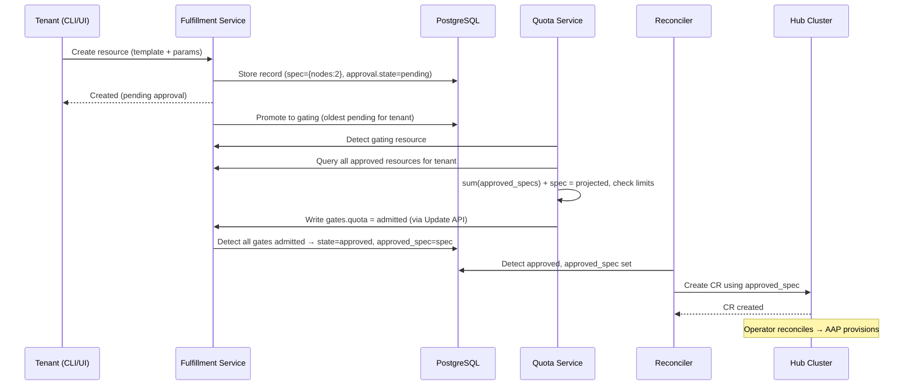

# Quota Management

## Summary

This proposal introduces a quota management system for the Open Sovereign AI Cloud (OSAC) that enforces resource limits on tenant provisioning requests. The system adds a generic, extensible approval workflow to the Fulfillment Service and introduces the OSAC Quota Service as a loosely coupled component. The design follows Kubernetes-like declarative conventions: `spec` represents the user's intent, and `status.approval` tracks the system's admission state including an `approved_spec` that records what has been approved. The Quota Service computes tenant resource usage on demand from Fulfillment Service data.

## Motivation

Service providers need to enforce upper limits on the resources tenants can consume. Without quotas:

- A single tenant can accidentally or intentionally consume the entire infrastructure, starving other tenants
- There is no visibility into resource utilization per tenant
- Service providers cannot plan capacity or allocate resources fairly across organizations
- There is no mechanism for integration with external resource allocation systems (e.g., ColdFront at MOC)

### User Stories

- As a **service provider**, I want to create, modify, and delete resource quotas for tenant organizations, so that I can ensure fair resource distribution.
- As a **service provider**, I want to view quota limits and usage for all tenants, so that I can plan capacity and identify over-utilization.
- As a **tenant**, I want to view my resource quota limits and current utilization, so that I can plan my provisioning requests.
- As a **tenant**, I want to know when and why a request is denied due to quota enforcement, so that I can adjust my request or contact my administrator.
- As a **tenant**, I want to scale my existing clusters within my quota limits, so that I can adapt to changing workload demands.
- As a **platform operator**, I want OSAC to work without quotas when I don't need them, so that I can adopt quota enforcement gradually.

### Goals

- Implement a generic approval workflow in the Fulfillment API that enables quota enforcement in v1 and is extensible to other approval patterns (billing, policy, manual admin) in the future
- Introduce the OSAC Quota Service as a separate, pluggable component that makes approval decisions based on configurable quota limits
- Support create, scale-out/up, scale-in/down, and delete operations in the quota workflow
- Enable integration with external quota sources (e.g., ColdFront) via the Quota Service API
- Ensure backwards compatibility with existing deployments that do not use quotas

### Non-Goals

- User interface components for quota management (will be addressed in a separate proposal)
- Billing or cost accounting integration (the architecture supports it via extensible gates but billing logic is out of scope)
- Capacity planning or predictive quota management
- Per-hub or per-region quota limits (v1 enforces quotas globally per organization across all hubs; sub-dividing quotas by hub, region, or availability zone is deferred)
- **High availability and backup:** The Quota Service is deployed as a single replica with no automated backup, consistent with all other OSAC components (Fulfillment Service, OSAC Operator, Keycloak, etc.) which also run at `replicas: 1` with no backup strategy. The current OSAC platform does not address HA or backup for any component. The Quota Service's PostgreSQL database stores only quota limits (not resource data), so loss is recoverable by re-entering limits from ColdFront or admin records. When a platform-wide HA and backup initiative is undertaken, the Quota Service should be included.
- **Multi-gate coordination semantics:** v1 implements only the quota gate. The extensible gate structure is in place for future gates (billing, policy, manual admin), but the coordination semantics for multiple concurrent gates (reservation, rollback, ordering) are deliberately deferred until a concrete second gate is needed. See Future Work for details.

## Proposal

We propose four changes:

1. **Generic approval workflow in the Fulfillment Service:** The Fulfillment Service API follows Kubernetes-like declarative conventions. `spec` represents the user's intent (always the latest desired state). A new `status.approval` block tracks the system's admission state, including an `approved_spec` (what has been approved and is on the hub) and an extensible `gates` structure for independent approval services. The Fulfillment Service only creates or updates CRs on the hub when `status.approval.state` is `"approved"`.

2. **Gating semaphore for sequential evaluation:** To prevent cross-gate race conditions, only one resource per tenant can be in `"gating"` state at a time. The Fulfillment Service promotes the oldest pending resource to `"gating"`, gate services evaluate it, and on completion the next pending resource is promoted. This ensures that each gate's admission decision is based on accurate, up-to-date resource consumption.

3. **`OSAC_APPROVAL_REQUIRED` configuration flag:** A boolean flag on the Fulfillment Service (default `false`) that controls whether the approval workflow is active. When `false`, resources are immediately approved (`status.approval.approved_spec` is set to match `spec`). When `true`, new resources and scale operations start with `status.approval.state = "pending"` and wait for gate services to evaluate. This ensures backwards compatibility for deployments that don't use quotas, and allows gradual adoption. When this flag changes from `true` to `false` at runtime, the Fulfillment Service auto-approves all currently pending and gating resources to drain the backlog.

4. **OSAC Quota Service:** A standalone service that stores quota limits per tenant. It watches for resources in `"gating"` state, computes projected usage by querying the Fulfillment Service for the tenant's current resource consumption, and writes its decision to the `quota` gate entry. When a tenant's footprint changes (resource deleted, scale-in, quota limit increased), the Quota Service sets all rejected resources for that tenant back to `"pending"` for automatic re-evaluation through the normal gating flow.

### Workflow Description

#### Sequence Diagrams

**Resource creation (happy path):**



#### Resource Creation

The following workflow applies to all resource types: clusters, compute instances (VMs), and host pools.

1. A **tenant** creates a new resource using the Fulfillment API (CLI or UI), specifying a template and parameters.

2. The **Fulfillment Service** creates a resource record in its database with the template-resolved details in `spec` (the user's intent). `status.approval.approved_spec` is empty (nothing approved yet). If `OSAC_APPROVAL_REQUIRED` is `true`, `status.approval.state` is set to `"pending"`. If `false`, `approved_spec` is immediately set to match `spec`, `state` is set to `"approved"`, and processing proceeds (existing behavior). No CR is created on the hub until `state = "approved"`.

3. The **Fulfillment Service** promotes the oldest pending resource for this tenant to `"gating"` state. Only one resource per tenant can be in `"gating"` at a time (semaphore).

4. The **Quota Service** detects the gating resource and evaluates it:
   - Queries the Fulfillment Service for all approved, non-deleted resources for this tenant (across all resource types)
   - Sums the `approved_spec` footprints to get current tenant usage
   - Computes the delta: `spec - approved_spec` of the gating resource (for new resources, `approved_spec` is empty, so delta = full `spec` footprint)
   - Compares `current_usage + delta` against the tenant's quota limits
   - Writes its decision to `status.approval.gates.quota` via the Fulfillment Service Update API: `admitted` or `rejected` with reason

5. The **Fulfillment Service** checks the gate results:
   - **All gates admitted:** Sets `status.approval.state = "approved"` and `status.approval.approved_spec = spec`. The reconciler creates the corresponding CR on the hub cluster. Promotes the next pending resource to gating.
   - **Any gate rejected:** Sets `status.approval.state = "rejected"`. The resource's `spec` (user intent) is preserved. No CR is created. Promotes the next pending resource to gating.

6. The **tenant** can check the status via the CLI (e.g., `fulfillment-cli get clusters`) which shows the approval state for each resource.

#### Re-evaluation of Rejected Resources

When the Quota Service detects a change in a tenant's resource footprint (resource deleted, scale-in completed, quota limit increased), it sets all rejected (non-expired, non-deleted) resources for that tenant back to `"pending"` state. This re-enters them into the normal gating flow:

- The Fulfillment Service promotes the oldest pending resource to `"gating"` (normal semaphore behavior)
- The Quota Service evaluates it using the standard formula
- If it now fits within quota, the Quota Service admits it — the FS transitions to `"approved"`
- If it still doesn't fit, the Quota Service rejects it again
- The next pending resource is then promoted to gating, and so on

This provides declarative retry behavior: the user's intent (in `spec`) is preserved, and the system reconciles toward it when conditions allow. No special re-evaluation logic is needed — the existing gating flow handles everything.

Resources that have been rejected for longer than a configurable TTL (e.g., 24 hours) are transitioned to a terminal `"expired"` state to prevent stale auto-provisioning. Expired resources are not re-evaluated.

#### Scale Operations

Scale operations apply to **clusters** (adding/removing worker nodes) and **host pools** (adding/removing hosts). Compute instances (VMs) have immutable resource specs (`cores`, `memoryGiB`, `bootDisk`) — they cannot be resized after creation. To change a VM's resources, the tenant must delete it and create a new one, which goes through the standard approval workflow.

- **Scale-out** (adding nodes to a cluster or hosts to a host pool): The tenant edits the resource via the Fulfillment API (e.g., changes `spec.node_sets.fc430.size` from 2 to 5). The Fulfillment Service updates `spec` to reflect the user's new intent. `status.approval.approved_spec` retains the current approved state (2 nodes), keeping actual consumption visible. `status.approval.state` is set to `"pending"`, then promoted to `"gating"` when it's the tenant's turn.

  - **On approval:** All gates admit. `approved_spec` is set to match `spec`. The reconciler pushes the updated spec to the hub CR. The Operator scales the cluster.
  - **On rejection:** The user's `spec` (5 nodes) is preserved as their intent. `approved_spec` stays at 2. The cluster keeps running at 2 nodes. If quota later frees up, the re-evaluation trigger automatically retries.

- **Scale-in** (removing nodes or hosts): When the new `spec` is less than or equal to `approved_spec`, no approval is needed — freeing resources is always allowed. The Fulfillment Service updates both `spec` and `approved_spec`, sets `state = "approved"`, pushes the change to the hub CR immediately, and the Operator scales down. The Quota Service detects the footprint change and may trigger re-evaluation of rejected resources for this tenant.

  General rule for spec changes: if `new_spec > approved_spec` → pending (needs gating); if `new_spec ≤ approved_spec` → approved immediately.

#### Resource Deletion

When a resource is deleted, it is soft-deleted in the Fulfillment Service (via `deletion_timestamp`). The Quota Service detects the footprint change and triggers re-evaluation of rejected resources for that tenant (sets them back to `"pending"`). Deleted resources are excluded from all quota computations.

#### Provisioning Failure

If provisioning fails after approval, the resource remains in the Fulfillment Service database with `status.state = FAILED` and `status.approval.state = "approved"`. It continues to count against quota because:
- Failures can be partial (e.g., 3 of 5 nodes allocated before failure)
- Automatically freeing quota on failure could cause over-commitment
- The tenant must explicitly delete the failed resource to free quota (standard cloud platform behavior)

### API Extensions

All resources gain a new `status.approval` block in the Fulfillment Service API. Following Kubernetes-like conventions, `spec` represents the user's intent and `status` contains system-managed state:

```yaml
Cluster:
  spec:                              # User's intent (always the latest desired state)
    template: "ocp_4_17_small"
    node_sets: {fc430: {size: 5}}    # What the user wants
  status:
    state: READY                     # Hub-reported state (Operator writes)
    conditions: [...]                # Hub-reported conditions
    api_url: "https://..."
    approval:                        # Approval block (Fulfillment Service manages)
      state: "gating"               # pending | gating | approved | rejected
      approved_spec:                # What's been approved and is on the hub
        template: "ocp_4_17_small"
        node_sets: {fc430: {size: 2}}
      gates:                        # Extensible gate structure
        quota:
          state: "admitted"
          reason: "Within quota limits"
          timestamp: "2026-03-20T..."
```

**Approval states:**
- `"pending"` — Resource is waiting to be promoted to gating
- `"gating"` — Resource is being evaluated by gate services (only one per tenant at a time)
- `"approved"` — All gates admitted; resource is provisioned or being provisioned
- `"rejected"` — At least one gate rejected; user's `spec` is preserved as intent; may be re-evaluated when conditions change
- `"expired"` — Resource was rejected and has exceeded the configurable TTL; terminal state, will not be re-evaluated

**Key fields:** `status.approval.state` is managed by the Fulfillment Service (gate services do NOT write it directly). `status.approval.approved_spec` is the spec approved and on the hub (same proto type as `spec`; reconciler uses this for hub CR operations, never `spec` directly). `status.approval.gates` is a map where each gate service writes only its own entry (v1: `quota` only). `decision_reason` is a top-level convenience field summarizing the latest decision.

**Pending change detection:** `spec != approved_spec` → pending change; `spec == approved_spec` → fully reconciled. No separate intent field needed.

**Field write permissions:**

| Field | Tenant (public API) | Fulfillment Service | Gate Services (e.g., Quota Service) |
|-------|--------------------|--------------------|-------------------------------------|
| `spec` | Writable (via create/scale requests) | Resolves templates, validates | — |
| `status.approval.state` | Read only | Manages transitions (pending→gating→approved/rejected) | — |
| `status.approval.approved_spec` | Read only | Sets to `spec` on approval | — |
| `status.approval.gates.<name>` | Read only | — | Each gate writes its own entry only |
| `decision_reason` | Read only | Sets from rejecting gate's reason | — |

**Pending resource modification rules:** The Fulfillment Service rejects modification requests (scale, parameter changes) for resources with `status.approval.state` in `"pending"` or `"gating"`. This prevents spec changes while gates are evaluating. However, **deletion of pending/gating resources is allowed**. Gate services must check that a resource has not been deleted before writing their decision.

**Fulfillment Service reconciler logic:**

1. If `approved_spec` is empty → skip entirely (no CR exists on the hub, nothing to sync)
2. If `status.approval.state = "approved"` and `spec != approved_spec` → set `approved_spec = spec`, create/update CR on hub using `approved_spec`, sync status from hub
3. If `approved_spec` is non-empty → sync status from hub (regardless of approval state)

Step 3 covers approved resources (normal operation), rejected scale-outs (cluster keeps running at `approved_spec`), and expired resources with existing CRs. The reconciler reads hub-reported status (state, conditions, api_url) so tenants always see accurate status even for resources with rejected pending changes. No spec changes are pushed to the hub unless step 2 applies.

The reconciler always uses `approved_spec` for hub CR operations, never `spec` directly. Hub selection happens during step 2 (after approval), matching current behavior.

The `approved_spec` write (PostgreSQL) and CR creation/update (Kubernetes API on hub) happen in the same reconciliation pass. These are not transactionally atomic — if the reconciler crashes between them, the next pass retries (idempotent reconciliation). This works consistently regardless of whether a Quota Service is deployed: with `OSAC_APPROVAL_REQUIRED=false`, the Fulfillment Service sets `approved_spec = spec` and `state = "approved"` at creation time, so the reconciler sees step 4 and proceeds immediately.

**Required proto/schema changes by resource type:**

| Resource Type | New Fields | Quota Footprint Source |
|--------------|-----------|----------------------|
| **Clusters** | `status.approval` block | `spec.node_sets` / `approved_spec.node_sets` (already exists). Example footprint: `{clusters: 1, nodes.fc430: 2}` |
| **ComputeInstances** | `status.approval` block | `spec.cores`, `spec.memory_gib`, `spec.gpus` (already exist except `gpus`). Example: `{compute_instances: 1, vcpus: 8, memory_gib: 32}`. VMs use the same approval flow for creation. Scale operations are not applicable (VM specs are immutable after creation). |
| **HostPools** | `status.approval` block | `spec.host_sets` (already exists). Example: `{nodes.h100: 3}` |

**Prerequisite — Fulfillment Service field-level write protection:** The current Fulfillment Service public API does not enforce field-level write restrictions uniformly. The ComputeInstances public server lacks `AddIgnoredFields` for status fields (unlike Clusters and HostPools), meaning a tenant could potentially update `status.approval` directly via the public Update API. Before implementing the approval workflow, the following must be addressed:
1. Add `AddIgnoredFields(statusField)` to the ComputeInstances public server `inMapper` (parity fix)
2. Add `status.approval` block to ignored fields on all public `inMapper` configurations
3. Enforce immutability of `spec.template` and `spec.template_parameters` on Update in private servers

Without these changes, the approval gate is unenforceable — a tenant could bypass quotas by writing `status.approval.state = "approved"` directly.

**Prerequisite — structured GPU field for VMs:** ComputeInstance currently has no structured field for GPU allocation. GPU count is buried in `template_parameters` (unstructured JSON), which cannot be reliably queried or aggregated for quota enforcement. A structured `gpus` field must be added to `ComputeInstanceSpec` before GPU quota enforcement can be implemented. This is consistent with how other VM resource dimensions are handled — `cores`, `memory_gib`, and `boot_disk` are already structured API fields. GPU is central to OSAC's AI workload value proposition and must not be deferred. This does not affect cluster GPU quotas, which are tracked by node resource class (e.g., `nodes.h100`).

**Configuration:**

- **`OSAC_APPROVAL_REQUIRED`** (boolean, default `false`): When `false`, new requests are immediately approved (`approved_spec = spec`, `state = "approved"`) and skip the approval workflow entirely. When `true`, new requests start with `state = "pending"`. **Runtime behavior on config change:** When this flag changes from `true` to `false`, the Fulfillment Service auto-approves all pending and gating resources (sets `approved_spec = spec`, `state = "approved"`). This drains the backlog, ensuring no resources are stuck. This intentionally bypasses gate review — tenants can delete unwanted resources after provisioning.

### Implementation Details/Notes/Constraints

#### Template Metadata Enrichment

**Important caveat:** Template metadata enrichment is only needed for **clusters**. VMs and host pools have their quotable dimensions as explicit API fields (`spec.cores`, `spec.memory_gib`, `spec.gpus` for VMs; `spec.host_sets` for host pools) — the Fulfillment Service sees exact values in the request. No template resolution needed.

For clusters, the resource footprint comes from `default_node_request` in `meta/osac.yaml`. However, **`default_node_request` is a redundant declaration** — the actual node count defaults also exist independently in the Ansible role's code (e.g., `{{ worker_count | default(2) }}` in `install.yaml` and/or `defaults/main.yaml`). These two sources are maintained separately with no enforcement that they agree. If `default_node_request` says 2 nodes but the Ansible role defaults to 3, quotas would be computed against the wrong value. This fragility predates the quota proposal but becomes a correctness concern once quotas rely on this metadata.

**Recommended long-term fix:** Either make `meta/osac.yaml` the single source of truth that Ansible roles also read from, or extract the actual defaults from the Ansible role during the AAP discovery job rather than maintaining a separate declaration. Both options are beyond the scope of this proposal but should be tracked as a follow-up to ensure quota accuracy.

For v1, the Fulfillment Service uses `default_node_request` as the best available source, with the understanding that template authors must keep it consistent with the Ansible defaults. CI validation should be added to catch mismatches.

**Design principle — structured fields for all quotable dimensions:** VMs already have structured API fields for all quotable dimensions (`cores`, `memory_gib`, `boot_disk`, and `gpus` as a prerequisite). Clusters also have a structured field — `nodeRequests` / `node_sets` — but it's optional. When tenants omit it and rely on template defaults or parameter overrides, the Fulfillment Service must resolve the structured values from unstructured template parameters. The `countParameter` enrichment below is a **pragmatic v1 mechanism** for this resolution. The long-term fix is making `osac.yaml` the single source of truth so that resolution is reliable by design.

When **template parameters override node counts** (e.g., a `worker_count` parameter that changes the number of workers), the Fulfillment Service cannot resolve the correct footprint because it doesn't know which parameter maps to which node set. To address this, two **optional fields** are added to the existing `default_node_request` entries in `meta/osac.yaml`:

```yaml
# Existing format (unchanged, still works):
default_node_request:
  - resourceClass: fc430
    numberOfNodes: 2

# With optional enrichment (backwards compatible):
default_node_request:
  - resourceClass: fc430
    numberOfNodes: 2
    countParameter: worker_count    # NEW, optional: which template parameter overrides numberOfNodes
    quotable: true                  # NEW, optional: counted against quota (defaults to true)
  - resourceClass: large
    numberOfNodes: 3
    quotable: false                 # control plane runs as pods on hub, not counted against quota
```

Enrichment is only needed when template parameters override node counts. For fixed node counts, explicit `nodeRequests`, and VMs (where `spec.cores`/`spec.memory_gib` are explicit API fields), no enrichment is required. The enrichment is backwards compatible — existing templates and Ansible playbooks require no changes.

#### Multi-Layer Template Considerations

OSAC templates use a three-layer system:

1. **Base templates** (`osac.templates` collection) — infrastructure-agnostic defaults
2. **CSP-specific overrides** (`osac.massopencloud` collection at MOC) — can add nodes, change resource classes, or modify resource requirements
3. **Execution engine** (`osac-aap`) — runs playbooks that consume templates

Each layer can have a role with the **same name** (e.g., `ocp_4_17_small` exists in both `osac.templates` and `osac.massopencloud`). The CSP version may declare different `default_node_request` entries than the base. The AAP template discovery job must publish the **correct `default_node_request` for each fully-qualified template ID**. When the Fulfillment Service resolves a template, it must use the metadata matching the qualified ID (e.g., `osac.massopencloud.ocp_4_17_small` may require 3 nodes while `osac.templates.ocp_4_17_small` requires 2).

#### Compatibility with the Override Points Revamp (MGMT-23142)

A planned template architecture change (MGMT-23142) replaces template forking with an override points model, where CSPs import vendor playbooks and override specific steps via variables. This introduces a risk: **an override could add resources (e.g., a monitoring node) without updating `default_node_request` in the template's `meta/osac.yaml`**, causing the Quota Service to approve based on an understated footprint.

To maintain the "metadata as authoritative contract" principle, any override that changes the resource footprint must be accompanied by an updated `default_node_request` in the overriding template's `meta/osac.yaml`. CI validation should enforce that the node counts and resource classes declared in `default_node_request` match what the playbook actually provisions. The override points design should account for this constraint.

### OSAC Quota Service

The Quota Service is a standalone Go service with the following responsibilities. Filter expressions below are illustrative pseudo-code — exact syntax will follow the Fulfillment Service's CEL-based filter language.

**Core:**
- **Watch for gating resources:** Periodically query each resource type's List API on the Fulfillment Service — `Clusters.List`, `ComputeInstances.List`, and `HostPools.List` — filtering for `"gating"` approval state (configurable interval, default 5s). The Quota Service must fan out across all three resource types and merge the results client-side. Note: the Fulfillment Service has a streaming Events API (`Events.Watch()`) used by internal reconcilers, but it currently only supports Cluster and ClusterTemplate event payloads. Once the Events API is extended to support ComputeInstance and HostPool events, the Quota Service should migrate to event-driven detection with polling as fallback.
- **Compute projected usage:** For each gating resource, query the Fulfillment Service for all approved, non-deleted resources for the tenant across all resource types. Sum their `approved_spec` footprints to get current usage. Apply the quota computation formula: `current_usage + delta(spec - approved_spec)`.
- **Trigger re-evaluation:** When the Quota Service detects a change in a tenant's footprint (resource deleted, scale-in completed, quota limit increased), it sets all rejected (non-expired, non-deleted) resources for that tenant back to `"pending"` via the Fulfillment Service Update API. The normal gating flow then re-evaluates them.
- **Make gate decisions:** Write to `status.approval.gates.quota` on the Fulfillment Service via the Update API. The Quota Service only writes to its own gate entry — it never writes `status.approval.state` or `approved_spec`.
- **Concurrency control:** Process gating resources serially per tenant with a row lock. Since only one resource per tenant is in `"gating"` state at a time (enforced by the Fulfillment Service semaphore), this primarily prevents duplicate processing.

**Quota Management API:**
- `POST /quotas` — Create quota for a tenant (admin only)
- `GET /quotas` — List quotas (tenant sees own, admin sees all)
- `GET /quotas/{id}` — Get specific quota details
- `PUT /quotas/{id}` — Update quota (admin only)
- `DELETE /quotas/{id}` — Remove quota (admin only)

Quota limits are stored as sets of arbitrary key/value pairs to support new resource types without code changes:

```json
{
  "tenant": "org-mit-physics",
  "limits": {
    "clusters": 3,
    "nodes.h100": 20,
    "nodes.fc430": 10,
    "compute_instances": 15,
    "vcpus": 64,
    "memory_gib": 256
  }
}
```

**What the Quota Service does NOT do:**
- It does NOT write `status.approval.state` or `approved_spec`. The Fulfillment Service manages approval state transitions. Gate services only write to their own gate entries.
- It does NOT modify resource specs. It only writes to `status.approval.gates.quota`.
- It does NOT maintain a usage ledger or footprint cache. Usage is computed on demand from Fulfillment Service data. A future `/v1/usage` aggregate endpoint on the Fulfillment Service could optimize this.

### Data Access Pattern

The Quota Service accesses all data through the **Fulfillment Service public gRPC API**. It never accesses the database directly or the Kubernetes API directly — this ensures proper auth, tenancy filtering, and a stable API contract. The `status.approval` block is part of the public API since tenants need to read their approval state. Hub-internal fields (like `status.hub`) remain in the private API only.

### Security Model

The Quota Service is a privileged component with write access to gate entries on all resources. The security model uses defense in depth:

| Layer | Control |
|-------|---------|
| **Authentication** | Dedicated Keycloak service account for the Quota Service |
| **Authorization** | Narrow `approval-writer` role — can only modify `status.approval.gates` entries. Cannot create, delete, or modify resources or `approved_spec`. Note: the current Fulfillment Service lacks field-level authorization on the Update API — implementing this role requires adding field-level write restrictions to the generic server infrastructure (see prerequisite above). |
| **Quota API auth** | Separate `quota-admin` Keycloak role for ColdFront or admin users who manage quota limits. Tenants have read-only access to their own quotas. |
| **Audit logging** | All approval decisions and quota changes logged with actor, timestamp, and decision rationale |
| **Network policy** | Quota Service network access restricted to the Fulfillment Service API and Keycloak. In the current architecture, this is direct pod-to-pod communication. When the Organizations/Gateway architecture is implemented, the Quota Service will route through the Gateway instead (see Integration with Organizations section). The network policy should be designed to support both models. |
| **Input validation** | Reject impossibly large quota values; alert on changes beyond configurable thresholds |
| **Hub CR protection** | Tenants do not have direct access to the hub cluster — they interact via the Fulfillment API only. RBAC on the hub restricts CR modifications to the Fulfillment Service's service account. |

### Pluggability and Approval Service Independence

A key design requirement is that the Quota Service is **optional and replaceable**. The approval workflow in the Fulfillment Service is generic — it does not assume any specific gate logic. This is achieved through minimal coupling:

**What the Fulfillment Service knows about approval:**
- Resources have a `status.approval` block with `state`, `approved_spec`, and `gates`
- The Fulfillment Service manages state transitions (pending → gating → approved/rejected) and the gating semaphore
- The reconciler only uses `approved_spec` for hub CR operations
- The Fulfillment Service does NOT know about quotas, limits, or resource accounting

**What a gate service must do (minimum contract):** Watch for resources in `"gating"` state and write to its own gate entry (`admitted` or `rejected` with reason). No state management, no coordination with other gates. This makes alternative gate services (manual admin approval, billing, policy engines) trivially simple to implement — or set `OSAC_APPROVAL_REQUIRED=false` for no approval at all.

### Integration with Organizations and Gateway Architecture

The [Organizations & Authentication proposal](../organizations/README.md) (merged) introduces a Gateway-based architecture that changes how services access the Fulfillment API:

- All API requests flow through a **Gateway (Envoy Proxy)** where **Kuadrant/Authorino** validates tokens and enforces authorization at the infrastructure layer
- The Fulfillment Service receives verified identity via HTTP headers (`X-Remote-User`, `X-Organization`, `X-Roles`), not by parsing tokens directly
- **Network policies** enforce that the Fulfillment Service is only reachable through the Gateway

**Quota v1 is independently shippable** before the Organizations proposal is implemented. Quotas do not depend on the Organization entity — they use the existing tenancy model (`tenants[]` array on resource records, populated from Keycloak groups). When Organizations is implemented, the tenant scope naturally maps to Organization without requiring quota code changes. In the current architecture (pre-Organizations), the Quota Service communicates directly with the Fulfillment Service using a Keycloak service account. When the Organizations/Gateway architecture is implemented, the Quota Service will migrate to route through the Gateway, with its service account in the **System Keycloak realm** and an AuthPolicy configured to allow the `approval-writer` role.

**Field-level authorization:** Authorino provides endpoint-level RBAC, but the quota feature requires finer-grained control (only `approval-writer` can modify gate entries). This must be enforced in the Fulfillment Service itself, using the `X-Roles` header injected by Authorino to check permissions on field-level writes.

**Cross-tenant read access:** The Quota Service must list resources across all tenants to detect gating resources and compute per-tenant usage. The `approval-writer` role (or the System realm identity) must be granted cross-tenant read access in the Fulfillment Service.

**Quota scope:** The Organizations proposal introduces a two-level hierarchy: Organizations contain Projects. In this proposal, "tenant" maps to **Organization**. Quotas are enforced globally per organization across all hubs. Per-Project quotas and per-hub quota sub-divisions are potential future extensions.

### Quota Data Sources

The Quota Service API is generic — quota limits can be populated by any source:

- **Direct API calls** from an administrator using the CLI or custom scripts
- **ColdFront** (at MOC) pushing allocations via a dedicated ColdFront OSAC plugin
- **Billing systems** in commercial deployments
- **Manual administrative processes** where an admin sets quota limits after reviewing a request form

#### MOC Integration with ColdFront

At the Mass Open Cloud, [ColdFront](https://coldfront.readthedocs.io/en/stable/) serves as the authoritative source for resource allocations across multiple platforms (OpenShift, OpenStack, SLURM, and OSAC). ColdFront uses a push model:

1. Administrators create/manage resource allocations in ColdFront
2. The ColdFront OSAC plugin calls the Quota Service API to set quota limits
3. The Quota Service stores limits and uses them for gate decisions

ColdFront already has plugins for [OpenShift](https://github.com/nerc-project/coldfront-plugin-cloud) (creates ResourceQuota objects) and OpenStack (calls quota API). The OSAC plugin follows the same pattern. ColdFront authenticates to the Quota Service using a Keycloak service account with the `quota-admin` role.

### Quota Reduction Policy

When an administrator reduces a tenant's quota below their current usage:

- **Existing resources are NOT affected.** Running clusters and VMs continue to operate normally.
- **New requests are rejected** until the tenant's usage drops below the new limit (through voluntary deletion or scale-down).
- The quota limit change triggers re-evaluation of rejected resources — but since usage is now even further above the new limit, they remain rejected.
- The principle: **resource changes drive quota accounting, not the other way around.** Quotas are a gate for new consumption, not a tool for reclaiming existing resources.

### Observability

The Quota Service should expose the following Prometheus metrics:

| Metric | Type | Labels | Description |
|--------|------|--------|-------------|
| `quota_gate_decisions_total` | Counter | `result` (admitted/rejected), `resource_type`, `tenant` | Total gate decisions made |
| `quota_pending_resources` | Gauge | `tenant`, `resource_type` | Number of resources in pending or gating state |
| `quota_utilization_ratio` | Gauge | `tenant`, `resource_type` | Current usage / limit ratio (0.0-1.0+) |
| `quota_decision_duration_seconds` | Histogram | `result` | Time to evaluate and write a gate decision |
| `quota_reevaluation_triggers_total` | Counter | `tenant` | Number of re-evaluation triggers (footprint changes) |

Key alerts:

| Alert | Condition | Severity |
|-------|-----------|----------|
| `QuotaServiceGatingBacklog` | Resources in gating state not processed for >5 minutes | Warning |
| `QuotaServiceDown` | Quota Service pod not ready | Critical |
| `QuotaTenantNearLimit` | `quota_utilization_ratio` > 0.9 for any resource type | Info |

All gate decisions should be logged with: tenant ID, resource ID, resource type, decision (admitted/rejected), reason, current usage, quota limit, and timestamp.

### Risks and Mitigations

| Risk | Impact | Mitigation |
|------|--------|------------|
| **Race conditions** | Two concurrent requests from the same tenant could both pass the quota check | The gating semaphore ensures only one resource per tenant is evaluated at a time. Per-tenant row locking in the Quota Service provides additional protection within the single-replica deployment. |
| **Polling overhead** | Quota Service queries all approved resources per tenant on each evaluation | At OSAC's current scale (5-20 resources per tenant), this is trivial (~5ms). A future `/v1/usage` aggregate endpoint on the Fulfillment Service could optimize this. |
| **Quota Service unavailability** | All requests blocked in "pending" state | Single replica with standard Kubernetes pod restart (consistent with all OSAC components). Admin can set `OSAC_APPROVAL_REQUIRED=false` to unblock. |
| **Quota Service compromise** | Attacker could admit any request | Narrow `approval-writer` role limited to gate entries only. Cannot write `approved_spec` or `state`. |
| **Fulfillment Service dependency** | Gate decisions require the Fulfillment Service | Acceptable — if the Fulfillment Service is down, no new requests are arriving anyway. |
| **Partial provisioning failure** | Resources may be partially allocated when provisioning fails | Failed resources count against quota until explicitly deleted. Standard cloud platform behavior. |
| **Gating timeout** | A slow or crashed gate service blocks the tenant's gating queue | Configurable timeout on gating state — if a resource has been gating for too long, the Fulfillment Service can revert it to pending or reject it. |

### Drawbacks

- **Added latency:** Every provisioning request waits for the gating cycle (polling interval + gate evaluation). At default settings, this adds up to 5-10 seconds. Acceptable given that provisioning takes minutes. Events API migration would reduce this.
- **New component to operate:** The Quota Service is a new Go service with its own database that must be deployed, monitored, and maintained.
- **Sequential gating:** The per-tenant semaphore means concurrent requests from the same tenant are processed sequentially. At OSAC's current scale (few requests per tenant per day), this is not a concern.
- **Five approval states:** The state machine (pending/gating/approved/rejected/expired) is more complex than a simple approved/rejected model, but each state serves a distinct purpose and the transitions are well-defined.

## Alternatives (Not Implemented)

- **Gateway-level quota enforcement (Authorino):** Rejected — quota decisions require template resolution and cross-resource usage aggregation, which is business logic beyond Authorino's policy model.
- **Separate usage ledger (original proposal, PR #8):** Rejected — the ledger duplicates data already in the Fulfillment Service database, introducing drift, missed-event bugs, and reconciliation complexity. On-demand computation is simpler and always accurate.

## Future Work

The following capabilities are enabled by this proposal's architecture but are explicitly out of scope for v1:

- **Multi-gate coordination semantics:** When a second gate is added (e.g., billing), the system needs to define: whether each gate's admission counts as a resource reservation, how to handle rollback when a later gate rejects after an earlier gate admitted, and whether gates are ordered. The gating semaphore ensures only one resource is evaluated at a time, which simplifies this, but the reservation semantics need explicit design. See the discussion in PR #28 for analysis.
- **Manual admin approval:** An admin reviews gating resources via CLI/UI and writes a gate entry. The gate structure supports this today — implementing it requires only a CLI command and a `manual-admin` gate key.
- **Per-tenant usage aggregate endpoint:** A server-side `/v1/usage?tenant=X` endpoint on the Fulfillment Service that computes tenant resource consumption in a single SQL query, avoiding the need for the Quota Service to query all individual resources. Could be backed by a Fulfillment Service-internal footprint cache.
- **Usage analytics and reporting:** For historical usage data (trends, capacity planning, billing), a separate analytics component could subscribe to approval events.
- **Resolution API for billing and UI preview:** A `/v1/resolve` endpoint that returns the resource footprint for a template + parameters combination before submission.
- **UI for quota management:** Tenant-facing quota dashboard showing limits, current usage, and rejection history.
- **Scale-out rejection UX refinement:** v1 preserves the user's intent in `spec` while `approved_spec` tracks the running state. Future work could add notifications when a rejected resource is auto-retried and approved.
- **Decision history:** The `decision_reason` field holds only the latest decision. A future `decision_history[]` array would provide a full audit trail per resource.
- **Events API migration:** When the Fulfillment Service Events API is extended beyond Cluster/ClusterTemplate payloads, the Quota Service should migrate from polling to event-driven detection.

## Open Questions

1. **Template metadata reliability for clusters:** The `default_node_request` metadata in `meta/osac.yaml` is a redundant declaration — the actual node count defaults also exist independently in the Ansible role's code. These are maintained separately with no enforcement that they agree. For v1, quota accuracy depends on template authors keeping them consistent. A longer-term solution (making `osac.yaml` the single source of truth, or extracting defaults from the Ansible role during discovery) should be discussed with the template maintainers.

2. **Abstraction layers above raw quotas:** MOC/NERC uses "units of computing" (ColdFront's allocation multiplier) and "Service Units" (billing currency tracking resource × time). Neither is the Quota Service's concern — it operates on raw resource counts. ColdFront's plugin translates its internal abstractions into raw OSAC quota limits before calling the Quota Service API. SU-based billing would be a separate system. Confirm with MOC stakeholders that this separation of concerns is correct.

## Test Plan

### Unit Tests
- Fulfillment Service: template resolution logic, spec computation, parameter override handling, approval state transitions, gating semaphore logic
- Quota Service: gate decision logic, re-evaluation trigger, quota limit evaluation

### Integration Tests (KIND cluster)
- End-to-end approval workflow: create request → pending → gating → approved → provisioning starts
- Rejection workflow: create request → pending → gating → rejected → user sees reason
- Scale-out approval: scale cluster → pending → gating → approved → cluster scaled
- Scale-out rejection: scale → rejected → user intent preserved → quota frees up → auto-retry → approved
- `OSAC_APPROVAL_REQUIRED=false` mode: resources skip approval entirely
- Gating semaphore: two pending resources for same tenant, only one gating at a time
- Delete while pending/gating: tenant deletes a resource, gate service skips it
- Scale-in: no approval required, spec and approved_spec updated, may trigger re-evaluation of rejected resources
- Failed provisioning: resource with `status.state = FAILED` continues to count against quota until deleted
- Quota reduction: admin reduces quota below current usage, existing resources unaffected, new requests rejected
- Re-evaluation trigger: delete a resource → rejected resources for same tenant set to pending → re-gated → approved if quota fits
- TTL expiration: rejected resource exceeds TTL → transitions to expired → not re-evaluated
- Authorization bypass prevention: tenant attempt to write `status.approval` via public API is rejected
- Cross-tenant isolation: Quota Service identity can read across tenants, regular service accounts cannot
- Config change drain: switching `OSAC_APPROVAL_REQUIRED` from true to false auto-approves all pending/gating resources
- (Post-Organizations) Gateway role enforcement: `X-Roles` header correctly enforced

### E2E Tests (hypershift1)
- Full provisioning with quota enforcement on real bare metal
- ColdFront integration (when plugin is available)
- Migration testing: upgrade existing deployment, verify existing resources get `status.approval.state = "approved"`

## Graduation Criteria

### Dev Preview
- Prerequisites met: field-level write protection on public API, cross-tenant read access for Quota Service identity, ComputeInstance inMapper parity fix
- Approval workflow functional (pending/gating/approved/rejected)
- Quota Service makes correct gate decisions
- CLI shows approval status and rejection reasons
- `OSAC_APPROVAL_REQUIRED` flag works correctly

### Tech Preview
- Scale operation approval support
- Re-evaluation trigger for rejected resources
- ColdFront OSAC plugin available
- Migration tested on hypershift1 with existing tenants
- Deployment and recovery procedures documented and tested

### GA
- E2E test coverage for all quota scenarios
- Performance validated at target scale
- Observability (metrics, alerts) in place
- Documentation complete

## Upgrade / Downgrade Strategy

### Upgrade (existing deployment without quotas)

1. **Database migration:** Add `status.approval` block to all resource types. Set `status.approval.state = "approved"` and `status.approval.approved_spec = spec` for all existing resources (READY, PROGRESSING, and FAILED). No changes needed to existing `spec` fields.
2. **Fulfillment Service upgrade:** Deploy new version with `OSAC_APPROVAL_REQUIRED=false` (default). Existing behavior is preserved — all new resources are immediately approved.
3. **Deploy Quota Service:** Install and configure the Quota Service. Set initial quota limits.
4. **Enable approval:** Set `OSAC_APPROVAL_REQUIRED=true`. New requests now go through the gating workflow.

### Downgrade

1. Set `OSAC_APPROVAL_REQUIRED=false`. All new requests are immediately approved.
2. The Quota Service can remain deployed but has no effect. Or it can be removed.
3. `status.approval` block remains on resources but is ignored.

## Version Skew Strategy

The Quota Service and Fulfillment Service communicate via gRPC API. Version skew is managed through API versioning:
- The `status.approval` block is additive — older clients that don't know about it will simply not see it.
- The Quota Service depends on the Fulfillment Service API. If the Fulfillment Service is upgraded first, the Quota Service continues to work. If the Quota Service is upgraded first, it may try to use features not yet available — deployment ordering should be documented.

## CLI User Experience Examples

**Listing resources with approval status:**

```
$ fulfillment-cli get clusters
ID                                    STATE        APPROVAL    REASON
b211a004-ab87-436d-86c7-7519ce75c77b  READY        approved
a409e02f-3564-4584-8dbd-f4b10a45e23c  -            gating
c7f3e891-2a4b-4c5d-9e6f-8a1b2c3d4e5f  -            rejected    Would exceed quota for nodes.fc430 by 2 (8/10)
```

**Viewing a pending scale operation:**

```
$ fulfillment-cli get cluster b211a004 -o yaml
spec:
  node_sets:
    fc430: {host_class: fc430, size: 5}    # user's intent
status:
  state: READY
  approval:
    state: gating
    approved_spec:
      node_sets:
        fc430: {host_class: fc430, size: 2}    # what's on the hub
    gates:
      quota: {state: pending}
```

**Viewing quota limits and usage:**

```
$ fulfillment-cli get quota
RESOURCE TYPE       USAGE    LIMIT    UTILIZATION
clusters            2        5        40%
nodes.fc430         6        10       60%
nodes.h100          0        20       0%
compute_instances   3        15       20%
vcpus               24       64       38%
```

## Support Procedures

- **Quota Service is down:** All resources stay in `"pending"` state (no promotion to gating). Existing approved resources are unaffected. To unblock: restart the Quota Service, or set `OSAC_APPROVAL_REQUIRED=false` to drain the backlog.
- **Quota computation seems wrong:** The Quota Service computes usage on demand from Fulfillment Service data. Verify by listing all approved resources for the tenant and summing their `approved_spec` footprints manually.
- **Incorrect quota limits:** Admin can view and modify quotas via the Quota Service API. Changes take effect on the next gate evaluation and may trigger re-evaluation of rejected resources.
- **Tenant over quota:** Tenant sees rejection reason in CLI output. They must delete existing resources to free quota, or request a quota increase from their administrator. Rejected resources are automatically retried when quota frees up.
- **Debugging gate decisions:** Check Quota Service logs for gate decisions with tenant ID, resource ID, current usage, and quota limits.

## Infrastructure Needed

- Container image build pipeline for the Quota Service
- PostgreSQL database for Quota Service (quota limits only — small footprint)
- Keycloak configuration for `approval-writer` and `quota-admin` service accounts/roles
- CI pipeline for quota-related integration tests
