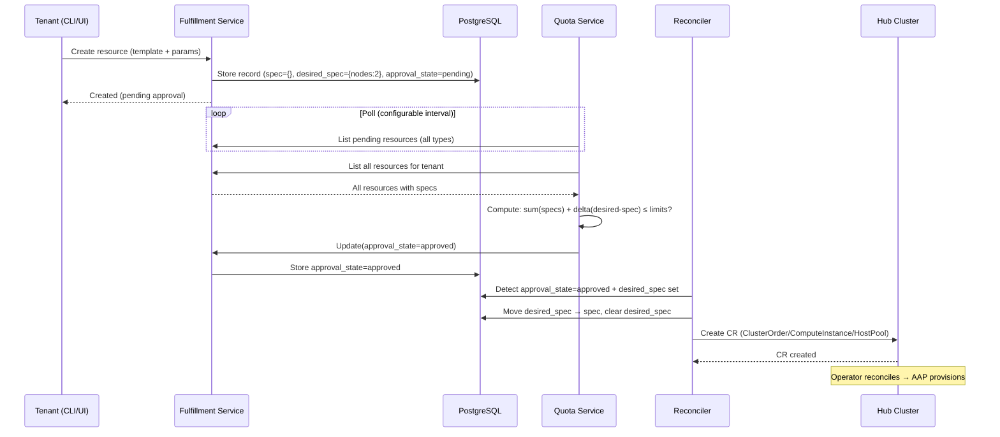
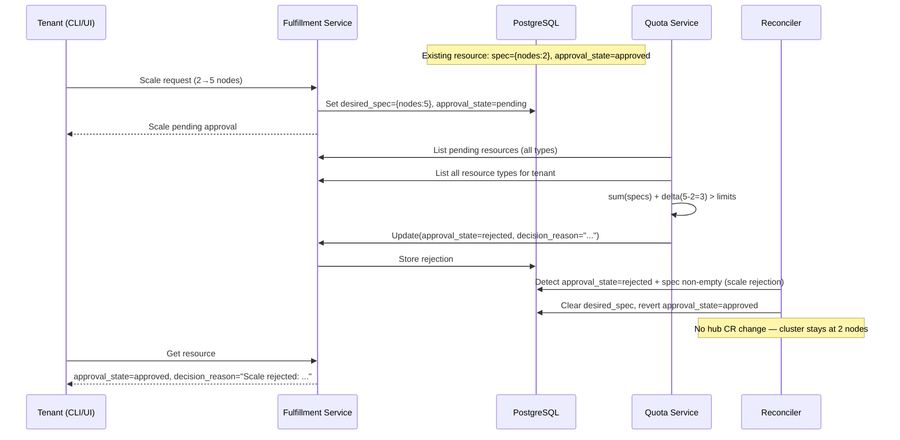

# Quota Management

## Summary

This proposal introduces a quota management system for the Open Sovereign AI Cloud (OSAC) that enforces resource limits on tenant provisioning requests. The system adds a generic approval workflow to the Fulfillment Service and introduces the OSAC Quota Service as a loosely coupled component. The design avoids maintaining a separate usage ledger by querying the Fulfillment Service as the single source of truth for resource consumption, and leverages resolve-at-creation to store resource footprints directly on resource records in the Fulfillment Service database.

## Motivation

Service providers need to enforce upper limits on the resources tenants can consume. Without quotas:

- A single tenant can accidentally or intentionally consume the entire infrastructure, starving other tenants
- There is no visibility into resource utilization per tenant
- Service providers cannot plan capacity or allocate resources fairly across organizations
- There is no mechanism for integration with external resource allocation systems (e.g., ColdFront at MOC)

### User Stories

- As a **service provider**, I want to create, modify, and delete resource quotas for tenant organizations, so that I can ensure fair resource distribution.
- As a **service provider**, I want to view quota limits and usage for all tenants, so that I can plan capacity and identify over-utilization.
- As a **tenant**, I want to view my resource quota limits and current utilization, so that I can plan my provisioning requests.
- As a **tenant**, I want to know when and why a request is denied due to quota enforcement, so that I can adjust my request or contact my administrator.
- As a **tenant**, I want to scale my existing clusters within my quota limits, so that I can adapt to changing workload demands.
- As a **platform operator**, I want OSAC to work without quotas when I don't need them, so that I can adopt quota enforcement gradually.

### Goals

- Implement a generic approval workflow in the Fulfillment API that enables quota enforcement in v1 and is extensible to other approval patterns in the future
- Introduce the OSAC Quota Service as a separate, pluggable component that makes approval decisions based on configurable quota limits
- Support create, scale-out/up, scale-in/down, and delete operations in the quota workflow
- Enable integration with external quota sources (e.g., ColdFront) via the Quota Service API
- Ensure backwards compatibility with existing deployments that do not use quotas

### Non-Goals

- User interface components for quota management (will be addressed in a separate proposal)
- Billing or cost accounting integration (the architecture supports it but it is out of scope)
- Capacity planning or predictive quota management
- Per-hub or per-region quota limits (v1 enforces quotas globally per organization across all hubs; sub-dividing quotas by hub, region, or availability zone is deferred)
- **High availability and backup:** The Quota Service is deployed as a single replica with no automated backup, consistent with all other OSAC components (Fulfillment Service, OSAC Operator, Keycloak, etc.) which also run at `replicas: 1` with no backup strategy. The current OSAC platform does not address HA or backup for any component. The Quota Service's PostgreSQL database stores only quota limits (not resource data), so loss is recoverable by re-entering limits from ColdFront or admin records. When a platform-wide HA and backup initiative is undertaken, the Quota Service should be included.
- **Manual admin approval workflows:** The generic `approval_state` field is designed to be extensible to non-quota approval patterns (e.g., an admin manually reviewing and approving large requests). However, v1 only implements automated quota-based approval. Manual approval and multi-party approval (where both a quota check AND an admin must approve) would require extending the single `approval_state` field into a multi-step approval model (e.g., an `approved_by` list). This is deferred to a future proposal.

## Proposal

We propose four changes:

1. **Generic approval workflow in the Fulfillment Service:** All resources gain an `approval_state` field (pending/approved/rejected), a `decision_reason` field, and a `desired_spec` field for pending changes. The Fulfillment Service only creates or updates CRs on the hub for approved resources.

2. **`desired_spec` for pending changes:** Both new resource creation and scale operations store the requested state in `desired_spec`, while `spec` retains the current approved state (empty for new resources, current footprint for scale). On approval, `desired_spec` is moved to `spec`. The Quota Service computes usage directly from `spec` and `desired_spec` fields — no additional resource tracking fields are needed.

3. **`OSAC_APPROVAL_REQUIRED` configuration flag:** A boolean flag on the Fulfillment Service (default `false`) that controls whether the approval workflow is active. When `false`, the Fulfillment Service moves `desired_spec` to `spec` immediately and sets `approval_state = "approved"` — no approval service is consulted and existing behavior is preserved. When `true`, new resources and scale operations start with `approval_state = "pending"` and wait for an approval service to approve or reject them. This ensures backwards compatibility for deployments that don't use quotas, and allows gradual adoption.

4. **OSAC Quota Service:** A standalone service that stores quota limits per tenant, periodically polls for pending resources via the Fulfillment Service API, computes current tenant usage from spec data, and approves or rejects resources based on quota limits.

### Workflow Description

#### Sequence Diagrams

**Resource creation (happy path):**



**Scale-out rejection:**



#### Resource Creation

The following workflow applies to all resource types: clusters, compute instances (VMs), and host pools.

1. A **tenant** creates a new resource using the Fulfillment API (CLI or UI), specifying a template and parameters.

2. The **Fulfillment Service** creates a resource record in its database. The template-resolved resource details are stored in `desired_spec` (e.g., `desired_spec.node_sets` for clusters, `desired_spec.cores`/`desired_spec.memory_gib` for VMs), while `spec` remains empty (nothing is provisioned yet). If `OSAC_APPROVAL_REQUIRED` is `true`, `approval_state` is set to `"pending"`. If `false`, `desired_spec` is immediately moved to `spec`, `approval_state` is set to `"approved"`, and processing proceeds (existing behavior). No CR is created on the hub until `approval_state = "approved"`.

3. The **Quota Service** detects the new pending resource during its next polling cycle.

4. The **Quota Service** computes the projected total for the tenant:
   - Queries all non-deleted resources for the tenant (regardless of `approval_state`)
   - Sums the resource footprint from each resource's `spec` (for new pending resources, `spec` is empty so they contribute zero)
   - Adds the delta of the resource being evaluated: `desired_spec - spec` (for new resources `spec` is empty, so the delta equals the full `desired_spec` footprint; for scale-out, the delta is the additional consumption)
   - Compares the projected total against the tenant's quota limits

5. The **Quota Service** makes a decision:
   - **If within limits:** Sets `approval_state = "approved"`. The Fulfillment Service detects the approval, moves `desired_spec → spec`, clears `desired_spec`, and creates the corresponding CR (ClusterOrder, ComputeInstance, or HostPool) on the hub cluster. The Operator sees the new CR and begins provisioning.
   - **If exceeds limits:** Sets `approval_state = "rejected"` and `decision_reason` to a human-readable explanation (e.g., "Would exceed your quota for nodes.fc430 by 2 nodes. Current usage: 8/10"). The resource record remains in the database — no CR is created. The tenant can delete the rejected resource and create a new one with a smaller footprint. Automatic retry or in-place modification of rejected resources is not supported in v1.

6. The **tenant** can check the status via the CLI (e.g., `fulfillment-cli get clusters`, `fulfillment-cli get computeinstances`) which shows `approval_state` for each resource.

#### Scale Operations

Scale operations apply to **clusters** (adding/removing worker nodes) and **host pools** (adding/removing hosts). Compute instances (VMs) have immutable resource specs (`cores`, `memoryGiB`, `bootDisk`) — they cannot be resized after creation. To change a VM's resources, the tenant must delete it and create a new one, which goes through the standard approval workflow.

- **Scale-out** (adding nodes to a cluster or hosts to a host pool): The tenant requests a scale change via the Fulfillment API (e.g., `node_sets.fc430.size` from 2 to 5). The Fulfillment Service stores the desired change in `desired_spec` but **does NOT update `spec` or push the change to the hub CR**. The resource's `spec` retains the current state (2 nodes), keeping its current consumption visible in quota calculations. `approval_state` is set to `"pending"`.

  - **On approval:** The Quota Service sets `approval_state = "approved"`. The Fulfillment Service moves `desired_spec → spec` and the reconciler pushes the updated spec to the hub CR. The Operator sees the CR change and scales the cluster.
  - **On denial:** The Quota Service sets `approval_state = "rejected"` and `decision_reason` with the denial explanation. The Fulfillment Service detects the rejection, and because `spec` is non-empty (indicating this is a scale operation on an existing resource, not a new resource creation), it clears `desired_spec` and reverts `approval_state` to `"approved"`. The spec is unchanged, the hub CR is unchanged, the cluster stays at its current size. This is distinct from a new resource rejection (where `spec` is empty and `approval_state` stays `"rejected"`). Note: after revert, the resource shows `approval_state = "approved"` with a `decision_reason` explaining the scale rejection. This is a known v1 trade-off — clients must check `decision_reason` to detect a recent scale denial on an otherwise approved resource. The future `decision_history[]` evolution (see Future Work) will provide a cleaner model for this.

  This follows the same gating principle as resource creation: the hub CR change is the provisioning trigger, so the Fulfillment Service must hold it until approval.

- **Scale-in** (removing nodes or hosts): No approval needed — freeing resources is always allowed. The Fulfillment Service updates `spec` directly, pushes the change to the hub CR immediately, and the Operator scales down.

#### Resource Deletion

When a resource is deleted, it is soft-deleted in the Fulfillment Service (via `deletion_timestamp`). The Quota Service does not need to track deletions — it must filter its queries to exclude soft-deleted resources, ensuring they do not count against quota.

#### Provisioning Failure

If provisioning fails after approval, the resource remains in the Fulfillment Service database with `status.state = FAILED` and `approval_state = "approved"`. It continues to count against quota because:
- Failures can be partial (e.g., 3 of 5 nodes allocated before failure)
- Automatically freeing quota on failure could cause over-commitment
- The tenant must explicitly delete the failed resource to free quota (standard cloud platform behavior)

### API Extensions

All resources that can be requested via the Fulfillment API gain the following metadata fields:

- **`approval_state`** (string): The approval state of the resource. Values:
  - `"approved"` — Resource has been approved for provisioning (default when `OSAC_APPROVAL_REQUIRED=false`)
  - `"pending"` — Resource is awaiting approval (default when `OSAC_APPROVAL_REQUIRED=true`)
  - `"rejected"` — Resource has been rejected; will not be provisioned
- **`decision_reason`** (string, optional): Human-readable explanation of the latest approval decision. Set when a resource is rejected (e.g., "Would exceed your quota for nodes.fc430 by 2 nodes") or when a scale operation is denied (e.g., "Scale from 2 to 5 nodes denied: would exceed quota"). Cleared on successful approval. In a future version, this may evolve into a `decision_history[]` array providing a full audit trail of all approval decisions.
- **`desired_spec`** (same proto type as `spec`, optional): The full desired resource spec awaiting approval. Uses the same protobuf message type as `spec` for each resource (e.g., `ClusterSpec`, `ComputeInstanceSpec`, `HostPoolSpec`) and is always fully populated. For new resources, contains the complete template-resolved spec (template, parameters, node_sets, etc.). For scale-out, contains a copy of the current spec with the modified fields updated (e.g., `node_sets` changed, all other fields — including immutable fields like `template` — copied from current spec). In both cases, `spec` retains the current approved state (empty for new resources, current footprint for scale). On approval, `desired_spec` replaces `spec` entirely and is cleared. On rejection, `desired_spec` is cleared with no other changes.

**No additional resource tracking fields are needed.** The Quota Service computes resource footprints directly from existing spec fields (`spec.node_sets` for clusters, `spec.cores`/`spec.memory_gib` for VMs, `spec.host_sets` for host pools). This avoids introducing quota-specific fields into the shared data model, keeping the Fulfillment Service schema generic and enabling simple pluggability of different approval services.

**Field write permissions:**

| Field | Tenant (public API) | Fulfillment Service | Quota Service (`approval-writer` role) |
|-------|--------------------|--------------------|---------------------------------------|
| `approval_state` | Read only | Writes `"pending"` on create/scale | Writes `"approved"` or `"rejected"` |
| `decision_reason` | Read only | Clears `desired_spec` and reverts `approval_state` on scale rejection | Writes reason on rejection, clears on approval |
| `desired_spec` | Read only | Computes from tenant's create/scale request. Moves to `spec` on approval. Clears on rejection. | — |
| `spec` | Read only | Receives `desired_spec` on approval | — |
| Create/scale requests | Submits via API (template + parameters, or edit commands) | Validates and routes to `desired_spec` | — |

Tenants do not write `spec` or `desired_spec` directly. They submit create requests (template + parameters) or scale requests (edit commands) through the Fulfillment API. The Fulfillment Service validates the request, resolves template metadata, computes the resulting spec, and stores it in `desired_spec`. This ensures all changes go through validation and the approval workflow.

`desired_spec` is readable by tenants so they can see what they requested while waiting for approval (e.g., `fulfillment-cli get cluster <id>` shows both current `spec` and pending `desired_spec`).

**Pending resource modification rules:** The Fulfillment Service rejects modification requests (scale, parameter changes) for resources with `approval_state = "pending"`. This prevents competing `desired_spec` values and ensures the Quota Service always evaluates a stable request. However, **deletion of pending resources is allowed** — if a tenant creates a resource they no longer want while it's awaiting approval, they can delete it immediately. The Quota Service must check that a pending resource has not been deleted before processing it. Deleted pending resources are soft-deleted as usual and will not appear in subsequent queries.

**Fulfillment Service reconciler logic:** The existing per-resource reconcilers (cluster, compute instance, host pool) are modified to check `approval_state` as the universal gate before any hub operation. The reconciler logic for each resource type adds these checks at the beginning of its reconciliation pass:

1. If `approval_state = "pending"` → skip this resource entirely (no CR creation, no spec updates)
2. If `approval_state = "rejected"` and `spec` is empty → skip (rejected new resource, nothing to do)
3. If `approval_state = "rejected"` and `spec` is non-empty → clear `desired_spec`, revert `approval_state` to `"approved"` (scale rejection cleanup). The `decision_reason` is preserved so the tenant can see why the scale was rejected. Continue normal reconciliation with the unchanged spec.
4. If `approval_state = "approved"` and `desired_spec` is set → move `desired_spec` to `spec`, clear `desired_spec`, then continue to create/update the CR on the hub with the new spec
5. If `approval_state = "approved"` and `desired_spec` is not set → normal reconciliation (existing behavior)

The `desired_spec → spec` move (PostgreSQL write) and CR creation/update (Kubernetes API write on the hub) happen in the same reconciliation pass. These are not transactionally atomic — if the reconciler crashes between the DB write and the CR creation, the next reconciliation pass will detect that `spec` is set but no CR exists, and retry the CR creation. The design relies on idempotent reconciliation, not transactional atomicity. Hub selection also happens during this pass (after approval), matching the current behavior — no change to hub selection logic is needed. This works consistently regardless of whether a Quota Service is deployed: with `OSAC_APPROVAL_REQUIRED=false`, the Fulfillment Service sets `approval_state = "approved"` and moves `desired_spec → spec` at creation time, so the reconciler sees step 5 and proceeds immediately.

**Quota computation formula:**

```
projected_total = sum(spec footprint of ALL non-deleted resources for the tenant)
                + delta(desired_spec - spec) of the resource being evaluated

For new resources: spec is empty (contributes 0 to the sum), delta = desired_spec - {} = full footprint
For scale-out:     spec has current footprint (counted in sum), delta = desired_spec - spec = additional nodes
```

`desired_spec` is used consistently for both new resources and scale operations. `spec` always represents what has been approved and is on the hub (empty for new, current for scale).

This single formula works uniformly for creation and scale operations without branching logic.

**Required proto/schema changes by resource type:**

| Resource Type | New Fields | Quota Footprint Source |
|--------------|-----------|----------------------|
| **Clusters** | `approval_state`, `decision_reason`, `desired_spec` | `spec.node_sets` (already exists). Example footprint: `{clusters: 1, nodes.fc430: 2}` |
| **ComputeInstances** | `approval_state`, `decision_reason`, `desired_spec` | `spec.cores`, `spec.memory_gib`, `spec.boot_disk.size_gib` (already exist). Illustrative example: `{compute_instances: 1, vcpus: 8, memory_gib: 32}` — exact VM quota keys are an open question (see Open Questions). VMs use the same `desired_spec` → `spec` flow as other resources for creation. Scale operations are not applicable (VM specs are immutable after creation). |
| **HostPools** | `approval_state`, `decision_reason`, `desired_spec` | `spec.host_sets` (already exists). Example: `{nodes.h100: 3}` |

**Prerequisite — Fulfillment Service field-level write protection:** The current Fulfillment Service public API does not enforce field-level write restrictions uniformly. The ComputeInstances public server lacks `AddIgnoredFields` for status fields (unlike Clusters and HostPools), meaning a tenant could potentially update `approval_state` directly via the public Update API. Before implementing the approval workflow, the following must be addressed:
1. Add `AddIgnoredFields(statusField)` to the ComputeInstances public server `inMapper` (parity fix)
2. Add `approval_state`, `decision_reason`, and `desired_spec` to ignored fields on all public `inMapper` configurations
3. Enforce immutability of `spec.template` and `spec.template_parameters` on Update in private servers

Without these changes, the approval gate is unenforceable — a tenant could bypass quotas by writing `approval_state = "approved"` directly.

**Known gap — GPU tracking for VMs:** ComputeInstance currently has no structured field for GPU allocation. If a VM template provisions GPU passthrough, the GPU count is buried in `template_parameters` (unstructured JSON). For GPU quota enforcement on VMs, either a `gpus` field must be added to `ComputeInstanceSpec`, or GPU information must be extractable from the template metadata during resolution. This does not affect cluster GPU quotas, which are tracked by node resource class (e.g., `nodes.h100`).

**Configuration:**

- **`OSAC_APPROVAL_REQUIRED`** (boolean, default `false`): When `false`, new requests default to `approval_state = "approved"` and skip the approval workflow entirely. This preserves backwards compatibility for deployments without a Quota Service. When `true`, new requests default to `"pending"`. **Runtime behavior on config change:** When this flag changes from `true` to `false`, the Fulfillment Service auto-approves all currently pending resources (moves `desired_spec → spec`, sets `approval_state = "approved"`). This drains the pending backlog, ensuring no resources are stuck in an unrecoverable pending state. Note that this intentionally bypasses quota review for queued resources — some may represent stale requests the tenant no longer wants. This trade-off is acceptable as an emergency operational escape hatch; tenants can delete unwanted resources after they are provisioned.

### Implementation Details/Notes/Constraints

#### Template Metadata Enrichment

The Fulfillment Service resolves resource footprints from template metadata when populating `desired_spec`. In most cases, this works with the existing `default_node_request` format — the Fulfillment Service reads `resourceClass` and `numberOfNodes` directly. However, when **template parameters override node counts** (e.g., a `worker_count` parameter that changes the number of workers), the Fulfillment Service cannot resolve the correct footprint because it doesn't know which parameter maps to which node set.

To address this, two **optional fields** are added to the existing `default_node_request` entries in `meta/osac.yaml`:

```yaml
# Existing format (unchanged, still works):
default_node_request:
  - resourceClass: fc430
    numberOfNodes: 2

# With optional enrichment (backwards compatible):
default_node_request:
  - resourceClass: fc430
    numberOfNodes: 2
    countParameter: worker_count    # NEW, optional: which template parameter overrides numberOfNodes
    quotable: true                  # NEW, optional: counted against quota (defaults to true)
  - resourceClass: large
    numberOfNodes: 3
    quotable: false                 # control plane runs as pods on hub, not counted against quota
```

**When enrichment is needed:**

| Scenario | Enrichment needed? | Why |
|----------|-------------------|-----|
| Template has fixed node count, no parameter overrides | No | `numberOfNodes` is already explicit in `default_node_request` |
| Tenant specifies `nodeRequests` explicitly in their request | No | Fulfillment Service uses the explicit values |
| Template parameter overrides node count (e.g., `worker_count=5`) | **Yes** | `countParameter` tells the Fulfillment Service which parameter maps to which node set |
| VM templates (`spec.cores`, `spec.memory_gib`) | No | Resource specs are always explicit, not derived from templates |

**Impact on existing components:**

| Component | Change required |
|-----------|----------------|
| Template `meta/osac.yaml` files | Add optional `countParameter` and `quotable` fields where applicable |
| AAP template discovery job | Read two additional optional fields during discovery |
| Fulfillment Service template proto | Add two optional fields to the existing node request message |
| Ansible playbooks (`install.yaml`, `delete.yaml`) | **No change** — playbooks don't read `osac.yaml` at runtime |
| Existing templates without enrichment | **No change** — continue to work; node counts resolved from `numberOfNodes` defaults |

#### Multi-Layer Template Considerations

OSAC templates use a three-layer system:

1. **Base templates** (`osac.templates` collection) — infrastructure-agnostic defaults
2. **CSP-specific overrides** (`osac.massopencloud` collection at MOC) — can add nodes, change resource classes, or modify resource requirements
3. **Execution engine** (`osac-aap`) — runs playbooks that consume templates

Each layer can have a role with the **same name** (e.g., `ocp_4_17_small` exists in both `osac.templates` and `osac.massopencloud`). The CSP version may declare different `default_node_request` entries than the base. The AAP template discovery job must publish the **correct `default_node_request` for each fully-qualified template ID**. When the Fulfillment Service resolves a template, it must use the metadata matching the qualified ID (e.g., `osac.massopencloud.ocp_4_17_small` may require 3 nodes while `osac.templates.ocp_4_17_small` requires 2).

#### Compatibility with the Override Points Revamp (MGMT-23142)

A planned template architecture change (MGMT-23142) replaces template forking with an override points model, where CSPs import vendor playbooks and override specific steps via variables. This introduces a risk: **an override could add resources (e.g., a monitoring node) without updating `default_node_request` in the template's `meta/osac.yaml`**, causing the Quota Service to approve based on an understated footprint.

To maintain the "metadata as authoritative contract" principle, any override that changes the resource footprint must be accompanied by an updated `default_node_request` in the overriding template's `meta/osac.yaml`. CI validation should enforce that the node counts and resource classes declared in `default_node_request` match what the playbook actually provisions. The override points design should account for this constraint.

### OSAC Quota Service

The Quota Service is a standalone Go service with the following responsibilities. Filter expressions below are illustrative pseudo-code — exact syntax will follow the Fulfillment Service's CEL-based filter language.

**Core:**
- **Poll for pending resources:** Periodically query each resource type's List API on the Fulfillment Service — `Clusters.List`, `ComputeInstances.List`, and `HostPools.List` — filtering for pending approval state (configurable interval, default 5s). The Quota Service must fan out across all three resource types and merge the results client-side. This catches both new resource creation and scale-out operations, since both set `approval_state` to `"pending"`. Note: the Fulfillment Service has a streaming Events API (`Events.Watch()`) used by internal reconcilers, but it currently only supports Cluster and ClusterTemplate event payloads. Once the Events API is extended to support ComputeInstance and HostPool events, the Quota Service should migrate to event-driven detection with polling as fallback, reducing approval latency from seconds to milliseconds.
- **Compute projected usage:** For each pending resource, query all non-deleted resources for the tenant across all resource types (`Clusters.List`, `ComputeInstances.List`, `HostPools.List`, filtering by tenant and excluding soft-deleted resources) and apply the quota computation formula (see API Extensions section). The Quota Service aggregates footprints from all three resource types client-side. This single formula works uniformly for both creation and scale-out.
- **Make approval decisions:** Compare the projected total against quota limits. Set `approval_state` to `"approved"` or `"rejected"` via the Fulfillment Service Update API. The Quota Service always writes `"rejected"` for denials — both for new resources and scale operations. The Fulfillment Service handles the lifecycle distinction: for rejected new resources (`spec` empty), the rejection is final; for rejected scale operations (`spec` non-empty), the Fulfillment Service clears `desired_spec` and reverts `approval_state` to `"approved"`. The Quota Service must parse each resource type's spec to extract the footprint (e.g., `spec.node_sets` for clusters, `spec.cores` for VMs).
- **Concurrency control:** Process pending resources serially per tenant with a row lock. This prevents two concurrent requests from both passing the quota check. Processing order among multiple pending resources from the same tenant is not guaranteed — it depends on polling order. At OSAC's current scale, concurrent pending resources from the same tenant are rare (polling interval is seconds, approval is milliseconds).

**Quota Management API:**
- `POST /quotas` — Create quota for a tenant (admin only)
- `GET /quotas` — List quotas (tenant sees own, admin sees all)
- `GET /quotas/{id}` — Get specific quota details
- `PUT /quotas/{id}` — Update quota (admin only)
- `DELETE /quotas/{id}` — Remove quota (admin only)

Quota limits are stored as sets of arbitrary key/value pairs to support new resource types without code changes. The following is an illustrative example — exact VM quota keys are an open question (see Open Questions):

```json
{
  "tenant": "org-mit-physics",
  "limits": {
    "clusters": 3,
    "nodes.h100": 20,
    "nodes.fc430": 10,
    "compute_instances": 15,
    "vcpus": 64,
    "memory_gib": 256
  }
}
```

**What the Quota Service does NOT do:**
- It does NOT maintain a usage ledger or resource tracking fields. Resource consumption is computed on demand from spec data already in the Fulfillment Service.
- It does NOT need reconciliation. Every approval decision is computed from the current state of resources.
- It does NOT modify resource specs. It only writes `approval_state` and `decision_reason`.

### Data Access Pattern

The Quota Service accesses all data through the **Fulfillment Service gRPC API**. It never accesses the database directly or the Kubernetes API directly. The following diagram uses pseudo-code for filter expressions — exact filter syntax will follow the Fulfillment Service's CEL-based filter language:

```
Quota Service                             Fulfillment Service (gRPC)
─────────────                             ────────────────────────────

Poll (per resource type):
  Clusters.List(filter=                ──▶ Returns pending clusters
    "approval_state = 'pending'")
  ComputeInstances.List(filter=        ──▶ Returns pending VMs
    "approval_state = 'pending'")
  HostPools.List(filter=               ──▶ Returns pending host pools
    "approval_state = 'pending'")

Usage query (per resource type, filtered by tenant, excluding deleted):
  Clusters.List(...)                   ──▶ Returns all tenant clusters
  ComputeInstances.List(...)           ──▶ Returns all tenant VMs
  HostPools.List(...)                  ──▶ Returns all tenant host pools

  → Quota Service aggregates footprints client-side

Clusters.Update / ComputeInstances.Update / HostPools.Update
  (approval_state="approved"           ──▶ Stores in PostgreSQL
   or "rejected")
```

The new fields (`approval_state`, `decision_reason`, `desired_spec`) are added to the **public** Fulfillment API proto definitions (in `fulfillment-api/` repo), since tenants need to read them. The Quota Service uses the public API for both reads and writes — the `approval-writer` role provides the necessary write permissions. Hub-internal fields (like `status.hub`) remain in the private API only.

Rationale for API-only access:
- **Direct DB access** would bypass authentication, tenancy isolation, and couple the Quota Service to the database schema
- **Direct K8s API access** would miss tenancy data, approval_state, and template parameters that only exist in PostgreSQL
- **gRPC API** provides proper auth, tenancy filtering, a stable contract, and combines data from both stores (PostgreSQL + Kubernetes CRs)

**Per-tenant aggregation:** The Fulfillment Service database stores individual resource records, not per-tenant usage summaries. In v1, the Quota Service performs aggregation client-side: it calls the List API with a tenant filter, receives all resource records, and computes resource footprints from each resource's spec fields locally. At OSAC's current scale (tenants with 5-20 resources), this is efficient — the gRPC response is small and the computation is trivial.

For deployments with larger tenant resource counts, a future server-side aggregation endpoint should be added to the Fulfillment Service (illustrative — exact VM quota keys are an open question):

```
GET /v1/usage?tenant=org-A
→ {clusters: 3, nodes.h100: 12, nodes.fc430: 6, compute_instances: 4, vcpus: 32}
```

This would compute the aggregation in a single SQL query, returning only the summary instead of individual records.

### Security Model

The Quota Service is a privileged component with write access to `approval_state` on all resources. The security model uses defense in depth:

| Layer | Control |
|-------|---------|
| **Authentication** | Dedicated Keycloak service account for the Quota Service |
| **Authorization** | Narrow `approval-writer` role — can only modify `approval_state` and `decision_reason` fields. Cannot create, delete, or modify resources. Note: the current Fulfillment Service lacks field-level authorization on the Update API — implementing this role requires adding field-level write restrictions to the generic server infrastructure (see prerequisite above). |
| **Quota API auth** | Separate `quota-admin` Keycloak role for ColdFront or admin users who manage quota limits. Tenants have read-only access to their own quotas. |
| **Audit logging** | All approval decisions and quota changes logged with actor, timestamp, and decision rationale |
| **Network policy** | Quota Service network access restricted to the Fulfillment Service API and Keycloak. In the current architecture, this is direct pod-to-pod communication. When the Organizations/Gateway architecture is implemented, the Quota Service will route through the Gateway instead (see Integration with Organizations section). The network policy should be designed to support both models — initially allowing direct access, with a migration path to Gateway-only access. |
| **Input validation** | Reject impossibly large quota values; alert on changes beyond configurable thresholds |
| **Hub CR protection** | Tenants do not have direct access to the hub cluster — they interact via the Fulfillment API only. RBAC on the hub restricts CR modifications to the Fulfillment Service's service account. This prevents tenants from bypassing quota enforcement by editing CRs directly with `oc` or `kubectl`. Platform admins with hub access can intentionally bypass quotas — this is expected and acceptable. A Kubernetes validating admission webhook could be added in the future to enforce that only the Fulfillment Service's service account can modify quota-relevant CRs. |

### Pluggability and Approval Service Independence

A key design requirement is that the Quota Service is **optional and replaceable**. The approval workflow in the Fulfillment Service is generic — it does not assume any specific approval logic. This is achieved through minimal coupling:

**What the Fulfillment Service knows about approval:**
- Resources have an `approval_state` field (pending/approved/rejected)
- Resources may have a `desired_spec` field (pending scale change)
- The reconciler only acts on `approval_state = "approved"` resources
- The Fulfillment Service does NOT know about quotas, limits, or resource accounting

**What an approval service must do (minimum contract):**
- Read resources with `approval_state = "pending"` from the Fulfillment Service API
- Set `approval_state` to `"approved"` or `"rejected"` (with `decision_reason`)
- That's it — no resource tracking fields to manage, no merge logic, no state to maintain

This makes alternative approval services trivially simple to implement:

| Approval Service | Implementation |
|-----------------|----------------|
| **No approval** | Set `OSAC_APPROVAL_REQUIRED=false`. No service needed. |
| **Quota Service** (this proposal) | Compute usage from specs, compare against limits, approve/reject. |
| **Manual admin approval** (future) | Admin reviews pending resources via CLI/UI, sets `approval_state`. One API call per decision. |
| **Policy-based approval** (future) | Evaluate pending resources against organizational policies (e.g., "no GPU clusters without manager approval"). |
| **Billing-based approval** (future) | Check tenant's payment status before approving resource creation. |

Because the Quota Service computes resource footprints from existing spec fields rather than maintaining its own tracking fields on the resource, replacing or removing the Quota Service leaves the Fulfillment Service schema unchanged.

### Integration with Organizations and Gateway Architecture

The [Organizations & Authentication proposal](../organizations/README.md) (merged) introduces a Gateway-based architecture that changes how services access the Fulfillment API:

- All API requests flow through a **Gateway (Envoy Proxy)** where **Kuadrant/Authorino** validates tokens and enforces authorization at the infrastructure layer
- The Fulfillment Service receives verified identity via HTTP headers (`X-Remote-User`, `X-Organization`, `X-Roles`), not by parsing tokens directly
- **Network policies** enforce that the Fulfillment Service is only reachable through the Gateway

**Quota v1 is independently shippable** before the Organizations proposal is implemented. Quotas do not depend on the Organization entity — they use the existing tenancy model (`tenants[]` array on resource records, populated from Keycloak groups). When Organizations is implemented, the tenant scope naturally maps to Organization without requiring quota code changes. In the current architecture (pre-Organizations), the Quota Service communicates directly with the Fulfillment Service using a Keycloak service account. When the Organizations/Gateway architecture is implemented, the Quota Service will migrate to route through the Gateway, with its service account in the **System Keycloak realm** and an AuthPolicy configured to allow the `approval-writer` role. The Quota Service's API contract (read pending resources, write approval decisions) is the same in both models — only the network path and auth mechanism change.

**Field-level authorization:** Authorino provides endpoint-level RBAC, but the quota feature requires finer-grained control (only `approval-writer` can modify `approval_state`). This must be enforced in the Fulfillment Service itself, using the `X-Roles` header injected by Authorino to check permissions on field-level writes.

**Cross-tenant read access:** The Quota Service must list pending resources across all tenants and compute per-tenant usage. The current Fulfillment Service tenancy logic scopes service accounts to their own tenant's resources. The `approval-writer` role (or the System realm identity) must be granted cross-tenant read access in the Fulfillment Service — this is an auth infrastructure change that should be noted as a prerequisite alongside the field-level write protection.

**Quota scope:** The Organizations proposal introduces a two-level hierarchy: Organizations contain Projects. In this proposal, "tenant" maps to **Organization**. Quotas are enforced globally per organization across all hubs — the Quota Service sums resource consumption from the central Fulfillment Service database regardless of which hub resources are deployed on. Per-Project quotas and per-hub quota sub-divisions are potential future extensions — the quota limits data model (arbitrary key/value pairs) supports adding project or hub dimensions without architectural changes.

### Quota Data Sources

The Quota Service API is generic — quota limits can be populated by any source:

- **Direct API calls** from an administrator using the CLI or custom scripts
- **ColdFront** (at MOC) pushing allocations via a dedicated ColdFront OSAC plugin
- **Billing systems** in commercial deployments
- **Manual administrative processes** where an admin sets quota limits after reviewing a request form

#### MOC Integration with ColdFront

At the Mass Open Cloud, [ColdFront](https://coldfront.readthedocs.io/en/stable/) serves as the authoritative source for resource allocations across multiple platforms (OpenShift, OpenStack, SLURM, and OSAC). ColdFront uses a push model:

1. Administrators create/manage resource allocations in ColdFront
2. The ColdFront OSAC plugin calls the Quota Service API to set quota limits
3. The Quota Service stores limits and uses them for approval decisions

ColdFront already has plugins for [OpenShift](https://github.com/nerc-project/coldfront-plugin-cloud) (creates ResourceQuota objects) and OpenStack (calls quota API). The OSAC plugin follows the same pattern. ColdFront authenticates to the Quota Service using a Keycloak service account with the `quota-admin` role.

### Quota Reduction Policy

When an administrator reduces a tenant's quota below their current usage:

- **Existing resources are NOT affected.** Running clusters and VMs continue to operate normally.
- **New requests are denied** until the tenant's usage drops below the new limit (through voluntary deletion or scale-down).
- The principle: **resource changes drive quota accounting, not the other way around.** Quotas are a gate for new consumption, not a tool for reclaiming existing resources.

### Observability

The Quota Service should expose the following Prometheus metrics:

| Metric | Type | Labels | Description |
|--------|------|--------|-------------|
| `quota_approval_decisions_total` | Counter | `result` (approved/rejected), `resource_type`, `tenant` | Total approval decisions made |
| `quota_pending_resources` | Gauge | `tenant`, `resource_type` | Number of resources currently awaiting approval |
| `quota_utilization_ratio` | Gauge | `tenant`, `resource_type` | Current usage / limit ratio (0.0-1.0+) |
| `quota_decision_duration_seconds` | Histogram | `result` | Time to evaluate and write an approval decision |

Key alerts:

| Alert | Condition | Severity |
|-------|-----------|----------|
| `QuotaServicePendingBacklog` | Pending resources not processed for >5 minutes | Warning |
| `QuotaServiceDown` | Quota Service pod not ready | Critical |
| `QuotaTenantNearLimit` | `quota_utilization_ratio` > 0.9 for any resource type | Info |

All approval decisions should be logged with: tenant ID, resource ID, resource type, decision (approved/rejected), reason, current usage, quota limit, and timestamp.

### Risks and Mitigations

| Risk | Impact | Mitigation |
|------|--------|------------|
| **Race conditions** | Two concurrent requests from the same tenant could both pass the quota check before either is recorded | Per-tenant row-level locking in the Quota Service database serializes approval decisions for each tenant under the single-replica deployment model. This ensures only one pending resource per tenant is evaluated at a time, preventing concurrent approvals from exceeding quota. Note: this is serialized processing, not transactional atomicity across the Fulfillment Service reads and writes. If HA with multiple replicas is added in the future, the strategy must evolve to leader election or distributed locking. |
| **Quota Service unavailability** | All requests blocked in "pending" state | Single replica with standard Kubernetes pod restart (consistent with all other OSAC components). Pending resources are safe — no over-commitment during downtime. Health monitoring and alerts ensure quick detection. If prolonged outage, admin can temporarily set `OSAC_APPROVAL_REQUIRED=false`. HA (leader election with multiple replicas) can be added in the future if needed, but is not justified at current scale. |
| **Quota Service compromise** | Attacker could approve/deny any request | Narrow `approval-writer` Keycloak role, network policies, audit logging. The Quota Service cannot create or delete resources — it can only change approval status. |
| **Fulfillment Service dependency** | Every approval decision requires the Fulfillment Service to be available | Acceptable because the Quota Service already depends on it for reading pending requests and writing approval status. If the Fulfillment Service is down, no new requests are arriving anyway. |
| **Partial provisioning failure** | Resources may be partially allocated when provisioning fails | Failed resources count against quota until explicitly deleted. This is correct behavior and standard across cloud platforms. |

### Drawbacks

- **Added latency:** Every provisioning request now waits for the Quota Service to make a decision (up to the polling interval, default 5s). Acceptable given that provisioning takes minutes. Migrating to the Events API in the future would reduce this to near-instant.
- **New component to operate:** The Quota Service is a new Go service with its own database (for quota limits) that must be deployed, monitored, and maintained. However, it is simpler than the original proposal's design because it does not maintain a usage ledger.
- **Fulfillment Service coupling:** The no-ledger design makes the Quota Service fully dependent on the Fulfillment Service for usage data. This is acceptable at current scale but may need revisiting if the Fulfillment Service becomes a bottleneck.

## Alternatives (Not Implemented)

### Alternative 1: Quota Enforcement at the Gateway (Authorino)

We considered enforcing quotas at the API Gateway layer (Authorino/Kuadrant), returning a 4XX error immediately when a request would exceed quota. This was rejected because:
- Authorino sees HTTP requests (method, path, token) but not the resolved resource footprint. Computing "will this request exceed quota?" requires template resolution, parameter processing, and querying current tenant usage — business logic that doesn't belong in a policy engine.
- Quota decisions require dynamic computation (sum specs across multiple resource types, compare against limits), which is beyond Authorino's declarative policy model.
- The async approval model (pending → approved/rejected) provides a richer UX: requests are recorded for audit, tenants can view rejected requests with reasons, and the same mechanism supports non-quota approval patterns (manual review, billing gates, policy checks).
- The same reasoning applies to billing enforcement ("no more credits") — these require business context that the Gateway layer doesn't have.

Authorino's role is endpoint-level RBAC and token validation. Quota enforcement is business logic that belongs in a dedicated service.

### Alternative 2: Built-in Quota Support in the Fulfillment Service (no separate service)

We considered implementing quota enforcement directly in the Fulfillment Service. This was rejected because:
- It would bind the Fulfillment Service to specific quota management requirements
- Different deployments need different quota logic and integration with different external systems
- The generic approval workflow pattern has value beyond quotas (see Future Work)

### Alternative 3: Separate Usage Ledger (Original Proposal)

The original proposal maintained a persistent usage ledger in the Quota Service, recording every approval and watching for deletions. This was rejected because:
- The ledger is a cache of data already in the Fulfillment Service database
- Caches introduce drift, missed-event bugs, and require reconciliation
- At OSAC's current scale, on-demand queries are trivially fast
- Eliminating the ledger removes an entire class of consistency problems

### Alternative 4: Resource Tracking Fields on Resource Records

We considered adding `approved_resources` and `pending_resources` fields to each resource record, where the Quota Service would track approved footprints and pending deltas explicitly. This was rejected because:
- These fields are primarily used by the Quota Service, making the Fulfillment Service schema dependent on quota-specific concerns
- Any alternative approval service (e.g., manual admin approval) would need to implement the same merge/clear logic for these fields, reducing pluggability
- The same information can be computed from existing spec data (`spec.node_sets`, `spec.cores`, etc.) without additional fields
- The `desired_spec` approach achieves the same gating effect with fewer fields and less coupling

### Alternative 5: Independent Resolution Service

We considered extracting template resolution into a standalone service usable by Quota Service, billing, and UI. This was deferred because:
- Spec-based computation in the Quota Service is simpler and sufficient for v1
- A Resolution API endpoint can be added to the Fulfillment Service later for billing/UI preview without rearchitecting
- The template metadata is already stored in the Fulfillment Service database

## Future Work

The following capabilities are enabled by this proposal's architecture but are explicitly out of scope for v1:

- **Manual admin approval:** An admin reviews pending requests and manually approves or denies them via the CLI or UI. The `approval_state` field supports this today for single-approver scenarios. For workflows requiring both automated quota approval AND manual admin approval, the approval model would need to evolve from a single `approval_state` field to a multi-step approval pattern (e.g., an `approved_by` list tracking which approvers have signed off).
- **Usage analytics and reporting:** The current design computes usage on demand from spec data. For historical usage data (trend analysis, capacity planning, billing), a persistent usage tracking component could be added alongside the Quota Service without changing the core approval workflow.
- **Resolution API for billing and UI preview:** A `/v1/resolve` endpoint on the Fulfillment Service that returns the resource footprint for a template + parameters combination, allowing UIs to show "this request will consume X resources" before submission, and billing systems to price requests.
- **UI for quota management:** Tenant-facing quota dashboard showing limits, current usage, and denial history. Admin-facing UI for setting and managing quotas across tenants.
- **Scale-out rejection UX refinement:** v1 communicates scale denials via `decision_reason` on an otherwise approved resource. Future work could explore richer notification mechanisms (CLI blocking, events, or a dedicated denial state) to make scale rejections more visible to tenants.
- **Decision history:** The `decision_reason` field currently holds only the latest decision. In a future version, this could evolve into a `decision_history[]` array where each entry records the action (create/scale), result (approved/rejected), reason, and timestamp. This would provide a full audit trail per resource — useful for debugging ("why was my scale denied 3 days ago?"), compliance reporting, and tenant self-service ("show me all denial events for my organization").

## Open Questions

1. **VM quota granularity:** What quota keys should be used for VMs? Options include `compute_instances` (count), `vcpus`, `memory_gib`, `gpus`. The Fulfillment Service already stores `spec.cores` and `spec.memory_gib` as structured fields, so any combination is feasible.

2. **Late-binding resource classes:** Current templates specify resource classes explicitly (e.g., `resourceClass: fc430`). If future templates support generic resource requests (e.g., "5 GPU nodes" without specifying h100 vs a100), resolve-at-creation may not have enough information. This is not a problem today but should be monitored.

3. **Abstraction layers above raw quotas:** MOC/NERC uses two abstraction layers above raw resource counts: "units of computing" (ColdFront's allocation multiplier that generates per-resource-type quotas) and "Service Units" (a billing currency that tracks resource × time usage). Neither of these is the Quota Service's concern — the Quota Service operates on raw resource counts (`nodes.h100: 20`) and doesn't need to understand multipliers, exchange rates, or time-based billing. ColdFront's plugin translates its internal abstractions into raw OSAC quota limits before calling the Quota Service API. SU-based billing would be a separate system that reads resource usage data, not a Quota Service feature. Confirm with MOC stakeholders (@hpdempsey) that this separation of concerns is correct and no quota-level SU support is needed.


## Test Plan

### Unit Tests
- Fulfillment Service: template resolution logic, spec computation, parameter override handling, `desired_spec` lifecycle
- Quota Service: approval decision logic, concurrent request handling, quota limit evaluation

### Integration Tests (KIND cluster)
- End-to-end approval workflow: create request → pending → Quota Service approves → provisioning starts
- Denial workflow: create request → pending → Quota Service denies → tenant sees reason
- Scale-out approval: scale cluster → pending → approved/rejected
- `OSAC_APPROVAL_REQUIRED=false` mode: requests skip approval entirely
- Concurrent request handling: two requests from same tenant, only one should be approved if quota is tight
- Delete while pending: tenant deletes a pending resource, Quota Service skips it
- Scale-in: no approval required, spec updated and CR pushed immediately
- Failed provisioning: resource with `status.state = FAILED` continues to count against quota until deleted
- Quota reduction: admin reduces quota below current usage, existing resources unaffected, new requests rejected
- Authorization bypass prevention: tenant attempt to write `approval_state` or `desired_spec` via public API is rejected
- Cross-tenant isolation: Quota Service identity can read across tenants, regular service accounts cannot
- Config change drain: switching `OSAC_APPROVAL_REQUIRED` from true to false auto-approves all pending resources
- (Post-Organizations) Gateway role enforcement: `X-Roles` header is correctly enforced for field-level write permissions in the Fulfillment Service

### E2E Tests (hypershift1)
- Full provisioning with quota enforcement on real bare metal
- ColdFront integration (when plugin is available)
- Migration testing: upgrade existing deployment, verify existing resources get `approval_state = "approved"`

## Graduation Criteria

### Dev Preview
- Prerequisites met: field-level write protection on public API, cross-tenant read access for Quota Service identity, ComputeInstance inMapper parity fix
- Approval workflow functional (pending/approved/rejected)
- Quota Service makes correct approval decisions
- CLI shows approval status and rejection reasons
- `OSAC_APPROVAL_REQUIRED` flag works correctly

### Tech Preview
- Scale operation approval support
- ColdFront OSAC plugin available
- Migration tested on hypershift1 with existing tenants
- Deployment and recovery procedures documented and tested

### GA
- E2E test coverage for all quota scenarios
- Performance validated at target scale
- Observability (metrics, alerts) in place
- Documentation complete

## Upgrade / Downgrade Strategy

### Upgrade (existing deployment without quotas)

1. **Database migration:** Add `approval_state`, `decision_reason`, and `desired_spec` fields to all resource types. Set `approval_state = "approved"` for all existing resources (READY, PROGRESSING, and FAILED). `desired_spec` is left empty (no pending changes for existing resources). No changes needed to existing resource specs — the Quota Service reads existing spec fields for usage computation.
2. **Fulfillment Service upgrade:** Deploy new version with `OSAC_APPROVAL_REQUIRED=false` (default). Existing behavior is preserved — all new requests are auto-approved.
3. **Deploy Quota Service:** Install and configure the Quota Service. Set initial quota limits.
4. **Enable approval:** Set `OSAC_APPROVAL_REQUIRED=true`. New requests now go through the Quota Service.

### Downgrade

1. Set `OSAC_APPROVAL_REQUIRED=false`. All new requests are auto-approved.
2. The Quota Service can remain deployed but has no effect. Or it can be removed.
3. `approval_state`, `decision_reason`, and `desired_spec` fields remain on resources but are ignored.

## Version Skew Strategy

The Quota Service and Fulfillment Service communicate via gRPC API. Version skew is managed through API versioning:
- The `approval_state` and `decision_reason` fields are additive — older clients that don't know about them will simply not see them. The `desired_spec` field is also additive and only present while a resource is pending approval (for both new resource creation and scale operations).
- The Quota Service depends on the Fulfillment Service API. If the Fulfillment Service is upgraded first, the Quota Service continues to work. If the Quota Service is upgraded first, it may try to use features not yet available — deployment ordering should be documented.

## CLI User Experience Examples

**Listing resources with approval status:**

```
$ fulfillment-cli get clusters
ID                                    STATE        APPROVAL    REASON
b211a004-ab87-436d-86c7-7519ce75c77b  READY        approved
a409e02f-3564-4584-8dbd-f4b10a45e23c  -            pending
c7f3e891-2a4b-4c5d-9e6f-8a1b2c3d4e5f  -            rejected    Would exceed quota for nodes.fc430 by 2 (8/10)
```

**Viewing a pending scale operation:**

```
$ fulfillment-cli get cluster b211a004 -o yaml
spec:
  node_sets:
    fc430: {host_class: fc430, size: 2}    # current (on hub)
desired_spec:
  node_sets:
    fc430: {host_class: fc430, size: 5}    # awaiting approval
approval_state: pending
status:
  state: READY
```

**Viewing quota limits and usage** (illustrative — exact VM quota keys are an open question):

```
$ fulfillment-cli get quota
RESOURCE TYPE       USAGE    LIMIT    UTILIZATION
clusters            2        5        40%
nodes.fc430         6        10       60%
nodes.h100          0        20       0%
compute_instances   3        15       20%
vcpus               24       64       38%
```

## Support Procedures

- **Quota Service is down:** All requests remain in `"pending"` state. No provisioning occurs but existing resources are unaffected. To unblock: restart the Quota Service, or set `OSAC_APPROVAL_REQUIRED=false` temporarily. When the flag changes from `true` to `false`, the Fulfillment Service must auto-approve all currently pending resources (move `desired_spec → spec`, set `approval_state = "approved"`) to drain the pending backlog. This is a one-time operation triggered by the config change.
- **Incorrect quota limits:** Admin can view and modify quotas via the Quota Service API. Changes take effect on the next approval decision.
- **Tenant over quota:** Tenant sees denial reason in CLI output (`fulfillment-cli get clusters`). They must delete existing resources to free quota, or request a quota increase from their administrator.
- **Debugging approval decisions:** Check Quota Service logs for approval/denial decisions with tenant ID, request ID, current usage, and quota limits.

## Infrastructure Needed

- Container image build pipeline for the Quota Service
- PostgreSQL database for Quota Service (quota limits storage only — small footprint)
- Keycloak configuration for `approval-writer` and `quota-admin` service accounts/roles
- CI pipeline for quota-related integration tests
