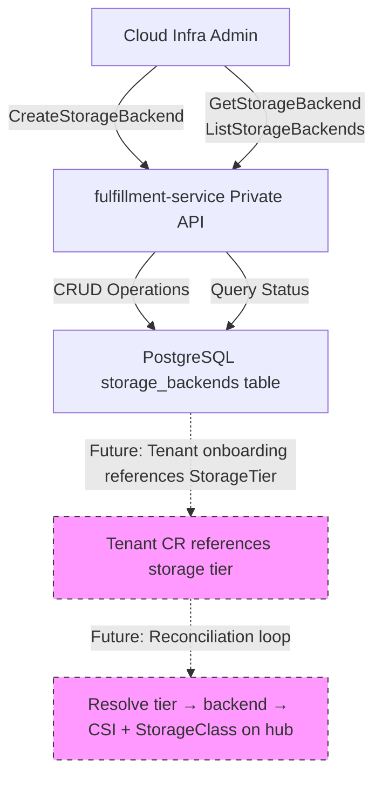

| Field       | Value   |
|-------------|---------|
| Author(s)   | Roy Golan rgolan@redhat.com |
| Status      | Draft |
| Jira        | https://redhat.atlassian.net/browse/OSAC-1111 |
| Date        | 2026-06-04 |


# StorageBackend API — Design Document

## Proposal

This enhancement adds a StorageBackend entity to the OSAC fulfillment-service as a DB-backed resource managed through the private gRPC API. The entity follows the existing OSAC private API pattern (like NetworkClass): no Kubernetes CRD, PostgreSQL persistence, gRPC service with CRUD + Signal RPCs, and HTTP annotations for REST access via grpc-gateway.

Cloud Infrastructure Admins register storage backends with provider type (e.g., "vast", "ceph", "pure"), management endpoint (host + port), and credentials reference (Kubernetes Secret). The fulfillment-service persists backend records in PostgreSQL. Status fields include operational state (Pending, Ready, Failed) and auto-detected properties (model, firmware version). The entity is consumed by future StorageTier composition (Cloud Provider Admins reference backends when creating tiers) and Tenant onboarding reconciliation (resolve tier → backend(s) → install CSI driver → create tenant-scoped StorageClass).

Reconciliation is driven by Tenant onboarding, not by backend registration events. This design choice follows the AWS EBS analogy: AWS does not reconcile EBS infrastructure when you register a new availability zone; reconciliation happens when you create a volume (tenant workload) that references that infrastructure.

## Workflow Description

The following workflow describes how Cloud Infrastructure Admins interact with the StorageBackend entity through the private API. Actors are defined as:

- **Cloud Infrastructure Admin**: Responsible for managing physical storage arrays and infrastructure. Registers backends in OSAC with credentials and endpoints.
- **fulfillment-service**: The OSAC backend service that exposes the private gRPC API and persists data to PostgreSQL.
- **PostgreSQL**: The database system used by fulfillment-service for persistent storage.
- **Cloud Provider Admin** (future actor): Will create StorageTier entities that reference registered backends (not implemented in this enhancement).

### Workflow Steps

1. **Cloud Infrastructure Admin registers a storage backend**
   - Admin invokes the `CreateStorageBackend` RPC (or equivalent REST endpoint via grpc-gateway) with:
     - `metadata.name`: Human-readable identifier (e.g., "vast-us-east-1")
     - `provider`: Storage provider type (e.g., "vast")
     - `endpoint`: Management endpoint (host + optional port)
     - `credentials_ref`: Reference to a Kubernetes Secret containing provider-specific credentials
     - `description` (optional): Human-readable description
   - fulfillment-service validates required fields and persists the backend record to PostgreSQL with state `PENDING`.

2. **fulfillment-service persists the backend in PostgreSQL**
   - The StorageBackend record is written to the `storage_backends` table with initial state `PENDING`.
   - The `id` field is generated as a UUID.
   - Audit columns (`created_at`, `updated_at`) are populated.

3. **Cloud Infrastructure Admin queries backend status**
   - Admin invokes `GetStorageBackend` or `ListStorageBackends` RPC to check the operational state.
   - The response includes `status.state`, `status.message`, and auto-detected properties (`status.model`, `status.firmware_version`) if available.
   - The backend state may be `READY` (connectivity verified, model detected) or `FAILED` (unreachable or invalid credentials).

4. **Cloud Infrastructure Admin updates backend configuration (e.g., credential rotation)**
   - Admin invokes `UpdateStorageBackend` RPC with a new `credentials_ref` value and a FieldMask specifying `credentials_ref`.
   - fulfillment-service updates the database record and resets `status.state` to `PENDING` to trigger re-validation.

5. **Cloud Infrastructure Admin decommissions a backend**
   - Admin invokes `DeleteStorageBackend` RPC (soft delete).
   - fulfillment-service sets `deleted_at` timestamp in the database (soft delete pattern).
   - The backend is excluded from future `ListStorageBackends` queries but remains in the database for audit and to preserve foreign key references from StorageTier entities (future work).

### Data Flow Diagram

The following diagram illustrates the data flow from backend registration through future Tenant onboarding reconciliation:



**Note:** Dashed boxes represent future work (StorageTier composition and Tenant onboarding reconciliation). This enhancement implements only the solid boxes (StorageBackend CRUD API and PostgreSQL persistence).

## API Extensions

This enhancement adds a new gRPC service `StorageBackends` under the `osac.private.v1` package with the following RPCs:

- `CreateStorageBackend`: Register a new storage backend
- `GetStorageBackend`: Retrieve a single backend by ID
- `ListStorageBackends`: Query all backends with pagination, filtering, and ordering
- `UpdateStorageBackend`: Modify backend configuration (supports partial updates via FieldMask)
- `DeleteStorageBackend`: Soft-delete a backend
- `Signal`: Update backend status (private-only RPC, no HTTP annotation)

All CRUD RPCs include HTTP annotations for REST access via grpc-gateway (POST, GET, GET, PATCH, DELETE respectively). The `Signal` RPC is private-only and used by internal components or admins to update status.

**Signal RPC divergence from NetworkClass:** NetworkClass Signal takes only `id` (no payload) because its state transition is a simple toggle — the signal itself is the event, and the server decides the resulting state. StorageBackend Signal takes `id + StorageBackendStatus` because the caller provides observed state from an external system (connectivity result, detected model, firmware version). The status payload is necessary because the fulfillment-service has no direct knowledge of the storage array's state — it must be told by whoever probed it.

**No CRDs, no webhooks, no finalizers.** The StorageBackend entity is DB-backed and managed exclusively through the fulfillment-service private API. It does not exist as a Kubernetes resource.

## Implementation Details/Notes/Constraints

### Entity Model

The StorageBackend entity includes the following fields:

| Field Name | Type | Required/Optional | Description |
|------------|------|-------------------|-------------|
| `id` | string | Required | Unique identifier (UUID) |
| `metadata` | Metadata | Required | Standard OSAC metadata (name, labels, annotations, version) |
| `provider` | string | Required | Storage provider type (e.g., "vast", "ceph", "pure"). Freeform string; validation logic is provider-specific. |
| `endpoint` | StorageBackendEndpoint | Required | Management endpoint for the storage array (host + port) |
| `credentials_ref` | string | Required | Reference to a Kubernetes Secret containing provider-specific credentials (e.g., "namespace/secret-name" or "secret-name" if namespace is implicit) |
| `description` | string | Optional | Human-readable description of the backend (e.g., "VAST cluster in US East datacenter") |
| `status` | StorageBackendStatus | Required | Current operational status (state, message, auto-detected properties) |

**StorageBackendEndpoint fields:**

| Field Name | Type | Required/Optional | Description |
|------------|------|-------------------|-------------|
| `host` | string | Required | Hostname or IP address of the storage management endpoint |
| `port` | int32 | Optional | Port number for the management API. Defaults to provider-specific default if not specified (e.g., 443 for VAST). |

**StorageBackendStatus fields:**

| Field Name | Type | Description |
|------------|------|-------------|
| `state` | StorageBackendState (enum) | Lifecycle state: UNSPECIFIED, PENDING, READY, FAILED |
| `message` | optional string | Human-readable status detail (e.g., error message if state is FAILED) |
| `model` | optional string | Auto-detected storage array model (e.g., "VAST R2000") |
| `firmware_version` | optional string | Auto-detected firmware version (e.g., "4.7.0") |

**StorageBackendState enum values:**

- `STORAGE_BACKEND_STATE_UNSPECIFIED`: Unknown or uninitialized state
- `STORAGE_BACKEND_STATE_PENDING`: Backend registered but not yet validated
- `STORAGE_BACKEND_STATE_READY`: Backend is operational and available
- `STORAGE_BACKEND_STATE_FAILED`: Backend validation or connectivity failed

### State Transition Mechanism

Unlike NetworkClass (which sets READY immediately on creation because it is a pure declaration with no external system), StorageBackend references a real external system (VAST endpoint, credentials) and cannot be assumed READY at registration time.

**Phase 1 approach: Manual status updates via Signal RPC.** The Cloud Infrastructure Admin (or a future automation component) calls the `Signal` RPC with the backend ID and updated `StorageBackendStatus` to transition from PENDING → READY after verifying connectivity externally. This is the simplest approach that avoids adding a reconciler, VAST client, or retry logic to the StorageBackend registration scope.

**Why not READY-on-create (NetworkClass pattern):** NetworkClass has no backend to probe — it is a declaration of network configuration. StorageBackend represents a live storage array with credentials that may be invalid or an endpoint that may be unreachable. Setting READY on create would provide false confidence.

**Why not a full reconciler (PublicIPPool pattern):** A reconciler using the generic reconciler framework (`internal/controllers/reconciler.go`) with sync loop + event watch would require a VAST client, retry logic, and provider-specific health check endpoints. This is significant scope that belongs in a follow-up enhancement once multiple providers need automated probing.

**Future evolution:** When automated backend probing is implemented, a reconciler can call Signal internally to transition backends to READY/FAILED based on connectivity checks. The Signal RPC provides the stable interface for status updates regardless of whether the caller is a human admin or an automated reconciler.

### Database Schema (Entity-Relationship Level)

The `storage_backends` table stores StorageBackend entities with the following columns:

- `id` (UUID, primary key): Unique identifier
- `name` (string): Human-readable name from `metadata.name`
- `labels` (JSONB): Key-value pairs from `metadata.labels`
- `annotations` (JSONB): Key-value pairs from `metadata.annotations`
- `version` (int64): Optimistic locking version from `metadata.version`
- `provider` (string): Storage provider type
- `endpoint_host` (string): Management endpoint hostname/IP
- `endpoint_port` (int32, nullable): Management endpoint port (NULL uses provider default)
- `credentials_ref` (string): Kubernetes Secret reference
- `description` (text, nullable): Optional human-readable description
- `state` (string): Enum value (PENDING, READY, FAILED, etc.)
- `status_message` (text, nullable): Human-readable status detail
- `model` (string, nullable): Auto-detected storage array model
- `firmware_version` (string, nullable): Auto-detected firmware version
- `created_at` (timestamp): Record creation timestamp
- `updated_at` (timestamp): Last modification timestamp
- `deleted_at` (timestamp, nullable): Soft delete timestamp (NULL if not deleted)

**Indexes:**
- Primary key on `id`
- Unique index on `name` (scoped to non-deleted records: `WHERE deleted_at IS NULL`). This intentionally allows re-registering a backend with the same name after soft-deleting the original. Since StorageTier (future) references backends by ID (not name), a new backend with a reused name does not affect existing tier bindings — the soft-deleted backend retains its ID and foreign key references.
- Index on `provider` for efficient filtering by provider type
- Index on `deleted_at` for soft delete queries

**No CREATE TABLE DDL is included in this EP.** The database migration will be created during Phase 2 (Proto & Schema) implementation.

### Credentials Handling

Credentials for storage backends use Kubernetes Secret references following the existing OSAC pattern. The `credentials_ref` field stores a string reference to a Secret containing provider-specific credentials.

**Reference format (to be determined during implementation):**
- Namespace-scoped reference: `"namespace/secret-name"` (e.g., `"osac-system/vast-us-east-1-creds"`)
- Implicit namespace reference: `"secret-name"` (assumes `osac-system` namespace or fulfillment-service deployment namespace)

**Secret schema is not designed in this enhancement.** The Secret content is provider-specific:
- VAST: `username`, `password`, optional `api_token`
- Ceph: RBD keyring, monitor addresses
- Pure Storage: API token

The `osac.service.storage_provider` Ansible role already handles provider-specific credential schemas. This enhancement does not change the credential content format; it only changes the reference mechanism (from environment variables to Kubernetes Secret refs).

**Credential rotation workflow:**
1. Cloud Infrastructure Admin creates a new Secret with updated credentials
2. Admin invokes `UpdateStorageBackend` with the new `credentials_ref` value
3. fulfillment-service updates the database record
4. Future reconciliation loops (Tenant onboarding) will use the new credentials when provisioning tenant storage

### Proto Appendix (Illustrative)

**Note:** The following proto definitions are illustrative. Exact field names and structure may evolve during implementation based on code review feedback and integration testing. The entity model field table above is the normative requirements specification.

#### storage_backend_type.proto

```protobuf
//
// Copyright (c) 2026 Red Hat, Inc.
//
// Licensed under the Apache License, Version 2.0 (the "License"); you may not use this file except in compliance with
// the License. You may obtain a copy of the License at
//
//   http://www.apache.org/licenses/LICENSE-2.0
//
// Unless required by applicable law or agreed to in writing, software distributed under the License is distributed on
// an "AS IS" BASIS, WITHOUT WARRANTIES OR CONDITIONS OF ANY KIND, either express or implied. See the License for the
// specific language governing permissions and limitations under the License.
//

syntax = "proto3";

package osac.private.v1;

import "osac/private/v1/metadata_type.proto";

// Describes a registered storage backend (e.g., VAST Data cluster, Ceph cluster, Pure Storage array).
//
// StorageBackend represents a physical or virtual storage infrastructure component that can be used
// to provision storage for OSAC tenants. Cloud Infrastructure Admins register backends through the
// private API with provider type, management endpoint, and credentials reference.
//
// This entity is DB-backed and managed exclusively through the fulfillment-service private API.
// It has no Kubernetes CRD. Reconciliation is triggered by Tenant onboarding (which references
// StorageTier, which references StorageBackend), not by backend registration events.
message StorageBackend {
  // Unique identifier of the storage backend.
  string id = 1;

  // Metadata of the storage backend.
  Metadata metadata = 2;

  // Storage provider type (e.g., "vast", "ceph", "pure"). This field is used to dispatch
  // provider-specific validation and integration logic.
  string provider = 3;

  // Management endpoint for the storage array.
  StorageBackendEndpoint endpoint = 4;

  // Reference to a Kubernetes Secret containing provider-specific credentials.
  // Format: "namespace/secret-name" or "secret-name" (if namespace is implicit).
  string credentials_ref = 5;

  // Human-readable description of the backend (e.g., "VAST cluster in US East datacenter").
  optional string description = 6;

  // Current operational status of the storage backend.
  StorageBackendStatus status = 7;
}

// Management endpoint configuration for a storage backend.
message StorageBackendEndpoint {
  // Hostname or IP address of the storage management API endpoint.
  string host = 1;

  // Port number for the management API. If not specified, defaults to provider-specific default
  // (e.g., 443 for VAST HTTPS API).
  optional int32 port = 2;
}

// Represents the current operational state of a StorageBackend.
message StorageBackendStatus {
  // Current lifecycle state of the backend.
  StorageBackendState state = 1;

  // Human-readable message providing additional details about the current state. For example,
  // if the state is FAILED, this message might explain connectivity errors or credential validation failures.
  optional string message = 2;

  // Auto-detected storage array model (e.g., "VAST R2000", "Pure FlashArray//X90").
  // Populated by querying the management API after successful authentication.
  optional string model = 3;

  // Auto-detected firmware version (e.g., "4.7.0", "6.1.3").
  // Populated by querying the management API after successful authentication.
  optional string firmware_version = 4;
}

// Lifecycle states for StorageBackend resources.
enum StorageBackendState {
  // State is unknown or has not been determined yet.
  STORAGE_BACKEND_STATE_UNSPECIFIED = 0;

  // The backend is registered but not yet validated (connectivity or credentials not verified).
  STORAGE_BACKEND_STATE_PENDING = 1;

  // The backend is operational and available for use (connectivity verified, model detected).
  STORAGE_BACKEND_STATE_READY = 2;

  // The backend validation or connectivity failed (check status.message for details).
  STORAGE_BACKEND_STATE_FAILED = 3;
}
```

#### storage_backends_service.proto

```protobuf
//
// Copyright (c) 2026 Red Hat, Inc.
//
// Licensed under the Apache License, Version 2.0 (the "License"); you may not use this file except in compliance with
// the License. You may obtain a copy of the License at
//
//   http://www.apache.org/licenses/LICENSE-2.0
//
// Unless required by applicable law or agreed to in writing, software distributed under the License is distributed on
// an "AS IS" BASIS, WITHOUT WARRANTIES OR CONDITIONS OF ANY KIND, either express or implied. See the License for the
// specific language governing permissions and limitations under the License.
//

syntax = "proto3";

package osac.private.v1;

import "google/api/annotations.proto";
import "google/protobuf/field_mask.proto";
import "osac/private/v1/storage_backend_type.proto";

// Request message for listing storage backends.
message StorageBackendsListRequest {
  // Index of the first result. If not specified, defaults to zero.
  optional int32 offset = 1;

  // Maximum number of results to return. If not specified, all results are returned.
  // The server may return fewer results than requested for performance reasons.
  optional int32 limit = 2;

  // Filter criteria using CEL (Common Expression Language).
  // The `this` variable refers to the StorageBackend being tested.
  // Example: `this.provider == "vast"` to list only VAST backends.
  // Example: `this.status.state == STORAGE_BACKEND_STATE_READY` to list only ready backends.
  optional string filter = 3;

  // Order criteria using SQL-like ORDER BY syntax with StorageBackend field names.
  // Example: `metadata.name asc` to sort by name ascending.
  // Example: `status.state desc, metadata.name asc` for multi-column sort.
  optional string order = 4;
}

// Response message for listing storage backends.
message StorageBackendsListResponse {
  // Actual number of items returned in this response.
  int32 size = 1;

  // Total number of items matching the filter criteria, regardless of pagination.
  int32 total = 2;

  // List of StorageBackend items.
  repeated StorageBackend items = 3;
}

// Request message for getting a single storage backend by ID.
message StorageBackendsGetRequest {
  string id = 1;
}

// Response message for getting a single storage backend.
message StorageBackendsGetResponse {
  StorageBackend object = 1;
}

// Request message for creating a new storage backend.
message StorageBackendsCreateRequest {
  StorageBackend object = 1;
}

// Response message for creating a storage backend.
message StorageBackendsCreateResponse {
  StorageBackend object = 1;
}

// Request message for updating an existing storage backend.
message StorageBackendsUpdateRequest {
  StorageBackend object = 1;

  // Field mask specifying which fields to update.
  // Example: `"credentials_ref"` to update only the credentials reference.
  google.protobuf.FieldMask update_mask = 2;

  // Enable optimistic locking. When true, the server verifies that the current version
  // of the object matches `object.metadata.version`. If they differ, the update is rejected.
  bool lock = 3;
}

// Response message for updating a storage backend.
message StorageBackendsUpdateResponse {
  StorageBackend object = 1;
}

// Request message for deleting a storage backend (soft delete).
message StorageBackendsDeleteRequest {
  string id = 1;
}

// Response message for deleting a storage backend.
message StorageBackendsDeleteResponse {
  // Empty response on successful deletion.
}

// Request message for updating backend status (private-only, used by internal components).
message StorageBackendsSignalRequest {
  string id = 1;
  StorageBackendStatus status = 2;
}

// Response message for Signal RPC.
message StorageBackendsSignalResponse {
  StorageBackend object = 1;
}

// gRPC service for managing storage backends.
service StorageBackends {
  // List all storage backends with pagination, filtering, and ordering.
  rpc List(StorageBackendsListRequest) returns (StorageBackendsListResponse) {
    option (google.api.http) = {
      get: "/api/private/v1/storage_backends"
    };
  }

  // Get a single storage backend by ID.
  rpc Get(StorageBackendsGetRequest) returns (StorageBackendsGetResponse) {
    option (google.api.http) = {
      get: "/api/private/v1/storage_backends/{id}"
    };
  }

  // Create a new storage backend.
  rpc Create(StorageBackendsCreateRequest) returns (StorageBackendsCreateResponse) {
    option (google.api.http) = {
      post: "/api/private/v1/storage_backends"
      body: "object"
    };
  }

  // Update an existing storage backend (supports partial updates via FieldMask).
  rpc Update(StorageBackendsUpdateRequest) returns (StorageBackendsUpdateResponse) {
    option (google.api.http) = {
      patch: "/api/private/v1/storage_backends/{object.id}"
      body: "object"
    };
  }

  // Delete a storage backend (soft delete).
  rpc Delete(StorageBackendsDeleteRequest) returns (StorageBackendsDeleteResponse) {
    option (google.api.http) = {
      delete: "/api/private/v1/storage_backends/{id}"
    };
  }

  // Update backend status (private-only RPC, no HTTP annotation).
  // Used by internal components to signal status changes.
  rpc Signal(StorageBackendsSignalRequest) returns (StorageBackendsSignalResponse);
}
```

## Future: StorageTier

**This section is a forward-looking appendix. It documents the entity model and reconciliation flow for StorageTier (OSAC-1110) to show how StorageBackend fits into the larger storage framework. Full design (proto definitions, DB schema, server implementation) is deferred to a separate enhancement proposal.**

### StorageTier Entity Model

StorageTier and StorageTierBackend are separate entities that enable Cloud Provider Admins to compose tiered storage offerings from registered backends.

| Entity | Fields | Description |
|--------|--------|-------------|
| **StorageTierBackend** | `id` (string)<br/>`metadata` (Metadata)<br/>`storage_backend` (string, ref)<br/>`iops` (int32)<br/>`encrypted` (bool)<br/>`throughput_mbps` (int32, optional)<br/>`capacity_gb` (int64, optional) | Immutable binding of a StorageBackend to specific SLA properties. Created by Cloud Provider Admin. References a StorageBackend by ID. Multiple StorageTierBackend entities can reference the same StorageBackend with different SLA properties. |
| **StorageTier** | `id` (string)<br/>`metadata` (Metadata)<br/>`tier_backends` (repeated string, refs)<br/>`description` (string)<br/>`status` (StorageTierStatus) | Tenant-facing storage offering. References one or more StorageTierBackend entities. Created by Cloud Provider Admin. Tenants reference StorageTier (not StorageBackend directly) during onboarding. |

**Relationships:**
- `StorageTierBackend` → `StorageBackend` (many-to-one): A backend can have multiple tier bindings with different SLA properties.
- `StorageTier` → `StorageTierBackend` (many-to-many): A tier can reference multiple tier backends (for redundancy or capacity scaling).

### Reconciliation Data Flow

The following describes the reconciliation flow from backend registration through tenant storage provisioning:

1. **Cloud Infra Admin registers backend** (this EP):
   - `POST /api/private/v1/storage_backends` with provider, endpoint, credentials_ref
   - fulfillment-service persists StorageBackend to PostgreSQL with state PENDING
   - Status updates to READY after connectivity validation

2. **Cloud Provider Admin creates tier** (OSAC-1110, future):
   - `POST /api/private/v1/storage_tier_backends` with backend ref + SLA properties (iops, encrypted)
   - `POST /api/private/v1/storage_tiers` with list of tier backend refs
   - fulfillment-service persists StorageTier and StorageTierBackend to PostgreSQL

3. **Tenant onboarding selects tier** (future):
   - Tenant CR includes `spec.storageTiers: ["fast", "standard"]` (references tier names)
   - Tenant controller resolves tier names to StorageTier entities via fulfillment-service API

4. **Tenant CR triggers reconciliation** (future):
   - Resolve tier → query fulfillment-service for StorageTier entity
   - Resolve StorageTierBackend refs → query for backend details
   - For each backend: install CSI driver on management cluster (if not already installed)
   - Create Secret on hub with tenant-scoped credentials (derived from backend credentials_ref)
   - Create StorageClass on hub with tier label (`osac.openshift.io/storage-tier: fast`) and tenant label (`osac.openshift.io/tenant: tenant-123`)

5. **Tenant workload references tier**:
   - VM template or API request specifies storage tier (e.g., "fast")
   - Workload controller resolves tier to StorageClass via Tenant status
   - PersistentVolumeClaim uses the resolved StorageClass

This reconciliation flow is **not implemented in this enhancement**. It is documented here to show the intended integration point for StorageBackend.

## Test Plan

This section provides a substantive placeholder for testing strategy. Detailed test cases will be developed during Phase 3 (Server Implementation) and Phase 4 (API Integration).

### Unit Tests

- **Proto validation**: Verify that buf lint passes for `storage_backend_type.proto` and `storage_backends_service.proto`.
- **Input validation**: Test server-side validation logic for required fields (`provider`, `endpoint.host`, `credentials_ref`). Verify that invalid provider types (empty string, unsupported values) are rejected with appropriate error messages.
- **Field mask handling**: Verify that `UpdateStorageBackend` correctly applies partial updates via FieldMask. Test that unspecified fields are not modified.

### Integration Tests

- **CRUD lifecycle against PostgreSQL**: Create a StorageBackend, retrieve it via Get and List, update the credentials_ref, verify the update, soft-delete it, verify it no longer appears in List results.
- **Pagination and filtering**: Create 20 backends, query with `limit=5` and `offset=10`, verify correct subset returned. Apply filters (e.g., `this.provider == "vast"`), verify only matching backends returned.
- **Optimistic locking**: Create a backend, retrieve it, attempt to update with stale `metadata.version`, verify rejection with appropriate error.
- **Status updates via Signal RPC**: Create a backend, invoke Signal with state=READY and model="VAST R2000", verify status fields updated.

All integration tests run against a kind (Kubernetes in Docker) cluster with PostgreSQL deployed, matching the existing fulfillment-service integration test pattern.

### End-to-End Tests

- **Infra Admin workflow via gRPC**: Register a VAST backend via `CreateStorageBackend`, list all backends, verify the new backend appears with PENDING state. (Note: actual VAST connectivity testing requires live VAST infrastructure, which is out of scope for automated E2E tests.)
- **Infra Admin workflow via REST**: Same workflow as above, but using HTTP endpoints via grpc-gateway instead of gRPC client.
- **Credential rotation**: Register a backend with initial credentials_ref, update to new credentials_ref, verify the update persists and state resets to PENDING.

E2E tests use the `IT_KEEP_KIND=true` pattern for debugging (preserves kind cluster after test run).

## Graduation Criteria

Graduation criteria will be defined when targeting a specific OSAC release. Expected progression:

- **Dev Preview**: Initial implementation with CRUD API, PostgreSQL persistence, and integration tests. VAST provider support only. No backward compatibility guarantees. Released in OSAC 0.2.
- **Tech Preview**: Production deployment feedback incorporated. Additional provider support (Ceph or Pure Storage). Status auto-detection implemented for at least two providers. Credential rotation validated in production. Released in OSAC 0.3 or 0.4.
- **General Availability**: Full multi-provider support (VAST, Ceph, Pure). Comprehensive observability (metrics, alerts). Operational runbooks for common failure scenarios. API stability commitment. Target OSAC 1.0.

Specific graduation gate criteria (e.g., "X production deployments", "Y% test coverage") will be defined in the release planning process.

## Upgrade / Downgrade Strategy

**Upgrade**: This is a new API with no prior version. Upgrading from fulfillment-service without StorageBackend support to a version with StorageBackend support requires:
1. Apply the database migration to create the `storage_backends` table.
2. Deploy the updated fulfillment-service image with the new gRPC service.
3. Verify that the `/api/private/v1/storage_backends` endpoint is reachable.

No data migration is needed (this is a greenfield feature).

**Downgrade**: Downgrading from a fulfillment-service with StorageBackend support to a version without it requires:
1. Delete all StorageBackend records from the database (or accept that they will be orphaned).
2. Roll back the database migration (drop the `storage_backends` table).
3. Deploy the older fulfillment-service image.

**Risk**: If StorageTier entities (OSAC-1110, future work) reference StorageBackend entities, downgrading will break those foreign key references. This is expected behavior for a version downgrade. Cloud Infrastructure Admins should not downgrade if StorageTier entities exist.

## Version Skew Strategy

The fulfillment-service is the only component affected by this enhancement. There are no cross-component version skew concerns for the StorageBackend entity itself.

**Proto version compatibility**: The `osac.private.v1` package follows semantic versioning for proto definitions. Adding new fields to `StorageBackend` message is backward-compatible (older clients ignore unknown fields). Removing or renaming fields is a breaking change and requires a new API version (`osac.private.v2`).

**Future cross-component skew** (when StorageTier is implemented): If the osac-operator consumes StorageBackend status via the fulfillment-service API, version skew between osac-operator and fulfillment-service could cause issues. Mitigation: osac-operator should gracefully handle unknown fields and missing fields (proto3 semantics).

## Support Procedures

### Failure Detection

**Symptom**: StorageBackend stuck in PENDING state after registration.

**Investigation steps**:
1. Query the backend via `GetStorageBackend` or `ListStorageBackends` and check `status.message` for error details.
2. Check fulfillment-service logs for DB connectivity errors or validation failures: `kubectl logs -n osac deployment/fulfillment-service | grep storage_backend`
3. Verify that the credentials Secret referenced in `credentials_ref` exists: `kubectl get secret -n <namespace> <secret-name>`
4. Verify that the management endpoint is reachable from the fulfillment-service pod: `kubectl exec -n osac deployment/fulfillment-service -- curl -k https://<endpoint.host>:<endpoint.port>/api/version` (or equivalent provider-specific health check)

**Symptom**: Backend state is FAILED with connectivity error.

**Investigation steps**:
1. Verify network connectivity from fulfillment-service to the storage management endpoint.
2. Check firewall rules and network policies that might block egress traffic from the fulfillment-service namespace.
3. Verify that the credentials in the referenced Secret are valid (test authentication directly against the storage management API).

### Disabling

There is no operator to scale down for the StorageBackend feature. The API is part of the fulfillment-service. Disabling the feature requires:
1. Remove the StorageBackends service registration from the gRPC server (code change).
2. Redeploy the fulfillment-service image.

**Graceful degradation**: If the StorageBackend feature is disabled, Tenant onboarding workflows that depend on StorageTier (which depends on StorageBackend) will fail. This is expected behavior.

### Recovery

**Scenario**: Database corruption or accidental deletion of StorageBackend records.

**Recovery steps**:
1. Restore the `storage_backends` table from the most recent database backup.
2. Re-register backends via the API if no backup is available (Cloud Infrastructure Admins re-invoke `CreateStorageBackend` for each backend).

**Scenario**: fulfillment-service pod crash-looping due to StorageBackend-related bug.

**Recovery steps**:
1. Check logs for stack traces or error messages: `kubectl logs -n osac deployment/fulfillment-service --previous`
2. Roll back to the previous fulfillment-service image version if the bug is in the latest release.
3. File a bug report with logs and reproduction steps.

## Infrastructure Needed

**None.** All work happens in the existing fulfillment-service repository. No new infrastructure, CI jobs, or external dependencies are required for this enhancement.
