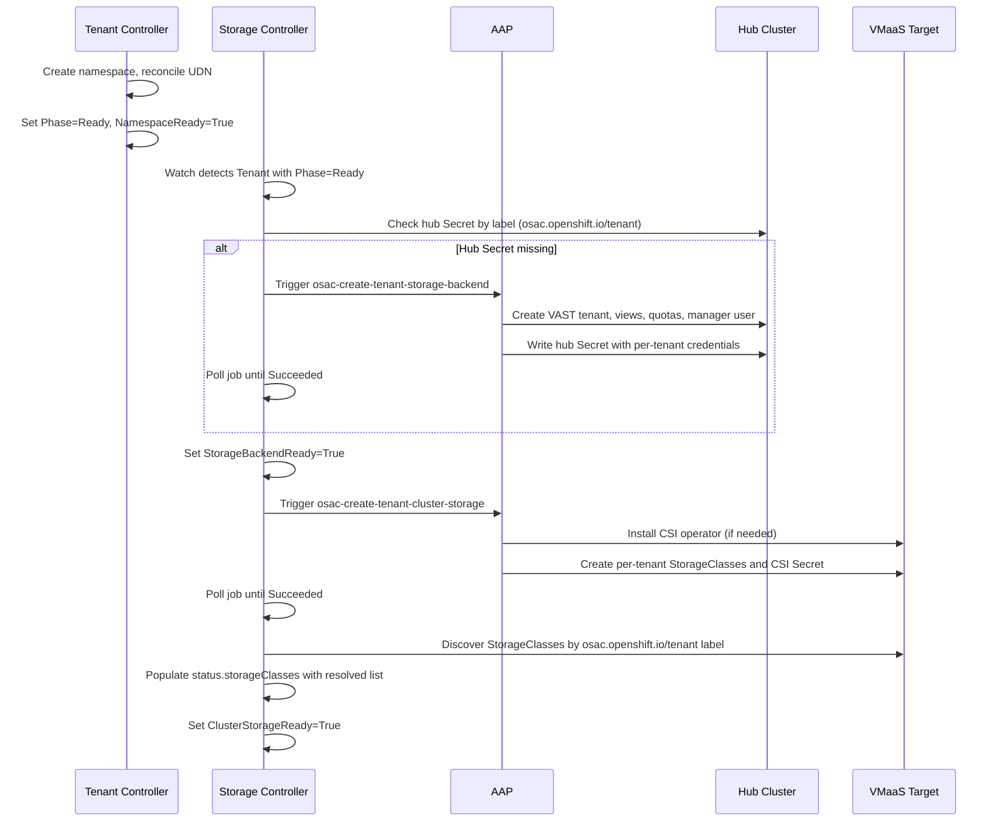
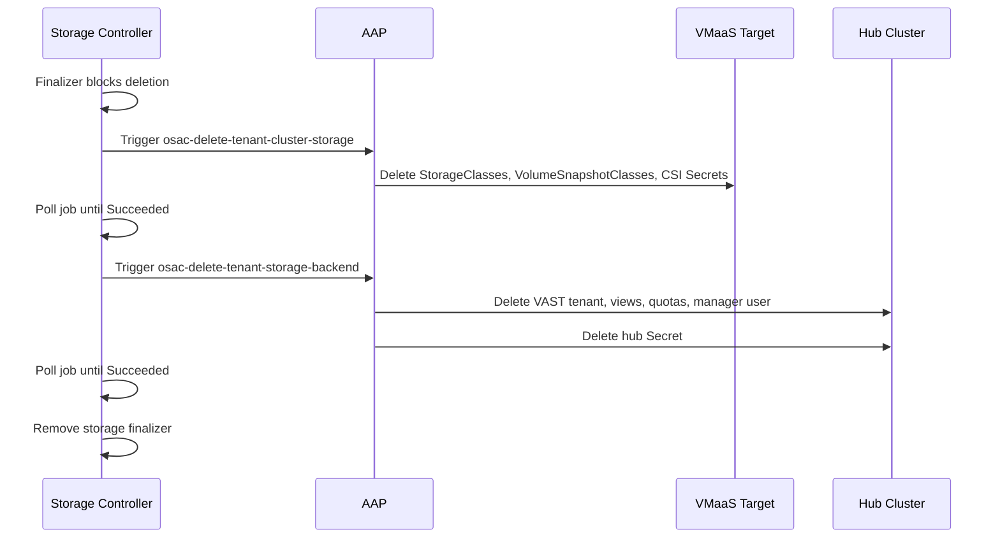
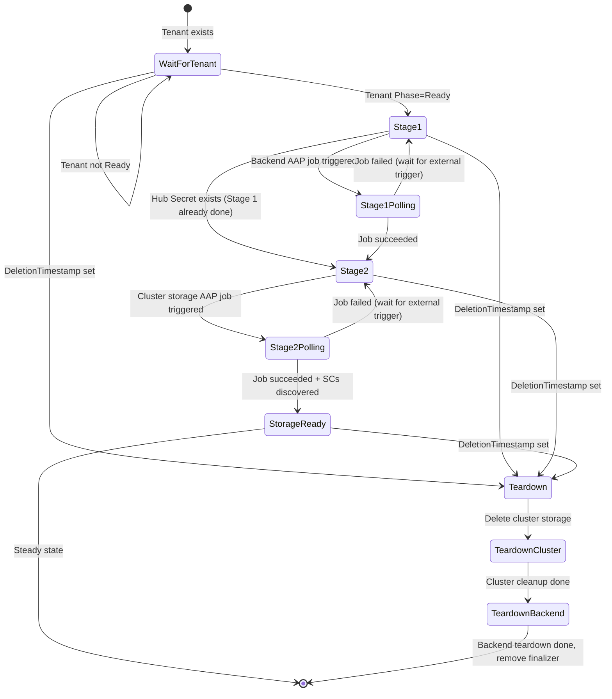

# Rework Tenant Storage Onboarding

## Summary

This enhancement extracts all storage provisioning logic from the Tenant controller into a dedicated OSAC Storage Controller that owns storage-related conditions and status on the Tenant CR using the condition ownership pattern. The storage controller manages a two-stage onboarding workflow (backend setup via AAP, then cluster-side StorageClass installation via AAP) and a two-step ordered teardown, with four independent AAP playbooks replacing the current combined playbooks. See [PRD](prd.md) for detailed requirements.

## Motivation

Storage provisioning logic is currently embedded in the Tenant controller alongside namespace creation, UDN reconciliation, and tenant lifecycle management. The Tenant controller handles StorageClass resolution via a tier-based fallback algorithm, triggers AAP jobs for storage provisioning, polls job status, and manages the `StorageClassReady` condition. This coupling means any change to storage onboarding risks breaking tenant state transitions, and supporting different storage workflows per delivery model (VMaaS, CaaS, BMaaS) requires branching logic inside the Tenant controller.

The current AAP integration compounds the coupling: a single playbook (`playbook_osac_configure_tenant_storage.yml`) executes both backend setup and cluster-side StorageClass creation in sequence. This makes it impossible for the controller to trigger or retry each stage independently, which is required when CaaS clusters are provisioned after tenant onboarding.

This design introduces a dedicated OSAC Storage Controller that owns all storage lifecycle on the Tenant CR. The Tenant controller is simplified to manage only namespace and UDN reconciliation, with `Phase=Ready` determined solely by namespace readiness. Storage readiness is tracked independently via two new conditions (`StorageBackendReady` and `ClusterStorageReady`) owned by the storage controller.

### Goals

- Reuse the existing controller reconciliation pattern (finalizer, status DeepCopy, conditional update) and the `ProvisioningProvider` interface for AAP integration.
- Implement Stage 1 and Stage 2 as independently triggerable operations so CaaS support can be added without modifying the storage controller's core logic.
- Maintain backward compatibility for the ComputeInstance controller, which reads `status.storageClasses` from the Tenant CR.
- Support per-backend and per-cluster status detail on the Tenant CR for observability via `kubectl get tenant`.

### Non-Goals

- StorageBackend API and registration automation (OSAC-1111).
- StorageTier API (OSAC-1110).
- Tier addition and removal workflows.
- CaaS Tenant Storage Setup: Stage 2 trigger logic for CaaS clusters (OSAC-1123, separate PRD).
- VAST support for CaaS (OSAC-1122).
- Per-cluster storage resource on target clusters for tenant admin visibility.
- Fulfillment-service API or proto changes for storage state visibility.

## Proposal

This design introduces three changes:

1. A new OSAC Storage Controller in `osac-operator` that watches Tenant resources and manages the full storage lifecycle: backend provisioning (Stage 1), cluster-side StorageClass installation (Stage 2), and ordered two-step teardown. The controller uses two `ProvisioningProvider` instances (one for backend AAP templates, one for cluster-storage AAP templates) and sets two conditions on the Tenant CR: `StorageBackendReady` and `ClusterStorageReady`.

2. The Tenant controller is stripped of all storage logic. It retains namespace creation, UDN reconciliation, and the `NamespaceReady` condition. `Phase=Ready` is determined by namespace readiness alone. The `StorageClassReady` condition is replaced by the two new conditions managed by the storage controller.

3. The AAP playbooks in `osac-aap` are split from two combined playbooks into four lifecycle actions (`osac-create-tenant-storage-backend`, `osac-create-tenant-cluster-storage`, `osac-delete-tenant-cluster-storage`, `osac-delete-tenant-storage-backend`), each calling the existing `osac.service.storage_provider` dispatcher role with the appropriate action.

### Workflow Description

#### Actors

- **Platform Admin**: Configures storage backends, deploys osac-operator and osac-aap, creates Tenant CRs.
- **Storage Controller**: Automated actor that reconciles storage state on Tenant CRs.
- **AAP**: Ansible Automation Platform that executes storage provisioning/teardown playbooks.

#### Onboarding Workflow

Starting state: A Tenant CR exists and the Tenant controller has set `Phase=Ready` (namespace exists, UDN reconciled).



The storage controller watches Tenant CRs for `Phase=Ready`. On detecting a ready Tenant, it begins Stage 1 by querying Secrets in `OSAC_STORAGE_CONFIG_NAMESPACE` with label `osac.openshift.io/tenant=<tenantName>`. If no matching Secret exists, the controller triggers the `osac-create-tenant-storage-backend` AAP playbook and polls until the job completes. On success, the controller sets `StorageBackendReady=True`.

After Stage 1 completes, Stage 2 begins. The controller triggers `osac-create-tenant-cluster-storage` on the VMaaS target cluster, polls until completion, then discovers installed StorageClasses using the `osac.openshift.io/tenant` label. When all expected StorageClasses are present, the controller populates `status.storageClasses` and sets `ClusterStorageReady=True`.

#### Teardown Workflow

Starting state: A Tenant CR is being deleted (DeletionTimestamp set).



The storage controller places its own finalizer (`osac.openshift.io/storage`) on the Tenant CR. On deletion, it executes an ordered two-step teardown: first cluster-side cleanup via `osac-delete-tenant-cluster-storage`, then backend teardown via `osac-delete-tenant-storage-backend`. The finalizer is removed only after both steps complete successfully. If either step fails, the finalizer remains and the Tenant stays in Terminating until the issue is resolved.

#### Error Handling

- **Stage 1 AAP job failure**: `StorageBackendReady` is set to `False` with a reason reflecting the failure. The controller does not auto-retry after failure. It waits for an external trigger (Tenant CR update, Secret watch event) to avoid infinite retry loops. This follows the same pattern used by the existing Tenant controller and other OSAC controllers. [Codebase: osac-operator/internal/controller/tenant_controller.go, line 250]
- **Stage 2 AAP job failure**: `ClusterStorageReady` is set to `False` with a reason. Same retry behavior as Stage 1: waits for an external trigger (Tenant CR update, StorageClass watch event). Stage 1 status is unaffected.
- **Teardown failure**: The finalizer remains in place. The controller waits for the next reconciliation trigger (typically a requeue from the controller-runtime error handler). The Tenant stays in Terminating, and `kubectl get tenant` shows the failure reason via conditions.

### API Extensions

This enhancement modifies the Tenant CRD (owned by this team) and adds a new controller. No new CRDs are introduced.

**Modified resources:**
- `Tenant` CRD: new conditions (`StorageBackendReady`, `ClusterStorageReady`), new status fields (`storageBackends`, `clusterStorage`), removal of `StorageClassReady` condition.

**New finalizer:**
- `osac.openshift.io/storage` on Tenant CRs, managed by the storage controller. Coexists with the existing `osac.openshift.io/tenant` finalizer managed by the Tenant controller.

**Operational impact:** If the storage controller is down, Tenant CRs continue to reach `Phase=Ready` (namespace + UDN are managed by the Tenant controller). Storage conditions remain in their last-known state. New tenants do not get storage provisioned until the storage controller recovers. Tenant deletion is blocked if the storage finalizer is present and the controller is unavailable.

### Implementation Details/Notes/Constraints

#### Tenant CRD Type Changes

The Tenant status is extended with per-backend and per-cluster detail structs:

```go
type StorageBackendStatus struct {
    // Name is the storage backend identifier (e.g., "vast-1").
    Name string `json:"name"`
    // Provider is the storage provider type (e.g., "vast").
    Provider string `json:"provider"`
    // Ready indicates whether this backend is provisioned for the tenant.
    Ready bool `json:"ready"`
    // Message provides human-readable status or error information.
    Message string `json:"message,omitempty"`
}

type ClusterStorageStatus struct {
    // ClusterName identifies the target cluster.
    ClusterName string `json:"clusterName"`
    // Ready indicates whether StorageClasses are installed on this cluster.
    Ready bool `json:"ready"`
    // Reason provides a machine-readable reason for the current state.
    Reason string `json:"reason,omitempty"`
}
```

The TenantStatus struct is updated:

```go
type TenantStatus struct {
    Phase          TenantPhaseType          `json:"phase,omitempty"`
    Namespace      string                   `json:"namespace,omitempty"`
    StorageClasses []ResolvedStorageClass   `json:"storageClasses,omitempty"`
    Conditions     []metav1.Condition       `json:"conditions,omitempty" patchStrategy:"merge" patchMergeKey:"type"`
    Jobs           []JobStatus              `json:"jobs,omitempty"`

    // StorageBackends tracks per-backend provisioning status.
    // +kubebuilder:validation:Optional
    // +listType=map
    // +listMapKey=name
    StorageBackends []StorageBackendStatus   `json:"storageBackends,omitempty"`

    // ClusterStorage tracks per-cluster StorageClass installation status.
    // +kubebuilder:validation:Optional
    // +listType=map
    // +listMapKey=clusterName
    ClusterStorage  []ClusterStorageStatus   `json:"clusterStorage,omitempty"`
}
```

New condition types and reasons:

```go
const (
    TenantConditionStorageBackendReady  TenantConditionType = "StorageBackendReady"
    TenantConditionClusterStorageReady  TenantConditionType = "ClusterStorageReady"
)

const (
    TenantReasonProvisioning     = "Provisioning"
    TenantReasonProvisionFailed  = "ProvisionFailed"
    TenantReasonDeprovisioning   = "Deprovisioning"
    TenantReasonDeprovisionFailed = "DeprovisionFailed"
    TenantReasonSecretNotFound   = "SecretNotFound"
    TenantReasonTenantNotReady   = "TenantNotReady"
)
```

The existing `TenantConditionStorageClassReady` is removed. The existing `TenantConditionNamespaceReady` is unchanged.

Updated print columns:

```go
// +kubebuilder:printcolumn:name="Tenant Namespace",type=string,JSONPath=`.status.namespace`
// +kubebuilder:printcolumn:name="Storage Classes",type=string,JSONPath=`.status.storageClasses[*].name`
// +kubebuilder:printcolumn:name="Phase",type=string,JSONPath=`.status.phase`
// +kubebuilder:printcolumn:name="Backend Ready",type=string,JSONPath=`.status.conditions[?(@.type=="StorageBackendReady")].status`,priority=1
// +kubebuilder:printcolumn:name="Cluster Storage",type=string,JSONPath=`.status.conditions[?(@.type=="ClusterStorageReady")].status`,priority=1
```

The storage condition columns use `priority=1`, meaning they appear only with `kubectl get tenant -o wide`. This keeps the default output compact (Namespace, Storage Classes, Phase) while making storage condition detail accessible when needed.

#### Storage Controller Architecture

The storage controller is a new controller in `osac-operator/internal/controller/storage_controller.go` that watches Tenant CRs. It uses two `ProvisioningProvider` instances:

- `backendProvider`: configured with `OSAC_STORAGE_BACKEND_AAP_PROVISION_TEMPLATE` (default: `osac-create-tenant-storage-backend`) and `OSAC_STORAGE_BACKEND_AAP_DEPROVISION_TEMPLATE` (default: `osac-delete-tenant-storage-backend`).
- `clusterStorageProvider`: configured with `OSAC_STORAGE_CLUSTER_AAP_PROVISION_TEMPLATE` (default: `osac-create-tenant-cluster-storage`) and `OSAC_STORAGE_CLUSTER_AAP_DEPROVISION_TEMPLATE` (default: `osac-delete-tenant-cluster-storage`).

```go
type StorageReconciler struct {
    client.Client
    Scheme                 *runtime.Scheme
    Recorder               events.EventRecorder
    mgr                    mcmanager.Manager
    targetCluster          mc.ClusterName
    storageNamespace       string
    BackendProvider        provisioning.ProvisioningProvider
    ClusterStorageProvider provisioning.ProvisioningProvider
    StatusPollInterval     time.Duration
    MaxJobHistory          int
}
```

#### Reconciliation State Machine

The storage controller reconciles Tenant CRs through a multi-stage state machine:



The controller does not use an explicit phase field. Instead, it derives the current stage from the state of conditions and the hub Secret:

1. **Tenant not Ready**: Set both conditions to `False` with reason `TenantNotReady`. Requeue.
2. **Stage 1 (Backend)**: Query Secrets in `OSAC_STORAGE_CONFIG_NAMESPACE` with label `osac.openshift.io/tenant=<tenantName>`. If no matching Secret exists, trigger `backendProvider.TriggerProvision()`. Poll until terminal. On success, set `StorageBackendReady=True` and populate `status.storageBackends`.
3. **Stage 2 (Cluster Storage)**: If `StorageBackendReady=True`, trigger `clusterStorageProvider.TriggerProvision()`. Poll until terminal. Discover StorageClasses on target cluster. On success, set `ClusterStorageReady=True`, populate `status.storageClasses` and `status.clusterStorage`.
4. **Deletion**: Two-step teardown using the respective deprovision methods. Remove finalizer only after both complete.

The state machine is implicit rather than explicit: each reconciliation reads the current conditions, hub Secret state, and latest jobs to determine the next action. This follows the Kubernetes controller pattern of level-triggered reconciliation.

#### Tier Resolution Algorithm

The tier resolution algorithm moves from the Tenant controller to the storage controller. The logic is identical to the current implementation in `getTenantStorageClasses()` [Codebase: osac-operator/internal/controller/tenant_controller.go]:

1. Query StorageClasses on the target cluster with label `osac.openshift.io/tenant={tenantName}`.
2. Query StorageClasses with label `osac.openshift.io/tenant=Default`.
3. Group both lists by the `osac.openshift.io/storage-tier` label.
4. For each tier: use tenant-specific SC if exactly one exists; fall back to shared Default if exactly one exists; emit a warning event if duplicates are found.
5. Populate `status.storageClasses` with the resolved list.

The tier label validation pattern (`^[a-z0-9]([a-z0-9._-]*[a-z0-9])?$`) is preserved unchanged.

#### Tenant Controller Simplification

The Tenant controller is modified to remove all storage logic [FR-2]:

**Removed:**
- `getTenantStorageClasses()`, `groupByTier()`, `handleStorageProvisioning()`, `pollProvisionJob()`, `needsProvisionJob()`
- `TenantConditionStorageClassReady` condition management
- `status.StorageClasses` population
- StorageClass watch in `SetupWithManager`
- `ProvisioningProvider` field and AAP integration
- `storagev1` import

**Retained:**
- Namespace creation and verification on the target cluster
- UDN reconciliation
- `NamespaceReady` condition management
- `osac.openshift.io/tenant` finalizer for namespace cleanup on deletion
- Phase management: `Progressing` until namespace exists, `Ready` when namespace is ready

**Phase logic change:** `Phase=Ready` is set when `NamespaceReady=True`. Storage conditions are not consulted. This decouples the tenant lifecycle from the storage lifecycle [User].

#### Controller Registration

A new `setupStorageController()` function is added to `cmd/main.go` following the existing pattern [Codebase: osac-operator/cmd/main.go]:

```go
func setupStorageController(mgr mcmanager.Manager, maxJobHistory int) error {
    backendProvider, backendPollInterval, err := createAAPProviderFromEnv(
        "OSAC_STORAGE_BACKEND_AAP_PROVISION_TEMPLATE",
        "OSAC_STORAGE_BACKEND_AAP_DEPROVISION_TEMPLATE",
    )
    if err != nil {
        return fmt.Errorf("backend provider: %w", err)
    }

    clusterStorageProvider, clusterPollInterval, err := createAAPProviderFromEnv(
        "OSAC_STORAGE_CLUSTER_AAP_PROVISION_TEMPLATE",
        "OSAC_STORAGE_CLUSTER_AAP_DEPROVISION_TEMPLATE",
    )
    if err != nil {
        return fmt.Errorf("cluster storage provider: %w", err)
    }

    return NewStorageReconciler(
        mgr,
        storageNamespace,
        targetCluster,
        backendProvider,
        clusterStorageProvider,
        max(backendPollInterval, clusterPollInterval),
        maxJobHistory,
    ).SetupWithManager(mgr)
}
```

The controller is gated by `OSAC_ENABLE_STORAGE_CONTROLLER` / `--enable-storage-controller`, following the existing enable-flag pattern.

#### AAP Playbook Split

The two combined playbooks are split into four lifecycle playbooks [FR-8]:

| Current Playbook | New Playbooks | Dispatcher Action |
|---|---|---|
| `playbook_osac_configure_tenant_storage.yml` | `playbook_osac_create_tenant_storage_backend.yml` | `setup` |
| | `playbook_osac_create_tenant_cluster_storage.yml` | `ensure_storage_class` |
| `playbook_osac_delete_tenant_storage.yml` | `playbook_osac_delete_tenant_cluster_storage.yml` | `teardown_cluster_storage` |
| | `playbook_osac_delete_tenant_storage_backend.yml` | `teardown_backend` |

The `osac.service.storage_provider` dispatcher role already supports `setup` and `ensure_storage_class` actions. For the teardown split, the existing `teardown` action is replaced with two new actions: `teardown_cluster_storage` (deletes StorageClasses, VolumeSnapshotClasses, CSI Secrets on the target cluster) and `teardown_backend` (deletes VAST tenant, views, quotas, manager user, and hub Secret). The VAST provider role's `teardown.yaml` is split into `teardown_cluster_storage.yaml` and `teardown_backend.yaml` accordingly.

PR #338 (OSAC-1145) covers this playbook split. The combined playbooks are removed after the split is merged.

#### ClusterOrder Watch

The storage controller establishes a watch on ClusterOrder resources to detect new CaaS clusters [FR-9]. No reconciliation logic is executed on ClusterOrder events in this scope. The watch is registered in `SetupWithManager` with an empty event handler that enqueues the parent Tenant for reconciliation:

```go
func (r *StorageReconciler) SetupWithManager(mgr mcmanager.Manager) error {
    return mcbuilder.ControllerManagedBy(mgr).
        For(&v1alpha1.Tenant{}, /* ... */).
        Watches(&v1alpha1.ClusterOrder{},
            mchandler.EnqueueRequestForOwner(mgr.GetLocalManager().GetScheme(),
                mgr.GetLocalManager().GetRESTMapper(),
                &v1alpha1.Tenant{})).
        Watches(&storagev1.StorageClass{}, /* ... enqueue Tenant by label */).
        Complete(r)
}
```

The ClusterOrder watch provides the foundation for CaaS Stage 2 trigger logic, which is defined in a separate PRD (OSAC-1123).

### Security Considerations

This enhancement inherits the existing OSAC security model without changes.

**Credential isolation** [NFR-1, NFR-2]:
- Admin credentials (VAST endpoint, username, password) are stored in the `storage-operations-ig` Secret, mounted as environment variables in the AAP pod, and cleared from playbook memory after use. The storage controller never accesses these credentials.
- Per-tenant credentials are stored in hub Secrets (`vast-tenant-config-{tenant_name}`) in `OSAC_STORAGE_CONFIG_NAMESPACE`. The storage controller reads these Secrets only to verify their existence (Stage 1 gate check), never their contents.
- CSI credentials (`vast-csi-{tenant_name}`) are created by AAP in the tenant namespace with per-tenant manager credentials (not admin credentials).

**Credential-safe logging** [NFR-4]:
- The storage controller must not log Secret contents, AAP job parameters containing credentials, or VAST API responses containing sensitive data. Log messages reference Secret names and job IDs only.
- Kubernetes events emitted by the controller must not include credential values.

**Tenant isolation:**
- The storage controller operates in the `osac-system` namespace and is scoped to Tenant CRs. StorageClass discovery on the target cluster uses label-based filtering (`osac.openshift.io/tenant={tenantName}`), which prevents cross-tenant data access.
- OPA policies continue to enforce tenant isolation at runtime.

### Failure Handling and Recovery

| Failure Mode | System Behavior | User Observation | Recovery |
|---|---|---|---|
| Stage 1 AAP job fails | `StorageBackendReady=False`, reason: `ProvisionFailed`, message includes AAP error. Controller waits for external trigger (Tenant update, Secret event). | `kubectl get tenant` shows `Backend Ready: False`. Events show failure reason. | Fix the underlying AAP issue. Update the Tenant CR or wait for a Secret event to trigger re-reconciliation. |
| Stage 2 AAP job fails | `ClusterStorageReady=False`, reason: `ProvisionFailed`. Stage 1 status unaffected. Controller waits for external trigger. | `kubectl get tenant` shows `Cluster Storage: False`, `Backend Ready: True`. | Fix AAP or target cluster issue. Update the Tenant CR or wait for a StorageClass event to trigger re-reconciliation. |
| Hub Secret missing after Stage 1 success | Controller detects inconsistency, sets `StorageBackendReady=False`, retriggers Stage 1. | Transient `Backend Ready: False` until reprovisioned. | Automatic recovery via Stage 1 reprovisioning. |
| StorageClasses deleted on target cluster | StorageClass watch triggers reconciliation. Controller detects missing SCs, sets `ClusterStorageReady=False`, retriggers Stage 2. | `kubectl get tenant` shows `Cluster Storage: False`. | Automatic recovery via Stage 2 reprovisioning. |
| Teardown cluster-side fails | Finalizer remains. `ClusterStorageReady` condition message reflects failure. Controller waits for next reconciliation trigger. | Tenant stuck in `Terminating`. Events show failure. | Fix target cluster issue. Controller retries on next reconcile. Manual intervention: remove finalizer if unrecoverable. |
| Teardown backend fails | Finalizer remains. `StorageBackendReady` condition message reflects failure. Controller waits for next reconciliation trigger. | Tenant stuck in `Terminating`. | Fix VAST/AAP issue. Controller retries on next reconcile. |
| Storage controller down | Existing conditions and status preserved. Tenant lifecycle (namespace, UDN) unaffected. | `kubectl get tenant` shows stale storage conditions. New tenants lack storage. | Restart the storage controller. It reconciles all Tenants on startup. |
| Status update conflict (two controllers writing Tenant status) | Controller retries with conflict retry loop. | No user-visible impact. | Automatic via Kubernetes optimistic concurrency. |

**Idempotency:**
- Stage 1 is idempotent: the AAP `setup` action checks for existing VAST resources before creating. Retriggering Stage 1 is safe.
- Stage 2 is idempotent: the AAP `ensure_storage_class` action checks for existing StorageClasses by label before creating. Retriggering Stage 2 is safe.
- Both teardown steps are idempotent: AAP playbooks handle already-deleted resources gracefully.

**Controller restart mid-reconciliation:**
- If the controller restarts between Stage 1 and Stage 2, it reads the current state (conditions, hub Secret, StorageClasses) and resumes from the appropriate stage. No explicit checkpoint is needed.
- If the controller restarts during teardown, it checks which teardown steps have completed (by querying the target cluster and hub Secret) and resumes the sequence.

### RBAC / Tenancy

The storage controller requires the following RBAC permissions on the hub (management) cluster:

```go
// +kubebuilder:rbac:groups=osac.openshift.io,resources=tenants,verbs=get;list;watch;update;patch
// +kubebuilder:rbac:groups=osac.openshift.io,resources=tenants/status,verbs=get;update;patch
// +kubebuilder:rbac:groups=osac.openshift.io,resources=tenants/finalizers,verbs=update
// +kubebuilder:rbac:groups=osac.openshift.io,resources=clusterorders,verbs=get;list;watch
// +kubebuilder:rbac:groups="",resources=secrets,verbs=get;list;watch
// +kubebuilder:rbac:groups=events.k8s.io,resources=events,verbs=create;patch
```

On the target (workload) cluster, the storage controller requires:

```go
// +kubebuilder:rbac:groups=storage.k8s.io,resources=storageclasses,verbs=get;list;watch
```

The Tenant controller's RBAC is reduced: `storage.k8s.io/storageclasses` permissions are removed since it no longer manages StorageClasses.

No tenancy model changes are required. The storage controller operates on Tenant CRs in the `osac-system` namespace. Tenant isolation is enforced by the existing `osac.openshift.io/tenant` label on StorageClasses and the namespace-scoped hub Secrets.

### Observability and Monitoring

**Kubernetes events (Normal):**
- `StorageBackendProvisioned`: Emitted when Stage 1 completes successfully for a tenant.
- `ClusterStorageProvisioned`: Emitted when Stage 2 completes and all StorageClasses are discovered.
- `StorageTeardownComplete`: Emitted when both teardown steps complete successfully.

**Kubernetes events (Warning):**
- `StorageProvisionFailed`: Emitted when a Stage 1 or Stage 2 AAP job fails. Message includes the AAP job ID and error.
- `StorageTeardownFailed`: Emitted when a teardown step fails. Message includes the step and error.
- `DuplicateStorageClass`: Preserved from the current tenant controller. Emitted when multiple StorageClasses match for the same tier.

**Structured log events:**
- `"start storage reconcile"`, `"end storage reconcile"`: Bookend each reconciliation with tenant name.
- `"triggering backend provisioning"`, `"backend provisioning succeeded"`: Stage 1 lifecycle.
- `"triggering cluster storage provisioning"`, `"cluster storage provisioning succeeded"`: Stage 2 lifecycle.
- `"storage teardown: cluster-side complete"`, `"storage teardown: backend complete"`: Teardown progress.

All log events follow the existing controller logging pattern (structured key-value pairs via `ctrllog`). No credentials or Secret contents are included in log messages [NFR-4].

**Prometheus metrics:** No new metrics are introduced in this iteration. The existing controller-runtime metrics (reconciliation duration, queue depth, error count) apply to the storage controller automatically.

### Risks and Mitigations

| Risk | Likelihood | Impact | Mitigation |
|---|---|---|---|
| Two controllers writing Tenant status concurrently causes conflicts | Medium | Low (transient reconciliation delays) | Kubernetes optimistic concurrency handles conflicts. Both controllers use the DeepCopy-compare-update pattern. Conflict retries are automatic. |
| AAP playbook split (PR #338) and operator changes deployed out of sync | Medium | High (storage provisioning breaks) | NFR-3 mandates coordinated deployment. Document the deployment order in release notes. CI can validate compatibility. |
| Storage controller reconciliation increases Tenant CR update frequency | Low | Low (minor API server load) | The storage controller only updates status when conditions change. The DeepCopy-compare pattern prevents no-op updates. |

### Drawbacks

The primary drawback is increased operational complexity: two controllers now manage state on the same Tenant CR. This requires understanding which controller owns which conditions and finalizers when debugging tenant issues. However, this trade-off is justified because:

- The storage lifecycle is genuinely independent from the tenant lifecycle (different failure modes, different recovery paths, different AAP integrations).
- The current approach (everything in one controller) blocks CaaS support without significant branching logic.
- Condition ownership is a well-established Kubernetes pattern (used by cluster-api, machine-api, and other multi-controller systems).

## Alternatives (Not Implemented)

### Alternative 1: Dedicated TenantStorage CRD

Instead of managing storage conditions on the Tenant CR, introduce a separate `TenantStorage` CRD with a 1:1 relationship to the Tenant. The storage controller would reconcile `TenantStorage` resources instead of Tenant resources.

**Pros:** Clean ownership boundary. No risk of status conflicts between controllers. The storage controller has its own Phase field.

**Cons:** Adds a new CRD that must be created, watched, and garbage-collected. The ComputeInstance controller would need to read StorageClasses from `TenantStorage` instead of `Tenant`, breaking the existing API contract. Rejected during PRD review (Avishay) in favor of condition ownership.

### Alternative 2: Single ProvisioningProvider with Template Switching

Instead of two `ProvisioningProvider` instances, extend the `ProvisioningProvider` interface to accept a template name parameter on each call, allowing a single provider to trigger different AAP templates.

**Pros:** Single provider instance, simpler configuration.

**Cons:** Breaks the existing interface contract used by all other controllers. Requires modifying the `ProvisioningProvider` interface and all implementations. The two-provider approach is cleaner: each provider is configured independently and can have different polling intervals if needed.

### Alternative 3: Keep Storage Logic in Tenant Controller

Do nothing. Continue managing storage in the Tenant controller, adding branching logic for VMaaS vs CaaS delivery models.

**Pros:** No new controller. Simpler deployment.

**Cons:** Increasing complexity in the Tenant controller. CaaS support requires Stage 2 to be triggered by ClusterOrder events, which adds a fundamentally different reconciliation trigger to the Tenant controller. Storage issues cannot be diagnosed independently. Rejected by the PRD problem statement.

## Test Plan

### Unit Tests

Unit tests cover the storage controller reconciliation logic using a mock `ProvisioningProvider`, following the existing controller test patterns [Codebase: osac-operator/internal/controller/tenant_controller_test.go]:

- **Stage 1 lifecycle:** Tenant not ready (skip), Tenant ready with no hub Secret (trigger provision), hub Secret exists (skip to Stage 2), provision job failure (set condition False, retry).
- **Stage 2 lifecycle:** Stage 1 not complete (wait), Stage 1 complete + no SCs (trigger provision), SCs discovered (set condition True, populate list), provision job failure (set condition False, retry).
- **Tier resolution:** Same test cases as the current tenant controller: tenant-specific SC, Default fallback, duplicate detection, missing tier, mixed scenarios.
- **Teardown:** Ordered two-step deprovision, partial failure (cluster-side done, backend failed), finalizer removal only after both complete.
- **Management state:** Skip steady-state reconciliation when `osac.openshift.io/management-state=Unmanaged`. Finalizer and deletion handling still run to prevent Tenants from being stuck in Terminating [FR-4].
- **Tenant controller:** Verify Phase=Ready with only NamespaceReady, no storage logic, no StorageClassReady condition.

### Integration Tests

Integration tests use envtest (kind cluster) to verify end-to-end controller behavior:

- Create Tenant, verify storage controller picks it up after Tenant reaches Ready.
- Verify condition updates propagate correctly.
- Verify finalizer coexistence (tenant + storage finalizers).
- Verify status conflict resolution when both controllers update simultaneously.

### E2E Tests

E2E tests in `osac-test-infra` validate the full storage onboarding lifecycle against a VAST appliance:

- Tenant creation triggers Stage 1 (hub Secret created) then Stage 2 (StorageClasses appear on target cluster).
- Tenant deletion triggers ordered teardown (cluster-side first, then backend).
- Verify StorageClasses are usable by ComputeInstance (PVC creation succeeds).

## Graduation Criteria

Graduation criteria will be defined when targeting a release. Expected stages: Dev Preview -> Tech Preview -> GA based on production deployment feedback.

## Upgrade / Downgrade Strategy

This is a pre-GA change. No upgrade migration is required. The existing `StorageClassReady` condition is removed and replaced by `StorageBackendReady` and `ClusterStorageReady`. Since there are no production tenants, no migration logic is needed.

**Deployment order:** Deploy the osac-operator changes first, then the osac-aap playbook split (PR #338). If the operator is deployed before AAP is updated, the storage controller calls templates that do not yet exist; AAP returns a "template not found" error, the controller records a Failed job, and retries automatically once AAP is updated. If AAP is deployed first, the old Tenant controller calls the old template name (`osac-create-tenant-storage` / `osac-create-org`) which no longer exists, breaking storage provisioning for all tenants until the operator catches up. Operator-first is the safer order because failures are transient and self-healing [NFR-3].

## Version Skew Strategy

During a rolling upgrade, the old Tenant controller and new storage controller may run briefly in parallel. Since the old controller writes `StorageClassReady` and the new controller writes `StorageBackendReady`/`ClusterStorageReady`, there is no condition name conflict. The old controller's `StorageClassReady` condition becomes orphaned after the upgrade and can be cleaned up manually or by a one-time migration script.

The storage controller does not interact with the fulfillment-service gRPC API, so there is no version skew concern with the fulfillment-service.

## Support Procedures

**Detecting storage provisioning failures:**
- `kubectl get tenant` shows `Backend Ready` or `Cluster Storage` as `False`.
- `kubectl describe tenant <name>` shows conditions with failure reasons and AAP job IDs.
- `kubectl get events --field-selector involvedObject.name=<tenant>` shows Warning events.
- Controller logs: `kubectl logs -n osac-system deployment/osac-operator-controller-manager | grep "storage"`.

**Disabling the storage controller:**
- Set `OSAC_ENABLE_STORAGE_CONTROLLER=false` or remove the `--enable-storage-controller` flag.
- Consequences: No new tenants get storage provisioned. Existing storage is unaffected. Tenant deletion is blocked if the storage finalizer is present (remove manually with `kubectl edit tenant <name>`).

**Disabling storage for a single tenant:**
- Set `osac.openshift.io/management-state: Unmanaged` annotation on the individual Tenant CR. The storage controller skips steady-state reconciliation for that tenant while continuing to manage storage for all others. Finalizer and deletion handling still run, so the Tenant can be deleted cleanly. Useful for debugging or manually managing storage for one tenant.

**Re-enabling:**
- Set the enable flag and restart the operator. The storage controller reconciles all Tenants on startup and provisions storage for any tenants that lack it. Consistency is maintained because all operations are idempotent.

## Infrastructure Needed

None.
